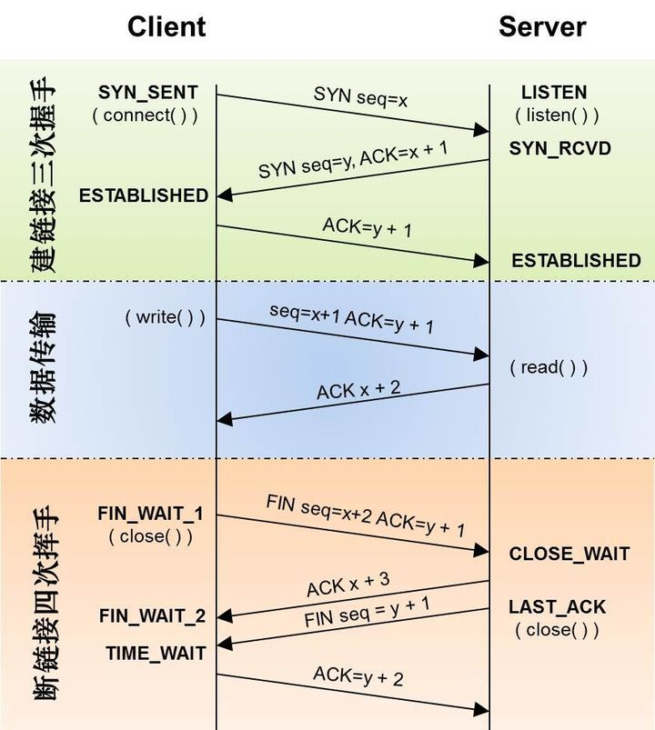
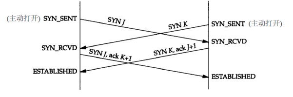
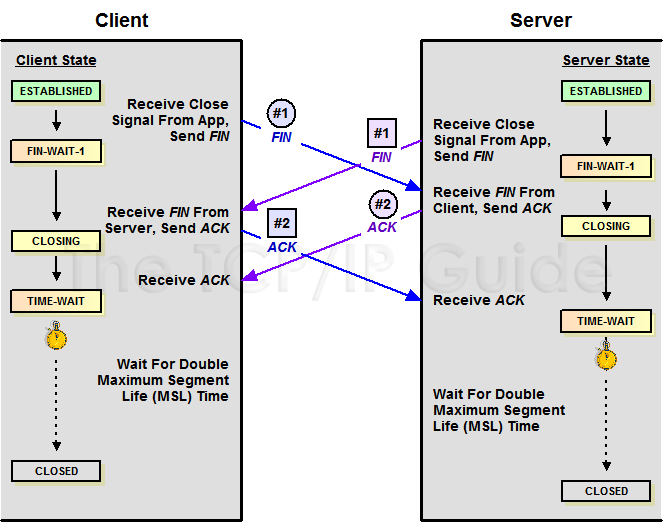
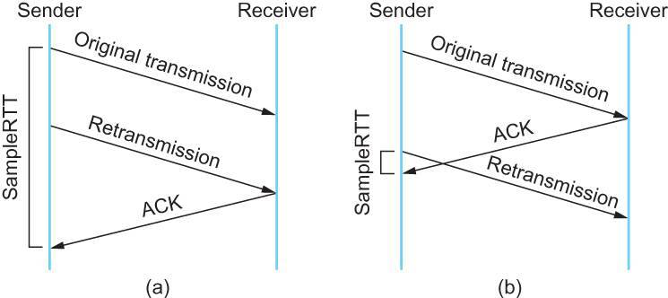
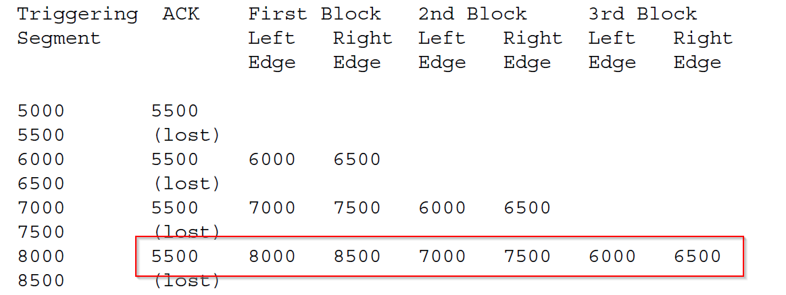
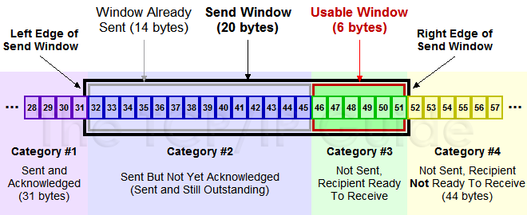
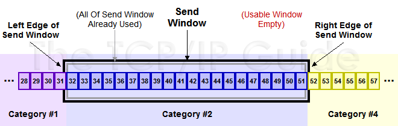
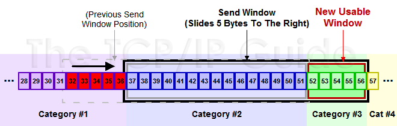
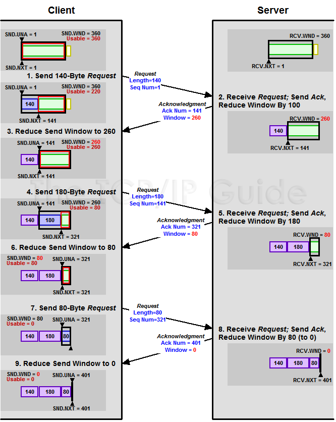
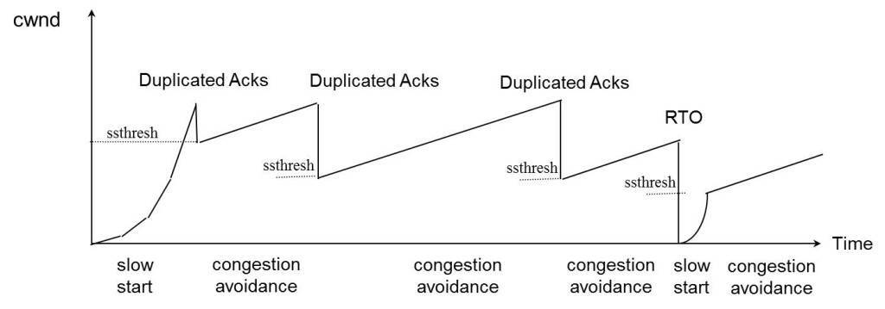

> 说到 TCP 协议，相信大家都比较熟悉了，对于 TCP 协议总能说个一二三来，但是 TCP 协议又是一个非常复杂的协议，其中有不少细节点让人头疼点。本文就是来说说这些头疼点的，浅谈一些 TCP 的疑难杂症。那么从哪说起呢？当然是从三次握手和四次挥手说起啦，可能大家都知道 TCP 是三次交互完成连接的建立，四次交互来断开一个连接，那为什么是三次握手和四次挥手呢？反过来不行吗？

## 1. TCP 的三次握手、四次挥手
下面两图大家再熟悉不过了，TCP 的三次握手和四次挥手见下面的“TCP 建立连接”、”TCP 数据传送”、”TCP 断开连接”时序图和的”TCP 协议状态机” 。




要弄清 TCP 建立连接需要的交互次数，我们需要弄清建立连接进行初始化的目标是什么。**TCP 进行握手初始化一个连接的目标是：分配资源、初始化序列号(通知 peer 对端我的初始序列号是多少)**。知道初始化连接的目标之后，要达成这个目标的过程就简单了，握手过程可以简化为下面的四次交互：

1. 客户端端首先发送一个 `SYN` 包告诉 服务器端我的初始序列号是 X；
2. 服务器端收到 `SYN` 包后回复给客户端一个 ACK 确认包，告诉客户端说我收到了；
3. 接着服务器端也需要告诉 客户端 端自己的初始序列号，于是 服务器也发送一个 `SYN` 包告诉客户端我的初始序列号是 Y；
4. 客户端收到后，回复 服务器一个 `ACK` 确认包说我知道了。

整个过程 4 次交互即可完成初始化，但是，细心的同学会发现两个问题：

- Q1：Server 发送 `SYN` 包是作为发起连接的 `SYN` 包，还是作为响应发起者的 `SYN` 包呢？怎么区分？  
  A1：Server 的 `ACK` 确认包和接下来的 `SYN` 包可以合成一个 `SYN-ACK` 包一起发送，没必要分别单独发送，这样省了一次交互同时也解决了问题.这样 TCP 建立一个连接，三次握手在进行最少次交互的情况下完成了 Peer 两端的资源分配和初始化序列号的交换。

大部分情况下建立连接需要三次握手，也不一定都是三次，有可能出现四次握手来建立连接的。如下图，当 Peer 两端同时发起 `SYN` 来建立连接的时候，就出现了四次握手来建立连接(对于有些 TCP/IP 的实现，可能不支持这种同时打开的情况)。



在三次握手过程中，细心的同学可能会有以下疑问：

- Q2：初始化序列号 X、Y 是可以是写死固定的吗，为什么不能呢？  
- Q3：假如客户端发送一个 `SYN` 包给 服务器后就挂了或是不管了，这个时候这个连接处于什么状态呢？会超时吗？为什么呢？

我们暂且摁住不表。

**TCP 进行断开连接的目标是：回收资源、终止数据传输**。由于 TCP 是全双工的，需要 Peer 两端分别各自拆除自己通向 Peer 对端方向的信道。这样需要四次挥手来分别拆除通信信道，就比较清晰明了了。

1. 客户端发送一个 `FIN` 包来告诉 服务器我已经没数据需要发给 服务器了；
2. 服务器收到后回复一个 `ACK` 确认包说我知道了；
3. 然后 服务器在自己也没数据发送给客户端后，服务器也发送一个 `FIN` 包给客户端告诉客户端我也已经没数据发给客户端了
4. 客户端收到后，就会回复一个 `ACK` 确认包说我知道了。

到此，四次挥手，这个 TCP 连接就可以完全拆除了。在四次挥手的过程中，细心的同学可能会有以下疑问：

- Q4：客户端和服务器同时发起断开连接的 `FIN` 包会怎么样呢，TCP 状态是怎么转移的?
- Q5：四次挥手过程中，服务器的 `ACK` 确认包能不能和接下来的 `FIN` 包合并成一个包呢，这样四次挥手就变成三次挥手了。

四次挥手过程中，首先断开连接的一端，在回复最后一个 `ACK` 后，为什么要进行 `TIME_WAIT` 呢(超时设置是 `2*MSL`，RFC793 定义 `MSL` 为 2 分钟，Linux 设置成了 30s)？在 `TIME_WAIT` 的时候又不能释放资源，白白让资源占用那么长时间，能不能省了 `TIME_WAIT` 呢，为什么？

## 2. TCP 连接的初始化序列号能否固定
如果初始化序列号（缩写为 `ISN`：Inital Sequence Number）可以固定，我们来看看会出现什么问题。假设 `ISN` 固定是 1，客户端和服务器建立好 TCP 连接后，客户端连续给服务器发了 10 个包，这 10 个包不知怎么被链路上的路由器缓存了(路由器会毫无先兆地缓存或者丢弃任何的数据包)，这个时候碰巧客户端挂掉了，然后客户端用同样的端口号重新连上服务器，客户端又连续给服务器发了几个包，假设这个时候客户端的序列号变成了 5。

因为之前被路由器缓存的 10 个数据包全部被路由到服务器端了，服务器给客户端回复确认号 10。这个时候，客户端整个都不好了，这是什么情况？我的序列号才到 5，你怎么给我的确认号是 10 了，整个都乱了。RFC793 中，建议 `ISN` 和一个假的时钟绑在一起，这个时钟会在每 4 微秒对 `ISN` 做加一操作，直到超过 2^32，又从 0 开始，这需要 4 小时才会产生 `ISN` 的回绕问题，这几乎可以保证每个新连接的 `ISN` 不会和旧的连接的 `ISN` 产生冲突。这种递增方式的 `ISN`，很容易让攻击者猜测到 TCP 连接的 `ISN`，现在的实现大多是在一个基准值的基础上进行随机的。

## 3. 初始化连接的 `SYN` 超时问题
客户端发送 `SYN` 包给服务器后挂了，服务器回给客户端的 `SYN-ACK` 一直没收到客户端的 `ACK` 确认，这个时候连接既没建立起来，也不能算失败。这就需要一个超时时间让服务器将这个连接断开，否则这个连接就会一直占用服务器的 `SYN` 连接队列中的一个位置，大量这样的连接就会将服务器的 `SYN` 连接队列耗尽，让正常的连接无法得到处理。目前，Linux 下默认会进行 5 次重发 `SYN-ACK` 包，重试的间隔时间从 1s 开始，下次的重试间隔时间是前一次的双倍，5 次的重试时间间隔为 1s、2s、4s、8s、16s，总共 31s，第 5 次发出后还要等 32s 才知道第 5 次也超时了，所以共需 1s + 2s + 4s + 8s + 16s + 32s = 63s 才会断开这个 TCP 连接。

由于 `SYN` 超时需要 63 秒，攻击者在这里就有了操作空间：在短时间内发送大量的 `SYN` 包给服务器(俗称 `SYN` 泛洪攻击)，用于耗尽服务器的 `SYN` 队列。为了处理 `SYN` 过多的问题，linux 提供了几个 TCP 参数：
- `tcp_syncookies`
- `tcp_synack_retries`
- `tcp_max_syn_backlog`
- `tcp_abort_on_overflow`

## 4. TCP 的 Peer 两端同时断开连接
由上面的”TCP 协议状态机“图可以看出：
- TCP 的 Peer 端在收到对端的 `FIN` 包前发出了 `FIN` 包，那么该 Peer 的状态就变成了 `FIN_WAIT1`
- Peer 在 `FIN_WAIT1` 状态下收到对端 Peer 对自己 `FIN` 包的 `ACK` 包的话，那么 Peer 状态就变成 `FIN_WAIT2`
- Peer 在 `FIN_WAIT2` 下收到对端 Peer 的 `FIN` 包，在确认已经收到了对端 Peer 全部的数据包后，就响应一个 `ACK` 给对端 Peer，然后自己进入 `TIME_WAIT` 状态。

但是如果 Peer 在 `FIN_WAIT1` 状态下首先收到对端 Peer 的 `FIN` 包的话，那么该 Peer 在确认已经收到了对端 Peer 全部的数据包后，就响应一个 `ACK` 给对端 Peer，然后自己进入 `CLOSEING` 状态，Peer 在 `CLOSEING` 状态下收到自己的 `FIN` 包的 `ACK` 包的话，那么就进入 `TIME_WAIT` 状态。于是，TCP 的 Peer 两端同时发起 `FIN` 包进行断开连接，那么两端 Peer 可能出现完全一样的状态转移 `FIN_WAIT1->CLOSEING->TIME_WAIT`，客户端和服务器最后同时进入 `TIME_WAIT` 状态。同时关闭连接的状态转移如下图所示：



## 5. 四次挥手能不能变成三次挥手呢？

答案是可能的。TCP 是全双工通信，已经不会在有新的数据要发送给服务器后，客户端可以发送 `FIN` 信号告知服务器：这边已经终止客户端到对端服务器那边的数据传输。但是这个时候对端服务器可以继续往客户端这边发送数据包。于是两端数据传输的终止在时序上是独立并且可能会相隔比较长的时间，这个时候就必须最少需要 2 + 2 = 4 次挥手来完全终止这个连接。但是如果服务器在收到客户端的 `FIN` 包后，也没数据需要发送给客户端了，那么对客户端的 `ACK` 包和服务器的 `FIN` 包就可以合并成为一个包发送过去，这样四次挥手就可以变成三次了(似乎 linux 协议栈就是这样实现的)

## 6. TCP 的头号疼症 `TIME_WAIT` 状态
要说明 `TIME_WAIT` 的问题，需要解答以下几个问题

### Peer 两端，哪一端会进入 `TIME_WAIT` 呢？为什么?
相信大家都知道，**TCP 主动关闭连接的那一方会最后进入 `TIME_WAIT`**。

那么怎么界定主动关闭方呢？是否主动关闭是由 `FIN` 包的先后决定的，就是在自己没收到对端 Peer 的 FIN 包之前自己发出了  `FIN` 包，那么自己就是主动关闭连接的那一方。对于第 4 节描@TODO 述的情况，Peer 两边都是主动关闭的一方，两边都会进入 `TIME_WAIT`。为什么是主动关闭的一方进行 `TIME_WAIT` 呢，被动关闭的进入 `TIME_WAIT` 可以不呢？我们来看看 TCP 四次挥手可以简单分为下面三个过程：

1. 主动关闭方发送 `FIN`；
2. 被动关闭方收到主动关闭方的 `FIN` 后发送该 `FIN` 的 `ACK`，被动关闭方发送 `FIN`；
3. 主动关闭方收到被动关闭方的 `FIN` 后发送该 `FIN` 的 `ACK`，被动关闭方等待自己 `FIN` 的 `ACK`。

问题就在第三步。据 TCP 协议规范，不对 `ACK` 进行 `ACK`。如果主动关闭方不进入 `TIME_WAIT`，在发送完 `ACK` 就走了的话，最后发送的 ACK 在路由过程中丢掉了，最后没能到被动关闭方，这个时候被动关闭方没收到自己 `FIN` 的 `ACK` 就不能关闭连接，接着被动关闭方会超时重发 `FIN` 包，但是这个时候已经没有对端会给该 `FIN` 回 `ACK`，被动关闭方就无法正常关闭连接了，所以**主动关闭方需要进入 `TIME_WAIT` 以便能够重发丢掉的被动关闭方 `FIN` 的 `ACK`**。

### `TIME_WAIT` 状态是用来解决或避免什么问题呢？
`TIME_WAIT` 主要是用来解决以下几个问题：

1. 上面解释为什么主动关闭方需要进入 `TIME_WAIT` 状态中提到的：主动关闭方需要进入 `TIME_WAIT` 以便能够重发丢掉的被动关闭方 `FIN` 包的 `ACK`。如果主动关闭方不进入 `TIME_WAIT`，那么在主动关闭方对被动关闭方 `FIN` 包的 `ACK` 丢失了的时候，被动关闭方由于没收到自己 `FIN` 的 `ACK`，会进行重传 `FIN` 包，这个 `FIN` 包到主动关闭方后，由于这个连接已经不存在于主动关闭方了，这个时候主动关闭方无法识别这个 `FIN` 包，协议栈会认为对方疯了，都还没建立连接你给我来个 `FIN` 包？于是回复一个 `RST` 包给被动关闭方，被动关闭方就会收到一个错误(我们见的比较多的：`connect reset by peer`。这里顺便说下 `Broken pipe`，在收到 `RST` 包的时候，还往这个连接写数据，就会收到 `Broken pipe` 错误)，原本应该正常关闭的连接，给我来个错误，很难让人接受。
2. 防止已经断开的连接 1 残留在链路的 `FIN` 包终止掉新的连接 2(重用了连接 1 的所有的 5 元素(源 IP，目的 IP，TCP，源端口，目的端口)），这个概率比较低，因为涉及到一个匹配问题，迟到的 `FIN` 分段的序列号必须落在连接 2 一方的期望序列号范围之内。虽然概率低，但是确实可能发生，因为初始序列号都是随机产生的，并且这个序列号是 32 位的，会回绕。
3. 防止链路上已经关闭连接的残余数据包干扰正常的数据包，造成数据流的不正常。以上问题 2 类似。

### `TIME_WAIT` 会带来哪些问题呢？
`TIME_WAIT` 带来的问题注意是源于：一个连接进入 `TIME_WAIT` 状态后需要等待 `2*MSL`(一般是 1 到 4 分钟)那么长的时间才能断开连接释放连接占用的资源，会造成以下问题：

- 作为服务器，短时间内关闭了大量的客户端连接，就会造成服务器上出现大量的 `TIME_WAIT` 连接，占据大量的 tuple，严重消耗着服务器的资源。
- 作为客户端，短时间内大量的短连接，会大量消耗的客户端机器的端口，毕竟端口只有 65535 个，端口被耗尽了，后续就无法在发起新的连接了。

由于上面两个问题，客户端需要连本机服务时，首选 UNIX 域套接字而不是 TCP。`TIME_WAIT` 很令人头疼，很多问题是由 `TIME_WAIT` 造成的，但是 `TIME_WAIT` 又不是多余的，不能简单将 `TIME_WAIT` 去掉，那么怎么来解决或缓解 `TIME_WAIT` 问题呢？可以进行 `TIME_WAIT` 的快速回收和重用来缓解 `TIME_WAIT` 的问题。有没一些清掉 `TIME_WAIT` 的技巧呢？

### `TIME_WAIT` 的快速回收和重用
#### 1. `TIME_WAIT` 快速回收
linux 下开启 `TIME_WAIT` 快速回收需要同时打开 `tcp_tw_recycle` 和 `tcp_timestamps`(默认打开)选项。Linux 下快速回收的时间为 3.5 * RTO（Retransmission Timeout），而一个 RTO 时间为 200ms 至 120s。开启快速回收 `TIME_WAIT`，可能会带来 “`TIME_WAIT` 状态是用来解决或避免什么问题呢？” @TODO 小节说的三点危险。为了避免这些危险，要求同时满足以下三种情况的新连接要被拒绝掉：

- 来自同一个对端 Peer 的 TCP 包携带了时间戳；
- 之前同一台 peer 机器(仅仅识别 IP 地址，因为连接被快速释放，没了端口信息)的某个 TCP 数据在 MSL 秒之内到过本 Server；
- Peer 机器新连接的时间戳小于 peer 机器上次 TCP 到来时的时间戳，且差值大于重放窗口戳(`TCP_PAWS_WINDOW`)。

初看起来正常的数据包同时满足下面 3 条几乎不可能，因为机器的时间戳不可能倒流的。出现上述的 3 点均满足时，一定是老的重复数据包又回来了，丢弃老的 `SYN` 包是正常的。因此，似乎启用快速回收就能很大程度缓解 `TIME_WAIT` 带来的问题。但是这里忽略了一个东西--NAT。

在 NAT 后面的所有 Peer 机器在服务器看来都是一个机器，NAT 后面的那么多 Peer 机器的系统时间戳很可能快慢不一。在服务器关闭了与系统时间戳快的客户端的连接后，在这个连接进入快速回收的时候，同一 NAT 后面的系统时间戳慢的客户端向服务器发起连接，就很有可能同时满足上面的三个条件，造成该连接被服务器拒绝掉。所以，是否开启 `tcp_tw_recycle` 需要慎重考虑了

#### 2. `TIME_WAIT` 重用

linux 上比较完美的实现了 `TIME_WAIT` 重用问题。只要满足下面两点中的一点，一个 TW 状态的四元组(即一个 socket 连接)可以重新被新到来的 `SYN` 连接使用。

1. 新连接 `SYN` 告知的初始序列号比 `TIME_WAIT` 老连接的末序列号大；
2. 如果开启了 `tcp_timestamps`，并且新连接的时间戳比老连接的时间戳大。

要同时开启 `tcp_tw_reuse` 和 `tcp_timestamps` 选项才可以开启 `TIME_WAIT` 重用，还有一个条件是：重用  `TIME_WAIT` 的条件是收到最后一个包后超过 1s。细心的同学可能发现 `TIME_WAIT` 重用对服务器端来说并没解决大量  `TIME_WAIT` 造成的资源消耗的问题，因为不管 `TIME_WAIT` 连接是否被重用，它依旧占用着系统资源。即便如此，`TIME_WAIT` 重用还是有些用处的：它解决了整机范围拒绝接入的问题，虽然一般单独的客户端不可能在 MSL 内用同一个端口连接同一个服务的，但是如果客户端做了，绑定的端口就是同一个端口了。时间戳重用 `TIME_WAIT` 连接机制的前提是 IP 地址唯一性，得出新请求发起自同一台机器，但是如果是 NAT 环境下就不能这样保证了，于是在 NAT 环境下，`TIME_WAIT` 重用还是有风险的。

有些同学可能会混淆 `tcp_tw_reuse` 和 `SO_REUSEADDR` 选项，认为是相关的一个东西，其实他们是两个完全不同的东西，可以说两个半毛钱关系都没。`tcp_tw_reuse` 是内核选项，而 `SO_REUSEADDR` 用户态的选项，使用 `SO_REUSEADDR` 是告诉内核，如果端口忙，但 TCP 状态位于 `TIME_WAIT`，可以重用端口。如果端口忙，而 TCP 状态位于其他状态，重用端口时依旧得到一个错误信息，指明 `Address already in use`。如果你的服务程序停止后想立即重启，而新套接字依旧使用同一端口，此时 `SO_REUSEADDR` 选项非常有用。但是使用这个选项就会有 “`TIME_WAIT` 状态是用来解决或避免什么问题呢？” @TODO 小节说的三点危险，虽然发生的概率不大。

### 清掉 `TIME_WAIT` 的奇技怪巧
可以用下面两种方式控制服务器的 `TIME_WAIT` 数量：

1. 修改 `tcp_max_tw_buckets`
  - `tcp_max_tw_buckets` 控制并发的 `TIME_WAIT` 数量，默认值是 180000。如果超过默认值，内核会把多的 `TIME_WAIT` 连接清掉，然后在日志里打一个警告。官网文档说这个选项只是为了阻止一些简单的 DoS 攻击，平常不要人为地降低它。
2. 利用 `RST` 包从外部清掉 `TIME_WAIT` 链接
  - 根据 TCP 规范，收到任何的发送到未侦听端口、已经关闭连接的数据包、连接处于任何非同步状态（`LISTEN`，`SYS-SENT`，`SYN-RECEIVED`）并且收到包的 `ACK` 在窗口外，或者安全层不匹配，都要回执以 `RST` 响应(而收到滑动窗口外序列号的数据包，都要丢弃这个数据包，并回复一个 `ACK` 包），内核收到 `RST` 将会产生一个错误并终止该连接。我们可以利用 `RST` 包来终止掉处于 `TIME_WAIT` 状态的连接，其实这就是所谓的 `RST` 攻击了。

为了描述方便：假设客户端和服务器有个连接 Conn1，服务器主动关闭连接并进入了 `TIME_WAIT` 状态。我们来描述一下怎么从外部使得服务器的处于 `TIME_WAIT` 状态的连接 Conn1 提前终止掉。要实现这个 `RST` 攻击，首先我们要知道客户端在 Conn1 中的端口 `port1` (一般这个端口是随机的，比较难猜到，这也是 `RST` 攻击较难的一个点)，利用 `IP_TRANSPARENT` 这个 socket 选项，可以 `bind` 不属于本地的地址，因此可以从任意机器绑定客户端地址以及端口 `port1`，然后向服务器发起一个连接，服务器收到窗口外的包于是响应一个 `ACK`，这个 `ACK` 包会路由到客户端处。

这个时候 99% 的可能客户端已经释放连接 Conn1 了。客户端收到这个 `ACK` 包，会发送一个 `RST` 包，服务器收到 `RST` 包后就释放连接 Conn1，提前终止 `TIME_WAIT` 状态了。提前终止 `TIME_WAIT` 状态是可能会带来 “`TIME_WAIT` 状态是用来解决或避免什么问题呢？” @TODO 小节说的三点危害，具体的危害情况可以看下 RFC1337。RFC1337 建议不要用 `RST` 过早的结束 `TIME_WAIT` 状态。（TODO：没看懂 :(）

至此，上面的疑症都解析完毕，然而细心的同学会有下面的疑问：

- TCP 的可靠传输是确认号来实现的，那么 TCP 的确认机制是怎样的呢？是收到一个包就马上确认，还是可以稍等一下在确认呢？
- 假如发送一个包，一直都没收到确认呢？什么时候重传呢？超时机制的怎样的？
- TCP 两端 Peer 的处理能力不对等的时候，比如发送方处理能力很强，接收方处理能力很弱，这样发送方是否能够不管接收方死活狂发数据呢？如果不能，流量控制机制的如何的？
- TCP 是端到端的协议，也就是 TCP 对端 Peer 只看到对方，看不到网络上的其他点，那么 TCP 的两端怎么对网络情况做出反映呢？发生拥塞的时候，拥塞控制机制是如何的？

## 7. TCP 的延迟确认机制
按照 TCP 协议，确认机制是累积的，也就是确认号 X 的确认指示的是所有 X 之前但不包括 X 的数据已经收到了。确认号(`ACK`)本身就是不含数据的分段，因此大量的确认号消耗了大量的带宽，虽然大多数情况下，`ACK` 还是可以和数据一起捎带传输的，但是如果没有捎带传输，那么就只能单独回来一个 `ACK`。如果这样的分段太多，网络的利用率就会下降。为缓解这个问题，RFC 建议了一种延迟的 `ACK`，也就是说，`ACK` 在收到数据后并不马上回复，而是延迟一段可以接受的时间。延迟一段时间的目的是看能不能和接收方要发给发送方的数据一起回去，因为 TCP 协议头中总是包含确认号的。如果能的话，就将数据一起捎带回去，这样网络利用率就提高了。

延迟 `ACK` 就算没有数据捎带，那么如果收到了按序的两个包，那么只要对序号大的包做确认即可，这样也能省去一个 `ACK` 消耗。由于 TCP 协议不对 `ACK` 进行 `ACK`，RFC 建议最多等待 2 个包的积累确认，这样能够及时通知对端 Peer 自己的接收情况。Linux 实现中，有延迟 `ACK` 和快速 `ACK`，并根据当前的包的收发情况来在这两种 `ACK` 切换。一般情况下，`ACK` 并不会对网络性能有太大的影响，延迟 `ACK` 能减少发送的分段从而节省了带宽，而快速 `ACK` 能及时通知发送方丢包、避免滑动窗口停等，提升吞吐率。关于 `ACK` 分段，有个细节需要说明一下：`ACK` 的确认号确认按序收到的最后一个字节序，对于乱序到来的 TCP 分段，接收端会回复相同的 `ACK` 分段，只确认按序到达的最后一个 TCP 分段。TCP 连接的延迟确认时间一般初始化为最小值 40ms，随后根据连接的重传超时时间（RTO）、上次收到数据包和本次接收数据包的时间间隔等参数进行不断调整。

## 8. TCP 的重传机制以及重传的超时计算
### 1. TCP 的重传超时计算
TCP 交互过程中，如果发送的包一直没收到 `ACK` 确认，是要一直等下去吗？显然不能一直等(如果发送的包在路由过程中丢失了，对端都没收到又如何给你发送确认呢？)，这样协议将不可用。既然不能一直等下去，那么该等多久呢？等太长时间的话，数据包都丢了很久了才重发，没有效率，性能差；等太短时间的话，可能 `ACK` 还在路上快到了，这时候却重传了，造成浪费，同时过多的重传会造成网络拥塞，进一步加剧数据的丢失。因此，我们不能去猜测一个重传超时时间，应该是通过一个算法去计算，并且这个超时时间应该是随着网络的状况变化。为了使我们的重传机制更高效，如果我们能够比较准确知道在当前网络状况下，一个数据包从发出去到回来的时间 RTT--Round Trip Time，那么根据这个 RTT 我们就可以方便设置超时--RTO（Retransmission TimeOut）了。

为了计算这个 RTO，RFC793 中定义了一个经典算法，算法如下：

1. 采样计算 RTT 值
2. 计算平滑的 RTT，称为 Smoothed Round Trip Time，`SRTT = (ALPHA * SRTT) + ((1-ALPHA) * RTT)`
3. `RTO = min(UBOUND, max(LBOUND,(BETA*SRTT)))`
  - `UBOUND` 是 RTO 值的上限；例如：可以定义为 1 分钟
  - `LBOUND` 是 RTO 值的下限，例如，可以定义为 1 秒
  - `ALPHA` 是平滑因子(e.g., .8 to .9)
  - `BETA` 是 delay variance factor(e.g., 1.3 to 2.0)

然而这个算法有个缺点就是：在算 RTT 样本的时候，是用第一次发数据的时间和 `ACK` 回来的时间做 RTT 样本值，还是用重传的时间和 `ACK` 回来的时间做 RTT 样本值？不管是怎么选择，总会造成会要么把 RTT 算过长了，要么把 RTT 算过短了。如下图：(a) 就计算过长了，而 (b) 就是计算过短了。



针对上面经典算法的缺陷，于是提出 Karn/Partridge Algorithm 对经典算法进行了改进(算法大特点是--忽略重传，不把重传的 RTT 做采样)，但是这个算法有问题：如果在某一时间，网络闪动，突然变慢了，产生了比较大的延时，这个延时导致要重转所有的包（因为之前的 RTO 很小）。因为重转的不算，所以 RTO 就不会被更新，这是一个灾难。

为解决上面两个算法的问题，又有人推出来了一个新的算法，这个算法叫 Jacobson/Karels Algorithm（参看 FC6289），这个算法的核心是：除了考虑每两次测量值的偏差之外，其变化率也应该考虑在内。如果变化率过大，则通过以变化率为自变量的函数为主计算 RTT(如果陡然增大，则取值为比较大的正数，如果陡然减小，则取值为比较小的负数，然后和平均值加权求和)，反之如果变化率很小，则取测量平均值。

公式如下：（其中的 `DevRTT` 是 Deviation RTT 的意思）

```
  SRTT = SRTT + α (RTT – SRTT)  -- 计算平滑 RTT
DevRTT = (1-β) * DevRTT + β * (|RTT-SRTT|) -- 计算平滑 RTT 和真实的差距（加权移动平均）
   RTO = µ * SRTT + ∂ * DevRTT -- 神一样的公式
```

在Linux下，`α = 0.125`，`β = 0.25`， `μ = 1`，`∂ = 4` -- 这就是算法中的“调得一手好参数”，nobody knows why, it just works ...）。最后的这个算法在被用在今天的 TCP 协议中并工作非常好。

知道超时怎么计算后，很自然就想到定时器的设计问题。一个简单直观的方案就是为 TCP 中的每一个数据包维护一个定时器，在这个定时器到期前没收到确认，则进行重传。这种设计理论上是很合理的，但是实现上，这种方案将会有非常多的定时器，会带来巨大内存开销和调度开销。既然不能每个包一个定时器，那么多少个包一个定时器才好呢，这个似乎比较难确定。可以换个思路，不要以包量来确定定时器，以连接来确定定时器会不会比较合理呢？目前，采取每一个 TCP 连接单一超时定时器的设计则成了一个默认的选择，并且 RFC2988 给出了每连接单一定时器的设计建议算法规则：

1. 每一次一个包含数据的包被发送（包括重发），如果还没开启重传定时器，则开启它，使得它在 `RTO` 秒之后超时（按照当前的 `RTO` 值）。 
2. 当接收到一个 `ACK` 确认一个新的数据。如果所有的发出数据都被确认了，关闭重传定时器；
3. 当接收到一个 `ACK` 确认一个新的数据，还有数据在传输，也就是还有没被确认的数据，重新启动重传定时器，使得它在 `RTO` 秒之后超时（按照当前的 `RTO` 值）。
4. 重传定时器超时后，依次做下列 3 件事情：
  1. 重传最早的尚未被 TCP 接收方 `ACK` 的数据包；
  2. 重新设置 `RTO` 为 `RTO*2`（“还原定时器”），但是新 `RTO` 不应该超过 `RTO` 的上限(`RTO` 有个上限值，这个上限值最少为 60s)；
  3. 重启重传定时器。

上面的建议算法体现了一个原则：**没被确认的包必须可以超时，并且超时的时间不能太长，同时也不要过早重传**。
- 规则 1、3 和 4.3 共同说明了只要还有数据包没被确认，那么定时器一定会是开启着的(这样满足没被确认的包必须可以超时的原则)。
- 规则 4.2 说明定时器的超时值是有上限的(满足超时的时间不能太长)。
- 规则 3 说明，在一个 `ACK` 到来后重置定时器可以保护后发的数据不被过早重传；因为一个 `ACK` 到来了，说明后续的 `ACK` 很可能会依次到来，也就是说丢失的可能性并不大。
- 规则 4.2 也是在一定程度上避免过早重传，因为定时器超时后，有可能是网络出现拥塞了，这个时候应该延长定时器，避免出现大量的重传进一步加剧网络的拥塞。

### 2. TCP 的重传机制
通过上面我们可以知道，TCP 的重传是由超时触发的，这会引发一个重传选择问题，假设 TCP 发送端连续发了 1、2、3、4、5、6、7、8、9、10 共 10 包，其中 4、6、8 这 3 个包全丢失了，由于 TCP 的 `ACK` 是确认最后连续收到序号，这样发送端只能收到 3 号包的 `ACK`，这样在 `TIME_OUT` 的时候，发送端就面临下面两个各有优劣的重传选择：
1. 仅重传 4 号包
  - 优点：按需重传，能够最大程度节省带宽。
  - 缺点：重传会比较慢，因为重传 4 号包后，需要等下一个超时才会重传 6 号包。
2. 重传 3 号后面所有的包，也就是重传 4~10 号包
  - 优点：重传较快，数据能够较快交付给接收端。
  - 缺点：重传了很多不必要重传的包，浪费带宽，在出现丢包的时候，一般是网络拥塞，大量的重传又可能进一步加剧拥塞。

上面的问题是由于单纯以时间驱动来进行重传的，都必须等待一个超时时间，不能快速对当前网络状况做出响应。如果加入以数据驱动呢？TCP 引入了一种叫**快速重传**（Fast Retransmit）的算法，就是在连续收到 3 次相同确认号的 `ACK`，那么就进行重传。这个算法基于这么一个假设，连续收到 3 个相同的 `ACK`，那么说明当前的网络状况变好了，可以重传丢失的包了。

快速重传解决了超时的问题，但是没解决重传一个还是重传多个的问题。出现难以决定是否重传多个包问题的根源在于：发送端不知道那些非连续序号的包已经到达接收端了，但是接收端是知道的。如果接收端告诉一下发送端不就可以解决这个问题吗？于是，RFC2018 提出了**选择确认**（Selective Acknowledgment，简写为 SACK）机制。`SACK` 是 TCP 的扩展选项，包括
- `SACK` 允许选项（Kind=4，Length=2，选项只允许在有 `SYN` 标志的 TCP 包中）
- `SACK` 信息选项（Kind=5，Length）。一个 `SACK` 的例子如下图，红框说明：接收端收到了 0-5500，8000-8500，7000-7500，6000-6500 的数据了，这样发送端就可以选择重传丢失的 5500-6000，6500-7000，7500-8000 的包。



`SACK` 依靠接收端的接收情况反馈，解决了重传风暴问题，这样够了吗？接收端能不能反馈更多的信息呢？显然是可以的，于是，RFC2883 对对 `SACK` 进行了扩展，提出了 `D-SACK`，也就是利用第一块 `SACK` 数据中描述重复接收的不连续数据块的序列号参数，其他 `SACK` 数据则描述其他正常接收到的不连续数据。这样发送方利用第一块 `SACK`，可以发现数据段被网络复制、错误重传、`ACK` 丢失引起的重传、重传超时等异常的网络状况，使得发送端能更好调整自己的重传策略。`D-SACK` 有几个优点：
- 发送端可以判断出发包丢失了还是接收端的 `ACK` 丢失了。(发送方重传了一个包，发现并没有 `D-SACK` 那个包，那么就是发送的数据包丢了，否则就是接收端的 `ACK` 丢了，或者是发送的包延迟到达了)；
- 发送端可以判断自己的 `RTO` 是不是有点小了，导致过早重传(如果收到比较多的 `D-SACK` 就该怀疑是 `RTO` 小了)
- 发送端可以判断自己的数据包是不是被复制了。(如果明明没有重传该数据包，但是收到该数据包的 `D-SACK`)；
- 发送端可以判断目前网络上是不是出现了有些包被延迟了，也就是出现先发的包却后到了。

## 9. 流量控制
我们知道 TCP 的窗口是一个 16 比特的字段，它代表的是窗口的字节容量，也就是 TCP 的标准窗口最大为 `2^16-1=65535` 个字节。另外 TCP 的选项字段还包含了一个 TCP 窗口扩大因子，`option-kind` 为 3，`option-length` 为 3 个字节，`option-data` 取值范围 0-14。窗口扩大因子用来扩大 TCP 窗口，可把原来 16 比特的窗口，扩大为 31 比特。这个窗口是接收端告诉发送端自己还有多少缓冲区可以接收数据。于是发送端就可以根据这个接收端的处理能力来发送数据，而不会导致接收端处理不过来。也就是发送端根据接收端通知的窗口大小来调整自己的发送速率，以达到端到端的流量控制。尽管流量控制看起来简单明了，就是发送端根据接收端的限制来控制自己的发送就好了，但是细心的同学还是会有些疑问的。

1. 发送端是怎么做到比较方便知道自己哪些包可以发，哪些包不能发呢？
2. 如果接收端通知一个零窗口给发送端，这个时候发送端还能不能发送数据呢？如果不发数据，那一直等接收端口通知一个非 0 窗口吗，如果接收端一直不通知呢？
3. 如果接收端处理能力很慢，这样接收端的窗口很快被填满，然后接收处理完几个字节，腾出几个字节的窗口后，通知发送端，这个时候发送端马上就发送几个字节给接收端吗？发送的话会不会太浪费了，就像一艘万吨油轮只装上几斤的油就开去目的地一样。对于发送端产生数据的能力很弱也一样，如果发送端慢吞吞产生几个字节的数据要发送，这个时候该不该立即发送呢？还是累积多点在发送？

### 疑问 1
发送方要知道那些可以发，哪些不可以发，一个简明的方案就是按照接收方的窗口通告，发送方维护一个一样大小的发送窗口就可以了，在窗口内的可以发，窗口外的不可以发，窗口在发送序列上不断后移，这就是 TCP 的**滑动窗口**。如下图所示，TCP 发送端发送缓存内的数据都可以分为 4 类：
  1. 已经发送并得到接收端 `ACK` 的
  2. 已经发送但还未收到接收端 `ACK` 的
  3. 未发送但允许发送的(接收方还有空间)
  4. 未发送且不允许发送(接收方没空间了)

其中，第 2 和第 3 类合称**发送窗口**。



下面两图演示的窗口的滑动情况，收到 36 的 `ACK` 后，窗口向后滑动 5 个字节。





### 疑问 2
由疑问 1 可知，发送端的发送窗口是由接收端控制的。下图，展示了一个发送端是怎么受接收端控制的。



由上图知道，当接收端通知一个 zero 窗口的时候，发送端的发送窗口也变成了 0，也就是发送端不能发数据了。如果发送端一直等待，直到接收端通知一个非零窗口在发数据的话，这似乎太受限于接收端。如果接收端一直不通知新的窗口呢？显然发送端不能干等，起码有一个主动探测的机制。为解决 0 窗口的问题，TCP 使用了零窗口探测（Zero Window Probe）技术，缩写为 ZWP。发送端在窗口变成 0 后，会发 ZWP 的包给接收方，来探测目前接收端的窗口大小，一般这个值会设置成 3 次，每次大约 30-60 秒（不同的实现可能会不一样）。

如果 3 次过后还是 0 的话，有的 TCP 实现就会发 `RST` 掉这个连接。正如有人的地方就会有商机，那么有等待的地方就很有可能出现 DDoS 攻击点。攻击者可以在和服务器建立好连接后，就向服务器通告一个 0 窗口，然后服务器端就只能等待进行 ZWP，于是攻击者会并发大量的这样的请求，把服务器端的资源耗尽。

### 疑问 3
这个问题本质就是一个避免发送大量小包的问题。造成这个问题原因有二：

- 接收端一直在通知一个小的窗口；
- 发送端本身问题，一直在发送小包。这个问题，TCP 中有个术语叫 Silly Window Syndrome(糊涂窗口综合症)。

解决这个问题的思路有两种，
1. 接收端不通知小窗口
2. 发送端积累一下数据再发送

思路 1 是在接收端解决这个问题，David D Clark’s 方案。如果收到的数据导致窗口大小小于某个值，就 `ACK` 一个 0 窗口，这就阻止发送端再发数据过来。等到接收端处理了一些数据后窗口大于等于了 `MSS`，或者缓冲区有一半为空，就可以通告一个非 0 窗口。
思路 2 是在发送端解决这个问题，有个著名的 Nagle 算法
  1. 如果包长度达到 `MSS` ，则允许发送；
  2. 如果该包含有 `FIN`，则允许发送
  3. 设置了 `TCP_NODELAY` 选项，则允许发送；
  4. 设置 `TCP_CORK` 选项时，若所有发出去的小数据包（包长度小于 `MSS`）均被确认，则允许发送
  5. 上述条件都未满足，但发生了超时（一般为 200ms），则立即发送。

其中，规则 4 指出 TCP 连接上最多只能有一个未被确认的小数据包。从规则 4 可以看出 Nagle 算法并不禁止发送小的数据包(超时时间内)，而是避免发送大量小的数据包。由于 Nagle 算法是依赖 `ACK` 的，如果 `ACK` 很快的话，也会出现一直发小包的情况，造成网络利用率低。`TCP_CORK` 选项则是禁止发送小的数据包(超时时间内)，设置该选项后，TCP 会尽力把小数据包拼接成一个大的数据包（一个 MTU）再发送出去。当然也不会一直等，发生了超时（一般为 200ms），也立即发送。Nagle 算法和 `CP_CORK` 选项提高了网络的利用率，但是增加是延时。从规则 3 可以看出，设置 `TCP_NODELAY` 选项就是完全禁用 Nagle 算法了。

这里要说一个小插曲，Nagle 算法和延迟确认(Delayed Acknoledgement)一起，当出现(write-write-read)的时候会引发一个 40ms 的延时问题，这个问题在 HTTP svr 中体现的比较明显。场景如下：

客户端在请求下载 HTTP svr 的一个小文件。一般情况下，HTTP svr 都是先发送 HTTP 响应头部，然后发送 HTTP 响应包体(特别是比较多的实现在发送文件时采用的是 sendfile 系统调用，这就出现 write-write-read 模式了)。当发送头部的时候，由于头部较小，于是形成一个小的 TCP 包发送到客户端，这个时候开始发送主体。由于主体也较小，这样还是形成一个小的 TCP 数据包。根据 Nagle 算法，HTTP svr 已经发送一个小的数据包了，在收到第一个小包的 `ACK` 后或等待 200ms 超时后才能再发小包，HTTP svr 不能发送这个主体小 TCP 包。

客户端收到 http 响应头后，由于这是一个小的 TCP 包，于是开启延迟确认。客户端在等待 svr 的第二个包来再一起确认或等待一个超时(一般是 40ms)再发送 `ACK` 包；这样就出现了你等我、然而我也在等你的死锁状态，于是出现最多的情况是客户端等待一个 40ms 的超时，然后发送 `ACK` 给 HTTP svr，HTTP svr 收到 ACK 包后再发送主体部分。大家在测 HTTP svr 的时候就要留意这个问题了。

## 10. 的拥塞控制
谈到拥塞控制，就要先谈谈拥塞的因素和本质。本质上，网络拥塞的原因就是大家都想独享整个网络资源，对于 TCP，端到端的流量控制必然会导致网络拥堵。这是因为 TCP 只看到对端的接收空间的大小，而无法知道链路上的容量，只要双方的处理能力很强，那么就可以以很大的速率发包。于是链路很快出现拥堵，进而引起大量的丢包，丢包又引发发送端的重传风暴，进一步加剧链路的拥塞。另外一个拥塞的因素是链路上的转发节点，例如路由器。再好的路由器只要接入网络，总是会拉低网络的总带宽，如果在路由器节点上出现处理瓶颈，那么就很容易出现拥塞。由于 TCP 看不到网络的状况，那么拥塞控制是必须的，并且需要采用试探性的方式来控制拥塞，于是拥塞控制要完成两个任务：
1. 公平性
2. 拥塞过后的恢复

TCP 发展到现在，拥塞控制方面的算法很多，其中 Reno 是目前应用最广泛且较为成熟的算法。下面着重介绍一下 Reno 算法(RFC5681)。介绍该算法前，首先介绍一个概念--duplicate acknowledgment(冗余 `ACK`、重复 `ACK`)。一般情况下，一个 `ACK` 被称为冗余 `ACK`，要**同时**满足下面几个条件(对于 `SACK`，那么根据 `SACK` 的一些信息来进一步判断)
1. 接收 `ACK` 的那端已经发出了一些还没被 `ACK` 的数据包；
2. 该 `ACK` 没有捎带数据；
3. 该 `ACK` 的 `SYN` 和 `FIN` 位都是 off 的，也就是既不是 `SYN` 包的 `ACK` 也不是 `FIN` 包的 `ACK`
4. 该 `ACK` 的确认号等于接收 `ACK` 那端已经收到的 `ACK` 的最大确认号；
5. 该 `ACK` 通知的窗口等于接收该 `ACK` 的那端上一个收到的 `ACK` 的窗口。

Reno 算法包含 4 个部分：
1. 慢热启动算法 – Slow Start
2. 拥塞避免算法 – Congestion Avoidance
3. 快速重传 - Fast Retransimit
4. 快速恢复算法 – Fast Recovery

TCP 的拥塞控制主要原理是借助**拥塞窗口**(cwnd)实现流量控制。根据前面的讨论，我们知道有一个接收端通告的接收窗口(rwnd)用于流量控制；加上拥塞控制后，发送端真正的发送窗口 `=min(rwnd,cwnd)`。关于 cwnd 的单位，在 TCP 中是以字节来做单位的，我们假设 TCP 每次传输都是按照 MSS 大小来发送数据，因此可以认为 cwnd 按照数据包个数来做单位也可以理解。下面如果没有特别说明是字节，那么 cwnd 增加 1 也就是相当于字节数增加 1 个 MSS 大小。

### 1. 慢热启动算法
慢启动体现了一个试探的过程，刚接入网络的时候先发包慢点，探测一下网络情况，然后在慢慢提速。不要一上来就拼命发包，这样很容易造成链路的拥堵。出现拥堵了再想到要降速来缓解拥堵这就有点成本高了。毕竟无数的先例告诫我们先污染后治理的成本是很高的。慢启动的算法如下(cwnd 全称 Congestion Window)：
1. 连接建好的开始先初始化 `cwnd = N`，表明可以传 N 个 MSS 大小的数据；
2. 每当收到一个 `ACK`，`++cwnd`，呈线性上升；
3. 每当过了一个 `RTT`，`cwnd = cwnd*2`，呈指数让升；
4. 还有一个慢启动门限 `ssthresh`（slow start threshold），是一个上限。当 `cwnd >= ssthresh` 时，就会进入"拥塞避免算法 - Congestion Avoidance"。

根据 RFC5681，
- 如果 `MSS > 2190` 字节，则 `N = 2`
- 如果 `MSS < 1095` 字节，则 `N = 4`
- 如果 `1095 <= MSS <= 2190`，则 `N = 3`。
  - 一篇 Google 的论文《An Argument for Increasing TCP's Initial Congestion Window》建议把 cwnd 初始化成了 10 个 MSS。Linux 3.0 后采用了这篇论文的建议。

### 2. 拥塞避免算法
慢启动的时候说过，`cwnd` 是按指数快速增长的，但是增长是有个门限 `ssthresh`(一般来说大多数的实现 `ssthresh` 的值是 65535 字节)，到达门限后进入拥塞避免阶段。在进入拥塞避免阶段后，cwnd 值变化算法如下：
1. 每收到一个 `ACK`，调整 `cwnd` 为 `(cwnd + 1/cwnd) * MSS` 个字节
2. 每经过一个 `RTT` 的时长，`cwnd` 增加 1 个 MSS 大小

TCP 是看不到网络的整体状况的，那么 TCP 认为网络拥塞的主要依据是它重传了报文段。前面我们说过 TCP 的重传分两种情况：
1. 出现 `RTO` 超时，重传数据包。这种情况下，TCP 就认为出现拥塞的可能性就很大，于是它反应非常'强烈'
   1. 调整门限 `ssthresh` 的值为当前 `cwnd/2`
   2. 重置 `cwnd` 为 1
   3. 然后重新进入慢启动过程
2. 在 `RTO` 超时前，收到 3 个重复 `ACK` 则进行重传数据包。这种情况下，收到 3 个冗余 `ACK` 后说明确实有中间的分段丢失，然而后面的分段确实到达了接收端，因为这样才会发送冗余 `ACK`，这一般是路由器故障或者轻度拥塞或者其它不太严重的原因引起的，因此此时拥塞窗口缩小的幅度就不能太大，此时进入快速重传。

### 3. 快速重传
快速重传做的事情有：
1. 调整门限 `ssthresh` 的值为 `cwnd/2`
2. 将 `cwnd` 值设置为新的 `ssthresh` 的值
3. 重新进入拥塞避免阶段

在快速重传的时候，一般网络只是轻微拥堵，在进入拥塞避免后，`cwnd` 恢复的比较慢。针对这个，“快速恢复”算法被添加进来：当收到 3 个冗余 `ACK` 时，最后的第 3 步进入的不是拥塞避免阶段，而是快速恢复阶段。

### 4. 快速恢复算法
快速恢复的思想是“数据包守恒”原则，即带宽不变的情况下，在网络同一时刻能容纳数据包数量是恒定的。当“老”数据包离开了网络后，就能向网络中发送一个“新”的数据包。既然已经收到了 3 个冗余 `ACK`，说明有三个数据分段已经到达了接收端，既然三个分段已经离开了网络，那么就是说可以再发送 3 个分段了。于是只要发送方收到一个冗余的 `ACK`，于是 `cwnd` 加 1 个 `MSS`。快速恢复步骤如下(在进入快速恢复前，`cwnd` 和 `sshthresh` 已被更新为：`sshthresh=cwnd/2`，`cwnd=sshthresh`)：
1. 把 `cwnd` 设置为 `ssthresh` 的值加 3，重传重复 ACKs 指定的数据包
2. 如果再收到重复 `ACK`，那么 `cwnd = cwnd +1`
3. 如果收到新的 `ACK`，而非重复 `ACK`，那么将 `cwnd` 重新设置为快速重传第一步的 `sshthresh` 值。然后进入拥塞避免状态。

细心的同学可能会发现快速恢复有个比较明显的缺陷就是：它依赖于 3 个冗余 `ACK`，并假定很多情况下，3 个冗余的 `ACK` 只代表丢失一个包。但是 3 个冗余 `ACK` 也很有可能是丢失了很多个包，快速恢复只是重传了一个包，然后其他丢失的包就只能等待到 `RTO` 超时。超时会导致 `ssthresh` 减半，并且退出了快速恢复阶段，多个超时会导致 TCP 传输速率呈级数下降。出现这个问题的主要原因是过早退出了快速恢复阶段。

为解决这个问题，提出了 New Reno 算法，该算法是在没有 `SACK` 的支持下改进快速恢复算法(`SACK` 改变 TCP 的确认机制，把乱序等信息会全部告诉对方，`SACK` 本身携带的信息就可以使得发送方有足够的信息来知道需要重传哪些包，而不需要重传哪些包)，具体改进如下：

1. 发送端收到 3 个冗余 `ACK` 后，重传冗余 `ACK` 指示可能丢失的那个包 segment1，如果 segment1 的 `ACK` 通告接收端已经收到发送端的全部已经发出的数据的话，那么就是只丢失一个包，如果没有，那么就是有多个包丢失了
2. 发送端根据 segment1 的 `ACK` 判断出有多个包丢失，那么发送端继续重传窗口内未被 `ACK` 的第一个包，直到滑动窗口内发出去的包全被 `ACK` 了，才真正退出快速恢复阶段。

我们可以看到，拥塞控制在拥塞避免阶段，`cwnd` 是加性增加的，在判断出现拥塞的时候采取的是指数递减。为什么要这样做呢？这是出于公平性的原则，拥塞窗口的增加受惠的只是自己，而拥塞窗口减少受益的是大家。这种指数递减的方式实现了公平性，一旦出现丢包，那么立即减半退避，可以给其他新建的连接腾出足够的带宽空间，从而保证整个的公平性。

至此，TCP 的疑难杂症基本介绍完毕了，总的来说 TCP 是一个有连接的、可靠的、带流量控制和拥塞控制的端到端协议。TCP 的发送端能发多少数据由发送端的发送窗口决定(当然发送窗口又被接收端的接收窗口、发送端的拥塞窗口限制)，那么一个 TCP 连接的传输稳定状态应该体现在发送端的发送窗口的稳定状态上，这样的话，TCP 的发送窗口有哪些稳定状态呢？

## 发送窗口的稳定状态

TCP 的发送窗口稳定状态主要有以下三种稳定状态。
- 接收端拥有大窗口的经典锯齿状
- 接收端拥有小窗口的直线状态
- 两个直连网络端点间的满载状态下的直线状态

### 接收端拥有大窗口的经典锯齿状
大多数情况下都是处于这样的稳定状态，这是因为一般情况下机器的处理速度就是比较快。这样 TCP 的接收端都是拥有较大的窗口，发送端的发送窗口就完全由其拥塞窗口 `cwnd` 决定了。网络上拥有成千上万的 TCP 连接，它们在相互争用网络带宽，TCP 的流量控制使得它想要独享整个网络，而拥塞控制又限制其必要时做出牺牲来体现公平性。于是在传输稳定的时候 TCP 发送端呈现出下面过程的反复：

- 用慢启动或者拥塞避免方式不断增加其拥塞窗口，直到丢包的发生；
- 然后将发送窗口将下降到 1 或者下降一半，进入慢启动或者拥塞避免阶段(要看是由于超时丢包还是由于冗余 `ACK` 丢包)；

过程如下图：



### 接收端拥有小窗口的直线状态
这种情况下是接收端非常慢速，接收窗口一直很小，这样发送窗口就完全由接收窗口决定了。由于发送窗口小，发送数据少，网络就不会出现拥塞了，于是发送窗口就一直稳定地等于那个较小的接收窗口，呈直线状态。

### 两个直连网络端点满载状态下的直线状态
这种情况下，Peer 两端直连，并且只有一个 TCP 连接，那么这个连接将独享网络带宽，这里不存在拥塞问题，在他们处理能力足够的情况下，TCP 的流量控制使得他们能够跑慢整个网络带宽。

由上可知，在 TCP 传输稳定的时候，各个连接会均分网络带宽。相信大家学生时代经常会发生这样的场景，自己在看视频的时候突然出现视频卡顿，于是就大叫起来，哪个开了迅雷，赶紧给我停了。其实简单的下载加速就是开启多个 TCP 连接来分段下载以达到加速的效果，假设宿舍的带宽是 1000K/s，一开始两个在看视频，每人平均网速是 500k/s，这速度看起视频来那叫一个顺溜。突然其中一个同学打打开迅雷开着 99 个连接在下载爱情动作片，这个时候平均下来你能分到的带宽就剩下 10k/s，这网速下你的视频还不卡成幻灯片。

在通信链路带宽固定(假设为 `W`)，多人公用一个网络带宽的情况下，利用 TCP 协议的拥塞控制的公平性，多开几个 TCP 连接就能多分到一些带宽(当然要忽略有些用 UDP 协议带来的影响)。然而最多也就能把整个带宽抢到，于是在占满整个带宽的情况下，下载一个大小为 `FS` 的文件，那么最快需要的时间是 `FS/W`，难道就没办法加速了吗？

答案是有的。因为网络是网状的，一个节点是要和很多几点互联的，这就存在多个带宽为 `W` 的通信链路。如果我们能够将要下载的文件，一半从 A 通信链路下载，另外一半从 B 通信链路下载，这样整个下载时间就减半了为 `FS/(2W)`，这就是 P2P 加速。相信大家学生时代在下载爱情动作片的时候也遇到过这种情况，明明外网速度没这么快的，自己下载的爱情动作片的速度却达到几 M/s，那是因为你的左后或右后的宿友在帮你加速中。我们都知道 P2P 模式下载会快，并且越多人下载就越快，那么问题来了，P2P 下载加速理论上的加速比是多少呢？

## 附加题 1. P2P 理论上的加速比
传统的 C/S 模式传输文件，在跑满客户端带宽的情况下传输一个文件需要耗时 `FS/W`。如果有 n 个客户端需要下载文件，那么总耗时是 `n*(FS/W)`，当然啦，这并不一定是串行传输，可以并行传输，这样总耗时也就是 `FS/W`。但是这需要服务器的带宽是 n 个客户端带宽的总和 `n*W`。C/S 模式一个明显的缺点是服务要传输一个文件 n 次，这样对服务器的性能和带宽带来比较大的压力，我可以换下思路，服务器将文件传给其中一个客户端后，让这些互联的客户端自己来交互那个文件，那服务器的压力就减少很多了。这就是 P2P 网络的好处：P2P 利用各个节点间的互联，提倡“人人为我，我为人人”。

知道 P2P 传输的好处后，我们来谈下理论上的最大加速比。为了简化讨论，一个简单的网络拓扑图如下，有 4 个相互互联的节点，并且每个节点间的网络带宽是 `W`，传输一个大小为 `FS` 的文件最快的时间是多少呢？假设节点 N1 有个大小为 `FS` 的文件需要传输给 N2，N3 和 N4 节点，一种简单的方式就是：节点 N1 同时将文件传输给节点 N2，N3 和 N4 耗时 `FS/W`，这样大家都拥有文件 `FS` 了。大家可以看出，整个过程只有 N1 在发送文件，其他节点都是在接收，完全违反了 P2P 的“人人为我，我为人人”的宗旨。那怎么才能让大家都做出贡献了呢？解决方案是切割文件。

1. 节点 N1 文件分成 3 个片段 FS2、FS3 和 FS4，将 FS2 发送给 N2，FS3 发送给 N3，FS4 发送给 N4，耗时 `FS/(3*W)`
2. N2，N3 和 N4 执行“人人为我，我为人人”的精神，将自己拥有的 FS2、FS3 和 FS4 分别发给没有的其他的节点，这样耗时 `FS/(3*W)` 完成交换。

于是总耗时为 `2FS/(3W)` 完成了文件 FS 的传输，可以看出耗时减少为原来的 2/3 了。如果有 n 个节点，那么时间就是原来的 `2/(n-1)`，也就是加速比是 `2/(n-1)`，这就是加速的理论上限了吗？还没发挥最多能量的，相信大家已经看到分割文件的好处了，上面的文件分割粒度还是有点大，以至于在第二阶段传输过程中，节点 N1 无所事事。为了最大化发挥大家的作用，我们需要将 FS2、FS3 和 FS4 在进行分割。假设将它们都均分为 K 等份，这样就有 FS21、FS22、...、FS2K、FS31、FS32、...、FS3K、FS41、FS42、...、FS4K，一共 3K 个分段。于是下面就开始进行加速分发：

1. 节点 N1 将分段 FS21、FS31、FS41 分别发送给 N2、N3、N4 节点，耗时 `FS/(3K*W)`
2. 节点 N1 将分段 FS22、FS32、FS42 分别发送给 N2、N3、N4 节点，同时节点 N2，N3，N4 将阶段 1 收到的分段相互发给没有的节点，耗时 `FS/(3K*W)`

...

  K. 节点 N1 将分段 FS2K、FS3K、FS4K 分别发送给 N2、N3、N4 节点，同时节点 N2、N3、N4 将阶段 (K-1) 收到的分段相互发给没有的节点，耗时 `FS/(3K*W)`
  K+1. 节点 N2，N3，N4 将阶段 K 收到的分段相互发给没有的节点，耗时 `FS/(3K*W)`。
  
  于是总耗时为 `(K+1)*(FS/(3K*W)) = FS/(3W) +FS/(3K*W)`。当 K 趋于无穷大，即文件进行无限细分的时候，耗时变成了 `FS/(3*W)`，也就是当节点是 n+1 的时候，加速比是 n。这就是理论上的最大加速比了，最大加速比是 P2P 网络节点个数减 1。


## 附加题 2. 系统调用 `listen()` 的 `backlog` 参数指的是什么
要说明 `backlog` 参数的含义，首先需要说一下 Linux 的协议栈维护的 TCP 连接的两个连接队列：
- `SYN` 半连接队列：服务器收到客户端的 `SYN` 包并回复 `SYN-ACK` 包后，该连接的信息就会被移到 `SYN` 半连接队列(此时 TCP 连接处于非同步状态 )
- `accept` 连接队列：服务器收到 `SYN-ACK` 包的 `ACK` 包后，就会将连接信息从 `SYN` 半连接队列移到 `accept` 连接队列(这个时候 TCP 连接已经建立，三次握手完成)。

用户进程调用 `accept()` 系统调用后，该连接信息就会从 `accept` 连接队列移走。相信不少同学就 `backlog` 的具体含义进行争论过，有些认为 `backlog` 指的是 `SYN` 半连接队列和 `accept` 连接队列的和。而有些则认为是 `backlog` 指的是 `accept` 连接队列的大小。其实两个说法都对：在 linux kernel 2.2 之前 `backlog` 指的是两个队列的和。而 2.2 以后就指的是 `accept` 连接队列的大小。那么在 kernel 2.2 以后，`SYN` 半连接队列的大小怎么确定的呢？两个队列的作用分别是什么呢？

### 1. `SYN` 半连接队列的作用
`SYN` 半连接队列的大小由（/proc/sys/net/ipv4/tcp_max_syn_backlog）这个内核参数控制的。有些内核似乎也受 `listen()` 的 `backlog` 参数影响，取得是两个值的最小值。当这个队列满了，服务器会丢弃新来的 `SYN` 包，而客户端端在多次重发 `SYN` 包得不到响应而返回（`connection time out`）错误。但如果服务器端开启了 `syncookies`，`SYN` 半连接队列就没有逻辑上的最大值了，并且 /proc/sys/net/ipv4/tcp_max_syn_backlog 设置的值也会被忽略。

### 2. `accept` 连接队列
`accept` 连接队列的大小是由 `backlog` 参数和（/proc/sys/net/core/somaxconn）内核参数共同决定，取值为两个中的最小值。当 `accept` 连接队列满了，协议栈的行为根据（/proc/sys/net/ipv4/tcp_abort_on_overflow）内核参数而定。如果 `tcp_abort_on_overflow=1`，服务器在收到 `SYN-ACK` 的 `ACK` 包后，协议栈会丢弃该连接并回复 `RST` 包给对端，这个是客户端会出现(`connection reset by peer`)错误。如果 `tcp_abort_on_overflow=0`，服务器在收到 `SYN-ACK` 的 `ACK` 包后，直接丢弃该 `ACK` 包。这个时候客户端认为连接已经建立了，一直在等服务器的数据，直到超时出现 `read timeout` 错误。

## 参考文献
- [彻底搞懂TCP协议：从 TCP 三次握手四次挥手说起](https://zhuanlan.zhihu.com/p/199284611)
