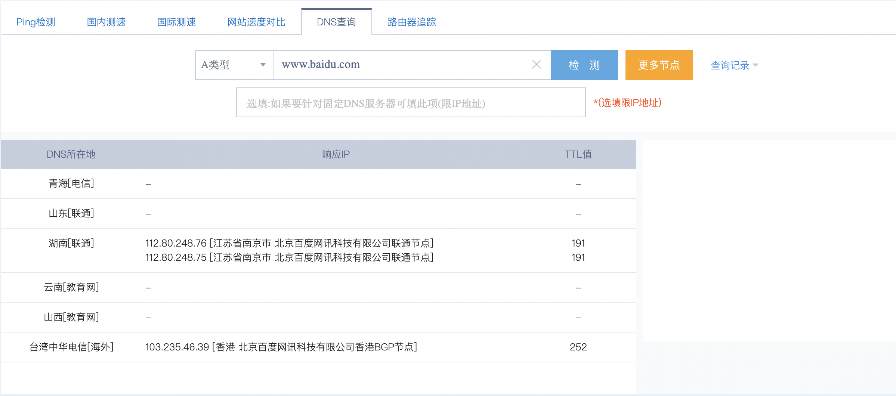
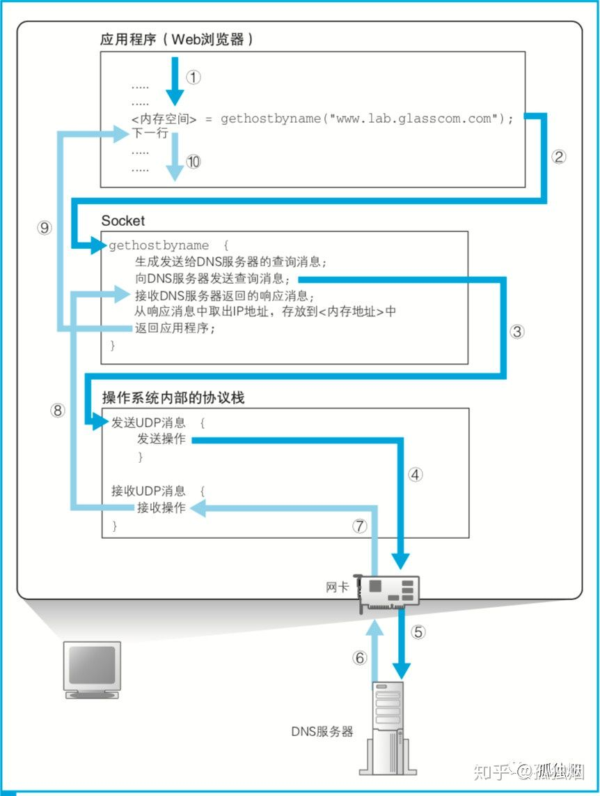

## 引言
域名系统（Domain Name System 缩写 DNS）是因特网的一项核心服务，是将域名和 IP 地址相互映射的一个分布式数据库。要完全讲清楚，恐怕得长篇大论，因此，本文只讲一些相对常用的知识点。

## 概念
DNS 的全称是 Domain Name System，主要作用就是将人们所熟悉的网址 (域名) “翻译”成电脑可以理解的 IP 地址，这个过程叫做 DNS 域名解析。打个比方，浏览器打开百度搜索页面的时候，都是敲 www.baidu.com，进行登陆。要敲 IP 地址的话，恐怕会吓退很多人~明显，域名容易记忆。

而且，一个域名往往对应多个 DNS 地址。利用 [站长工具的 DNS 查询服务](http://tool.chinaz.com/dns?type=1&host=&ip=)，可查得 www.baidu.com 的 DNS 地址如下



能全部都记住的肯定都是记忆力超群的 :)

## 流程
接下来，就不得不说一道经典面试题了

::: tip
浏览器输入 URL 到返回页面的全过程
:::

其实回答很简单(俗称*天龙八步*)

1. 根据域名，进行 DNS 域名解析；
2. 拿到解析的 IP 地址，建立 TCP 连接；
3. 向 IP 地址发送 HTTP 请求；
4. 服务器处理请求；
5. 返回响应结果；
6. 关闭 TCP 连接；
7. 浏览器解析 HTML；
8. 浏览器布局渲染；

::: tip 延伸
由于本文不是讲 HTTP 请求，但稍微延伸一下的话，还可以搞几个问题如下
1. 一个 TCP 连接可以对应几个 HTTP 请求？(提示，这在问你 HTTP1.0 和 1.1 的区别)
2. 一个 TCP 连接中 HTTP 请求发送可以一起发送么（比如一起发三个请求，再三个响应一起接收）？(提示，这就是在问你 HTTP2.0 和 HTTP1.1 协议的区别)
3. 浏览器对同一 Host 建立 TCP 连接到数量有没有限制？(拜托，一个网站那么多图片，开一个 TCP 连接，按顺序下载？那不是等到死？)
:::

## 解析
OK，着重说 DNS 解析这块，流程图如下



大致就是：浏览器输入地址，然后浏览器进程调用操作系统某个库里的 `gethostbyname` 函数(例如，Linux GNU glibc 标准库的 `gethostbyname` 函数)，这个函数通过网卡给 DNS 服务器发 UDP 请求，接收结果，最后将所得 IP 地址给返回给浏览器。

这张图其实已经讲明白大致的流程，但是细节上可能有些差异。 例如

- 用 chrome 浏览器时，其实会先去浏览器的 dns 缓存查询，缓存缺失的话再去调用 `gethostbyname` 函数
- `gethostbyname` 函数在试图进行 DNS 解析之前首先检查域名是否在本地 Hosts 里，如果没找到再去 DNS 服务器查

至此又可解决以下两道面试题 :)

1. 说说 UDP 协议和 TCP 各自的应用场景
2. DNS 在域名解析上用的是 UDP 协议还是 TCP 协议

::: warning 注意事项
DNS 也有一个地方用到了 TCP 协议--**区域传送**。DNS 规范规定了 2 种类型的 DNS 服务器：主 DNS 服务器和辅助 DNS 服务器。在一个区中，主 DNS 服务器从自己本机的数据文件读取该区的 DNS 数据信息，而辅助 DNS 服务器则从区的主 DNS 服务器读取该区的 DNS 数据信息。当一个辅助 DNS 服务器启动时，它需要与主 DNS 服务器通信，并加载数据信息，这就叫做区域传送（zone transfer）。这种情况下，使用 TCP 协议。
:::

再深究一下的话，还可以搞出以下两个问题

- Q1：域名解析为什么用 UDP  
A1：因为 UDP 快！UDP 的 DNS 协议只要一个请求、一个应答就好了。而换用 TCP 的话，要三次握手、发送数据以及应答、四次挥手。但是 UDP 协议传输内容不能超过 512 字节。好在客户端向 DNS 服务器查询域名，一般返回的内容都不超过 512 字节，用 UDP 传输即可。

- Q2：区域复制为什么用 TCP  
  A2：因为 TCP 协议可靠性好！从主 DNS 上复制内容用不可靠的 UDP 不好吧。TCP 协议传输的内容大，UDP 只有可怜的 512 字节？万一同步的数据大于 512 字节就玩蛋了。

## 原理
最后就到了 DNS 解析域名的原理。

### `dig` 命令
首先介绍 linux 下的 `dig` 命令，演示解析域名的过程。`dig` 天猫域名的过程如下

```bash
sammyne@ubuntu:~$ dig www.baidu.com

; <<>> DiG 9.16.1-Ubuntu <<>> www.baidu.com
;; global options: +cmd
;; Got answer:
;; ->>HEADER<<- opcode: QUERY, status: NOERROR, id: 9523
;; flags: qr rd ra; QUERY: 1, ANSWER: 3, AUTHORITY: 0, ADDITIONAL: 1

;; OPT PSEUDOSECTION:
; EDNS: version: 0, flags:; udp: 65494
;; QUESTION SECTION:
;www.baidu.com.			IN	A

;; ANSWER SECTION:
www.baidu.com.		127	IN	CNAME	www.a.shifen.com.
www.a.shifen.com.	107	IN	A	112.80.248.76
www.a.shifen.com.	107	IN	A	112.80.248.75

;; Query time: 3 msec
;; SERVER: 127.0.0.53#53(127.0.0.53)
;; WHEN: Sun Feb 28 11:51:14 CST 2021
;; MSG SIZE  rcvd: 101

```

::: warning 注意事项
`->>HEADER<<-` 行的 `status` 为 `SERVFAIL` 说明 DNS 查询失败，可能原因是没法链接 DNS 服务器。
:::

莫慌，我们慢慢分析重点的两段。第一段代表请求参数如下所示

```bash
;; QUESTION SECTION:
;www.baidu.com.			IN	A
```

这段为查询内容。DNS 的查询参数一般有 3 个

- 域名：服务器、邮件服务器(邮件地址中 `@` 后面的部分)的名称
- Class：在设置 DNS 方案时，互联网之外的网络也考虑到了，而 Class 就是用来识别网络的，不过现在只有互联网，所以它的值永远都是代表互联网的 `IN`
- 记录类型：标识域名对应何种类型的记录。
  - `A` 表示域名对应的 IP 地址。
  - `MX` 表示域名对应的是邮件服务器。
  - `PTR` 表示根据 IP 地址反查域名。
  - `CNAME` 表示查询域名相关别名。

但是，细心一看会发现：输入的明明是 `www.baidu.com`，可是命令里解析的地址却是 `www.baidu.com.`。这个多出来的 `.` 又是几个意思嘞= =

这里就涉及到了 DNS 的域名解析过程了。

### DNS 的域名解析过程

承上启下，我们先缕缕域名的结构。

`www.baidu.com` 对应的真正的域名为 `www.baidu.com.`。
- 末尾的 `.` 称为**根域名**。*因为每个域名都有根域名，因此我们通常省略。* 
- 根域名的下一级，叫做**顶级域名**（top-level domain，缩写为 TLD），比如.com、.net。
- 再下一级叫做**次级域名**（second-level domain，缩写为 SLD），比如 www.baidu.com 里面的 `.baidu`，这一级域名是用户可以注册的。
- 再下一级是**主机名**（host），比如 `www.baidu.com` 里面的 `www`，又称为**三级域名**，这是用户在自己的域里面为服务器分配的名称，是用户可以任意分配的。

解析流程就是分级查询！

1. 先在本机的 DNS 里头查，如果有就直接返回。本机 DNS 就是下面 `nameserver` 指定 IP 对应的 DNS 服务器

    ```bash
    sammyne@ubuntu:~$ cat /etc/resolv.conf 
    # This file is managed by man:systemd-resolved(8). Do not edit.
    #
    # This is a dynamic resolv.conf file for connecting local clients to the
    # internal DNS stub resolver of systemd-resolved. This file lists all
    # configured search domains.
    #
    # Run "resolvectl status" to see details about the uplink DNS servers
    # currently in use.
    #
    # Third party programs must not access this file directly, but only through the
    # symlink at /etc/resolv.conf. To manage man:resolv.conf(5) in a different way,
    # replace this symlink by a static file or a different symlink.
    #
    # See man:systemd-resolved.service(8) for details about the supported modes of
    # operation for /etc/resolv.conf.

    nameserver 127.0.0.53
    options edns0
    ```


2. 本机 DNS 里头发现没有，就去根服务器里查。根服务器发现这个域名是属于 `com` 域，因此根域 DNS 服务器会返回它所管理的 `com` 域所对应 DNS 服务器的 IP 地址，意思是“虽然我不知道你要查的那个域名的地址，但你可以去 `com `域问问看”
3. 本机的 DNS 接到又会向 `com` 域的 DNS 服务器发送查询消息。`com` 域也没有 www.baidu.com 这个域名的信息。和刚才一样，`com` 域服务器会返回它下面的 `baidu.com` 域的 DNS 服务器 IP 地址。

以此类推，只要重复前面的步骤，就可以顺藤摸瓜找到目标 DNS 服务器

::: tip 温馨提示
`dig +trace www.baidu.com` 可以看到解析过程。有兴趣的读者，自己实验一下。
:::

扯了那么多东西，我们来看第二段内容，也就是响应体的部分！如下所示

```bash
;; ANSWER SECTION:
www.baidu.com.		127	IN	CNAME	www.a.shifen.com.
www.a.shifen.com.	107	IN	A	112.80.248.76
www.a.shifen.com.	107	IN	A	112.80.248.75
```

很明显，第一行就是说 `www.baidu.com.` 有一个别名是 `www.a.shifen.com.`。后面几行就是 `www.a.shifen.com.` 的真实 IP。

为什么百度要设一个别名到 `www.a.shifen.com.` 地址呢？ 于是乎，又一道经典面试题出现

::: tip
为什么要用 `CNAME`，也即使用 `CNAME` 的好处
:::

具体参见 [这个回答][cname记录是什么？他存在的意义是什么？ - beepony的回答]。（TODO：待完全理解后补充更详细的解释）

第一眼见到这题的时候，我觉得应该是方便 cdn 配置。回到当前例子，如果猜测正确的话，`www.a.shifen.com.` 应该是百度的一个 cdn 地址。因此，我特意去 [站长工具](http://icp.chinaz.com/) 查了域名备案记录，结果如下图所示


然而好像并不是（尴尬而不是礼貌的微笑）。

## 总结
本文简要介绍 DNS 的一些常见知识点，以备日常查询和回顾。如果有其他关于 DNS 的问题或支持，欢迎留言分享。

## 参考文献
- [面试官:讲讲DNS的原理？](https://zhuanlan.zhihu.com/p/79350395)

[cname记录是什么？他存在的意义是什么？ - beepony的回答]: https://www.zhihu.com/question/22916306/answer/26650717