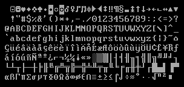

> 原文连接：[A Minimal Rust Kernel](https://os.phil-opp.com/minimal-rust-kernel/)

本文将基于 x86 架构，使用 Rust 语言编写一个最小化的 64 位内核。我们将在上一篇文章的独立式可执行程序的基础上，构建一个能够引导启动的磁盘镜像，它将向显示器打印字符串。

<!-- more -->

此博客在 [GitHub][github blog-os] 上公开开发。如果您有任何问题或疑问，请在此处打开一个问题。 您也可以在 [底部][valine] 发表评论。这篇文章的完整源代码可以在 [blog-os-cn/02-minimal-rust-kernel][02-minimal-rust-kernel-source-code] 找到。

## 引导启动

电脑启动后，会接着运行主板 ROM 存储的固件代码。这份代码负责电脑的 [加电自检][power-on self-test]，可用 [内存][ROM] 的检测，CPU 和其它硬件的预加载。然后，它将寻找一个可引导的磁盘，并开始启动其中的操作系统内核。

x86 架构支持两种固件标准：[BIOS]（Basic Input/Output System）和 [UEFI]（Unified Extensible Firmware Interface）。其中，BIOS 标准虽然古老和落伍了，但实现简单，并很好得到 1980 年后所有 x86 设备的支持；相反地，UEFI 更现代化，功能也更全面，但环境搭建比较复杂（至少从个人角度看是这样的）。

我们目前只提供 BIOS 的引导启动方式，对 UEFI 的支持也在规划中。如果你乐于助人的话，请加入到这个 [Github issue] 吧。

## BIOS 启动
几乎所有 x86 硬件系统都支持 BIOS 启动，这也包含 UEFI 驱动的模拟 BIOS 模式的新型机器。这可以说是一件好事情，因为无论是上世纪还是现在的机器，都可以使用相同的启动逻辑；但这种兼容性同时也是 BIOS 引导启动最大的缺点，因为在系统启动前，CPU 必须先进入一个 16 位系统兼容的 [实模式][real mode]，这样 1980 年代古老的引导固件才能够继续使用。

让我们从头开始，梳理一遍 BIOS 启动的过程。

当电脑启动时，主板的某些特殊闪存中存储的 BIOS 固件将被加载。BIOS 固件将会加电自检、初始化硬件，然后它将寻找一个可引导启动的磁盘。如果找到了，那电脑的控制权将被转交给*引导程序*（bootloader）：一段存储在磁盘开头的、512 字节的可执行代码片段。大多数的引导程序长度都大于 512 字节，所以通常情况下，引导程序都被切分为长度不超过 512 字节的第一阶段引导程序，和随后由第一阶段引导程序加载的第二阶段引导程序。

引导程序必须决定内核在磁盘的位置，并将内核加载到内存。引导程序还需要将 CPU 从 16 位的 [实模式][real mode]，先切换到 32 位的 [保护模式][protected mode]，最终切换到 64 位的 [长模式][long mode]：此时，所有的 64 位寄存器和整个主内存才能被访问。引导程序的第三个作用，是从 BIOS 查询特定的信息（如内存映射表），并将其传递到操作系统内核。

编写一个引导程序并不是一个简单的任务，因为这需要使用汇编语言，而且必须经过许多晦涩的步骤--比如，把一些魔法数字（magic number）写入某个处理器寄存器。因此，这篇博文不会讲解如何创建引导程序，而是提供一个名为 bootimage 的工具--它能够自动为我们的内核添加引导程序作为前缀。

### Multiboot 标准
为了避免每个操作系统都实现只兼容自己单个操作系统的引导程序，[自由软件基金会][Free Software Foundation] 在 1995 年颁布了一个开源的引导程序标准--[Multiboot]。这个标准定义了引导程序和操作系统间的接口，所以任何兼容 Multiboot 的引导程序，都能用来加载任何同样兼容了 Multiboot 的操作系统。[GNU GRUB] 是一个可供参考的 Multiboot 实现，它也是最热门的 Linux 系统引导程序之一。

要编写一款适配 Multiboot 的内核，我们只需要在内核文件开头插入被称作 [Multiboot 头][Multiboot header] 的数据片段。这让 GRUB 很轻易就能引导任何操作系统，但是GRUB 和 Multiboot 标准也有一些问题：

- 它们只支持 32 位的保护模式。这意味着我们依然需要配置 CPU，让它切换到 64 位的长模式
- 它们被设计为精简引导程序，而不是精简内核。举个例子，内核需要连接到 [调整过的默认页大小][adjusted default page size]，否则 GRUB 将无法找到内核的 Multiboot 头。另一个例子是传给内核的 [引导信息][boot information]，它包含着大量与架构有关的数据结构，而没有提供一层简洁的抽象
- GRUB 和 Multiboot 标准并没有详细解释，阅读相关文档需要一定经验
- 为了基于内核文件创建一个能够被引导的磁盘映像，宿主机系统必须安装 GRUB：这加大了基于 Windows 或 macOS 开发内核的难度

出于这些考虑，我们决定不使用 GRUB 或者 Multiboot 标准。然而，[bootimage] 工具支持 Multiboot 也在规划中，使得 GRUB 系统也可以加载我们的内核。如果你对编写一个 Multiboot 兼容的内核感兴趣的话，参见这个博客系列的 [第一版][blog-os-1st-ed]。

### UEFI
（目前我们尚未支持 UEFI，但是很乐于支持！如果你能帮忙的话，请在 [Github issue] 提醒我们）

## 最小化内核
现在基本明白电脑是如何启动的，那也是时候编写我们自己的内核了。小目标是创建一个内核的磁盘映像，它能够在启动时向屏幕输出一行“Hello World!”。我们的工作将基于上一篇博文构建的 [独立的 Rust 二进制][blog-os-01-freestanding-rust-binary]。

如果没忘记的话，我们使用 `cargo` 构建了一个独立的二进制程序，但是构建过程因操作系统而异，需要不同的入口函数名和编译选项。这是因为 `cargo` 默认会基于 *宿主系统* 进行构建，即当前运行的系统。这并不是我们内核想要的，运行在诸如 Windows 上的内核意义不大。确切地说，我们想要基于一个明确定义的 *目标系统* 编译我们的内核。

### 安装 Rust Nightly
Rust 语言有三种发行版：*stable*、*beta* 和 *nightly*。《Rust 程序设计语言》对这三种版本的区别解释得很详细，可以花点时间自行 [了解一下][nightly-rust]。为了构建一个操作系统，我们需要一些只有 nightly 版提供的实验性特性，所以需要安装一个 nightly 版本的 Rust。

为了管理 Rust 的安装，我强烈建议使用 [rustup]。它允许你同时安装 nightly、beta 和 stable 版本的编译器，而且让更新它们变得容易。我们可以执行 `rustup override add nightly` 使得当前目录使用 nightly 版本的 Rust。或者，也可以在项目根目录添加一个内容为 `nightly`、名为 `rust-toolchain` 的文件。要检查你是否已经安装了一个 nightly，你可以运行 `rustc --version`：返回的版本号末尾应该包含 `-nightly`。

Nightly 版本的编译器允许我们在源码开头插入 *特性标记符*，自由选择并使用大量实验性的特性。举个例子，要使用实验性的 [`asm!` 宏] 启用内联汇编，可以在 `main.rs` 的顶部添加 `#![feature(asm)]`。要注意的是，这样的实验性特性是不稳定的，意味着未来的 Rust 版本可能会在毫无预警的情况下修改或移除这些功能。因此，除非绝对必要，否则不要使用这些特性。

### 目标配置
Cargo 借助 `--target` 参数支持不同的目标系统。这个目标系统可以使用一个所谓的 [目标三元组（target triple）][target triple] 来描述，内容包括 CPU 架构、平台供应商、操作系统和 [ABI]。比方说，目标三元组 `x86_64-unknown-linux-gnu` 描述一个基于 `x86_64` 架构 CPU、没有明确的平台供应商的 linux 系统，它遵循 GNU 风格的 ABI。Rust 支持 [许多不同的目标三元组][rust platform support]，包括安卓系统对应的 `arm-linux-androideabi` 和 WebAssembly 使用的 [wasm32-unknown-unknown]。

为了编写我们的目标系统，并且鉴于需要做一些特殊的配置（比如没有依赖的底层操作系统），没有现成的 [目标三元组][rust platform support] 满足我们的要求。好在 Rust 允许利用 JSON 文件定制 [自己的目标][custom-targets]。比如，一个描述 `x86_64-unknown-linux-gnu` 目标系统的配置清单大概长这样：

```json
{
    "llvm-target": "x86_64-unknown-linux-gnu",
    "data-layout": "e-m:e-i64:64-f80:128-n8:16:32:64-S128",
    "arch": "x86_64",
    "target-endian": "little",
    "target-pointer-width": "64",
    "target-c-int-width": "32",
    "os": "linux",
    "executables": true,
    "linker-flavor": "gcc",
    "pre-link-args": ["-m64"],
    "morestack": false
}
```

多数字段都被 LLVM 用于为这个平台生成代码。例如，[data-layout] 配置项定义了不同的整数、浮点数和指针类型的长度。另外，还有一些 Rust 用作条件编译的配置项，如 `target-pointer-width`。还有一些类型的配置项定义了这个包该如何编译。例如，`pre-link-args` 配置项指定了应该向 [链接器][linker] 传入的参数。

我们将基于 `x86_64` 系统构建内核，所以配置清单将和上面的例子非常相似。现在，我们创建一个内容如下的 `x86_64-blog_os.json` 文件（名字根据个人喜好调整）：

```json
{
    "llvm-target": "x86_64-unknown-none",
    "data-layout": "e-m:e-i64:64-f80:128-n8:16:32:64-S128",
    "arch": "x86_64",
    "target-endian": "little",
    "target-pointer-width": "64",
    "target-c-int-width": "32",
    "os": "none",
    "executables": true,
}
```

值得注意的是，因为要在裸机上运行内核，我们修改了 `llvm-target` 的内容，将 `os` 配置项的值改为 `none`。

我们还添加以下与编译相关的配置项：

```json
"linker-flavor": "ld.lld",
"linker": "rust-lld",
```

在这里，我们不使用平台的默认链接器（它可能不支持 Linux 目标系统），而是使用随 Rust 一起打包发布的跨平台的 [LLD] 链接器来链接内核。

```json
"panic-strategy": "abort",
```

这个配置项的意思是，我们的编译目标不支持 panic 时的 [栈展开][stack unwinding]，所以我们选择在 panic 时直接退出。这和在 Cargo.toml 文件中添加 `panic = "abort"` 选项的作用是相同的，所以我们可以从配置清单中移除这一项（需要注意的是，与 Cargo.toml 的选项相比，这个目标选项在文章的后续部分重新编译 `core` 库时同样适用。因此，即使我们偏爱保留 Cargo.toml 中的选项，请务必添加这个选项）。

```json
"disable-redzone": true,
```

我们正在编写一个内核，所以将来某个时候应该需要处理中断。要安全地实现这一点，我们必须禁用称为红灯区的栈指针优化，否则这个优化会污染栈。详情参见另外一篇解释 [禁用红灯区][disabling the read zone] 的博文。

```json
"features": "-mmx,-sse,+soft-float",
```

`features` 字段用于启用或禁用某个目标特性。通过在它们前面添加减号，我们将 `mmx` 和 `sse` 特性禁用；添加前缀加号，启用 `soft-float` 特性。

`mmx` 和 `sse` 特性决定了是否支持 [单指令多数据流][SIMD] 相关指令，这些指令常常能显著地提高程序性能。然而，在内核中使用庞大的 SIMD 寄存器会造成较大的性能问题。因为继续执行每次程序中断前，内核必须还原整个庞大的 SIMD 寄存器的状态。这意味着，每次硬件中断或系统调用，完整的 SIMD 状态必须转存到主存。由于 SIMD 状态可能相当大（512~1600 个字节），而中断可能经常发生，这些额外的存储与恢复操作会显著地降低性能。为解决这个问题，我们为内核禁用 SIMD（但这不意味着禁用内核上应用程序的 SIMD 支持）。

禁用 SIMD 产生的一个问题是，`x86_64` 架构的浮点数指针运算默认依赖 SIMD 寄存器。我们的解决方法是，启用 `soft-float` 特性，它将使用基于常规整数的软件函数模拟浮点数运算。

更多详情参见我们关于 [禁用 SIMD][disabling SIMD] 的博文。

### 串到一起

现在将各个配置项整合在一起。我们的目标配置清单应该长这样：

```json
{
  "llvm-target": "x86_64-unknown-none",
  "data-layout": "e-m:e-i64:64-f80:128-n8:16:32:64-S128",
  "arch": "x86_64",
  "target-endian": "little",
  "target-pointer-width": "64",
  "target-c-int-width": "32",
  "os": "none",
  "executables": true,
  "linker-flavor": "ld.lld",
  "linker": "rust-lld",
  "panic-strategy": "abort",
  "disable-redzone": true,
  "features": "-mmx,-sse,+soft-float"
}
```

### 构建我们的内核
要编译我们的新目标环境会使用 Linux 系统的编写风格（这可能是 LLVM 的默认风格）。这意味着，我们需要 [前一篇文章][blog-os-01-freestanding-rust-binary] 编写的名为 `_start` 的入口函数：

```rust
// src/main.rs

#![no_std] // 不链接 Rust 标准库
#![no_main] // 禁用所有 Rust 层级的入口点

use core::panic::PanicInfo;

/// 这个函数将在 panic 时被调用
#[panic_handler]
fn panic(_info: &PanicInfo) -> ! {
    loop {}
}

#[no_mangle] // 不重整函数名
pub extern "C" fn _start() -> ! {
    // 因为编译器会寻找一个名为 `_start` 的函数，所以这个函数就是入口点
    // 默认命名为 `_start`
    loop {}
}
```

注意的是，无论开发时的宿主操作系统是哪种，你都需要将入口函数命名为 `_start`。

通过把 JSON 文件名传给 `--target` 选项，我们现在可以基于新目标编译内核了。

```bash
> cargo build --target x86_64-blog_os.json

error[E0463]: can't find crate for `core` 
```

哇哦，编译失败了！输出的错误提示我们，Rust 编译器找不到 [core 库][core library]。而所有 `no_std` 类型的 crate 都隐式链接这个库，这个库包含基础的 Rust 类型，如 `Result`、`Option` 和迭代器等。


问题出在，core 库以 *预编译* 库的形式与 Rust 编译器一同发布。所以，core 库只对支持的宿主系统有用（例如，`x86_64-unknown-linux-gnu`），而对我们自定义的目标系统无效。如果想为其它目标编译代码，我们需要首先为这些目标重新编译整个 core 库。

#### `build-std` 选项

这时就可以用上 cargo 的 [`build-std` 特性][build-std] 了。它支持按需重新编译 `core` 和其他标准库 crate，而不是使用随 Rust 安装包一起发布的预编译版本。这个特性还非常年轻且尚未开发完成，所以被标记为 “unstable”，只在 [nightly 版的 Rust 编译器][install-rust-nightly] 可用。

启用这个特性需要创建包含以下内容的 `.cargo/config.toml` [cargo 配置][cargo configuration] 文件

```toml
# in .cargo/config.toml

[unstable]
build-std = ["core", "compiler_builtins"]
```

这告诉 cargo 要重新编译 `core` 和 `compiler_builtins` 库。需要后者的原因是 `core` 依赖它。为了重新编译这些库，cargo 需要访问 rust 的源码，可通过 `rustup component add rust-src` 命令安装。

::: tip 温馨提示
`unstable.build-std` 配置要求至少 2020-07-15 后的 nightly 版 Rust。作者当时安装时，这些 nightly 版的 `rustfmt` 组件 [尚未可用](https://rust-lang.github.io/rustup-components-history/)，这种情况下需要使用 `rustup update nightly --force` 跳过不可用的 `rustfmt` 组件从而更新 nightly 版的 Rust。
:::

设置好 `unstable.build-std` 键和安装 `rust-src` 组件后，重新运行 build 命令：

```bash
> cargo build --target x86_64-blog_os.json
   Compiling core v0.0.0 (/…/rust/src/libcore)
   Compiling rustc-std-workspace-core v1.99.0 (/…/rust/src/tools/rustc-std-workspace-core)
   Compiling compiler_builtins v0.1.32
   Compiling blog_os v0.1.0 (/…/blog_os)
    Finished dev [unoptimized + debuginfo] target(s) in 0.29 secs
```

可以看到 `cargo build` 现在会为我们的定制目标重新编译 `core`、`rustc-std-workspace-core`（`compiler_builtins` 的依赖）和 `compiler_builtins` 库。

#### 内存相关内部细节

Rust 编译器假设所有系统都有一批同样内置的函数。这些函数大多数由刚才重新编译的 `compiler_builtins` crate 提供。但是某些通常由系统 C 语言库提供的一些内存操作相关的函数默认没有被这个 crate 启用。这些函数包括把某个内存块置为特定值的 `memset`、从一个块复制值到另一个块的 `memcpy` 和比较两个内存块的 `memcmp`。虽然编译我们的内核暂时还不用不上这些函数的任何一个，但是后续添加更多代码时就会用到（例如，复制 struct 来到处传递时）。

因为无法连接到操作系统的 C 语言库，我们那需要其他方法来为编译器提供这些函数。其中一种可行的方式就是实现我们那自己的 `memset` 等函数，并为其应用 `#[no_mangle]` 属性（为了避免编译时的自动重命名）。然而，这是很危险的--这些函数的实现稍有不当就会导致未定义行为。所以，复用现有经过充分测试的实现是个好方法。

好在，`compiler_builtins` crate 已经包含了这些所需函数的实现，只是默认为了避免和 C 语言库的冲突而未启用而已。通过设置 cargo 的 [`build-std-features`] 标识符未 `["compiler-builtins-mem"]` 来启用它们。和 `build-std` 标识符类似，这个标识符可以通过命令行的 `-Z` 标识符传递或者通过 `.cargo/config.toml` 文件的 `unstable` 表格配置。由于我们的构建总要使用这个标识符，借助配置文件的方式看起来要合理一点：

```toml
[unstable]
build-std-features = ["compiler-builtins-mem"]
```

（`compiler-builtins-mem` 特性的支持是在 [最近才添加的](https://github.com/rust-lang/rust/pull/77284)，所以要求的 Rust 版本至少为 `2020-09-30`。）

内地里，这个标识符启用 `compiler_builtins` crate 的 [`mem` 特性][`mem` feature]。这个特性的效果是 crate 的 [`memcpy` 等实现] 都有 `#[no_mangle]` 属性修饰，使得链接器能够访问到它们。值得注意的是，这些函数不会立即 [被优化掉][not optimized]，他们的性能可能不会最好的，但至少是正确的。对于 `x86_64`，有个进行中的 PR [使用特殊的汇编指令优化这些函数][memcpy rep movsb]。

有了这个更新后，我们的内核就有了编译器需要的所有函数实现，所以即使后续代码变得更加复杂，内核仍然能继续编译通过。

### 设置默认目标
为了避免每次执行 `cargo build` 时传递 `--target` 参数，我们可以覆写默认的编译目标。往 [cargo 配置][cargo configuration] 文件 `.cargo/config.toml` 添加下面的内容即可：

```toml
# in .cargo/config.toml

[build]
target = "x86_64-blog_os.json"
```

这里的配置告诉 `cargo` 在没有显式声明目标的情况下，使用我们提供的 `x86_64-blog_os.json` 作为目标配置。这意味着我们可以直接使用 `cargo build` 构建内核了。[官方文档][cargo doc] 对 cargo 配置项有更详细的说明。

现在我们借助简单的 `cargo build` 即可为裸机目标编译内核了。然而，启动加载器调用的 `_start` 入口函数还是空的。是时候在里面往屏幕打印一些东西了。

### 向屏幕打印字符
目前往屏幕打印文本最简单的方式是 [VGA 文本缓冲区][VGA text buffer]。这是一段映射到 VGA 硬件的特殊内存片段，包含着显示在屏幕上的内容。通常情况下，它能够存储 25 行、80 列共 2000 个字符单元。每个字符单元能够显示一个有特定前景色和背景色的 ASCII 字符。输出到屏幕的字符大概长这样：



我们将在下篇文章中详细讨论 VGA 字符缓冲区的内存布局，并为其编写第一个驱动程序。为了打印 “Hello World”，目前我们只需要知道这段缓冲区的地址是 `0xb8000`，且每个字符单元包含一个 ASCII 码字节和一个颜色字节。

具体实现如下：

```rust
static HELLO: &[u8] = b"Hello World!";

#[no_mangle]
pub extern "C" fn _start() -> ! {
    let vga_buffer = 0xb8000 as *mut u8;

    for (i, &byte) in HELLO.iter().enumerate() {
        unsafe {
            *vga_buffer.offset(i as isize * 2) = byte;
            *vga_buffer.offset(i as isize * 2 + 1) = 0xb;
        }
    }

    loop {}
}
```

首先，将整数 `0xb8000` 转换为一个 [裸指针][raw pointer]。然后 [遍历][iterate] [静态][static] [字符串][byte string] `HELLO` 的字节。我们还使用 [enumerate] 方法获得一个额外的索引变量 `i`。在 for 循环的主体内，使用 [offset] 方法将字符串的每个字节和对应的颜色字节（`0xb` 代表淡青色）写入内存位置。

要注意的是，所有的内存写操作都被一个 [unsafe] 语句块包围。这是因为编译器不能确保我们创建的裸指针是有效的。裸指针可能指向任意位置，引发数据污染问题。使用 `unsafe` 语句块包裹这些操作，我们其实是在告诉编译器，自己相当肯定语句块内的操作是有效的。事实上，`unsafe` 语句块并不会关闭 Rust 的安全检查机制；它只是允许我们多做 [五件][five additional things] 事情而已。

我想要强调的是：**这不是我们使用 Rust 的正确姿势！** 在 unsafe 语句块里面操弄裸指针很容易搞得一地鸡毛，例如，稍不留神我们很容易就会越过缓冲区边界进行写操作。

因此，我们希望尽可能少地使用 `unsafe` 语句块。Rust 语言允许我们将不安全操作将包装为一个安全的抽象模块。举个例子，我们可以创建一个 VGA 缓冲区类型，把所有的不安全语句封装起来，确保从类型外部操作时，*不可能* 触发错误。通过这种方式，只需要最少 `unsafe` 语句块确保不破坏内存安全。下一篇文章将会创建这样的 VGA 缓冲区封装。

## 启动内核
既然我们已经有了一个有视觉效果的可执行程序，是时候把它运行起来试试看了。首先，将编译好的内核与引导程序链接来创建一个可引导的磁盘镜像。然后可以在 [QEMU] 虚拟机中运行这个镜像，或者通过 U 盘在真机上运行。

### 创建引导映像
要将可执行程序转换为可引导的镜像，需要把它和引导程序链接。正如我们在 [描述启动的小节][the-boot-process] 所学，引导程序将负责初始化 CPU 并加载内核。

我们在此直接使用 [bootloader] 包，而不是手码一个可以独立成项目的引导程序。这个包实现基本的 BIOS 引导程序，不依赖 C 语言，只依赖 Rust 代码和内联汇编。为了用它启动我们的内核，需要将它添加为依赖项：

```toml
# in Cargo.toml

[dependencies]
bootloader = "0.9.3"
```

只添加 `bootloader` 依赖项不足以创建一个可引导的磁盘镜像。问题出在我们需要在内核编译完成之后，将内核和引导程序组合在一起，然而 cargo 并不支持 [后处理脚本][post-build scripts]。

为了解决这个问题，我们创建了一个 bootimage 工具。它会先编译内核，然后将内核和引导程序组合在一起，从而创建一个可引导的磁盘镜像。在终端执行以下命令来安装这款工具：

```bash
cargo install bootimage
```

为了运行 `bootimage` 以及编译引导程序，我们需要安装 `rustup` 组件 `llvm-tools-preview`。执行 `rustup component add llvm-tools-preview` 即可安装这个组件。

成功安装 `bootimage` 并添加 `llvm-tools-preview` 组件后执行以下命令即可创建一个可引导的磁盘镜像：

```bash
> cargo bootimage
```

可以看到，bootimage 工具使用 `cargo build` 编译内核，所以它将增量编译我们修改后的源码。在这之后，它会编译内核的引导程序，这可能花费一定的时间。但和所有其它依赖包相似的是，编译只会发生一次，然后产物被缓存，让后续编译明显加速。最终，`bootimage` 将内核和引导程序组合为一个可引导的磁盘镜像。

运行上述命令之后，我们应该能在 `target/x86_64-blog_os/debug` 目录内找到可引导的映像文件 `bootimage-blog_os.bin`。这个镜像可以在虚拟机启动，也可以刻录到 U 盘上以便在真机上启动。（需要注意的是，因为文件格式不同，这里的 bin 文件并不是一个光驱镜像，所以将它刻录到光盘不会起作用）

#### 具体是如何实现的？
`bootimage` 工具背地里执行以下三个步骤：

- 编译我们的内核为一个 ELF 文件
- 编译引导程序为独立的可执行文件
- 将内核 ELF 文件链接到引导程序的末端

当机器启动时，引导程序将会读取并解析拼接在其后的 ELF 文件。然后将把程序片段映射到页表的虚拟地址，清零 BSS 段，初始化栈空间。最后，它将读取并跳转到程序入口地址（`_start` 函数）。

### 在 QEMU 中启动内核
现在我们可以在虚拟机中启动内核了。执行以下命令在 [QEMU] 中启动内核：

```bash
> qemu-system-x86_64 -drive format=raw,file=target/x86_64-blog_os/debug/bootimage-blog_os.bin
warning: TCG doesn't support requested feature: CPUID.01H:ECX.vmx [bit 5]
```

这会打开一个类似下图的独立窗口：


可以看到屏幕窗口已经显示出 “Hello World!” 字符串。

### 在真机上运行内核
我们也可以镜像写入 U 盘，然后放到真机上启动：

```bash
> dd if=target/x86_64-blog_os/debug/bootimage-blog_os.bin of=/dev/sdX && sync
```

在这里，`sdX` 是 U 盘的设备名。因为目标设备上已有的数据将全部被擦除，所以请务必 **仔细** 选择正确的设备。

写入到 U 盘之后，我们可以在真机上通过引导启动系统。视情况而定，可能需要使用特殊的启动菜单，或者调整 BIOS 配置中的启动顺序来实现从 U 盘启动。需要注意的是，`bootloader` 包暂不支持 UEFI，所以我们并不能在 UEFI 机器上启动。

### 使用 `cargo run`
要让在 QEMU 中运行内核更轻松，我们可以设置在 cargo 配置文件中设置 `runner` 配置项：

```toml
# in .cargo/config.toml

[target.'cfg(target_os = "none")']
runner = "bootimage runner"
```

`target.'cfg(target_os = "none")'` 囊括了所有目标配置文件 `"os"` 字段设置为 `"none"` 的目标。这包含我们的 `x86_64-blog_os.json` 目标。另外，`runner` 的值指定运行 `cargo run` 具体执行的命令。这个命令将在成功编译后执行，而且会传递可执行文件的路径作为第一个参数。更多详情参见 [cargo 的文档][cargo doc]。

`bootimage runner` 命令特意设计为可用作 `runner` 二进制的形式。它将给定的可执行文件与项目的引导程序依赖项链接，然后在 QEMU 中启动它。[`bootimage` 的 README][bootimage README] 文档提供了更多细节和可以传入的配置参数。

现在我们可以使用 `cargo run` 来编译内核并在 QEMU 中启动了。

## 下篇预告
在下篇文章中，我们将更加细致地探索 VGA 文本缓冲区，并将其包装为一个安全的接口。我们还将基于它实现 `println!` 宏。

[ABI]: https://stackoverflow.com/a/2456882
[BIOS]: https://en.wikipedia.org/wiki/BIOS
[ELF]: https://en.wikipedia.org/wiki/Executable_and_Linkable_Format
[Free Software Foundation]: https://en.wikipedia.org/wiki/Free_Software_Foundation
[Github issue]: https://github.com/phil-opp/blog_os/issues/349
[GNU GRUB]: https://en.wikipedia.org/wiki/GNU_GRUB
[LLD]: https://lld.llvm.org/
[Multiboot]: https://wiki.osdev.org/Multiboot
[Multiboot header]: https://www.gnu.org/software/grub/manual/multiboot/multiboot.html#OS-image-format
[QEMU]: https://www.qemu.org/
[ROM]: https://en.wikipedia.org/wiki/Read-only_memory
[SIMD]: https://en.wikipedia.org/wiki/SIMD
[UEFI]: https://en.wikipedia.org/wiki/Unified_Extensible_Firmware_Interface
[VGA text buffer]: https://en.wikipedia.org/wiki/VGA-compatible_text_mode

[adjusted default page size]: https://wiki.osdev.org/Multiboot#Multiboot_2
[blog-os-1st-ed]: https://os.phil-opp.com/first-edition/
[blog-os-01-freestanding-rust-binary]: /2020/07/09/blog-os-01-freestanding-rust-binary
[bootimage]: https://github.com/rust-osdev/bootimage
[bootimage README]: https://github.com/rust-osdev/bootimage
[bootloader]: https://crates.io/crates/bootloader
[boot information]: https://www.gnu.org/software/grub/manual/multiboot/multiboot.html#Boot-information-format
[build-std]: https://doc.rust-lang.org/nightly/cargo/reference/unstable.html#build-std
[byte string]: https://doc.rust-lang.org/reference/tokens.html#byte-string-literals
[cargo configuration]: https://doc.rust-lang.org/cargo/reference/config.html
[cargo doc]: https://doc.rust-lang.org/cargo/reference/config.html
[core library]: https://doc.rust-lang.org/nightly/core/index.html
[custom-targets]: https://doc.rust-lang.org/nightly/rustc/targets/custom.html
[data-layout]: https://llvm.org/docs/LangRef.html#data-layout
[disabling SIMD]: https://os.phil-opp.com/disable-simd/
[disabling the read zone]: https://os.phil-opp.com/red-zone/
[enumerate]: https://doc.rust-lang.org/core/iter/trait.Iterator.html#method.enumerate
[first-edition]: https://os.phil-opp.com/first-edition/
[five additional things]: https://doc.rust-lang.org/stable/book/ch19-01-unsafe-rust.html#unsafe-superpowers
[github blog-os]: https://github.com/phil-opp/blog_os
[install-rust-nightly]: #安装-rust-nightly
[iterate]: https://doc.rust-lang.org/stable/book/ch13-02-iterators.html
[linker]: https://en.wikipedia.org/wiki/Linker_(computing)
[long mode]: https://en.wikipedia.org/wiki/Long_mode
[memcpy rep movsb]: https://github.com/rust-lang/compiler-builtins/pull/365
[memory safety]: https://en.wikipedia.org/wiki/Memory_safety
[nightly-rust]: https://doc.rust-lang.org/book/appendix-07-nightly-rust.html#choo-choo-release-channels-and-riding-the-trains
[not optimized]: https://github.com/rust-lang/compiler-builtins/issues/339
[offset]: https://doc.rust-lang.org/std/primitive.pointer.html#method.offset
[post-build scripts]: https://github.com/rust-lang/cargo/issues/545
[power-on self-test]: https://en.wikipedia.org/wiki/Power-on_self-test
[protected mode]: https://en.wikipedia.org/wiki/Protected_mode
[raw pointer]: https://doc.rust-lang.org/stable/book/ch19-01-unsafe-rust.html#dereferencing-a-raw-pointer
[real mode]: https://en.wikipedia.org/wiki/Real_mode
[rustup]: https://www.rustup.rs/
[rust platform support]: https://forge.rust-lang.org/release/platform-support.html
[stack unwinding]: https://www.bogotobogo.com/cplusplus/stackunwinding.php
[static]: https://doc.rust-lang.org/book/ch10-03-lifetime-syntax.html#the-static-lifetime
[target triple]: https://clang.llvm.org/docs/CrossCompilation.html#target-triple
[the-boot-process]: #引导启动
[unsafe]: https://doc.rust-lang.org/stable/book/ch19-01-unsafe-rust.html
[valine]: #valine
[wasm32-unknown-unknown]: https://www.hellorust.com/setup/wasm-target/
[wg-cargo-std-aware-issues#15]: https://github.com/rust-lang/wg-cargo-std-aware/issues/15

[02-minimal-rust-kernel-source-code]: https://github.com/sammyne/blog-os-cn/tree/master/02-minimal-rust-kernel

[`asm!` 宏]: https://doc.rust-lang.org/unstable-book/library-features/asm.html
[`build-std-features`]: https://doc.rust-lang.org/nightly/cargo/reference/unstable.html#build-std-features
[`mem` feature]: https://github.com/rust-lang/compiler-builtins/blob/eff506cd49b637f1ab5931625a33cef7e91fbbf6/Cargo.toml#L51-L52
[`memcpy` etc. implementations]: (https://github.com/rust-lang/compiler-builtins/blob/eff506cd49b637f1ab5931625a33cef7e91fbbf6/src/mem.rs#L12-L69)
