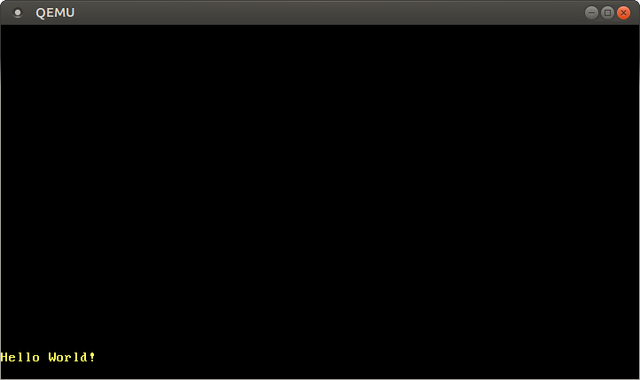

> 原文链接：[VGA Text Mode](https://os.phil-opp.com/vga-text-mode/)

[VGA 文本模式] 是打印字符到屏幕的一种简单方式。本文将会把它包装到一个独立的模块，为其创建被安全和便利地使用的接口。我们还会支持 Rust 语言的 [格式化宏]。

[VGA 文本模式]: https://en.wikipedia.org/wiki/VGA-compatible_text_mode
[格式化宏]: https://doc.rust-lang.org/std/fmt/#related-macros

<!-- more -->

此博客在 [GitHub][github blog-os] 上公开开发。如果您有任何问题或疑问，请在此处打开一个问题。 您也可以在 [底部][valine] 发表评论。这篇文章的完整源代码可以在 [blog-os-cn/03-vga-text-mode][03-vga-text-mode] 找到。

## VGA 文本缓冲区

为了以 VGA 文本模式向屏幕打印字符，我们必须将字符写入 VGA 硬件的文本缓冲区。通常状况下，VGA 文本缓冲区是一个 25 行、80 列的二维数组，它的内容将被实时渲染到屏幕。每个数组元素以下面的格式描述一个屏幕字符：

|  比特 | 值               |
| ----: | :--------------- |
|   0-7 | ASCII code point |
|  8-11 | 前景色           |
| 12-14 | 背景色           |
|    15 | 是否闪动         |

第一个字节代表应该以 [ASCII 编码][ASCII encoding] 格式打印的字符。更准确来说，它并不是真正意义上的 ASCII 字符集，而是添加额外字符和稍作调整的、名为 *[code page 437]* 的字符集。


第二个字节定义字符的打印方式。前 4 比特定义前景色，后 3 比特定义背景色，最后 1 比特确定字符是否应该闪动。可用的颜色如下：

| 值  | 颜色 | 值 + 亮度位 | 亮色   |
| --- | ---- | ----------- | ------ |
| 0x0 | 黑   | 0x8         | 暗灰   |
| 0x1 | 蓝   | 0x9         | 浅蓝   |
| 0x2 | 绿   | 0xa         | 浅绿   |
| 0x3 | 青   | 0xb         | 浅浅色 |
| 0x4 | 红   | 0xc         | 浅红   |
| 0x5 | 紫红 | 0xd         | 粉红   |
| 0x6 | 棕色 | 0xe         | 黄色   |
| 0x7 | 浅灰 | 0xf         | 白色   |

每个颜色的第四位称为 *亮度位*（bright bit），能够将蓝色转成浅蓝色等。对于背景色，对应比特则用于确定是否闪动。

通过 [内存映射 I/O][memory-mapped I/O] 到地址 `0xb8000` 可以访问 VGA 文本缓冲区。这意味着对这个地址的读写不经过 RAM，而是直接落在 VGA 硬件的文本缓冲区。这也就意味着我们可以通过常规内存操作这个地址即可写入这个硬件。


需要注意的是，一些内存映射的硬件可能不完全支持所有的内存操作。例如，一个设备只支持逐字节读取，但在读取 `u64` 时返回无效的数据。好在字符缓冲区 [支持标准的读写操作][supports normal reads and writes]，所以我们不需要特殊看待它。


## 包装到 Rust 模块
了解 VGA 缓冲的工作原理后，我们可以创建一个 Rust 模块来处理打印问题了：

```rust
// in src/main.rs
mod vga_buffer;
```

这行代码定义一个 Rust 模块，它的内容应当保存在 `src/vga_buffer.rs` 文件。除非特别说明，后续所有代码都将落在这个新模块。

### 颜色
首先，我们使用枚举类型来表示一种颜色：

```rust
// in src/vga_buffer.rs

#[allow(dead_code)]
#[derive(Debug, Clone, Copy, PartialEq, Eq)]
#[repr(u8)]
pub enum Color {
    Black = 0,
    Blue = 1,
    Green = 2,
    Cyan = 3,
    Red = 4,
    Magenta = 5,
    Brown = 6,
    LightGray = 7,
    DarkGray = 8,
    LightBlue = 9,
    LightGreen = 10,
    LightCyan = 11,
    LightRed = 12,
    Pink = 13,
    Yellow = 14,
    White = 15,
}
```

我们使用类似于 [C 语言风格的枚举类型][C-like enum]，为每个颜色明确指定一个值。由于有 `repr(u8)` 属性修饰，每个枚举值都会以一个 `u8` 的形式存储。事实上 4 个二进制位就足够了，但 Rust 语言并不提供 `u4` 类型。


通常来说，编译器会对每个未使用的变量发出警告。使用 `#[allow(dead_code)]` 可以为 `Color` 枚举类型禁用这个警告。

通过为 `Color` [实现][deriving] 了 [Copy]、[Clone]、[Debug]、[PartialEq] 和 [Eq] 这几个 trait 让我们的类型遵循 [复制语义][copy semantics]，也让它可以被打印和比较。

为了描述包含前景色和背景色的完整颜色代码，我们基于 `u8` 创建一个 [新类型][newtype]：


```rust
// in src/vga_buffer.rs

#[derive(Debug, Clone, Copy, PartialEq, Eq)]
#[repr(transparent)]
struct ColorCode(u8);

impl ColorCode {
    fn new(foreground: Color, background: Color) -> ColorCode {
        ColorCode((background as u8) << 4 | (foreground as u8))
    }
}
```

这里，`ColorCode` 类型包装了一个完整的颜色字节，它包含前景色和背景色信息。和 `Color` 类型类似，我们为它实现 `Copy` 和 `Debug` 等一系列 trait。为了确保 `ColorCode` 和 `u8` 有完全相同的内存布局，我们添加 `repr(transparent)` 标记。

### 文本缓冲区
我们现在可以添加一个结构体，用于描述屏幕上的字符和整个文本缓冲区：

```rust
// in src/vga_buffer.rs

#[derive(Debug, Clone, Copy, PartialEq, Eq)]
#[repr(C)]
struct ScreenChar {
    ascii_character: u8,
    color_code: ColorCode,
}

const BUFFER_HEIGHT: usize = 25;
const BUFFER_WIDTH: usize = 80;

#[repr(transparent)]
struct Buffer {
    chars: [[ScreenChar; BUFFER_WIDTH]; BUFFER_HEIGHT],
}
```

在内存布局层面，Rust 并不保证按顺序摆放结构体字段。因此，我们需要使用 `#[repr(C)]` 标记结构体。这将完全按 C 语言约定的顺序摆放结构体字段，从而确保正确的字段顺序。对 `Buffer` 结构体，我们再次使用 `repr(transparent)`，来确保类型和它唯一的字段有相同的内存布局。

为了输出字符到屏幕，我们来创建一个 `Writer` 类型：

```rust
// in src/vga_buffer.rs

pub struct Writer {
    column_position: usize,
    color_code: ColorCode,
    buffer: &'static mut Buffer,
}
```

`Writer` 总会写入最后一行，每次行写满后将行上移（或者遇到 `\n`）。`column_position` 变量将跟踪光标在最后一行的位置。当前前景色和背景色由 `color_code` 变量指定，`buffer` 存储着 VGA 文本缓冲区的可变引用。需要注意的是，这里需要显式生命周期修饰符告知编译器引用的合法时长。`'static` 生命周期规定这个引用在程序的整个生命周期内合法（这对 VGA 文本缓冲区来说确实如此）。

### 打印

我们现在可以使用 `Writer` 类型来更改缓冲区内的字符了。首先，为了写入一个 ASCII 码字节，我们创建这样的函数：

```rust
// in src/vga_buffer.rs

impl Writer {
    pub fn write_byte(&mut self, byte: u8) {
        match byte {
            b'\n' => self.new_line(),
            byte => {
                if self.column_position >= BUFFER_WIDTH {
                    self.new_line();
                }

                let row = BUFFER_HEIGHT - 1;
                let col = self.column_position;

                let color_code = self.color_code;
                self.buffer.chars[row][col] = ScreenChar {
                    ascii_character: byte,
                    color_code,
                };
                self.column_position += 1;
            }
        }
    }

    fn new_line(&mut self) {/* TODO */}
}
```

如果当前字节是一个 [换行符][newline] 字节 `\n`，我们的 `Writer` 不打印任何东西，而是调用稍后实现的 `new_line` 方法。其它的字节在 `match` 语句的第二个分支被打印到屏幕上。


当打印字节时，`Writer` 将检查当前行是否已满。如果已满，它将首先调用 `new_line` 方法来将这一行字上移一行。然后将一个新的 `ScreenChar` 写入到缓冲区的当前位置。最终将当前的光标位置前进一位。

要打印整个字符串，我们把它转换为字节并逐字节打印：

```rust
// in src/vga_buffer.rs

impl Writer {
    pub fn write_string(&mut self, s: &str) {
        for byte in s.bytes() {
            match byte {
                // 可以是能打印的 ASCII 码字节，也可以是换行符
                0x20...0x7e | b'\n' => self.write_byte(byte),
                // 不包含在上述范围之内的字节
                _ => self.write_byte(0xfe),
            }

        }
    }
}
```

VGA 文本缓冲区只支持 ASCII 字符和 [code page 437] 指定的额外字符。Rust 语言的字符串默认编码为 [UTF-8]，所以可能包含一些 VGA 文本缓冲区不支持的字节。我们使用 match 语句来区别可打印的 ASCII 码（或换行字节和其它在空格和 `~` 之间的任何字符）。对每个不可打印的字节，我们打印一个 `■` 符号；这个符号在 VGA 硬件中被编码为十六进制的 `0xfe`。


#### 测试一下

为了往屏幕打印一些字符，我们可以创建这么个函数：

```rust
// in src/vga_buffer.rs

pub fn print_something() {
    let mut writer = Writer {
        column_position: 0,
        color_code: ColorCode::new(Color::Yellow, Color::Black),
        buffer: unsafe { &mut *(0xb8000 as *mut Buffer) },
    };

    writer.write_byte(b'H');
    writer.write_string("ello ");
    writer.write_string("Wörld!");
}
```

这个函数首先创建一个指向位于地址 `0xb8000` 的 VGA 缓冲区的 `Writer`。代码看起来有点奇怪：首先，我们把整数 `0xb8000` 强制转换为一个可变的 [裸指针][raw pointer]。然后通过运算符 `*` 将这个裸指针解引用，再立即利用 `&mut` 获得它的可变引用。因为编译器无法保证这个裸指针的合法性，这些转换需要 [unsafe 语句块][unsafe block]，。

然后将字节 `b'H'` 写入缓冲区。前缀 `b` 创建了一个 [字节常量][byte literal]，表示单个 ASCII 码字符。通过写入 `"ello "` 和 `"Wörld!"`，我们可以测试 `write_string` 方法及其对无法打印字符的处理逻辑。为了观察输出，我们需要在 `_start` 函数中调用 `print_something` 方法：


```rust
// in src/main.rs
#[no_mangle]
pub extern "C" fn _start() -> ! {
    vga_buffer::print_something();
    loop {}
}
```

编译运行后，黄色的 `Hello W■■rld!` 应该会被打印在屏幕的左下角：


需要注意的是，`ö` 字符被打印为两个 `■` 字符。这是因为在 UTF-8 编码下，字符 `ö` 是由两个字节表示的，而这两个字节并不处在可打印的 ASCII 码字节范围之内。事实上，这是 UTF-8 编码的基本特点之一：如果一个字符占用多个字节，那么每个组成它的独立字节都不是有效的 ASCII 码字节。

### 易失操作

可以看到我们的信息被正确地打印到屏幕上。然而，未来 Rust 编译器更暴力的优化后，这段代码就不一定正常了。

问题在于我们只向 `Buffer` 写入，却从不对它执行读操作。编译器不知道我们事实上操作了 VGA 缓冲区内存（而不是普通内存），也不知道产生的**副作用**，即会有几个字符显示在屏幕上。编译器这时可能会认为这些写入操作没有必要，是可忽略的。为了避免这些并不正确的优化，这些写入操作应当被指定为 [*易失操作*][volatile]。这将告诉编译器，这些写操作有副作用，不应该被优化掉。


为了在 VGA 缓冲区中执行易失的写入操作，我们使用 [volatile][volatile crate] 库。这个 *crate*（Rust 生态对包的称呼）提供一个名为 `Volatile` 的包装器，具有 `read`、`write` 方法。这些方法底层利用核心库的 [read_volatile] 和 [write_volatile] 函数，从而保证读操作或写操作不会被编译器优化。


往 `Cargo.toml` 的 `dependencies` 添加 `volatile` 即可将其设置为项目依赖：

```toml
# in Cargo.toml

[dependencies]
volatile = "0.2.6"
```

`0.2.6` 表示一个 [语义化][semantic] 版本号。更多详情参见 cargo 文档的 [指定依赖][Specifying Dependencies] 指南。

我们使用它来完成 VGA 缓冲区的易失写入操作。`Buffer` 类型更新如下：

```rust
// in src/vga_buffer.rs

use volatile::Volatile;

struct Buffer {
    chars: [[Volatile<ScreenChar>; BUFFER_WIDTH]; BUFFER_HEIGHT],
}
```

在这里，我们不使用 `ScreenChar` ，而选择使用 `Volatile<ScreenChar>`。在这里，`Volatile` 类型是一个 [泛型][generic]，可以包装（几乎）所有的类型。这确保我们不会无意间对其执行“普通”的写入操作。而且，现在还必须使用 `write` 方法了。


这意味着，我们必须要修改 `Writer::write_byte` 方法如下：

```rust
// in src/vga_buffer.rs

impl Writer {
    pub fn write_byte(&mut self, byte: u8) {
        match byte {
            b'\n' => self.new_line(),
            byte => {
                ...

                self.buffer.chars[row][col].write(ScreenChar {
                    ascii_character: byte,
                    color_code: color_code,
                });
                ...
            }
        }
    }
    ...
}
```

正如代码所示，我们不再使用普通的 `=` 赋值，而使用 `write` 方法。这能确保编译器不会再优化掉这个写操作。

### 格式化宏

支持 Rust 提供的格式化宏会更好。一旦实现，我们可以轻松地打印不同类型的变量，如整数或浮点数。支持这个特性需要我们实现 [`core::fmt::Write`] trait。这个 trait 要求的唯一必须方法是 `write_str`，这个方法和我们先前编写的 `write_string` 方法差别不大，只是返回值类型变成了 `fmt::Result`：


```rust
// in src/vga_buffer.rs

use core::fmt::Write;

impl fmt::Write for Writer {
    fn write_str(&mut self, s: &str) -> fmt::Result {
        self.write_string(s);
        Ok(())
    }
}
```

这里，`Ok(())` 属于 `Result` 枚举类型中的 `Ok`，包含一个值为 `()` 的变量。

现在我们就可以使用 Rust 内置的格式化宏 `write!` 和 `writeln!` 了：

```rust
// in src/vga_buffer.rs

pub fn print_something() {
    use core::fmt::Write;
    let mut writer = Writer {
        column_position: 0,
        color_code: ColorCode::new(Color::Yellow, Color::Black),
        buffer: unsafe { &mut *(0xb8000 as *mut Buffer) },
    };

    writer.write_byte(b'H');
    writer.write_string("ello! ");
    write!(writer, "The numbers are {} and {}", 42, 1.0/3.0).unwrap();
}
```

现在，屏幕底部应该能看到一串 `Hello! The numbers are 42 and 0.3333333333333333`。`write!` 宏返回的 `Result` 类型，这个类型没有被使用的话会触发警告，所以我们调用它的 [unwrap] 方法，使得发生错误时 panic。因为 VGA 缓冲区的写入操作永不失败，我们的场景应该不会发生这个问题。


### 换行

在之前的代码中，我们忽略一行内装不下的换行符和其他字符。需要换行时，我们想要把每个字符向上移动一行（最顶行删除），然后在最后一行的起始位置继续打印。要做到这一点，我们实现 `Writer` 的 `new_line` 方法：

```rust
// in src/vga_buffer.rs

impl Writer {
    fn new_line(&mut self) {
        for row in 1..BUFFER_HEIGHT {
            for col in 0..BUFFER_WIDTH {
                let character = self.buffer.chars[row][col].read();
                self.buffer.chars[row - 1][col].write(character);
            }
        }
        self.clear_row(BUFFER_HEIGHT - 1);
        self.column_position = 0;
    }

    fn clear_row(&mut self, row: usize) {/* TODO */}
}
```

我们遍历屏幕上的每个字符，把每个字符上移一行。这里，`..` 符号是 区间表示法（`..`） 表示左闭右开的区间，不包含它的上界。因为第 0 行应该被移出屏幕，遍历从从第 1 行开始，省略了对第 0 行的枚举过程（遍历从 `1` 开始）。

最后 `clear_row` 方法如下：

```rust
// in src/vga_buffer.rs

impl Writer {
    fn clear_row(&mut self, row: usize) {
        let blank = ScreenChar {
            ascii_character: b' ',
            color_code: self.color_code,
        };
        for col in 0..BUFFER_WIDTH {
            self.buffer.chars[row][col].write(blank);
        }
    }
}
```

这个方法用空格符覆写每行字符，从而实现清空某行的效果。

## 全局接口

为了创建一个全局的 writer 用作其他模块的接口，使得不需要到处传递 `Writer` 实例的话，我们首先尝试创建如下静态的 `WRITER`

```rust
// in src/vga_buffer.rs

pub static WRITER: Writer = Writer {
    column_position: 0,
    color_code: ColorCode::new(Color::Yellow, Color::Black),
    buffer: unsafe { &mut *(0xb8000 as *mut Buffer) },
};
```

然后，尝试编译这些代码会触发以下错误：

```bash
error[E0015]: calls in statics are limited to constant functions, tuple structs and tuple variants
 --> src/vga_buffer.rs:7:17
  |
7 |     color_code: ColorCode::new(Color::Yellow, Color::Black),
  |                 ^^^^^^^^^^^^^^^^^^^^^^^^^^^^^^^^^^^^^^^^^^^

error[E0396]: raw pointers cannot be dereferenced in statics
 --> src/vga_buffer.rs:8:22
  |
8 |     buffer: unsafe { &mut *(0xb8000 as *mut Buffer) },
  |                      ^^^^^^^^^^^^^^^^^^^^^^^^^^^^^^ dereference of raw pointer in constant

error[E0017]: references in statics may only refer to immutable values
 --> src/vga_buffer.rs:8:22
  |
8 |     buffer: unsafe { &mut *(0xb8000 as *mut Buffer) },
  |                      ^^^^^^^^^^^^^^^^^^^^^^^^^^^^^^ statics require immutable values

error[E0017]: references in statics may only refer to immutable values
 --> src/vga_buffer.rs:8:13
  |
8 |     buffer: unsafe { &mut *(0xb8000 as *mut Buffer) },
  |             ^^^^^^^^^^^^^^^^^^^^^^^^^^^^^^^^^^^^^^^^^ statics require immutable values
```

为了理解事情的起因，我们需要明确一点：常规变量在运行时初始化，而静态变量在编译时初始化。这是 Rust 编译器中名为 ["常量计算器"][const evaluator] 的组件，这种组件在编译时确定初始化表达式的值。虽然目前组件功能有限，但对它的扩展工作进展活跃，比如一个 [RFC][RFC#2345] 就提议允许在常量表达式中 panic。


`ColorCode::new` 的问题应该能使用 [`const` 函数][const functions] 解决，但问题的根源在于不能在编译时直接把裸指针转变成引用。也许未来这段代码能够跑通，但在那之前，我们需要找别的法子。


### 延迟初始化

使用非 `const` 函数实现初始化静态变量只初始化一次是 Rust 的常见问题。好在有一个叫做 [lazy_static] 的包提供了一个很棒的解决方案。它提供了名为 `lazy_static!` 的宏，能够定义一个延迟初始化的静态变量。这个 `static` 变量将在第一次使用时被初始化，而非在编译时计算。因此，变量的初始化过程发生在运行时，任意复杂程度的初始化代码都可行。


现在，我们将 `lazy_static` 包导入到我们的项目：

```toml
# in Cargo.toml

[dependencies.lazy_static]
version = "1.0"
features = ["spin_no_std"]
```

在这里，由于程序不连接标准库，我们需要启用 `spin_no_std` 特性。

借助 `lazy_static`，我们就可以定义以下可行的 `WRITER` 变量了：

```rust
// in src/vga_buffer.rs

use lazy_static::lazy_static;

lazy_static! {
    pub static ref WRITER: Writer = Writer {
        column_position: 0,
        color_code: ColorCode::new(Color::Yellow, Color::Black),
        buffer: unsafe { &mut *(0xb8000 as *mut Buffer) },
    };
}
```

然而，由于不可变，这个 `WRITER` 用处不大。这意味着我们无法向它写入任何数据（因为所有写入操作都需要实例的可变引用 `&mut self`）。一种解决方案是使用 [可变静态变量][mutable static]。然而这么做很容引入数据竞争和其他坑，所以所有对它的读写操作都是不安全的。社区很嫌弃 `static mut` 的使用，甚至有一些提案认为 [应该将它删除][remove it]。那得咋整呢？我们可以尝试用比如 [RefCell] 或甚至 [UnsafeCell] 等提供的 [内部可变性][interior mutability] 的类型来包装一个不可变的静态变量。但这些类型都被设计为非同步类型，即不满足 [Sync] 约束，所以我们不能在静态变量中使用它们。

### 自旋锁

要实现阻塞的内部可变性，我们往往使用标准库提供的互斥锁 [Mutex]。它在资源被占用时阻塞线程，从而实现资源的互斥访问。但我们的内核雏形还没有线程和阻塞的概念，所以不能使用这个类。不过，计算机科学还有一种不需要任何操作系统支持的、非常基础的互斥锁——[自旋锁][spinlock]。自旋锁并不会阻塞调用逻辑，而是在一个小的无限循环中反复尝试获得这个锁，从而消耗 CPU 时间，直到互斥锁被它的占用者再次释放。

为了使用自旋的互斥锁，我们添加 [spin 包][spin crate] 到项目的依赖项列表：

```toml
# in Cargo.toml
[dependencies]
spin = "0.4.9"
```

现在，我们能够使用自旋的互斥锁为 `WRITER` 类实现安全的 [内部可变性][interior mutability]：

```rust
// in src/vga_buffer.rs

use spin::Mutex;
...
lazy_static! {
    pub static ref WRITER: Mutex<Writer> = Mutex::new(Writer {
        column_position: 0,
        color_code: ColorCode::new(Color::Yellow, Color::Black),
        buffer: unsafe { &mut *(0xb8000 as *mut Buffer) },
    });
}
```

现在我们可以删除 `print_something` 函数，尝试直接在 `_start` 函数中打印字符：

```rust
// in src/main.rs
#[no_mangle]
pub extern "C" fn _start() -> ! {
    use core::fmt::Write;
    vga_buffer::WRITER.lock().write_str("Hello again").unwrap();
    write!(vga_buffer::WRITER.lock(), ", some numbers: {} {}", 42, 1.337).unwrap();

    loop {}
}
```

我们需要导入名为 `fmt::Write` 的 trait，来使用实现这个 trait 的类的相应方法。

### 安全性

可以发现，代码现在只剩一个 `unsafe` 语句块，它用于创建一个指向 `0xb8000` 地址的 `Buffer` 类型引用。经此处理，所有操作都变得安全了。Rust 默认为每个数组访问检查边界，所以我们不会在不经意间越界到缓冲区之外。因此，我们把要求的条件编码到 Rust 的类型系统，从而为外界提供的安全接口。

### `println!` 宏

现在有了一个全局的 `Writer` 实例，我们可以基于它实现可被随处使用的 `println!` 宏。Rust 提供的 [宏语法][macro syntax] 有点晦涩，所以我们不会从零开始手码这个宏。我们先看看标准库 [`println!` 宏][println! macro] 的实现源码：

```rust
#[macro_export]
macro_rules! println {
    () => (print!("\n"));
    ($($arg:tt)*) => (print!("{}\n", format_args!($($arg)*)));
}
```

宏由一个或多个规则组成，类似 `match` 语句的多个分支。`println` 宏有两个规则：第一个规则不要求传入参数（例如， `println!()`），它将被扩展为 `print!("\n")`，因此只会打印一个换行符。第二个要求传入参数（例如，`println!("Hello")` 或 `println!("Number: {}", 3)`）。它将扩展成 `print!` 宏，传入所有参数，并在输出的字符串最后加入一个换行符 `\n`。

这里，`#[macro_export]` 属性使得这个宏在整个包（不仅是定义这个宏的模块）和它的依赖包范围内可用。它还将把宏置于包的根模块下，这意味着比如我们需要通过 `use std::println` 来导入这个宏，而不是 `std::macros::println`。

[`print!` 宏][print! macro] 定义如下：


```rust
#[macro_export]
macro_rules! print {
    ($($arg:tt)*) => ($crate::io::_print(format_args!($($arg)*)));
}
```

这个宏将扩展为 `io` 模块的 [`_print` 函数][_print function] 调用。[`$crate` 变量][$crate variable] 将在 `std` 包之外被解析为 `std` 包，保证整个宏在 `std` 包之外也可以正常使用。


[`format_args!` 宏][format_args! macro] 将传入的参数组织为一个 [fmt::Arguments] 类型，这个类型将传给 `_print` 函数。libstd 包的 [`print` 函数][_print function in libstd] 调用复杂的私有函数 `print_to`，来支持不同 `Stdout` 设备。因为我们只需要打印到 VGA 字符缓冲区，所以这般复杂的我们还用不上。


为了打印到 VGA 缓冲区，我们把 `println!` 和 `print!` 两个宏复制过来，但改动这些宏使得它们调用我们定义的 `_print` 函数：

```rust
// in src/vga_buffer.rs

#[macro_export]
macro_rules! print {
    ($($arg:tt)*) => ($crate::vga_buffer::_print(format_args!($($arg)*)));
}

#[macro_export]
macro_rules! println {
    () => ($crate::print!("\n"));
    ($($arg:tt)*) => ($crate::print!("{}\n", format_args!($($arg)*)));
}

#[doc(hidden)]
pub fn _print(args: fmt::Arguments) {
    use core::fmt::Write;
    WRITER.lock().write_fmt(args).unwrap();
}
```

一个对 `println!` 宏的改动是：在每个使用的 `print!` 宏前面添加了 `$crate` 变量。这样我们在只需要使用 `println!` 时，不必再导入 `print!` 宏。

就像标准库做的那样，我们为两个宏都添加了 `#[macro_export]` 属性，使得包的其它地方也可以使用它们。需要注意的是，这将把这些宏置于包的根命名空间下，所以不能通过 `use crate::vga_buffer::println` 导入它们。我们只能使用 `use crate::println`。

`_print` 函数将锁定静态变量 `WRITER`，并调用它的 `write_fmt` 方法。这个方法源自名为 `Write` 的 trait，所以需要导入这个 trait。额外的 `unwrap()` 函数将在打印不成功的时候 panic。但既然我们的 `write_str` 总是返回 `Ok`，这种情况不应该发生。

由于需要在模块外能够访问 `_print`，因此 `_print` 函数必须是公有的。然而，考虑到这是一个私有的实现细节，我们添加一个 [`doc(hidden)` 属性][doc(hidden) attribute]，防止它出现在生成的文档中。


### 使用 `println!` 的 Hello World

我们现在可以在 `_start` 里使用 `println!` 了：

```rust
// in src/main.rs

#[no_mangle]
pub extern "C" fn _start() {
    println!("Hello World{}", "!");

    loop {}
}
```

要注意的是，因为 `println!` 已经被置于包的根命名空间，我们在入口函数中不需要再次导入它。

如预期那样，一个 *“Hello World!”* 字符串被打印到了屏幕上：



### 打印 panic 信息

既然已经有了 `println!` 宏，我们可以在 panic 处理函数使用它打印 panic 信息和 panic 产生的位置：

```rust
// in main.rs

/// 这个函数将在 panic 发生时被调用
#[panic_handler]
fn panic(info: &PanicInfo) -> ! {
    println!("{}", info);
    loop {}
}
```

在 `_start` 函数中插入一行 `panic!("Some panic message");` 的话，可以得到以下输出：


所以，现在我们不仅能知道 panic 已经发生，还能够知道 panic 信息和产生 panic 的位置。

## 总结

通过这篇文章，我们学习了 VGA 文本缓冲区的结构，以及如何借助 `0xb8000` 的内存映射地址访问它。我们将所有写入这个内存映射缓冲区的不安全操作封装为一个 Rust 模块，为外界访问提供了安全和便利的接口。

可以看到，cargo 极大地便利了添加第三方依赖包的流程。我们添加的`lazy_static` 和 `spin` 两个依赖项对操作系统开发非常有用，未来的文章将多次使用它们。

## 下篇预告

下一篇文章将会讲述如何配置 Rust 内置的单元测试框架。我们还将为本文编写的 VGA 缓冲区模块添加基础的单元测试项目。

[ASCII encoding]: https://en.wikipedia.org/wiki/ASCII
[Clone]: https://doc.rust-lang.org/nightly/core/clone/trait.Clone.html
[Copy]: https://doc.rust-lang.org/nightly/core/marker/trait.Copy.html
[C-like enum]: https://doc.rust-lang.org/rust-by-example/custom_types/enum/c_like.html
[Debug]: https://doc.rust-lang.org/nightly/core/fmt/trait.Debug.html
[Eq]: https://doc.rust-lang.org/nightly/core/cmp/trait.Eq.html
[Mutex]: https://doc.rust-lang.org/nightly/std/sync/struct.Mutex.html
[PartialEq]: https://doc.rust-lang.org/nightly/core/cmp/trait.PartialEq.html
[RefCell]: https://doc.rust-lang.org/book/ch15-05-interior-mutability.html#keeping-track-of-borrows-at-runtime-with-refcellt
[RFC#2345]: https://github.com/rust-lang/rfcs/pull/2345
[Specifying Dependencies]: https://doc.crates.io/specifying-dependencies.html
[Sync]: https://doc.rust-lang.org/nightly/core/marker/trait.Sync.html
[UnsafeCell]: https://doc.rust-lang.org/nightly/core/cell/struct.UnsafeCell.html
[UTF-8]: https://www.fileformat.info/info/unicode/utf8.htm

[byte literal]: https://doc.rust-lang.org/reference/tokens.html#byte-literals
[code page 437]: https://en.wikipedia.org/wiki/Code_page_437
[const evaluator]: https://rustc-dev-guide.rust-lang.org/const-eval.html 
[const functions]: https://doc.rust-lang.org/unstable-book/language-features/const-fn.html
[copy sementics]: https://doc.rust-lang.org/1.30.0/book/first-edition/ownership.html#copy-types
[deriving]: https://doc.rust-lang.org/rust-by-example/trait/derive.html
[doc(hidden) attribute]: https://doc.rust-lang.org/nightly/rustdoc/the-doc-attribute.html#dochidden
[fmt::Arguments]: https://doc.rust-lang.org/nightly/core/fmt/struct.Arguments.html
[format_args! macro]: https://doc.rust-lang.org/nightly/std/macro.format_args.html
[generic]: https://doc.rust-lang.org/book/ch10-01-syntax.html
[github blog-os]: https://github.com/phil-opp/blog_os
[interior mutability]: https://doc.rust-lang.org/book/ch15-05-interior-mutability.html
[lazy_static]: https://docs.rs/lazy_static/1.0.1/lazy_static/
[macro syntax]: https://doc.rust-lang.org/nightly/book/ch19-06-macros.html#declarative-macros-with-macro_rules-for-general-metaprogramming
[memory-mapped I/O]: https://en.wikipedia.org/wiki/Memory-mapped_I/O
[mutable static]: https://doc.rust-lang.org/book/ch19-01-unsafe-rust.html#accessing-or-modifying-a-mutable-static-variable
[newline]: https://en.wikipedia.org/wiki/Newline
[newtype]: https://doc.rust-lang.org/rust-by-example/generics/new_types.html
[println! macro]: https://doc.rust-lang.org/nightly/std/macro.println!.html
[print! macro]: https://doc.rust-lang.org/nightly/std/macro.print!.html
[raw pointer]: https://doc.rust-lang.org/book/ch19-01-unsafe-rust.html#dereferencing-a-raw-pointer
[read_volatile]: https://doc.rust-lang.org/nightly/core/ptr/fn.read_volatile.html
[remove it]: https://internals.rust-lang.org/t/pre-rfc-remove-static-mut/1437
[semantic]: https://semver.org/
[spinlock]: https://en.wikipedia.org/wiki/Spinlock
[spin crate]: https://crates.io/crates/spin
[supports normal reads and writes]: https://web.stanford.edu/class/cs140/projects/pintos/specs/freevga/vga/vgamem.htm#manip
[unsafe block]: https://doc.rust-lang.org/book/ch19-01-unsafe-rust.html
[valine]: #valine
[volatile]: https://en.wikipedia.org/wiki/Volatile_(computer_programming)
[volatile crate]: https://docs.rs/volatile
[write_volatile]: https://doc.rust-lang.org/nightly/core/ptr/fn.write_volatile.html

[03-vga-text-mode]: https://github.com/sammyne/blog-os-cn/tree/master/03-vga-text-mode

[_print function]: https://github.com/rust-lang/rust/blob/29f5c699b11a6a148f097f82eaa05202f8799bbc/src/libstd/io/stdio.rs#L698
[_print function in libstd]: https://github.com/rust-lang/rust/blob/29f5c699b11a6a148f097f82eaa05202f8799bbc/src/libstd/io/stdio.rs#L698

[$crate variable]: https://doc.rust-lang.org/1.30.0/book/first-edition/macros.html#the-variable-crate

[`core::fmt::Write`]: https://doc.rust-lang.org/nightly/core/fmt/trait.Write.html
[`unwrap`]: https://doc.rust-lang.org/core/result/enum.Result.html#method.unwrap
