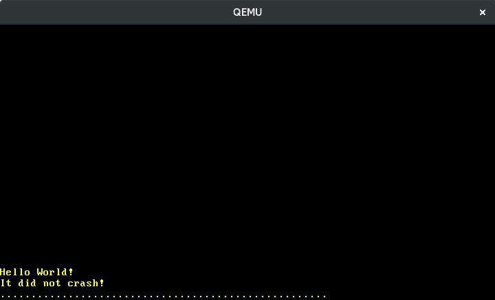

> 原文：[Hardware Interrupts](https://os.phil-opp.com/hardware-interrupts/)

本文将会配置可编程的中断控制器，用于正确地将硬件中断导向 CPU。和之前的异常处理函数类似，为了处理这些中断，我们需要往中断描述符表添加新表项。我们将会学到如何获取周期性的时钟中断和从键盘获取输入。

<!-- more -->

此博客在 [GitHub][github blog-os] 上公开开发。如果您有任何问题或疑问，请在那边打开一个 issue。 您也可以在 [底部][valine] 发表评论。这篇文章的完整源代码可以在 [blog-os-cn/07-hardware-interrupts][07-hardware-interrupts] 找到。

## 概览

中断提供了从附带的硬件设备通知 CPU 的途径。所以与其让内核为了定期检查键盘输入的新字符（这个过程称为 [*轮询*][polling]），键盘可以在每次按键时通知内核。因为内核只需要在事件发生时采取行动，所以这样要高效得多。由于内核可以立即响应而不用等到下一次轮询，这也缩短了响应时间。

将所有硬件设备直连到 CPU 是不可能的。一个独立的 *中断控制器* 从所有设备收集中断，然后通知 CPU：

```
                                    ____________             _____
               Timer ------------> |            |           |     |
               Keyboard ---------> | Interrupt  |---------> | CPU |
               Other Hardware ---> | Controller |           |_____|
               Etc. -------------> |____________|

```

大部分中断控制器都是可编程的，这意味着它们支持不同优先级的中断。例如，可编程使得可以赋予时钟中断比键盘中断更高的优先级，来确保准确的时钟同步。

和异常不同的是，硬件中断是 *异步* 触发的。也就是说它们完全独立于当前执行的代码，随时触发。这样给内核引入了某种形式的并发，少不了潜在的并发相关 bug。Rust 严格的所有权模型这时就排上了用场，它禁止全局可修改的状态。然而，后续文章我们可以看到死锁还是可能的。

## 8259 PIC

[Intel 8259] 是 1976 年出现的一个可编程的中断控制器（PIC）。虽然很久之前就被新版的 [APIC] 取代了，但是当代系统依然支持它的接口以保持向后兼容性。8259 PIC 的配置要比 APIC 来得简单很多，所以我们用它来入门中断，后续文章再切换到 APIC。

8259 有 8 条中断线路，多条用于和 CPU 通信。那时的典型系统都会配备两个 8259 PIC 实例，一个主 PIC 和一个副 PIC 连接到主 PIC 的一条中断线路。

```text
                     ____________                          ____________
Real Time Clock --> |            |   Timer -------------> |            |
ACPI -------------> |            |   Keyboard-----------> |            |      _____
Available --------> | Secondary  |----------------------> | Primary    |     |     |
Available --------> | Interrupt  |   Serial Port 2 -----> | Interrupt  |---> | CPU |
Mouse ------------> | Controller |   Serial Port 1 -----> | Controller |     |_____|
Co-Processor -----> |            |   Parallel Port 2/3 -> |            |
Primary ATA ------> |            |   Floppy disk -------> |            |
Secondary ATA ----> |____________|   Parallel Port 1----> |____________|
```

上图显示了中断线路的典型设置。可以看到 15 条线路的大多数都有固定的映射，例如副 PIC 的 4 号线连接到鼠标。

每个控制器都可以通过两个 [I/O 端口][I/O ports] 配置，一个“命令”端口和一个“数据”端口。对于主控制器，命名和数据端口分别为 `0x20` 和 `0x21`。对于副控制器，命令和数据端口则分别为 `0xa0` 和 `0xa1`。更多关于如何设置 PIC 的信息参见 [osdev.org 上的文章][article on osdev.org]

### 实现

由于会把范围在 0-15 的中断向量值传给 CPU，PIC 的默认设置用处不大。这些值已经被 CPU 异常占用了，例如 8 对应到二级异常。为了解决重叠问题，我们需要将 PIC 中断重新映射到不同的值。确切的值范围不重要，只要它们和异常的不重叠就行，但是通常会选择 32-47，因为这些是没被 32 个异常占用的首批可用值。 

配置的形式为向 PIC 的命令和数据端口写入特殊值。好在已有的 [`pic8259_simple`] 包可以排上用场，所以我们不需要手码初始化流程。如果对其原理感兴趣的话，可以阅读 [它的源码][pic crate source]。这是个相当小且文档注释良好的包。

为了将其添加为依赖，我们往项目添加以下片段：

```toml
# in Cargo.toml

[dependencies]
pic8259_simple = "0.2.0"
```

这个包提供的主要抽象接口是 [`ChainedPics`] 结构体，这个结构体表示前面看到的主/副 PIC 布局。它的预期用法如下：


```rust
// in src/interrupts.rs

use pic8259_simple::ChainedPics;
use spin;

pub const PIC_1_OFFSET: u8 = 32;
pub const PIC_2_OFFSET: u8 = PIC_1_OFFSET + 8;

pub static PICS: spin::Mutex<ChainedPics> =
    spin::Mutex::new(unsafe { ChainedPics::new(PIC_1_OFFSET, PIC_2_OFFSET) });
```

如前面解释的那样，我们把 PIC 的值范围设为 32-47。将 `ChainedPics` 结构体包裹在 `Mutex` 使得我们可以安全地得到修改权限（借助 [`lock` 方法][spin mutex lock]），这在后续步骤会用上。因为传入错误的偏移会导致未定义行为，所以 `ChainedPics::new` 函数是不安全的。

现在就可以在 `init` 函数中初始化 8259 PIC 了：

```rust
// in src/lib.rs

pub fn init() {
    gdt::init();
    interrupts::init_idt();
    unsafe { interrupts::PICS.lock().initialize() }; // new
}
```

调用 [`initialize`] 函数执行 PIC 的初始化。和 `ChainedPics::new` 函数类似，如果配置错误的 PIC 会触发未定义行为，所以这个函数也是不安全的。


如果一切正常的话，执行 `cargo run` 后我们应该能够继续看到 "It did not crash" 的字样。

## 启用中断

到目前为止，由于 CPU 的配置仍然禁用中断，所以不会发生任何事。这意味着 CPU 根本不会监听中断控制器，所以没有任何中断能够到达 CPU。让我们稍作调整：

```rust
// in src/lib.rs

pub fn init() {
    gdt::init();
    interrupts::init_idt();
    unsafe { interrupts::PICS.lock().initialize() };
    x86_64::instructions::interrupts::enable();     // new
}
```

`x86_64` 包的 `interrupts::enable` 函数执行特殊的 `sti` 指令（"set interrupts"）来启用外部中断。现在执行 `cargo run` 可以看到以下二级异常：


二级异常触发的原因是硬件计算器（更确切地说是 [Intel 8259] 的）默认是启用的，所以一旦启用中断，我们就会收到时钟中断。由于没有为其定义处理函数，所以二级异常被触发了。


## 处理时钟中断
由 [上图](#_8259-pic) 可知，计时器使用了主 PIC 的 0 号线路。这意味着到达 CPU 时的值为 32（0 + 偏移）。我们用一个 `InterruptIndex` 枚举类型存储它，而不是硬编码这个索引 32：

```rust
// in src/interrupts.rs

#[derive(Debug, Clone, Copy)]
#[repr(u8)]
pub enum InterruptIndex {
    Timer = PIC_1_OFFSET,
}

impl InterruptIndex {
    fn as_u8(self) -> u8 {
        self as u8
    }

    fn as_usize(self) -> usize {
        usize::from(self.as_u8())
    }
}
```

这是个 [类 C 的枚举类型][C-like enum]，所以我们可以直接注明每个枚举值的索引。`repr(u8)` 属性规定每个枚举值用一个 `u8` 表示。将来我们还会为其他中断添加更多枚举值。

现在可以为时钟中断添加处理函数了：

```rust
// in src/interrupts.rs

use crate::print;

lazy_static! {
    static ref IDT: InterruptDescriptorTable = {
        let mut idt = InterruptDescriptorTable::new();
        idt.breakpoint.set_handler_fn(breakpoint_handler);
        […]
        idt[InterruptIndex::Timer.as_usize()]
            .set_handler_fn(timer_interrupt_handler); // new

        idt
    };
}

extern "x86-interrupt" fn timer_interrupt_handler(
    _stack_frame: &mut InterruptStackFrame)
{
    print!(".");
}
```

因为 CPU 对异常和外部中断的响应是一样的（两者的唯一区别是某些异常会压入一个错误码），所以 `timer_interrupt_handler` 的函数签名和异常处理函数一样。[`InterruptDescriptorTable`] 结构体实现了 [`IndexMut`] trait，所以我们可以直接利用数组索引语法访问各个元素。

时钟中断处理函数往屏幕打印一个点。由于时钟中断时周期性发生的，我们应该能够看到每个时钟周期会打印多一个点。然而，运行结果显示只打印了一个点：


### 中断的结束

原因是 PIC 期望从中断处理函数得到一个明确的 “end of interrupt”（EOI）信号。这个信号告诉控制器中断已被处理，整个系统可以继续接收下一个中断了。所以 PIC 以为我们还在忙着处理第一个时钟中断，耐心地等待到 EOI 信号后再发送下一个中断。

发送 EOI 再次用上静态的 `PICS` 结构体：

```rust
// in src/interrupts.rs

extern "x86-interrupt" fn timer_interrupt_handler(
    _stack_frame: &mut InterruptStackFrame)
{
    print!(".");

    unsafe {
        PICS.lock()
            .notify_end_of_interrupt(InterruptIndex::Timer.as_u8());
    }
}
```

`notify_end_of_interrupt` 会确定发送中断的是主 PIC 还是副 PIC，然后使用 `command` 和 `data` 端口给相应的控制器发送 EOI 信号。如果副 PIC 发送了中断，因为它连接到主 PIC 的输入线路，所以两个 PIC 都需要被通知。

我们需要仔细确认使用正确的中断向量值，否则有可能无意间删掉了未发送的重要中断或者导致系统卡住。这是函数为什么是不安全的原因。

现在执行 `cargo run` 可以看到点会周期性地打印到屏幕上了：


### 配置计时器

我们使用的硬件计时器被称为 *可编程间隔计时器（Progammable Interval Timer）* 或者简称 PIT。如其名，我们可以设置两个中断的间隔。由于就快切换到 [APIC 计时器][APIC timer] 了，所以具体细节不在此深究，但是 OSDev wiki 有关于 [配置 PIT][configuring the PIT] 的大量相关文章。

## 死锁

我们的内核现在有了一定程度的并发：计时器会触发异步中断，所以他们可以随时中断 `_start` 函数。好在 Rust 的所有权系统在编译时就可以防止多种并发相关的 bug。死锁是其中最著名的一个。如果一个线程试图获取一个绝不会被释放的锁就会触发死锁。那时线程会一直卡住。

我们的内核已经可以触发死锁了。如果没有忘记的话，`println` 宏调用 `vga_buffer::_print` 函数，这个函数会使用自旋锁 [锁定一个全局的 `WRITER`][vga spinlock]：

```rust
// in src/vga_buffer.rs

[…]

#[doc(hidden)]
pub fn _print(args: fmt::Arguments) {
    use core::fmt::Write;
    WRITER.lock().write_fmt(args).unwrap();
}
```

这个函数锁定 `WRITER`，调用它的 `write_fmt`，会在函数末尾隐式地释放锁。现在假想这么个场景：`WRITER` 被锁定时，一个中断被触发了，中断处理函数也试图打印一些东西：


| 时间戳 | `_start`              | 中断处理函数                        |
| ------ | --------------------- | ----------------------------------- |
| 0      | 调用 `println!`       |                                     |
| 1      | `print` 锁定 `WRITER` |                                     |
| 2      |                       | **中断触发**，处理函数开始运行      |
| 3      |                       | 调用 `println!`                     |
| 4      |                       | `print` 试图锁定 `WRITER`（已上锁） |
| 4      |                       | `print` 试图锁定 `WRITER`（已上锁） |
| ...    |                       | ...                                 |
| _绝不_ | _释放 `WRITER`_       |

`WRITER` 被锁定了，所以中断处理函数会一直等到锁被释放。但是这个释放绝不会发生，因为 `_start` 函数只会在中断处理函数返回后继续运行。因此，整个系统就卡住了。

### 触发死锁

我们可以在 `_start` 函数的末尾循环打印一些信息，从而轻易地触发这个死锁：

```rust
// in src/main.rs

#[no_mangle]
pub extern "C" fn _start() -> ! {
    […]
    loop {
        use blog_os::print;
        print!("-");        // new
    }
}
```

在 QEMU 里面运行可以得到以下形式的输出：


可以看到第一个时钟中断触发前，只有有限个横杠被打印了。因为时钟中断处理函数试图打印点时被锁死，所以整个系统卡住了。这是我们为什么没有在上面的输出看到点的原因。

因为中断是异步触发的，多次运行看到横杠的确切数目也是不定的。这种不确定性使得调试并发相关 bug 非常困难。

### 修复死锁

为了避免这个死锁，`Mutex` 被锁定期间禁止中断：

```rust
// in src/vga_buffer.rs

/// Prints the given formatted string to the VGA text buffer
/// through the global `WRITER` instance.
#[doc(hidden)]
pub fn _print(args: fmt::Arguments) {
    use core::fmt::Write;
    use x86_64::instructions::interrupts;   // new

    interrupts::without_interrupts(|| {     // new
        WRITER.lock().write_fmt(args).unwrap();
    });
}
```

[`without_interrupts`] 函数接收一个 [闭包][closure]，在无中断环境下运行这个闭包。我们使用它来确保 `Mutex` 被锁定期间不会触发任何中断。现在运行内核可以看到它会一直运行而不会卡住。（我们仍然没有看到任何点，但是这是因为他们滚动太快了。可以试试减慢打印速度，例如在循环里面添加一个 `for _ in 0..10000 {}`）

同样的更改可以应用到串口打印函数，从而也消除那里的死锁：

```rust
// in src/serial.rs

#[doc(hidden)]
pub fn _print(args: ::core::fmt::Arguments) {
    use core::fmt::Write;
    use x86_64::instructions::interrupts;       // new

    interrupts::without_interrupts(|| {         // new
        SERIAL1
            .lock()
            .write_fmt(args)
            .expect("Printing to serial failed");
    });
}
```

需要注意的是禁用中断不应该是一个通用解决方案。原因是它增大了最坏情况下的中断时延，即系统响应一个中断的时间。因此，禁用中断的时长应该非常短暂。

## 修复竞争条件

运行 `cargo test` 可能会看到 `test_println_output` 测试失败：

```bash
> cargo test --lib
[…]
Running 4 tests
test_breakpoint_exception...[ok]
test_println... [ok]
test_println_many... [ok]
test_println_output... [failed]

Error: panicked at 'assertion failed: `(left == right)`
  left: `'.'`,
 right: `'S'`', src/vga_buffer.rs:205:9
```

原因是这个测试函数和时钟处理函数之间存在 *竞争条件*。这个测试函数如下：

```rust
// in src/vga_buffer.rs

#[test_case]
fn test_println_output() {
    let s = "Some test string that fits on a single line";
    println!("{}", s);
    for (i, c) in s.chars().enumerate() {
        let screen_char = WRITER.lock().buffer.chars[BUFFER_HEIGHT - 2][i].read();
        assert_eq!(char::from(screen_char.ascii_character), c);
    }
}
```

这个测试函数往 VGA 缓冲打印一个字符串，然后遍历 `buffer_chars` 数组人为检查输出。因为时钟中断处理函数可能在 `println` 和读取屏幕字符之间运行，所以出现了竞争条件。需要注意的是这不是 Rust 在编译时完全禁止的危险的 *数据竞争*。更多详情参见 [_Rustonomicon_][nomicon-races]。

为了解决这个问题，我们需要在测试期间一直锁定 `WRITER` ，这样时钟中断处理函数就无法在中间往屏幕打印 `.` 了。修复的测试代码如下：

```rust
// in src/vga_buffer.rs

#[test_case]
fn test_println_output() {
    use core::fmt::Write;
    use x86_64::instructions::interrupts;

    let s = "Some test string that fits on a single line";
    interrupts::without_interrupts(|| {
        let mut writer = WRITER.lock();
        writeln!(writer, "\n{}", s).expect("writeln failed");
        for (i, c) in s.chars().enumerate() {
            let screen_char = writer.buffer.chars[BUFFER_HEIGHT - 2][i].read();
            assert_eq!(char::from(screen_char.ascii_character), c);
        }
    });
}
```

我们作出了以下更改：

- 显式调用 `lock()` 函数保持整个测试期间 writer 被锁住。使用 [`writeln`] 宏往已锁定的 writer 打印字符，而不是 `println`
- 为了避免另一个死锁，整个测试期间禁止中断。否则，writer 仍被锁定期间，测试可能会被中断
- 由于时钟中断处理函数仍可能在测试运行前执行，我们在打印字符串 `s` 前打印一个新的换行符 `\n`。这样可以避免时钟处理函数已经往当前行打印了一些 `.` 字符导致测试失败的问题

实施以上更改后，`cargo test` 现在会再次确定性地成功了。

这只是个非常无害的竞争条件，只会导致测试失败。但是可以想象，由于不确定性，调试其他竞争条件要复杂得多。好在 Rust 为我们防止了数据竞争，这类竞争是竞争条件中最为严重的一类，会触发各种未定义行为，包括系统崩溃和消无声息的内存污染。

## `hlt` 指令
目前为止，我们一直在 `_start` 和 `panic` 函数的末尾使用一个简单的空循环。这使得 CPU 无限自旋，从而按预期运行。由于没有活要干时 CPU 也全速运行，所以是非常低效的。运行内核时可以在任务管理器发现这个问题：QEMU 进程一直需要将近 100% 的 CPU。

我们真正想做的是在下次中断到达前挂起 CPU。这样允许 CPU 进入睡眠状态，消耗更少电量。[`hlt` 指令][`hlt` instruction] 为此而生。让我们用这个指令创建一个用电高效型无限循环吧：

```rust
// in src/lib.rs

pub fn hlt_loop() -> ! {
    loop {
        x86_64::instructions::hlt();
    }
}
```

`instructions::hlt` 函数只是汇编指令的一层 [薄封装][thin wrapper]。因为不会破坏内存安全，所以是安全的。

现在我们可以在 `_start` 和 `panic` 函数里面使用 `hlt_loop` 而不是无限循环了：

```rust
// in src/main.rs

#[no_mangle]
pub extern "C" fn _start() -> ! {
    […]

    println!("It did not crash!");
    blog_os::hlt_loop();            // new
}

#[cfg(not(test))]
#[panic_handler]
fn panic(info: &PanicInfo) -> ! {
    println!("{}", info);
    blog_os::hlt_loop();            // new
}
```

同样地也更新 `lib.rs`：

```rust
// in src/lib.rs

/// Entry point for `cargo test`
#[cfg(test)]
#[no_mangle]
pub extern "C" fn _start() -> ! {
    init();
    test_main();
    hlt_loop();         // new
}

pub fn test_panic_handler(info: &PanicInfo) -> ! {
    serial_println!("[failed]\n");
    serial_println!("Error: {}\n", info);
    exit_qemu(QemuExitCode::Failed);
    hlt_loop();         // new
}
```

再次在 QEMU 运行内核可以看到 CPU 使用率低了很多。

## 键盘输入

可以处理外部设备的中断后，我们终于能够支持键盘输入了。这会让我们首次和内核进行交互。

需要注意的是我们目前只讲解如何处理 [PS/2] 键盘，不包括 USB 键盘，然而，主板为了支持旧版软件，会用 PS/2 设备模拟 USB 键盘，所以在内核支持 USB 之前我们可以安全地忽略 USB 键盘。

和硬件时钟类似，键盘控制器默认也是开启的。所以按下一个按键后，键盘控制器会发送一个中断给 PIC，然后中断被导向 CPU。CPU 从 IDT 搜索相应的处理函数，但是发现对应项为空。因此触发了二级异常。

让我们为键盘中断添加处理函数。这和为时钟中断定义处理函数非常类似，只是使用不同的中断值而已：

```rust
// in src/interrupts.rs

#[derive(Debug, Clone, Copy)]
#[repr(u8)]
pub enum InterruptIndex {
    Timer = PIC_1_OFFSET,
    Keyboard, // new
}

lazy_static! {
    static ref IDT: InterruptDescriptorTable = {
        let mut idt = InterruptDescriptorTable::new();
        idt.breakpoint.set_handler_fn(breakpoint_handler);
        […]
        // new
        idt[InterruptIndex::Keyboard.as_usize()]
            .set_handler_fn(keyboard_interrupt_handler);

        idt
    };
}

extern "x86-interrupt" fn keyboard_interrupt_handler(
    _stack_frame: &mut InterruptStackFrame)
{
    print!("k");

    unsafe {
        PICS.lock()
            .notify_end_of_interrupt(InterruptIndex::Keyboard.as_u8());
    }
}
```

由 [上图](#_8259-pic) 可知，键盘使用了主 PIC 的 1 号线路。这意味着它到达 CPU 时的值是 33（1 + 偏移 32）。我们向 `InterruptIndex` 枚举类型添加一个新的 `Keyboard` 枚举值。由于枚举值默认为前一项的值加一，也是 33，所以我们不需要显示地设置枚举值。中断处理函数中，我们打印一个 `k`，然后把中断结束信号发送给中断控制器。

现在按键时可以在屏幕上看到一个 `k`。然而，只有第一次按键有效，即使我们继续按键也不会在屏幕上看到更多 `k`。这是因为除非读取按键的所谓 *扫描码*（scancode），否则键盘控制器不会再次发送中断。

### 读取扫描码

为了查明 *具体* 按下的键，我们需要向键盘控制器查询。具体做法为从 PS/2 控制器的数据端口读取，一个值为 `0x60` 的 [I/O 端口][I/O ports]：

```rust
// in src/interrupts.rs

extern "x86-interrupt" fn keyboard_interrupt_handler(
    _stack_frame: &mut InterruptStackFrame)
{
    use x86_64::instructions::port::Port;

    let mut port = Port::new(0x60);
    let scancode: u8 = unsafe { port.read() };
    print!("{}", scancode);

    unsafe {
        PICS.lock()
            .notify_end_of_interrupt(InterruptIndex::Keyboard.as_u8());
    }
}
```

我们使用 `x86_64` 包的 [`Port`] 类型从键盘的数据端口读取一字节。这个字节成为 [*扫描码*][_scancode_]，表示按下/释放的键。我们目前还不会对扫描码做任何事情，只是把它打印到屏幕：




上图显示缓慢敲入 "123" 的情形。可以看到相邻的键有邻近的扫描码，按下和释放键的扫描码是不同的。那我们得如何把扫描码翻译为确切的按键动作呢？

### 翻译扫描码

目前将扫描码映射到键有三种不同标准，即所谓的 *扫描码集*。三种标准都源自早期 IBM 电脑的键盘：[IBM XT]、[IBM 3270 PC] 和 [IBM AT]。好在后来的电脑都没有兴起定义新扫描集的风气，而是模拟现有集合或拓展它们。今天的大多数键盘都可以配置为模拟上述三种集合中的任何一个：

PS/2 键盘默认模拟的是扫描码集 1（“XT”）。对于这个集合，扫描码字节的低 7 位定义键值，最高有效位定义按键动作是按下（“0”）还是释放（“1”）。[IBM XT] 键盘没有定义的键，例如键盘的 enter 键，对应到两个连续的扫描码：一个 `0xe0` 转义字节，然后是一个表示键的字节。想要查看集合 1 的所有扫描码和相应键的话，参见 [OSDev Wiki][scancode set 1]。

我们借助 `match` 语句将扫描码翻译为键：

```rust
// in src/interrupts.rs

extern "x86-interrupt" fn keyboard_interrupt_handler(
    _stack_frame: &mut InterruptStackFrame)
{
    use x86_64::instructions::port::Port;

    let mut port = Port::new(0x60);
    let scancode: u8 = unsafe { port.read() };

    // new
    let key = match scancode {
        0x02 => Some('1'),
        0x03 => Some('2'),
        0x04 => Some('3'),
        0x05 => Some('4'),
        0x06 => Some('5'),
        0x07 => Some('6'),
        0x08 => Some('7'),
        0x09 => Some('8'),
        0x0a => Some('9'),
        0x0b => Some('0'),
        _ => None,
    };
    if let Some(key) = key {
        print!("{}", key);
    }

    unsafe {
        PICS.lock()
            .notify_end_of_interrupt(InterruptIndex::Keyboard.as_u8());
    }
}
```

上述代码翻译键值为 0-9 的按键，并忽略其他所有键。代码使用 [match] 语句为每个扫描码分配一个字符或 `None`。然后使用 [`if let`] 来解构可选的 `key`。模式使用同样的变量名 `key` 会 [掩盖][shadow] 之前的声明，这是 Rust 解构 `Option` 类型的一个常见模式。

现在我们就可以写入数字了：


其他键的翻译流程也是一样的。好在现有一个名为 [`pc-keyboard`] 的包用于翻译扫描码集 1 和 2，所以我们不需要自己造了。为了使用这个包，把它添加到 `Cargo.toml`，然后在 `lib.rs` 导入它：

```toml
# in Cargo.toml

[dependencies]
pc-keyboard = "0.5.0"
```

现在使用这个包来重写 `keyboard_interrupt_handler`：

```rust
// in/src/interrupts.rs

extern "x86-interrupt" fn keyboard_interrupt_handler(
    _stack_frame: &mut InterruptStackFrame)
{
    use pc_keyboard::{layouts, DecodedKey, HandleControl, Keyboard, ScancodeSet1};
    use spin::Mutex;
    use x86_64::instructions::port::Port;

    lazy_static! {
        static ref KEYBOARD: Mutex<Keyboard<layouts::Us104Key, ScancodeSet1>> =
            Mutex::new(Keyboard::new(layouts::Us104Key, ScancodeSet1,
                HandleControl::Ignore)
            );
    }

    let mut keyboard = KEYBOARD.lock();
    let mut port = Port::new(0x60);

    let scancode: u8 = unsafe { port.read() };
    if let Ok(Some(key_event)) = keyboard.add_byte(scancode) {
        if let Some(key) = keyboard.process_keyevent(key_event) {
            match key {
                DecodedKey::Unicode(character) => print!("{}", character),
                DecodedKey::RawKey(key) => print!("{:?}", key),
            }
        }
    }

    unsafe {
        PICS.lock()
            .notify_end_of_interrupt(InterruptIndex::Keyboard.as_u8());
    }
}
```

使用 `lazy_static` 宏创建用 Mutex 保护的静态 [`Keyboard`] 对象。我们用美式键盘布局和扫描码集 1 来初始化 `Keyboard`。[`HandleControl`] 参数允许将 `ctrl+[a-z]` 映射到 Unicode 字符集 `U+0001` 到 `U+001A`。我们不想这么做，所以使用 `Ignore` 选项把 `ctrl` 和常规键一样看待。

对于每个中断，我们锁定 Mutex，从键盘控制器读取扫描码，把扫描码传给 [`add_byte`] 方法将其翻译为一个 `Option<KeyEvent>`。[`KeyEvent`] 包含触发事件的键和按键动作类型（按下还是释放）。

为了翻译这个按键事件，我们将其传给 [`process_keyevent`] 方法，在允许条件下将按键事件翻译为字符。例如，根据 shift 键是否按下，把 `A` 键的按键事件翻译为小写的 `a` 字符或大写的 `A` 字符。

有了这个改版的中断处理函数后，我们就可以敲入文本了：


### 配置键盘

PS/2 键盘的某些方面也可以配置的，例如应该使用的扫描码集。考虑到文章已经够长了，在此不再赘述，可见参见 OSDev wiki 对可能的 [配置命令][configuration commands] 的概览。

## 总结

本文讲解如何启用和处理外部中断。我们学习了 8259 PIC 和它的主/副布局，中断数值的重新映射和“中断结束”信号。我们为硬件时钟和键盘实现了处理函数，并学到了 `hlt` 指令，这个指令会挂起 CPU 直至下一个中断到来。

现在我们可以和内核交互，有了一些创建小型 shell 或简单游戏的基础组件。

## 下篇预告

时钟中断对操作系统是不可或缺的，它们提供了周期性中断运行中进程的途径，让内核可以重获控制权。然后内核可以切换到不同进程，创造出多个进程在并行运行的假象。

但是创建进程或线程前，我们需要为他们分配内存的方法。下篇文章将会探究内存管理来实现这个基础组件。

[APIC]: https://en.wikipedia.org/wiki/Intel_APIC_Architecture
[APIC timer]: https://wiki.osdev.org/APIC_timer
[C-like enum]: https://doc.rust-lang.org/reference/items/enumerations.html#custom-discriminant-values-for-fieldless-enumerations
[IBM AT]: https://en.wikipedia.org/wiki/IBM_Personal_Computer/AT
[IBM XT]: https://en.wikipedia.org/wiki/IBM_Personal_Computer_XT
[IBM 3270 PC]: https://en.wikipedia.org/wiki/IBM_3270_PC
[Intel 8253]: https://en.wikipedia.org/wiki/Intel_8253
[Intel 8259]: https://en.wikipedia.org/wiki/Intel_8259
[I/O ports]: @/second-edition/posts/04-testing/index.md#i-o-ports
[PS/2]: https://en.wikipedia.org/wiki/PS/2_port

[article on osdev.org]: https://wiki.osdev.org/8259_PIC
[closure]: https://doc.rust-lang.org/book/second-edition/ch13-01-closures.html
[configuration commands]: https://wiki.osdev.org/PS/2_Keyboard#Commands
[configuring the PIT]: https://wiki.osdev.org/Programmable_Interval_Timer
[github blog-os]: https://github.com/phil-opp/blog_os
[match]: https://doc.rust-lang.org/book/ch06-02-match.html
[nomicon-races]: https://doc.rust-lang.org/nomicon/races.html
[pic crate source]: https://docs.rs/crate/pic8259_simple/0.2.0/source/src/lib.rs
[polling]: https://en.wikipedia.org/wiki/Polling_(computer_science)
[scancode set 1]: https://wiki.osdev.org/Keyboard#Scan_Code_Set_1
[shadow]: https://doc.rust-lang.org/book/ch03-01-variables-and-mutability.html#shadowing
[spin mutex lock]: https://docs.rs/spin/0.5.2/spin/struct.Mutex.html#method.lock
[thin wrapper]: https://github.com/rust-osdev/x86_64/blob/5e8e218381c5205f5777cb50da3ecac5d7e3b1ab/src/instructions/mod.rs#L16-L22
[vga spinlock]: @/second-edition/posts/03-vga-text-buffer/index.md#spinlocks
[valine]: #valine

[`ChainedPics`]: https://docs.rs/pic8259_simple/0.2.0/pic8259_simple/struct.ChainedPics.html
[`HandleControl`]: https://docs.rs/pc-keyboard/0.5.0/pc_keyboard/enum.HandleControl.html
[`IndexMut`]: https://doc.rust-lang.org/core/ops/trait.IndexMut.html
[`InterruptDescriptorTable`]: https://docs.rs/x86_64/0.11.1/x86_64/structures/idt/struct.InterruptDescriptorTable.html
[`Keyboard`]: https://docs.rs/pc-keyboard/0.5.0/pc_keyboard/struct.Keyboard.html
[`KeyEvent`]: https://docs.rs/pc-keyboard/0.5.0/pc_keyboard/struct.KeyEvent.html
[`Port`]: https://docs.rs/x86_64/0.11.1/x86_64/instructions/port/struct.Port.html

[`add_byte`]: https://docs.rs/pc-keyboard/0.5.0/pc_keyboard/struct.Keyboard.html#method.add_byte
[`hlt` instruction]: https://en.wikipedia.org/wiki/HLT_(x86_instruction)
[`if let`]: https://doc.rust-lang.org/book/ch18-01-all-the-places-for-patterns.html#conditional-if-let-expressions
[`initialize`]: https://docs.rs/pic8259_simple/0.2.0/pic8259_simple/struct.ChainedPics.html#method.initialize
[`pc-keyboard`]: https://docs.rs/pc-keyboard/0.5.0/pc_keyboard/
[`pic8259_simple`]: https://docs.rs/pic8259_simple/0.2.0/pic8259_simple/
[`process_keyevent`]: https://docs.rs/pc-keyboard/0.5.0/pc_keyboard/struct.Keyboard.html#method.process_keyevent
[`without_interrupts`]: https://docs.rs/x86_64/0.11.1/x86_64/instructions/interrupts/fn.without_interrupts.html
[`writeln`]: https://doc.rust-lang.org/core/macro.writeln.html

[_scancode_]: https://en.wikipedia.org/wiki/Scancode

[07-hardware-interrupts]: https://github.com/sammyne/blog-os-cn/tree/master/07-hardware-interrupts
