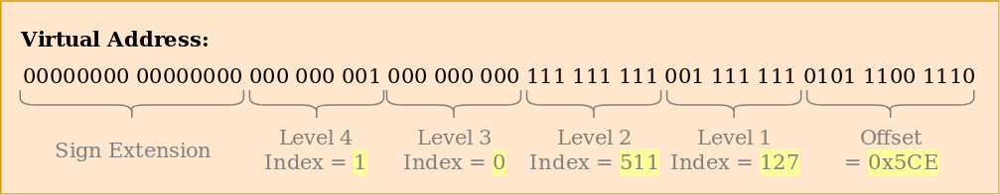

> 原文：[Introduction to Paging](https://os.phil-opp.com/paging-introduction/)

本文介绍 _分页_，这是我们的操作系统将会使用的相当常见的内存管理模式。它会解释为什么需要内存隔离，*分段* 是如何工作的，什么是 *虚拟内存*，以及分页如何解决内存碎片化问题。它还会探索 x86_64 架构的多级页表布局。

<!-- more -->

此博客在 [GitHub][github blog-os] 上公开开发。如果您有任何问题或疑问，请在那边打开一个 issue。 您也可以在 [底部][valine] 发表评论。这篇文章的完整源代码可以在 [blog-os-cn/08-paging-introduction][08-paging-introduction] 找到。

## 内存保护

操作系统的主要工作之一是将程序彼此隔离。例如，网页浏览器不应该能够干预文本编辑器。为了实现这个目标，操作系统利用硬件功能确保一个进程的内存区域不能被其他进程访问。根据硬件和操作系统的不同，实现方式也是不同的。

举个例子说，某些 ARM Cortex-M 处理器（用于嵌入式系统）有一个 [内存保护单元][_Memory Protection Unit_]（MPU），这个单元允许我们定义少数具有不同访问权限（例如，不可访问、只读、读写）的内存区域。每次内存访问，MPU 确保访问的地址都在具有合法访问权限的区域，否则就抛出异常。通过每次进程切换时改变区域和访问权限，操作系统可以确保每个进程只能访问自己的内存，从而将进程彼此隔离。

x86 架构的硬件支持两种内存保护方式：[分段][segmentation] 和 [分页][paging]。

## 分段

早在 1978 年就出现了分段，用于增加可寻址的内存大小。那时的情形是 CPU 只使用 16 比特的地址，限制了可寻址内存大小为 64KiB。为了使得可用内存大于 64KiB，额外的段寄存器出现了，每个都包含一个偏移地址。每次内存访问时，CPU 会自动地添加这个偏移，从而使得可寻址的内存增加到 1MiB。

根据内存访问类型，分段寄存器自动选择段寄存器：代码段寄存器 `CS` 用于加载指令，栈段寄存器 `SS` 用于栈操作（入栈/出栈）。其他指令使用数据段寄存器 `DS` 或者额外的段寄存器 `ES`。后来还添加两个额外的、可以自由使用的段寄存器 `FS` 和 `GS`。

第一版分段实现中，段寄存器直接包含偏移，并没有执行访问控制。这个现象后来随着 [*保护模式*][_protected mode_] 的引入而改变。当 CPU 运行这种模式时，段描述符包含一个局部或全局 [*描述符表*][_descriptor table_] 的索引，这个表包含偏移地址之外还有段大小和访问权限。通过为每个进程加载全局/局部的描述表，限定内存访问只会落在自己的内存区域内，从而 OS 可以隔离不同的进程。

在真实访问之前更改内存地址，分段已经采用了现在几乎无所不在的技巧：*虚拟内存*。

### 虚拟内存

虚拟内存背后的思想是从底层的物理存储设备抽象出内存地址。不是直接访问存储设备，而是先执行地址转换步骤。对于分段，转换步骤就是把活跃段的偏移地址加上去。例如，一个程序访问偏移为 `0x1111000` 的某段的内存地址 `0x1234000`时：真正访问到的是 `0x2345000 = 0x1111000 + 0x1234000`。

为了区分两种地址类型，转换之前的地址称为 *虚拟地址*，之后的则称为 *物理地址*。两者的重要区别之一是物理地址是唯一且总是指向一样的、不同的内存位置。虚拟地址则依赖于转换函数。两个不同的虚拟地址指向同一个物理地址是完全可能的。使用不同的转换函数，同样的虚拟地址也可以指向不同物理地址。

这个特性在并行地运行两个同样的程序是很有用：


这里同样的程序运行两次，但是使用不同的转换函数。第一个实例的段偏移为 100，所以它的虚拟地址 0-150 转换到物理地址 100-250。第二个实例的段偏移则为 300，所以它的虚拟地址 0-150 转换到物理地址 300-450。这样就允许两个程序运行同样的代码和虚拟地址而不会干预彼此。

另一个好处是：即使它们使用完全不同的虚拟地址，程序现在可以放置在任意物理内存了。因此，OS 可以利用完整的可用内存而无需重新编译程序。

### 碎片化

虚拟和物理地址的区别使得分段真正意义上变得强大。然而， 它也有碎片化的问题。举个例子，假设现在要再多运行程序的一个副本：


尽管还有足够的空闲内存，但是没有办法将第三个程序实例映射到虚拟内存而不发生重叠。问题出在我们需要 *连续* 内存，无法使用小的空闲块。

一种应对这种碎片化的方法是暂停运行，将已使用的内存扎堆放到一起，更新转换函数，然后恢复运行：


现在我们就有足够的连续空间用来启动第三个程序实例了。

去碎片化的缺点是需要拷贝大量内存，这样会带来性能损耗。它还需要在内存变得过份碎片化前定期执行。由于程序可能会被随机暂停而变得不响应，这样就会无法预测性能了。

碎片化问题是目前大多数系统不再使用分段的原因之一。事实上，x86 的 64 位模式也不再支持分段。登场的是 *分页*，完全避免了碎片化的问题。

## 分页

思想是将虚拟和物理内存空间划分为小的、固定大小的块。虚拟内存空间的块称为 *页*，物理空间的块称为 *帧*。每页都会被独立地映射到帧，使得将更大的内存区域分割为不连续的物理帧变得可能。

回想一下碎片化的内存空间，这时用分页代替分段，优点就会显现出来了：


这个例子中，页面大小为 50 字节，所以每个（虚拟）内存区域被分割为三页。每页独立地映射到帧，使得连续的虚拟内存区域可以被映射到不连续的物理帧。这样我们就不用事先执行任何去碎片化的操作，就可以启动第三个程序实例了。

### 隐藏的碎片化

和分段相比，分页使用很多小的、固定大小的内存区域而不是一些大的、可变大小的区域。由于每帧大小一致，不会出现帧太小无法使用的情况，所以不会出现碎片化的问题。

*看起来* 分页不会出现碎片化的样子。但是其实还是出现一些隐藏的的碎片，称为 *内部碎片化*。内部碎片化出现是因为不是每个内存区域都是页面大小的整数倍。设想上述例子中出现一个大小为 101 的程序：这个程序依然得使用三个大小 50 的页面，所以会占用不必要的 49 字节。为了区分这两种碎片化问题，分段时出现的碎片化称为 *外部碎片化*。

内存碎片化尽管不好，但是总比伴随分段的外部碎片化要好。它仍然会浪费内存，但是不要求去碎片化，使得碎片化的大小变得可预测（平均情况下占每个内存区域半个页面大小）。

### 页表

可以看到潜在成千上万的每一页会被独立地映射到页帧。这些映射信息需要存放到某地。分段使用一个独立的段选择寄存器来记录每个活跃的内存区域，但是对于分页来说就不现实了，因为页的数目要远大于寄存器。分页使用了一个称为 *页表* 的结构来存储映射信息。

对于上述例子，页表结构如下：


可以看到每个程序实例都有自己的页表。当前活跃页表的指针存在一个特殊的 CPU 寄存器中。`x86` 架构下，这个寄存器称为 `CR3`。在运行每个程序实例前，为这个寄存器加载正确的页表指针是操作系统的工作。

对于每次内存访问，CPU 会从寄存器读取页表指针，在页表中找到访问页映射到的帧。整个过程在硬件内进行，对于正在运行的程序完全透明。为了加快转换流程，许多 CPU 架构都有一个特殊的缓存用于记录上一次转换的结果。

根据架构的不同，页表项也可以在标识符字段中存储诸如访问权限等属性。上述例子中，"r/w" 标识符标识页面可读可写。

### 多级页表

我们刚刚看到的简单页表占用更大的地址空间：它们会浪费内存。例如，假如现有一个程序使用四个虚拟页面 `0`、`1_000_000`、`1_000_050` 和 `1_000_100`（我们使用 `_` 作为千位分隔符）：


程序只需要 4 个物理帧，但是整个页表有一百多万个表项。一旦忽略空的表项，CPU 将不能在转换过程中直接跳到正确的表项（例如，它不再确定第四页使用的是第四个表项）。

为了减少空间浪费，我们可以使用 **两级页表**。思想是为不同地址区域使用不同的页表。新添表称为 *二级页表*，包含地址区域到（一级）页表的映射。

举例最能解释这个问题。令每个一级页表负责大小为 `10_000` 的区域。然后上述例子映射对应以下页表：


第 0 页落在第一个 `10_000` 的区域，所以它使用二级页表的第一项。这个表项指向一级页表 T1，T1 规定第 `0` 页指向第 `0` 帧。

页面 `1_000_000`、`1_000_050` 和 `1_000_100` 都落在第 100 个 `10_000` 的字节区域内，所以他们使用二级页表的第 100 项。这个表项指向另一个一级页表 T2，分别将页面映射到帧 `100`、`150` 和 `200`。需要注意的是：一级页表的页地址没有包含区域偏移，所以页 `1_000_050` 的对应表项为 `50`。

二级页表依然还有 100 个空表项，但是远小于之前百万级别的空表项。具体原因是我们不需要为 `10_000` 到 `1_000_000` 范围内尚未映射的内存区域 创建一级页表。

两级页表原理可以推广到三级、四级或多级。页表寄存器指向最高级页表，最高级页表指向下一级页表，下一级页表再指向下一级，依此类推。一级页表指向映射的帧。这个原因通常称为 *多级* 或 *分层* 页表。

了解到分页和多级页表的工作原理后，我们现在看一下 x86_64 架构的分页是如何实现的（后续部分假设 CPU 以 64 位模式运行）。

## x86_64 架构的分页

x86_64 架构使用四级页表，每页大小为 4KiB。每级页表都有固定 512 个表项。每个表项大小为 8 字节，所以每个表大小为 512 * 8B = 4KiB，刚好可以在一页内放下。

不同层级的页表索引可以直接从虚拟地址从推算：


可以看到每个页表索引占 9 位，对应到每个页表有 2^9 = 512 个表项。最低的 12 位是 4KiB 页内的偏移（2^12 bytes = 4KiB）。 
48 到 64 位被抛弃，即 x86_64 结构没有真正地使用 64 位，而是仅使用了 48 位地址。

48 到 64 位尽管被废弃了，但不能被设置为任意值。这个范围内的所有位必须设置为第 47 位的副本，用于保持地址唯一和支持诸如五级页表等未来拓展。因为和 [二进制补码的符号拓展][sign extension in two's complement] 非常类似，所以也被称为 *符号拓展*。一个地址没有正确拓展符号的话，CPU 会抛出异常。

值得注意的是：最近 "Ice Lake" 英特尔 CPU 支持可选的 [五级页表][5-level page tables] 把虚拟地址空间从 48 位拓展到 57 位。考虑到现阶段为特定 CPU 优化我们的内核意义不大，本文暂且只考虑标准的四级页表。

### 转换示例

让我们通过一个例子来理解一下转换过程具体是如何工作的：


当前活跃的四级页表的物理地址，即四级页表的起始地址，存在 `CR3` 寄存器中。每个页表项指向下一级页表的物理帧。第一级页表指向映射到的帧。需要注意的是：页表的所有地址都是物理地址而不是虚拟地址，否则 CPU 还得转换这些地址（进而形成无限递归）。

上述页表结构映射两页（标记为蓝色）。从页表索引可知两页的虚拟地址分别为 `0x803FE7F000` 和 `0x803FE00000`。让我们看看程序试图读取地址 `0x803FE7F5CE` 时会发生什么。首先，我们将地址转换为二进制，确定地址对应的页表索引和页内偏移：



手持这些地址，我们遍历页表结构来确定地址映射到的帧：

- 首先从 `CR3` 寄存器读取四级页表的地址
- 四级索引为 1，所有查看这个表的索引为 1 的项，表项告诉我们指向的三级页表在地址 16KiB
- 从那个地址加载三级页表，查看索引为 0 的项，指向在 24KiB 的二级页表
- 二级索引为 511，查看页表最后一项找到一级页表的地址
- 通过一级页表的索引为 127 的表项，最后可以找到页面映射到帧 12KiB，或者十六进制的 0x3000
- 最后一步是把页内偏移加给帧地址，得到物理地址 0x3000 + 0x05ce = 0x35ce


一级页表的权限为 `r`，意味着只读。硬件强制执行权限控制，如果试图往这页写入则会触发异常。更高级页表的权限限制低级页表的权限，所以如果我们设置三级页表项为只读，则这个页表项指向的页都不可写，即使更低层级注明读写权限。

小本本需要记住的是：尽管这个例子只是使用了每级页表的一个实例，但是通常情况下每个地址空间的每一级都有多个实例。极限如下：

- 一个四级页表
- 512 个三级页表（因为四级页表有 512 项）
- 512 * 512 个二级页表（因为 512 个三级页表的每个都有 512 个表项）
- 512 * 512 * 512 个一级页表（每个二级页表都有 512 项）

### 页表格式

x86_64 架构的页表本质上是一个 512 长度的数组。用 Rust 语法表示为：

```rust
#[repr(align(4096))]
pub struct PageTable {
    entries: [PageTableEntry; 512],
}
```

`repr` 属性表明页表需要对齐到页面，即对齐到 4KiB 边界。这个要求确保每个页表总是填满一页，并支持使得每个表项非常紧凑的优化。

每个表项占 8 字节（64 位），格式如下：

| 位    | 名称                  | 含义                                                                   |
| ----- | --------------------- | ---------------------------------------------------------------------- |
| 0     | present               | 页面目前在内存中                                                       |
| 1     | writable              | 这一页允许写入                                                         |
| 2     | user accessible       | 如果没有设置，只有内核模式能够访问这页                                 |
| 3     | write through caching | 写入会直接落到内存                                                     |
| 4     | disable cache         | 这一页不缓存                                                           |
| 5     | accessed              | CPU 会为已使用的页设置这一位                                           |
| 6     | dirty                 | 这一页被写入后，CPU 设置这一位                                         |
| 7     | huge page/null        | 在 P1 和 P4 中必须为 0，为 P3 创建 1GiB 大小的页，为 P4 创建 2MiB 的页 |
| 8     | global                | 发生地址空间切换时，页面不会从缓存刷入（CR4 寄存器的 PGE 为必须启用）  |
| 9-11  | available             | OS 可以随意使用                                                        |
| 12-51 | physical address      | 页面对齐到 52 位的帧物理地址或者下一个页表                             |
| 52-62 | available             | OS 可以随意使用                                                        |
| 63    | no execute            | 禁止运行这一页上的代码（EFER 寄存器的 NXE 位必须启用）                 |

可以看到只有 12-51 位用于存储物理帧的地址，其余位用作标识符或者被操作系统随意使用。这是可行的，因为我们总是指向 4096 字节对齐的地址，要么是一个页面已经对齐的页表或者映射的帧起始地址。这意味着 0-11 位总是为 0，硬件会在开始用这些地址之前将它们置 0，所以没有理由需要存储这些位。同样适用于 52-63 位，因为 x86_64 架构只支持 52 位物理地址（类似它是只支持 48 位的虚拟地址）。

让我们再细看一下可用的标识符：

- `present` 标识符区分已映射的页和没映射的页。当主存满了之后，它可用于将页面临时换到磁盘。这页下一次再被访问时，触发一个称为 *缺页异常* 的特殊异常，使得操作系统响应，从磁盘加载回缺失的页面，然后继续执行
- `writable` 和 `no execute` 标识符分别控制页面内容是否可写和包含可执行的指令
- `accessed` 和 `dirty` 标识符会在页面读取或写入时由 CPU 自动设置。这项信息被操作系统用于选取换出的页或者确定页面内容在上一次保存到磁盘之后是否被修改过等
- `write through caching` 和 `disable cache` 标识符用于独立控制每页的缓存
- `user accessible` 标识符让页面可被用户代码访问，否则页面只能在内核模式下被 CPU 访问。这个特性用于在运行用户程序时保持内核映射从而加快 [系统调用][system calls]。然而，[Spectre] 漏洞允许用户程序依然可以读取这些页面
- `global` 标识符向硬件声明页面在所有地址空间可用，因此不需要在地址空间切换时从转换缓存中移除（参见后续部分的 TLB 节）。这个标识符通常和置零的 `user accessible` 标识符一起使用，把内核代码映射到所有地址空间
- `huge page` 标识符允许创建更大的页面，使得二级或三级页表可以直接指向映射的帧。设置这一位后，页面大小以 512 的倍数增长适配到二级表项的 2MiB = 512 * 4KiB，或者三级表项的 1GiB = 512 * 2MiB。使用更大页面大小的好处是转换缓存总线变少了，而且需要更少的页表。


`x86_64` 包提供了 [页表][page tables] 和 [表项][entries] 对应的类型，所以我们不需要自己手码这些结构了。

### 快表（Translation Lookaside Buffer）

四级页表让虚拟地址的转换变得耗时，因为每次转换都需要 4 次内存访问。为了提高性能，x86_64 结构把最近几次的转换结果缓存到称为 _快表_（TLB）的结构里面。这样就可以在转换结构已被缓存的情况下跳过转换了。

和其他 CPU 缓存不同，TLB 不是完全透明的，不会更新或移除内容发生变化的页表关联的转换。这也就意味着每次更改页表时，内核必须手动地更新 TLB。为了实现这一点，有个称为 [`invlpg`] (“invalidate page”) 的特殊 CPU 指令把指定页的转换从 TLB 移除，使得下次访问会从页表重新加载。也可以重新加载 `CR3` 寄存器来刷掉 TLB 的内容，这样模拟了地址空间切换的情形。`x86_64` 包在 [`tlb` 模块][`tlb` module] 提供这两种方式的相应接口。

谨记要每次页表更改后都要刷新 TLB，否则 CPU 可能保留了旧的转换，从而引发不确定性的 bug，非常难以排查。

## 实现

我们没有提及的一件事是：**我们的内核已经运行在分页模式上面了**。[“02. 最小化的内核”]["A minimal Rust kernel"] 添加的引导器已经设置了四级页表结构，把内核的每一页都映射到了物理帧。引导器这样做是因为 x86_64 架构的 64 位模式要求必须分页。

这意味着内核用到的每个内存地址都是虚拟地址。访问地址为 `0xb8000` 的 VGA 缓冲区可行是因为引导器对那一个内存页进行 *一对一映射*，把虚拟页 `0xb8000` 映射到物理帧 `0xb8000`。

因为每次越界访问都会触发缺页故障异常而不是写入随机物理内存，分页已经使得我们的内核相当安全了。引导器甚至为每一页都设置了正确的访问权限，这意味着只有代码页是可执行的，只有数据页是可写入的。

### 缺页异常

让我们尝试通过访问内核外的某些内存来触发缺页异常。首先，创建一个缺页异常处理句柄，并把它注册到 IDT，使得我们可以看到缺页异常而不是泛化的 [二级异常][double fault]：

```rust
// in src/interrupts.rs

lazy_static! {
    static ref IDT: InterruptDescriptorTable = {
        let mut idt = InterruptDescriptorTable::new();

        […]

        idt.page_fault.set_handler_fn(page_fault_handler); // new

        idt
    };
}

use x86_64::structures::idt::PageFaultErrorCode;
use crate::hlt_loop;

extern "x86-interrupt" fn page_fault_handler(
    stack_frame: &mut InterruptStackFrame,
    error_code: PageFaultErrorCode,
) {
    use x86_64::registers::control::Cr2;

    println!("EXCEPTION: PAGE FAULT");
    println!("Accessed Address: {:?}", Cr2::read());
    println!("Error Code: {:?}", error_code);
    println!("{:#?}", stack_frame);
    hlt_loop();
}
```

CPU 会在出现缺页异常时自动设置 [`CR2`] 寄存器，往其载入触发缺页异常的虚拟地址。调用 `x86_64` 包的 [`Cr2::read`]  函数可以读取并打印这个地址。[`PageFaultErrorCode`] 类型提供关于触发缺页异常的内存访问的更多信息，例如操作是读还是写。为此，我们把它也打印出来。只有解决缺页异常后才能继续执行，所以最后加入一个 [`hlt_loop`]。

现在我们可以尝试访问一些内核外的内存了：

```rust
// in src/main.rs

#[no_mangle]
pub extern "C" fn _start() -> ! {
    println!("Hello World{}", "!");

    blog_os::init();

    // new
    let ptr = 0xdeadbeaf as *mut u32;
    unsafe { *ptr = 42; }

    // as before
    #[cfg(test)]
    test_main();

    println!("It did not crash!");
    blog_os::hlt_loop();
}
```

运行后可以看到缺页异常句柄被调用了：


`CR2` 寄存器事实上是包含我们尝试访问的 `0xdeadbeaf` 的。错误码 [`CAUSED_BY_WRITE`] 告诉我们试图执行写操作时触发了异常。它还告诉我们更多类似 [*没有* 设置的位][`PageFaultErrorCode`] 的信息。例如，`PROTECTION_VIOLATION` 标识符没有被设置意味着缺页异常是因为目标也不存在。

可以看到当前指令的指针是 `0x2031b2`，所以我们知道这个地址指向了代码页。引导器映射的代码页是只读的，所以读取这个地址是可行的，但是写入则会触发缺页异常。我们可以尝试把指针 `0xdeadbeaf` 改为 `0x2031b2`。

```rust
// Note: The actual address might be different for you. Use the address that
// your page fault handler reports.
let ptr = 0x2031b2 as *mut u32;

// read from a code page
unsafe { let x = *ptr; }
println!("read worked");

// write to a code page
unsafe { *ptr = 42; }
println!("write worked");
```

注释掉最后一行，可以看到读操作是可行的，但是写操作就会触发缺页异常：


可以看到 *"read worked"* 信息打印出来了，表明读操作没有触发错误。但是，没看到 *"write worked"* 消息，而是出现了缺页异常。此时除了 [`CAUSED_BY_WRITE`] 标识符外，标识符 [`PROTECTION_VIOLATION`] 也被设置了，表明页面是存在的，但是操作不被允许。这种情况下，由于映射的代码是只读的，所以对页面的写入操作是不允许的。

### 访问页表

让我们细看一下内核是如何映射到页表的：

```rust
// in src/main.rs

#[no_mangle]
pub extern "C" fn _start() -> ! {
    println!("Hello World{}", "!");

    blog_os::init();

    use x86_64::registers::control::Cr3;

    let (level_4_page_table, _) = Cr3::read();
    println!("Level 4 page table at: {:?}", level_4_page_table.start_address());

    […] // test_main(), println(…), and hlt_loop()
}
```

`x86_64` 包的 [`Cr3::read`] 函数返回 `CR3` 寄存器记录的当前活跃的四级页表。它返回一个由 [`PhysFrame`] 和 [`Cr3Flags`] 组成的元组。我们只对帧感兴趣，所有忽略了元组的第二个元素。


运行起来后可以看到以下输出：

```bash
Level 4 page table at: PhysAddr(0x1000)
```

所以由 [`PhysAddr`] 类型可知，当前活跃的四级页表存在物理内存的地址 `0x1000`。问题来了：我们如何才能在内核里面访问到这段内存呢？

分页启用时，直接访问物理内存是不可能，因为这样的话，程序就会很容易绕过内存保护并直接访问其他程序的内存了。因此，访问页表的唯一方式借助一些映射到地址为 `0x1000` 的物理帧的虚拟页。因为内核需要定期访问页表，例如为新进程分配栈空间的情形，所以为页表帧创建映射是一个常见问题。

这个问题的解决方法将会在下一篇文章详细介绍。

## 总结

本文介绍了两种内存保护方法：分段和分页。前者采用变长的内存区域，存在外部碎片化的问题，而后者则使用固定大小的页面，允许更细粒度的地址访问权限控制。

分页用一级或多级页表保存页面的映射信息。x86_64 架构使用四级页表，页面大小为 4KiB。硬件自动地遍历页表，把转换结果缓存到快表（TLB）。这个缓存不会被透明地更新，每次页表变化时需要人为地刷新。

我们了解到内核已经运行在分页模式下，非法内存访问会触发缺页异常。因为内核无法直接访问 CR3 寄存器存储的物理地址，试图访问当前活跃的页表会失败。

## 下篇预告

下篇文章将会介绍如何为内核实现分页。它会展示内核访问物理内存的不同方法，使得我们的内核可以访问到运行所在的页表。之后，我们就可以实现把虚拟地址转换为物理地址的函数和在页表创建新映射的函数了。

[LLVM bug]: https://github.com/rust-lang/rust/issues/57270
[Spectre]: https://en.wikipedia.org/wiki/Spectre_(security_vulnerability)

[double fault]: /2020/07/27/blog-os-06-double-faults/
[entries]: https://docs.rs/x86_64/0.12.1/x86_64/structures/paging/page_table/struct.PageTableEntry.html
[github blog-os]: https://github.com/phil-opp/blog_os
[paging]: https://en.wikipedia.org/wiki/Virtual_memory#Paged_virtual_memory
[page tables]: https://docs.rs/x86_64/0.12.1/x86_64/structures/paging/page_table/struct.PageTable.html
[segmentation]: https://en.wikipedia.org/wiki/X86_memory_segmentation
[sign extension in two's complement]: https://en.wikipedia.org/wiki/Two's_complement#Sign_extension
[system calls]: https://en.wikipedia.org/wiki/System_call
[valine]: #valine

[08-paging-introduction]: https://github.com/sammyne/blog-os-cn/tree/master/08-paging-introduction
[5-level page tables]: https://en.wikipedia.org/wiki/Intel_5-level_paging

[五级页表]: https://en.wikipedia.org/wiki/Intel_5-level_paging

[_descriptor table_]: https://en.wikipedia.org/wiki/Global_Descriptor_Table
[_Memory Protection Unit_]: https://developer.arm.com/docs/ddi0337/e/memory-protection-unit/about-the-mpu
[_protected mode_]: https://en.wikipedia.org/wiki/X86_memory_segmentation#Protected_mode

[`CAUSED_BY_WRITE`]: https://docs.rs/x86_64/0.12.1/x86_64/structures/idt/struct.PageFaultErrorCode.html#associatedconstant.CAUSED_BY_WRITE
[`CR2`]: https://en.wikipedia.org/wiki/Control_register#CR2
[`Cr2::read`]: https://docs.rs/x86_64/0.12.1/x86_64/registers/control/struct.Cr2.html#method.read
[`Cr3::read`]: https://docs.rs/x86_64/0.12.1/x86_64/registers/control/struct.Cr3.html#method.read
[`Cr3Flags`]: https://docs.rs/x86_64/0.12.1/x86_64/registers/control/struct.Cr3Flags.html
[`hlt_loop`]: @/second-edition/posts/07-hardware-interrupts/index.md#the-hlt-instruction
[`invlpg`]: https://www.felixcloutier.com/x86/INVLPG.html
[`PageFaultErrorCode`]: https://docs.rs/x86_64/0.12.1/x86_64/structures/idt/struct.PageFaultErrorCode.html
[`PhysAddr`]: https://docs.rs/x86_64/0.12.1/x86_64/addr/struct.PhysAddr.html
[`PhysFrame`]: https://docs.rs/x86_64/0.12.1/x86_64/structures/paging/frame/struct.PhysFrame.html
[`PROTECTION_VIOLATION`]: https://docs.rs/x86_64/0.12.1/x86_64/structures/idt/struct.PageFaultErrorCode.html#associatedconstant.PROTECTION_VIOLATION
[`tlb` module]: https://docs.rs/x86_64/0.12.1/x86_64/instructions/tlb/index.html

["A minimal Rust kernel"]: /2020/07/17/blog-os-02-a-minimal-rust-kernel/
