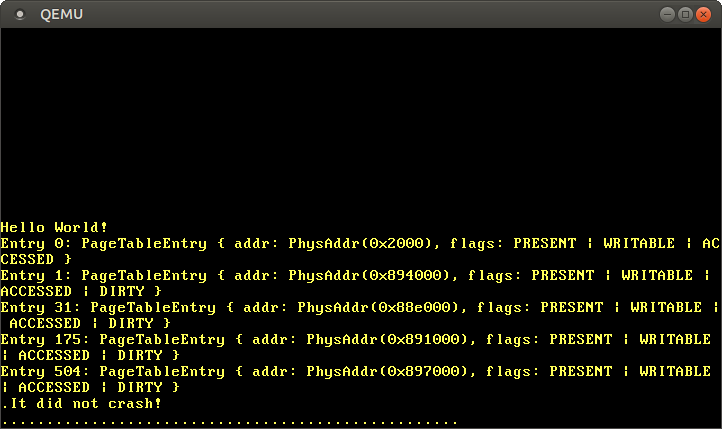
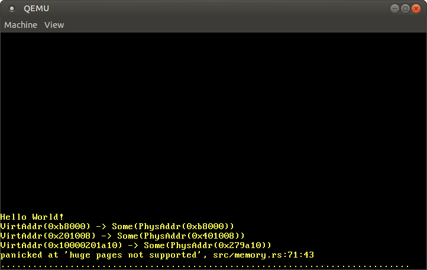
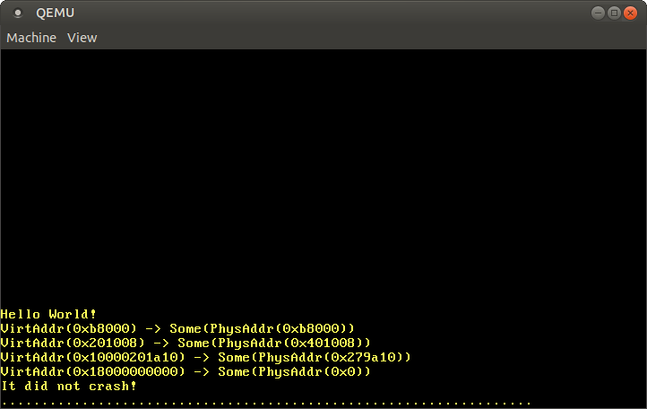
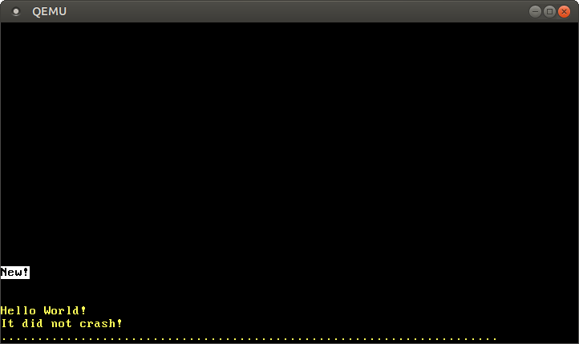

> 原文：[Paging Implementation](https://os.phil-opp.com/paging-implementation/)

本文讲解如何为我们的内核实现分页。文章会先探究使得物理页表能够被内核访问的不同方法，讨论它们各自的优劣，然后实现一个地址转换函数和一个创建新映射的函数。

<!-- more -->

此博客在 [GitHub][github blog-os] 上公开开发。如果您有任何问题或疑问，请在那边打开一个 issue。 您也可以在 [底部][valine] 发表评论。这篇文章的完整源代码可以在 [blog-os-cn/09-paging-implementation][09-paging-implementation] 找到。

## 简介

[上一篇文章][intro-to-paging] 介绍了分页的概念。它通过对比分段引出分页的思想，解释分页和页表是如何工作的，还介绍了 `x86_64` 结构的 4 级页表结构。我们发现引导器已经为我们的内核设置好了页表层级，这也就意味着内核已经在虚拟地址上运行。因为非法内存访问会触发缺页异常而不是随意更改物理内存，所以这样做能够提高安全性。

因为页表已经存储在物理内存外加我们的内核运行在虚拟地址上，上篇文章结尾抛出了我们 [无法在自己的内核访问页表][end of the previous post] 的问题。本文延续这个话题，探寻使得页帧能够被内核访问的不同方式。我们将会讨论每种方法的优劣，然后为我们的内核选定一种方法。

为了实现这些方法，我们需要引导器的支持，所以得首先配置好它。之后，我们将会实现一个遍历页表层级来将虚拟地址翻译为物理地址的函数。最后，我们学习如何在页表中创建新的映射和如何找到空闲的内存帧来创建页表。

## 访问页表

在内核中访问页表没有看起来那么容易。为了解释这个问题，让我们首先回看一下上一篇文章展示的 4 级页表层级示例：


重要的是：每个页表项存储这下一个表的 *物理* 地址。这样做消除转换这些地址的需要，否则这些转换将会损害性能和容易会导致无尽的转换循环。

现有问题是内核运行在虚拟地址之上，我们无法在内核中直接访问物理地址。举个例子说，想要访问地址 `4 KiB` 时，我们访问到的是*虚拟*地址 `4 KiB`，而不是存储第 4 级页表的 *物理* 地址 `4 KiB`。当我们想要访问物理地址 `4 KiB` 时，只能借助映射到这个地址的某个虚拟地址。

因此，为了访问页表帧，我们需要将一些虚拟页映射到它们。有不同方式可以创建这些映射，这些方式都允许我们访问任意页表帧。

### 一一映射

一个简单的方式 **一一映射所有页表**。


这个示例中，我们看到多个一一映射的页表帧。这种方式下，每个页表的物理地址也是合法的虚拟地址，使得我们能够轻易访问从 CR3 寄存器开始的所有层级的页表。

然而，这种方法在虚拟空间中堆放页表，让搜索更大的连续内存区域变得更加困难了。例如，假如我们想要在上图所示内存布局中为 [内存映射文件][memory-mapping a file] 创建一个大小为 1000 KiB 的虚拟内存区域。如果从 `28 KiB` 的区域开始分配，我们将会冲掉位于 `1004 KiB` 的已经映射的页面。所以，我们需要一直搜索直至找到一个足够大的尚未映射的区域，例如从 `1008 KiB` 开始的区域。这是一个类似 [分段][segmentation] 带来碎片化的问题。

换句话说，这种方法很大程度上加大创建新页表的困难程度，因为我们需要找到尚未被征用的物理页帧对应的页面。例如，假如我们为内存映射文件从 `1008 KiB` 开始预留 1000 KiB *虚拟* 内存区域。这样一来，由于无法对其应用一一映射规则，我们就无法使用地址在 `1000 KiB` 到 `2008 KiB` 之间的所有 *物理* 地址。

### 从固定偏移量开始映射

为了规避扰乱虚拟地址空间的问题，我们可以 **使用独立的内存区域实现页表映射**。所以我们将从虚拟地址空间的固定偏移开始映射页面，而不是一一映射到页表帧。例如，这个偏移量可以是 10 TiB：


这个范围在 `10TiB..(10TiB + 物理内存大小)` 虚拟内存专用于页表映射，解决了一一映射方法的冲突问题。预留如此大的虚拟内存空间只有在虚拟地址空间远大于物理内存大小时才有可能。由于 48-bit 的地址空间大小为 256 TiB，因此对 x86_64 结构来说不是问题。

这种方式仍然具有一个缺点--创建新页表时需要创建新的映射。同时，它还不允许访问其他地址空间的页表（跨地址空间访问页表对于创建新进程很有用）。（@TODO：为什么不允许访问其他地址空间的页表）

### 映射完整的物理内存

我们可以通过 **映射完整的物理内存** 而不仅是页表帧来解决这个问题：


这种方式允许我们的内核访问任意物理内存，包括其他地址空间的页表帧。预留的虚拟内存范围大小和之前一样，只是不再包含没有映射的页面了。

这种方式的缺点是需要额外的页表来存储到物理内存的映射。这些页表需要保存在某个地方，因此需要占用部分物理内存，对于小内存的设备来说问题挺大。

在 x86_64 架构上，我们可以使用 2MiB 的 [巨大页][huge pages] 进行映射，而不是默认的 4KiB 的页面。这种方法下，由于只需要 1 个三级页表和 32 个二级页表，映射 32GiB 的物理内存只需消耗 132KiB 用于存储页表。因为 TLB（translation lookaside buffer）需要更少项，所以巨大页下的缓存使用效率也变高了。

> **关于 132KiB 的计算**  
> 32GiB / 2MiB = 2^14 => 需要 2^14 个页表项  
> x86_64 结构 64 位模式下，各级页表索引各占 9 比特，一级索引直接映射到页帧  
> 因此，采用一、二和三级页表即可，四级页表不用  
> 三级页表个数：1 = ceil(2^14/2^(9+9))  
> 二级页表个数：32 = ceil(2^14/2^9)  
> 页表索引总数为 33，每个页表项大小为 4KiB，总计需要内存 33*4KiB=132KiB

### 临时映射

对于物理内存非常小的设备，我们可以在访问页表帧时 **只临时映射页表帧**。为了创建临时映射，我们只需要单个一一映射的一级表即可：


因为从 CR3 寄存器开始，沿着四级、三级和二级页表的第 0 项可以达到这个一级页表，所以图中的一级表控制这虚拟地址空间头部的 2 MiB（@TODO：如何计算）。下标为 `8` 的表项将地址为 `32 KiB` 的虚拟页面映射为地址为 `32 KiB` 的物理页帧，从而在一级表上实现一一映射。图中的 `32 KiB` 的水平箭头表示了这个一一映射。

通过写入一一映射的一级表，我们的内核可以创建一个大小为 511 的临时映射（512减去用于一一映射的表项）。上述例子中，内核创建了两个临时映射：

- 将一级表的第 0 项映射到地址 `24 KiB`，它创建了地址为 `0 KiB` 的虚拟页面到二级页表的物理帧的临时映射，由图中虚箭头标识
- 将一级表的第 9 项映射到地址为 `4 KiB` 的页帧，它创建了地址为 `36 KiB` 的虚拟页面到四级表的物理帧的临时映射，图中虚箭头标识

至此，内核就可以通过写入 `0 KiB` 所在页访问到二级表，写入 `36 KiB` 所在页访问到四级表。

借助临时映射访问任意页表帧的流程为：
- 找到一个一一映射一级表的空闲项
- 将表项映射为我们想要访问的页表物理帧中的表项
- 通过映射到目标页帧的虚拟页面访问页表项
- 将表项重新标识为空闲从而移除临时映射

这种方法复用同样的 512 个虚拟页面用于创建映射，因此只需 4KiB 物理内存（因为只需要一个页表项，每个页表项大小为 4KiB）。缺点是操作起来有点繁琐，尤其是当新的映射要求改变多级页表时，那时需要我们重复上述步骤多次。

### 递归式页表

还有一种有趣的方式，这种方式根本不需要额外的页表，具体姿势是 **递归地映射页表**。这种方式背后的思想是将四级页表的某些项映射到四级页表自身。借助这种方式，我们能够有效地预留虚拟地址空间一部分，将当前和将来的页表帧映射到这个空间。

让我们看些例子来理解它是如何操作的：


这个 [本文开头的示例](#访问页表) 仅有的不同是第四级页表索引为 `511` 的新加项映射到了位于 `4 KiB` 的物理帧，第四级页表所在物理帧。

让 CPU 沿着这个表项继续执行转换，流程不会进入第三级页表，而是再次回到同级的四级页表。这和调用自身的递归函数类似，因此这个表被称为*递归页表*。重要的是 CPU 认为第四级页表的每个表项都是指向第三级页表的，所以现在 CPU 会把第四级页表看做第三级页表。因为 x86_64 架构下所有层级的页表结构都是一样的，所以这种操作是可行的。

在开始真正的转换之前，沿着递归的表项执行一次或多次，我们可以有效地减少 CPU 遍历的层级数。例如，如果我们沿着递归表项走一次，然后前进到第三级页表，CPU 此时会把第三级页表看做第二级页表。继续往下，CPU 把第二级页表看做第一级页表，CPU 此时会把第一级页表看做被映射的页帧。这时，CPU 会把第一级页表看做映射到的页帧，也就意味着我们可以读写第一级页表了。


同理，我们可以开始转换前沿着递归的表项走两次，从而将遍历的层数减到 2：


让我一步步分解：首先，CPU 沿着递归的第四级表项走一次，觉得自己已经到了第三级页表。然后，它沿着递归表项再走一次，自以为到了第二级页表。但事实上，它仍然在第四级页表。CPU 再沿着不同的表项往下时，它来到第三级页表，但自以为到了第一级页表。所以，虽然下一个表项落在第二级页表，但是 CPU 觉得这项已经指向了映射的页帧，从而允许我们读写第二级页表。

访问页表的第三级和第四级的方式是一样的。为了到第三级页表，我们沿着递归表项走 3 次，骗 CPU 让它觉得已经到了第一级页表。然后，沿着另一个表项走到第三级页表，这个页表让 CPU 觉得已经到了被映射的页帧。为了访问第四级页表本身，我们只需要沿着递归的表项走四次，直到 CPU 把第四级页表看做被映射的页帧（下图中蓝色部分）。


我们脑子理解这些概念可能有点绕，需要花点时间，但是这项操作在实践中是非常稳的。

往后部分我们讲解如何基于递归表项一次或多次来构建虚拟地址。我们的实现不会采用递归式分页，所以我们跳过以下关于递归式分页的相关知识。如果感兴趣的话，点击*地址计算*即可展开。

::: details 地址计算

可以看到，我们可以在开始真正的转换前，一次或多次递归地访问页表所有层级的表项。由于四个层级的页表索引都是直接从虚拟地址推算的，我们需要为这种方法构造特殊的虚拟地址。如果没有忘记的话，页表索引应该是以下面这种方式推算的：


假设我们想要访问映射到特定页的第一级页表。由上可知，这意味着我们必须首先沿着递归表项走一次，然后再继续从第四级、第三级和第二级索引往下。为了这样做，我们将地址的每块右移一个块，将原先的第四级索引设置为递归项的索引：


为了访问那一页对应的第二级页表，我们将每个索引块右移两个块，将原先的第四级索引和原先的第三级索引设置为递归项的索引：


为了访问第三级页表，我们将每个索引块右移三个块，将原先的第四、三和二级索引都设置为递归项的索引：


最后访问第四级页表，我们将每个索引块右移四个块，将除页内偏移块以外的所有索引块都设置为递归项的索引：


我们现在能够计算所有四个层级页表的虚拟地址。甚至还可以通过将索引值乘于 8（页表项的大小）计算指向特定页表项的地址（@TODO：更加详细的解释）。

下表总结了访问不同类型页帧的地址结构：

| 虚拟地址   | 地址结构（[八进制形式][octal]）  |
| ---------- | -------------------------------- |
| 页帧       | `0o_SSSSSS_AAA_BBB_CCC_DDD_EEEE` |
| 一级页表项 | `0o_SSSSSS_RRR_AAA_BBB_CCC_DDDD` |
| 二级页表项 | `0o_SSSSSS_RRR_RRR_AAA_BBB_CCCC` |
| 三级页表项 | `0o_SSSSSS_RRR_RRR_RRR_AAA_BBBB` |
| 四级页表项 | `0o_SSSSSS_RRR_RRR_RRR_RRR_AAAA` |


对于映射到的页帧来说，`AAA` 是第四级索引，`BBB` 是第三级索引，`CCC` 是第二级索引，`DDD` 是第二级索引，`EEEE` 是页内偏移。`RRR` 是递归表项的索引。一个 3 位数的索引转化为 4 位数的偏移量是通过乘于 8（页表项的大小）来实现的。有了这个偏移量，所得地址直接指向各自的页表项。

`SSSSSS` 是符号延展位，即它们都是第 47 比特的副本。这时 x86_64 架构对合法地址的特殊要求。我们在 [之前的文章][paging-on-x86-64] 已经介绍过。

因为每个八进制字符代表 3 个比特，使得我们可以清楚地隔离不同页表层级的 9 比特索引，所以我们用 [八进制][octal] 标识地址。十六进制下每个字符表示 4 比特，就不能实现清楚隔离了。

##### 用 Rust 代码实现

为了用 Rust 代码构造这些地址，我们可以使用位运算：

```rust
// the virtual address whose corresponding page tables you want to access
let addr: usize = […];

let r = 0o777; // recursive index
let sign = 0o177777 << 48; // sign extension

// retrieve the page table indices of the address that we want to translate
let l4_idx = (addr >> 39) & 0o777; // level 4 index
let l3_idx = (addr >> 30) & 0o777; // level 3 index
let l2_idx = (addr >> 21) & 0o777; // level 2 index
let l1_idx = (addr >> 12) & 0o777; // level 1 index
let page_offset = addr & 0o7777;

// calculate the table addresses
let level_4_table_addr =
    sign | (r << 39) | (r << 30) | (r << 21) | (r << 12);
let level_3_table_addr =
    sign | (r << 39) | (r << 30) | (r << 21) | (l4_idx << 12);
let level_2_table_addr =
    sign | (r << 39) | (r << 30) | (l4_idx << 21) | (l3_idx << 12);
let level_1_table_addr =
    sign | (r << 39) | (l4_idx << 30) | (l3_idx << 21) | (l2_idx << 12);
```

上述代码假设第四级页表的索引为 `0o777` 的最后一项被递归映射。我们当前情形不是这样的，所以代码还无法运行。如何指示引导器正确配置好递归映射请继续往下看。

除了手动地执行位运算外，我们可以使用 `x86_64` 包的 [`RecursivePageTable`] 类型，这个类型提供了多种页表运算的安全抽象。例如，以下代码演示了如何将虚拟地址转换为所映射的物理地址：


```rust
// in src/memory.rs

use x86_64::structures::paging::{Mapper, Page, PageTable, RecursivePageTable};
use x86_64::{VirtAddr, PhysAddr};

/// Creates a RecursivePageTable instance from the level 4 address.
let level_4_table_addr = […];
let level_4_table_ptr = level_4_table_addr as *mut PageTable;
let recursive_page_table = unsafe {
    let level_4_table = &mut *level_4_table_ptr;
    RecursivePageTable::new(level_4_table).unwrap();
}

/// Retrieve the physical address for the given virtual address
let addr: u64 = […]
let addr = VirtAddr::new(addr);
let page: Page = Page::containing_address(addr);

// perform the translation
let frame = recursive_page_table.translate_page(page);
frame.map(|frame| frame.start_address() + u64::from(addr.page_offset()))
```

再次声明，这份代码需要一个合法的递归映射，缺失的 `level_4_table_addr` 可以仿照第一份代码计算。

:::

递归分页是一个有趣的技巧，这种方法展示了页表的单个映射可以有多强大。它很容易实现，且仅需要很小配置即可（只是一个递归表项），所以是第一个分页实验很好的选择。

然而， 它还有一些缺点
- 它占用这很大虚拟内存（512 GiB）。对 48 位的地址空间来说，这不是什么大问题，但是可能会触发次优的缓存行为
- 它只允许方便地访问当前活跃的地址空间。虽然通过改变页表项也可以访问其他地址空间，但是需要借助一个临时映射来回切换。我们在一篇过时的文章 [*重新映射内核*][_Remap The Kernel_] 有所描述。
- 它严重依赖于 x86 架构的页表格式，可能在其他架构下无法工作

## 引导器支持

以上所有方法都要求修改页表才能配置起来。例如，需要创建到物理内存的映射或第四级页表的某个页表项需要递归地映射。问题在于，不存在现有方式访问页表的情况下，我们无法创建这些要求的映射。

这意味着，我们需要借助引导器的帮助，它创建我们内核运行所需的页表。引导器能够访问页表，所以它能够创建我们需要的任何映射。当前实现版本中，`bootloader` 包以上两种方式，通过 [cargo 特性][cargo features] 控制： 

- `map_physical_memory` 特性将完整的物理内存映射到虚拟地址空间的某个位置。因此，内核可以访问所有物理内存，采用 [*映射完整物理内存*](#映射完整的物理内存) 的方式。
- 开启 `recursive_page_table` 特性，引导器将递归地映射第四级页表的某一项。这样允许内核按照 [*递归式页表*](#递归式页表) 描述的方式访问页表

由于第一种方式简单、平台独立且更加强大（它允许访问非页表的页帧），我们的内核选择这种方式。为了启用需要的加载器支持，我们给 `bootloader` 依赖添加 `map_physical_memory` 特性：

```toml
[dependencies]
bootloader = { version = "0.9.3", features = ["map_physical_memory"]}
```

启用这个特性后，加载器将完整的物理内存映射到某个空闲的虚拟地址范围。为了向我们的内核传递这份虚拟地址范围，加载器会传入 *启动信息* 的结构。

### 启动信息

`bootloader` 包定义了 [`BootInfo`] 结构，这个结构体包含传给内核的所有信息。这个结构体还处于早期开发阶段，所以预期后续升级到 [语义版本不兼容][semver-incompatible] 的 `bootloader` 版本时会有破坏性变化。启用 `map_physical_memory` 特性后，这个结构体目前有 `memory_map` 和 `physical_memory_offset` 两个字段可用：

- `memory_map` 包含可用物理内存的概览信息。它告诉我们的内核系统可用的物理内存有多少，哪个内存区域是预留给 VGA 硬件等设备的。内存映射表可以从 BIOS 或 UEFI 固件中查询，但是查询只允许发生在启动的很早阶段。因此，引导器必须为内核提供这项信息，否则内核后续没有办法拿到它。我们在文章后续部分会用到这个内存映射表。
- `physical_memory_offset` 是物理内存在虚拟内存起始地址。物理地址加上这个偏移量得到相应的虚拟地址。这样就允许我们在内核中访问任意的物理内存了。

引导器以 `_start` 函数的 `&'static BootInfo` 参数向我们的内核传入 `BootInfo` 结构。我们的函数还没有声明这个参数，所以得加一下：

```rust
// in src/main.rs

use bootloader::BootInfo;

#[no_mangle]
pub extern "C" fn _start(boot_info: &'static BootInfo) -> ! { // new argument
    […]
}
```

因为 x86_64 架构的调用风格会传入某个 CPU 寄存器的值作为参数，所以之前忽略这个参数没有什么问题（@TODO：不懂）。因此，没有声明时，这个参数会被忽略掉。然而，如果不小心用错参数类型就会报错，因为编译器不知道我们入口函数正确的类型签名。

### `entry_point` 宏

`_start` 函数由外在的引导器调用，引导器不会对其函数签名进行检查。这也就意味着我们可以让函数接收任意类型而不触发任何编译错误，但是一旦运行起来就会失败或者触发未定义行为。

为了确保入口函数的签名总是符合加载器的期望，`bootloader` 包提供 [`entry_point`] 宏，这个宏提供一个自动检查定义为入口函数的 Rust 函数是否符合要求的功能。让我们利用这个宏改写一些入口函数：

```rust
// in src/main.rs

use bootloader::{BootInfo, entry_point};

entry_point!(kernel_main);

fn kernel_main(boot_info: &'static BootInfo) -> ! {
    […]
}
```

由于这个宏为我们定义了真正的底层 `_start` 函数，现在就不用为入口函数附上 `extern "C"` 或 `no_mangle` 等修饰符了。`kernel_main` 函数现在完全是一个正常的 Rust 函数，我们可以随意为其命名。重要的是，类型检查被加了进来使得采用错误的函数签名（例如添加参数或者改变参数类型）会触发编译错误。

对 `lib.rs` 进行同样的改造：

```rust
// in src/lib.rs

#[cfg(test)]
use bootloader::{entry_point, BootInfo};

#[cfg(test)]
entry_point!(test_kernel_main);

/// Entry point for `cargo test`
#[cfg(test)]
fn test_kernel_main(_boot_info: &'static BootInfo) -> ! {
    // like before
    init();
    test_main();
    hlt_loop();
}
```

由于入口点只有在测试模式下使用，我们为所有新添项添加了 `#[cfg(test)]` 属性。我们将测试入口程序取不同的名字为 `test_kernel_main`，以避免和 `main.rs` 的 `kernel_main` 混淆。`BootInfo` 暂时还用不上，所以我们在参数名字前添加 `_` 以屏蔽掉变量未被使用的警告。

## 实现

物理内存访问权到手，我们终于可以开始实现自己的页表代码了。首先，我们将会瞅一下内核当前所在的活跃页表。然后创建一个转换函数，计算给定虚拟地址映射到的物理地址。最后，我们尝试修改现有页表来创建一个新的映射。

开始之前，我们创建一个 `memory` 模块用于存放相关代码：

```rust
// in src/lib.rs

pub mod memory;
```

再为模块创建对应的 `src/memory.rs` 空文件。

### 访问页表

[上一篇文章的末尾][end of the previous post]，我们试图访问内核所在的页表，但是由于无法访问 `CR3` 寄存器指向的物理页帧而失败了。现在我们可以继续往下，创建一个 `active_level_4_table` 函数返回活跃的第四级页表：

```rust
// in src/memory.rs

use x86_64::{
    structures::paging::PageTable,
    VirtAddr,
};

/// Returns a mutable reference to the active level 4 table.
///
/// This function is unsafe because the caller must guarantee that the
/// complete physical memory is mapped to virtual memory at the passed
/// `physical_memory_offset`. Also, this function must be only called once
/// to avoid aliasing `&mut` references (which is undefined behavior).
pub unsafe fn active_level_4_table(physical_memory_offset: VirtAddr)
    -> &'static mut PageTable
{
    use x86_64::registers::control::Cr3;

    let (level_4_table_frame, _) = Cr3::read();

    let phys = level_4_table_frame.start_address();
    let virt = physical_memory_offset + phys.as_u64();
    let page_table_ptr: *mut PageTable = virt.as_mut_ptr();

    &mut *page_table_ptr // unsafe
}
```

首先，我们从 `CR3` 寄存器读取了活跃的第四级页表的物理帧。然后，获取它的物理起始地址，转换为 `u64`，然后加上 `physical_memory_offset` 得到映射到页表帧的虚拟地址。最后，我们借助 `as_mut_ptr` 方法将虚拟地址转换为 `*mut PageTable` 裸指针，并不安全地基于其创建一个 `&mut PageTable` 引用。之所以创建 `&mut` 引用而不是 `&` 引用是因为我们将会在后续部分改变页表结构。

由于 Rust 将整个 `unsafe fn` 看做一个大的 `unsafe` 块，所以我们不需要使用一个 unsafe 块包围这些语句。因为我们可能会无意地在之前代码块里面加入危险操作，所以这样做也会使得我们的代码更加不安全。有一个 [RFC#2585] 想要改变这种行为。

至此，我们就可以使用这个函数来打印第四级页表的表项了：

```rust
// in src/main.rs

fn kernel_main(boot_info: &'static BootInfo) -> ! {
    use blog_os::memory::active_level_4_table;
    use x86_64::VirtAddr;

    println!("Hello World{}", "!");
    blog_os::init();

    let phys_mem_offset = VirtAddr::new(boot_info.physical_memory_offset);
    let l4_table = unsafe { active_level_4_table(phys_mem_offset) };

    for (i, entry) in l4_table.iter().enumerate() {
        if !entry.is_unused() {
            println!("L4 Entry {}: {:?}", i, entry);
        }
    }

    // as before
    #[cfg(test)]
    test_main();

    println!("It did not crash!");
    blog_os::hlt_loop();
}
```

我们首先将 `BootInfo` 结构的 `physical_memory_offset` 转化为 [`VirtAddr`]，然后传给 `active_level_4_table` 函数。再调用 `iter` 函数遍历页表项，外加 [`enumerate`] 组合器来添加额外的元素下标。由于全屏放不下 512 个表项，我们只打印了非空的表项。


运行它我们可以看到以下输出：



可以看到有很多非空的页表项，分别映射到不同的第三级页表。之所以出现那么多区域，是因为内核代码、内核栈、物理内存映射和启动信息都使用了独立的内存区域。

为了进一步遍历页表，瞅瞅第三级页表，我们可以将第四级页表项映射到的页帧再次转化为虚拟地址：

```rust
// in the `for` loop in src/main.rs

use x86_64::structures::paging::PageTable;

if !entry.is_unused() {
    println!("L4 Entry {}: {:?}", i, entry);

    // get the physical address from the entry and convert it
    let phys = entry.frame().unwrap().start_address();
    let virt = phys.as_u64() + boot_info.physical_memory_offset;
    let ptr = VirtAddr::new(virt).as_mut_ptr();
    let l3_table: &PageTable = unsafe { &*ptr };

    // print non-empty entries of the level 3 table
    for (i, entry) in l3_table.iter().enumerate() {
        if !entry.is_unused() {
            println!("  L3 Entry {}: {:?}", i, entry);
        }
    }
}
```

为了查看第二级和第一级页表，我们对第三级和第二级页表项重复同样的操作即可。可以想象得到，代码会变得变多很多，所以我们没有再次展示完整的代码。

手动地遍历页表挺好玩，它会帮助我们理解 CPU 是如何执行地址转换的。然而，大多数时候，我们只关心指定虚拟地址映射到的物理地址，所以我们为其创建一个函数吧。

### 转换地址

为了实现地址从虚拟到物理的转换，我们必须遍历四级页表直至走到映射的物理页帧。让我们为这个转换创建一个函数：

```rust
// in src/memory.rs

use x86_64::PhysAddr;

/// Translates the given virtual address to the mapped physical address, or
/// `None` if the address is not mapped.
///
/// This function is unsafe because the caller must guarantee that the
/// complete physical memory is mapped to virtual memory at the passed
/// `physical_memory_offset`.
pub unsafe fn translate_addr(addr: VirtAddr, physical_memory_offset: VirtAddr)
    -> Option<PhysAddr>
{
    translate_addr_inner(addr, physical_memory_offset)
}
```

为了限制 `unsafe` 的作用域，我们将函数导向一个安全的 `translate_addr_inner`。正如我们之前所说的，Rust 把整个 `unsafe fn` 的函数体看做一个很大的 unsafe 块。通过调用一个私有的安全函数，我们显式地标识出每个 `unsafe` 的操作。 

私有的内层函数包含真正的实现：

```rust
// in src/memory.rs

/// Private function that is called by `translate_addr`.
///
/// This function is safe to limit the scope of `unsafe` because Rust treats
/// the whole body of unsafe functions as an unsafe block. This function must
/// only be reachable through `unsafe fn` from outside of this module.
fn translate_addr_inner(addr: VirtAddr, physical_memory_offset: VirtAddr)
    -> Option<PhysAddr>
{
    use x86_64::structures::paging::page_table::FrameError;
    use x86_64::registers::control::Cr3;

    // read the active level 4 frame from the CR3 register
    let (level_4_table_frame, _) = Cr3::read();

    let table_indexes = [
        addr.p4_index(), addr.p3_index(), addr.p2_index(), addr.p1_index()
    ];
    let mut frame = level_4_table_frame;

    // traverse the multi-level page table
    for &index in &table_indexes {
        // convert the frame into a page table reference
        let virt = physical_memory_offset + frame.start_address().as_u64();
        let table_ptr: *const PageTable = virt.as_ptr();
        let table = unsafe {&*table_ptr};

        // read the page table entry and update `frame`
        let entry = &table[index];
        frame = match entry.frame() {
            Ok(frame) => frame,
            Err(FrameError::FrameNotPresent) => return None,
            Err(FrameError::HugeFrame) => panic!("huge pages not supported"),
        };
    }

    // calculate the physical address by adding the page offset
    Some(frame.start_address() + u64::from(addr.page_offset()))
}
```

与其重用我们的 `active_level_4_table` 函数，我们再次从 `CR3` 寄存器读出第四级页帧。我们这样做是为了简化原型实现。别介意，我们后续会创建一个更优雅的实现。

`VirtAddr` 结构体已经提供计算四级页表每一个索引的方法。我们用一个小数组保存这些索引，使得我们可以借助 `for` 循环遍历这些页表。循环之外，我们保存上一次访问的 `frame` 用于后续计算物理地址。`frame` 指向遍历过程中的页表帧，也指向上一轮迭代指向的页帧，即最后指向第一级页表项映射的页帧。

循环内部，我们再次使用 `physical_memory_offset` 将页帧转换为页表引用。然后读取当前页表项，调用 [`PageTableEntry::frame`] 函数提取映射到的页帧。如果表项没有映射到页帧则返回 `None`。如果表项映射到 2MiB 或 1GiB 的页面，我们暂且直接 panic。

让我们借助一些地址来测测我们的转换函数：

```rust
// in src/main.rs

fn kernel_main(boot_info: &'static BootInfo) -> ! {
    // new imports
    use blog_os::memory::translate_addr;
    use x86_64::VirtAddr;

    […] // hello world and blog_os::init

    let phys_mem_offset = VirtAddr::new(boot_info.physical_memory_offset);

    let addresses = [
        // the identity-mapped vga buffer page
        0xb8000,
        // some code page
        0x201008,
        // some stack page
        0x0100_0020_1a10,
        // virtual address mapped to physical address 0
        boot_info.physical_memory_offset,
    ];

    for &address in &addresses {
        let virt = VirtAddr::new(address);
        let phys = unsafe { translate_addr(virt, phys_mem_offset) };
        println!("{:?} -> {:?}", virt, phys);
    }

    […] // test_main(), "it did not crash" printing, and hlt_loop()
}
```

我们运行后可看到以下输出：



正如预期的那样，一一对应的地址 `0xb8000` 转换得到相同的物理地址。代码页和栈页则转换到某个随意的物理地址，依赖于引导器加载我们内核时创建的初始映射。最后的 12 比特总是不随转换变化，因为这些比特是 [*页内偏移*][paging-on-x86-64]，而不是转换的一部分。

由于每个物理地址加上 `physical_memory_offset` 后即可访问到，转换 `physical_memory_offset` 地址本身应该得到物理地址 `0`。然而，因为映射使用当前不支持的巨大页提高效率，所以转换失败了。

### 使用 `OffsetPageTable`

OS 内核中，虚拟地址到物理地址的转换是很常见的，`x86_64` 架构为此提供了相应的抽象。除 `translate_addr` 之外，具体实现已经支持的巨大页和其他页表操作函数，所以我们后续部分直接使用这个包而不是在自己的实现中添加巨大页支持。

抽象的基础是两个 traits，定义了多种页表映射函数：

- [`Mapper`] trait 对于页面大小支持泛型，并提供操作页面的函数。例如 [`translate_page`] 将给定页面转换为同样大小的页帧，[`map_to`] 在页表中创建映射
- [`MapperAllSizes`] trait 要求实现者提供所有页面大小的 `Mapper`。另外，它提供了处理多种页面大小的函数，例如 [`translate_addr`] 或者通用的 [`translate`]

这些 traits 只是定义了接口，不提供任何实现。`x86_64` 包目前提供了三种不同的实现类型，分别有不同的要求。[`OffsetPageTable`] 类型假设完整的物理内存映射到某个偏移量的虚拟内存空间。[`MappedPageTable`] 要更加灵活一点：它只要求每个页表帧都映射到可计算的虚拟地址空间。最后，[`RecursivePageTable`] 类型可用于以 [递归式页表](#递归式页表) 的方式访问页表帧。

对于当前场景，引导器将完整的物理内存映射到偏移量为 `physical_memory_offset` 的虚拟地址，所以我们可以使用 `OffsetPageTable` 类型。我们在 `memory` 模块创建一个 `init` 函数用来初始化它：

```rust
use x86_64::structures::paging::OffsetPageTable;

/// Initialize a new OffsetPageTable.
///
/// This function is unsafe because the caller must guarantee that the
/// complete physical memory is mapped to virtual memory at the passed
/// `physical_memory_offset`. Also, this function must be only called once
/// to avoid aliasing `&mut` references (which is undefined behavior).
pub unsafe fn init(physical_memory_offset: VirtAddr) -> OffsetPageTable<'static> {
    let level_4_table = active_level_4_table(physical_memory_offset);
    OffsetPageTable::new(level_4_table, physical_memory_offset)
}

// make private
unsafe fn active_level_4_table(physical_memory_offset: VirtAddr)
    -> &'static mut PageTable
{…}
```

这个函数接收一个 `physical_memory_offset` 作为入参，并返回生命期为 `'static` 的 `OffsetPageTable` 实例。这意味着，这个实例在我们内核的整个运行时范围内有效。函数体内，我们首先调用 `active_level_4_table` 函数获取第四级页表的可修改引用。然后以这个引用调用 [`OffsetPageTable::new`] 函数。外加第二个参数，`new` 函数还需要物理内存起始的虚拟地址，记录在 `physical_memory_offset` 变量中。


从现在开始，`active_level_4_table` 只应被 `init` 函数调用，否则容易产生同名可变引用导致未定义行为。因此，我们把函数私有化，移除 `pub` 标识符。

我们现在可以用 `MapperAllSizes::translate_addr` 方法替换掉 `memory::translate_addr` 函数，改动 `kernel_main` 函数的几行即可：

```rust
// in src/main.rs

fn kernel_main(boot_info: &'static BootInfo) -> ! {
    // new: different imports
    use blog_os::memory;
    use x86_64::{structures::paging::MapperAllSizes, VirtAddr};

    […] // hello world and blog_os::init

    let phys_mem_offset = VirtAddr::new(boot_info.physical_memory_offset);
    // new: initialize a mapper
    let mapper = unsafe { memory::init(phys_mem_offset) };

    let addresses = […]; // same as before

    for &address in &addresses {
        let virt = VirtAddr::new(address);
        // new: use the `mapper.translate_addr` method
        let phys = mapper.translate_addr(virt);
        println!("{:?} -> {:?}", virt, phys);
    }

    […] // test_main(), "it did not crash" printing, and hlt_loop()
}
```

为了使用提供的 [`translate_addr`] 方法，我们需要导入 `MapperAllSizes` trait。

再次运行，我们可以看到和之前一样的转换结果，不同的是巨大页转换现在也成功了：



正如预期那样，`0xb8000`、代码地址和栈地址的转换都和我们自己的转换函数所得一样。另外， 我们现在可以看到虚拟地址 `physical_memory_offset` 映射到了物理地址 `0x0`。

借助 `MappedPageTable`类型的转换函数，我们不用再自己实现巨大页支持。我们还可以调用其他诸如 `map_to` 的页面操作函数，后续部分会用到这个函数。

至此，`memory::translate_addr` 和 `memory::translate_addr_inner` 函数就没用了，删除即可。

### 创建新的映射

到目前为止，我们都只是查看页表，没有做任何更改。让我们动手实操，为之前没有映射的页面创建一个映射。

我们将会使用 [`Mapper`] trait 的 [`map_to`] 函数，所以先瞅瞅这个函数。文档说他需要四个参数：想要映射的页面，页面映射到的页帧，页表项的一系列标识符和一个 `frame_allocator`。因为映射给定页面可能要求创建额外的页表，额外的页表需要使用后备的页帧，所以页帧分配器是需要的。

#### `create_example_mapping` 函数

我们实现的第一步是创建一个 `create_example_mapping` 函数，用于映射给定的虚拟地址到 VGA 文本缓冲区所在物理页帧地址 `0xb8000`。选取这个页帧是因为它允许我们很容易地测试一个映射是否被正确地创建了出来：我们只是需要写入新映射的页面，然后查看写操作的结构是否出现在屏幕上。

`create_example_mapping` 函数如下：

```rust
// in src/memory.rs

use x86_64::{
    PhysAddr,
    structures::paging::{Page, PhysFrame, Mapper, Size4KiB, FrameAllocator}
};

/// Creates an example mapping for the given page to frame `0xb8000`.
pub fn create_example_mapping(
    page: Page,
    mapper: &mut OffsetPageTable,
    frame_allocator: &mut impl FrameAllocator<Size4KiB>,
) {
    use x86_64::structures::paging::PageTableFlags as Flags;

    let frame = PhysFrame::containing_address(PhysAddr::new(0xb8000));
    let flags = Flags::PRESENT | Flags::WRITABLE;

    let map_to_result = unsafe {
        // FIXME: this is not safe, we do it only for testing
        mapper.map_to(page, frame, flags, frame_allocator)
    };
    map_to_result.expect("map_to failed").flush();
}
```

除了要求被映射的 `page` 外，函数还期望一个 `OffsetPageTable` 实例的可变引用和 `frame_allocator`。`frame_allocator` 参数使用 [`impl Trait`][impl-trait-arg] 语法来实现对所有满足 [`FrameAllocator`] trait 类型的泛型。这个 trait 对 [`PageSize`] trait 实现泛型，从而支持标准的 4KiB 页面和巨大的 2MiB/1GiB 页。我们只想要创建 4KiB 的映射，所以我们设置泛型参数为 `Size4KiB`。

[`map_to`] 方法是不安全的，因为调用者必须确保页帧是尚未被征用。理由是映射同一个页帧两次会导致未定义行为，例如两个不同的可变引用指向同一个物理内存位置。在我们当前场景下，我们复用已被映射的 VGA 文本缓冲区的页帧，所以违背了要求的条件。但是，`create_example_mapping` 只用作临时测试，过了这篇文章就会被删除，所以问题不大。为了警示我们危险性，我们添加了一个 `FIXME` 注释。

除了 `page` 和 `unused_frame` 之外，`map_to` 方法还要一些映射用的标识符和一个 `frame_allocator` 的引用（紧接着会解释原因）。对于标识符，我们设置所有合法表项都要求的 `PRESENT` 标识和让被映射的页面可写的 `WRITABLE` 标识符。查看上一篇文章的 [页表格式][_Page Table Format_] 小节可以找到所有可用的标识符。

[`map_to`] 函数可能会失败，所以它返回一个 [`Result`]。由于这只是示例代码，对健壮性没有要求，所以我们仅使用 [`expect`] 来触发错误时直接 panic。一旦成功，这个函数返回一个 [`MapperFlush`] 类型，这个类型提供便利的 `flush` 方法将 TLB（translation lookaside buffer）中新映射的页面刷入。和 `Result`，这个类型使用 [`#[must_use]`][must_use] 属性来触发忘记使用时触发警告。

#### 仿造 `FrameAllocator`

为了调用 `create_example_mapping`，我们首先需要创建一个实现 `FrameAllocator` trait 的类型。如前面所述，这个 trait 负责在 `map_to` 需要新页表时分配页面。

从简单情况开始，假设我们现在不需要创建新的页表。这种情况下，页帧分配器总是返回 `None`。我们创建一个 `EmptyFrameAllocator` 来测试我们的映射函数：

```rust
// in src/memory.rs

/// A FrameAllocator that always returns `None`.
pub struct EmptyFrameAllocator;

unsafe impl FrameAllocator<Size4KiB> for EmptyFrameAllocator {
    fn allocate_frame(&mut self) -> Option<PhysFrame> {
        None
    }
}
```

实现 `FrameAllocator` 是不安全的，因为实现者必须保证分配器只会返回空闲的页帧。否则可能会触发未定义行为，例如两个虚拟页面映射到同一个物理页帧的情况。我们的 `EmptyFrameAllocator` 只会返回 `None`，所以在这个场景下是没有问题的。

####  选择一个虚拟页

现在这个简单的页帧分配器可以传给我们的 `create_example_mapping`。然而，这个分配器总是返回 `None`，所以只有当创建映射不需要额外的页表帧时才是可行的。为了弄明白什么时候需要和不需要额外的页表帧，我们看个例子：


上图在左边显示虚拟地址空间，右边显示物理地址空间，页表在中间。如虚线所示，页表存在物理内存页帧中。虚拟地址空间包含一个地址为 `0x803fe00000`、蓝色的映射页。为了将这个页面映射到页帧，CPU 遍历四级页表直至找到地址为 36 KiB 的页帧。

另外，VGA 文本缓冲区的物理页帧在图中被标成红色。我们的目标是在 `create_example_mapping` 函数中将之前尚未映射的虚拟页面映射到这个页帧。由于我们的 `EmptyFrameAllocator` 总是返回 `None`，我们想要创建的映射不能向分配器申请额外的页帧。这就取决于我们选取用来做映射的虚拟页面了。

图中展示了虚拟地址空间的两个候选页面，都标成了黄色。一页位于地址 `0x803fdfd000`，在之前和蓝色的映射页隔三页。虽然第四级和第三级页表索引和蓝色页相同，但是第二级和第一级索引不同（具体算法参见 [上一篇文章][paging-on-x86-64]）。不同的第二级页表索引意味着这个页面需要采用不同的第一级页表。由于这个第一级页表尚未存在，我们如果选择这页作示例映射的话就需要把页表创建出来，这样就会需要分配空闲的物理帧。而位于 `0x803fe02000` 的第二个候选页则不会有这个问题，因为它和蓝色也使用相同的第一级页表。因此，所有需要的页表都已经存在了。

总而言之，创建新映射的难点依赖我们需要映射的虚拟页面。最简单的情况下，第一级页表已经存在，我们只需要写入一个页表项即可。最艰难的情况下，页面所在内存区域对应的第三级页表尚未存在，这时我们就需要首先创建新的第三级、第二级和第一级页表。

为了以 `EmptyFrameAllocator` 调用 `create_example_mapping` 函数，我们需要选择所有页表都已经存在的页面。为了找到这样一个页面，我们可以利用这样的一个事实：引导器会将自己加载到虚拟地址空间的首个兆字节的虚拟空间。这也就意味着这个区域所有页面的第一级页表都是已存在。因此，我们可以选择这个内存区域空闲的页面用作示例映射，例如地址为 `0` 的页面。正常情况下，这个页面应该会保持空闲以确保解析空指针会触发缺页异常，所以我们可以知道引导器闲置这个页面。

#### 创建映射

现在所有调用 `create_example_mapping` 函数所需的参数准备就绪，让我们修改 `kernel_main` 函数将虚拟地址 `0` 的页面映射出来。由于我们要把页面映射到 VGA 文本缓冲区，我们应该能够通过它往屏幕写入东西。具体实现如下：

```rust
// in src/main.rs

fn kernel_main(boot_info: &'static BootInfo) -> ! {
    use blog_os::memory;
    use x86_64::{structures::paging::Page, VirtAddr}; // new import

    […] // hello world and blog_os::init

    let phys_mem_offset = VirtAddr::new(boot_info.physical_memory_offset);
    let mut mapper = unsafe { memory::init(phys_mem_offset) };
    let mut frame_allocator = memory::EmptyFrameAllocator;

    // map an unused page
    let page = Page::containing_address(VirtAddr::new(0));
    memory::create_example_mapping(page, &mut mapper, &mut frame_allocator);

    // write the string `New!` to the screen through the new mapping
    let page_ptr: *mut u64 = page.start_address().as_mut_ptr();
    unsafe { page_ptr.offset(400).write_volatile(0x_f021_f077_f065_f04e)};

    […] // test_main(), "it did not crash" printing, and hlt_loop()
}
```

我们首先以 调用 `mapper` 和 `frame_allocator`  实例的可变引用调用 `create_example_mapping` 函数，创建出地址为 `0` 的页面映射。这个映射将页面映射到 VGA 文本缓冲区页帧，所以我们可以在屏幕看到这个缓冲区写入的任何东西。

然后将页面转换为一个裸指针，并往偏移量 `400` 的地址写入值。我们没有往页面开始的地方写入是因为 VGA 缓冲区的顶行会被下一个 `println` 直接刷出屏幕。写入的值为 `0x_f021_f077_f065_f04e`，表示白底的字符串 _"New!"_。如 [VGA 文本模式][VGA Text Mode] 文章所描述的那样，对 VGA 缓冲区的写入应该是不稳定的，所以我们使用了 [`write_volatile`] 方法。

在 QEMU 中运行，我们可以看到以下输出：



屏幕上的 _"New!"_ 是往页面 `0` 写入的结果，这意味着我们成功地在页面中创建了映射。

创建这个映射只有在地址为 `0` 的页面已经存在相应的第一级页表的情况下可行。当我们试图映射一个第一级页表不存在的页面时，由于请求 `EmptyFrameAllocator` 创建新页表用于创建新页帧而不得导致 `map_to` 函数执行失败。通过尝试映射地址为 `0xdeadbeaf000` 而不是 `0` 的页面可以复现这个失败现象。

```rust
// in src/main.rs

fn kernel_main(boot_info: &'static BootInfo) -> ! {
    […]
    let page = Page::containing_address(VirtAddr::new(0xdeadbeaf000));
    […]
}
```

运行会触发以下错误信息的 panic：

```bash
panicked at 'map_to failed: FrameAllocationFailed', /…/result.rs:999:5
```

为了映射一个还没有第一级页表的页面，我们需要创建一个合适的 `FrameAllocator`。但是我们如何知道空闲的页帧和可用的物理内存呢？

### 分配页帧

为了创建新页表，我们需要创建合适的页帧分配器。这时可以利用引导器一开始传入的 `BootInfo` 结构体中的 `memory_map`：

```rust
// in src/memory.rs

use bootloader::bootinfo::MemoryMap;

/// A FrameAllocator that returns usable frames from the bootloader's memory map.
pub struct BootInfoFrameAllocator {
    memory_map: &'static MemoryMap,
    next: usize,
}

impl BootInfoFrameAllocator {
    /// Create a FrameAllocator from the passed memory map.
    ///
    /// This function is unsafe because the caller must guarantee that the passed
    /// memory map is valid. The main requirement is that all frames that are marked
    /// as `USABLE` in it are really unused.
    pub unsafe fn init(memory_map: &'static MemoryMap) -> Self {
        BootInfoFrameAllocator {
            memory_map,
            next: 0,
        }
    }
}
```

上面的结构体有两个字段：一个对引导器传入的内存映射表的 `'static` 引用，和用于记录分配器应该返回的下一个页帧的索引 `next`。 

如前面 [_启动信息_](#启动信息) 解释那样，BIOS/UEFI 提供内存映射表。这个映射表只能在启动流程非常早期的时候查询，所以引导器已经为我们调用了相应的函数。内存映射表由一系列 [`MemoryRegion`] 结构体组成，这些结构体包含每个内存区域的起始地址、长度和类型（例如，空闲、保留等）。

`init` 函数用给定的内存映射表初始化 `BootInfoFrameAllocator`。`next` 字段初始化为 `0`，并在每次页帧分配后自增以防止返回同一个页帧两次。由于我们不知道内存映射表的可用页帧是否已经在别处使用，`init` 函数必须是 `unsafe` 的，从而要求调用者提供额外保障。

#### `usable_frames` 方法

在实现 `FrameAllocator` trait 之前，我们需要添加一个辅助方法用于将内存映射表转换为一个可用页帧的迭代器：

```rust
// in src/memory.rs

use bootloader::bootinfo::MemoryRegionType;

impl BootInfoFrameAllocator {
    /// Returns an iterator over the usable frames specified in the memory map.
    fn usable_frames(&self) -> impl Iterator<Item = PhysFrame> {
        // get usable regions from memory map
        let regions = self.memory_map.iter();
        let usable_regions = regions
            .filter(|r| r.region_type == MemoryRegionType::Usable);
        // map each region to its address range
        let addr_ranges = usable_regions
            .map(|r| r.range.start_addr()..r.range.end_addr());
        // transform to an iterator of frame start addresses
        let frame_addresses = addr_ranges.flat_map(|r| r.step_by(4096));
        // create `PhysFrame` types from the start addresses
        frame_addresses.map(|addr| PhysFrame::containing_address(PhysAddr::new(addr)))
    }
}
```

这个函数使用迭代器的组合方法将初始的 `MemoryMap` 变换为可用物理页帧的迭代器：

- 首先调用 `iter` 方法将内存映射表转换成 [`MemoryRegion`] 的迭代器
- 然后使用 [`filter`] 方法筛掉预留或不可用的区域。引导器会把自己创建的所有映射更新到内存映射表中，所以我们内核（代码、数据或栈）使用的或者用于存储启动信息的页帧都已经标识为 `InUse` 或者类似的标识符。因此，我们可以确定 `Unsable` 页帧尚未在其他地方被征用
- 接下来，使用 [`map`] 方法和 Rust 的 [range 语法][range syntax] 将内存区域的迭代器转化为地址范围的迭代器
- 下一步是最为复杂的一步：借助 `into_iter` 方法将每个范围转化为一个迭代器，然后借用 [`step_by`] 实现每隔 4096 选一个地址。由于 4096 字节（= 4 KiB）是页面大小，我们得到每个页帧的起始地址。引导器对齐了所有可用的内存区域，所以我们不需要任何对齐操作或归约的代码。借用 [`flat_map`] 而不是 `map`，我们得到一个 `Iterator<Item = u64>` 而不是 `Iterator<Item = Iterator<Item = u64>>`
- 最后，将起始地址转化为 `PhysFrame` 类型，创建出一个 `Iterator<Item = PhysFrame>`


函数的返回类型使用 [`impl Trait`] 特性。这样的话，我们可以注明返回的类型实现了 item 类型为 `PhysFrame` 的 [`Iterator`] trait，而不用明确返回的具体类型。由于具体的返回值依赖不可命名的闭包类型，我们 *无法* 为其命名，所以这个特性是很重要的。

#### 实现 `FrameAllocator` trait

现在我们可以实现 `FrameAllocator` trait 了：

```rust
// in src/memory.rs

unsafe impl FrameAllocator<Size4KiB> for BootInfoFrameAllocator {
    fn allocate_frame(&mut self) -> Option<PhysFrame> {
        let frame = self.usable_frames().nth(self.next);
        self.next += 1;
        frame
    }
}
```

我们首先调用 `usable_frames` 方法得到内存映射表中可用的页帧迭代器。然后以 `self.next` 为索引（从而跳过第 `(self.next - 1)` 帧）调用 [`Iterator::nth`] 函数。返回页帧前，自增 `self.next` 使得下次调用返回后续的页帧。

由于每次分配时都需要重建 `usable_frame` 迭代器，这个实现方式离最优解还差不少。要是能够直接在结构体字段里面直接存储这个迭代器会更好。这样一来我们就不需要 `nth`方法，只需在每次分配时调用 [`next`]。问题在于当前还不支持这在结构体字段里面存储一个 `impl Trait` 类型。将来等 [_named existential types_] 完全实现时，方法说不定就可行了。

#### 使用 `BootInfoFrameAllocator`

我们可以在 `kernel_main` 函数里用 `BootInfoFrameAllocator` 替换掉 `EmptyFrameAllocator`：

```rust
// in src/main.rs

fn kernel_main(boot_info: &'static BootInfo) -> ! {
    use blog_os::memory::BootInfoFrameAllocator;
    […]
    let mut frame_allocator = unsafe {
        BootInfoFrameAllocator::init(&boot_info.memory_map)
    };
    […]
}
```

借用这个启动信息版页帧分配器，屏幕上再次呈现白底黑字的 _"New!"_ 字样，说明映射成功了。背地里，`map_to` 方法用以下方式创建缺失的页表：

- 从传入的 `frame_allocator` 申请一个可用的页帧
- 清空页帧，创建出一个全新的空页表
- 将上一次页表项指向这个页帧
- 继续往下创建下一级页表

虽然 `create_example_mapping` 只作示例，但是我们现在可以为任意页面创建映射。这对于后续文章的分配内存或者实现多线程是不可或缺的。

到此为止，如 [前面](#create-example-mapping-函数) 解释的那样，我们应该再次删除 `create_example_mapping` 函数，以避免无意调用触发未定义行为。

## 总结

本文讲述了访问页表物理页帧的不同方式，包括一对一映射，映射整个物理内存，临时映射和递归映射页表。出于简单、可移植和强大功能的考虑，我们选择映射整个物理内存。

无法访问页表的情况下，我们的内核无法映射到物理内存，所以我们需要引导器的支持。`bootloader` 启用可选的 cargo 特性可以支持创建我们需要的映射。它会以 `&BootInfo` 参数的形式把要求的信息传给我们内核的入口函数。

对于代码实现，我们首先人为地遍历页表实现一个转换函数，然后使用 `x86_64` 包的 `MappedPageTable` 类型。我们也学到了如何在页表中创建新映射以及如何在引导器传入的内存映射表上创建必要的 `FrameAllocator`。

## 下篇预告

下篇文章将会为我们的内核创建堆内存区域，允许我们 [分配内存][allocate memory] 和使用多种 [集合类型][collection types]。

[VGA Text Mode]: /2020/07/23/blog-os-03-vga-text-mode/#易失操作
[RFC#2585]: https://github.com/rust-lang/rfcs/pull/2585

[allocate memory]: https://doc.rust-lang.org/alloc/boxed/struct.Box.html
[cargo features]: https://doc.rust-lang.org/cargo/reference/features.html#the-features-section
[collection types]: https://doc.rust-lang.org/alloc/collections/index.html
[end of the previous post]: /2020/07/19/blog-os-08-intro-to-paging/#访问页表
[generic]: https://doc.rust-lang.org/book/ch10-00-generics.html
[github blog-os]: https://github.com/phil-opp/blog_os
[huge pages]: https://en.wikipedia.org/wiki/Page_%28computer_memory%29#Multiple_page_sizes
[impl-trait-arg]: https://doc.rust-lang.org/book/ch10-02-traits.html#traits-as-parameters
[memory-mapping a file]: https://en.wikipedia.org/wiki/Memory-mapped_file
[must_use]: https://doc.rust-lang.org/std/result/#results-must-be-used
[octal]: https://en.wikipedia.org/wiki/Octal
[intro-to-paging]: /2020/07/19/blog-os-08-intro-to-paging/
[paging-on-x86-64]: /2020/07/19/blog-os-08-intro-to-paging/#x86-64-架构的分页
[range syntax]: https://doc.rust-lang.org/core/ops/struct.Range.html
[segmentation]: /2020/07/19/blog-os-08-intro-to-paging/#碎片化
[semver-incompatible]: https://doc.rust-lang.org/stable/cargo/reference/specifying-dependencies.html#caret-requirements
[valine]: #valine

[09-paging-implementation]: https://github.com/sammyne/blog-os-cn/tree/master/09-paging-implementation

[`BootInfo`]: https://docs.rs/bootloader/0.9.3/bootloader/bootinfo/struct.BootInfo.html
[`FrameAllocator`]: https://docs.rs/x86_64/0.12.1/x86_64/structures/paging/trait.FrameAllocator.html
[`Iterator`]: https://doc.rust-lang.org/core/iter/trait.Iterator.html
[`Iterator::nth`]: https://doc.rust-lang.org/core/iter/trait.Iterator.html#method.nth
[`MapperAllSizes`]: https://docs.rs/x86_64/0.12.1/x86_64/structures/paging/mapper/trait.MapperAllSizes.html
[`MappedPageTable`]: https://docs.rs/x86_64/0.12.1/x86_64/structures/paging/mapper/struct.MappedPageTable.html
[`Mapper`]: https://docs.rs/x86_64/0.12.1/x86_64/structures/paging/trait.Mapper.html
[`MapperFlush`]: https://docs.rs/x86_64/0.12.1/x86_64/structures/paging/mapper/struct.MapperFlush.html
[`MemoryRegion`]: https://docs.rs/bootloader/0.6.4/bootloader/bootinfo/struct.MemoryRegion.html
[`OffsetPageTable`]: https://docs.rs/x86_64/0.12.1/x86_64/structures/paging/mapper/struct.OffsetPageTable.html
[`OffsetPageTable::new`]: https://docs.rs/x86_64/0.12.1/x86_64/structures/paging/mapper/struct.OffsetPageTable.html#method.new
[`PageSize`]: https://docs.rs/x86_64/0.12.1/x86_64/structures/paging/page/trait.PageSize.html
[`PageTableEntry::frame`]: https://docs.rs/x86_64/0.12.1/x86_64/structures/paging/page_table/struct.PageTableEntry.html#method.frame
[`RecursivePageTable`]: https://docs.rs/x86_64/0.12.1/x86_64/structures/paging/mapper/struct.RecursivePageTable.html
[`Result`]: https://doc.rust-lang.org/core/result/enum.Result.html
[`VirtAddr`]: https://docs.rs/x86_64/0.12.1/x86_64/addr/struct.VirtAddr.html

[`enumerate`]: https://doc.rust-lang.org/core/iter/trait.Iterator.html#method.enumerate
[`entry_point`]: https://docs.rs/bootloader/0.6.4/bootloader/macro.entry_point.html
[`expect`]: https://doc.rust-lang.org/core/result/enum.Result.html#method.expect
[`filter`]: https://doc.rust-lang.org/core/iter/trait.Iterator.html#method.filter
[`flat_map`]: https://doc.rust-lang.org/core/iter/trait.Iterator.html#method.flat_map
[`flush`]: https://docs.rs/x86_64/0.12.1/x86_64/structures/paging/mapper/struct.MapperFlush.html#method.flush
[`impl Trait`]: https://doc.rust-lang.org/book/ch10-02-traits.html#returning-types-that-implement-traits
[`map`]: https://doc.rust-lang.org/core/iter/trait.Iterator.html#method.map
[`map_to`]: https://docs.rs/x86_64/0.12.1/x86_64/structures/paging/trait.Mapper.html#tymethod.map_to
[`next`]: https://doc.rust-lang.org/core/iter/trait.Iterator.html#tymethod.next
[`step_by`]: https://doc.rust-lang.org/core/iter/trait.Iterator.html#method.step_by
[`translate`]: https://docs.rs/x86_64/0.12.1/x86_64/structures/paging/mapper/trait.MapperAllSizes.html#tymethod.translate
[`translate_addr`]: https://docs.rs/x86_64/0.12.1/x86_64/structures/paging/mapper/trait.MapperAllSizes.html#method.translate_addr
[`translate_page`]: https://docs.rs/x86_64/0.12.1/x86_64/structures/paging/mapper/trait.Mapper.html#tymethod.translate_page
[`write_volatile`]: https://doc.rust-lang.org/std/primitive.pointer.html#method.write_volatile

[_named existential types_]: https://github.com/rust-lang/rfcs/pull/2071
[_Page Table Format_]: /2020/07/19/blog-os-08-intro-to-paging/#页表格式
[_Remap The Kernel_]: https://os.phil-opp.com/remap-the-kernel/#overview
