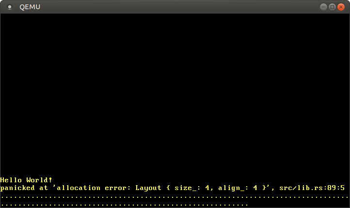

> 原文：[Heap Allocation](https://os.phil-opp.com/heap-allocation/)

本文为我们的内核添加堆内存分配的支持。首先，它会介绍动态内存，展示借用检查器如何防止常见的分配错误。然后实现 Rust 的基本分配器接口，创建一个堆内存分配器，并创建一个分配器包。本文结束后，我们的内核就能用上内置的 `alloc` 包的分配和集合类型了。

<!-- more -->

此博客在 [GitHub][github blog-os] 上公开开发。如果您有任何问题或疑问，请在那边打开一个 issue。 您也可以在 [底部](#valine) 发表评论。这篇文章的完整源代码可以在 [blog-os-cn/10-heap-allocation][10-heap-allocation] 找到。

## 局部与静态变量

我们的内核当前只使用了两种类型的变量：局部变量和 `static` 变量。局部变量保存在 [调用栈][call stack]，只在函数返回前有效。静态变量则会保存在固定的内存区域，在程序的整个生命周期内都有效。

### 局部变量

局部变量保存在 [调用栈][call stack]，这是个支持 `push` 和 `pop` 操作的 [栈数据结构][stack data structure]。每次进入函数时，被调函数的参数、返回地址和局部变量会由编译器压入：


上述例子展示了 `outer` 函数调用 `inner` 函数后的调用栈。可以看到调用先包含了 `outer` 的局部变量。调用 `inner` 时，参数 `1` 和函数的返回地址被压入栈。然后控制权转到 `inner`，伴随着其局部变量的入栈。

`inner` 函数返回后，其相关调用栈的部分被弹出，只剩下 `outer` 的局部变量：


可以看到 `inner` 的局部变量只存活到函数返回。Rust 编译器强制执行这些生命期检查规则，一旦使用存活过长的值就会抛出异常，例如试图返回局部变量的引用这种情况：

```rust
fn inner(i: usize) -> &'static u32 {
    let z = [1, 2, 3];
    &z[i]
}
```

([在 playground 上小试身手](https://play.rust-lang.org/?version=stable&mode=debug&edition=2018&gist=6186a0f3a54f468e1de8894996d12819))

虽然这个例子里面返回引用意义不大，有些情况下我们会想要返回比函数存活更久的变量。我们之前已经在内核里面看到这样的情况--试图 [加载中断描述表][load an interrupt descriptor table]，必须使用 `static` 变量来延长生命期。

### 静态变量

静态变量存储在不同于栈的固定内存区域上。这个内存区域在编译阶段由链接器分配并编码在可执行文件里面。静态变量会在程序的整个运行时存活，所以他们有 `'static` 生命周期，总可以被局部变量引用：

![同样的 outer/inner 示例，不同的是 inner 包含 `static Z: [u32; 3] = [1,2,3];`，并返回 `&Z[i]` 引用](./images/call-stack-static.svg)

上面的 `inner` 函数返回后，它相关部分的栈会被破坏。静态变量存在绝不会破坏的单独区域，所以 `&Z[1]` 变量在函数后依然合法。

除了 `'static` 生命期以外，静态变量还有一个有用的性质：它们的位置在编译时就已知，所以访问它们不需要引用。我们的 `println` 宏就利用了这个属性：通过内地里使用 [静态的 `Writer`][static `Writer`]，调用这个宏不需要 `&mut Writer` 引用，这对于我们无法访问任何额外变量的 [异常处理函数][exception handlers] 是非常有用。

然而，静态变量的属性也带来了严重缺点：默认情况下它们都只读。Rust 强制这条规则是因为诸如两个线程同时更改静态变量会引发 [数据竞争][data race] 问题。更改静态变量的唯一方法是将其包装到 [`Mutex`] 类型，这确保任意时间内都只有一个 `&mut` 引用存在。[静态 VGA 缓冲区][static VGA buffer Writer] 已经用上了 `Mutex`。

## 动态内存

局部变量和静态变量都非常强大，并适用于大部分使用情况。然而，可以看到他们还是各有缺陷的：

- 局部变量只会存活到外围函数或区块的末尾。因为他们都存在栈上，会在外围函数返回后被破坏掉
- 静态变量总是在程序的整个运行时内存活，不再使用时，没有办法能够回收或者复用它们的内存。而且，他们的所有权未明，能够被所有函数访问，所以如果需要更改它们的话需要借助 [`Mutex`] 保护

局部变量和静态变量的另一个局限性是大小固定。所以它们无法存储添加元素时要求动态增长的集合类型。（Rust 有提议使用 [无符号右值][unsized rvalues] 来支持存储动态大小的局部变量，但是只适用于某些特定情况。）

为了规避这些缺点，编程语言通常支持用称为 **堆** 的另一个内存区域存储变量。堆借助 `allocate` 和 `deallocate` 两个函数支持运行时 *动态内存分配*。它的工作方式如下：`allocate` 函数返回特定大小的内存空闲块，用于存储变量。这个变量会一直存在直至以这个变量的引用调用 `deallocate` 函数。 

让我们看个例子：

![inner 函数调用 `allocate(size_of([u32; 3]))`，写入 `z.write([1,2,3]);` 并返回 `(z as *mut u32).offset(i)`。outer 函数堆返回值 `y` 执行 `deallocate(y, size_of(u32))`](./images/call-stack-heap.svg)

这里的 `inner` 函数使用堆内存而不是静态变量存储 `z`。它首先分配要求大小的内存块，得到返回的 `*mut u32` [裸指针][raw pointer]。然后使用 [`ptr::write`] 方法写入数组 `[1,2,3]`。最后一步，使用 [`offset`] 函数计算第 `i` 个元素的指针，并返回它。（需要注意的是，为了示例函数的简洁起见，我们这里忽略了一些必要的转换和 unsafe 区块。）

分配出来的内存会一直存活直至显式调用 `deallocate` 来释放。所以，在 `inner` 返回以及调用栈的相关部分被破坏之后，所得指针依然合法。和静态内存相比，使用堆内存的好处是内存被释放（借助 `outer` 调用 `deallocate`）后可以复用。调用这个函数之后，情况如下：

![调用栈包含 outer 的局部变量，堆包含 z[0] 和 z[2]，但不再包含 z[1]](./images/call-stack-heap-freed.svg)

可以看到 `z[1]` 被释放掉了，可以在下一次调用 `allocate` 时复用。但是，也可以看到因为我们绝不释放它们，所以 `z[0]` 和 `z[2]` 永不释放。这个 bug 称为 *内存泄露*，通常会导致程序的过量内存消耗（可以想象一下，我们在循环里面反复调用 `inner`）。这可能看起来挺糟糕，但是动态内存分配还有多得多的危险 bug。

### 常见错误

内存泄露虽然是不好的，但是还不会使得程序容易遭受攻击，但这之外还有两种后果严重的 bug：

- 对变量调用 `deallocate` 后我们无意间继续使用这个变量时，**释放后使用** 的问题就会出现。这个 bug 会触发未定义行为，通常被攻击者利用来执行任意代码
- 不小心释放一个变量两次，会出现 **双重释放** 的问题。因为这可能会释放在第一次 `deallocate` 调用后分配到同一个位置的内存。因此，这会再次导致释放后使用的问题

这些问题都是比较知名的，所以一般人会认为现在大部分人都学会如何避免它们了。但是事实并没有，这些问题依然被经常发现，例如这个最近的 [Linux 的释放后使用的问题][linux vulnerability] 使得任意代码可以执行。这表明即使是最好的程序猿也无法总能在复杂项目里面正确处理动态内存问题。

为了避免这些问题，诸如 Java 或 Python 等很多语言都借助称为 [*垃圾回收*][_garbage collection_] 的技巧自动管理动态内存。思路是程序猿从不手动调用 `deallocate`。而是程序定期暂停并扫描未被使用的堆变量，然后自动释放这些变量。因此，上面的问题绝不会出现。相应的缺点是定期扫描和可能挺长的暂停时间会带来性能损失。

Rust 采用应对这个问题的另一种方法：它使用称为 [*所有权*][_ownership_] 的概念，能够在编译时检查动态内存操作的正确性。因此，不需要垃圾回收来解决前面提到的问题，这也意味着没有性能损失。这种方法的另一个好处是程序猿依然能够像 C 或 C++ 那般精细地控制动态内存的使用。

### Rust 的内存分配

与其让程序猿人为地调用 `allocate` 和 `deallocate`，Rust 标准库提供隐式调用这些函数的抽象类型。其中最重要的类型是 [**`Box`**]，这是堆分配值的抽象。它提供接收一个值的 [`Box::new`] 构造函数，会以值的大小调用 `allocate`，然后把值移动到堆新分配出来的插槽。为了再次释放堆内存，`Box` 类型实现 [`Drop` trait]，会在作用域结束后调用 `deallocate`：

```rust
{
    let z = Box::new([1,2,3]);
    […]
} // z goes out of scope and `deallocate` is called
```

这种模式有个奇怪的名字--[*资源获取即初始化*][_resource acquisition is initialization_]（或者简称 *RAII*）。它起源于 C++，用于实现一个称为 [`std::unique_ptr`] 的类似的抽象类型。

因为在 `Box` 作用域结束、相应堆内存插槽被释放后，程序猿仍然可能持有其引用，所以仅有这个类型不足以避免所有释放后使用的 bug。

```rust
let x = {
    let z = Box::new([1,2,3]);
    &z[1]
}; // z goes out of scope and `deallocate` is called
println!("{}", x);
```

这就到 Rust 所有权进场的时候了。它会为每个引用分配一个抽象的 [生命期][lifetime]，这个生命期规定引用有效的作用域。在上面的例子中，`x` 引用从 `z` 数组中来，所以它会在 `z` 作用域结束后变得无效。[在 playground 上运行上面的例子][playground-2] 会看到 Rust 编译器确实抛出一个错误：

```bash
error[E0597]: `z[_]` does not live long enough
 --> src/main.rs:4:9
  |
2 |     let x = {
  |         - borrow later stored here
3 |         let z = Box::new([1,2,3]);
4 |         &z[1]
  |         ^^^^^ borrowed value does not live long enough
5 |     }; // z goes out of scope and `deallocate` is called
  |     - `z[_]` dropped here while still borrowed
```

这个术语一开始听起来有点让人困惑。因为和现实生活的借用类似，获得某个值的引用称为 *借用* 这个值：我们获得对象的临时访问权，但是需要在后续某个时间点把它还回去，且不能破坏它。通过确保对象被析构之前所有借用都已完成，Rust 的编译器可以确保没有释放后使用的情况出现。

Rust 的所有权系统甚至做到了更多，不仅避免释放后使用的 bug，还提供了类似 Java 和 Python 等垃圾回收语言的 [*内存安全性*][_memory safety_]。另外，它保证 [*线程安全*][_thread safety_]，所以在多线程代码方面比那些语言要甚至更加安全。最重要的是，这些检查都发生在编译时，所以和用 C 手码内存管理相比没有运行时代价。

#### 用例

现在知道 Rust 动态内存管理的基本知识了，但是什么时候应该用它呢？我们的内核走到现在一直都没有使用动态内存分配，所以为什么现在有需要了呢？

首先，因为每次内存分配时都需要在堆上找出一个空闲的插槽，所以动态内存分配总是伴随着性能损耗的。为此，局部变量通常是更受喜爱的，尤其是在性能敏感的内核代码里面。然而，还有一些场景能说明动态内存分配是最佳选择。

基本原则是：具有动态生命期或者大小的变量都需要动态内存。动态生命期中最重要的一个类型是 [**`Rc`**]，它会记录其包装值的引用，并在所有引用作用域结束后释放它占用的内存。具有动态大小的类型例子有 [**`Vec`**]、[**`String`**] 和其他 [集合类型][collection types]，这些类型会在添加更多元素时动态增长。这些类型的工作原理是容量打满时，申请分配一块更大的内存，把所有元素拷贝过去，然后释放掉旧的内存区域。

对于内核，我们很可能会用到集合类型，例如在后续文章实现多任务时存储活跃任务的列表。

## 分配器接口

实现堆分配器的第一步是添加对内置 [`alloc`] 包的依赖。和 [`core`] 包类似，这是标准库的一个子集，并包括内存分配和集合相关类型。为了添加 `alloc` 依赖，我们在 `lib.rs` 里面添加以下内容：

```rust
// in src/lib.rs

extern crate alloc;
```

和常规依赖不同，我们需要更改 `Cargo.toml`。原因是 `alloc` 包打包到 Rust 编译器作为标准库的一部分，所以编译器已经知道这个包。通过添加 `extern crate` 语句，我们规定编译器应该尝试包含它。（历史上所有依赖都需要一个 `extern crate` 语句，但是现在变成了可选）

因为基于自定义的目标编译，所以我们无法使用 Rust 安装包里面预编译好的 `alloc` 版本。而是需要告诉 cargo 从源码重新编译这个包。具体操作为在 `.cargo/config.toml` 文件添加 `unstable.build-std` 数组如下：

```toml
# in .cargo/config.toml

[unstable]
build-std = ["core", "compiler_builtins", "alloc"]
```

现在编译会重新编译，并把 `alloc` 包整合到我们的内核了。

`#[no_std]` 包默认禁用 `alloc` 包是因为这个包需要满足额外的要求。尝试编译项目可以看到这些要求以错误的形式输出如下：

```bash
error: no global memory allocator found but one is required; link to std or add
       #[global_allocator] to a static item that implements the GlobalAlloc trait.

error: `#[alloc_error_handler]` function required, but not found
```

第一个错误原因是 `alloc` 包需要一个堆分配器，一个提供 `allocate` 和 `deallocate` 函数的对象。在 Rust 里面，错误信息提到的 [`GlobalAlloc`] trait 描述堆分配器。为这个包设置堆分配器，必须为某个实现 [`GlobalAlloc`] trait 的 `static` 变量应用 `#[global_allocator]` 属性。

第二个错误原因是调用 `allocate` 可能会失败，最常见的情形是没有可用内存了。我们的程序必须能够应对这种情况，这正是 `#[alloc_error_handler]` 函数的用途。

我们会在后续部分详细讲解这个 trait 和属性。

### `GlobalAlloc` trait

[`GlobalAlloc`] trait 定义堆分配器必须提供的函数。这个 trait 比较特殊，它几乎从不直接被程序猿使用。而是每次使用 `alloc` 的内存分配或集合相关类型时由编译器自动插入 trait 方法的合适调用。

由于需要为我们的所有分配器类型实现这个 trait，让我们花点时间细看一下它的声明：

```rust
pub unsafe trait GlobalAlloc {
    unsafe fn alloc(&self, layout: Layout) -> *mut u8;
    unsafe fn dealloc(&self, ptr: *mut u8, layout: Layout);

    unsafe fn alloc_zeroed(&self, layout: Layout) -> *mut u8 { ... }
    unsafe fn realloc(
        &self,
        ptr: *mut u8,
        layout: Layout,
        new_size: usize
    ) -> *mut u8 { ... }
}
```

它定义了两个要求的方法 [`alloc`] 和 [`dealloc`]，分别对应到我们样例使用的 `allocate` 和 `deallocate` 函数：

- [`alloc`] 方法接收一个 [`Layout`] 实例作为参数，这个实例说明待分配内存应有的大小和对齐方式。方法返回所分配内存块第一个字节的 [裸指针][raw pointer]。`alloc` 方法返回一个空指针而不是一个显式的错误值来提示分配错误。这不是惯用写法，但是好处是利于包装现有的系统分配器，因为它们都是用同样的风格
- [`dealloc`] 方法则是对立面，负责再次释放内存块。它接收两个参数，分配时使用的 `alloc` 返回的指针和 `Layout`


这个 trait 还定义了另外两个方法：具有默认实现的 [`alloc_zeroed`] 和 [`realloc`]：
- [`alloc_zeroed`] 方法等价于调用 `alloc`，然后设置分配的内存区块为 0，这正是默认实现做的东西。可能的话，一个分配器实现可以用一个更高效的自定义实现覆写默认实现
- [`realloc`] 允许增加或压缩分配的内存。默认实现是分配一块预期大小的新内存区块，并从旧的内存中把所有内容拷贝过来。同样地，分配器实现可以提供这个方法更加高效的实现，例如可能时原地增加/压缩内存

#### 不安全性

需要注意的一点是 trait 本身和所有 trait 方法都声明为 `unsafe`：
- 把 trait 声明为 `unsafe` 的理由是程序猿必须确保分配器类型的 trait 实现是正确的。例如，`alloc` 方法必须不会返回一个已在其他地方被使用的内存区块，否则会导致未定义行为
- 类似的，`unsafe` 方法是因为调用方法时调用方必须保证多个前提条件，例如，传给 `alloc` 的 `Layout` 注明的大小不为 0。由于这些方法通常直接由编译器调用，所以在实践中这些条件问题都不大紧要，编译器会满足要求

### `DummyAllocator`

既然知道分配器类型需要提供的方法，我们可以创建一个简单的假分配器了。为此，创建一个新的 `allocator` 模块：

```rust
// in src/lib.rs

pub mod allocator;
```

假的分配器最小化地实现了 trait，并总是在 `alloc` 调用时返回一个错误。它的代码如下：

```rust
// in src/allocator.rs

use alloc::alloc::{GlobalAlloc, Layout};
use core::ptr::null_mut;

pub struct Dummy;

unsafe impl GlobalAlloc for Dummy {
    unsafe fn alloc(&self, _layout: Layout) -> *mut u8 {
        null_mut()
    }

    unsafe fn dealloc(&self, _ptr: *mut u8, _layout: Layout) {
        panic!("dealloc should be never called")
    }
}
```

这个结构体不需要任何字段，所以创建为 [零大小类型][zero sized type]。如前面所描述的那样，我们总是在 `alloc` 里面返回空指针，对应到一个分配错误。由于分配器不会返回任何内存，绝不应该调用 `dealloc`。为此，我们在 `dealloc` 方法里面简单 panic 即可。`alloc_zeroed` 和 `realloc` 方法有默认实现，所以我们不需要为其提供实现。

现在有了一个简单的分配器，但是我们还必须告诉 Rust 编译器使用这个分配器。这时得用上 `#[global_allocator]` 属性。

### `#[global_allocator]` 属性

`#[global_allocator]` 属性告诉 Rust 编译器应该使用具体哪个分配器实例作为全局堆分配器。这个属性只适用于实现 `GlobalAlloc` trait 的静态变量。让我们注册一个 `Dummy`  分配的实例作为全局分配器：

```rust
// in src/allocator.rs

#[global_allocator]
static ALLOCATOR: Dummy = Dummy;
```

由于 `Dummy` 分配器是 [零大小类型][zero sized type]，所以我们不需要在初始化表达式注明任何字段。

现在尝试编译，第一个错误应该消失了。让我们处理一下第二个错误：

```bash
error: `#[alloc_error_handler]` function required, but not found
```

### `#[alloc_error_handler]` 属性

前面讨论 `GlobalAlloc` trait 的时候，我们了解到 `alloc` 可以通过返回一个空指针提示分配错误。问题是：Rust 运行时应该如何处理这样的分配失败问题呢？这就是 `#[alloc_error_handler]` 属性排上用场的地方。它规定分配错误出现时调用的函数，和 panic 触发时调用的 panic 处理函数类似。

让我们添加一个函数来解决这个编译错误：

```rust
// in src/lib.rs

#![feature(alloc_error_handler)] // at the top of the file

#[alloc_error_handler]
fn alloc_error_handler(layout: alloc::alloc::Layout) -> ! {
    panic!("allocation error: {:?}", layout)
}
```

`alloc_error_handler` 函数仍然是不稳定的，所以我们需要特性开关来启用它。这个函数接收单个参数：分配失败时传给 `alloc` 的 `Layout` 实例。我们对失败无能为力，所以只是用包含 `Layout` 实例的消息触发 panic。

有了这个函数，编译错误应该被修复了。现在我们可以使用 `alloc` 的分配和集合相关类型了，例如使用 [`Box`] 来在堆上分配一个值：

```rust
// in src/main.rs

extern crate alloc;

use alloc::boxed::Box;

fn kernel_main(boot_info: &'static BootInfo) -> ! {
    // […] print "Hello World!", call `init`, create `mapper` and `frame_allocator`

    let x = Box::new(41);

    // […] call `test_main` in test mode

    println!("It did not crash!");
    blog_os::hlt_loop();
}
```

注意一下我们也需要在 `extern crate alloc` 里面注明 `main.rs` 语句。这是因为 `lib.rs` 和 `main.rs` 看做不同的包。然而，我们不需要创建另一个 `#[global_allocator]` 静态变量，因为全局分配器会作用于项目的所有包。事实上，在另一个包注明另一个分配器会触发错误。

运行以上代码，可以看到 `alloc_error_handler` 函数被调用了：



这个错误处理函数被调用是因为 `Box::new` 函数隐式调用全局分配器的 `alloc` 函数。假的分配器总是返回空指针，所以每个分配都会失败。为了解决这个问题，我们需要创建一个会真实返回可用内存的分配器。

## 创建一个内核堆

创建一个合理的分配器之前，我们首先需要开辟一个堆内存区域，让分配器可以分配内存。为此，我们需要指定一个堆区域的虚拟内存范围，然后把这个区域映射到物理帧。请参见 [*"分页入门"*][Introduction To Paging] 一文了解虚拟内存和页表。

第一步是为指定定一个虚拟内存区域。我们可以随便选择虚拟地址范围，只要它尚未用于其他不同内存区域。让我们定义其为从地址 `0x_4444_4444_0000` 开始的内存，这样后续我们就能很容易识别出来堆指针。

```rust
// in src/allocator.rs

pub const HEAP_START: usize = 0x_4444_4444_0000;
pub const HEAP_SIZE: usize = 100 * 1024; // 100 KiB
```

我们当前设置堆大小为 100 KiB。如果将来需要更多的话，可以很容易增加。

如果试图现在就是用这个堆区域的话，虚拟内存区域还没有映射到物理内存会导致缺页异常。为了解决这个问题，我们创建 `init_heap` 函数借助 [*"分页实现"*][Paging Implementation] 一文介绍的 [`Mapper` API] 来映射页面。

```rust
// in src/allocator.rs

use x86_64::{
    structures::paging::{
        mapper::MapToError, FrameAllocator, Mapper, Page, PageTableFlags, Size4KiB,
    },
    VirtAddr,
};

pub fn init_heap(
    mapper: &mut impl Mapper<Size4KiB>,
    frame_allocator: &mut impl FrameAllocator<Size4KiB>,
) -> Result<(), MapToError<Size4KiB>> {
    let page_range = {
        let heap_start = VirtAddr::new(HEAP_START as u64);
        let heap_end = heap_start + HEAP_SIZE - 1u64;
        let heap_start_page = Page::containing_address(heap_start);
        let heap_end_page = Page::containing_address(heap_end);
        Page::range_inclusive(heap_start_page, heap_end_page)
    };

    for page in page_range {
        let frame = frame_allocator
            .allocate_frame()
            .ok_or(MapToError::FrameAllocationFailed)?;
        let flags = PageTableFlags::PRESENT | PageTableFlags::WRITABLE;
        unsafe {
            mapper.map_to(page, frame, flags, frame_allocator)?.flush()
        };
    }

    Ok(())
}
```

这个函数接收 [`Mapper`] 和 [`FrameAllocator`] 实例的可变引用，两者都使用 [`Size4KiB`] 作为泛型参数以限定到 4KiB 的页面。函数的返回值为 [`Result`]，其成功枚举值为 `()`，失败枚举值为 [`Mapper::map_to`] 方法返回的错误类型 [`MapToError`]。因为这个函数的 `map_to` 方法是错误的主要源头。

实现可以分解为两部分：

- **创建页面范围**：为了创建想要映射的页面范围，我们将 `HEAP_START` 指针转化为 [`VirtAddr`] 类型。然后基于它加上 `HEAP_SIZE` 计算堆的结束地址。因为想要闭合的界限（堆最后一个字节的地址），所以减一。接下来，我们借助 [`containing_address`] 函数将地址转化为 [`Page`] 类型。最后，调用 [`Page::range_inclusive`] 函数创建从开始到结束页的页面范围。
- **映射页面**：第二步时把刚才所创建范围的所有页面映射出来。为此，我们使用 `for` 循环遍历范围内的页面。对于个页面，我们执行以下操作：
    - 使用 [`FrameAllocator::allocate_frame`] 方法分配一个页面会映射到的物理帧。这个方法在没有再多可用帧时返回 [`None`]。我们借助 [`Option::ok_or`] 方法将这种情况处理为 [`MapToError::FrameAllocationFailed`] 错误，然后应用 [问号运算符][question mark operator] 来实现一旦出错则早返回的问题
    - 把页面的标记符设置为 `PRESENT` 和 `WRITABLE`。有了这些标记符，读写权限到手，对于堆内存是非常合理的
    - 使用 [`Mapper::map_to`] 方法为活跃的页表创建映射。这个方法可以失败，所以再次使用 [问号运算符][question mark operator] 来把错误导向调用方。一旦成功，这个方法会返回 [`MapperFlush`] 实例，可调用其 [`flush`] 方法更新 [*快表*][_translation lookaside buffer_]

最后一步是在 `kernel_main` 函数调用这个函数：

```rust
// in src/main.rs

fn kernel_main(boot_info: &'static BootInfo) -> ! {
    use blog_os::allocator; // new import
    use blog_os::memory::{self, BootInfoFrameAllocator};

    println!("Hello World{}", "!");
    blog_os::init();

    let phys_mem_offset = VirtAddr::new(boot_info.physical_memory_offset);
    let mut mapper = unsafe { memory::init(phys_mem_offset) };
    let mut frame_allocator = unsafe {
        BootInfoFrameAllocator::init(&boot_info.memory_map)
    };

    // new
    allocator::init_heap(&mut mapper, &mut frame_allocator)
        .expect("heap initialization failed");

    let x = Box::new(41);

    // […] call `test_main` in test mode

    println!("It did not crash!");
    blog_os::hlt_loop();
}
```

这里展示整个函数方便联系上下文。唯一新行是 `blog_os::allocator` 导入和对 `allocator::init_heap` 函数的调用。因为当前没有合适的方式处理错误，所以使用 [`Result::expect`] 方法处理 `init_heap` 函数返回的错误。

现在我们有了一个可用的映射好的堆内存区域了。`Box::new` 调用依然是旧的 `Dummy` 分配器，所以执行程序时我们还会看到 "out of memory" 错误。让我们使用一个合适的分配器来解决这个问题。

## 使用分配器包

考虑到实现一个分配器比较复杂，我们暂且先使用一个外部分配器包。下一篇文章会讲解如何实现我们自己的分配器。

[`linked_list_allocator`] 包是适用于 `no_std` 应用的简单分配器包。它的名字来源于这样的事实--它内部使用链表数据结构来追踪被释放的内存区域。这种方法的更多详情参见下一篇文章。

为了使用这个包，我们首先需要在 `Cargo.toml` 添加它作为依赖：

```toml
# in Cargo.toml

[dependencies]
linked_list_allocator = "0.8.0"
```

然后用这个包提供的分配器替换假的分配器：

```rust
// in src/allocator.rs

use linked_list_allocator::LockedHeap;

#[global_allocator]
static ALLOCATOR: LockedHeap = LockedHeap::empty();
```

这个结构体名为 `LockedHeap` 是因为它是用 [`spinning_top::Spinlock`] 类型实现同步。这是因为多个线程都会同时访问 `ALLOCATOR` 静态变量。和以往一样，使用自旋锁或 mutex 时，我们需要注意不要不小心引发死锁。这意味着我们不应该在中断处理函数里面执行任何分配操作，因为他们会在任意时间执行，会中断正在执行的分配操作。

设置 `LockedHeap` 为全局分配器还是不够的。理由是我们使用 [`empty`] 构造函数，这会创建一个任何后备内存的分配器。和假的分配器类似，他总是在调用 `alloc` 时返回错误。为了解决这个问题，我们需要在创建堆之后初始化分配：

```rust
// in src/allocator.rs

pub fn init_heap(
    mapper: &mut impl Mapper<Size4KiB>,
    frame_allocator: &mut impl FrameAllocator<Size4KiB>,
) -> Result<(), MapToError<Size4KiB>> {
    // […] map all heap pages to physical frames

    // new
    unsafe {
        ALLOCATOR.lock().init(HEAP_START, HEAP_SIZE);
    }

    Ok(())
}
```

我们使用 `LockedHeap` 类型内部的自旋锁的 [`lock`] 方法获得被包装的 [`Heap`] 实例的独占引用，然后以堆的边界作为参数调用其 [`init`] 方法。重要的是我们在映射堆页面后再初始化堆，因为 [`init`] 函数已经尝试写入堆内存了。

初始化堆之后，我们现在可以使用内置 [`alloc`] 包的所有分配和集合相关类型而不会触发错误了：

```rust
// in src/main.rs

use alloc::{boxed::Box, vec, vec::Vec, rc::Rc};

fn kernel_main(boot_info: &'static BootInfo) -> ! {
    // […] initialize interrupts, mapper, frame_allocator, heap

    // allocate a number on the heap
    let heap_value = Box::new(41);
    println!("heap_value at {:p}", heap_value);

    // create a dynamically sized vector
    let mut vec = Vec::new();
    for i in 0..500 {
        vec.push(i);
    }
    println!("vec at {:p}", vec.as_slice());

    // create a reference counted vector -> will be freed when count reaches 0
    let reference_counted = Rc::new(vec![1, 2, 3]);
    let cloned_reference = reference_counted.clone();
    println!("current reference count is {}", Rc::strong_count(&cloned_reference));
    core::mem::drop(reference_counted);
    println!("reference count is {} now", Rc::strong_count(&cloned_reference));

    // […] call `test_main` in test context
    println!("It did not crash!");
    blog_os::hlt_loop();
}
```

这份示例代码演示 [`Box`]、[`Vec`] 和 [`Rc`] 类型的一些用法。对于 `Box` 和 `Vec` 类型，我们使用 [`{:p}` 格式化符][`{:p}` formatting specifier] 打印底层的堆指针。为了演示 `Rc`，我们创建一个引用计数的堆值，使用 [`Rc::strong_count`] 函数打印 销毁实例（使用 [`core::mem::drop`]）前后的引用计数。

现在运行可以看到以下输出：


和预期的那样，从地址前缀为 `0x_4444_4444_*` 可以看出 `Box` 和 `Vec` 的值存在堆上。引用计数的值表现和预期也一致，调用 `clone` 后引用计数为 2，销毁一个实例后引用计数变回 1。

向量的偏移地址为 `0x800` 的原因不是包装的值长度为 `0x800` 字节，而是向量需要增加容量时会触发 [重新分配][reallocations]。例如，当向量容量为 32 师，我们试图添加一个元素，向量会内地里分配一个后备容量为 64 的数组 ，并把所有元素复制过去。然后释放掉旧的内存。

当然，`alloc` 包还有很多分配和集合相关类型现在都可用到我们的内核里面了，包括：

- 线程安全的引用计数指针 [`Arc`]
- 拥有的字符串类型 [`String`] 和 [`format!`] 宏
- [`LinkedList`]
- 可增长的环形缓冲区 [`VecDeque`]
- [`BinaryHeap`] 优先队列
- [`BTreeMap`] 和 [`BTreeSet`]

这些类型将会在我们想要实现线程列表、调度队列或者支持 async/await 时变得非常有用。

## 添加测试

为了确保不会无意破坏新的分配代码，我们应该为其添加一个集成测试。具体操作为添加内容如下的 `tests/heap_allocation.rs` 文件：

```rust
// in tests/heap_allocation.rs

#![no_std]
#![no_main]
#![feature(custom_test_frameworks)]
#![test_runner(blog_os::test_runner)]
#![reexport_test_harness_main = "test_main"]

extern crate alloc;

use bootloader::{entry_point, BootInfo};
use core::panic::PanicInfo;

entry_point!(main);

fn main(boot_info: &'static BootInfo) -> ! {
    unimplemented!();
}

#[panic_handler]
fn panic(info: &PanicInfo) -> ! {
    blog_os::test_panic_handler(info)
}
```

我们复用 `lib.rs` 的 `test_runner` 和 `test_panic_handler` 函数。由于想要测试内存分配，我们借助 `extern crate alloc` 语句启用 `alloc` 包。更多关于测试模板的信息参见 [*测试*][Testing] 一文。

`main` 函数的实现如下：

```rust
// in tests/heap_allocation.rs

fn main(boot_info: &'static BootInfo) -> ! {
    use blog_os::allocator;
    use blog_os::memory::{self, BootInfoFrameAllocator};
    use x86_64::VirtAddr;

    blog_os::init();
    let phys_mem_offset = VirtAddr::new(boot_info.physical_memory_offset);
    let mut mapper = unsafe { memory::init(phys_mem_offset) };
    let mut frame_allocator = unsafe {
        BootInfoFrameAllocator::init(&boot_info.memory_map)
    };
    allocator::init_heap(&mut mapper, &mut frame_allocator)
        .expect("heap initialization failed");

    test_main();
    loop {}
}
```

这个 `main.rs` 的 `kernel_main` 函数非常类似，只是我们没有调用 `println`，没有包含任何实例分配，并无条件地调用 `test_main`。

现在添加测试的准备工作就绪。首先我们添加一个执行使用 [`Box`] 实现一些简单分配的操作，检查分配的值，从而确保基本内存分配是没问题的：

```rust
// in tests/heap_allocation.rs

use blog_os::{serial_print, serial_println};
use alloc::boxed::Box;

#[test_case]
fn simple_allocation() {
    let heap_value_1 = Box::new(41);
    let heap_value_2 = Box::new(13);
    assert_eq!(*heap_value_1, 41);
    assert_eq!(*heap_value_2, 13);
}
```

最重要的是这个测试验证没有分配错误出现。

接下来，我们迭代式地创建一个大的向量，测试大内存分配和（重新分配触发的）多次分配：

```rust
// in tests/heap_allocation.rs

use alloc::vec::Vec;

#[test_case]
fn large_vec() {
    let n = 1000;
    let mut vec = Vec::new();
    for i in 0..n {
        vec.push(i);
    }
    assert_eq!(vec.iter().sum::<u64>(), (n - 1) * n / 2);
}
```

我们通过和 [n 部分和][n-th partial sum] 公式的结果验证 n 项部分和的计算。这能让我们确信被分配的值都是正确的。

再多一个测试是创建紧接的一万次内存分配：

```rust
// in tests/heap_allocation.rs

use blog_os::allocator::HEAP_SIZE;

#[test_case]
fn many_boxes() {
    for i in 0..HEAP_SIZE {
        let x = Box::new(i);
        assert_eq!(*x, i);
    }
}
```

这个测试确保分配器会为后续的分配复用被释放的内存，否则的话回导致内存用光。这看起来像是分配器的显式要求，但是有些分配器方案是没有执行这一项的。例子就是下一篇文章会讲解的粗块分配器方案。

让我们运行新的集成测试：

```bash
> cargo test --test heap_allocation
[…]
Running 3 tests
simple_allocation... [ok]
large_vec... [ok]
many_boxes... [ok]
```

所有测试都通过了！我们也可以调用 `cargo test` （没有 `--test` 参数）来运行所有单元和集成测试。

## 总结

本文介绍了动态内存并解释它的用途和用处。见识到了 Rust 的借用检查器如何防止常见的问题，还学到了 Rust 的内存分配 API 的工作原理。

使用假的分配器创建一个最小化的 Rust 分配器接口之后，我们为内核开辟了一段合适的堆内存区域。为此，我们为堆定义一个虚拟地址范围，然后借助前一篇文章的 `Mapper` 和 `FrameAllocator` 把这个范围的所有页面映射到物理帧。

最后，我们添加 `linked_list_allocator` 包作为依赖，从而为内核添加一个合适的分配器。借助这个分配器，我们能够使用 `alloc` 包的 `Box`、`Vec` 以及其他内存分配和集合相关的类型。

## 下篇预告

虽然我们现在本文支持了堆内存分配，但是大部分工作都是 `linked_list_allocator` 包实现的。下篇文章将会详细讲解如何从零开始实现分配器。它会展示多种可能的分配器方案，演示如何实现它们的简单版本，并分析它们的优缺点。

[Testing]: /2020/07/27/blog-os-04-testing/
[Introduction To Paging]: /2020/07/19/blog-os-08-intro-to-paging/
[Paging Implementation]: /2020/07/18/blog-os-09-paging-implementation/

[_garbage collection_]: https://en.wikipedia.org/wiki/Garbage_collection_(computer_science)
[_memory safety_]: https://en.wikipedia.org/wiki/Memory_safety
[_ownership_]: https://doc.rust-lang.org/book/ch04-01-what-is-ownership.html
[_resource acquisition is initialization_]: https://en.wikipedia.org/wiki/Resource_acquisition_is_initialization
[_thread safety_]: https://en.wikipedia.org/wiki/Thread_safety
[_translation lookaside buffer_]: /2020/07/19/blog-os-08-intro-to-paging/#快表（translation-lookaside-buffer）

[**`Box`**]: https://doc.rust-lang.org/std/boxed/index.html
[**`Rc`**]: https://doc.rust-lang.org/alloc/rc/index.html
[**`String`**]: https://doc.rust-lang.org/alloc/string/index.html
[**`Vec`**]: https://doc.rust-lang.org/alloc/vec/index.html

[`Arc`]: https://doc.rust-lang.org/alloc/sync/struct.Arc.html
[`BinaryHeap`]: https://doc.rust-lang.org/alloc/collections/binary_heap/struct.BinaryHeap.html
[`Box`]: https://doc.rust-lang.org/alloc/boxed/struct.Box.html
[`Box::new`]: https://doc.rust-lang.org/alloc/boxed/struct.Box.html#method.new
[`BTreeMap`]: https://doc.rust-lang.org/alloc/collections/btree_map/struct.BTreeMap.html
[`BTreeSet`]: https://doc.rust-lang.org/alloc/collections/btree_set/struct.BTreeSet.html
[`Drop` trait]: https://doc.rust-lang.org/book/ch15-03-drop.html
[`FrameAllocator`]: https://docs.rs/x86_64/0.11.1/x86_64/structures/paging/trait.FrameAllocator.html
[`FrameAllocator::allocate_frame`]: https://docs.rs/x86_64/0.11.1/x86_64/structures/paging/trait.FrameAllocator.html#tymethod.allocate_frame
[`GlobalAlloc`]: https://doc.rust-lang.org/alloc/alloc/trait.GlobalAlloc.html
[`GlobalAlloc::alloc`]: https://doc.rust-lang.org/alloc/alloc/trait.GlobalAlloc.html#tymethod.alloc
[`Layout`]: https://doc.rust-lang.org/alloc/alloc/struct.Layout.html
[`LinkedList`]: https://doc.rust-lang.org/alloc/collections/linked_list/struct.LinkedList.html
[`MapToError`]: https://docs.rs/x86_64/0.11.1/x86_64/structures/paging/mapper/enum.MapToError.html
[`MapToError::FrameAllocationFailed`]: https://docs.rs/x86_64/0.11.1/x86_64/structures/paging/mapper/enum.MapToError.html#variant.FrameAllocationFailed
[`Mapper`]:https://docs.rs/x86_64/0.11.1/x86_64/structures/paging/mapper/trait.Mapper.html
[`Mapper::map_to`]: https://docs.rs/x86_64/0.11.1/x86_64/structures/paging/mapper/trait.Mapper.html#method.map_to
[`Mapper` API]: /2020/07/18/blog-os-09-paging-implementation/#使用-offsetpagetable
[`MapperFlush`]: https://docs.rs/x86_64/0.11.1/x86_64/structures/paging/mapper/struct.MapperFlush.html
[`Mutex`]: https://docs.rs/spin/0.5.2/spin/struct.Mutex.html
[`None`]: https://doc.rust-lang.org/core/option/enum.Option.html#variant.None
[`Option::ok_or`]: https://doc.rust-lang.org/core/option/enum.Option.html#method.ok_or
[`Page`]: https://docs.rs/x86_64/0.11.1/x86_64/structures/paging/page/struct.Page.html
[`Page::range_inclusive`]: https://docs.rs/x86_64/0.11.1/x86_64/structures/paging/page/struct.Page.html#method.range_inclusive
[`Rc`]: https://doc.rust-lang.org/alloc/rc/
[`String`]: https://doc.rust-lang.org/alloc/string/struct.String.html
[`VecDeque`]: https://doc.rust-lang.org/alloc/collections/vec_deque/struct.VecDeque.html
[`Vec`]: https://doc.rust-lang.org/alloc/vec/
[`VirtAddr`]: https://docs.rs/x86_64/0.11.1/x86_64/addr/struct.VirtAddr.html
[`Rc::strong_count`]: https://doc.rust-lang.org/alloc/rc/struct.Rc.html#method.strong_count
[`Result`]: https://doc.rust-lang.org/core/result/enum.Result.html
[`Result::expect`]: https://doc.rust-lang.org/core/result/enum.Result.html#method.expect
[`Size4KiB`]: https://docs.rs/x86_64/0.11.1/x86_64/structures/paging/page/enum.Size4KiB.html
[`Heap`]: https://docs.rs/linked_list_allocator/0.8.0/linked_list_allocator/struct.Heap.html

[`alloc`]: https://doc.rust-lang.org/alloc/
[`alloc_zeroed`]: https://doc.rust-lang.org/alloc/alloc/trait.GlobalAlloc.html#method.alloc_zeroed
[`containing_address`]: https://docs.rs/x86_64/0.11.1/x86_64/structures/paging/page/struct.Page.html#method.containing_address
[`core`]: https://doc.rust-lang.org/core/
[`core::mem::drop`]: https://doc.rust-lang.org/core/mem/fn.drop.html
[`dealloc`]: https://doc.rust-lang.org/alloc/alloc/trait.GlobalAlloc.html#tymethod.dealloc
[`empty`]: https://docs.rs/linked_list_allocator/0.8.0/linked_list_allocator/struct.LockedHeap.html#method.empty
[`flush`]: https://docs.rs/x86_64/0.11.1/x86_64/structures/paging/mapper/struct.MapperFlush.html#method.flush
[`format!`]: https://doc.rust-lang.org/alloc/macro.format.html
[`init`]: https://docs.rs/linked_list_allocator/0.8.0/linked_list_allocator/struct.Heap.html#method.init
[`linked_list_allocator`]: https://github.com/phil-opp/linked-list-allocator/
[`lock`]: https://docs.rs/lock_api/0.3.3/lock_api/struct.Mutex.html#method.lock
[`offset`]: https://doc.rust-lang.org/std/primitive.pointer.html#method.offset
[`ptr::write`]: https://doc.rust-lang.org/core/ptr/fn.write.html
[`realloc`]: https://doc.rust-lang.org/alloc/alloc/trait.GlobalAlloc.html#method.realloc
[`spinning_top::Spinlock`]: https://docs.rs/spinning_top/0.1.0/spinning_top/type.Spinlock.html
[`std::unique_ptr`]: https://en.cppreference.com/w/cpp/memory/unique_ptr

[`{:p}` formatting specifier]: https://doc.rust-lang.org/core/fmt/trait.Pointer.html

[call stack]: https://en.wikipedia.org/wiki/Call_stack
[collection types]: https://doc.rust-lang.org/alloc/collections/index.html
[data race]: https://doc.rust-lang.org/nomicon/races.html
[exception handlers]: /2020/07/27/blog-os-05-cpu-exceptions/#实现
[github blog-os]: https://github.com/phil-opp/blog_os
[load an interrupt descriptor table]: @/second-edition/posts/05-cpu-exceptions/index.md#loading-the-idt
[lifetime]: https://doc.rust-lang.org/book/ch10-03-lifetime-syntax.html
[linux vulnerability]: https://securityboulevard.com/2019/02/linux-use-after-free-vulnerability-found-in-linux-2-6-through-4-20-11/
[n-th partial sum]: https://en.wikipedia.org/wiki/1_%2B_2_%2B_3_%2B_4_%2B_%E2%8B%AF#Partial_sums
[playground-2]: https://play.rust-lang.org/?version=stable&mode=debug&edition=2018&gist=28180d8de7b62c6b4a681a7b1f745a48
[question mark operator]: https://doc.rust-lang.org/edition-guide/rust-2018/error-handling-and-panics/the-question-mark-operator-for-easier-error-handling.html
[raw pointer]: https://doc.rust-lang.org/book/ch19-01-unsafe-rust.html#dereferencing-a-raw-pointer
[reallocations]: https://doc.rust-lang.org/alloc/vec/struct.Vec.html#capacity-and-reallocation
[stack data structure]: https://en.wikipedia.org/wiki/Stack_(abstract_data_type)
[static `Writer`]: /2020/07/23/blog-os-03-vga-text-mode/#全局接口
[unsized rvalues]: https://github.com/rust-lang/rust/issues/48055
[static VGA buffer Writer]: /2020/07/23/blog-os-03-vga-text-mode/#自旋锁
[zero sized type]: https://doc.rust-lang.org/nomicon/exotic-sizes.html#zero-sized-types-zsts

[10-heap-allocation]: https://github.com/sammyne/blog-os-cn/tree/master/10-heap-allocation