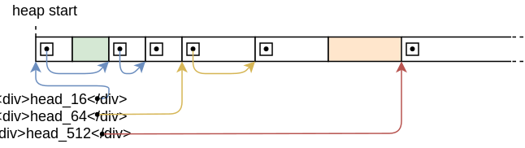

> 原文：[Allocator Designs](https://os.phil-opp.com/allocator-designs/)

本文讲解如何从零开始实现堆内存分配器。具体会展示和讨论三种不同的分配器设计，包括粗块式分配、链表式分配和固定块式分配。我们会为每种设计提供基本实现，并用于内核。

<!-- more -->

这文章开源在 [Github] 上。如果你有任何问题或疑问的话，请在那里打开一个 issue。这篇文章的完整源代码参见 @TODO（补充地址）。


<!-- toc -->

## 引言

[上一篇文章][previous post] 支持了我们的内核实现基本的堆内存分配。具体实现为：在页表中 [创建一个新的内存区域][map-heap]，然后 [使用 `linked_list_allocator` 包][use-alloc-crate] 管理那部分内存。虽然有了一个可用的堆，但是大部分工作都是借助分配器包实现的，我们尚未尝试了解其细节。


本文将会演示如何从零创建我们自己的堆分配器，不再依赖现有的分配器包。我们将会讨论不同的分配器设计方案，包括简化的 *粗块分配器* 和一个基本的 *固定块式分配器*，并结合这份知识实现一个更高性能的分配器（和 `linked_list_allocator` 包相比）。

### 设计目标

分配器负责管理可用的堆内存。它需要在 `alloc` 调用时返回空闲的内存，记录被 `dealloc` 释放的内存，使得这部分内存可以被重用。最重要的是，它决不能提供已被使用的内存，否则将会触发未定义行为。

除了正确性以外，还有更多次要的设计目标。例如，分配器应该能够有效地利用可用的内存，保持低 [碎片率][_fragmentation_]。它应该能够应对并发的应用，并能够随处理器数目拓展。为了性能最大化，它甚至能够根据 CPU 缓存优化内存布局，从而增多 [缓存局部化][cache locality] 并避免 [假共享][false sharing]。

这些要求使得构建好的分配器变得非常负责。例如，[jemalloc] 的代码超过 30,000 行。因为内核代码的一个小 bug 都会导致严重的安全问题，所以这等复杂度通常是没有必要的。好在内核代码的分配器模式要比用户空间代码的简单得多，因此，非常简单的分配器方案通常就够用了。


后续部分将会展示三种不同的可能内核分配器方案，并分析它们各自的优劣。

## 粗块分配器

*粗块分配器*（又名 *栈分配器*）是最简单的分配器方案。它会线性地分配内存，只记录已分配的字节数和分配的块数。因为具有所有内存只能一次性释放的严重缺陷，所以这种方案只适用于非常有限的场景。

### 原理

粗块分配器的基本思想是线性地增加（*bump*）`next` 变量，这个变量指向空闲内存的起始地址。最初，`next` 变量等于堆内存的起始地址。每次分配都会增加 `next` 变量，使其总是指向已用和未用内存的边界：


`next` 指针只会单向移动，因此永不会将重复分配同一份内存区域。到达堆内存末尾时，没有更多可用内存了，这时就会在下一次内存分配时触发 out-of-memory 错误。

粗块分配器的实现通常有一个分配计数器，每次 `alloc` 调用时加一，`dealloc` 调用时减一。分配计数器变为 0 表明堆上所有内存都被释放了。这时，`next` 指针可以重置为堆的起始地址，使得整块堆内存可以被再次使用。

### 实现

我们首先先为实现声明一个 `allocator::bump` 子模块：

```rust
// in src/allocator.rs

pub mod bump;
```

子模块的内容放在 `src/allocator/bump.rs` 文件，具体如下：

```rust
// in src/allocator/bump.rs

pub struct BumpAllocator {
    heap_start: usize,
    heap_end: usize,
    next: usize,
    allocations: usize,
}

impl BumpAllocator {
    /// Creates a new empty bump allocator.
    pub const fn new() -> Self {
        BumpAllocator {
            heap_start: 0,
            heap_end: 0,
            next: 0,
            allocations: 0,
        }
    }

    /// Initializes the bump allocator with the given heap bounds.
    ///
    /// This method is unsafe because the caller must ensure that the given
    /// memory range is unused. Also, this method must be called only once.
    pub unsafe fn init(&mut self, heap_start: usize, heap_size: usize) {
        self.heap_start = heap_start;
        self.heap_end = heap_start + heap_size;
        self.next = heap_start;
    }
}
```

`heap_start` 和 `heap_end` 字段记录堆内存区域的下界和上界。调用者需要确保地址的合法性，否则分配器会返回非法的内存。因此，`init` 函数需要以 `unsafe` 的形式调用。

`next` 字段的用途是指向堆内存第一个空闲的字节，即下次分配的起始地址。因为初始时整个堆都是空闲的，所以这个字段在 `init` 函数中被设置为 `heap_start`。每次分配时，这个字段的值会加上请求分配的内存大小，来防止两次分配返回相同的内存区域。

`allocations` 字段作为简单计数器，记录当前活跃的内存块数，从而实现在最后一块内存被释放后将分配器重置的目标。它的初始值为 0。

我们选择创建独立的 `init` 函数，而不是在 `new` 函数里面直接执行初始化，是为了保持和 `linked_list_allocator` 包所提供分配器一样的接口。这样切换分配器时就不需要额外的代码变更。

### 实现 `GlobalAlloc`

[上一篇文章讲过][global-alloc]，所有堆内存分配器都需要实现 [`GlobalAlloc`] trait，定义如下：


```rust
pub unsafe trait GlobalAlloc {
    unsafe fn alloc(&self, layout: Layout) -> *mut u8;
    unsafe fn dealloc(&self, ptr: *mut u8, layout: Layout);

    unsafe fn alloc_zeroed(&self, layout: Layout) -> *mut u8 { ... }
    unsafe fn realloc(
        &self,
        ptr: *mut u8,
        layout: Layout,
        new_size: usize
    ) -> *mut u8 { ... }
}
```

只有 `alloc` 和 `dealloc` 方法是必须的，其他两个方法有默认实现，可以忽略。

#### 第一次实现尝试

让我们实现 `BumpAllocator` 的 `alloc` 方法：

```rust
// in src/allocator/bump.rs

use alloc::alloc::{GlobalAlloc, Layout};

unsafe impl GlobalAlloc for BumpAllocator {
    unsafe fn alloc(&self, layout: Layout) -> *mut u8 {
        // TODO alignment and bounds check
        let alloc_start = self.next;
        self.next = alloc_start + layout.size();
        self.allocations += 1;
        alloc_start as *mut u8
    }

    unsafe fn dealloc(&self, _ptr: *mut u8, _layout: Layout) {
        todo!();
    }
}
```

首先，使用 `next` 字段作为分配的开始地址。然后更新 `next` 字段指向分配的结束地址，即堆上下一个空闲的地址。以 `*mut u8` 指针形式返回分配的起始地址前，把 `allocations` 计数器加一。

需要注意的是我们没有检查边界或调整对齐，所以这份实现是不安全的。问题不大，因为编译会失败，打印一下错误：

```bash
error[E0594]: cannot assign to `self.next` which is behind a `&` reference
  --> src/allocator/bump.rs:29:9
   |
26 |     unsafe fn alloc(&self, layout: Layout) -> *mut u8 {
   |                     ----- help: consider changing this to be a mutable reference: `&mut self`
...
29 |         self.next = alloc_start + layout.size();
   |         ^^^^^^^^^^^^^^^^^^^^^^^^^^^^^^^^^^^^^^^ `self` is a `&` reference, so the data it refers to cannot be written
```

（TODO 行也触发了同样的错误。为了简洁没有列出。）

错误原因是 `GlobalAlloc` trait 的 [`alloc`] 和 [`dealloc`] 方法只能操作不可变的 `&self` 引用，所以是不可能允许更新 `next` 和 `allocations` 字段的。这就有问题了，因为每次分配时更新 `next` 字段对于粗块分配器来说必不可少的。


需要注意的是编译器建议把方法声明中的 `&self` 改为 `&mut self` 是不可行的。原因是 `GlobalAlloc` trait 定义了方法签名，无法在实现侧改变。（对于不合理的编译器建议，我在 Rust 仓库开了个 [issue](https://github.com/rust-lang/rust/issues/68049)）

#### `GlobalAlloc` 和可更改性

探寻解决可更改性问题的方案之前，让我们试着理解为什么 `GlobalAlloc` trait 的方案用 TODO 参数定义：由 [上一篇文章][global-allocator] 可知，全局堆内存分配器定义形式位给一个实现 `GlobalAlloc` 的静态变量添加 `#[global_allocator]` 属性。Rust 的静态变量是不可变的，所以不存在可以调用接收 `&mut self` 的静态变量的方法。因此，`GlobalAlloc` 的所有方法都只接收一个不可变的 `&self` 引用。


好在从 `&self` 获取 `&mut self` 是有办法的：我们可以利用同步 [内部可更改性] 把分配器包在一个 [`spin::Mutex`] 自旋锁里面。这个类型提供的 `lock` 方法能够实现 [互斥][mutual exclusion]，因此能够安全地把一个 `&self` 转化为一个 `&mut self`。我们已经在内核多次使用了这个包装类型，例如 [VGA 文本缓冲区][vga-mutex]。

#### `Locked` 包装类型

借助 `spin::Mutex` 包装类型，我们能够为粗块分配器实现 `GlobalAlloc`。骚操作如下：直接实现这个 trait 的不是 `BumpAllocator`，而是包装好的 `spin::Mutex<BumpAllocator>`：

```rust
unsafe impl GlobalAlloc for spin::Mutex<BumpAllocator> {…}
```

不幸的是，因为 Rust 编译器不允许为定义在其他包的类型实现 trait，因此这种方式是行不通的：

```bash
error[E0117]: only traits defined in the current crate can be implemented for arbitrary types
  --> src/allocator/bump.rs:28:1
   |
28 | unsafe impl GlobalAlloc for spin::Mutex<BumpAllocator> {
   | ^^^^^^^^^^^^^^^^^^^^^^^^^^^^--------------------------
   | |                           |
   | |                           `spin::mutex::Mutex` is not defined in the current crate
   | impl doesn't use only types from inside the current crate
   |
   = note: define and implement a trait or new type instead
```

为了解决这个问题，我们需要包装一下 `spin::Mutex`：

```rust
// in src/allocator.rs

/// A wrapper around spin::Mutex to permit trait implementations.
pub struct Locked<A> {
    inner: spin::Mutex<A>,
}

impl<A> Locked<A> {
    pub const fn new(inner: A) -> Self {
        Locked {
            inner: spin::Mutex::new(inner),
        }
    }

    pub fn lock(&self) -> spin::MutexGuard<A> {
        self.inner.lock()
    }
}
```

这个类型是包装 `spin::Mutex<A>` 的一个泛型。它对被包装的类型 `A` 没有任何限制，所以不仅可以包装分配器，还可以包装各种类型。它提供一个简单的 `new` 构造函数用于包装给定的值。为了简单起见，它还提供一个 `lock` 函数，这个函数调用被包装的 `Mutex` 的 `lock` 方法。由于 `Locked` 类型足够通用，能在其他分配器实现中用上，因此我们把它放在父亲模块 `allocator`。

#### `Locked<BumpAllocator>` 的实现

`Locked` 类型的定义在我们自己的包（不同于 `spin::Mutex`），所以可以用其为粗块分配器实现 `GlobalAlloc`。完整的实现如下：

```rust
// in src/allocator/bump.rs

use super::{align_up, Locked};
use alloc::alloc::{GlobalAlloc, Layout};
use core::ptr;

unsafe impl GlobalAlloc for Locked<BumpAllocator> {
    unsafe fn alloc(&self, layout: Layout) -> *mut u8 {
        let mut bump = self.lock(); // get a mutable reference

        let alloc_start = align_up(bump.next, layout.align());
        let alloc_end = match alloc_start.checked_add(layout.size()) {
            Some(end) => end,
            None => return ptr::null_mut(),
        };

        if alloc_end > bump.heap_end {
            ptr::null_mut() // out of memory
        } else {
            bump.next = alloc_end;
            bump.allocations += 1;
            alloc_start as *mut u8
        }
    }

    unsafe fn dealloc(&self, _ptr: *mut u8, _layout: Layout) {
        let mut bump = self.lock(); // get a mutable reference

        bump.allocations -= 1;
        if bump.allocations == 0 {
            bump.next = bump.heap_start;
        }
    }
}
```

`alloc` 和 `dealloc` 的第一步是通过 `inner` 字段调用 [`Mutex::lock`] 方法得到被包装的分配器类型的可修改引用。这个实例到方法末尾之前会一直保持锁定，所以多线程场景下也不会出现数据竞争（我们后续很快会讲到线程）。


和之前的原型相比，`alloc` 的实现满足了对齐要求并之前边界检查，确保分配局限在堆内存区域内。第一步是把 `next` 地址约近到 `Layout` 参数指定的对齐。`align_up` 函数的代码很快讲到。然后 `alloc_start` 加上请求分配的大小，得到分配的结束地址。为了防止大型分配情况下的整数溢出问题，我们使用 [`checked_add`] 方法。如果溢出发生或者分配所得结束地址大于堆的结束地址，返回提示 out-of-memory 的空指针。否则，和之前那样更新 `next` 地址，`allocations`  加一。最后把返回的 `alloc_start` 地址转换为 `*mut u8` 指针。


`dealloc` 函数忽略给定的指针和 `Layout` 参数。它只是简单的把 `allocations` 计数器减一。计数器再次变为 `0` 意味着所有分配都被释放了。这种情况下，`next` 地址会被重置为 `heap_start` 地址，使得整个堆内存再次可用。

#### 地址对齐

`align_up` 函数比较通用，所以我们把它放到父亲模块 `allocator`。其基本实现如下：

```rust
// in src/allocator.rs

/// Align the given address `addr` upwards to alignment `align`.
fn align_up(addr: usize, align: usize) -> usize {
    let remainder = addr % align;
    if remainder == 0 {
        addr // addr already aligned
    } else {
        addr - remainder + align
    }
}
```

这个函数首先计算 `addr` 除以 `align` 的 [余数][remainder]。如果余数为 `0`，地址就已经满足给定的对齐了。否则，我们对齐地址的操作为：减去余数（使得新的余数为 0），然后加上对齐量（使得地址不会变得小于原始地址）。 


值得注意的是：这个函数的最高效实现方式不是这样的。一个更快的实现方式如下：

```rust
/// Align the given address `addr` upwards to alignment `align`.
///
/// Requires that `align` is a power of two.
fn align_up(addr: usize, align: usize) -> usize {
    (addr + align - 1) & !(align - 1)
}
```

这个方法基于这样一个事实：`GlobalAlloc` trait 保证 `align` 总是 2 的次幂。这样一来，创建一个 [掩码][bitmask] 高效地对齐地址就变得可能了。为了消化一下它的原理，我们从右边开始一步步地拆解来看：


- 由于 `align` 是 2 的次幂，所以它的 [二进制表示][binary representation] 只有一位置 1（例如，`0b000100000`）。这意味着 `align - 1` 的所有更低位都置 1 了（例如，`0b00011111`）
- 借助 `!` 运算符实现 [按位取反][bitwise `NOT`]，我们得到一个这样的数字：除了比 `align` 低的所有位都置 1（例如，`0b…111111111100000`）
- 对地址和 `!(align - 1)` 执行 [按位与][bitwise `AND`] 操作，我们 *向下* 对齐地址。它会把所有低于 `align` 的位置零
- 由于想要向上对齐而不是向下对齐，我们在执行按位与操作前把 `addr` 加上 `align - 1`。这样的话，已经对齐的地址会保持不变，而非对齐的地址则会对其他下一个对齐的边界


选用的方法因人而异。两个方法都会计算得到相同的结果，只是用了不同的方式。

### 使用它

为了用粗块分配器替换 `linked_list_allocator` 包，我们需要更新 `allocator.rs` 文件的静态变量 `ALLOCATOR`：

```rust
// in src/allocator.rs

use bump::BumpAllocator;

#[global_allocator]
static ALLOCATOR: Locked<BumpAllocator> = Locked::new(BumpAllocator::new());
```

我们把 `BumpAllocator::new` 和 `Locked::new` 定义为 [`const` 函数][`const` functions] 的重要性这时就显现出来了。由于 `static` 变量的初始化表达式必须在编译时可计算，把它们变成常规函数会触发编译错误。


因为粗块分配器提供了和 `linked_list_allocator` 一样的分配器接口，所以我们不需要改变 `init_heap` 函数里面的 `ALLOCATOR.lock().init(HEAP_START, HEAP_SIZE)` 调用。


现在内核就可以使用我们的粗块分配器了！一切都应该正常，包括上一篇文章创建的 [`heap_allocation` 测试][`heap_allocation` tests]：


```bash
> cargo test --test heap_allocation
[…]
Running 3 tests
simple_allocation... [ok]
large_vec... [ok]
many_boxes... [ok]
```

### 讨论

粗块分配器的最大优势是非常快速。其他分配器方案（往后看）需要积极查询合适的内存块并记录 `alloc` 和 `dealloc`，而粗块分配器 [可以优化][bump downwards] 到用少数汇编指令。这个特点让粗块分配器非常有助于优化分配器性能，例如用于创建一个 [虚拟的 DOM 库][virtual DOM library]。


虽然粗块分配器很少用作全局分配器，但是其原理经常以 [arena 分配][arena allocation] 的形式应用，这种应用形式为了提高性能基本会把个别分配放到一起批处理。Rust 的 arena 分配器的样例为 [`toolshed`] 包。


#### 粗块分配器的缺点

粗块分配器的主要局限性是它只能在所有已分配内存被释放后重用释放的内存。这就意味着一个长存的分配就足以阻止内存复用。添加修改版的 `many_boxes` 测试即可看到这个效果：

```rust
// in tests/heap_allocation.rs

#[test_case]
fn many_boxes_long_lived() {
    let long_lived = Box::new(1); // new
    for i in 0..HEAP_SIZE {
        let x = Box::new(i);
        assert_eq!(*x, i);
    }
    assert_eq!(*long_lived, 1); // new
}
```

和 `many_boxes` 测试类似，这个测试创建大量内存分配，如果分配器没有复用释放的内存就会触发 out-of-memory 错误。另外，这个测试分配了在整个循环执行期间内都有效的一个 `long_lived`。

运行新版测试可以看到确实失败了：

```bash
> cargo test --test heap_allocation
Running 4 tests
simple_allocation... [ok]
large_vec... [ok]
many_boxes... [ok]
many_boxes_long_lived... [failed]

Error: panicked at 'allocation error: Layout { size_: 8, align_: 8 }', src/lib.rs:86:5
```

让我们仔细理一下错误原因：首先，分配的 `long_lived` 创建在堆的起始地址，把 `allocations` 计数器加一。每次循环，一个短期的分配被创建出来，然后在下一次迭代开始前直接被释放。这意味着 `allocations` 计算在每次迭代开始时临时加到 2，迭代结束后降为 1。问题在于粗块分配器只有在 *所有* 已分配内存都释放后才能重用内存，即 `allocations` 计算器降为 0 时。由于这个条件在循环结束前不会发生，每次迭代分配一个新的内存区域，多次迭代后就会触发 out-of-memory 错误。

#### 修复测试？

以下两个可能的骚操作可以用于修复粗块分配器的测试：

- 把 `dealloc` 更新成这样：比较当前被释放的内存结束地址和 TODO 指针，确定其是否是上一次被 `alloc` 最近分配的内存。如果结束地址和 `next` 指针相等，我们就可以安全地把 `next` 重置回被释放内存的起始地址了。这样，每轮迭代就可以重用同样的内存区块
- 添加 `alloc_back` 方法，借助额外 `next_back` 字段实现从堆内存的 *末端* 开始分配内存。然后对于所有长期的内存分配，使用这个分配方法，从而分离堆上的短期和长期的内存。需要注意的是，只有在提前知道长期内存的有效时间时，这个分离操作才是有效的。这种方法的另一个缺点是手动执行内存分配是比较麻烦甚至不太安全的

虽然两种方法都是能够修复测试，但是他们只能在非常特定的情况下才能重用内存，所以他们都不是通用的解决方案。问题来了：存在能够复用所有已释放内存的通用解决方案吗？

#### 复用所有已释放内存？

由 [上一篇文章][heap-intro] 可知，分配的内存的存活时间是任意长的，会以任意顺序被释放掉。如下例子所示，这意味着我们需要记录一个可能无上限数目的、不连续的空闲内存区域。


上图展示了堆内存随时间推移的变化情况。开始的时候，整个堆都是未被使用的，`next` 地址等于 `heap_start`（第一行）。然后，第二行出现第一次内存分配。第三行时，分配了第二块内存，且第一块内存被释放了。第四行分配了更多内存。第五行释放了其中半数的短期内存，并分配了又一块内存。

第五行说明了根本问题：总共有五块空闲的内存区域，但是 `next` 指针只指向最后一块的起始地址。虽然这种情况下我们可以用大小为 4 的数组保存其他空闲内存区域的起始地址和长度，但是我们也可能遇到 8、16 或者 1000 个等等空闲内存区域，所以这不是个通用的解决方案。

一般情况下，我们可能会遇到无数的内存块，也许可以直接用堆分配的集合存储。但是在我们的情况下，由于堆不能依赖自身（它会导致无限递归或死锁），所以是真的不可行。因此，我们需要找一个不同的方案。

## 链表分配器

实现分配器时，为了记录任何数目的空闲内存区域，一个常见操作为使用这些区域作为后备存储。这利用了这样的事实：内存依然映射到虚拟地址，有物理帧提供存储，但是存储的内容不再需要而已（TODO 不懂）。通过把空闲区域的信息存储到区域本身，我们无需额外内存即可追踪到无数的空闲区域了。

最常见的实现方式是在空闲内存中构造一个单链表，每个节点表示一个空闲内存区域：


每个链表节点包含两个字段：内存区域的大小和指向下一块空闲内存区域的指针。采用这种方法后，我们只需要一个直线第一块空闲区域（称为 `head`）的指针，即可追踪到所有空闲的区域，不用在意它们的数目。所得数据结构通常称为 [*空闲列表*][_free list_]。


由名字可能也会猜到，这正是 `linked_list_allocator` 包使用的技巧。使用这种技巧的分配器通常也被称为 *池式分配器*。

### 实现

后续部分，我们将会使用以上方式创建自己的简易 `LinkedListAllocator` 类型，用于追踪空闲内存区域。这部分对于后续文章不是必须的，所以没兴趣的话可以跳过实现细节。

#### 分配器类型

现在新的 `allocator::linked_list` 子模块创建一个私有的 `ListNode` 结构体：

```rust
// in src/allocator.rs

pub mod linked_list;
```

```rust
// in src/allocator/linked_list.rs

struct ListNode {
    size: usize,
    next: Option<&'static mut ListNode>,
}
```

如图，链表节点有一个 `size` 字段和一个用 `Option<&'static mut ListNode>` 类型表示的指向下一个节点的可选指针。`&'static mut` 类型从语义上描述指针背后的 [owned] 对象。简单来说，它就是个 [`Box`]，只是没有在对象作用域末尾负责释放内存的析构函数而已。


我们为 `ListNode` 实现以下方法集：

```rust
// in src/allocator/linked_list.rs

impl ListNode {
    const fn new(size: usize) -> Self {
        ListNode { size, next: None }
    }

    fn start_addr(&self) -> usize {
        self as *const Self as usize
    }

    fn end_addr(&self) -> usize {
        self.start_addr() + self.size
    }
}
```

这个类型有一个名为 `new` 的简单构造函数，和用于计算要表示区域的起始地址和结束地址的其他方法。因为构造静态链表式分配器时需要用到，我们把 `new` 函数定义为 [const 函数][const function]。需要注意的是：在 const 函数中使用可修改的引用（包括把 `next` 设置为 `None`）依然是不稳定的。为了使编译通过，我们需要在 `lib.rs` 头部添加 **`#![feature(const_fn)]`**。


有了 `ListNode` 结构体作为基础，我们现在可以创建 `LinkedListAllocator` 结构体了：

```rust
// in src/allocator/linked_list.rs

pub struct LinkedListAllocator {
    head: ListNode,
}

impl LinkedListAllocator {
    /// Creates an empty LinkedListAllocator.
    pub const fn new() -> Self {
        Self {
            head: ListNode::new(0),
        }
    }

    /// Initialize the allocator with the given heap bounds.
    ///
    /// This function is unsafe because the caller must guarantee that the given
    /// heap bounds are valid and that the heap is unused. This method must be
    /// called only once.
    pub unsafe fn init(&mut self, heap_start: usize, heap_size: usize) {
        self.add_free_region(heap_start, heap_size);
    }

    /// Adds the given memory region to the front of the list.
    unsafe fn add_free_region(&mut self, addr: usize, size: usize) {
        todo!();
    }
}
```

这个结构体包含一个指向第一块堆内存的 `head` 节点。我们只关心 `next` 指针的值，所以在 `ListNone::new` 函数里把 `size` 设置为 0。把 `head` 定义成 `ListNode` 而不是 `&'static mut ListNode` 的好处是：`alloc` 方法的实现会更加简单。 

和粗块分配器类似，`new` 函数没有用堆边界初始化分配器。除了想要维持 API 兼容性外，理由是初始化流程要求往堆内存写入一个节点，这个写入只能发生在运行时。然而，因为 `new` 函数用于初始化 `ALLOCATOR` 静态变量，所以它需要是在编译时就能估值的 [`const` 函数][`const` function]。因此，我们再次提供一个分开的、non-constant 的 `init` 方法。


`init` 方法使用的 `add_free_region` 方法的具体实现马上讲到。我们暂且用 [`todo!`] 宏为其提供一个总会 panic 的占位实现。


#### `add_free_region` 方法

`add_free_region` 方法提供链表的一个基础 *push* 操作。我们当前只会在 `init` 函数调用这个方法，但是这个方法还会作为 `dealloc` 实现的核心方法。别忘了：一块内存已分配内存被释放时会再次调用 TODO 方法。为了追踪这个空闲的内存区域，我们想要把它添加到链表里面。

`add_free_region` 方法的实现如下：

```rust
// in src/allocator/linked_list.rs

use super::align_up;
use core::mem;

impl LinkedListAllocator {
    /// Adds the given memory region to the front of the list.
    unsafe fn add_free_region(&mut self, addr: usize, size: usize) {
        // ensure that the freed region is capable of holding ListNode
        assert_eq!(align_up(addr, mem::align_of::<ListNode>()), addr);
        assert!(size >= mem::size_of::<ListNode>());

        // create a new list node and append it at the start of the list
        let mut node = ListNode::new(size);
        node.next = self.head.next.take();
        let node_ptr = addr as *mut ListNode;
        node_ptr.write(node);
        self.head.next = Some(&mut *node_ptr)
    }
}
```

这个方法接收一个地址和大小作为参数表示一个内存区域，并把它添加到链表头部。首先确保给定区域具有足够的大小和合适的对齐用于存储一个 `ListNode`。然后创建一个链表节点，执行以下步骤把它插入链表：


第 0 步显示调用 `add_free_region` 之前堆的状态。第 1 步以图中标记为 `freed` 的内存区域调用方法。初步检查后，这个方法基于空闲区域的大小在栈上创建一个新的 `node`。 它然后使用 [`Option::take`] 方法把新建节点的 `next` 指针设置为当前的 `head` 指针，从而把 `head` 指针重置为 `None`。


第 2 步中，这个方法调用 [`write`] 方法把新建的 `node` 写入到空闲内存区域的头部。然后把 `head` 指针指向新节点。因为被释放的区域总是插入到链表头部，所以得到的指针结构看起来有点乱，但是沿着指针遍历的话，每个空闲区域对于 `head` 指针都是可达的。


#### `find_region` 方法

链表的第二个基本操作是查找节点并把它从链表中移除。这是实现 `alloc` 方法需要的核心操作。我们把操作实现成以下 `find_region` 方法：

```rust
// in src/allocator/linked_list.rs

impl LinkedListAllocator {
    /// Looks for a free region with the given size and alignment and removes
    /// it from the list.
    ///
    /// Returns a tuple of the list node and the start address of the allocation.
    fn find_region(&mut self, size: usize, align: usize)
        -> Option<(&'static mut ListNode, usize)>
    {
        // reference to current list node, updated for each iteration
        let mut current = &mut self.head;
        // look for a large enough memory region in linked list
        while let Some(ref mut region) = current.next {
            if let Ok(alloc_start) = Self::alloc_from_region(&region, size, align) {
                // region suitable for allocation -> remove node from list
                let next = region.next.take();
                let ret = Some((current.next.take().unwrap(), alloc_start));
                current.next = next;
                return ret;
            } else {
                // region not suitable -> continue with next region
                current = current.next.as_mut().unwrap();
            }
        }

        // no suitable region found
        None
    }
}
```

这个方法借助 `current` 和 [`while let` 循环][`while let` loop] 遍历链表元素。开始时，`current` 设置为 `head` 节点。每次迭代过程中，它会更新当前节点的 `next` 字段（在 `else` 语句块中）。如果指定大小和对齐方式的区域满足分配需求，这个区域会移出链表，并和 `alloc_start` 地址一起返回。 


`current.next` 指针变为 `None`，退出循环。这意味着遍历整个链表没有找到适合分配的区域。这种情况下，我们返回 `None`。调用 `alloc_from_region` 函数检查一个区域是否合适，具体实现马上讲到。

让我们细看一下合适的区域是如何移出链表的：


第 0 步展示了调整任何指针的情况。`region` 区域、`current` 区域、`region.next` 指针和 `current.next` 指针都在图中标记出来了。第 1 步，`region.next` 和 `current.next` 指针都调用 [`Option::take`] 方法重置为 `None`。原始的指针存储在名为 `next` 和 `ret` 的两个局部变量中。

第 2 步，`current.next` 指针设置为局部的 `next` 指针，即原始的 `region.next` 指针。结果就是 `current` 现在直接指向了 `region` 之后的那个区域，使得 `region` 不再是链表的元素了。然后函数返回存在 `ret` 局部变量的指向 `region` 的指针。

##### `alloc_from_region` 函数

`alloc_from_region` 函数返回一个区域是否适用于给定大小和对齐的分配。其定义如下：

```rust
// in src/allocator/linked_list.rs

impl LinkedListAllocator {
    /// Try to use the given region for an allocation with given size and
    /// alignment.
    ///
    /// Returns the allocation start address on success.
    fn alloc_from_region(region: &ListNode, size: usize, align: usize)
        -> Result<usize, ()>
    {
        let alloc_start = align_up(region.start_addr(), align);
        let alloc_end = alloc_start.checked_add(size).ok_or(())?;

        if alloc_end > region.end_addr() {
            // region too small
            return Err(());
        }

        let excess_size = region.end_addr() - alloc_end;
        if excess_size > 0 && excess_size < mem::size_of::<ListNode>() {
            // rest of region too small to hold a ListNode (required because the
            // allocation splits the region in a used and a free part)
            return Err(());
        }

        // region suitable for allocation
        Ok(alloc_start)
    }
}
```

首先，函数使用之前定义的 `align_up` 函数和 [`checked_add`] 方法计算要求的分配的起始和结束地址。如果发生了溢出或者结束地址在区域的结束地址之前的话，本次内存分配不适用于这个区域，返回错误即可。

之后函数执行不是很明显的检查。因为大部分时间一次内存分配不会恰好和合适的区域吻合，使得区域的一部分在分配后仍然可用，所以检查时非常必要的。区域的这部分必须在分配存储到自己的 `ListNode` 中，所以它必须足够大。检查确认确认的正是这一点：分配要么恰好吻合（`excess_size == 0`）或者超出的大小足以存储一个 `ListNode`。

#### 实现 `GlobalAlloc`

有了 `add_free_region` 和 `find_region` 方法的基本操作之后，我们终于可以实现 `GlobalAlloc` trait 了。和粗块分配器那样，我们不是为 `LinkedListAllocator` 直接实现 trait，而是只为包装的 `Locked<LinkedListAllocator>` 实现。[`Locked` 包装器][`Locked` wrapper]  借助自旋锁实现内部可修改性，允许在即使 `alloc`和 `dealloc` 方法只接收 `&self` 引用的情况下也能修改分配实例。


代码实现如下：

```rust
// in src/allocator/linked_list.rs

use super::Locked;
use alloc::alloc::{GlobalAlloc, Layout};
use core::ptr;

unsafe impl GlobalAlloc for Locked<LinkedListAllocator> {
    unsafe fn alloc(&self, layout: Layout) -> *mut u8 {
        // perform layout adjustments
        let (size, align) = LinkedListAllocator::size_align(layout);
        let mut allocator = self.lock();

        if let Some((region, alloc_start)) = allocator.find_region(size, align) {
            let alloc_end = alloc_start.checked_add(size).expect("overflow");
            let excess_size = region.end_addr() - alloc_end;
            if excess_size > 0 {
                allocator.add_free_region(alloc_end, excess_size);
            }
            alloc_start as *mut u8
        } else {
            ptr::null_mut()
        }
    }

    unsafe fn dealloc(&self, ptr: *mut u8, layout: Layout) {
        // perform layout adjustments
        let (size, _) = LinkedListAllocator::size_align(layout);

        self.lock().add_free_region(ptr as usize, size)
    }
}
```

由于 `dealloc` 方法相对简单，我们从这里讲起：首先，它执行一些布局对齐工作（马上会讲到），并调用 [`Locked` 包装器][`Locked` wrapper] 的 [`Mutex::lock`] 函数拿到 `&mut LinkedListAllocator` 引用。然后调用 `add_free_region` 函数把释放的区域添加到空闲列表。

`alloc` 方法会复杂一些。它首先执行同样的布局对齐工作，并调用 [`Mutex::lock`] 函数拿到可修改的分配器应用。然后调用 `find_region` 方法满足分配需求的内存区域，将其从链表移出。如果没有成功则返回 `None`，它会返回 `null_mut` 用于提示没有合适内存区域用于分配的错误。

成功时，`find_region` 方法返回合适区域（已不在列表中）和分配的起始地址组成的元组。基于 `alloc_start`、分配大小和区域的结束地址，再次计算分配的的结束地址和超出的大小。如果超出的大小不为空，调用 `add_free_region` 把超出部分添回空闲列表。最后，返回强转为 `*mut u8` 指针得 `alloc_start` 地址。

#### 调整内存布局

那么 `alloc` 和 `dealloc` 开始部分的内存布局对齐又是什么鬼？它们确保每次分配的块都能够存储一个 `ListNode`。因为内存块会在某个时间点被释放，那时我们想往里面写入一个 `ListNode`，所以这一点是非常重要的。块比 `ListNode` 要小或者没有正确对齐的情况会触发未定义行为。

`size_align` 函数负责调整内存布局，定义如下：

```rust
// in src/allocator/linked_list.rs

impl LinkedListAllocator {
    /// Adjust the given layout so that the resulting allocated memory
    /// region is also capable of storing a `ListNode`.
    ///
    /// Returns the adjusted size and alignment as a (size, align) tuple.
    fn size_align(layout: Layout) -> (usize, usize) {
        let layout = layout
            .align_to(mem::align_of::<ListNode>())
            .expect("adjusting alignment failed")
            .pad_to_align();
        let size = layout.size().max(mem::size_of::<ListNode>());
        (size, layout.align())
    }
}
```

首先这个函数在传入的 [`Layout`] 上使用 [`align_to`] 方法，把对齐加到 `ListNode` 需要的水平。然后使用 [`pad_to_align`] 方法把大小约近到对齐的整数倍，从而确保下一个内存块的起始地址也会有正确的对齐方式用于存储 `ListNode`。

接下来的一步，它使用 [`max`] 方法确保容纳 `mem::size_of::<ListNode>` 所需的最小空间分配。这样之后，`dealloc` 函数就可以安全把一个 `ListNode` 写入到空闲的内存块了。


### 使用它

现在我们可以更新 `allocator` 模块的静态变量 `ALLOCATOR`，启用新的 `LinkedListAllocator`：

```rust
// in src/allocator.rs

use linked_list::LinkedListAllocator;

#[global_allocator]
static ALLOCATOR: Locked<LinkedListAllocator> =
    Locked::new(LinkedListAllocator::new());
```

由于 `init` 函数对于粗块式和链表式分配器保持一致，我们不需要更新 `init_heap` 里面调用的 `init`。

现在再次运行 `heap_allocation` 测试，可以看到所有测试都通过了，包括在粗块分配器情况下失败的 `many_boxes_long_lived`：

```bash
> cargo test --test heap_allocation
simple_allocation... [ok]
large_vec... [ok]
many_boxes... [ok]
many_boxes_long_lived... [ok]
```

这表明我们的链表式分配器能够重用释放的内存用于后续分配。

### 讨论

和粗块分配器相比，链表式分配器作为通用的分配要合适很多，主要原因是它能够直接复用释放的内存。然而，它也有一些缺点。某些缺点只是我们粗糙实现带来的，但是这种分配器方案自身还有一些基本的缺点。

#### 合并释放的内存块

我们实现的主要问题是它置灰把堆分小块，但从不把他们合并回来。考虑以下情况：


第一行在堆上分配了三块区域。其中两块在第二行释放掉，第三块在第三行释放掉。现在整个堆再次回归空闲状态，但是仍然切分为四个独立块。此时，由于四个块都不够大，一个大的内存分配就有可能不再行了。随着时间推移，这个过程会发展，堆会被切分为越来越小的块。终有一天，堆变得过于碎片化，使得即使常规大小的分配都会失败。

为了解决这个问题，我们需要把相邻的空闲块重新合并回来。对于上述例子，这意味着：


和之前一样，三块区域中的两块在第 `2` 行被释放掉。我们现在第 `2a` 行多加一步，把最右的两块合并到一起，而不是维持碎片化的两块。第 `3` 行时，第三块区域和之前一样被释放掉，使得完全空闲的整个堆变成了三个不同块。我们新加一步 `3a` 把三个相邻块重新合并到一起。

`linked_list_allocator` 包的合并策略如下：调用 `deallocate` 时，总是保持链表根据起始地址排序，而不是把空闲块插入链表开头。这样一来，调用 `deallocate` 时通过检查列表中两个相邻块的地址和大小即可直接执行合并操作。当然，内存释放操作因此变慢了，但是能够防止我们前面看到的堆碎片化的问题。

#### 性能

综上可知，粗块分配器非常快，且可以又优化为几条汇编操作。链表分配在这方面变现要差很多。问题出在分配请求可能需要遍历整个链表直至找到合适的区块。

由于链表长度取决于空闲的内存块的数目，不同程序的性能表现差异很大。只创建几个分配的程序会体会到异常快的分配性能。然而，对于有很多区域到时堆碎片化的的程序，分配的性能就会非常差，因为列表会变得非常长且大部分都是小块。

值得注意的是这个性能缺陷不是我们的粗糙实现导致的问题，而是链表方案的基本问题。由于分配性能对于内核级别的代码非常重要，我们以下部分探索第三种分配器方案，降低内存使用率来换取性能提升。

## 固定块式分配器

后续部分，我们展示一种使用固定大小的内存块来处理分配请求的分配方案。这种方案下，分配通常返回大于所需分配内存的块，会由于 [内部碎片] 导致内存浪费。但另一方面，它极大地降低了寻找合适块的时间（和链表式分配器相比），从而实现更好的分配性能。

#### 介绍

*固定块式分配器* 的思想为：定义少数块尺寸，把每次分配约近到能容纳它的最小块，而不是只分配需求的尺寸。例如，对于 16、64 和 512 字节的块尺寸，分配 4 字节会返回 16 字节的块，分配 48 字节会返回 64 字节的块，分配 128 字节会返回 512 字节的块。

和链表式分配器类似，我们在空闲的内存区域创建链表用于追踪可用内存。但是，这次我们是为每种尺寸创建独立的链表，而不是只有包含不同大小区块的一个链表。每个链表志村出单一尺寸的区块。例如，对于 16、64 和 512 三种区块大小，内存中会有三个独立的链表：

.

和之前的单 `head` 指针不同，我们现在有了三个头指针 `head_16`、`head_64` 和 `head_512`，每个分别指向对应大小链表的第一块空闲区块。每条链表的节点大小相同。例如，以 `head_16` 开头的链表只包含 16 字节的区块。通过头部指针的名字即可看出大小，这意味着我们不在需要在链表节点里存储区块尺寸了。

由于每个列表的元素大小相同，每个链表元素都是同样适用于内存分配请求的。这意味着我们可以通过以下步骤非常高效地执行分配：

- 把请求分配的内存大小约近到能容纳它的最小区块。例如，对于 12 字节的请求，我们会选择上面例子中 16 字节的区块
- 从列表（例如，数组）找到对应的头部指针。对于 16 字节的区块，我们需要使用 `head_16`
- 从链表移除第一块，并返回这一块

最明显的是，我们总是返回列表的第一个元素即可，不再需要遍历整个链表。因此，分配要比链表式分配器来快很多。

#### 区块大小和浪费的内存

根据区块尺寸的不同，约近处理会损失很多内存。例如，为 128 字节的分配请求返回 512 字节的区块时，四分之三的分配内存会被闲置。定义合理的区块大小可以在一定程度上限制浪费的内存。例如，使用 2 的次幂（4、8、16、32、64、128、...）作为区块大小，最坏情况下的内存浪费为所分配内存的一半，平均情况下则为四分之一。

根据程序的常用过内存分配尺寸来优化区块尺寸的定义也是常见的。例如，对于经常进行 24 字节分配的程序，我们可以额外添加 24 字节的区块来提供内存使用率。这样，浪费的内存大小经常可以在没有性能损失的情况下被降低。

#### 内存释放

和分配类似，释放也是非常高效的，涉及以下步骤：

- 把释放的内存大小约近到能容纳它的最小区块尺寸。因为编译器只会把请求分配的大小传给 `dealloc`，而不是 `alloc` 时返回的区块大小，所以这一步是必要的。在 `alloc` 和 `dealloc` 使用相同的尺寸调整函数，可以确保我们总是释放正确大小的内存
- 从列表（例如，数组）找到对应的头部指针
- 把释放的区块添加到列表中，更新头部指针

最明显的是，释放流程也不需要遍历整个链表。这意味着调用 `dealloc` 的所需事件不会随链表长度变化。

#### 后备分配器

考虑到大内存（>2KB）分配通常比较少，尤其对于操作系统内核，所以处理这些分配请求时回退到使用另外的分配器比较合理。例如，为了降低内存浪费率，分配大于 2048 字节的内存时，我们回退使用链表式分配器。由于这些大小的分配预期只有少数，这个后备链表会保持比较小使得分配/释放仍然相当快。

#### 创建新区块

前面我们总是假设每种大小的链表总有足够的区块满足所有所有的分配请求。然而，有时某种区块大小的链表变空了。这种情况下，有两种创建指定大小的新空闲区块用于处理分配请求的方法：

- 从后备分配器（如果有的话）分配一个新块
- 切分其他链表的一个更大的区块。区块大小为 2 的次幂时，这种方式最优。例如，把 32 字节的区块切分为两个 16 字节的区块

由于实现起来更加简单，我们的实现从后备分配器分配新区块。

### 实现

了解固定块式分配器的工作原理后，我们现在可以开始着手实现了。由于不依赖前一节实现的链表式分配器，即使跳过链表式分配器的实现我们也能进行这一节的内容。

#### 链表节点

实现第一步是在新的 `allocator::fixed_size_block` 模块听见一个 `ListNode` 类型：

```rust
// in src/allocator.rs

pub mod fixed_size_block;
```

```rust
// in src/allocator/fixed_size_block.rs

struct ListNode {
    next: Option<&'static mut ListNode>,
}
```

这个类型和 [链表式分配实现][linked list allocator implementation] 的 `ListNode` 类型类似，只是没有 `size` 字段。因为固定块式分配器的每条链表的所有区块大小相同，所以 `size` 字段不需要了。


#### 区块大小

然后，定义一个常量切片 `BLOCK_SIZES`，指定我们实现用到的区块大小：

```rust
// in src/allocator/fixed_size_block.rs

/// The block sizes to use.
///
/// The sizes must each be power of 2 because they are also used as
/// the block alignment (alignments must be always powers of 2).
const BLOCK_SIZES: &[usize] = &[8, 16, 32, 64, 128, 256, 512, 1024, 2048];
```

对于区块尺寸，我们使用 8 到 2048 区间内的 2 的次幂。因为下一个区块释放时，每个区块必须能够存储一个 64 字节的指针，所以我们不定义小于 8 的区块尺寸。对于大于 2048 字节的分配，我们回退到使用链表式分配器。

为了简化实现，我们要求区块大小也需要内存对齐。所以一个 16 字节的区块总是对齐到 16 字节的边界，一个 512 字节的区块对齐到 512 字节的边界。由于对齐总是需要是 2 的次幂，这个规则过滤掉了其他区块大小。如果将来需要非 2 的次幂大小的区块时，我们依然能够为此调整实现（例如，定义一个额外的 `BLOCK_ALIGNMENTS` 数组）。

#### 分配器类型

借助 `ListNode` 类型和 `BLOCK_SIZES` 切片，我们现在可以定义如下分配器类型了：

```rust
// in src/allocator/fixed_size_block.rs

pub struct FixedSizeBlockAllocator {
    list_heads: [Option<&'static mut ListNode>; BLOCK_SIZES.len()],
    fallback_allocator: linked_list_allocator::Heap,
}
```

`list_heads` 字段是一个 `head` 指针的数组，每个区块对应一个。具体实现为用 `BLOCK_SIZES` 切片的 `len()` 作为数组长度。`linked_list_allocator` 提供的分配器用作后备分配器，用于处理大于最大区块大小的分配请求。当然也可以使用之前我们自己实现的 `LinkedListAllocator`，但是那个实现具有不会 [合并空闲区块][merge freed blocks] 的缺点。 


为了构造 `FixedSizeBlockAllocator`，我们也提供和其他分配器一样的 `new` 和 `init` 函数：

```rust
// in src/allocator/fixed_size_block.rs

impl FixedSizeBlockAllocator {
    /// Creates an empty FixedSizeBlockAllocator.
    pub const fn new() -> Self {
        FixedSizeBlockAllocator {
            list_heads: [None; BLOCK_SIZES.len()],
            fallback_allocator: linked_list_allocator::Heap::empty(),
        }
    }

    /// Initialize the allocator with the given heap bounds.
    ///
    /// This function is unsafe because the caller must guarantee that the given
    /// heap bounds are valid and that the heap is unused. This method must be
    /// called only once.
    pub unsafe fn init(&mut self, heap_start: usize, heap_size: usize) {
        self.fallback_allocator.init(heap_start, heap_size);
    }
}
```

`new` 函数只用空节点初始化 `list_heads` 数组，创建一个 [`empty`] 的链表式分配器作为 `fallback_allocator`。由于数组初始化使用非 `Copy` 类型是一个仍然不稳定的特性，我们需要在 `lib.rs` 开头添加 **`#![feature(const_in_array_repeat_expressions)]`**。当前场景下 `None` 不能 `Copy` 是因为 `ListNode` 没有实现 `Copy`。因此，`Option` 包装器和它的 `None` 枚举值也不是 `Copy`。


不安全的 `init` 函数只调用 `fallback_allocator` 的 [`init`] 函数，没有对 `list_heads` 数组执行额外的初始化操作。我们会在 `alloc` 和 `dealloc` 调用时对 `list_heads` 执行懒初始化。


为了方便，我们还创建了一个私有的 `fallback_alloc` 方法，使用 `fallback_allocator` 进行分配操作：

```rust
// in src/allocator/fixed_size_block.rs

use alloc::alloc::Layout;
use core::ptr;

impl FixedSizeBlockAllocator {
    /// Allocates using the fallback allocator.
    fn fallback_alloc(&mut self, layout: Layout) -> *mut u8 {
        match self.fallback_allocator.allocate_first_fit(layout) {
            Ok(ptr) => ptr.as_ptr(),
            Err(_) => ptr::null_mut(),
        }
    }
}
```

由于 `linked_list_allocator` 包的 [`Heap`] 类型没有实现 TODO（因为 [没有锁是不可能的][not possible without locking]）。它提供一个接口稍微不同的 [`allocate_first_fit`] 方法。这个方法返回一个 `Result<NonNull<u8>, ()>`，而不是返回一个 `*mut u8` 并用空指针表示错误。[`NonNull`] 类型是对裸指针的抽象，表明裸指针非空。[`AllocErr`] 类型则是提示分配错误的标记类型。把 `Ok` 情况映射到 [`NonNull::as_ptr`] 方法并把 `Err` 情况映射为空指针，我们很容易把这个转换会 `*mut u8` 类型。

#### 计算列表索引

在实现 `GlobalAlloc` trait 之前，我们定义一个辅助函数 `list_index`，用于计算给定 [`Layout`] 所需的最小区块尺寸。

```rust
// in src/allocator/fixed_size_block.rs

/// Choose an appropriate block size for the given layout.
///
/// Returns an index into the `BLOCK_SIZES` array.
fn list_index(layout: &Layout) -> Option<usize> {
    let required_block_size = layout.size().max(layout.align());
    BLOCK_SIZES.iter().position(|&s| s >= required_block_size)
}
```

区块的大小和对齐必须满足给定 `Layout` 的要求。由于我们定义区块大小也是它的对齐，所以 `required_block_size` 是内存布局的 [`size()`] 方法返回值和 [`align()`] 属性中更大的那个 [maximum]。为了找出 `BLOCK_SIZES` 切片中合适的区块，我们首先使用 [`iter()`] 方法获得一个迭代器，然后调用 [`position()`] 方法找第一个起码和 `required_block_size` 一样大的区块。 

需要注意的是我们没有返回区块尺寸本身，而是对应大小在 `BLOCK_SIZES` 切片中的索引。理由是我们想用这个索引直接作为 `list_heads` 数组的索引。

#### 实现 `GlobalAlloc`

最后一步是实现 `GlobalAlloc` trait：

```rust
// in src/allocator/fixed_size_block.rs

use super::Locked;
use alloc::alloc::GlobalAlloc;

unsafe impl GlobalAlloc for Locked<FixedSizeBlockAllocator> {
    unsafe fn alloc(&self, layout: Layout) -> *mut u8 {
        todo!();
    }

    unsafe fn dealloc(&self, ptr: *mut u8, layout: Layout) {
        todo!();
    }
}
```

和其他分配器一样，我们没有实现让分配器直接实现 `GlobalAlloc` trait，而是借助 [`Locked` 包装器][`Locked` wrapper] 添加阻塞的内部可更改性。由于 `alloc` 和 `dealloc` 实现比较大，我们后续部分逐一介绍。

##### `alloc`

`alloc` 方法的实现如下：

```rust
// in `impl` block in src/allocator/fixed_size_block.rs

unsafe fn alloc(&self, layout: Layout) -> *mut u8 {
    let mut allocator = self.lock();
    match list_index(&layout) {
        Some(index) => {
            match allocator.list_heads[index].take() {
                Some(node) => {
                    allocator.list_heads[index] = node.next.take();
                    node as *mut ListNode as *mut u8
                }
                None => {
                    // no block exists in list => allocate new block
                    let block_size = BLOCK_SIZES[index];
                    // only works if all block sizes are a power of 2
                    let block_align = block_size;
                    let layout = Layout::from_size_align(block_size, block_align)
                        .unwrap();
                    allocator.fallback_alloc(layout)
                }
            }
        }
        None => allocator.fallback_alloc(layout),
    }
}
```

让我们一步一步拆解来看：

首先，我们调用 `Locked::lock` 方法得到一个被包装的分配器实例的可变引用。然后，调用刚才定义的 `list_index` 函数计算适用于给定内存的区块大小，得到 `list_heads` 数组的相应索引。如果索引为 `None`，则没有区块能够满足这次分配请求，因此，调用 `fallback_allocator` 的 `fallback_alloc` 函数。

如果链表索引为 `Some`，我们尝试调用 [`Option::take`] 方法从 `list_heads[index]` 开头的链表移出第一个节点。如果链表非空，我们会进入到 `match` 语句的 `Some(node)` 分支，这里我们把链表的头节点指向被移除节点的后继节点（再次使用 [`take`][`Option::take`]）。最后以 `*mut u8` 的形式返回移除的 `node` 指针。


如果链表头部节点为 `None`，则这个链表已经没有区块了。这意味着我们需要按照 [前面描述](#creating-new-blocks@TODO) 的那样构造一个新的区块。为此，我们首先从 `BLOCK_SIZES` 切片获得当前区块大小，把它作为新区块的大小和对齐方式。然后，基于这个新区块创建新的 `Layout`，调用 `fallback_alloc` 方法执行分配操作。调整内存布局和对齐方式的原因是释放内存时这个区块会被放回到相应的区块链表。

#### `dealloc`

`dealloc` 方法的实现如下：

```rust
// in src/allocator/fixed_size_block.rs

use core::{mem, ptr::NonNull};

// inside the `unsafe impl GlobalAlloc` block

unsafe fn dealloc(&self, ptr: *mut u8, layout: Layout) {
    let mut allocator = self.lock();
    match list_index(&layout) {
        Some(index) => {
            let new_node = ListNode {
                next: allocator.list_heads[index].take(),
            };
            // verify that block has size and alignment required for storing node
            assert!(mem::size_of::<ListNode>() <= BLOCK_SIZES[index]);
            assert!(mem::align_of::<ListNode>() <= BLOCK_SIZES[index]);
            let new_node_ptr = ptr as *mut ListNode;
            new_node_ptr.write(new_node);
            allocator.list_heads[index] = Some(&mut *new_node_ptr);
        }
        None => {
            let ptr = NonNull::new(ptr).unwrap();
            allocator.fallback_allocator.deallocate(ptr, layout);
        }
    }
}
```

和 `alloc` 类似，我们首先调用 `lock` 方法得到分配器的可更改版引用，然后调用 `list_index` 函数获得给定 `Layout` 对应的区块链表。如果索引为 `None`，则 `BLOCK_SIZES` 没有没有合适的区块，这意味着此次分配由后备分配器负责创建。因此，我们使用 [`deallocate`][`Heap::deallocate`] 再次释放内存。这个方法期望一个 [`NonNull`] 而不是 `*mut u8`，所以我们需要先转换指针。（`unwrap` 的调用只会在指针为空时失败，而编译器调用 `dealloc` 时这个情况应该绝不会发生。）


如果 `list_index` 返回一个区块索引，我们需要把空闲的内存块添加到链表中。为此，我们首先创建一个新的 `ListNode`，指向当前链表头部（再次调用 [`Option::take`]）。把释放的内存块写入新节点之前，先断言 `index` 关联的当前区块具有要求的大小和对齐方式用于存储 `ListNode`。然后通过将给定的 `*mut u8` 指针转化为 `*mut ListNode` 指针的方式执行写入，再调用其不安全的 [`write`][`pointer::write`] 方法。由于我们调用了它的 `take` 方法，所以这个指针的当前值为 `None`，所以最后一步是设置链表的头部指针为新写入的 `ListNode`。为此我们把裸的 `new_node_ptr` 指针转换为一个可变引用：


有以下几项值得留意一下：

- 我们没有区分从区块链表和后备分配器分配的区块。这意味着 `alloc` 创建的新块会在 `dealloc` 时添加到区块链表，因此会增多那种尺寸的区块数目
- `alloc` 方法是我们实现中唯一创建新块的地方。这意味着我们一开始只有一个空区块链表，只会再某个区块大小的分配执行时懒加载式地填充链表
- 即使我们执行了不安全的操作，`alloc` 和 `dealloc` 内部也不需要 `unsafe` 块。因为当前 Rust 把 unsafe 函数的整个函数看做一个大的 `unsafe` 区块。由于使用显式的 `unsafe` 块具有能够明显区分安全操作和非安全操作的好处，所以有人提出一个 [RFC](https://github.com/rust-lang/rfcs/pull/2585) 来更新这个行为

### 使用

为了使用新的 `FixedSizeBlockAllocator`，我们需要更新 `allocator` 模块的静态变量 `ALLOCATOR`：

```rust
// in src/allocator.rs

use fixed_size_block::FixedSizeBlockAllocator;

#[global_allocator]
static ALLOCATOR: Locked<FixedSizeBlockAllocator> = Locked::new(
    FixedSizeBlockAllocator::new());
```

由于 `init` 函数对于我们显示的所有分配都是一样的，我们不需要修改 `init_heap` 里面的 `init` 调用。

再次运行 `heap_allocation` 测试，可以看到所有测试仍然是通过的：

```bash
> cargo test --test heap_allocation
simple_allocation... [ok]
large_vec... [ok]
many_boxes... [ok]
many_boxes_long_lived... [ok]
```

新的分配器看起来跑通了！

### 讨论

虽然固定块式分配器的方式要比链表式的具有好得多的性能，但是使用 2 的次幂作为区块尺寸时它能够浪费的内存高达总内存一半。这种权衡涉及是否值得要依应用类型而定。操作系统内核对性能要求贼高，所以固定块式的方式看起来是更优的选择。

实现方面的话，还有几个地方是我们能够优化优化的：
- 预填充链表可以提供初始化分配的性能可能会更好，而不是只用后备分配器懒加载式分配区块
- 为了简化实现，我们只允许 2 的次幂大小的区块，使得它们也能作为区块的对齐量。通过用不同的方式存储（或计算）对齐量的话，我们也可以允许任何其他区块大小。这样一来，我们添加处更多区块尺寸，例如常用的分配大小，从而最小化浪费的内存
- 目前我们只创建新块，单从不再次释放它们。这会导致碎片化，也可能最终分配大内存时失败。限定每种区块尺寸的链表长度可能比较合理。达到最大长度后，后续释放操作再后备分配器进行，而不是放回链表
- 与其回退到链表式分配器，我们可以用一个特殊的分配器处理大于 4KiB 的内存分配。思想是利用操作 4KiB 的 [分页][paging]，把连续的虚拟内存映射到不连续的物理内存。这样的话，空闲内存的碎片化就不再是大内存分配面对的问题了
- 利用这样的分配器，把区块大小递增到 4KiB 和完全移除链表式分配器是可能比较合理的。这样做的好处是能够降低碎片率和提高性能的可预测度，即更好的最坏性能


尤其需要注意的是上面提到的实现优化只是建议。操作系统内核的分配通常会为特定的内核工作进行高度优化，这种优化只有在大量观测后才能有可能。

### 变体

固定块式分配器方案也有很多种变体。其中两个受欢迎的是 *slab 分配器* 和 *buddy 分配器*，也被用于诸如 Linux 等流行内核。以下部分将会简要介绍这两种方案。

#### Slab 分配器

[slab 分配器][slab allocator] 背后的思想是使用直接对应到内核选定类型的区块尺寸。这样一来，这些类型的分配刚好能够纳入一个块，也就没有内存浪费一说了。有时甚至可以在空闲块中预初始化类型实例来进一步提升性能。


Slab 分配器通常和其他分配器结合使用。例如，它可以喝固定块式分配器一起用来进一步切分已分配的区块，从而减少内存浪费。这种方案通常基于一个分配的大内存实现 [对象池模式][object pool pattern]。


#### Buddy 分配器

[buddy 分配器][buddy allocator] 方案使用 [二叉树][binary tree] 数据结构和 2 次幂区块尺寸来管理空闲的区块，而不是使用链表。特定大小的区块需要时，它会把一个更大的区块对半分，因此创建在树中创建出两个子节点。每次区块被释放时会分析相邻区块。如果相邻节点也是空闲的话，两个区块会合并到一起成为一个翻倍大小的区块。

这个合并操作的的好处是能够降低 [外部碎片化][external fragmentation]，使得小的空闲块能够复用预大的内存分配。它也没有使用后备分配器，所以性能要更加容易预测。最大的缺点是只支持 2 次幂的区块尺寸，这样有可能会因 [内部碎片化][internal fragmentation] 导致大量内存浪费。为此，buddy 分配器通常和 slab 分配器组合使用，进一步将已分配的区块切分为多个小块。


## 总结

本文介绍了不同的分配器方案。我们学会如何实现一个基本的 [粗块分配器][bump allocator]，这个分配器会通过增加一个单一的 `next` 指针实现线性分配内存。虽然粗块分配器分厂快速，但是它只会在是有已分配内存都释放后才能复用内存。因此，它很少用作全局分配器。


接下来我们创建了 [链表式内存分配器][linked list allocator]，使用空闲内存块本身创建所谓 [空闲表][free list] 的链表。这个链表使得存储任何数目不同大小的空闲区块成为可能。虽然没有内存浪费，但是因为一次分配请求可能需要遍历整个链表，导致这个方案的性能比较低。因为没有合并相邻空闲区块到一起，所以我们的实现还会遭受 [外部碎片化][external fragmentation] 的问题。


为了解决链表式方案的性能问题，我们创建了预定义一个固定区块尺寸集合的 [固定块式分配器][fixed-size block allocator]。每种区块尺寸都有自己独立的 [空闲表][free list]，使得分配和释放只需要在链表开头插入/移出即可，因此非常高效。由于每次分配都会约近到下一个较大的区块尺寸，所以会有 [内粗碎片化][internal fragmentation] 浪费一些内存。


还有更多其他权衡不同因素的方案。[slab 分配器] 在优化常见固定大小的结构方面效果挺好，但是不适用于所有场景。[buddy 分配器] 使用二叉树来把释放的区块重新合并到一起，但是因为只支持 2 次幂的区块尺寸，所以会浪费大量内存。我们还需要谨记：每种内核实现都有各自的流程，所以没有适用所有场景的“最好的”分配器方案。


## 下篇预告

本文结束了我们的内存管理实现。下一步，我们从 [*线程*][_threads_] 讲起开始探索 [*多任务*][_multitasking_]。后续的文章还会研究 [*多进程*][_multiprocessing_]，[*进程*][_processes_] 以及 [_async/await_] 式的合作式多任务管理。

[arena allocation]: https://mgravell.github.io/Pipelines.Sockets.Unofficial/docs/arenas.html
[Buddy allocation]: @/second-edition/posts/11-allocator-designs/index.md#buddy-allocator
[binary tree]: https://en.wikipedia.org/wiki/Binary_tree
[binary representation]: https://en.wikipedia.org/wiki/Binary_number#Representation
[bitmask]: https://en.wikipedia.org/wiki/Mask_(computing)
[bitwise `AND`]: https://en.wikipedia.org/wiki/Bitwise_operation#AND
[bitwise `NOT`]: https://en.wikipedia.org/wiki/Bitwise_operation#NOT
[buddy allocator]: https://en.wikipedia.org/wiki/Buddy_memory_allocation
[bump allocator]: @/second-edition/posts/11-allocator-designs/index.md#bump-allocator
[bump downwards]: https://fitzgeraldnick.com/2019/11/01/always-bump-downwards.html
[cache locality]: https://www.geeksforgeeks.org/locality-of-reference-and-cache-operation-in-cache-memory/
[const function]: https://doc.rust-lang.org/reference/items/functions.html#const-functions
[external fragmentation]: https://en.wikipedia.org/wiki/Fragmentation_(computing)#External_fragmentation
[false sharing]: https://mechanical-sympathy.blogspot.de/2011/07/false-sharing.html
[fixed-size block allocator]: @/second-edition/posts/11-allocator-designs/index.md#fixed-size-block-allocator
[free list]: https://en.wikipedia.org/wiki/Free_list
[GitHub]: https://github.com/phil-opp/blog_os
[global-alloc]: @/second-edition/posts/10-heap-allocation/index.md#the-allocator-interface
[global-allocator]:  @/second-edition/posts/10-heap-allocation/index.md#the-global-allocator-attribute
[heap-intro]: @/second-edition/posts/10-heap-allocation/index.md#dynamic-memory
[interior mutability]: https://doc.rust-lang.org/book/ch15-05-interior-mutability.html
[internal fragmentation]: https://en.wikipedia.org/wiki/Fragmentation_(computing)#Internal_fragmentation
[jemalloc]: http://jemalloc.net/
[linked list allocator]: @/second-edition/posts/11-allocator-designs/index.md#linked-list-allocator
[linked list allocator implementation]: #the-allocator-type
[map-heap]: @/second-edition/posts/10-heap-allocation/index.md#creating-a-kernel-heap
[maximum]: https://doc.rust-lang.org/core/cmp/trait.Ord.html#method.max
[merge freed blocks]: #merging-freed-blocks
[mutual exclusion]: https://en.wikipedia.org/wiki/Mutual_exclusion
[not possible without locking]: #globalalloc-and-mutability
[object pool pattern]: https://en.wikipedia.org/wiki/Object_pool_pattern
[owned]: https://doc.rust-lang.org/book/ch04-01-what-is-ownership.html
[paging]: @/second-edition/posts/08-paging-introduction/index.md
[previous post]: @/second-edition/posts/10-heap-allocation/index.md
[remainder]: https://en.wikipedia.org/wiki/Euclidean_division
[Slab allocation]: @/second-edition/posts/11-allocator-designs/index.md#slab-allocator
[slab allocator]: https://en.wikipedia.org/wiki/Slab_allocation
[use-alloc-crate]: @/second-edition/posts/10-heap-allocation/index.md#using-an-allocator-crate
[vga-mutex]: @/second-edition/posts/03-vga-text-buffer/index.md#spinlocks
[virtual DOM library]: https://hacks.mozilla.org/2019/03/fast-bump-allocated-virtual-doms-with-rust-and-wasm/


[_async/await_]: https://rust-lang.github.io/async-book/01_getting_started/04_async_await_primer.html
[_fragmentation_]: https://en.wikipedia.org/wiki/Fragmentation_(computing)
[_free list_]: https://en.wikipedia.org/wiki/Free_list
[_multiprocessing_]: https://en.wikipedia.org/wiki/Multiprocessing
[_multitasking_]: https://en.wikipedia.org/wiki/Computer_multitasking
[_processes_]: https://en.wikipedia.org/wiki/Process_(computing)
[_threads_]: https://en.wikipedia.org/wiki/Thread_(computing)

[`AllocErr`]: https://doc.rust-lang.org/nightly/core/alloc/struct.AllocErr.html
[`align()`]: https://doc.rust-lang.org/core/alloc/struct.Layout.html#method.align
[`align_to`]: https://doc.rust-lang.org/core/alloc/struct.Layout.html#method.align_to
[`alloc`]: https://doc.rust-lang.org/alloc/alloc/trait.GlobalAlloc.html#tymethod.alloc
[`allocate_first_fit`]: https://docs.rs/linked_list_allocator/0.6.4/linked_list_allocator/struct.Heap.html#method.allocate_first_fit
[`Box`]: https://doc.rust-lang.org/alloc/boxed/index.html
[`checked_add`]: https://doc.rust-lang.org/std/primitive.usize.html#method.checked_add
[`const` function]: https://doc.rust-lang.org/reference/items/functions.html#const-functions
[`const` functions]: https://doc.rust-lang.org/reference/items/functions.html#const-functions
[`dealloc`]: https://doc.rust-lang.org/alloc/alloc/trait.GlobalAlloc.html#tymethod.dealloc
[`empty`]: https://docs.rs/linked_list_allocator/0.8.6/linked_list_allocator/struct.Heap.html#method.empty
[`GlobalAlloc`]: https://doc.rust-lang.org/alloc/alloc/trait.GlobalAlloc.html
[`Heap`]: https://docs.rs/linked_list_allocator/0.6.4/linked_list_allocator/struct.Heap.html
[`Heap::deallocate`]: https://docs.rs/linked_list_allocator/0.6.4/linked_list_allocator/struct.Heap.html#method.deallocate
[`heap_allocation` 测试]: @/second-edition/posts/10-heap-allocation/index.md#adding-a-test
[`init`]: https://docs.rs/linked_list_allocator/0.8.6/linked_list_allocator/struct.Heap.html#method.init
[`iter()`]: https://doc.rust-lang.org/std/primitive.slice.html#method.iter
[`Layout`]: https://doc.rust-lang.org/alloc/alloc/struct.Layout.html
[`Locked` wrapper]: @/second-edition/posts/11-allocator-designs/index.md#a-locked-wrapper-type
[`Mutex::lock`]: https://docs.rs/spin/0.5.0/spin/struct.Mutex.html#method.lock
[`max`]: https://doc.rust-lang.org/std/cmp/trait.Ord.html#method.max
[`NonNull`]: https://doc.rust-lang.org/nightly/core/ptr/struct.NonNull.html
[`NonNull::as_ptr`]: https://doc.rust-lang.org/nightly/core/ptr/struct.NonNull.html#method.as_ptr
[`Option::take`]: https://doc.rust-lang.org/core/option/enum.Option.html#method.take
[`pad_to_align`]: https://doc.rust-lang.org/core/alloc/struct.Layout.html#method.pad_to_align
[`pointer::write`]: https://doc.rust-lang.org/std/primitive.pointer.html#method.write
[`position()`]:  https://doc.rust-lang.org/core/iter/trait.Iterator.html#method.position
[`size()`]: https://doc.rust-lang.org/core/alloc/struct.Layout.html#method.size
[`spin::Mutex`]: https://docs.rs/spin/0.5.0/spin/struct.Mutex.html
[`todo!`]: https://doc.rust-lang.org/core/macro.todo.html
[`toolshed`]: https://docs.rs/toolshed/0.8.1/toolshed/index.html
[`while let` loop]: https://doc.rust-lang.org/reference/expressions/loop-expr.html#predicate-pattern-loops
[`write`]: https://doc.rust-lang.org/std/primitive.pointer.html#method.write
