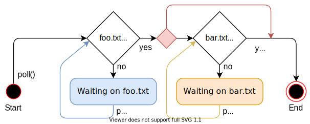

本文研究 *合作式多任务* 和 Rust 的 _async/await_。我们将会仔细了解 Rust 的 async/await 的工作原理，包括 `Future` trait 的设计，状态机转换和 *pinning*。然后创建异步的键盘任务和一个基础的执行器，从而为内核添加 async/await 的基本支持。

<!-- more -->

这文章开源在 [Github] 上。如果你有任何问题或疑问的话，请在那里打开一个 issue。这篇文章的完整源代码参见 @TODO（补充地址）。

## 多任务

多任务 是多数操作系统的基本功能之一，是一种并发执行多个任务的能力。例如，你先在阅读这篇文章的时候可能也打开了其他程序，例如一个文本编辑器或终端窗口。即使只打开了一个浏览器窗口，后台很可能有多个任务管理你的桌面窗口，检查更新或者索引文件等。


虽然看起来所有任务都在并发运行，但是 CPU 内核每次只能执行一个任务。为了创造多个任务并发运行的假象，操作系统快速地切换活跃的任务，使得每个都能小步往前。由于计算机非常快速，我们大多数时间不会注意到这些切换。

虽然单核 CPU 每次只能执行单个任务，但是多核 CPU 可以真正并行地运行多个任务。例如，8 核的 CPU 可以同时运行 8 个任务。后续文章会讲解如何搭建多核 CPU。为了简单起见，本文将会专注于单核 CPU。（值得注意的是所有多核 CPU 都是从一个单个活跃内核启动的，所以我们可以暂且把它们看作单核 CPU。）

多任务有两种形式：*合作式* 多任务要求任务定期放弃 CPU 的控制权，使得其他任务能够进行。*抢占式* 多任务使用操作系统的功能来强制停止进程从而在任意时间点切换线程。后续部分将会更加细致地探究两种多任务形式，并讨论它们各自的优缺点。

### 抢占式多任务

抢占式多任务的思想是操作系统控制切换任务的时机。为此，它的实现基于这样的事实--操作系统在每次中断时都能重获 CPU 的控制权。这使得么每次系统有新输入时，切换任务变得可能。例如，鼠标移动或者网络包达到时切换任务。通过设置硬件计时器在指定时候后发送中断，操作系统能够决定任务允许运行的确切时间。

下图描述了硬件中断时的任务切换流程：


第一行，CPU 正在执行程序 `A` 的任务 `A1`。其他所有任务都被暂停了。第二行，硬件中断到达 CPU。如 [*硬件中断*][_Hardware Interrupts_] 文章描述的那样，CPU 立即停止执行任务 `A1`，并跳转到中断描述符表（IDT）定义的中断处理函数。通过这个中断处理函数，操作系统现在重新获得了 CPU 的控制权，从而允许切换到任务 `B1` 而不是继续执行任务 `A1`。


#### 状态保存

由于任务会在任意时间点被中断，它们那时可能在某个计算的中间。为了能够后续还原它们，操作系统必须备份任务的全部状态，包括 [调用栈][call stack] 和所有 CPU 寄存器的值。这个过程称为 [*上下文切换*][_context switch_]。


由于调用栈会非常大，操作系统通常会为每个任务配置独立的栈空间，而不是每次任务切换时备份所有栈的内核。这个拥有独立栈空间的任务称为 [*执行的线程*][_thread of execution_] 或者简称 *线程*。为每个任务使用独立的栈空间，只有寄存器的内容需要在上下文切换时保存（包括程序计数器和栈指针）。这个方法最小化了上下文切换的性能损耗。因为上下文切换通常每秒回触发 100 多次，所以这点是非常重要的。


#### 讨论

抢占式多任务的主要优点时操作系统能够完全控制任务允许的执行时间。这样，他能保证每个任务公平地得到 CPU 时间，不需要相信任务会合作。这点对于运行第三方任务或者多用户共享一个系统尤其重要。

抢占的缺点是每个任务都需要自己的栈空间。和共享栈相比，这会使得每个任务占用更多内存，通常会限制整个系统的任务个数。另一个缺点是即使任务只是用了少数的寄存器，操作系统在每次任务切换时总得保存完整的 CPU 寄存器状态。

抢占式多任务和线程时操作系统的核心组件，它们使得运行不可信的用户空间程序成为可能。后续文章会完整地讨论到这些概念。然而本文会聚焦于合作式多任务，它也会为我们的内核提供有用的能力。

### 合作式多任务

合作式多任务让每个任务一直运行直至它资源放弃 CPU 的控制权，而不是在任意时间点暂停正在运行的任务。这使得任何可以在合适的时间点暂停，例如它需要等待 I/O 操作。

合作式多任务通常是编程语言级别使用，例如以 [协程][coroutines] 或 [async/await] 的形式。思想是程序猿或者编译器在程序中插入 [_yield_] 操作，这个操作会放弃 CPU 的控制权，允许其他任务运行。例如，yield 可以插入到一个复杂循环的每轮迭代末尾。


合作式多任务常常和 [异步操作][asynchronous operations] 结合使用。与其等待直至操作结束并阻止其他在期间运行，异步操作会在操作没有完成时返回一个 "not ready" 状态。这种情况下，等待的任务可以执行一个 yield 操作让其他任务得以运行。


#### 保存状态

由于任务自己定义暂停点，它们不需要操作系统为他们保存状态。而且，他们可以在暂停之前保存继续执行需要的确切状态，这样通常能够实现更好的性能。例如，由于再也不需要保存中间结果，一个刚完成复杂计算的任务只需要备份计算的最后结果即可。

编程语言级别的合作式任务实现经常甚至能够在暂停之前备份好调用栈需要的部分。例如，Rust 的 async/await 把所有仍然需要的局部变量保存到一个自动生成的结构体（往下看）。暂停之前备份好调用栈的相关部分，任务可以共享一个单一的调用栈，这样一来每个任务占用的内存要小很多。这样做使得创建几乎任意数目的合作式任务而不会触发内存溢出成为可能。

#### 讨论

合作式多任务的缺点是不合作的任务可能会持续运行任意长的时间。因此，恶意或有 bug 的任务可以阻止其他任务的运行，减慢甚至堵塞整个系统。所以只有当所有任务都配合的情况下，才采用合作式多任务。举个反例，让操作系统依赖任意用户程序就不是一个好主意。

然而，合作式多任务的强劲性能和内存优势让其成为程序 *内部* 使用的好工具，尤其是和异步操作结合使用。由于操作系统内核是和异步硬件交互的、性能要求贼高的程序，合作式多任务看起来像是一个实现并发的好方法。

## Rust 的 Async/Await

Rust 语言以 async/await 的形式为合作式任务提供了一级的支持。开始探索什么是 async/await 和它们的工作原理之前，我们需要理解 Rust 里面的 _futures_ 和异步编程的工作原理。

### 特性

_future_ 代表一个可能尚未可用的值。例如可以是其他任务计算的一个整数或者从网络下载的文件。与其一直等待直到值可用，future 使得继续执行直到值需要为止成为可能。

#### 例子

future 的概念用一个小例子形容最为形象：


时序图显示 `main` 函数从文件系统读取一个文件，然后调用函数 `foo`。同样的流程重复两次：一次调用同步的 `read_file`，一次调用异步的 `async_read_file`。

使用同步调用，`main` 函数需要一直等待直至文件从文件系统加载完毕。只有那之后，它才可以调用 `foo` 函数，再次要求其等待结果。

异步调用 `async_read_file` 时，文件系统直接返回一个 future，在后台异步地加载文件。这允许 `main` 函数更早地调用 `foo`，然后这个 `foo` 会和文件加载并发执行。在这个例子里面，文件加载甚至在 `foo` 返回前结束，所以 `main` 可以直接处理文件而不需要等待 `foo` 返回。 

#### Rust 的 Futures

Rust 的 futures 用 [`Future`] trait 表示，结构如下：


```rust
pub trait Future {
    type Output;
    fn poll(self: Pin<&mut Self>, cx: &mut Context) -> Poll<Self::Output>;
}
```

[关联类型][associated type] `Output` 注明异步值得类型。例如，上图的 `async_read_file` 函数会返回一个 `Output` 设置为 `File` 的 `Future` 实例。


[`poll`] 方法可以用于检查值是否已经可用。它返回一个如下形式的 [`Poll`] 枚举值：


```rust
pub enum Poll<T> {
    Ready(T),
    Pending,
}
```

值已经可用后（例如，文件已经完全从磁盘加载），它会返回一个包装在 `Ready` 里面的枚举值。否则，返回的是枚举值 `Pending`，提示调用者需要的值尚未可用。

`poll` 方法接收两个参数：`self: Pin<&mut Self>` 和 `cx: &mut Context`。前者和常规的 `&mut self` 引用行为类似，只是 `Self` 值被 [_pinned_] 到内存位置。没有理解 async/await 的工作原理之前，参透 `Pin` 及其必要性比较困难。因此我们会稍后再解释它。


`cx: &mut Context` 参数的用途是为异步任务传递一个 [`Waker`] 实例，例如文件系统加载。这个 `Waker` 允许异步任务通告它（或它的一部分）已经完成，例如文件已经从磁盘加载。由于主任务直到 `Future` 完毕时自己会被通知，所以它不需要不断地调用 `poll`。后续实现我们自己的 waker 类型时，我们将会更加细致地讲解这个过程。


### 使用 Futures

我们现在知道了 future 的定义以及 TODO 方法背后的基本思想。然而，我们仍然不知道如何有效地使用 futures。问题在于 futures 表示尚未可用的异步任务结果。然而实践中我们通常直接需要这个值用于进一步计算。所以问题来了：我们得如何在需要的时候高效地拿到 future 的值呢？

#### 等待 Futures

一个可能得方式是等待直至 future 完成。相关代码如下：

```rust
let future = async_read_file("foo.txt");
let file_content = loop {
    match future.poll(…) {
        Poll::Ready(value) => break value,
        Poll::Pending => {}, // do nothing
    }
}
```

这里我们在循环里面不断调用 `poll` 来 *积极* 地等待 future。`poll` 的参数不重要，所以我们忽略了它。虽然这个方式可以运行，但是因为我们等待值可用期间一直保持 CPU 繁忙，所以是非常低效的。

一个更加有效的方式是 *阻塞* 当前线程直至 future 变得可用。当然只有能用到线程时这个方法才是可能的，所以这个方法不适用于我们的内核，至少现在不行。即使在支持阻塞的系统上，这通常也是不好的，因为它再次把异步任务转化成了同步任务，从而屏蔽了所有并行任务带来的性能提升。

#### Future 组合器

等待的一种可选方式是使用 future 组合器。future 组合器是类似 `map` 的方法，允许串联和组合 future 到一起，和 [`Iterator`] 的方法类似。这些组合器返回一个 future，对 `poll` 应用映射操作，而不是一直等待 future。


举个例子，一个将 `Future<Output = String>` 转化为 `Future<Output = usize>` 简单的 `string_len`  组合器代码如下：

```rust
struct StringLen<F> {
    inner_future: F,
}

impl<F> Future for StringLen<F> where F: Future<Output = String> {
    type Output = usize;

    fn poll(mut self: Pin<&mut Self>, cx: &mut Context<'_>) -> Poll<T> {
        match self.inner_future.poll(cx) {
            Poll::Ready(s) => Poll::Ready(s.len()),
            Poll::Pending => Poll::Pending,
        }
    }
}

fn string_len(string: impl Future<Output = String>)
    -> impl Future<Output = usize>
{
    StringLen {
        inner_future: string,
    }
}

// Usage
fn file_len() -> impl Future<Output = usize> {
    let file_content_future = async_read_file("foo.txt");
    string_len(file_content_future)
}
```

因为 [_pinning_] 问题尚未处理，这份代码还跑不通，但是作为例子够用了。基本思想是 `string_len` 函数把一个给定的 `Future` 实例包装到一个新的 `StringLen` 结构体，这个结构体也实现了 `Future`。当被包装的 future 被轮询时，它会轮询内部的 future。如果值尚未可用，被包装的 future 也会返回 `Poll::Pending`。如果值可用了，字符串会从 `Poll::Ready` 枚举值中抽离出来，计算其长度。然后，再次被包装到 `Poll::Ready` 并返回。


借助这个 `string_len` 函数，我们能够计算异步字符串的长度而不需要等待它可用。由于函数再次返回一个 `Future`，调用者无法直接使用返回值，而是需要再次使用组合起函数。这样，整个调用图就会变成异步形式，我们可以一次性地等到多个 future，例如在 main 函数里面。

手码组合起函数比较困难，因此它们通常由库提供支持。虽然 Rust 的标准库自身尚未提供任何组合器方法，半官方的（也 `no_std` 兼容）的 [`futures`] 包提供了。它的 [`FutureExt`] trait 提供诸如 [`map`] 或 [`then`] 之类的高级组合器方法，可用于调用任意闭包操作结果。


##### 优势

future 组合器的大优势时保持操作的异步性。和异步 I/O 接口组合到一起，这个方法可以实现非常高的性能。future 组合器实现为满足 trait 的常规结构体的事实允许编译其对其大范围地优化。更多详情参见 [_Zero-cost futures in Rust_] 博文，这篇文章宣告 future 加入到 Rust 的生态。

##### 缺点

虽然 future 组合器使得编写非常高效的代码成为可能，但是因为类型系统和闭包驱动的接口，他们在某些情况下非常难用。例如以下代码：

```rust
fn example(min_len: usize) -> impl Future<Output = String> {
    async_read_file("foo.txt").then(move |content| {
        if content.len() < min_len {
            Either::Left(async_read_file("bar.txt").map(|s| content + &s))
        } else {
            Either::Right(future::ready(content))
        }
    })
}
```

([在 playground 上小试身手](https://play.rust-lang.org/?version=stable&mode=debug&edition=2018&gist=91fc09024eecb2448a85a7ef6a97b8d8))

这里我们读取文件 `foo.txt`，然后使用 [`then`] 组合器串联基于文件内容的另一个 future。如果内容长度小于给定的 `min_len`，我们读取另一个 `bar.txt` 文件，借助 [`map`] 组合器把它拼接到 `content`。否则我们只返回 `foo.txt` 的内容。

我们需要为传给 `then` 的闭包使用 [`move` 关键字][`move` keyword]，否则 `min_len` 会触发生命期错误问题。[`Either`] 包装器之所以需要是因为 if 和 else 代码块必须总是返回相同类型。由于代码块返回不同的 future 类型，我们必须使用包装器把他们统一到单一类型。[`ready`] 函数把一个值包装成值立即可用的 future。因为 `Either` 包装器期望被包装的值实现 `Future`，这个函数也是必要的。


可以想到，更大的项目很快就会把这写成非常复杂的代码。如果涉及借用和不同的生命期，它会变得尤其复杂。因此，很多工作投入到了将 async/await 添加到 Rust，期望能够让异步代码的编写变得异常简单。

### Async/Await 模式

async/await 背后的思想是让程序猿编写的代码 *看起来* 像常规同步代码，但是编译器将其转化成异步代码。具体实现依赖 `async` 和 `await` 这两个关键字。`async` 关键字可以用在函数签名上，将一个同步函数转化成返回 future 的异步函数：

```rust
async fn foo() -> u32 {
    0
}

// the above is roughly translated by the compiler to:
fn foo() -> impl Future<Output = u32> {
    future::ready(0)
}
```

只有这个关键字的话用处不大。然而，在 `async` 函数内部，`await` 关键能够用于获取 future 的异步值：

```rust
async fn example(min_len: usize) -> String {
    let content = async_read_file("foo.txt").await;
    if content.len() < min_len {
        content + &async_read_file("bar.txt").await
    } else {
        content
    }
}
```

([在 playground 上小试身手](https://play.rust-lang.org/?version=stable&mode=debug&edition=2018&gist=d93c28509a1c67661f31ff820281d434))

这个函数是 [前面](#drawbacks) 使用组合器函数的 `example` 函数的直接翻版。使用 `.await` 运算符，我们不需要任何闭包或者 `Either` 类型就可以拿到 future 的值。结果，我们可以像写同步代码那样编写代码，只是 *写出的仍然是异步代码*。

#### 状态机转换

编译器内地里执行的操作是把 `async` 函数的函数体转化成一个 [*状态机*][_state machine_]，其中每个 `.await` 调用代表一个不同的状态。对于上述 `example` 函数，编译创建以下四个状态的状态机： 


每个状态代表函数的不同暂停点。_"Start"_ 和 _"End"_ 状态表示函数的开始和结束。_"Waiting on foo.txt"_ 状态代表函数当前正在等待第一个 `async_read_file` 的结果。类似的，_"Waiting on bar.txt"_ 状态代表函数等待第二个 `async_read_file` 结果的暂停点。

状态机通过把每个 `poll` 调用转化为一次状态转换的方式实现 `Future` trait：



上图使用箭头表示状态切换，菱形表示分叉。例如，如果 `foo.txt` 文件尚未可用，标记为 _"no"_ 的路径执行，状态变为 _"Waiting on foo.txt"_。否则，_"yes"_ 路径执行。没有标题的红色小菱形表示 `example` 函数的 `if content.len() < 100` 分支。

可以看懂第一个 `poll` 调用触发函数执行直至遇到一个尚未完成的 future。如果路径上的所有 future 都完成了，这个函数运行到 _"End"_ 状态，把结果包装在 `Poll::Ready` 中返回。否则，状态机进入等待状态，返回 `Poll::Pending`。下一次 `poll` 调用时，状态机再从上一个等待状态开始执行，重试上一次的操作。

#### 保存状态

为了能够从上一个等待状态继续执行，状态机必须内地里一直追踪当前状态。另外，它必须下一次调用 `poll` 时继续执行需要用到的所有变量。这是编译器大展身手的地方：由于直到到时需要用到的变量，它可以自动生成包含所需确切变量的结构体。

举个例子，编译器会为 `example` 函数生成以下形式的结构体：

```rust
// The `example` function again so that you don't have to scroll up
async fn example(min_len: usize) -> String {
    let content = async_read_file("foo.txt").await;
    if content.len() < min_len {
        content + &async_read_file("bar.txt").await
    } else {
        content
    }
}

// The compiler-generated state structs:

struct StartState {
    min_len: usize,
}

struct WaitingOnFooTxtState {
    min_len: usize,
    foo_txt_future: impl Future<Output = String>,
}

struct WaitingOnBarTxtState {
    content: String,
    bar_txt_future: impl Future<Output = String>,
}

struct EndState {}
```

在 "start" 和 _"Waiting on foo.txt"_ 状态，由于需要用于后续和 `content.len()` 比较，`min_len` 参数需要保存。_"Waiting on foo.txt"_ 状态另外需要保存一个 `foo_txt_future`，代表 `async_read_file` 调用返回的 future。状态机继续执行时需要再次轮询这个 future，所以它需要保存。

因为 `content` 变量需要拼接 `bar.txt` 加载的字符串，所以 _"Waiting on bar.txt"_ 状态包含这个变量。它也保存一个 `bar_txt_future`，表示正在加载的 `bar.txt`。因为在和 `content.len()` 比较后就没用了，结构体没有包含 `min_len` 变量。在 _"end"_ 状态，因为函数已经运行结束，所以不需要保存任何变量。

记住了这只是编译器能为这份样例代码生成的。结构体名称和字段布局是实现细节，可能有所不同。

#### 完整的状态机类型

虽然编译器的生成确切代码是实现细节，但是它有助于理解编译器为 `example` 函数生成的状态机代码 *可以* 长成什么样。我们已经定义表示不同状态的结构体，包含要求的变量。为了在它们的基础上创建一个状态机，我们需要把他们组合到一个 [`enum`] 里面：


```rust
enum ExampleStateMachine {
    Start(StartState),
    WaitingOnFooTxt(WaitingOnFooTxtState),
    WaitingOnBarTxt(WaitingOnBarTxtState),
    End(EndState),
}
```

我们为每个状态定义不同的枚举值，并把相应的状态结构体添加为枚举值的字段。为了实现状态转换，编译器基于 `example` 函数生成 `Future` trait 的一份实现：

```rust
impl Future for ExampleStateMachine {
    type Output = String; // return type of `example`

    fn poll(self: Pin<&mut Self>, cx: &mut Context) -> Poll<Self::Output> {
        loop {
            match self { // TODO: handle pinning
                ExampleStateMachine::Start(state) => {…}
                ExampleStateMachine::WaitingOnFooTxt(state) => {…}
                ExampleStateMachine::WaitingOnBarTxt(state) => {…}
                ExampleStateMachine::End(state) => {…}
            }
        }
    }
}
```

因为 `example` 函数的返回值类型是 `String`，future 的 `Output` 类型也是 `String`。为了实现 `poll` 函数，我们在一个 `loop` 里面对当前状态使用一个 match 语句。思想是一旦满足条件就切换到下一个状态，而无法继续时返回一个显式的 `return Poll::Pending`。

为了简洁起见，我们只显示简化的代码，没有处理 [pinning][_pinning_]、所有权和生命期等。所以这份和以下代码都应该看做伪代码，不要直接使用。当然，编译器生成的代码会正确处理好所有事，可能采用不同姿势而已。

为了保持引用代码的简短，我们分别展示每个 match 情况的代码。从 `Start` 状态说起：

```rust
ExampleStateMachine::Start(state) => {
    // from body of `example`
    let foo_txt_future = async_read_file("foo.txt");
    // `.await` operation
    let state = WaitingOnFooTxtState {
        min_len: state.min_len,
        foo_txt_future,
    };
    *self = ExampleStateMachine::WaitingOnFooTxt(state);
}
```

刚开始执行函数时，状态处于 `Start` 状态。这种情况下，我们执行 `example` 函数的所有代码直至第一个 `.await`。为了处理 `.await` 操作，我们把 `self` 状态机的状态更新为 `WaitingOnFooTxt`，其中涉及构建 `WaitingOnFooTxtState` 结构体：

由于 `match self {…}` 语句在一个循环内执行，下一步流程转到 `WaitingOnFooTxt` 情况：

```rust
ExampleStateMachine::WaitingOnFooTxt(state) => {
    match state.foo_txt_future.poll(cx) {
        Poll::Pending => return Poll::Pending,
        Poll::Ready(content) => {
            // from body of `example`
            if content.len() < state.min_len {
                let bar_txt_future = async_read_file("bar.txt");
                // `.await` operation
                let state = WaitingOnBarTxtState {
                    content,
                    bar_txt_future,
                };
                *self = ExampleStateMachine::WaitingOnBarTxt(state);
            } else {
                *self = ExampleStateMachine::End(EndState));
                return Poll::Ready(content);
            }
        }
    }
}
```

这种情况下，我么首先调用 `foo_txt_future` 的 `poll` 函数。如果它尚未执行完毕，我们退出循环，并返回 `Poll::Pending`。由于这种情况下 `self` 保持在 `WaitingOnFooTxt` 状态，状态机的下一个 `poll` 调用会进入同样的 match 分支，并重试轮询 `foo_txt_future`。

`foo_txt_future` 满足时，我们把结果赋值给 `content` 变量，继续执行 `example` 函数的代码：如果 `content.len()` 小于结构体保存的 `min_len`，会执行异步读取 `bar.txt` 的操作。我们再次把 `.await` 操作翻译为一个不同的状态转换，这次是 `WaitingOnBarTxt` 状态。由于我们正在循环内执行 `match`，执行会直接跳转到新状态的 match 分支，开始轮询 `bar_txt_future`。

如果进入 `else` 分支，没有出现其他 `.await` 操作。我们到了函数末尾，返回 `Poll::Ready` 包裹的 `content`。我们也把当前状态更新为 `End` 状态。

`WaitingOnBarTxt` 状态下执行的代码如下：

```rust
ExampleStateMachine::WaitingOnBarTxt(state) => {
    match state.bar_txt_future.poll(cx) {
        Poll::Pending => return Poll::Pending,
        Poll::Ready(bar_txt) => {
            *self = ExampleStateMachine::End(EndState));
            // from body of `example`
            return Poll::Ready(state.content + &bar_txt);
        }
    }
}
```

和 `WaitingOnFooTxt` 状态类似，我们先轮询 `bar_txt_future`。如果它仍然进行中，我们退出循环，返回 `Poll::Pending`。否则，我们执行 `example` 函数的最后一个操作：把 TODO 变量和 future 返回的结果拼接到一起。更新状态机状态为 `End`，然后返回 `Poll::Ready` 包裹的结果。

最后，`End` 状态的代码如下：

```rust
ExampleStateMachine::End(_) => {
    panic!("poll called after Poll::Ready was returned");
}
```

futures 变成 `Poll::Ready` 后，不应该再被轮询，因此已经处于 `End` 状态时还调用 `poll` 的话，会触发 panic。

我们现在知道 `Future` trait 的编译器生成代码和它的实现 *可能* 长什么样了。实践中，编译器生成代码的姿势不大一样。（如果感兴趣的话，当前实现基于 [_generators_]，但是这仅是个实现细节。）


最后一个待解之谜是 `example` 函数自身的生成代码。没有忘记的话，函数的头部如下：

```rust
async fn example(min_len: usize) -> String
```

由于完整的函数体已经实现为状态机，函数需要做的唯一一件事时初始化状态机并返回它。生成的代码可能如下：

```rust
fn example(min_len: usize) -> ExampleStateMachine {
    ExampleStateMachine::Start(StartState {
        min_len,
    })
}
```

由于先在显示返回一个实现 `Future` trait 的 `ExampleStateMachine` 类型，这个函数不再有 `async` 修饰符。和预期的那样，状态机的开始状态为 `Start`，相应的状态结构体用 `min_len` 参数初始化。

需要注意的是这个函数没有开始状态机的运行。这个 Rust 的future 的基本设计原则：它们在第一次轮询之前不会做任何事。

### Pinning

我们已经被 _pinning_ 搞了好几次了。先在终于是时候研究一下什么是 pinning 及其必要性了。

#### 自引用结构体

如前面解释的那样，状态机转换把每个暂停点的局部变量存储到一个结构体。对于像我们 `example` 函数一样的小样例，这是比较直观的，不会出现什么问题。但是，变量引用彼此的时候，处境就会变得更加难了。例如，考虑一下这么个函数：

```rust
async fn pin_example() -> i32 {
    let array = [1, 2, 3];
    let element = &array[2];
    async_write_file("foo.txt", element.to_string()).await;
    *element
}
```

这个函数创建内容为 `1`、`2` 和 `3` 的一个小 `array`。然后把数组的最后一个元素的引用保存到 `element` 变量。接下来，异步地把数值转化为字符串写入到 `foo.txt` 文件。最后返回 `element` 引用的数值。

由于函数使用单个 `await` 操作，所得状态机有三个状态：start、end 和 "waiting on write"。这个函数没有任何入参，所以 start 状态的结构体为空。和之前类似，因为函数会在 end 状态结束，所以 end 状态的结构体也为空。"waiting on write" 状态的结构体也更加有意思一点：

```rust
struct WaitingOnWriteState {
    array: [1, 2, 3],
    element: 0x1001c, // address of the last array element
}
```

因为返回值需要用到 `element`，而 `element` 引用 `array`，所以我们需要同时保存 `array` 和 `element` 变量。由于 `element` 是一个引用，它保存指向元素的一个 *指针*（即，一个内存地址）。这里使用 `0x1001c` 作为实例内存地址。真实情况下，这个地址需要是 `array` 字段的最后一个元素的地址，所以它取决于结构体在内存中的位置。因为他们用自己的另一个字段引用自身的其他字段，所以拥有这样内部指针得结构体称为 *自引用* 结构体。

#### 自引用结构体的问题

自引用结构体的内部指针会导致一个严重问题，查看其内存布局时即可明显看到：


`array` 字段的起始地址为 0x10014，`element` 字段的地址为 0x10020。因为最后一个数组元素保存在这个地址，所以 `element` 指向地址 0x1001c。目前看上去，一切安好。然而，当我们把这个结构体移动到一个不同内存地址时，问题就显现出来了：


我们移动了结构体，使得它的起始地址现在变成了 `0x10024`。当我们把这个结构体作为函数参数或者赋值给一个不同的栈变量时，就会出现这个情景。问题出在即使 `array` 的最后一个元素现在地址 `0x1001c`，但是 `element` 字段依然指向地址 `0x1002a`。因此，这个指针悬空了，下一次调用 `poll` 时会触发未定义行为。

#### 可能的解决方案

解决悬空指针问题有三种基本方法：
- **移动时更新指针**：思想是每次在内存移动结构体时，更新内部指针，这样指针移动后就会依然合法。不幸的是，这个方法会要求大幅修改 Rust，导致可能很大的性能损失。原因是某些运行时得追踪结构体的所有字段类型，在每次移动时检查一个指针是否需要更新
- **保存偏移量而不是自引用**：为了避免更新指针，编译器可以试图把自引用保存为相对结构体起始地址的偏移量。例如，因为被引用的数组元素距离结构体起始地址 8 个字节，所以上述 TODO 结构体的 TODO 字段可以值为 8 的 TODO 字段的形式保存。结构体移动时，由于偏移量保持不变，所以没有字段需要更新。

这个方法的问题是要求编译器监测处所有自引用。因为引用可能取决于用户输入，这在编译时不可能实现，所以我们再次需要一个运行时系统来分析引用，正确地创建状态结构体。这不仅会引入运行时损耗，还会阻止某些编译器优化，从而再次带来大的性能损失。

- **禁止移动结构体**：如上所见，悬空指针只会在内存移动结构体时出现。通过完全禁止移动自引用结构体，问题就可以解决了。这个方法的最大优势时可以在类型系统级别实现，不需要额外的运行时损耗。缺点是把处理可能得自引用结构体的负担放到了程序猿肩上

由于坚持 *零代价抽象* 的原则，即抽线不应该带来额外的运行时损失，Rust 觉得采用第三种方法。为此，[_pinning_] API 在 [RFC 2349] 被提了出来。后续部分，我们将会简要地过一下这个 API，并解释它是如何和 async/await 和 future 一起工作的。


#### 堆值

第一个观察到的现象是 [堆分配][heap allocated] 的值大部分时间都有了一个固定的内存地址。它们通过调用 `allocate` 创建，然后被例如 `Box<T>` 的指针引用。虽然移动指针类型是可能得，但是堆上的值会呆在同样的内存地址直至调用 `deallocate` 时被再次释放。


使用堆分配，我们可以尝试创建一个自引用结构体：

```rust
fn main() {
    let mut heap_value = Box::new(SelfReferential {
        self_ptr: 0 as *const _,
    });
    let ptr = &*heap_value as *const SelfReferential;
    heap_value.self_ptr = ptr;
    println!("heap value at: {:p}", heap_value);
    println!("internal reference: {:p}", heap_value.self_ptr);
}

struct SelfReferential {
    self_ptr: *const Self,
}
```

([在 playground 上小试身手][playground-self-ref])


我们创建一个名为 `SelfReferential` 的结构体，包含单个指针字段。首先，我们用一个空指针初始化这个结构体，然后调用 `Box::new` 在堆上为其分配内存。我们确定堆上分配结构体的内存地址，并将其保存在一个 `ptr` 变量中。最后，将 `ptr` 变量赋值给 `self_ptr` 使得结构体变成自引用。

在 [playground][playground-self-ref] 上运行这份代码时，可以看到堆值得地址和它的内部指针是相等的，这意味着 `self_ptr` 字段是一个合法的自引用。由于 `heap_value` 变量只是一个指针，移动它（例如，把它传给一个函数）不会改变结构体自身的地址，所以即使指针移动了，`self_ptr` 还会有效。 

然而，还是有办法破坏这个例子的：从 `Box<T>` 移出值或者替换它的值，

```rust
let stack_value = mem::replace(&mut *heap_value, SelfReferential {
    self_ptr: 0 as *const _,
});
println!("value at: {:p}", &stack_value);
println!("internal reference: {:p}", stack_value.self_ptr);
```

([在 playground 上小试身手](https://play.rust-lang.org/?version=stable&mode=debug&edition=2018&gist=e160ee8a64cba4cebc1c0473dcecb7c8))

这里调用 [`mem::replace`] 函数把堆分配的值替换为一个新的结构体实例。这允许我们把原先的 `heap_value` 移动到栈上，然而结构体的 `self_ptr` 字段现在变成了悬空指针，仍然指向旧的堆地址。当我们试图在 playground 运行这个例子的时候，可以看到打印的 _"value at:"_ 和 _"internal reference:"_ 行确实显示了不懂得指针。所以堆分配值不足以使得自引用安全。


触发上述破坏出现的核心缘由是 `Box<T>` 允许我们获得堆分配值的 `&mut T` 引用。这个 `&mut` 使得调用诸如 [`mem::replace`] 或 [`mem::swap`] 方法来覆盖堆分配值成为可能。为了解决这个问题，我们必须避免创建自引用结构体的 `&mut` 引用。


#### `Pin<Box<T>>` 和 `Unpin`

pinning API 解决的 `&mut T` 问题的方式是提供一个 [`Pin`] 包装器类型和一个 [`Unpin`] 标记 trait。这些类型背后的思想是把所有能够获得被 `Pin` 包装类型的 `&mut` 引用的所有源自 `Unpin` trait 的方法（例如，[`get_mut`][pin-get-mut] 或 [`deref_mut`][pin-deref-mut]）。`Unpin` trait 是一个 [_auto trait_]，会为所有类型实现除非显示的弃用。通过自引用结构体弃用 `Unpin`，这样就没有（安全的）方式能从 `Pin<Box<T>>` 类型获得一个 `&mut T`。这样一来，它们的内部引用就能确保一直有效。


作为示例，让我们更新上面的 `SelfReferential`，使其弃用 `Unpin`：

```rust
use core::marker::PhantomPinned;

struct SelfReferential {
    self_ptr: *const Self,
    _pin: PhantomPinned,
}
```

我们通过添加多一个类型为 [`PhantomPinned`] 的 `_pin` 字段实现弃用。这是个零大小的标记类型，唯一的用途是 *不* 要实现 `Unpin` trait。由于 [auto traits][_auto trait_] 的工作方式，一个非 `Unpin` 的字段足以使得整个结构体弃用 `Unpin`。


第二步是例子中的 `Box<SelfReferential>` 类型为 `Pin<Box<SelfReferential>>` 类型。最简单的方式是使用 [`Box::pin`] 函数而不是 [`Box::new`] 来创建堆分配的值。


```rust
let mut heap_value = Box::pin(SelfReferential {
    self_ptr: 0 as *const _,
    _pin: PhantomPinned,
});
```

除了把 `Box::new` 变为 `Box::pin`，我们还需要为结构体初始化函数添加新的 `_pin` 字段。由于 `PhantomPinned` 是零尺寸类型，我们只需要它的类型名即可初始化它。

现在 [试图运行调整后的例子]https://play.rust-lang.org/?version=stable&mode=debug&edition=2018&gist=961b0db194bbe851ff4d0ed08d3bd98a)，可以看到会编译失败：

In addition to changing `Box::new` to `Box::pin`, we also need to add the new `_pin` field in the struct initializer. Since `PhantomPinned` is a zero sized type, we only need its type name to initialize it.

```bash
error[E0594]: cannot assign to data in a dereference of `std::pin::Pin<std::boxed::Box<SelfReferential>>`
  --> src/main.rs:10:5
   |
10 |     heap_value.self_ptr = ptr;
   |     ^^^^^^^^^^^^^^^^^^^^^^^^^ cannot assign
   |
   = help: trait `DerefMut` is required to modify through a dereference, but it is not implemented for `std::pin::Pin<std::boxed::Box<SelfReferential>>`

error[E0596]: cannot borrow data in a dereference of `std::pin::Pin<std::boxed::Box<SelfReferential>>` as mutable
  --> src/main.rs:16:36
   |
16 |     let stack_value = mem::replace(&mut *heap_value, SelfReferential {
   |                                    ^^^^^^^^^^^^^^^^ cannot borrow as mutable
   |
   = help: trait `DerefMut` is required to modify through a dereference, but it is not implemented for `std::pin::Pin<std::boxed::Box<SelfReferential>>`
```

因为 `Pin<Box<SelfReferential>>` 类型不再实现 `DerefMut` trait，所以触发了上述错误。这正是我们想要的：因为 `DerefMut` trait 会返回我们想要禁止的 `&mut` 引用。这只会在我们同时弃用 `Unpin` 和把 `Box::new` 改为 `Box::pin` 后才会发生。

现在的问题变成了编译不仅能够阻止第 16 行的类型移动，还禁止了第 10 行 `self_ptr` 字段的初始化。这是因为编译无法区分合法和非法 `&mut` 引用的使用情况。为了让初始化能够再次工作，我们必须使用不安全的 [`get_unchecked_mut`] 方法： 


```rust
// safe because modifying a field doesn't move the whole struct
unsafe {
    let mut_ref = Pin::as_mut(&mut heap_value);
    Pin::get_unchecked_mut(mut_ref).self_ptr = ptr;
}
```

([在 playground 上小试身手](https://play.rust-lang.org/?version=stable&mode=debug&edition=2018&gist=b9ebbb11429d9d79b3f9fffe819e2018))

[`get_unchecked_mut`] 函数对 `Pin<&mut T>` 而不是 `Pin<Box<T>>` 有效，所以我们必须先使用 [`Pin::as_mut`] 转换值。然后借助 `get_unchecked_mut` 返回的 `&mut` 引用设置 `self_ptr` 字段。


现在剩下的唯一错误是 `mem::replace` 触发的预期错误了。这个操作试图把堆上的值移动到栈上，这会破坏自引用保存的 `self_ptr` 字段。通过主动弃用 `Unpin` 并使用 `Pin<Box<T>>`，我们可以在编译时阻止这个操作，从而安全地使用自引用结构体。可以看到编译器无法证明自引用的创建时合法的（到目前为止），所以我们需要使用一个 unsafe 代码块并自己检查正确性。

#### 栈 Pinning 和 `Pin<&mut T>`

上一节我们学会了如何使用 `Pin<Box<T>>` 来安全地创建一个堆分配的自引用值。虽然这个方法可以跑通且相对安全（除了不安全的构造函数），要求的堆分配是有性能损耗的。由于 Rust 总是想要尽可能地提供 *零代价抽象*，pinning API 也允许创建一个指向栈分配值的 `Pin<&mut T>` 实例。

和拥有被包装类型 *所有权* 的 `Pin<Box<T>>` 实例不同的是，`Pin<&mut T>` 实例只是临时借用被包裹的值。这让事情变得复杂，因为它要求程序猿提供额外的保证。最重要的是，`Pin<&mut T>` 必须在被引用的 `T` 的整个生命期内保持 pinned，这对于栈上的值来说优点难以验证。为了缓解这个问题，出现了诸如 [`pin-utils`] 这样的包，但是我依然不建议 pinning 到栈空间，除非我们非常清楚自己在干啥。


更多资料参见 [`pin` 模块][`pin` module] 的文档和 [`Pin::new_unchecked`] 方法。


#### Pinning 和 Futures

由前面可以看到，[`Future::poll`] 方法以 `Pin<&mut Self>` 参数的形式使用 pinning：

#### Pinning and Futures


```rust
fn poll(self: Pin<&mut Self>, cx: &mut Context) -> Poll<Self::Output>
```

这个方法接收 `self: Pin<&mut Self>` 而不是常规的 `&mut self` 原因是 [前面][self-ref-async-await]可以看到 async/await 创建的 future 实例通常是自引用的。把 `Self` 包装到 `Pin` 里面，让编译器为自引用的 futures 弃用 `Unpin`，这样就能保证 future 不会在调用 `poll` 时在内存里面移动。这确保所有内部引用依然有效。


值得注意的是在第一次调用 `poll` 之前移动 future 是没有问题的。这是因为 future 是懒加载的，在第一次被轮询前不会做任何事。因此，生成状态机的 `start` 状态只包含函数实参，但是没有内部引用。为了调用 `poll`，调用者必须先把 future 包装到 `Pin`，这样能确保 future 不能在内存间移动。由于栈 pinning 要写正确难度不小，个人建议总是结合使用 [`Box::pin`] 和 [`Pin::as_mut`]。 


如果感兴趣如何基于栈 pinning 安全地手码一个 future 组合器函数的话，可以看一下 `futures` 包精悍的 [`map` 组合器方法的源码][map-src] 和 pin 文档的关于 [投影和结构化 pinning][projections and structural pinning] 相关小节。


### 执行器和唤醒器

借助 async/await，以完全异步的形式高效地使用 futures 变为可能。然而，如前面学到的，futures 在被轮询之前不会做任何事情。这意味着我们总得在某个时间点调用它们的 `poll`，否则的话，异步的代码永远都不会执行。

只有一个 future 时，我们总能使用一个 [上面描述的](#waiting-on-futures) 循环人为地等待每个 future。但是，这个方法是非常低效且对于创建大量 future 的程序是不现实的。这个问题的最常见解决方法是定义过全局的 *执行器*，让它负责轮询系统的所有 future 直至完成。

#### 执行器

执行器的用途时允许把 future 创建为独立的任务，通常是借助 `spawn` 之类的方法。执行器负责轮询所有 future 直至它们完成。在中心化地方管理所有 future 最大好处是执行器可以在一个 future 返回 `Poll::Pending` 时切换到不同 future。因此，异步操作可以并发执行，CPU 也能一直保持繁忙。

很多执行器实现也利用了多核 CPU 的系统。它们创建一个 [线程池][thread pool]，这个线程池能够在有任务执行时利用所有核，并利用诸如 [work stealing] 等技巧来平衡不同核之间的载荷。嵌入式系统也有特殊的执行器实现，被优化到实现低时延和内存代价。

#### Executors


为了避免不断轮询 futures 的代价，执行器通常也会利用 Rust future 支持的 _waker_ API。

#### 唤醒器

waker API 背后的思想是每次调用 `poll` 时传入一个特殊的 [`Waker`] 类似，包装在 [`Context`] 类型中。这个 `Waker` 类型由执行器创建，被异步任务用于提示（局部）任务完毕。这样一来，执行器就不需要调用之前返回 `Poll::Pending` 的 future 的 `poll`，只需等待被相应的 waker 唤醒即可。


用个小例子解释起来最快：

```rust
async fn write_file() {
    async_write_file("foo.txt", "Hello").await;
}
```

这个函数异步地把字符串 "Hello" 写入 `foo.txt` 文件。由于硬盘写入需要一点时间，第一次调用这个 future 的 `poll` 很可能会返回 `Poll::Pending`。然而，硬盘驱动会内地里保存传给 `poll` 的 `Waker`，文件写入磁盘后用它通知执行器。这样在收到 waker 通知之前，执行器就不需要浪费任何时间来再次轮询 future 了。

后续在实小节创建支持 waker 的执行器时，我们会看到 `Waker` 类型的工作细节。

### 合作式多任务？

本文开头我们谈到抢占式和合作式多任务。抢占式多任务依赖操作系统来强制切换运行的任务，而合作式多任务则要求任务日常通过 _yield_ 操作自愿地放弃 CPU 的控制权。合作方式的最大好处是任务可以自己保存状态，从而实现更加高效的上下文切换和任务之间的栈空间的共享使用。

一眼看上去可能不是那么明显，但是 future 和 async/await 其实时合作式多任务模式的一种实现：

- 每个添加到执行器的 future 都是一个合作式任务
- 虽然没有使用显示的 yield 操作，但是 future 从通过返回 `Poll::Pending`（或者最后返回 `Poll::Ready`）的方式放弃 CPU 的控制权
  - 没有其他事情能强制 future 放弃 CPU。如果想要的话，它们可以永远都不从 `poll` 返回，例如在一个循环里面自旋自嗨
  - 由于执行器的每个 future 可以阻塞其他 future 的执行，我们需要想起这些 future 不是恶意的
- future 内地里会保存下次 `poll` 调用时继续执行所有需要的状态。借助 async/await，编译器自动检查所有需要的变量，把他们保存到一个生成的状态机里面
  - 继续执行只需要保存最少的要求状态
  - 由于 `poll` 返回时放弃调用栈，同样的栈可用于轮询其他 future

可以看到 future 和 async/await 和合作式多任务模式完美匹配，它们只是使用了一些不同的术语而已。往后部分，我们把任务和 future 看做一样的东西。

## 实现

理解基于 Rust 的 future 和 async/await 的合作式多任务之后，现在是时候把它添加到我们的内核中来了。由于 [`Future`] trait 是 `core` 库的一部分，async/await 是语言本身的一个特性，`#![no_std]` 的内核使用它们不需要执行特别的操作。仅有的要求是因为 async/await 在 `2020-03-25` 之前尚未兼容 `no_std`，所以需要至少 `2020-03-25` 之后的 Rust 版本。

使用足够新的 nightly 版 Rust，我们可以在 `main.rs` 中使用 async/await 了：

```rust
// in src/main.rs

async fn async_number() -> u32 {
    42
}

async fn example_task() {
    let number = async_number().await;
    println!("async number: {}", number);
}
```

`async_number` 函数是一个 `async fn`，所以编译器将其转换成实现 TODO 的状态机。由于函数只是返回 `42`，得到的 future 也就直接在第一次调用 `poll` 时返回 `Poll::Ready(42)`。和 `async_number` 类似，`example_task` 函数也是一个 `async fn`。它等待 `async_number` 返回的数值，然后调用 `println` 宏把它打印出来。

为了运行 `example_task` 返回的 future，我们需要调用它的 `poll` 直至它返回 `Poll::Ready` 提示任务完毕。为此，我们需要创建一个简单的执行器类型。

### 任务

开始实现执行器之前，我们创建一个有 `Task` 类型的 `task` 模块：

```rust
// in src/lib.rs

pub mod task;
```

```rust
// in src/task/mod.rs

use core::{future::Future, pin::Pin};
use alloc::boxed::Box;

pub struct Task {
    future: Pin<Box<dyn Future<Output = ()>>>,
}
```

`Task` 结构体时一个新类型包装器，包裹一个 pinned、堆上分配的且动态分发的、以 `()` 为输出的 future。让我们细看一下：

- 我们要求和任务关联的 future 返回 `()`。这意味着任务不会返回任何值，它们的执行只为副作用。例如，上面定义的 `example_task` 函数没有任何返回值，但是往屏幕打印一些东西作为副作用
- `dyn` 关键字表明我们在 `Box` 里面存储了一个 [_trait object_]。这意味着 future 上的方法会 [*动态分发*][_dynamically dispatched_]，这样就能把不同类型的 future 保存到 `Task` 类型里面。因为每个 `async fn` 都有自己的类型，我们想要创建不同的任务，所以这一点是非常重要的
- 如我们在 [关于 pinning][section about pinning] 节学到的那样，`Pin<Box>` 类型把值方法放到堆上，防止创建出其 `&mut` 引用，从而保证这个值无法在内存里面移动。因为 async/await 生成的 future 可能是自引用的，即包含指向自身的指针，future 移动会使得这些指针变得不合法


为了基于 future 创建一个新的 `Task` 结构体，我们新建一个 `new` 函数：

```rust
// in src/task/mod.rs

impl Task {
    pub fn new(future: impl Future<Output = ()> + 'static) -> Task {
        Task {
            future: Box::pin(future),
        }
    }
}
```

这个函数接收任何输出类型为 `()` 的 future，并借助 [`Box::pin`] 函数把它固定在内存里面。然后把打包的 future 包裹到 `Task` 结构体里面并返回。这里要求 `'static` 生命期是因为返回的 `Task` 可以存活任意长的时间，所以 future 也需要在这段时间内保持有效。

我们也添加一个 `poll` 方法使得执行器可以轮询存储的 future：

```rust
// in src/task/mod.rs

use core::task::{Context, Poll};

impl Task {
    fn poll(&mut self, context: &mut Context) -> Poll<()> {
        self.future.as_mut().poll(context)
    }
}
```

由于 `Future` trait 的 [`poll`] 方法其他以 `Pin<&mut T>` 类型调用，我们首先使用 [`Pin::as_mut`] 方法转换 `Pin<Box<T>>` 类型的 `self.future` 字段。然后，调用转换后 `self.future` 字段的 `poll`  方法，返回结果。由于 `Task::poll` 方法只会被我们后续创建的执行器调用，所以我们保持 `task` 模块的函数私有化。

### 简易执行器

由于执行可以非常复杂，我们特意先实现一个非常基础的执行，后续在实现一个功能更加强大的执行器。为此，我们首先创建一个 `task::simple_executor` 子模块：

```rust
// in src/task/mod.rs

pub mod simple_executor;
```

```rust
// in src/task/simple_executor.rs

use super::Task;
use alloc::collections::VecDeque;

pub struct SimpleExecutor {
    task_queue: VecDeque<Task>,
}

impl SimpleExecutor {
    pub fn new() -> SimpleExecutor {
        SimpleExecutor {
            task_queue: VecDeque::new(),
        }
    }

    pub fn spawn(&mut self, task: Task) {
        self.task_queue.push_back(task)
    }
}
```

这个结构体包含一个 [`VecDeque`] 类型的 `task_queue` 字段，这个 [`VecDeque`] 类型支持头尾的压入和弹出操作。这个类型背后的基本思想是我们借助 `spawn` 方法在尾部插入新人物，从头部弹出下一个要执行的任务。这样我们就会得到一个简单的 [FIFO 队列][FIFO queue] （*先进先出*）。


#### Dummy Waker

为了调用 `poll` 方法，我们需要创建一个 [`Context`] 类型用来包装 [`Waker`]  类型。简单起见，我们首先会创建一个什么都不做的无聊 waker。为此，我们创建一个 [`RawWaker`] 实例，定义不同 `Waker` 方法的实现，然后使用 [`Waker::from_raw`] 函数把它转化为一个 `Waker`：


```rust
// in src/task/simple_executor.rs

use core::task::{Waker, RawWaker};

fn dummy_raw_waker() -> RawWaker {
    todo!();
}

fn dummy_waker() -> Waker {
    unsafe { Waker::from_raw(dummy_raw_waker()) }
}
```

因为如果程序猿没有遵循 `RawWaker` 文档的要求会触发未定义行为，所以 `from_raw` 函数是不安全的。细看 `dummy_raw_waker` 函数的实现之前，我们首先尝试理解一下 `RawWaker` 类型是如何工作的。

##### `RawWaker`

[`RawWaker`] 类型要求程序猿显示地定义 [虚函数表][_virtual method table_] （*vtable*），注明 `RawWaker` 被复制、唤醒或者清除时应该调用的函数。这个 vtable 的布局由 [`RawWakerVTable`] 类型定义。每个函数接收一个 `*const ()` 参数，这个参数基本上是某个（例如堆上分配的）结构体 *类型擦除* 后的 `&self` 指针。因为 `RawWaker` 类型应该是非泛型的，但仍能支持任意类型，所以使用的 `*const ()` 指针而不是一个合适的引用类型。创建函数的指针是传给 [`RawWaker::new`] 的 `data` 指针。


通常 `RawWaker` 是为包装为 [`Box`] 或 [`Arc`] 类型的堆分配的某些结构体创建的。对于这些类型，例如 [`Box::into_raw`] 的方法可用于把 `Box<T>` 转化为一个 `*const T` 指针。这个指针然后可以转换为一个匿名的 `*const ()` 指针，传给 `RawWaker::new`。由于每个 vtable 函数都接收同样的 `*const ()` 作为参数，所以这些函数可以安全地转换回一个 `Box<T>` 或 `&T`，然后对其执行操作。可以想到，这个过程是高度危险的，很容易不经意间就会导致未定义行为。因此，除非逼不得已，否则非常不建议手动创建 `RawWaker`。


##### 一个无聊的 `RawWaker`

虽然不推荐手动创建 `RawWaker`，现在没有其他方法可以创建一个什么都不做的无聊的 `Waker`。好在，我们没想做什么事，所以实现 `dummy_raw_waker` 函数是相对安全的：

```rust
// in src/task/simple_executor.rs

use core::task::RawWakerVTable;

fn dummy_raw_waker() -> RawWaker {
    fn no_op(_: *const ()) {}
    fn clone(_: *const ()) -> RawWaker {
        dummy_raw_waker()
    }

    let vtable = &RawWakerVTable::new(clone, no_op, no_op, no_op);
    RawWaker::new(0 as *const (), vtable)
}
```

首先，我们定义两个名为 `no_op` 和 `clone` 的内部函数。`no_op` 函数接收一个 `*const ()` 指针，没有做任何事。`clone` 函数也接收一个 `*const ()` 指针，调用 `dummy_raw_waker` 返回一个新的 `RawWaker`。我们使用这两个函数创建一个最小化的 `RawWakerVTable`：`clone` 函数在执行克隆操作时使用，`no_op` 函数用作其他所有操作。由于 `RawWaker` 没有做什么事，所以没有克隆 `RawWaker` 而不在 `clone` 里面返回一个新的 `RawWaker` 问题也不大。

创建 `vtable` 之后，我们使用 [`RawWaker::new`] 函数创建 `RawWaker`。因为没有 vtable 函数使用它们，所以传入的 `*const ()` 不重要。因此，我们只要单纯传入一个空指针即可。

#### 一个 `run` 方法

现在有了创建 `Waker` 实例的方法，我们可以用它为执行器实现一个 `run` 方法。最简单的 `run` 方法是在循环里面不断地轮询所有队列中的任务直到所有任务完成。因为没有利用 `Waker` 类型的提醒功能，所以这种方式不是非常高效，但是这是把东西跑起来最简单的方式：

```rust
// in src/task/simple_executor.rs

use core::task::{Context, Poll};

impl SimpleExecutor {
    pub fn run(&mut self) {
        while let Some(mut task) = self.task_queue.pop_front() {
            let waker = dummy_waker();
            let mut context = Context::from_waker(&waker);
            match task.poll(&mut context) {
                Poll::Ready(()) => {} // task done
                Poll::Pending => self.task_queue.push_back(task),
            }
        }
    }
}
```

这个函数使用一个 `while let` 循环处理 `task_queue` 里的所有任务。对于每个任务，它首先创建一个包裹 `dummy_waker` 函数返回的 `Waker` 实例的 `Context` 类型。然后以这个 `context` 调用 `Task::poll` 方法。如果 `poll` 方法返回 `Poll::Ready`，这个任务就完成了，我们继续执行下一个任务即可。如果任务仍然是 `Poll::Pending`，我们把它再次添加到队列末尾使得它能够在后续循环迭代中再次被轮询。

#### 尝试一下

借助 `SimpleExecutor` 类型，我们现在可以在 `main.rs` 里面尝试运行 `example_task` 函数返回的任务了。

```rust
// in src/main.rs

use blog_os::task::{Task, simple_executor::SimpleExecutor};

fn kernel_main(boot_info: &'static BootInfo) -> ! {
    // […] initialization routines, including `init_heap`

    let mut executor = SimpleExecutor::new();
    executor.spawn(Task::new(example_task()));
    executor.run();

    // […] test_main, "it did not crash" message, hlt_loop
}


// Below is the example_task function again so that you don't have to scroll up

async fn async_number() -> u32 {
    42
}

async fn example_task() {
    let number = async_number().await;
    println!("async number: {}", number);
}
```

运行后，可以看到屏幕打印出预期的 _"async number: 42"_ 信息：


让我们小结一下这个例子涉及的多个步骤：
- 首先，我们用一个空的 `task_queue` 创建 `SimpleExecutor` 类型的实例
- 然后，调用异步的 `example_task` 函数，得到一个 future。我们把这个 future 包装到 `Task` 类型里面，包装过程会把 future 移到堆上比固定它，然后调用 `spawn` 方法把任务添加到执行器的 `task_queue`
- 接下来调用 `run` 方法开始执行队列中单个任务的执行。这会涉及
  - 从 `task_queue` 头部弹出任务
  - 为任务创建一个 `RawWaker`，转化为 [`Waker`] 实例，然后基于它创建一个 [`Context`] 实例
  - 以刚才创建的 `Context` 调用任务 future 的 [`poll`] 方法
  - 由于 `example_task` 没有等待任何事，它会在第一次调用 `poll` 时直接结束。这时 _"async number: 42"_ 行打印出来
  - 由于 `example_task` 直接返回 `Poll::Ready`，它不会再放回任务队列
- `run` 方法在 `task_queue` 变空之后返回。`kernel_main` 函数继续执行，打印出 _"It did not crash!"_ 消息

### 异步键盘输入

我们的简易执行器没有利用 `Waker` 的提醒功能，只是简单地遍历所有任务直至任务完毕。由于 `example_task` 可以在第一次 `poll` 调用时直接跑完，所以在这里还不是个问题。为了看一下合适 `Waker` 实现的性能优势，我们首先需要创建一个真正异步的任务，即很可能在第一次调用 `poll` 时返回 `Poll::Pending` 的任务。 

我们的系统已经存在了一定程度的异步性，可用于验证这个功能：硬件中断。在 [中断][_Interrupts_] 那篇文章我们学到，硬件中断可以出现在任意时间点，由外部设备决定。例如，硬件时钟会在某个预订的时间后给 CPU 发送一个中断。当 CPU 接收到这个中断时，它会立即把控制权转交给中断描述符表（IDT）预定义的相应处理函数。


往下部分，我们将会创建基于键盘中断创建一个异步任务。键盘中断既具有不确定性也要求超低延时，所以是一个非常好的候选。不确定性意味着因为完全取决于用户，所以没有途径能够预测下一次按键的时间。低延时意味着我们想要准时地处理键盘输入，否则用户会看到一个延时。为了高效地支持这个任务，执行器支持合理的 `Waker` 提醒功能就非常必要了。

#### 扫描码队列

当前，我们直接在中断处理函数俩米直接处理键盘输入。长期来说这不是个好主意，因为中断处理函数可能会中断重要的工作，他们应该保持短小。中断处理函数应该只执行最少必要的工作（例如，读取键盘扫描码），而把剩下的工作（例如翻译扫描码）下放给后台任务。

给后台任务分发工作的常见模式时创建某种队列。中断处理函数把工作单元添加到队列，后台进程处理队列的中国。应用到我们的键盘中断，这意味着中断处理函数只读取键盘输入的扫描码，把它添加到队列，然后返回。键盘任务在队列的另一端，翻译并处理传过来的每个扫描码：


那个队列的简单实现可以是一个 mutex 加持的 [`VecDeque`]。然而，因为很容易会导致死锁，所以在中断处理函数里面使用 mutex 不是个好主意。例如，当键盘任务已经锁住队列时用户按下键盘，中断处理函数会试图再次获得锁而一直卡住。这种方法的另一个问题是 `VecDeque` 容量满时会自动扩容，触发新的堆内内存分配。因为我们的分配器内部也使用了 mutex，所以这也会再次导致死锁。还有问题是堆碎片化后堆内存分配可能会失败或者耗费大量时间。

为了防止这个问题，我们需要一个 `push` 操作时不要求 mutex 或内存分配的队列实现。这样的队列可以借助无锁的 [原子操作] 来添加或者弹出元素。这样就可能创建只要求 `&self` 引用的 `push` 和 `pop` 操作，从而可以没有 mutex 也可以使用。为了防止 TODO 时的内存分配，队列可以采用一个预分配的、固定大小的缓冲区。虽然这会使得队列 *有界*（即，有最大长度），但是实践中为队列长度定义合理的上界通常是可能的，所以这不是个大问题。


##### `crossbeam` 包

正确且高效地实现这么个队列是非常困难的，所以个人建议使用现有的、测试全面的实现。[`crossbeam`] 正是这样实现多种无 mutex 并发编程的 Rust 项目之一。它提供名为 [`ArrayQueue`] 的类型正是我们当前场景需要的。而且我们非常幸运：这个类型借助分配支持能够兼容 `no_std` 包。


为了使用这个类型，我们添加对 `crossbeam-queue` 的依赖：

```toml
# in Cargo.toml

[dependencies.crossbeam-queue]
version = "0.2.1"
default-features = false
features = ["alloc"]
```

默认情况下，这个包依赖标准库。为了兼容 `no_std`，我们需要禁用其默认特性，并开启 `alloc` 特性。<span class="gray">（需要注意的是依赖主 `crossbeam` 包行不通，因为它缺失 `no_std` 需要的 `queue` 模块。博主本人已经提交了一个 [pull request][crossbeam PR#480] 处理这个问题，但是尚未发布到 crates.io）</span>


##### 队列实现

借助 `ArrayQueue` 类型，我们现在可以在新的 `task::keyboard` 模块创建一个全局的扫描码队列：

```rust
// in src/task/mod.rs

pub mod keyboard;
```

```rust
// in src/task/keyboard.rs

use conquer_once::spin::OnceCell;
use crossbeam_queue::ArrayQueue;

static SCANCODE_QUEUE: OnceCell<ArrayQueue<u8>> = OnceCell::uninit();
```

由于 [`ArrayQueue::new`] 执行的堆内存分配在编译时是不可能的（[至少目前为止][const-heap-alloc]），我们无法直接初始化这个静态变量。而是使用了 [`conquer_once`] 包的 [`OnceCell`] 类型，这个类型使得安全地一次性初始化静态变量的变为可能。为了包含这个包，我们在 `Cargo.toml` 中将其添加为依赖：


```toml
# in Cargo.toml

[dependencies.conquer-once]
version = "0.2.0"
default-features = false
```

这里我们也可以用 [`lazy_static`] 宏替换 [`OnceCell`] 基本类型。然而，`OnceCell` 类型的好处在于我们可以保证初始化不会发生在中断处理函数里面，从而防止中断处理函数执行堆内存分配。


#### 填充队列

为了填充扫描码队列，我们创建一个新的 `add_scancode` 函数，这个函数会被中断处理函数调用：

```rust
// in src/task/keyboard.rs

use crate::println;

/// Called by the keyboard interrupt handler
///
/// Must not block or allocate.
pub(crate) fn add_scancode(scancode: u8) {
    if let Ok(queue) = SCANCODE_QUEUE.try_get() {
        if let Err(_) = queue.push(scancode) {
            println!("WARNING: scancode queue full; dropping keyboard input");
        }
    } else {
        println!("WARNING: scancode queue uninitialized");
    }
}
```

我们使用 [`OnceCell::try_get`] 获得初始化队列的引用。如果队列尚未初始化，我们忽略键盘扫描码，并打印一个警告。重要的是因为这个函数会被不应该执行堆内存分配的中断处理函数调用，我们没有试图在这个函数里面初始化队列。由于这个函数不应该被 `main.rs` 调用，所以我们使用 `pub(crate)` 可见度属性限制其只在 `lib.rs` 内可用。


[`ArrayQueue::push`] 方法只要求 `&self` 引用使得调用静态队列的方法变得非常简单。`ArrayQueue` 类型自己会执行所有必须的同步操作，所以我们不需要 mutex 包装器。如果队列满了，我们也打印一个警告。


为了在键盘中断时调用 `add_scancode` 函数，`interrupts` 模块的 `keyboard_interrupt_handler` 函数更新如下：

```rust
// in src/interrupts.rs

extern "x86-interrupt" fn keyboard_interrupt_handler(
    _stack_frame: &mut InterruptStackFrame
) {
    use x86_64::instructions::port::Port;

    let mut port = Port::new(0x60);
    let scancode: u8 = unsafe { port.read() };
    crate::task::keyboard::add_scancode(scancode); // new

    unsafe {
        PICS.lock()
            .notify_end_of_interrupt(InterruptIndex::Keyboard.as_u8());
    }
}
```

我们从这个函数移除了所有键盘的处理代码，还添加了对 `add_scancode` 函数的调用。函数的的剩余部分和之前一样。

和预期的那样，现在运行 `cargo run` 不会再看到按键打印到屏幕。而会在每次按键时看到扫描码队列未初始化的讲稿。

#### 扫描码流

为了初始化 `SCANCODE_QUEUE`，并从队列异步地读取扫描码，我们创建一个新的 `ScancodeStream` 类型：

```rust
// in src/task/keyboard.rs

pub struct ScancodeStream {
    _private: (),
}

impl ScancodeStream {
    pub fn new() -> Self {
        SCANCODE_QUEUE.try_init_once(|| ArrayQueue::new(100))
            .expect("ScancodeStream::new should only be called once");
        ScancodeStream { _private: () }
    }
}
```

`_private` 字段的用途时防止模块外部构造这个结构体。这使得 `new` 函数成为构造这个类型的唯一方法。在函数里面，我们首先尝试初始化 `SCANCODE_QUEUE` 静态变量。如果队列已经初始化，触发 panic，从而确保只会创建一个 `ScancodeStream` 实例。

为了异步任务能够用上扫描码，下一步时实现类似 `poll` 的方法，尝试每次从队列中弹出下一个扫描码。虽然这听起来像是我们应该为我们的类型实现 [`Future`] trait，但是这并不完全对。问题在于 `Future` trait 只对单个异步值进行了抽象，并期望返回 `Poll::Ready` 后不再调用 `poll` 方法。我们的扫描码队列则包含多个异步值，所以一直轮询它是没问题的。 

##### `Stream` trait

由于产出多个异步值的类型是常见的，所以 [`futures`] 包为这种类型提供了有用的抽线：[`Stream`] trait。这个 trait 的定义如下：


```rust
pub trait Stream {
    type Item;

    fn poll_next(self: Pin<&mut Self>, cx: &mut Context)
        -> Poll<Option<Self::Item>>;
}
```

这个定义个 [`Future`] trait 非常类似，但是有以下不同点：
- 关联类型为 `Item` 而不是 `Output`
- `Stream` trait 定义 `poll_next` 方法返回 `Poll<Option<Self::Item>>` 类型（注意额外的 `Option`），而不是 `poll` 方法返回 `Poll<Self::Item>`

这里有个语义上的区别：`poll_next` 可以被反复调用，直至返回提示 stream 已经变空的 `Poll::Ready(None)`。从这种意义上讲，这和 [`Iterator::next`] 方法类似，它也会在最后一个值之后返回 `None`。


##### 实现 `Stream`

让我们为 `ScancodeStream` 实现 `Stream` trait，从而异步地提供 `SCANCODE_QUEUE` 队列的值。为此，我们首先需要添加对 `futures-util` 包的依赖，这里面包含 `Stream` 类型：

```toml
# in Cargo.toml

[dependencies.futures-util]
version = "0.3.4"
default-features = false
features = ["alloc"]
```

我们禁用了默认特性以兼容 `no_std`，并启用 `alloc` 特性来引入 allocation 支持的类型（我们后续会用到）。<span class="gray">（需要注意的是我们也可以把主 `futures` 包添加为依赖，这个包重新导出了 `futures-util` 包，但这样做会导致更多依赖和更长的编译时间。）</span>

现在我们可以导入和实现 `Stream` trait 了：

```rust
// in src/task/keyboard.rs

use core::{pin::Pin, task::{Poll, Context}};
use futures_util::stream::Stream;

impl Stream for ScancodeStream {
    type Item = u8;

    fn poll_next(self: Pin<&mut Self>, cx: &mut Context) -> Poll<Option<u8>> {
        let queue = SCANCODE_QUEUE.try_get().expect("not initialized");
        match queue.pop() {
            Ok(scancode) => Poll::Ready(Some(scancode)),
            Err(crossbeam_queue::PopError) => Poll::Pending,
        }
    }
}
```

我们首先使用 [`OnceCell::try_get`] 方法获得已初始化扫描码队列的引用。由于我们在 `new` 函数里面初始化了队列，这应该不会失败，所以我们可以在没有初始化时安全地使用 `expect` 方法来处理 panic。接下来，我们使用 [`ArrayQueue::pop`] 方法尝试从队列读取下一个值。如果成功了，我们用 `Poll::Ready(Some(…))` 包装扫描码返回。如果失败了，这意味着队列为空。这种情况下，返回 `Poll::Pending`。


#### 支持 Waker

和 `Futures::poll` 方法类似，`Stream::poll_next` 方法要求异步任务在返回 `Poll::Pending` 后变为完毕时通知执行器。这样执行器就不用被提醒后再次轮询同样的任务，这会极大地降低等待任务带来的性能损失。

为了发送这个通知，任务需要从传入的 [`Context`] 引用拿出 [`Waker`]，保存它。任务完毕后，它应该调用保存的 `Waker` 的 [`wake`] 方法通知执行器任务应该被再次轮询了。

##### AtomicWaker

为了让 `ScancodeStream` 实现 `Waker` 通知功能，我们需要一个在多次轮询之间保存 `Waker` 的地方。因为需要 `add_scancode` 函数能够访问到，所以我们不能把它存为 `ScancodeStream` 自身的字段。解决方法时使用 TODO 包提供的类型为 [`AtomicWaker`] 的一个静态变量。和 `ArrayQueue` 类型相似，这个类型基于原子指令，可以安全地存到一个静态变量并被并发的修改。


让我们使用 [`AtomicWaker`] 类型定义个静态的 `WAKER`：

```rust
// in src/task/keyboard.rs

use futures_util::task::AtomicWaker;

static WAKER: AtomicWaker = AtomicWaker::new();
```

思路是 `poll_next` 实现把当前 waker 保存在这个静态变量中，`add_scancode` 函数在新的扫描码入列时调用它的 `wake` 函数。

##### 保存 waker

`poll`/`poll_next` 定义的合约要求任务在返回 `Poll::Pending` 时为传入的 `Waker` 注册一个唤醒操作。让我们更新 `poll_next` 的实现来满足这个要求：

```rust
// in src/task/keyboard.rs

impl Stream for ScancodeStream {
    type Item = u8;

    fn poll_next(self: Pin<&mut Self>, cx: &mut Context) -> Poll<Option<u8>> {
        let queue = SCANCODE_QUEUE
            .try_get()
            .expect("scancode queue not initialized");

        // fast path
        if let Ok(scancode) = queue.pop() {
            return Poll::Ready(Some(scancode));
        }

        WAKER.register(&cx.waker());
        match queue.pop() {
            Ok(scancode) => {
                WAKER.take();
                Poll::Ready(Some(scancode))
            }
            Err(crossbeam_queue::PopError) => Poll::Pending,
        }
    }
}
```

和之前类似，我们首先使用 [`OnceCell::try_get`] 函数获得初始化的扫描码队列的引用。然后最优化地尝试从队列弹出一个值并在成功的情况下返回 `Poll::Ready`。这样，我们可以便面队列不为空时注册 waker 的性能损耗。

如果第一次调用 `queue.pop()` 没有成功，队列有可能为空。原因只会是恰好在检查之后中断处理函数可能异步地填充了队列。由于这个竞争条件可能会在下一次检查再次出现，所以我们需要在第二次检查前把 `Waker` 注册到 `WAKER` 静态变量。这样，唤醒可能会发生在我们返回 `Poll::Pending` 之前，但是能够确保我们获得检查之后任何扫描码入列的提醒。

借助 [`AtomicWaker::register`] 函数注册传入的 [`Context`] 中的 `Waker` 后，我们尝试再次执行出列操作。如果现在成功了，我们返回 `Poll::Ready`。我们还会使用 [`AtomicWaker::take`] 再次移除注册的 waker，因为 waker 通知功能不再需要了。如果 `queue.pop()` 再次失败，我们和之前那样返回，但是这次伴随一个注册好的提醒。


需要注意的是任务（到目前为止）没有返回 `Poll::Pending` 的任务得到唤醒的方式有两种。前面提到的唤醒发生在刚好返回 `Poll::Pending` 后出现的竞争条件。另一种方式是注册 waker 后队列非空了，返回 `Poll::Ready`。由于这些虚假的唤醒无法避免，但是只兴趣需要正确地处理它们。

##### 唤醒保存的 waker

为了唤醒保存的 `Waker`，我们再 `add_scancode` 函数调用 `WAKER.wake()`：

```rust
// in src/task/keyboard.rs

pub(crate) add_scancode(scancode: u8) {
    if let Ok(queue) = SCANCODE_QUEUE.try_get() {
        if let Err(_) = queue.push(scancode) {
            println!("WARNING: scancode queue full; dropping keyboard input");
        } else {
            WAKER.wake(); // new
        }
    } else {
        println!("WARNING: scancode queue uninitialized");
    }
}
```

唯一的变化时如果扫描码入列成功，我们调用 `WAKER.wake()`。如果 waker 已经注册到了 `WAKER` 静态变量，这个方法会调用其同名的 [`wake`] 方法，唤醒相应的执行器。否则，操作为空，即不会发生任何事。


重要的是我们只有把扫描码加到队列后才调用 `wake`，否则任务可能会在队列为空时被过早唤醒。例如，使用多线程执行器在不同 CPU 内核并发低唤醒任务时就会触发这个问题。虽然现在还不支持线程，但是我们很快就会把它添加进来，不想那时把现状破坏了。

#### 键盘任务

为 `ScancodeStream` 实现 `Stream` trait 之后，我们现在可以使用它来创建异步的键盘任务了：

```rust
// in src/task/keyboard.rs

use futures_util::stream::StreamExt;
use pc_keyboard::{layouts, DecodedKey, HandleControl, Keyboard, ScancodeSet1};
use crate::print;

pub async fn print_keypresses() {
    let mut scancodes = ScancodeStream::new();
    let mut keyboard = Keyboard::new(layouts::Us104Key, ScancodeSet1,
        HandleControl::Ignore);

    while let Some(scancode) = scancodes.next().await {
        if let Ok(Some(key_event)) = keyboard.add_byte(scancode) {
            if let Some(key) = keyboard.process_keyevent(key_event) {
                match key {
                    DecodedKey::Unicode(character) => print!("{}", character),
                    DecodedKey::RawKey(key) => print!("{:?}", key),
                }
            }
        }
    }
}
```

这份代码和本文修改前的 [键盘中断处理函数][keyboard interrupt handler] 非常类似。唯一的区别是，现在不从 I/O 端口读取扫描码，而从 `ScancodeStream` 获取。为此，我们首先创建一个 `Scancode` 流，然后不断地调用 [`StreamExt`] trait 提供的 [`next`] 方法来获取一个会读取流的下一个元素的 `Future`。通过对其应用 `await` 操作符，我们异步地等待 future 的结果。


我们使用 `while let` 循环直至流返回 `None` 提示结束。由于我们的 `poll_next` 方法从不会返回 `None`，这实质上是一个无限循环，所以 `print_keypresses` 任务永不结束。

让我们在 `main.rs` 里面把 `print_keypresses` 任务添加到执行器，使得键盘输入能够再次工作：

```rust
// in src/main.rs

use blog_os::task::keyboard; // new

fn kernel_main(boot_info: &'static BootInfo) -> ! {

    // […] initialization routines, including init_heap, test_main

    let mut executor = SimpleExecutor::new();
    executor.spawn(Task::new(example_task()));
    executor.spawn(Task::new(keyboard::print_keypresses())); // new
    executor.run();

    // […] "it did not crash" message, hlt_loop
}
```

现在执行 `cargo run`，可以看到键盘输入再次有效了：


查看电脑的 CPU 使用率可以发现 `QEMU` 进程现在会一直保持 CPU 繁忙。这因为 `SimpleExecutor` 在循环里面不断地轮询任务。所以即使我们没有按下键盘的任何按键，执行器也会不断地调用 `print_keypresses` 任务的 `poll`，尽管这是任务没有任何进度并每次都会返回 `Poll::Pending`。

### 支持 waker 的执行器

为了解决性能问题，我们需要创建一个能够正确利用 `Waker` 通知的执行器。这样，执行器在下一次键盘输入时就能被唤醒，不需要不断地轮询 `print_keypresses` 任务。

#### 任务 ID

创建一个能够正确利用 `Waker` 通知的执行器的第一步是给每个任务分配一个唯一的 ID。这是因为我们需要一种注明哪个任务应该被唤醒的方式。先创建一个新的 `TaskId` 包装类型：

```rust
// in src/task/mod.rs

#[derive(Debug, Clone, Copy, PartialEq, Eq, PartialOrd, Ord)]
struct TaskId(u64);
```

`TaskId` 结构体是包装 `u64` 的一个简单类型。我们为其实现几个 trait 使其能够被打印、赋值、比较和排序。后者是重要的，这样 `TaskId` 才能用于作为马上用到的 [`BTreeMap`] 的键类型。


为了创建一个唯一的 ID，我们创建一个 `TaskID::new` 函数：

```rust
use core::sync::atomic::{AtomicU64, Ordering};

impl TaskId {
    fn new() -> Self {
        static NEXT_ID: AtomicU64 = AtomicU64::new(0);
        TaskId(NEXT_ID.fetch_add(1, Ordering::Relaxed))
    }
}
```

这个函数使用 [`AtomicU64`] 类型的静态变量 `NEXT_ID` 来确保每个 ID 都只会被赋值一次。[`fetch_add`] 方法原子性地增加值并返回上一个值。这意味着即使 `TaskId::new` 被并发低调用，每个返回的 ID 都是唯一的。[`Ordering`] 参数定义是否允许编译器重排序指令流中的 `fetch_add` 操作。由于我们只要求 ID 唯一，所以这种情况下使用要求最弱的 `Relaxed` 排序即可。


现在可以用一个额外的 `id` 字段拓展我们的 `Task` 类型了：

```rust
// in src/task/mod.rs

pub struct Task {
    id: TaskId, // new
    future: Pin<Box<dyn Future<Output = ()>>>,
}

impl Task {
    pub fn new(future: impl Future<Output = ()> + 'static) -> Task {
        Task {
            id: TaskId::new(), // new
            future: Box::pin(future),
        }
    }
}
```

新的 `id` 字段让我们可以唯一命名一个任务，这对于唤醒特定任务必须的。

#### `Executor` 类型

我们在 `task::executor` 模块创建新的 `Executor` 类型：

```rust
// in src/task/mod.rs

pub mod executor;
```

```rust
// in src/task/executor.rs

use super::{Task, TaskId};
use alloc::{collections::BTreeMap, sync::Arc};
use core::task::Waker;
use crossbeam_queue::ArrayQueue;

pub struct Executor {
    tasks: BTreeMap<TaskId, Task>,
    task_queue: Arc<ArrayQueue<TaskId>>,
    waker_cache: BTreeMap<TaskId, Waker>,
}

impl Executor {
    pub fn new() -> Self {
        Executor {
            tasks: BTreeMap::new(),
            task_queue: Arc::new(ArrayQueue::new(100)),
            waker_cache: BTreeMap::new(),
        }
    }
}
```

没有像之前 `SimpleExecutor` 那样把任务保存在 [`VecDeque`]，我们使用一个任务 ID 的 `task_queue` 和一个包含真实 `Task` 实例的、名为 `tasks` 的 [`BTreeMap`]。[`BTreeMap`] 用 `TaskId` 索引允许特定任务的高效继续执行。

`task_queue` 字段是任务 ID 的 [`ArrayQueue`]，用实现 *引用计数* 的 [`Arc`] 类型包装。引用计数使得在多个拥有者之间共享值的所有权成为可能。具体工作方式是在堆上分配值，并记录这个值得活跃引用。当活跃引用数变 0 时，这个不再需要的值就可以被释放了。

用 `Arc<ArrayQueue>` 作为 `task_queue` 的类型是因为它会在执行器和唤醒器之间共享。思路是唤醒器往队列添加被唤醒任务的 ID。执行器在队列的接收端，根据任务 ID 从 `tasks` 字典提取被唤醒的任务，然后执行它们。使用定长队列而不是诸如 [`SegQueue`] 这样的不定长队列是因为中断处理函数在往队列添加值不应该触发内存分配。

除了 `task_queue` 和 `tasks`，`Executor` 类型还有一个也是字段的 `waker_cache` 字段。这个字段缓存任务创建后的 [`Waker`]。理由有二：其一，它通过为多次唤醒同一个任务复用同一个唤醒器而不是每次创建一个新的唤醒器，从而提高性能；其二，它保证引用计数的唤醒器不会再中断处理函数内被释放，因为这会触发死锁（后续有对此更加详细的描述。）。


为了创建 `Executor`，我们提供一个简单的 `new` 函数。选定 `task_queue` 容量为 100，这对可见的未来应该绰绰有余了。如果系统某个时候需要用到超过 100 个并发任务，我们可以很容易增加这个值。

#### Spawning Tasks
#### 新建任务

参照 `SimpleExecutor`，我们为 `Executor` 类型提供一个 `spawn` 方法，用于往 `tasks` 字典添加给定任务，并通过将其 ID 添加到 `task_queue` 来立即唤醒它：

```rust
// in src/task/executor.rs

impl Executor {
    pub fn spawn(&mut self, task: Task) {
        let task_id = task.id;
        if self.tasks.insert(task.id, task).is_some() {
            panic!("task with same ID already in tasks");
        }
        self.task_queue.push(task_id).expect("queue full");
    }
}
```

如果字段中已有一个同样 ID 的任务，[`BTreeMap::insert`] 方法会返回它。由于每个任务都有唯一的 ID，所以这应该永远都不会发生，一旦发生说明我们的代码有 bug，panic 即可。类似地，如果队列长度足够大的话，`task_queue` 容量应该永不会打满，所以这种情况下也直接触发 panic。

#### 运行中的任务

为了执行 `task_queue` 中的所有任务，我们创建一个私有的 `run_ready_tasks` 方法：

```rust
// in src/task/executor.rs

use core::task::{Context, Poll};

impl Executor {
    fn run_ready_tasks(&mut self) {
        // destructure `self` to avoid borrow checker errors
        let Self {
            tasks,
            task_queue,
            waker_cache,
        } = self;

        while let Ok(task_id) = task_queue.pop() {
            let task = match tasks.get_mut(&task_id) {
                Some(task) => task,
                None => continue, // task no longer exists
            };
            let waker = waker_cache
                .entry(task_id)
                .or_insert_with(|| TaskWaker::new(task_id, task_queue.clone()));
            let mut context = Context::from_waker(waker);
            match task.poll(&mut context) {
                Poll::Ready(()) => {
                    // task done -> remove it and its cached waker
                    tasks.remove(&task_id);
                    waker_cache.remove(&task_id);
                }
                Poll::Pending => {}
            }
        }
    }
}
```

这个函数的思路和 `SimpleExecutor` 类似：遍历 `task_queue` 的所有任务，为每个任务创建一个唤醒器，然后轮询它们。然而，我们让 `TaskWaker` 的实现负责把唤醒的任务放回队列，而不是把挂起的任务放回 `task_queue` 末尾。这个唤醒器类型我们马上就会看到。

让我们看一下这个 `run_ready_tasks` 方法的一些实现细节：

- 我们使用 [*析构*][_destructuring_] 来把 `self` 打散成三个字段，避免一些借用检查触发的错误。即，我们的实现需要在一个闭包里面访问 `self.task_queue`，这当前会完整地借用 `self`。这是在 [RFC 2229] [实现后]RFC 2229 impl] 才能解决的一个严重的借用检查器问题
- 对于每个弹出的任务 ID，我们从 `tasks` 字段提取相应任务的可变引用。由于我们的 `ScancodeStream` 实现在检查任务需要休眠前注册唤醒器，这样可能会出现在一个任务不再存在后触发唤醒的现象。这种情况下，我们无脑地忽略唤醒并继续取队列的下一个 ID 即可
- 为了避免每次轮询使创建唤醒器的性能损耗，我们使用 `waker_cache` 字典为每个创建后的任务保存唤醒器。为此，我们结合使用 [`BTreeMap::entry`] 方法和 [`Entry::or_insert_with`] 为尚未存在唤醒器的情况创建一个唤醒器，并获得这个唤醒器的可变引用。为了创建一个唤醒器，我们克隆 `task_queue` 并把它和任务 ID 传给 `TaskWaker::new` 函数（实现往后看）。由于 `task_queue` 用 `Arc` 包装，`clone` 只会增加值得引用计数，但是仍然指向同一个堆上分配的队列。需要注意的是像这样复用唤醒器不是对所有唤醒器实现都行的，但是我们的 `TaskWaker` 类型是支持的。


任务返回 TODO 时就结束了。这种情况下，我们使用 TODO 方法从 TODO 字段移除它。如果存在的话，我们也把它从唤醒器缓存移除。


#### 唤醒器设计

唤醒器的任务是把唤醒任务的 ID 添加到执行器的 `task_queue`。我们的实现为创建一个新的 `TaskWaker` 结构体，保存任务 ID 和 `task_queue` 的引用：

```rust
// in src/task/executor.rs

struct TaskWaker {
    task_id: TaskId,
    task_queue: Arc<ArrayQueue<TaskId>>,
}
```

由于 `task_queue` 的所有权在执行器和唤醒器之间共享，我们使用 [`Arc`] 包装器类型来实现共享引用计数的所有权。


唤醒操作的实现非常简单：

```rust
// in src/task/executor.rs

impl TaskWaker {
    fn wake_task(&self) {
        self.task_queue.push(self.task_id).expect("task_queue full");
    }
}
```

我们把 `task_id` 添加到引用的 `task_queue`。由于 [`ArrayQueue`] 类型的更改只要求一个共享引用，我们可以用 `&self` 而不是 `&mut self` 实现这个方法。

##### `Wake` trait

为了使用 `TaskWaker` 类型轮询 future，我们需要首先把它转换成 [`Waker`] 实例。这有必要是因为 [`Future::poll`] 方法接收的 [`Context`] 参数只能从 `Waker` 类型构造。我们提供一个 [`RawWaker`] 类型的实现即可，它也比实现基于 `Arc` 的 [`Wake`][wake-trait] trait 更加简单和安全，然后使用标准库提供的 [`From`] 实现来构造 `Waker`。

trait 的实现如下：


```rust
// in src/task/executor.rs

use alloc::task::Wake;

impl Wake for TaskWaker {
    fn wake(self: Arc<Self>) {
        self.wake_task();
    }

    fn wake_by_ref(self: &Arc<Self>) {
        self.wake_task();
    }
}
```

这个 trait 尚未稳定，所以我们必须在 `lib.rs` 头部添加 **`#![feature(wake_trait)]`** 来使用它。由于唤醒器常常在执行器和异步任务之间共享，trait 方法要求实现引用计数所有权的包裹在 [`Arc`] 类型里面的 `Self` 实例。这意味着我们必须把 `TaskWaker` 移入 `Arc` 才能调用它们。

`wake` 和 `wake_by_ref` 方法的区别在于后者只要求 `Arc` 的引用，而前者则获得 `Arc` 所有权，因此通常会要求增加引用的计数值。不是所有类型都支持借助引用来唤醒，所以实现 `wake_by_ref` 方法是可选的，然而它能避免不必要的引用计数更新从而带来更好的性能。在我们的场景下，我们可以单纯把两个 trait 方法导给 `wake_task` 函数，这个函数只需要一个共享的引用。

##### 创建唤醒器

由于 `Waker` 类型支持所有实现 `Wake` trait 的 `Arc` 包装值的 [`From`] 转换，我们可以现在实现 `Executor::run_ready_tasks` 方法要求的 `TaskWaker::new` 函数了：


```rust
// in src/task/executor.rs

impl TaskWaker {
    fn new(task_id: TaskId, task_queue: Arc<ArrayQueue<TaskId>>) -> Waker {
        Waker::from(Arc::new(TaskWaker {
            task_id,
            task_queue,
        }))
    }
}
```

我们基于传入的 `task_id` 和 `task_queue` 创建 `TaskWaker`。然后用 `Arc` 包装 `TaskWaker`，并使用 `Waker::from` 实现来把它转化成 [`Waker`]。这个 `from` 方法负责为 `TaskWaker` 类型构造 [`RawWakerVTable`] 和 [`RawWaker`] 示例。如果对其原理感兴趣的话，参见 [`alloc` 包的实现][waker-from-impl]。

#### `run` 方法

唤醒器实现在手后，我们终于能够为执行器构造 `run` 方法了：

```rust
// in src/task/executor.rs

impl Executor {
    pub fn run(&mut self) -> ! {
        loop {
            self.run_ready_tasks();
        }
    }
}
```

这个方法只是在一个循环里面调用 `run_ready_tasks` 函数，虽然理论上 `tasks` 变空时我们可以从函数返回，但是由于我们的 `keyboard_task` 任务永不结束，这是不可能发生的，所以一个简单的 `loop` 应该够用了。由于函数不会返回，我们使用 TODO 返回类型向编译器声明函数是 [发散的][diverging]。


现在更新 `kernel_main` 使用 `Executor` 代替 `SimpleExecutor`：

```rust
// in src/main.rs

use blog_os::task::executor::Executor; // new

fn kernel_main(boot_info: &'static BootInfo) -> ! {
    // […] initialization routines, including init_heap, test_main

    let mut executor = Executor::new(); // new
    executor.spawn(Task::new(example_task()));
    executor.spawn(Task::new(keyboard::print_keypresses()));
    executor.run();
}
```

我们只需要更新导入路径和类型名称即可。由于我们的 `run` 函数标记为发散的，编译直到它永不返回，所以我们不在需要在 `kernel_main` 函数末尾调用 `hlt_loop` 了。

现在借助 TODO 运行内核可以看到键盘输入依然是可用的：


然而，QEMU 的 CPU 利用率依然没有得到改善。原因是我们依然全时段保持 CPU 繁忙。我们在任务被再次唤醒前轮不再询任务，但是我们依然在紧凑的循环里面检查 `task_queue`。为了解决这个问题，没有活需要弄的时候我们需要把 CPU 置为睡眠状态。 

#### 空闲时睡眠

基本思路是 `task_queue` 为空时执行 [`hlt` 指令][`hlt` instruction]。这个指令把 CPU 置为睡眠状态直至下一此中断到来。中断时 CPU 再次变得活跃确保我们依然能够在中断处理函数往 `task_queue` 添加东西时作出响应。


为了实现这一点，我们为执行器添加一个新的 `sleep_if_idle` 方法，并在 `run` 方法中调用它：

```rust
// in src/task/executor.rs

impl Executor {
    pub fn run(&mut self) -> ! {
        loop {
            self.run_ready_tasks();
            self.sleep_if_idle();   // new
        }
    }

    fn sleep_if_idle(&self) {
        if self.task_queue.is_empty() {
            x86_64::instructions::hlt();
        }
    }
}
```

由于我们在 `run_ready_tasks` 后面直接调用 `sleep_if_idle`，`run_ready_tasks` 会一直循环直至 `task_queue` 变空，再次检查队列是否为空可能看起来没有必要。然而，硬件中断可以在 `run_ready_tasks` 返回后刚好出现，所以 `sleep_if_idle` 函数调用时队列里面可能有新人物。只有这时队列依然为空时，我们借助 [`x86_64`] 包提供的 [`instructions::hlt`] 包装函数执行 `hlt` 指令把 CPU 置为睡眠状态。


不幸的是，这份实现还有一个隐秘的竞争状态。由于中断值异步的，可能在任何时候触发，所以在 `is_empty` 检查和 `hlt` 调用之间触发中断也是可能得：

```rust
if self.task_queue.is_empty() {
    /// <--- interrupt can happen here
    x86_64::instructions::hlt();
}
```

这种情况下，中断会往 `task_queue` 添加值，即使有了就绪的任务我们依然把 CPU 置为了睡眠状态。最坏情况下，这会延迟键盘中断的处理直至下一次按键或者时钟中断。所以我们要如何避免这种情况呢？

答案是在检查之前禁用 CPU 中断，并原子性地再次将其和 `hlt` 指令一起启用。这样，所有在中间发生的中断都会延迟到 `hlt` 指令之后，所以不会漏过任何唤醒。为了实现这种方法，我们可以使用 [`x86_64`] 包提供的 [`enable_interrupts_and_hlt`]  函数。这个函数从 0.9.6 版本才开始有，所以我们可能需要更新 `x86_64` 依赖的版本才能用上。


更新的 `sleep_if_idle` 函数实现如下：

```rust
// in src/task/executor.rs

impl Executor {
    fn sleep_if_idle(&self) {
        use x86_64::instructions::interrupts::{self, enable_interrupts_and_hlt};

        interrupts::disable();
        if self.task_queue.is_empty() {
            enable_interrupts_and_hlt();
        } else {
            interrupts::enable();
        }
    }
}
```

为了避免竞争状态，我们检查 `task_queue` 是否为空之前禁用中断。如果已空，则调用 [`enable_interrupts_and_hlt`] 函数在一个原子操作内启用中断并把 CPU 置为睡眠状态。如果队列非空了，这意味着 `run_ready_tasks` 返回后中断唤醒了一个任务。这种情况下，我们再次启用中断，并直接继续执行而不执行 `hlt`。

现在没活干时，执行器正确地把 CPU 置为睡眠状态。再次执行 `cargo run` 启动内核可以看到 QEMU 进程的 CPU 占用率也低很多了。

#### 可能的拓展

我们的执行器现在能够高效地运行任务。它利用唤醒器的通知功能避免轮询等待任务，并在当前没活干时把 CPU 置为睡眠状态。然而，这个执行器还非常基础，还有很多可能得方法能拓展它的功能：

- **调度**：现在的 `task_queue` 基于 [`VecDeque`] 类型实现 *先进先出*（FIFO）策略，这通常称为 *轮询式* 调度。这种策略可不是对所有工作类型都是最优的。例如，优先处理时延要求高的任务或者 I/O 操作多的任务可能是比较合理的。更多详情参见 [_Operating Systems: Three Easy Pieces_] 一书的 [调度章节][scheduling chapter] 或 [维基百科关于调度的文章][scheduling-wiki]
- **任务创建**：`Executor::spawn` 方法现在要求一个 `&mut self` 引用，因此执行 `run` 方法后就不再可用。为了解决这个问题，我们可以另外创建一个 `Spawner` 类型，和执行器共享某种队列，运行在任务内部创建新任务。这个队列可以直接是 `task_queue` 或者执行器会在循环内部检查的一个独立队列
- **利用线程**：我们还没有支持线程，但是下一篇文章会添加。这会使得在不同线程启动多个执行器实例成为可能。这种方法的优势是因为其他任务可以并发地执行，所以长期任务带来的延时可以被降低。这种方法也允许使用多个 CPU 内核
- **负载均衡**：添加线程支持后，如何在执行器之间分发任务使得所有 CPU 内核得到应用就变得重要了。一个常见的技巧是 [*工作量窃取*][_work stealing_]


## 总结

我们开篇从 **多任务** 讲起，区分定期强制中断任务的 *抢占式* 多任务和允许任意一直运行直到它们自愿放弃 CPU 控制权的 *合作式* 多任务。

然后研究 Rust 支持的 **async/await** 是如何提供语言级别的合作式多任务的实现的。Rust 的实现基于轮询式的 `Future` trait，抽象了异步任务。async/await 使得我们可以想常规同步代码那样使用 future。不同点在于异步函数会再次返回一个 `Future`，为了执行它需要将其添加到一个执行器。

内地里，编译器把 async/await 代码转换为 *状态机*，其中每个 `.await` 操作对应一个暂停点。基于对程序的认识，编译器能够只保存每个暂停点最少的状态，使得每个任务消耗非常小的内存。一个难点是生成的状态机可能会包含 *自引用* 结构体，例如异步函数的局部变量互相引用。为了防止指针无效化，Rust 使用 `Pin` 类型来确保 future 第一次轮询之后就不能再在内存里移动。

对于 **实现**，我们首先创建一个非常基础的执行器，在一个紧凑的循环里面轮询所有创建的任务，且没有使用任何 TODO 类型。然后借助实现一份异步键盘任务展示唤醒器通知的优势。任务基于 `crossbeam` 包提供的无锁类型 `ArrayQueue` 定义一个静态变量 `SCANCODE_QUEUE`。与其直接处理按键，键盘中断处理函数现在吧所有接收到的扫描码放到队列，然后唤醒注册的 `Waker` 来提示新输入到来了。在接收端，我们创建一个 `ScancodeStream` 类型来提供会产出队列下一个扫描码的 `Future`。这使得创建异步的 `print_keypresses` 任务成为可能--利用 async/await 翻译并打印队列中的扫描码。

为了利用键盘任务的唤醒器通知功能，我们创建一个新的 `Executor` 类型，使用 `Arc` 包装的 `task_queue` 存储就绪的任务。我们实现了一个 `TaskWaker` 类型，把唤醒的任务直接添加到 `task_queue`，然后任务会被执行器再次轮询。为了在没有运行任务时节省电量，我们使用 `hlt` 指令将 CPU 置为睡眠状态。最后，我们还讨论了执行器的可能拓展，例如提供多核支持。

## 下篇预告

借助 async/await，我们的内核基本支持了合作式多任务。虽然合作式多任务非常高效，但是单个任务一直运行很长时间会阻止其他任务执行，从而导致延时问题。因此，为我们的内核添加抢占式多任务支持也是合理的。

下篇文章，我们将会介绍 *线程* 作为抢占式多任务最常见的形式。另外处理长期任务带来的问题，线程还让我们准备好将来利用多个 CPU 内核和运行不可行的用户程序。

[FIFO queue]: https://en.wikipedia.org/wiki/FIFO_(computing_and_electronics)
[GitHub]: https://github.com/phil-opp/blog_os
[RFC 2229]: https://github.com/rust-lang/rfcs/pull/2229
[RFC 2229 impl]: https://github.com/rust-lang/rust/issues/53488
[RFC 2349]: https://github.com/rust-lang/rfcs/blob/master/text/2349-pin.md

[associated type]: https://doc.rust-lang.org/book/ch19-03-advanced-traits.html#specifying-placeholder-types-in-trait-definitions-with-associated-types
[asynchronous operations]: https://en.wikipedia.org/wiki/Asynchronous_I/O
[async/await]: https://rust-lang.github.io/async-book/01_getting_started/04_async_await_primer.html
[atomic operations]: https://doc.rust-lang.org/core/sync/atomic/index.html
[call stack]: https://en.wikipedia.org/wiki/Call_stack
[const-heap-alloc]: https://github.com/rust-lang/const-eval/issues/20
[coroutines]: https://en.wikipedia.org/wiki/Coroutine
[crossbeam PR#480]: https://github.com/crossbeam-rs/crossbeam/pull/480
[diverging]: https://doc.rust-lang.org/stable/rust-by-example/fn/diverging.html
[heap allocated]: @/second-edition/posts/10-heap-allocation/index.md
[keyboard interrupt handler]: @/second-edition/posts/07-hardware-interrupts/index.md#interpreting-the-scancodes
[map-src]: https://docs.rs/futures-util/0.3.4/src/futures_util/future/future/map.rs.html
[pin-deref-mut]: https://doc.rust-lang.org/nightly/core/pin/struct.Pin.html#impl-DerefMut
[pin-get-mut]: https://doc.rust-lang.org/nightly/core/pin/struct.Pin.html#method.get_mut
[playground-self-ref]: https://play.rust-lang.org/?version=stable&mode=debug&edition=2018&gist=ce1aff3a37fcc1c8188eeaf0f39c97e8
[projections and structural pinning]: https://doc.rust-lang.org/stable/std/pin/index.html#projections-and-structural-pinning
[scheduling chapter]: http://pages.cs.wisc.edu/~remzi/OSTEP/cpu-sched.pdf
[scheduling-wiki]: https://en.wikipedia.org/wiki/Scheduling_(computing)
[section about pinning]: #pinning
[self-ref-async-await]: @/second-edition/posts/12-async-await/index.md#self-referential-structs
[thread pool]: https://en.wikipedia.org/wiki/Thread_pool
[waker-from-impl]: https://github.com/rust-lang/rust/blob/cdb50c6f2507319f29104a25765bfb79ad53395c/src/liballoc/task.rs#L58-L87
[wake-trait]: https://doc.rust-lang.org/nightly/alloc/task/trait.Wake.html
[work stealing]: https://en.wikipedia.org/wiki/Work_stealing

[_Hardware Interrupts_]: @/second-edition/posts/07-hardware-interrupts/index.md
[_Interrupts_]: @/second-edition/posts/07-hardware-interrupts/index.md
[_Operating Systems: Three Easy Pieces_]: http://pages.cs.wisc.edu/~remzi/OSTEP/
[_Zero-cost futures in Rust_]: https://aturon.github.io/blog/2016/08/11/futures/

[_auto trait_]: https://doc.rust-lang.org/reference/special-types-and-traits.html#auto-traits
[_context switch_]: https://en.wikipedia.org/wiki/Context_switch
[_destructuring_]: https://doc.rust-lang.org/book/ch18-03-pattern-syntax.html#destructuring-to-break-apart-values
[_dynamically dispatched_]: https://doc.rust-lang.org/book/ch17-02-trait-objects.html#trait-objects-perform-dynamic-dispatch
[_generators_]: https://doc.rust-lang.org/nightly/unstable-book/language-features/generators.html
[_multitasking_]: https://en.wikipedia.org/wiki/Computer_multitasking
[_pinned_]: https://doc.rust-lang.org/nightly/core/pin/index.html
[_pinning_]: https://doc.rust-lang.org/stable/core/pin/index.html
[_state machine_]: https://en.wikipedia.org/wiki/Finite-state_machine
[_thread of execution_]: https://en.wikipedia.org/wiki/Thread_(computing)
[_trait object_]: https://doc.rust-lang.org/book/ch17-02-trait-objects.html
[_virtual method table_]: https://en.wikipedia.org/wiki/Virtual_method_table
[_work stealing_]: https://en.wikipedia.org/wiki/Work_stealing
[_yield_]: https://en.wikipedia.org/wiki/Yield_(multithreading)

[`Arc`]: https://doc.rust-lang.org/stable/alloc/sync/struct.Arc.html
[`ArrayQueue`]: https://docs.rs/crossbeam/0.7.3/crossbeam/queue/struct.ArrayQueue.html
[`ArrayQueue::new`]: https://docs.rs/crossbeam/0.7.3/crossbeam/queue/struct.ArrayQueue.html#method.new
[`ArrayQueue::pop`]: https://docs.rs/crossbeam/0.7.3/crossbeam/queue/struct.ArrayQueue.html#method.pop
[`ArrayQueue::push`]: https://docs.rs/crossbeam/0.7.3/crossbeam/queue/struct.ArrayQueue.html#method.push
[`AtomicU64`]: https://doc.rust-lang.org/core/sync/atomic/struct.AtomicU64.html
[`AtomicWaker`]: https://docs.rs/futures-util/0.3.4/futures_util/task/struct.AtomicWaker.html
[`AtomicWaker::register`]: https://docs.rs/futures-util/0.3.4/futures_util/task/struct.AtomicWaker.html#method.register
[`AtomicWaker::take`]: https://docs.rs/futures/0.3.4/futures/task/struct.AtomicWaker.html#method.take
[`BTreeMap`]: https://doc.rust-lang.org/alloc/collections/btree_map/struct.BTreeMap.html
[`BTreeMap::entry`]: https://doc.rust-lang.org/alloc/collections/btree_map/struct.BTreeMap.html#method.entry
[`BTreeMap::remove`]: https://doc.rust-lang.org/alloc/collections/btree_map/struct.BTreeMap.html#method.remove
[`Box`]: https://doc.rust-lang.org/stable/alloc/boxed/struct.Box.html
[`Box::into_raw`]: https://doc.rust-lang.org/stable/alloc/boxed/struct.Box.html#method.into_raw
[`Box::new`]: https://doc.rust-lang.org/nightly/alloc/boxed/struct.Box.html#method.new
[`Box::pin`]: https://doc.rust-lang.org/nightly/alloc/boxed/struct.Box.html#method.pin
[`Context`]: https://doc.rust-lang.org/nightly/core/task/struct.Context.html
[`Either`]: https://docs.rs/futures/0.3.4/futures/future/enum.Either.html
[`Entry::or_insert_with`]: https://doc.rust-lang.org/alloc/collections/btree_map/enum.Entry.html#method.or_insert_with
[`From`]: https://doc.rust-lang.org/nightly/core/convert/trait.From.html
[`Future`]: https://doc.rust-lang.org/nightly/core/future/trait.Future.html
[`FutureExt`]: https://docs.rs/futures/0.3.4/futures/future/trait.FutureExt.html
[`Future::poll`]: https://doc.rust-lang.org/nightly/core/future/trait.Future.html#tymethod.poll
[`Iterator`]: https://doc.rust-lang.org/stable/core/iter/trait.Iterator.html
[`Iterator::next`]: https://doc.rust-lang.org/stable/core/iter/trait.Iterator.html#tymethod.next
[`OnceCell`]: https://docs.rs/conquer-once/0.2.0/conquer_once/raw/struct.OnceCell.html
[`OnceCell::try_get`]: https://docs.rs/conquer-once/0.2.0/conquer_once/raw/struct.OnceCell.html#method.try_get
[`Ordering`]: https://doc.rust-lang.org/core/sync/atomic/enum.Ordering.html
[`PhantomPinned`]: https://doc.rust-lang.org/nightly/core/marker/struct.PhantomPinned.html
[`Pin`]: https://doc.rust-lang.org/stable/core/pin/struct.Pin.html
[`Pin::as_mut`]: https://doc.rust-lang.org/nightly/core/pin/struct.Pin.html#method.as_mut
[`Pin::new_unchecked`]: https://doc.rust-lang.org/nightly/core/pin/struct.Pin.html#method.new_unchecked
[`Poll`]: https://doc.rust-lang.org/nightly/core/task/enum.Poll.html
[`RawWakerVTable`]: https://doc.rust-lang.org/stable/core/task/struct.RawWakerVTable.html
[`RawWaker`]: https://doc.rust-lang.org/stable/core/task/struct.RawWaker.html
[`RawWaker::new`]: https://doc.rust-lang.org/stable/core/task/struct.RawWaker.html#method.new
[`SegQueue`]: https://docs.rs/crossbeam-queue/0.2.1/crossbeam_queue/struct.SegQueue.html
[`Stream`]: https://rust-lang.github.io/async-book/05_streams/01_chapter.html
[`StreamExt`]: https://docs.rs/futures-util/0.3.4/futures_util/stream/trait.StreamExt.html
[`Unpin`]: https://doc.rust-lang.org/nightly/std/marker/trait.Unpin.html
[`VecDeque`]: https://doc.rust-lang.org/stable/alloc/collections/vec_deque/struct.VecDeque.html
[`Waker`]: https://doc.rust-lang.org/nightly/core/task/struct.Waker.html
[`Waker::from_raw`]: https://doc.rust-lang.org/stable/core/task/struct.Waker.html#method.from_raw

[`conquer_once`]: https://docs.rs/conquer-once/0.2.0/conquer_once/index.html
[`crossbeam`]: https://github.com/crossbeam-rs/crossbeam
[`enable_interrupts_and_hlt`]: https://docs.rs/x86_64/0.12.1/x86_64/instructions/interrupts/fn.enable_interrupts_and_hlt.html
[`enum`]: https://doc.rust-lang.org/book/ch06-01-defining-an-enum.html
[`fetch_add`]: https://doc.rust-lang.org/core/sync/atomic/struct.AtomicU64.html#method.fetch_add
[`futures`]: https://docs.rs/futures/0.3.4/futures/
[`get_unchecked_mut`]: https://doc.rust-lang.org/nightly/core/pin/struct.Pin.html#method.get_unchecked_mut
[`instructions::hlt`]: https://docs.rs/x86_64/0.12.1/x86_64/instructions/fn.hlt.html
[`hlt` instruction]: https://en.wikipedia.org/wiki/HLT_(x86_instruction)
[`lazy_static`]: https://docs.rs/lazy_static/1.4.0/lazy_static/index.html
[`map`]: https://docs.rs/futures/0.3.4/futures/future/trait.FutureExt.html#method.map
[`mem::replace`]: https://doc.rust-lang.org/nightly/core/mem/fn.replace.html
[`mem::swap`]: https://doc.rust-lang.org/nightly/core/mem/fn.swap.html
[`move` keyword]: https://doc.rust-lang.org/std/keyword.move.html
[`next`]: https://docs.rs/futures-util/0.3.4/futures_util/stream/trait.StreamExt.html#method.next
[`pin` module]: https://doc.rust-lang.org/nightly/core/pin/index.html
[`pin-utils`]: https://docs.rs/pin-utils/0.1.0-alpha.4/pin_utils/
[`poll`]: https://doc.rust-lang.org/nightly/core/future/trait.Future.html#tymethod.poll
[`ready`]: https://docs.rs/futures/0.3.4/futures/future/fn.ready.html
[`then`]: https://docs.rs/futures/0.3.4/futures/future/trait.FutureExt.html#method.then
[`x86_64`]: https://docs.rs/x86_64/0.12.1/x86_64/index.html
[`wake`]: https://doc.rust-lang.org/stable/core/task/struct.Waker.html#method.wake
