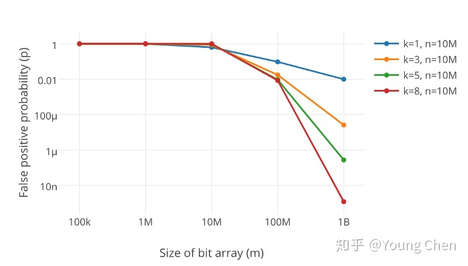

## 什么是布隆过滤器
本质上布隆过滤器是一种数据结构，比较巧妙的**概率型数据结构**，特点是高效地插入和查询，可以用来告诉你 “某样东西一定不存在或者可能存在”。

相比于传统的 List、Set、Map 等数据结构，它更高效、占用空间更少，但是缺点是其返回的结果是概率性的，而不是确切的。

## 实现原理
### HashMap 的问题

讲述布隆过滤器的原理之前，我们先思考一下：通常你判断某个元素是否存在用的是什么？应该蛮多人回答 HashMap 吧，确实可以将值映射到 HashMap 的 Key，然后可以在 `O(1)` 的时间复杂度内返回结果，效率奇高。但是 HashMap 的实现也有缺点，例如存储容量占比高，考虑到负载因子的存在，通常空间是不能被用满的。一旦值很多，例如上亿的时候，HashMap 占据的内存大小就变得很可观了。

还比如说数据集存储在远程服务器，本地服务接受输入，而数据集非常大不可能一次性读进内存构建 HashMap 的时候，也会存在问题。

### 布隆过滤器数据结构

布隆过滤器是一个比特向量或者说比特数组，长这样：

```
+---+---+---+---+---+---+---+---+
| 0 | 0 | 0 | 0 | 0 | 0 | 0 | 0 |
+---+---+---+---+---+---+---+---+
  1   2   3   4   5   6   7   8
```

如果要映射一个值到布隆过滤器，我们需要使用多个不同的哈希函数生成多个哈希值，并对每个生成的哈希值指向比特置 1。例如给定值 `baidu`，三个不同的哈希函数分别生成了哈希值 1、4、7，则上图转变为：

```
  +-------+baidu+---------+
  |       |               |
Hash1   Hash2           Hash3
  |       |               |
  v       v               v
+-+-+---+-+-+---+---+---+-+-+---+
| 1 | 0 | 1 | 0 | 0 | 0 | 1 | 0 |
+---+---+---+---+---+---+---+---+
  1   2   3   4   5   6   7   8
```

Ok，我们现在再存一个值 `tencent`。如果哈希函数返回 3、4、8 的话，图继续变为：

```
          +-+tencent+---------+
          |   +               |
        Hash1 |               |
          |   |             Hash3
          | Hash2             |
          |   |               |
          v   v               v
+---+---+-+-+-+-+---+---+---+-+-+
| 1 | 0 | 1 | 1 | 0 | 0 | 1 | 1 |
+---+---+---+---+---+---+---+---+
  1   2   3   4   5   6   7   8
```

值得注意的是，4 这个比特由于两个值的哈希函数都返回了这个比特，因此它被覆盖了。现在如果想查询 `dianping` 这个值是否存在，哈希函数返回 1、5、8三个值，结果我们发现 5 这个比特的值为 0，**说明没有任何一个值映射到这个比特**，因此可以很确定地说 `dianping` 这个值不存在。需要查询 `baidu` 这个值是否存在的话，哈希函数必然会返回 1、4、7，然后检查发现这三个比特的值均为 1，那么可以说 `baidu` 存在了么？答案是不可以，**只能是 `baidu` 这个值可能存在**。

这是为什么呢？答案很简单：因为随着增加的值越来越多，被置为 1 的比特也会越来越多。这样某个值 `taobao` 即使没有被存储过，但是万一哈希函数返回的三个比特都被其他值置为了 1 ，那么程序还是会判断 `taobao` 这个值存在。

## 不支持删除
感谢评论区提醒，传统的布隆过滤器并不支持删除操作。但是名为 [Counting Bloom Filter] 的变种可以用来测试元素计数个数是否绝对小于某个阈值，它支持元素删除。

### 如何选择哈希函数个数和布隆过滤器长度
很显然，过小的布隆过滤器很快所有的比特均变成 1，那么查询任何值都会返回“可能存在”，起不到过滤的目的。布隆过滤器的长度会直接影响误报率，布隆过滤器越长其误报率越小。

另外，哈希函数的个数也需要权衡。个数越多则布隆过滤器比特置为 1 的速度越快，且布隆过滤器的效率越低；但是如果太少的话，报率会变高。



参数说明如下
- `k` 为哈希函数个数
- `m` 为布隆过滤器长度
- `n` 为插入的元素个数
- `p` 为误报率

如何选择适合业务的 `k` 和 `m` 值呢，这里直接贴一个公式：

```
m = -n*ln(p)/(ln(2))^2
k = m/n*ln(2)
```

公式的推导在此不详述，因为对于使用来说并没有太大的意义。你让一个高中生来推会推得很快。`k` 次哈希函数某一比特未被置为 1 的概率为 `(1-1/m)^k`。

插入 n 个元素后依旧为 0 的概率和为 1 的概率分别是 `(1-1/m)^(n*k)` 和 `1-(1-1/m)^(n*k)`。

标明某个元素是否在集合所需的 `k` 个位置都按照以上方法设置为 1，但是该方法可能会使算法错误地认为某一原本不在集合的元素却被检测为在该集合（False Positives），该概率由以下公式确定

```
[1-(1-1/m)^(n*k)]^k ~= (1-e^(-k*n/m))^k
```

## 最佳实践
常见的使用有：利用布隆过滤器减少磁盘 IO 或者网络请求。因为一旦一个值必定不存在的话，就可以不用进行后续昂贵的查询请求。

另外，既然你使用布隆过滤器来加速查找和判断是否存在，那么性能很低的哈希函数不是个好选择，推荐 MurmurHash、Fnv 这些。

### 大 Value 拆分

Redis 因其支持 `setbit` 和 `getbit` 操作，且纯内存性能高等特点，因此天然就可以作为布隆过滤器来使用。但是布隆过滤器的不当使用极易产生大 Value，增加 Redis 阻塞风险，因此生产成环境建议对体积庞大的布隆过滤器进行拆分。

拆分的形式方法多种多样，本质是不要将 Hash(Key) 之后的请求分散在多个节点的多个小 bitmap 上，而是应该拆分成多个小 bitmap 之后，对一个 Key 的所有哈希函数都落在这一个小 bitmap 上。（TODO：需要加深理解）

## 参考文献
- [详解布隆过滤器的原理，使用场景和注意事项](https://zhuanlan.zhihu.com/p/43263751?utm_source=wechat_session&utm_medium=social&utm_oi=1101038901967372288&utm_campaign=shareopn)

[Counting Bloom Filter]: https://en.wikipedia.org/wiki/Counting_Bloom_filter
