[上一篇文章][prev] 介绍了 Docker 自带的 `logs` 子命令以及其 `logging driver`。本文将会介绍一个流行的开源日志管理方案 ELK。

## 关于 ELK
### 简介
ELK 是 [Elastic 公司][elastic.co] 提供的一套完整的日志收集以及展示的解决方案，名称由三个产品 ElasticSearch、Logstash 和 Kibana 的首字母缩写而成。

- Elasticsearch 是实时全文搜索和分析引擎，提供搜集、分析、存储数据三大功能
- Logstash 是一个用来搜集、分析、过滤日志的工具
- Kibana 是一个基于 Web 的图形界面，用于搜索、分析和可视化存储在 Elasticsearch 指标中的日志数据 　　
### ELK 日志处理流程

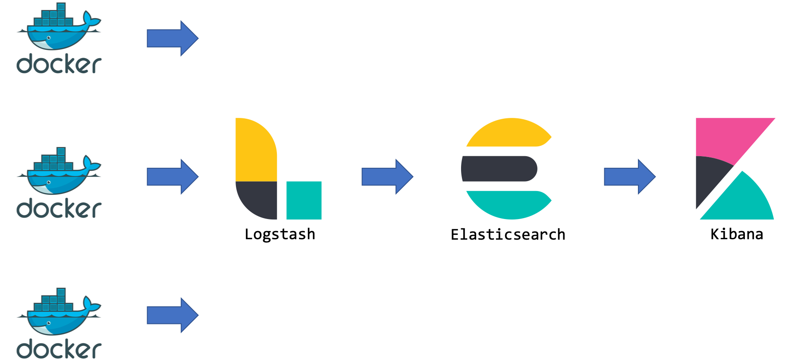

上图展示了 Docker 环境下一个典型的 ELK 方案下的日志收集处理流程：
1. Logstash 从各个 Docker 容器提取日志信息
2. Logstash 将日志转发到 ElasticSearch 进行索引和保存
3. Kibana 负责分析和可视化日志信息

由于 Logstash 在数据收集上并不出色，而且作为 Agent 时的性能并不达标。因此，Elastic 发布了 beats 系列轻量级采集组件。

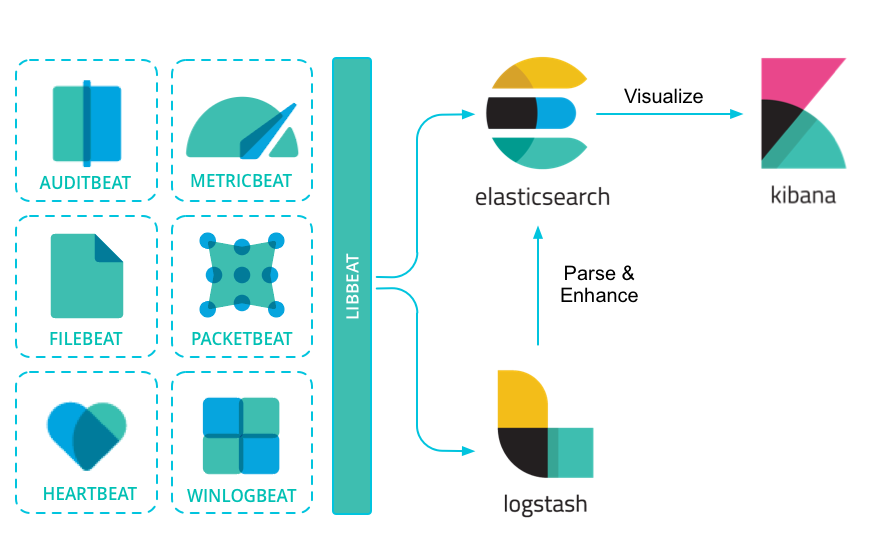

这里我们要实验的 Beat 组件是 Filebeat。Filebeat 是构建于 beats 之上的，服务于日志收集场景，用来替代 Logstash Forwarder 的下一代 Logstash 收集器，可以更快速稳定、轻量低耗地进行收集工作，很方便地与 Logstash 还有直接与 Elasticsearch 进行对接。

本次实验直接使用 Filebeat 作为 Agent，它会收集 [上一篇文章][prev] 所介绍 json-file 格式 log 文件的记录变动，并直接将日志发给 ElasticSearch 进行索引和保存，其处理流程变为下图，也可以称之为 EFK。

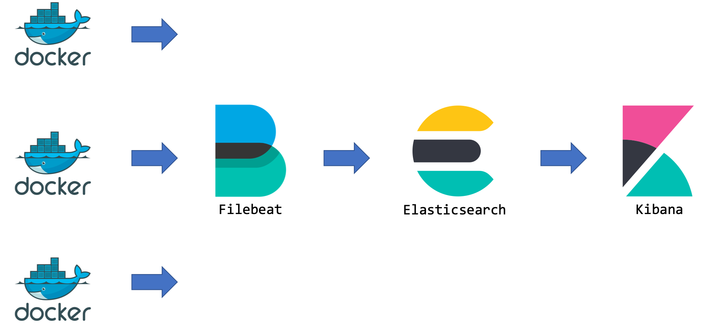

## ELK 套件的安装
本次实验采用 Docker 方式部署一个最小规模的 ELK 运行环境。实际环境或许需要考虑高可用和负载均衡。

首先拉取镜像 [sebp/elk:7.10.0]：

> 实验时能够找到的最新版本是 7.10.0。

```bash
docker pull sebp/elk:7.10.0
```

> 注：由于包含整个 ELK 环境导致镜像较大，需要耐心等待。

通过以下命令使用 [sebp/elk:7.10.0] 镜像启动运行 ELK：

```bash
# 为了迎合本人的实验环境，端口作了重定向
docker run -it -d --name elk  \
  -p 8601:5601                \
  -p 8200:9200                \
  -p 8044:5044                \
  sebp/elk:7.10.0
```

执行完成之后可以先访问一下 `http://[Your-HostIP]:8601` 看看 Kibana 的效果如下

> 注：实验环境的 ES 服务所在机器 IP 为 `10.176.161.147`。

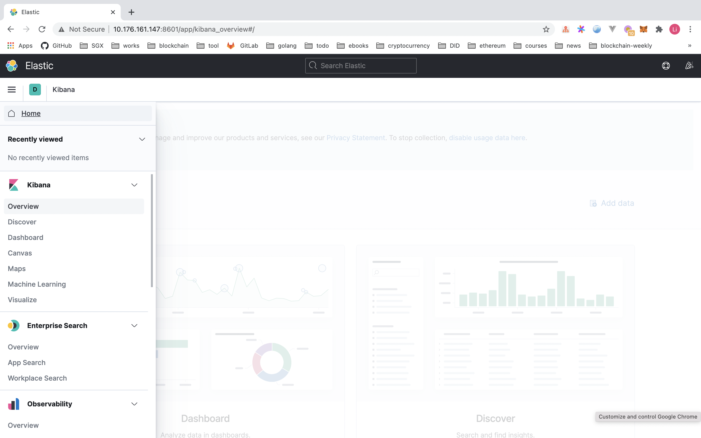

可见目前没有任何可以显示的 ES 索引和数据，再访问一下 `http://[Your-HostIP]:8200` 看看 ElasticSearch 的 API 接口是否可用：

```bash
curl http://10.176.161.147:8200/

{
  "name" : "elk",
  "cluster_name" : "elasticsearch",
  "cluster_uuid" : "v9PcHOThR1ikUgyweOOh3w",
  "version" : {
    "number" : "7.10.0",
    "build_flavor" : "default",
    "build_type" : "tar",
    "build_hash" : "51e9d6f22758d0374a0f3f5c6e8f3a7997850f96",
    "build_date" : "2020-11-09T21:30:33.964949Z",
    "build_snapshot" : false,
    "lucene_version" : "8.7.0",
    "minimum_wire_compatibility_version" : "6.8.0",
    "minimum_index_compatibility_version" : "6.0.0-beta1"
  },
  "tagline" : "You Know, for Search"
}
```


::: tip 温馨提示
如果启动过程的一些错误导致 ELK 容器无法启动，可以参考 [ElasticSearch启动常见错误][es-common-startup-errors] 和 [Elasticsearch, Logstash, Kibana (ELK) Docker image documentation] 等文章。主机内存低于 4G 的话，建议限制 ES 内存的使用大小，以免启动不了。例如下面增加的配置，限制 ES 内存使用最大为 1G：

```bash
docker run -it -d --name elk  \
  -p 8601:5601                \
  -p 8200:9200                \
  -p 8044:5044                \
　-e ES_MIN_MEM=512m          \
  -e ES_MAX_MEM=1024m         \
  sebp/elk:7.10.0
```
::: 

## Filebeat
### 安装
本实验以容器的方式运行和以上 ELK 版本一致的 Filebeat，所以拉取容器镜像如下：

```bash
docker pull docker.elastic.co/beats/filebeat:7.10.0
```

### 配置
配置的作用主要是告诉 Filebeat 要监控哪些日志文件以及将日志发送到哪里去。本实验的配置文件 `filebeat.docker.yml` 如下，主要监控 docker 容器的日志。

```yaml
filebeat.config:
  modules:
    path: ${path.config}/modules.d/*.yml
    reload.enabled: false

filebeat.inputs:
- type: docker
  containers.ids: '*'

processors:
  - add_cloud_metadata: ~
  - add_docker_metadata: ~

output.elasticsearch:
  hosts: '${ELASTICSEARCH_HOSTS:elasticsearch:9200}'
  username: '${ELASTICSEARCH_USERNAME:}'
  password: '${ELASTICSEARCH_PASSWORD:}'
```

> 详细的配置说明参见 [filebeat.reference.yml][filebeat-reference-yml]

- `${xxx}` 分割的字符串会被默认值或者后续的命令行参数覆盖

### 启动

启动前点击 Kibana 的 disocver 面板会发现看不到任何日志。

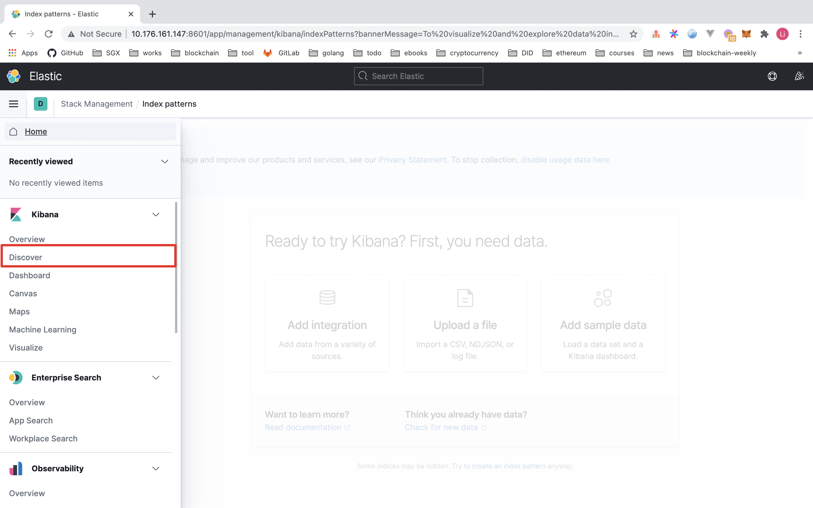

启动 filebeat 服务

```bash
#!/bin/bash

elkIP=$(docker inspect elk -f '{{range.NetworkSettings.Networks}}{{.IPAddress}}{{end}}' elk | tail -n1)
#echo $elkIP

app=filebeat

docker rm -f $app

# --user=root 指定默认用户为 root，否则会报无权限读取 /var/lib/docker/containers 目录
# -E setup.kibana.host=$elkIP:8601 设置 kibana 的网络地址
# -E output.elasticsearch.hosts=["$elkIP:9200"] 指定 ES 服务的网络地址
docker run -d                                                     \
  --name $app                                                     \
  --user=root                                                     \
  -v $PWD/filebeat.docker.yml:/usr/share/filebeat/filebeat.yml:ro \
  -v /var/lib/docker/containers:/var/lib/docker/containers:ro     \
  docker.elastic.co/beats/filebeat:7.10.0                         \
  --strict.perms=false                                            \
  -E setup.kibana.host=$elkIP:8601                                \
  -E output.elasticsearch.hosts=["$elkIP:9200"]
```

> 相关的官方文档参见：[Run Filebeat on Docker] 和 [Filebeat command reference]

### 验证

重新打开 kibana 的 discover 面板，发现依然没看到日志 = =

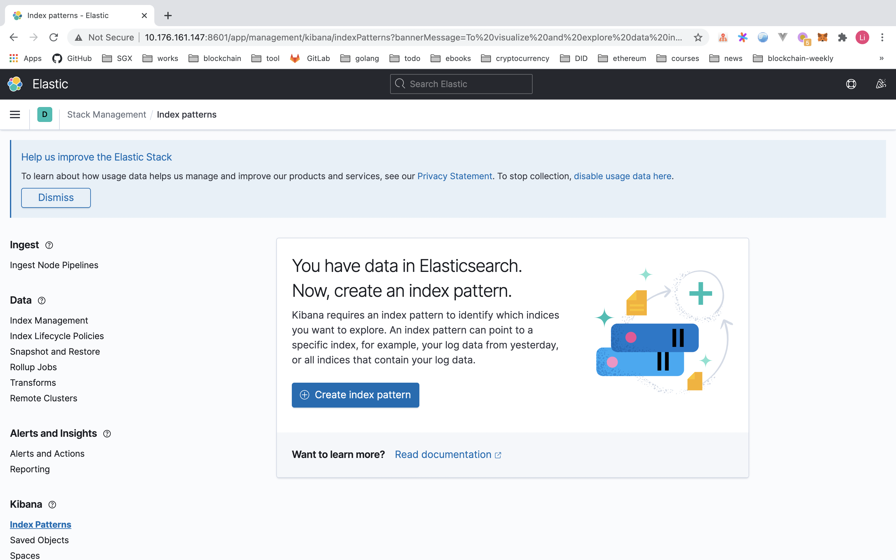

咋回事嘞？其实 Kibana 还需要配置一个叫做 index pattern 的东西，用于显示匹配特定模式的日志。

### Kibana 配置
接下来告诉 Kibana 要查询和分析 ElasticSearch 的哪些日志，因此需要配置一个 index pattern。Filebeat 的日志索引格式是 filebeat-timestamp 这种格式，操作如下

1. 点击 `Create index pattern` 按钮，定义 index pattern 为 `filebeat-*`


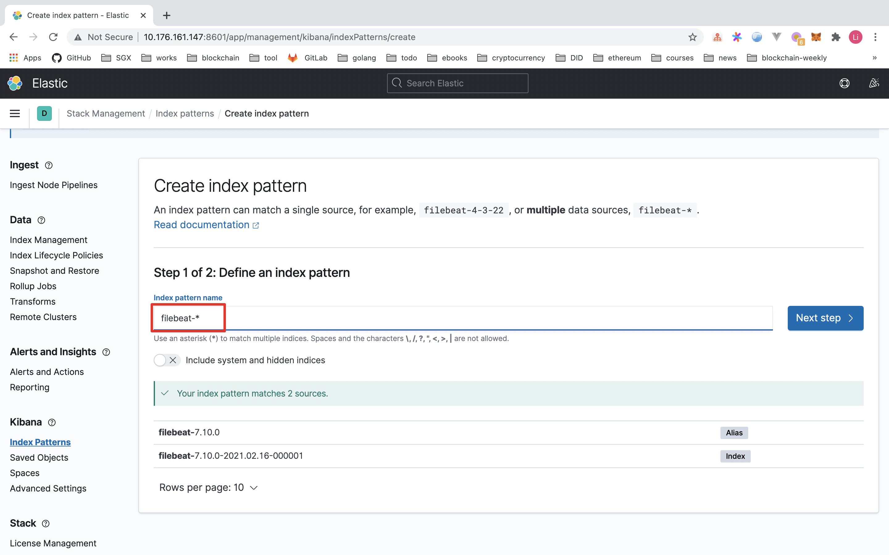

2. 点击 `Next Step`，选择 `Time field` 为 `@timestamp`，并单击 `Create index pattern` 按钮完成配置


这时再单击 Kibana 左侧的 Discover 面板，即可看到容器的日志信息啦~

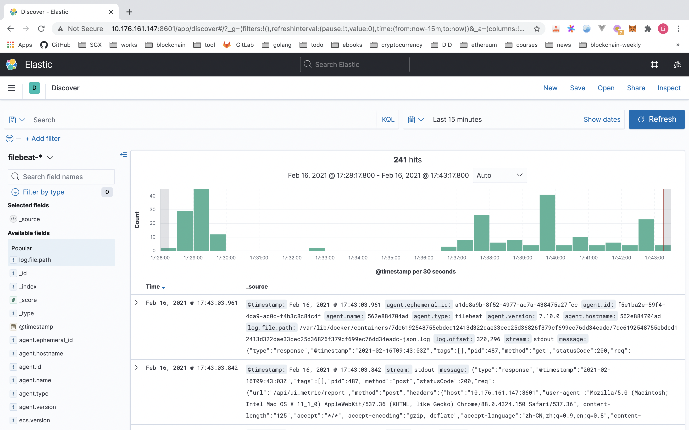

我们仔细瞅一下 `message` 字段：

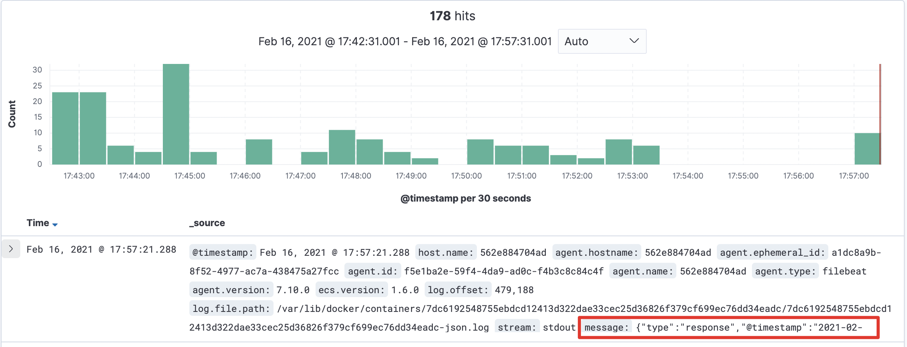

筛选一下只看这个 `message` 字段的信息：

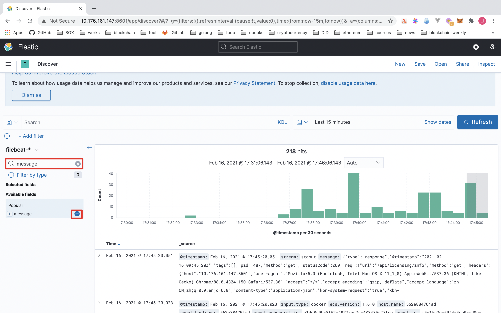

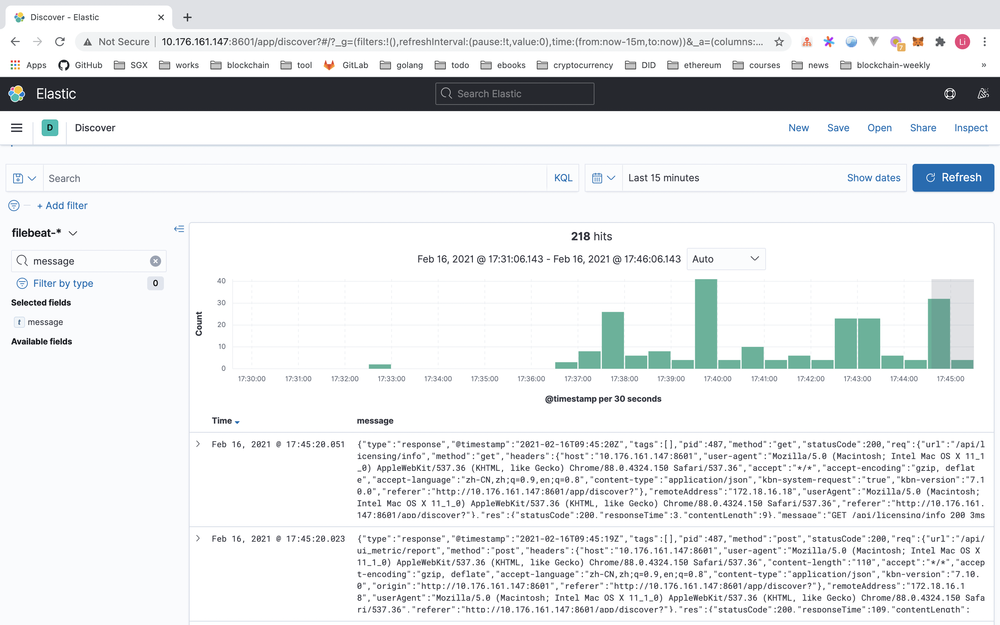

此外，Kibana 还提供搜索关键词的日志功能。例如将查询模式从 KQL 转成 Lucene，筛选出包含 `"2021-02-16T09:45:19Z"` 的日志信息：

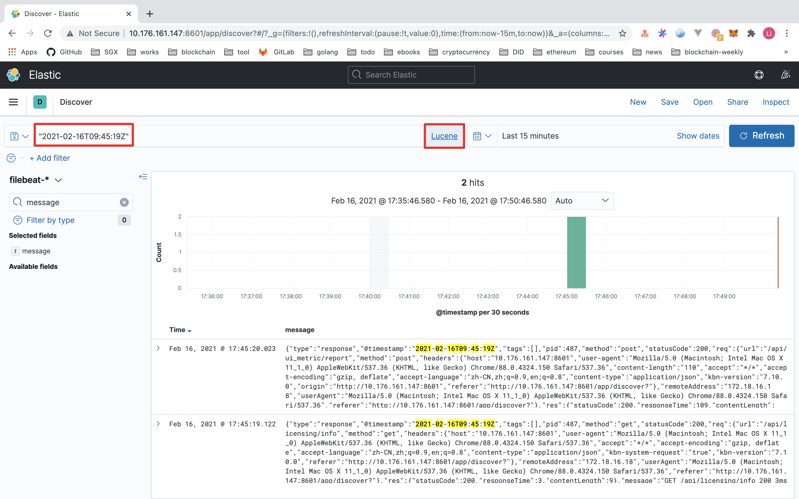

这里只展示了导入 ELK 的日志信息，实际上 ELK 还有很多很丰富的玩法，例如分析聚合、炫酷 Dashboard 等等。感兴趣的话，自己动手试试吧~

日志格式可是普通的纯文本输出，也可以是 JSON 格式。

## 小结
本文从 ELK 的基本组成入手，介绍其基本处理流程，以及从零开始搭建一个 ELK 环境，演示基于 Filebeat 收集容器日志信息的案例。当然，ELK/EFK 有很多的知识点，本文只做抛砖引玉，希望未来能够分享更多的实践总结。

## 参考文献
- [你必须知道的容器日志 (2) 开源日志管理方案 ELK/EFK](https://www.cnblogs.com/edisonchou/p/docker_logs_study_summary_part2.html)

[Elasticsearch, Logstash, Kibana (ELK) Docker image documentation]: https://elk-docker.readthedocs.io/
[Filebeat command reference]: https://www.elastic.co/guide/en/beats/filebeat/7.10/command-line-options.html
[Run Filebeat on Docker]: https://www.elastic.co/guide/en/beats/filebeat/7.10/running-on-docker.html
[elastic.co]: https://www.elastic.co/cn/
[es-common-startup-errors]: https://www.cnblogs.com/zhi-leaf/p/8484337.html
[filebeat-reference-yml]: https://www.elastic.co/guide/en/beats/filebeat/7.10/filebeat-reference-yml.html
[prev]: /2021/02/16/docker-logging-01-logs-cmd-and-drivers
[sebp/elk:7.10.0]: https://hub.docker.com/layers/sebp/elk/7.10.0/images/sha256-9fe89b0d9a5adf4cda32b9b88b176f3d8854c6311f8f49ab82d21432ee1391be?context=explore
