# 学点 epoll
从事服务端开发，少不了要接触网络编程。epoll 作为 linux 下高性能网络服务器的必备技术至关重要，nginx、redis、skynet 和大部分游戏服务器都使用到这一多路复用技术。

网上虽然也有不少讲解 epoll 的文章，但要不是过于浅显，就是陷入源码解析，很少能有通俗易懂的。本文希望帮助缺乏专业背景知识的读者理清 epoll 的原理。

## epoll 为什么性能好
本文会从网卡接收数据的流程讲起，串联起 CPU 中断、操作系统进程调度等知识，再一步步分析阻塞接收数据、select 到 epoll 的进化过程，最后探究 epoll 的实现细节。主要分为以下几个部分

1. 从网卡接收数据说起
2. 如何知道接收了数据？
3. 进程阻塞为什么不占用 CPU 资源？
4. 内核接收网络数据全过程
5. 同时监视多个 socket 的简单方法
6. epoll 的设计思路
7. epoll 的原理和流程
8. epoll 的实现细节
9. 结论


## 1. 从网卡接收数据说起
下图是一个典型的计算机结构图，计算机由 CPU、存储器（内存）、网络接口等部件组成。了解 epoll 本质的第一步，要从硬件的角度看计算机怎样接收网络数据。

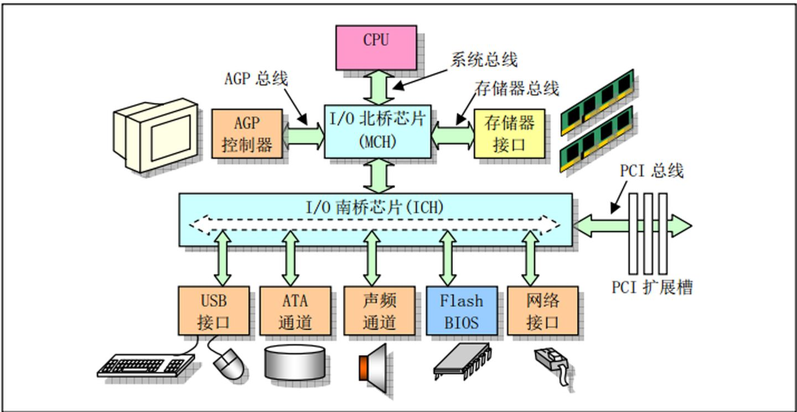

下图展示了网卡接收数据的过程。① 阶段，网卡收到网线传来的数据；经过 ② 阶段的硬件电路的传输；最终将数据写入到内存中的某个地址上（③ 阶段）。这个过程涉及到 DMA 传输、IO 通路选择等硬件有关的知识，但这里只需知道：网卡会把接收到的数据写入内存。

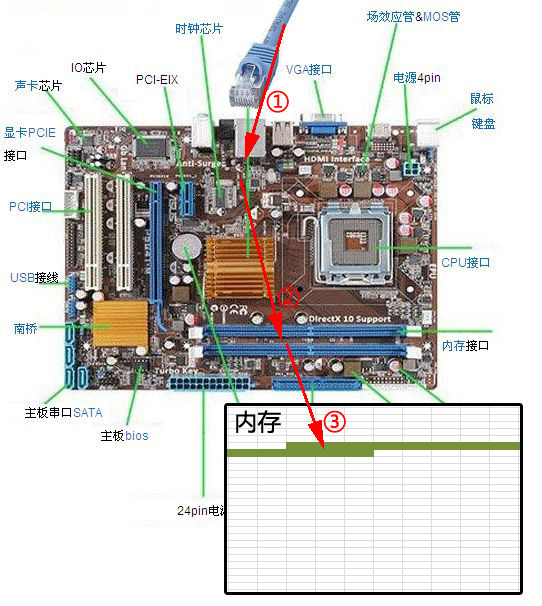

通过硬件传输，网卡接收的数据存放到内存。操作系统就可以去读取它们。

## 2. 如何知道接收了数据？
了解 epoll 本质的第二步，要从 CPU 的角度来看数据接收。要理解这个问题，要先了解一个概念--中断。

计算机执行的程序会有不同的优先级。比如，当计算机收到断电信号时（电容可以保存少许电量，供 CPU 运行很短的一小段时间），它应立即去保存数据，保存数据的程序具有较高的优先级。

一般而言，由硬件产生的信号需要 CPU 立马做出回应（不然数据可能就丢失），所以它的优先级很高。CPU 理应中断掉正在执行的程序，去做出响应；当 CPU 完成对硬件的响应后，再重新执行用户程序。中断的过程如下图，和函数调用差不多。只不过函数调用是事先定好位置，而中断的位置由“信号”决定。

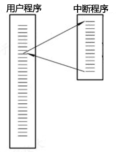

以键盘为例。用户按下某个按键时，键盘会给 CPU 的中断引脚发出一个高电平。CPU 能够捕获这个信号，然后执行键盘中断程序。下图展示了各种硬件通过中断与 CPU 交互。

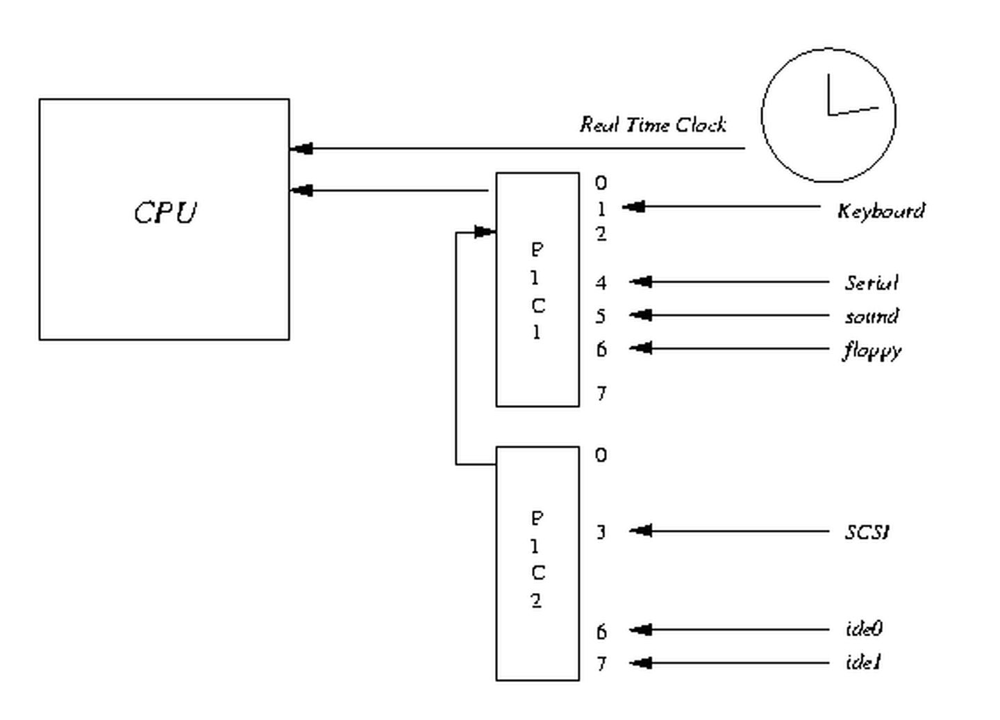

现在可以回答本节提出的问题了：当网卡把数据写入到内存后，网卡向 CPU 发出一个中断信号，操作系统便能得知有新数据到来，再通过网卡中断程序去处理数据。

## 3. 进程阻塞为什么不占用 CPU 资源？
了解 epoll 本质的第三步，要从操作系统进程调度的角度来看数据接收。阻塞是进程调度的关键一环，指的是进程在等待某事件（如接收到网络数据）发生之前的等待状态，`recv`、`select` 和 `epoll` 都是阻塞方法。了解进程阻塞不占用CPU资源的原因，也就能够了解这一步。

为简单起见，我们从普通的 `recv` 接收开始分析，先看看下面代码：

```c
//创建socket
int s = socket(AF_INET, SOCK_STREAM, 0);   
//绑定
bind(s, ...)
//监听
listen(s, ...)
//接受客户端连接
int c = accept(s, ...)
//接收客户端数据
recv(c, ...);
//将数据打印出来
printf(...)
```

这是一段最基础的网络编程代码，先新建 socket 对象，依次调用 `bind`、`listen`、`accept`，最后调用 `recv` 接收数据。`recv` 是个阻塞方法。当程序运行到 `recv` 时，它会一直等待直到接收到数据才往下执行。

那么阻塞的原理是什么呢？

### 工作队列

操作系统为了支持多任务，实现了进程调度的功能，会把进程分为**运行**和**等待**等几种状态。运行状态是进程获得 CPU 使用权，正在执行代码的状态；等待状态是阻塞状态，比如上述程序运行到 `recv` 时，程序会从运行状态变为等待状态，接收到数据后又变回运行状态。操作系统会分时执行各个运行状态的进程。由于速度很快，看上去就像是同时执行多个任务。

下图的计算机中运行着 A、B、C 三个进程，其中进程 A 执行着上述基础网络程序。一开始这 3 个进程都被操作系统的工作队列所引用，处于运行状态，会分时执行。

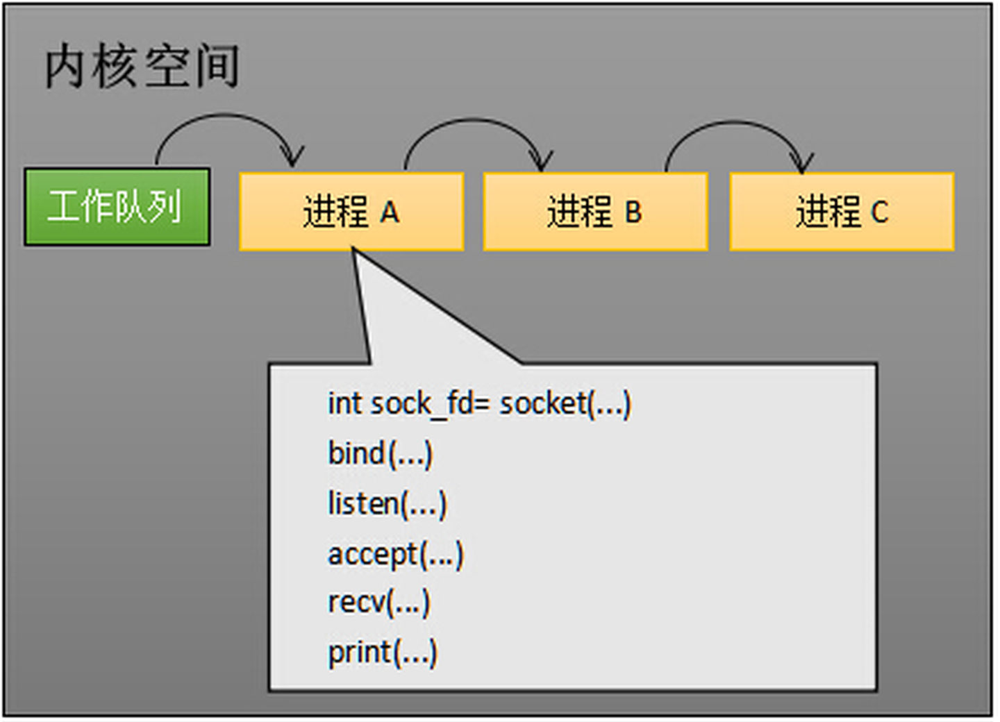

### 等待队列

当进程 A 执行到创建 socket 的语句时，操作系统会创建一个由文件系统管理的 socket 对象（如下图）。这个 socket 对象包含了发送缓冲区、接收缓冲区、等待队列等成员。等待队列是个非常重要的结构，它指向所有需要等待该 socket 事件的进程。


当程序执行到 `recv` 时，操作系统会将进程 A 从工作队列移动到该 socket 的等待队列（如下图）。由于工作队列只剩下了进程 B 和 C，依据进程调度，CPU 会轮流执行这两个进程的程序，不会执行进程A的程序。所以进程A被阻塞，不会往下执行代码，也不会占用CPU资源。


> PS：操作系统添加等待队列只是添加了对这个“等待中”进程的引用，以便在接收到数据时获取进程对象将其唤醒，而非直接将进程管理纳入自己之下。上图为了方便说明，直接将进程挂到等待队列之下。

### 唤醒进程

当 socket 接收到数据后，操作系统将该 socket 等待队列的进程重新放回到工作队列，该进程变成运行状态，继续执行代码。也由于 socket 的接收缓冲区已经有了数据，`recv` 可以返回接收到的数据。

## 4. 内核接收网络数据全过程
**这一步涉及网卡、中断、进程调度的知识，叙述阻塞 `recv` 情况下，内核接收数据全过程。**

如下图所示，进程在 `recv` 阻塞期间，计算机收到了对端传送的数据（步骤 ①）。数据经由网卡传送到内存（步骤 ②），然后网卡通过中断信号通知 CPU 有数据到达，CPU 执行中断程序（步骤 ③）。此处的中断程序主要有两项功能，先将网络数据写入到对应 socket 的接收缓冲区里面（步骤 ④），再唤醒进程 A（步骤 ⑤），重新将进程 A 放入工作队列中。

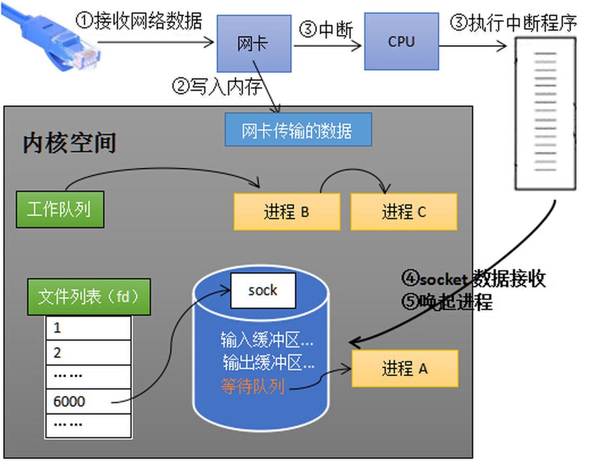

唤醒进程的过程如下图所示。

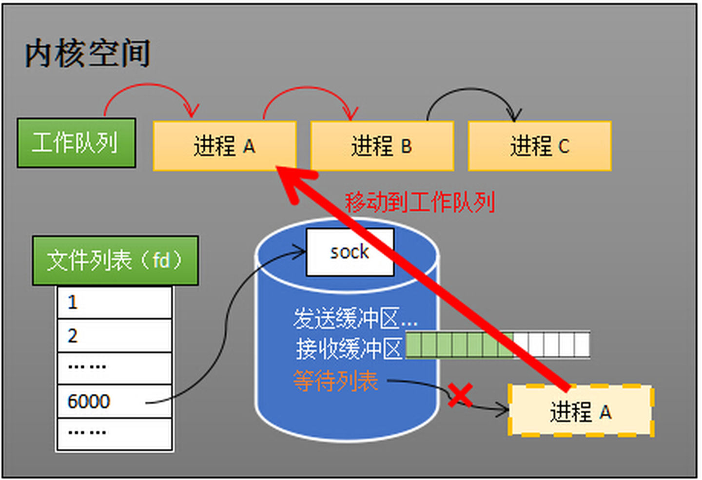

以上是内核接收数据全过程

这里留有两个思考题，大家先想一想。

1. 操作系统如何知道网络数据对应于哪个 socket？
2. 如何同时监视多个 socket 的数据？

问题 1：因为一个 socket 对应着一个端口号，而网络数据包包含 IP 和端口的信息，内核可以通过端口号找到对应的 socket。当然，为了提高处理速度，操作系统会维护端口号到 socket 的索引结构，以快速读取。

问题 2 是多路复用的重中之重，是本文后半部分的重点！

## 5. 同时监视多个 socket 的简单方法
服务端需要管理多个客户端连接，而 `recv` 只能监视单个 socket。这种矛盾下，人们开始寻找监视多个 socket 的方法。epoll 的要义是高效地监视多个 socket。从历史发展角度看，必然先出现一种不太高效的方法，人们再加以改进。只有先理解了不太高效的方法，才能够理解 epoll 的本质。

假如能够预先传入一个 socket 列表，且列表中的 socket 都没有数据，挂起进程直到有一个 socket 收到数据，唤醒进程。这种方法很直接，也是 select 的设计思想。

为方便理解，我们先复习 select 的用法。在如下的代码中，先准备一个数组 `fds`，让 `fds` 存放所有需要监视的 socket。然后调用 select，如果 `fds` 的所有 socket 都没有数据，`select` 会阻塞，直到有一个 socket 接收到数据，`select` 返回，唤醒进程。用户可以遍历 `fds`，通过 `FD_ISSET` 判断具体哪个 socket 收到数据，然后做出处理。

```c
int s = socket(AF_INET, SOCK_STREAM, 0);  
bind(s, ...)
listen(s, ...)

int fds[] =  存放需要监听的socket

while(1){
    int n = select(..., fds, ...)
    for(int i=0; i < fds.count; i++){
        if(FD_ISSET(fds[i], ...)){
            //fds[i]的数据处理
        }
    }
}
```

### select 的流程

select 的实现思路很直接。假如程序同时监视如下图的 sock1、sock2 和 sock3 三个 socket，那么在调用 `select` 之后，操作系统把进程 A 分别加入这三个 socket 的等待队列。

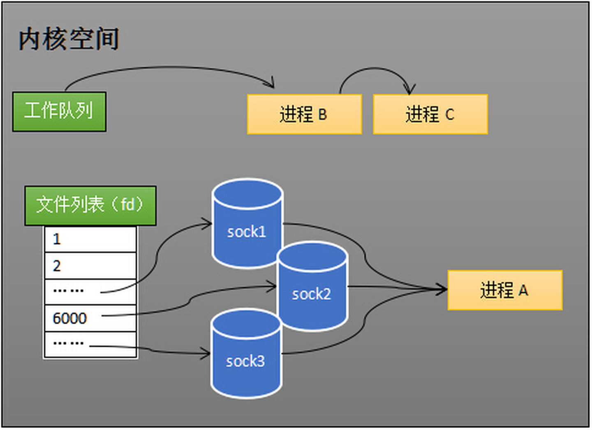

任何一个 socket 收到数据后，中断程序将唤起进程。下图展示了 sock2 接收到数据的处理流程。

> PS：`recv` 和 `select` 的中断回调可以设置成不同的内容。

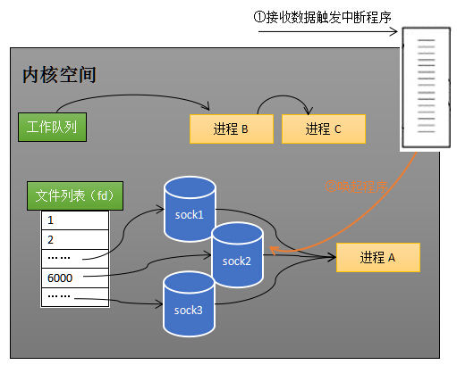

所谓唤起进程，就是将进程从所有的等待队列移除，加入到工作队列里面，如下图所示。

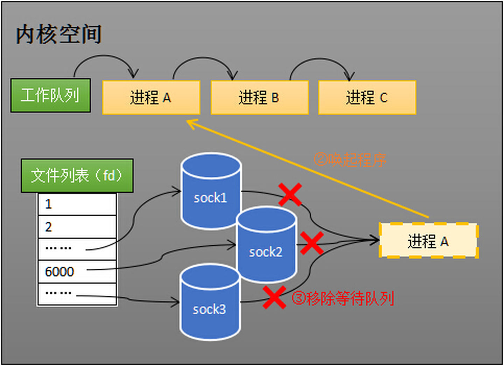

经由这些步骤，唤醒进程 A 后，它知道至少有一个 socket 接收了数据。程序只需遍历一遍 socket 列表，就可以得到就绪的 socket。

这种简单方式行之有效，在几乎所有操作系统都有对应的实现。

**但是简单的方法往往有缺点**，主要是：

1. 每次调用 `select` 都需要将进程加入到所有监视 socket 的等待队列，每次唤醒都需要从每个队列移除。这里涉及了**两次遍历**，而且每次都要将整个 `fds` 列表传递给内核，有一定的开销。正是因为遍历操作开销大，出于效率的考量，才会规定 `select` 的最大监视数量，默认只能监视 1024 个 socket。
2. 进程被唤醒后，程序并不知道哪些 socket 收到数据，还需要遍历一次。

那么，有没有减少遍历的方法？有没有保存就绪 socket 的方法？这两个问题便是 epoll 技术要解决的。

> 补充说明： 本节只解释了 `select` 的一种情形。当程序调用 `select` 时，内核会先遍历一遍 socket。如果有一个以上的 socket 接收缓冲区有数据，那么 select 直接返回，不会阻塞。这也是为什么 `select` 的返回值有可能大于 1 的原因之一。如果没有 socket 有数据，进程才会阻塞。

## 6. epoll 的设计思路
epoll 是在 select 出现 N 多年后才被发明的，是 select 和 poll 的增强版本。epoll 通过以下一些措施来改进效率。

### 措施 1：功能分离

select 低效的原因之一是将**维护等待队列**和**阻塞进程**两个步骤合二为一。如下图所示，每次调用 select 都需要这两步操作。然而大多数应用场景中，需要监视的 socket 相对固定，并不需要每次都修改。epoll 将这两个操作分开，先用 `epoll_ctl` 维护等待队列，再调用 `epoll_wait` 阻塞进程。显而易见的，效率就能得到提升。

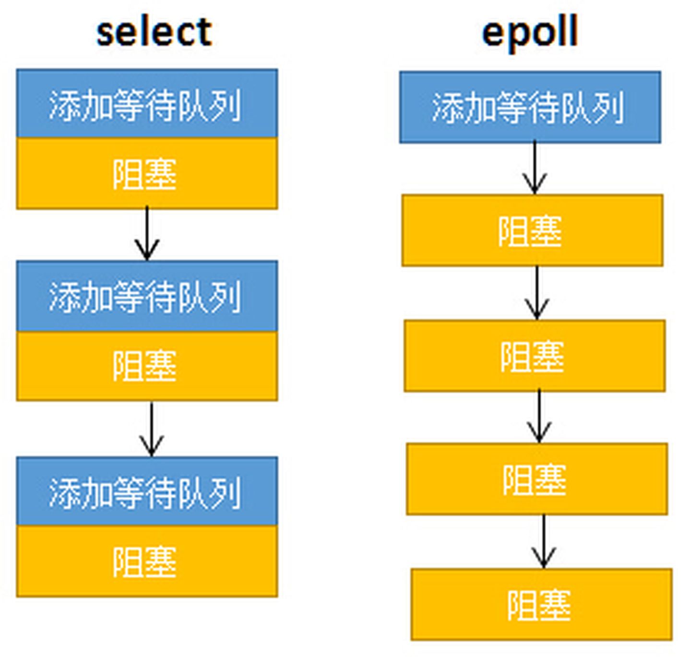

为方便理解后续的内容，我们先复习下 epoll 的用法。如下的代码先用 `epoll_create` 创建一个 epoll 对象 `epfd`，再通过 `epoll_ctl` 将需要监视的 socket 添加到 `epfd`，最后调用 `epoll_wait` 等待数据。

```c
int s = socket(AF_INET, SOCK_STREAM, 0);   
bind(s, ...)
listen(s, ...)

int epfd = epoll_create(...);
epoll_ctl(epfd, ...); //将所有需要监听的socket添加到epfd中

while(1){
    int n = epoll_wait(...)
    for(接收到数据的socket){
        //处理
    }
}
```

功能分离，使得 epoll 有了优化的可能。


### 措施2：就绪列表

select 低效的另一个原因在于程序不知道哪些 socket 收到数据，只能一个个遍历。如果内核维护一个**就绪列表**，引用收到数据的 socket，就能避免遍历。如下图所示，计算机共有三个 socket，收到数据的 sock2 和 sock3 被 `rdlist`（就绪列表）所引用。当进程被唤醒后，只要获取 `rdlist` 的内容，就能够知道哪些 socket 收到数据。


## 7. epoll 的原理和流程
本节会以示例和图表来讲解 epoll 的原理和流程。

### 创建 epoll 对象

如下图所示，某个进程调用 `epoll_create` 方法时，内核会创建一个 `eventpoll` 对象（也就是程序中 `epfd` 所代表的对象）。`eventpoll` 对象也是文件系统的一员，和 socket 一样，它也会有等待队列。

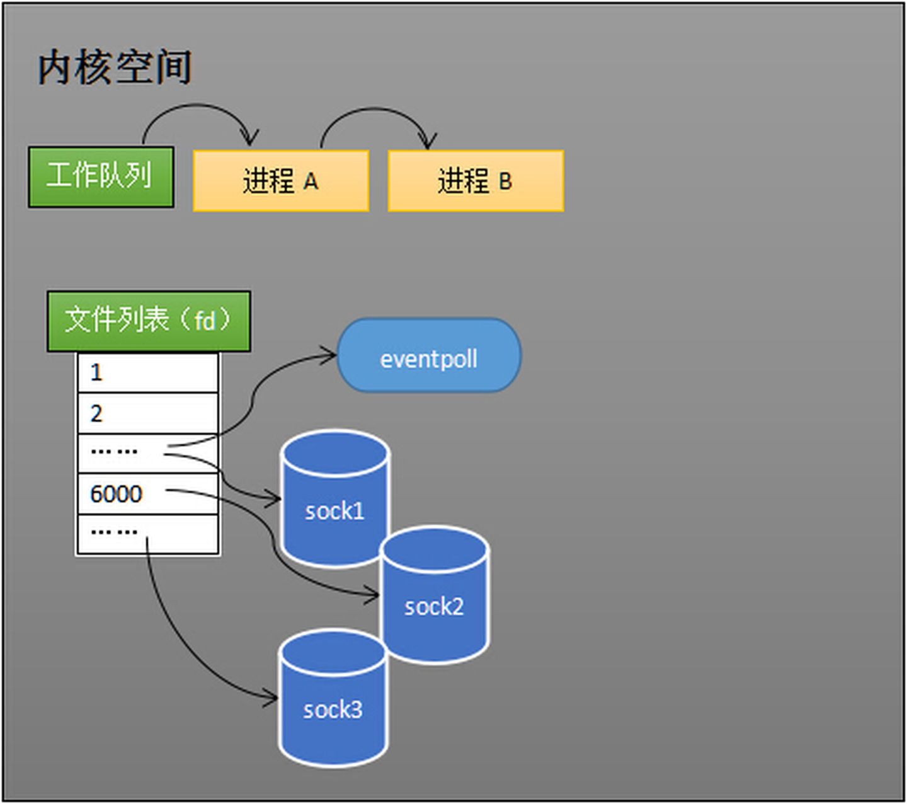

创建一个代表该 epoll 的 `eventpoll` 对象是必须的，因为内核要维护“就绪列表”等数据，“就绪列表”可以作为 `eventpoll` 的成员。

### 维护监视列表

创建 epoll 对象后，可以用 `epoll_ctl` 添加或删除所要监听的 socket。以下图添加 socket 为例，如果通过 `epoll_ctl` 添加 sock1、sock2 和 sock3 的监视，内核会将 `eventpoll` 添加到这三个 socket 的等待队列。

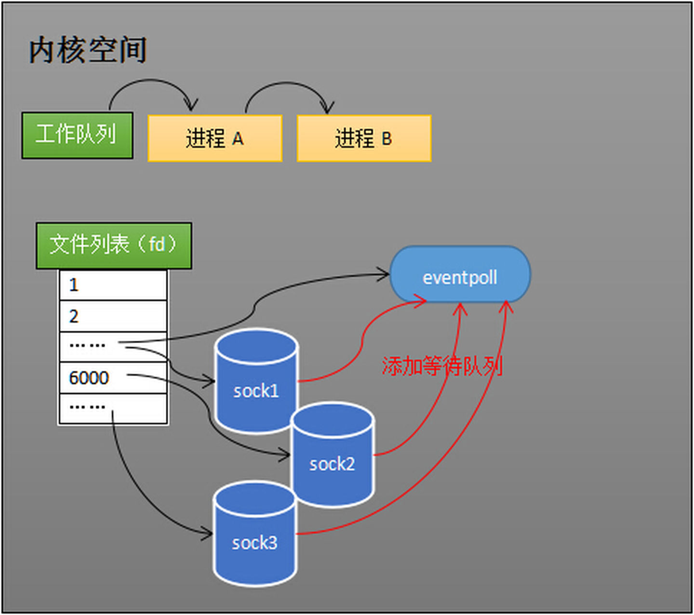

socket 收到数据后，中断程序会操作 `eventpoll` 对象，而不是直接操作进程。

### 接收数据

socket 收到数据后，中断程序会给 `eventpoll` 的“就绪列表”添加 socket 引用。如下图展示的是 sock2 和 sock3 收到数据后，中断程序让 `rdlist` 引用这两个 socket。


`eventpoll` 对象相当于 socket 和进程之间的中介，socket 的数据接收并不直接影响进程，而是通过改变 `eventpoll` 的就绪列表来改变进程状态。

程序执行到 `epoll_wait` 时，如果 `rdlist` 已经引用了 socket，那么 `epoll_wait` 直接返回。如果 `rdlist` 为空，阻塞进程。

### 阻塞和唤醒进程

假设计算机正在运行进程 A 和进程 B，某时刻进程 A 运行到了 `epoll_wait` 语句。如下图所示，内核会将进程 A 放入 `eventpoll` 的等待队列，阻塞进程。

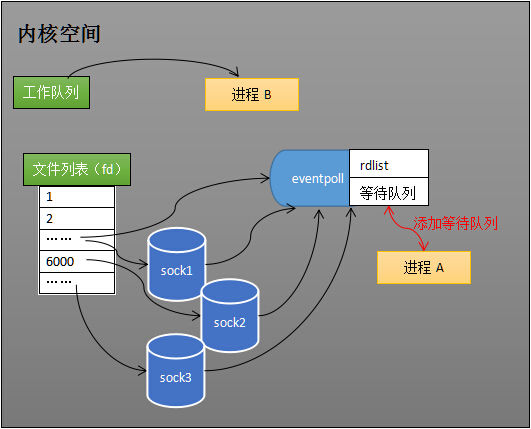

socket 接收到数据后，中断程序一方面修改 `rdlist`，另一方面唤醒 `eventpoll` 等待队列中的进程，进程 A 再次进入运行状态（如下图）。也因为 `rdlist` 的存在，进程 A 可以知道哪些 socket 发生了变化。

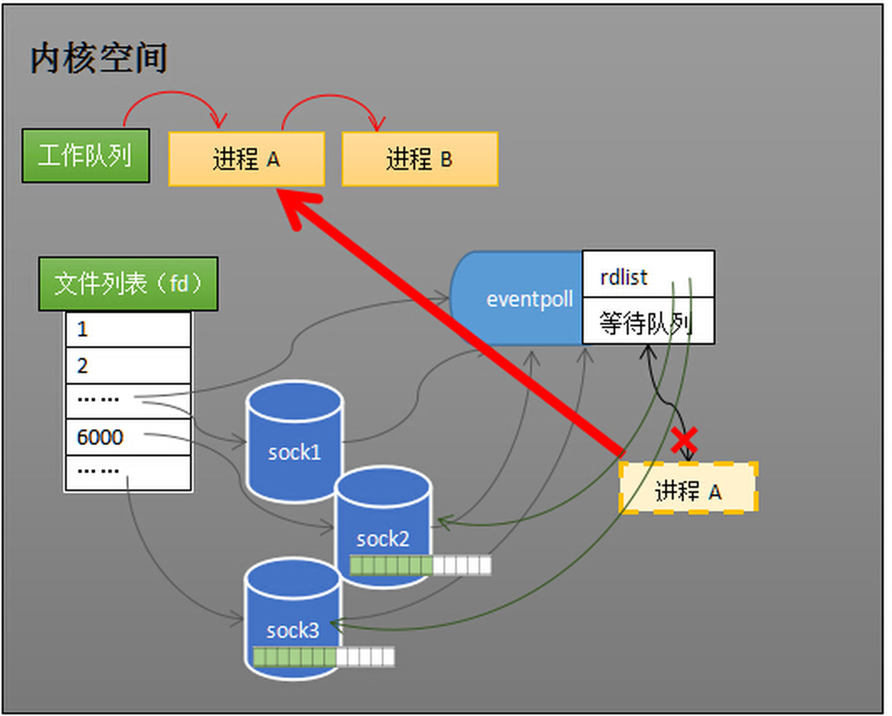

## 8. epoll 的实现细节
至此，相信读者对 epoll 的本质已经有一定了解。但我们还留有一个问题：`eventpoll` 的数据结构是什么样子？

再留两个问题
- 就绪队列应该应使用什么数据结构？
- `eventpoll` 应使用什么数据结构来管理通过 `epoll_ctl` 添加或删除的 socket？

如下图所示，`eventpoll` 包含了 `lock`、`mtx`、`wq`（等待队列）、`rdlist` 等成员。`rdlist` 和 `rbr` 是我们所关心的。

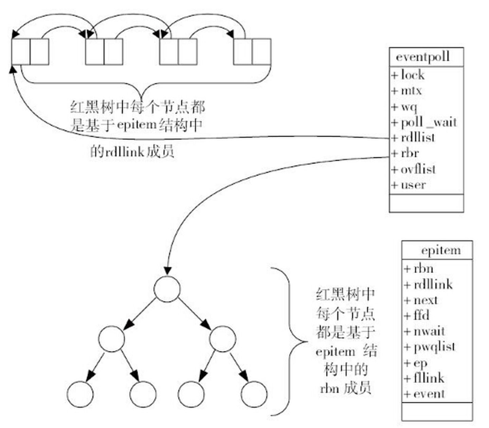

### 就绪列表的数据结构

就绪列表引用着就绪的 socket，所以它应能够快速地插入数据。

程序可能随时调用 `epoll_ctl` 添加监视 socket，也可能随时删除。删除时，若该 socket 已经存放在就绪列表，它也应该被移除。

所以就绪列表应是一种能够快速插入和删除的数据结构。双向链表就是这样一种数据结构，epoll 使用双向链表来实现就绪队列（对应上图的 `rdllist`）。

### 索引结构

既然 epoll 将“维护监视队列”和“进程阻塞”分离，也意味着需要有个数据结构来保存监视的 socket。至少要方便地添加和移除，还要便于搜索，以避免重复添加。红黑树是一种自平衡二叉查找树，搜索、插入和删除时间复杂度都是 `O(log(N))`，效率较好。epoll 使用了红黑树作为索引结构（对应上图的 `rbr`）。

> PS：因为操作系统要兼顾多种功能，以及由更多需要保存的数据，`rdlist` 并非直接引用 socket，而是通过 `epitem` 间接引用，红黑树的节点也是 `epitem` 对象。同样，文件系统也并非直接引用着 socket。为方便理解，本文中省略了一些间接结构。

## 9. 结论
epoll 在 select 和 poll（poll 和 select 基本一样，有少量改进）的基础引入了 `eventpoll` 作为中间层，使用了先进的数据结构，是一种高效的多路复用技术。

下表是个很常见的表，描述了 select、poll 和 epoll 的区别。读完本文，读者能否解释 select 和 epoll 的时间复杂度为什么是 `O(n)` 和 `O(1)`？

系统调用 | select | poll | epoll
-------|--------|-------|-------
事件集合 | 用户通过 3 个参数分别传入感兴趣的可读、可写及异常等事件，内核通过对这些参数的在线修改来反馈其中的就绪事件。这使得用户每次调用 `select` 都要重置这 3 个参数 | 统一处理所有事件类型，因此只需要一个事件集参数。用户通过 `pollfd.events` 传入感兴趣的事件，内核通过修改 `pollfd.events` 反馈其中就绪的事件 | 内核通过一个事件表直接管理用户感兴趣的所有事件。因此每次调用 `epoll_wait` 时，无需反复传入用户感兴趣的事件。`epoll_wait` 系统调用的参数 `events` 仅用来反馈就绪事件 
应用程序索引就绪文件描述符的时间复杂度 | `O(n)` | `O(n)` | `O(1)`
最大支持文件描述符数 | 一般有最大值限制 | 65535 | 65535
工作模式 | LT | LT | 支持 ET 高效模式
内核实现和工作效率 | 采用轮询的方式来检测就绪事件，算法复杂度为 `O(n)` | 采用轮询的方式来检测就绪事件，算法复杂度为 `O(n)` | 采用回调方式来检测就绪事件，算法复杂度为 `O(1)`

## 参考文献
- [如果这篇文章说不清epoll的本质，那就过来掐死我吧！ （1）](https://zhuanlan.zhihu.com/p/63179839)
- [如果这篇文章说不清epoll的本质，那就过来掐死我吧！ （2）](https://zhuanlan.zhihu.com/p/64138532)
- [如果这篇文章说不清epoll的本质，那就过来掐死我吧！ （3）](https://zhuanlan.zhihu.com/p/64746509)
