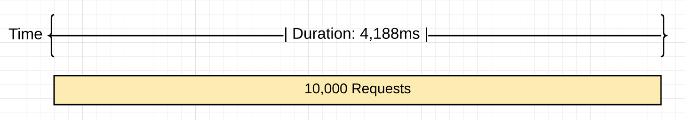
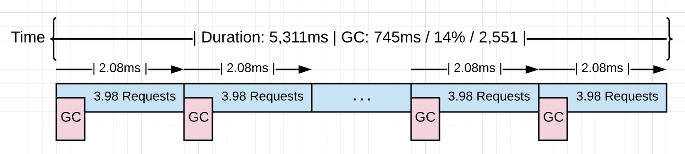
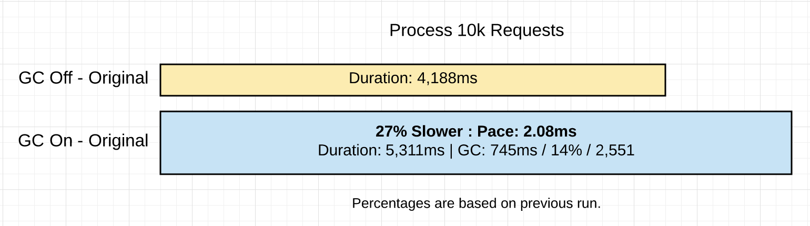
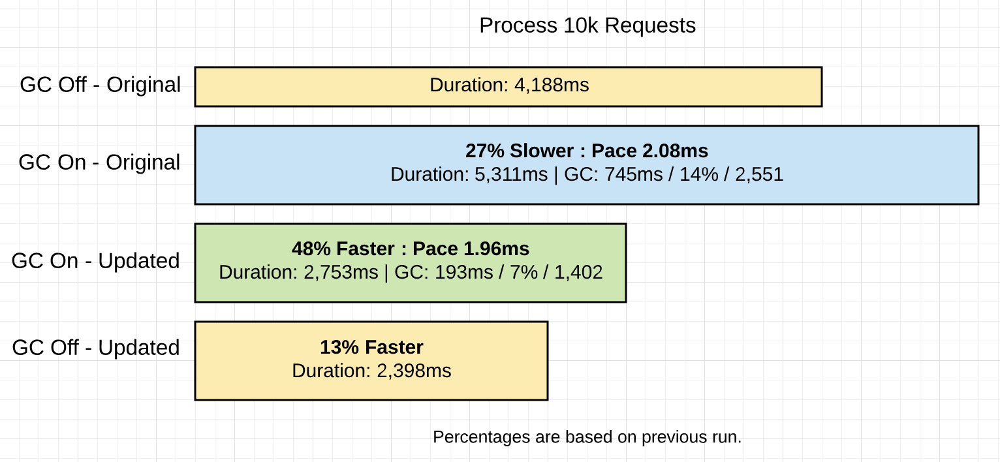

> 原文：[Garbage Collection In Go : Part II - GC Traces](https://www.ardanlabs.com/blog/2019/05/garbage-collection-in-go-part2-gctraces.html)

## 序言

这是讲解 Go 的垃圾回收背后的机制和语义的三部曲的第二部。本篇博文聚焦于如何生成并解读 GC 记录。

三部曲的索引如下：
1. [Garbage Collection In Go : Part I - Semantics](https://www.ardanlabs.com/blog/2018/12/garbage-collection-in-go-part1-semantics.html)
2. [Garbage Collection In Go : Part II - GC Traces](https://www.ardanlabs.com/blog/2019/05/garbage-collection-in-go-part2-gctraces.html)
3. [Garbage Collection In Go : Part III - GC Pacing](https://www.ardanlabs.com/blog/2019/07/garbage-collection-in-go-part3-gcpacing.html)

## 简介
在第一篇博文中，我花时间描述了垃圾回收器的行为和展示了回收器会给运行的程序带来的时延。我分享了如何生成并解读一条 GC 记录，展示堆上内存的变化情况，还解释了 GC 的不同阶段和这些阶段影响时延的方式。
那篇博文的结论是：如果降低堆的压力，时延代价会减小，从而提高程序的性能。我也指出了一点：通过搜罗不同方法来增加任意两次回收之间的间隔来延迟启动回收节奏的行为不是一个好策略。一个连贯的节奏不仅快速（@TODO: 原文是 even if it's quick，暂时译不动），而且能够更好地保持程序的最高效运行。

这篇博客将会带你体会一个真实的网页应用程序，向你展示如何生成 GC 的追溯记录和程序概述，然后演示如何解读这些工具的输出使得你能够找到提高自己程序性能的方法。

## 运行程序
以下是 Go 培训用的一个网页程序：

图 1


https://github.com/ardanlabs/gotraining/tree/master/topics/go/profiling/project

图 1 展示了程序的样子。这个程序从不同的新闻提供商下载 3 种 rss 提要，且允许用户搜索。编译构建网页程序后，程序就可以启动起来了。

代码片段 1
```bash
$ go build
$ GOGC=off ./project > /dev/null
```

代码片段 1 显示程序启动时 `GOGC` 设为了 `off`，把垃圾回收器关闭了。日志被重定向到 `/dev/null` 设备。程序运行时，可以向服务器发送请求。

代码片段 2
```bash
$ hey -m POST -c 100 -n 10000 "http://localhost:5000/search?term=topic&cnn=on&bbc=on&nyt=on"
```

代码片段 2 显示了借助 `hey` 工具用 100 条链接发送 10k 个请求给服务器的场景。所有请求被服务处理完后，统计结果如下。

图 2


图 2 可视化地表示关闭垃圾回收后处理 10k 个请求的情形。10k 个请求共花费 4,188 ms，即服务器每秒大约处理 2387 个请求。

## 打开垃圾回收器
给这个程序打开垃圾回收器的情形又是怎样的呢？

代码片段 3
```bash
$ GODEBUG=gctrace=1 ./project > /dev/null
```

代码片段 3 显示了能够查看 GC 记录的程序启动方式。`GOGC` 变量移除掉了，取而代之的是 `GODEBUG` 变量。`GODEBUG`的设定使得运行时能够每次触发回收时生成一条 GC 记录。现在再次向服务器发送同样的 10k 个请求。一旦所有请求都经服务器处理，我们可以分析所得的 GC 记录和 `hey` 工具提供的信息了。

代码片段 4
```bash
$ GODEBUG=gctrace=1 ./project > /dev/null
gc 3 @3.182s 0%: 0.015+0.59+0.096 ms clock, 0.19+0.10/1.3/3.0+1.1 ms cpu, 4->4->2 MB, 5 MB goal, 12 P
.
.
.
gc 2553 @8.452s 14%: 0.004+0.33+0.051 ms clock, 0.056+0.12/0.56/0.94+0.61 ms cpu, 4->4->2 MB, 5 MB goal, 12 P
```

代码片段 4 显示的是上次运行中的第 3 和最后一次的回收。前两次回收没放出来是因为载荷到达服务器之前那些回收就触发了。最后一次回收显示 10k 个请求的处理共触发了 2551 次回收（减去前两次不算数的回收）。

以下是记录每部分的分解：

代码片段 5
```bash
gc 2553 @8.452s 14%: 0.004+0.33+0.051 ms clock, 0.056+0.12/0.56/0.94+0.61 ms cpu, 4->4->2 MB, 5 MB goal, 12 P

gc 2553     : The 2553 GC runs since the program started
@8.452s     : Eight seconds since the program started
14%         : Fourteen percent of the available CPU so far has been spent in GC

// wall-clock
0.004ms     : STW        : Write-Barrier - Wait for all Ps to reach a GC safe-point.
0.33ms      : Concurrent : Marking
0.051ms     : STW        : Mark Term     - Write Barrier off and clean up.

// CPU time
0.056ms     : STW        : Write-Barrier
0.12ms      : Concurrent : Mark - Assist Time (GC performed in line with allocation)
0.56ms      : Concurrent : Mark - Background GC time
0.94ms      : Concurrent : Mark - Idle GC time
0.61ms      : STW        : Mark Term

4MB         : Heap memory in-use before the Marking started
4MB         : Heap memory in-use after the Marking finished
2MB         : Heap memory marked as live after the Marking finished
5MB         : Collection goal for heap memory in-use after Marking finished

// Threads
12P         : Number of logical processors or threads used to run Goroutines.
```

代码片段 5 显示了上次回收的实际次数。借助 `hey` 可得以下性能统计结果。

代码片段 6
```bash
Requests            : 10,000
------------------------------------------------------
Requests/sec        : 1,882 r/s   - Hey
Total Duration      : 5,311ms     - Hey
Percent Time in GC  : 14%         - GC Trace
Total Collections   : 2,551       - GC Trace
------------------------------------------------------
Total GC Duration   : 744.54ms    - (5,311ms * .14)
Average Pace of GC  : ~2.08ms     - (5,311ms / 2,551)
Requests/Collection : ~3.98 r/gc  - (10,000 / 2,511)
```

代码片段 6 显示了结果。以下图片还可视化地展示了发生的事情。

图 3


图 3 可视化地展示了发生的一切。打开后，回收器必须运行月 2.5k 次才能处理掉 10k 个请求。每次回收的平均启动时间约 2.0 ms，执行所有这些回收引入了另外约 1.1 秒（ 5311 ms - 4188 ms）的延时。

图 4


图 4 是比较到目前为止的两次程序运行的结果。

## 减少内存分配
获取堆的使用概况时非常有用的，它使得我们能够找出是否有能够移除的低效的内存分配操作。

代码片段 7
```bash
go tool pprof http://localhost:5000/debug/pprof/allocs
```

代码片段 7 演示了使用 `pprof` 工具从 `/debug/pprof/allocs` 端口拉取一份运行中程序的内存概况描述文件。这个端口的存在源自以下代码。

代码片段 8
```go
import _ "net/http/pprof"

go func() {
    http.ListenAndServe("localhost:5000", http.DefaultServeMux)
}()
```

代码片段 8 展示了如何将 `/debug/pprof/allocs` 端口关联到任意程序。导入 `net/http/pprof` 来讲这个端口关联到默认的服务器多路选择器。然后使用对 `http.DefaultServerMux` 常量使用 `http.ListenAndServe` 来开放这个端口。

代码片段 9
```bash
(pprof) top 6 -cum
Showing nodes accounting for 0.56GB, 5.84% of 9.56GB total
Dropped 80 nodes (cum <= 0.05GB)
Showing top 6 nodes out of 51
      flat  flat%   sum%        cum   cum%
         0     0%     0%     4.96GB 51.90%  net/http.(*conn).serve
    0.49GB  5.11%  5.11%     4.93GB 51.55%  project/service.handler
         0     0%  5.11%     4.93GB 51.55%  net/http.(*ServeMux).ServeHTTP
         0     0%  5.11%     4.93GB 51.55%  net/http.HandlerFunc.ServeHTTP
         0     0%  5.11%     4.93GB 51.55%  net/http.serverHandler.ServeHTTP
    0.07GB  0.73%  5.84%     4.55GB 47.63%  project/search.rssSearch
```

代码片段 9 显示列表最后出现了 `rssSearch` 函数。这个函数申请了到目前为止总内存 4.96 GB （译者注：原文写错了 5.96 GB）中的 4.55 GB。接下来就得用 `list` 命令看看 `rssSearch` 函数的细节了。

代码片段 10
```bash
(pprof) list rssSearch
Total: 9.56GB
ROUTINE ======================== project/search.rssSearch in project/search/rss.go
   71.53MB     4.55GB (flat, cum) 47.63% of Total


         .          .    117:	// Capture the data we need for our results if we find ...
         .          .    118:	for _, item := range d.Channel.Items {
         .     4.48GB    119:		if strings.Contains(strings.ToLower(item.Description), strings.ToLower(term)) {
   48.53MB    48.53MB    120:			results = append(results, Result{
         .          .    121:				Engine:  engine,
         .          .    122:				Title:   item.Title,
         .          .    123:				Link:    item.Link,
         .          .    124:				Content: item.Description,
         .          .    125:			})
```

代码片段 10 展示了代码片段。第 199 行占据了大部分内存分配。

代码片段 11
```bash
        .     4.48GB    119:		if strings.Contains(strings.ToLower(item.Description), strings.ToLower(term)) {
```

代码片段展示了关键的这行代码。此行申请的这个函数目前申请总内存 4.55 GB 中的 4.48 GB。所以，是时候看看我们能够对这行代码做点啥了。

代码片段 12
```go
117 // Capture the data we need for our results if we find the search term.
118 for _, item := range d.Channel.Items {
119     if strings.Contains(strings.ToLower(item.Description), strings.ToLower(term)) {
120         results = append(results, Result{
121             Engine:  engine,
122             Title:   item.Title,
123             Link:    item.Link,
124             Content: item.Description,
125        })
126    }
127 }
```

代码片段 12 显示这行代码身处一个难分难解的循环。`strings.ToLower` 会创建需要在堆上开辟内存的新字符串，所以其调用触发了内存分配。这些 `strings.ToLower` 的调用是非必要的，它们完全可以放在循环外面做。

我们可以改写第 119 行来移除这些内存分配。

代码片段 13
```go
// Before the code change.
if strings.Contains(strings.ToLower(item.Description), strings.ToLower(term)) {

// After the code change.
if strings.Contains(item.Description, term) {
```

> 注意了：这里没放出来的其他变化是把提要（feed）放入缓存前将 `Description` 字段变成小写。新闻提要每 15 分钟缓存一次。把 `term` 变成小写的调用在循环外不远处执行。

代码片段 13 移除了 `strings.ToLower`的调用。代码改写后，项目重新构建，10k 个请求再次扔给服务器。

代码片段 14
```bash
$ go build
$ GODEBUG=gctrace=1 ./project > /dev/null
gc 3 @6.156s 0%: 0.011+0.72+0.068 ms clock, 0.13+0.21/1.5/3.2+0.82 ms cpu, 4->4->2 MB, 5 MB goal, 12 P
.
.
.
gc 1404 @8.808s 7%: 0.005+0.54+0.059 ms clock, 0.060+0.47/0.79/0.25+0.71 ms cpu, 4->5->2 MB, 5 MB goal, 12 P
```

代码片段 14 显示了代码改写后，处理同样的 10k 个请求现在需要 1402 次垃圾回收。以下是两次运行的完整结果。

代码片段 15
```bash
With Extra Allocations              Without Extra Allocations
======================================================================
Requests            : 10,000        Requests            : 10,000
----------------------------------------------------------------------
Requests/sec        : 1,882 r/s     Requests/sec        : 3,631 r/s
Total Duration      : 5,311ms       Total Duration      : 2,753 ms
Percent Time in GC  : 14%           Percent Time in GC  : 7%
Total Collections   : 2,551         Total Collections   : 1,402
----------------------------------------------------------------------
Total GC Duration   : 744.54ms      Total GC Duration   : 192.71 ms
Average Pace of GC  : ~2.08ms       Average Pace of GC  : ~1.96ms
Requests/Collection : ~3.98 r/gc    Requests/Collection : 7.13 r/gc
```

代码片段 15 比较了这次运行和上次运行。以下图片更是可视化展示发生的事情。

图 5


图 5 可视化地展示发生的一切。为了处理同样的 10k 个请求，这次回收器少跑了 1149 次（2551 - 1402）。这使得 GC 的时间占比从 14% 降到 7%。结果是程序快了 48%，在垃圾回收上节省了 74%的时间。

图 6


图 6 对比了不同条件程序的运行结果。为了完整性，我还加入了关闭垃圾回收器后运行优化的代码的结果。

## 心得
如上一篇博文所言，对回收器好一点就是少点给对压力。还记得吧：压力定义为给定时间内应用程序在堆上开辟内存的速度。压力降低时，回收器附带的时延也会降低。正是这些延时拖慢你的程序的。

而不是减缓回收的节奏。真正有效的是在每次回收之间或过程中完成更过工作。我们可以通过减少每项工作在堆上开辟的内存大小伙次数来实施自己的影响。

代码片段 16
```bash
With Extra Allocations              Without Extra Allocations
======================================================================
Requests            : 10,000        Requests            : 10,000
----------------------------------------------------------------------
Requests/sec        : 1,882 r/s     Requests/sec        : 3,631 r/s
Total Duration      : 5,311ms       Total Duration      : 2,753 ms
Percent Time in GC  : 14%           Percent Time in GC  : 7%
Total Collections   : 2,551         Total Collections   : 1,402
----------------------------------------------------------------------
Total GC Duration   : 744.54ms      Total GC Duration   : 192.71 ms
Average Pace of GC  : ~2.08ms       Average Pace of GC  : ~1.96ms
Requests/Collection : ~3.98 r/gc    Requests/Collection : 7.13 r/gc
```

代码片段 16 对比了打开垃圾回收器的两个版本的应用程序。移除了 4.48 GB 的内存分配操作后明显地加速了程序的运行。有趣的是，（两个版本的）每次回收的平均节奏基本一致，都约为 2.0 ms。本质上变化的是两个版本在回收之间完成的任务量。程序的请求处理速度从 3.98 r/s 上升到 7.13 r/s，实现了 79.1% 的任务完成量增长。

在任意两次回收之间完成更多工作使得需要的回收次数从 2,551 降到 1,402，降幅高达 45%。启用垃圾回收的两个版本的程序改写下来，我们见证了 GC 总时间从 745 ms 降到 193 ms，降幅 74%，占用总运行时间的比例也从 14% 降到 7%。如果关闭垃圾回收器来运行优化过的代码，性能差距只有 13%，程序的运行时间从 2,753 ms 降到 2,398 ms。

## 结论
如果能在减少内存分配花费心思，你做得正是一个 Go 开发者能够支持垃圾回收器的份内事。我们不可能写出不用分配内存的应用，因此，分辨出有效的（能够帮助应用程序的）和无效的（有损应用程序的）的内存分配是非常重要的。然后，对垃圾回收器保持堆内存健康和程序稳定运行抱有信心和信任即可。

引入垃圾回收器是一个很漂亮的折衷权衡。我会接受垃圾回收的代价，这样就不用困扰于内存管理的负担。Go 想要的是允许作为开发者的我们有效工作的同时写出足够快的应用程序。垃圾回收器是支撑这个现实的重要部分。下一篇博文会分享另一个程序，用来演示回收器如何分析 Go 应用程序并找到最优的回收路径。