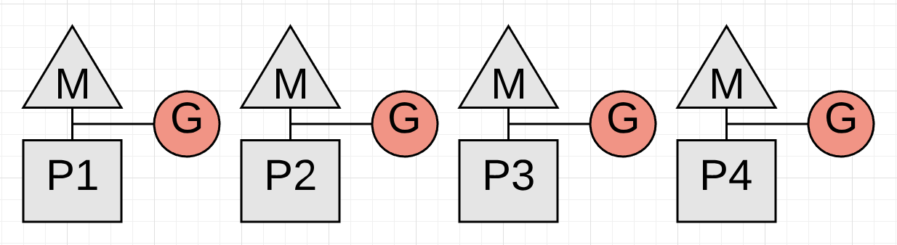
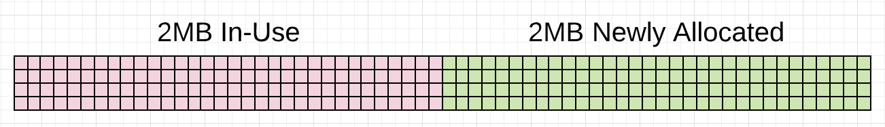

> 原文：[Garbage Collection In Go : Part I - Semantics](https://www.ardanlabs.com/blog/2018/12/garbage-collection-in-go-part1-semantics.html)

## 序言
这是讲解 Go 的垃圾回收背后的机制和语义的三部曲的第一部。本篇博文聚焦于回收器语义相关的基础知识。

三部曲的索引如下：
1. Go 的垃圾回收：第一节--语义
2. [Go 的垃圾回收：第二节 -- GC 追溯][part2]
3. [Go 的垃圾回收：第三节 -- GC 的节奏控制][part3]

## 简介
垃圾回收器肩负着追踪堆的内存分配、释放不被占用的内存和保留正被占用的内存的责任。编程语言实现这些行为的方式是复杂的，但这不应该要求应用开发者理解这些细节才能开始编写软件。况且随着不同版本的语言虚拟机或运行时的发布，这些系统的实现总是一直不断更新和进化的。对应用开发者来说，重要的是对自己所用语言的垃圾回收器的行为方式和支持这些行为的方法有一个正确的使用姿势，而无须关心具体实现。

从 1.12 版开始，Go 语言采用了一种 non-generational 且并发的三色标志和清除回收器。想要可视化地理解标志然后清除回收器的工作原理的话，Ken Fox 写了篇优秀的[文章](https://spin.atomicobject.com/2014/09/03/visualizing-garbage-collection-algorithms)且有相应动画。Go 的回收器实现随着 Go 的每次新版本发布不断变更和进化。因此，任何实现细节方面的讨论都会因新版本的发布而变得不准确。

基于以上描述，本篇博文建立的模型不会着眼于真实的实现细节，模型聚焦于我们可以体验到的和接下来几年能够期望看到的行为。我会通过这篇博文分享回收器的行为方式，然后解释如何支持这种行为方式，不用担心当前实现或将来它会如何变化。这样做可以使你成长为更好的 Go 程序猿。

> 注：如果想要了解更多垃圾回收器和 Go 的具体实现的话，参见[这里](https://github.com/ardanlabs/gotraining/tree/master/reading#garbage-collection)

## 堆不是一个容器 
我绝不会把堆看做用来存储或释放值的容器。切记内存空间没有明确定义“堆”这个概念的线性地址范围。我们可以这样认为：进程空间中所有预留给应用程序的内存都可以从堆上分配。我们的模型不关心这些堆上分配内存的虚拟或物理地址。这种思考方式有助于你更好地理解垃圾回收器的工作方式。

## 回收器的行为方式
回收工作开始后，回收器会依次进行 3 个不同阶段的工作。这 3 个阶段中的两个会带来 Stop The World (STW) 延时，而另一个则会产生降低应用吞吐量的延时。3 个阶段分别为：

- 标志前预准备 -- STW
- 标志 -- 并发执行
- 标志完成 -- STW

各个阶段剖析如下

### 标志前预准备 -- STW
回收开始后，启动写屏障（Write Barrier）是必须执行的第一项工作。写屏障的作用是使得回收器在执行回收操作时能够维持堆上数据的完整性，因为回收器和应用程序是并发运行的。

为了启动写屏障，每个正在运行的应用协程都必须暂停。这项操作是很快的，平均耗时在 10 到 30 微妙之间。当然，取得这种效果的前提是应用协程工作正常。

> 注：为了更好地理解以下调度器图解，请务必读一下关于 [Go 调度器](https://www.ardanlabs.com/blog/2018/08/scheduling-in-go-part1.html)的系列文章。

图 1


上图展示了回收开始前正在运行的 4 个应用协程。这 4 个协程都必须暂停。而暂停的唯一方式是回收器监听并等待每个协程执行函数调用。函数保证协程处于能够暂停的安全点。那如果其中一个协程没有执行函数调用而其他的都执行了呢？

图 2  


上图描述一个真实的问题。回收工作在 P4 处理器运行的协程暂停前无法启动，而这个暂停由于协程正在执行一项繁重的数学计算而无法触发。

代码片段 1  
```go
func add(numbers []int) int {
    var v int
    for _, n := range numbers {
        v += n
    }
    return v
}
```

代码片段 1 是 P4 的协程所执行的代码。受不同切片大小的影响，这个协程可能会耗费大量时间甚至不会有暂停的机会。这是一种能够推迟回收操作的代码。更糟糕的是，回收器等待期间，其他 P 无法为任何协程提供服务。协程在合理时间片内执行函数调用是非常重要的。

> 注：语言开发团队预期在 1.14 版本通过为调度器引入[抢占式](https://github.com/golang/go/issues/24543)技巧来修正。

### 标志 -- 并发执行
写屏障一旦启动，回收器即可开始标志阶段。第一项操作时回收器自己占用 25% CPU 容量。回收器借用协程来执行回收操作，依赖于和应用协程一样的 P 和 M。对于我们四协程的 Go 应用，这也就意味着一个完整的 P 会被分配专用于回收工作。

图 3  


上图显示回收器是如何把 P1 据为己有用于回收工作。现在回收器就可以开始标记阶段了。标志阶段的主要工作是标识出堆内存中被占用的变量。操作伊始会搜寻现存所有协程的栈空间以找到堆内存的根指针。然后回收器必须从这些根指针开始遍历堆内存图。P1 执行标志工作时，应用任务可以并发地在 P2、P3 和 P4 上执行。这意味着回收器的影响已经被最小化到当前 CPU 容量的 25%。

我也想到此就结束了，但是故事还得继续。在回收过程中，P1 专用于 GC 的协程没能在堆内存使用量达到上限前完成标志工作的话，怎么办？如果是 3 个协程中某一个执行的的任务导致回收器没能按时完成操作呢？这种情况下，新的内存分配必须放慢且仅针对那个相关的协程。

如果回收器断定自己需要放慢分配速度，它会招募应用协程来协助标志工作。这个操作成为 Mark Assist。应用协程用于 Mark Assist 的时间长度和它开辟的堆内存大小成正相关关系。Mark Assist 操作的正向作用是加速了回收工作。

图 4  


上图显示 P3 上的应用协程正在执行 Mark Assist 操作以协助回收工作。好在其他应用协程无须掺合进来。大量开辟内存的应用会发现多数正在运行的协程在回收过程中执行少许 Mark Assist 操作。

回收器的一项目标是消除 Mark Assist 的必要性。任何给定回收工作需要大量 Mark Assist 的话，回收器可以提前开始下一轮垃圾回收工作。这样做的目的是减少下次回收需要的 Mark Assist。

### 标志结束 -- STW
标志工作的下一阶段是标志结束阶段。这时写屏障被关闭，多项清理工作会执行，并且计算下次的回收目标。标志过程中一直执行密集循环的协程也会导致标志结束的 STW 延时加长。

图 5  


图 5 显示了标志结束阶段所有协程都被暂停的现象。平均情况下，这项活动通常会持续 60 到 90 微妙。这个阶段可以不用 STW，但借助 STW的话，代码会更加简单，况且不用 STW 增加的复杂度不值得相应的小幅受益。

一旦回收结束，每个 P 都可以重新服务于应用协程，程序再次回到满状态运行。

图 6  


图 6 显示回收结束后所有可用的 P 再次忙于处理应用任务的情形。应用恢复到回收工作开始前的满血状态。

### 清理 -- 并发执行 
回收结束后还有一个称为清理的活动。清理操作会回收堆内存中没有被标志为占用的变量所关联的内存。这项活动在应用协程试图在堆上开辟新内存时触发。清理带来的延时算在堆内存的开辟操作上，而不在垃圾回收所产生的延时。

以下是个人机器上 12 个线程用于执行协程的一个分析样本。

图 7  


图 7 展示了分析的局部快照。由图可知本次回收过程中（盯住最上面的蓝色 GC 线），12 个中的 3 个 P 专用于 GC。协程 2450、1978 和 2696 在这过程中部分时间执行了 Mark Assist 任务而不是应用任务。回收结束之际，只有一个 P 专用于 GC 且负责最后执行 STW （标记结束）的工作。

回收一旦结束，应用就回到了满状态运行。此外，我们还会可以看到这些协程下面有许多玫瑰色的线条。

图 8  


图 8 显示这些玫瑰色线条代表协程执行清理工作而不是应用任务的时间段。这些时间段里面协程试图在堆上开辟新内存。

图 9  


图 9 显示了某个协程清理活动最后的调用栈追踪记录。`runtime.mallocgc`的调用会请求在堆上开辟新内存。`runtime.(*mcache).nextFree`则会触发清理操作。一旦堆上没有可回收的内存，`nextFree`的调用就会消失了。

上述回收行为只会在垃圾回收已经开始且正在运行过程中出现。GC 百分比配置选项很大程度上决定着回收开始的时机。

## GC 百分比
运行时里面有一个称为 GC 百分比的配置选项，默认值是 100。这个值代表着下次回收开始前可以开辟的堆内存大小相对于当前的比例。GC 百分比设置为 100 意味着：参考回收结束后被标记为活跃的堆内存大小，下次回收必须在再有 100% 内存在堆上开辟之时或之前开始。

举个例子，假设现有回收工作以 2MB 被占用的堆内存收尾。

> 注：本篇博文的堆内存图解不反映使用 Go 时的真实情形。Go 的堆内存通常是碎片化且散乱的，我们看不到如图所示的清晰界限。这些图提供一个更加易于理解的方式将堆内存可视化，对我们期望的行为来说是准确的。

图 10  


图 10 显示上次回收结束时有 2MB 被占用的内存。由于 GC 百分比设为 100%，下次回收需要在多于 2MB 的堆内存被开辟之时或之前开始。

图 11  


图 11 表示现在有 2MB 多的堆内存被开辟出来了。这就会触发回收。快速查看这项行为的方式之一是为每个发生的回收生成相应的 GC 追踪记录。

## GC 追踪

运行 Go 应用过程中，我们可以设置 `GODEBUG` 环境变量包含`gctrace=1` 选项来生成 GC 追踪记录。每有一次回收发生，运行时都会把 GC 的追踪记录信息写到 `stderr`。

代码片段 2  
```bash
GODEBUG=gctrace=1 ./app

gc 1405 @6.068s 11%: 0.058+1.2+0.083 ms clock, 0.70+2.5/1.5/0+0.99 ms cpu, 7->11->6 MB, 10 MB goal, 12 P

gc 1406 @6.070s 11%: 0.051+1.8+0.076 ms clock, 0.61+2.0/2.5/0+0.91 ms cpu, 8->11->6 MB, 13 MB goal, 12 P

gc 1407 @6.073s 11%: 0.052+1.8+0.20 ms clock, 0.62+1.5/2.2/0+2.4 ms cpu, 8->14->8 MB, 13 MB goal, 12 P
```

代码片段 2 展示了如何利用`GODEBUG`变量来生成 GC 追踪记录。片段也显示了运行的 Go 应用生成的 3 条记录。

以下通过对第一条 GC 追踪记录的拆解分析来理解一条 GC 追踪记录的含义。

代码片段 3  
```bash
gc 1405 @6.068s 11%: 0.058+1.2+0.083 ms clock, 0.70+2.5/1.5/0+0.99 ms cpu, 7->11->6 MB, 10 MB goal, 12 P

// General
gc 1404     : The 1404 GC run since the program started
@6.068s     : Six seconds since the program started
11%         : Eleven percent of the available CPU so far has been spent in GC

// Wall-Clock
0.058ms     : STW        : Mark Start       - Write Barrier on
1.2ms       : Concurrent : Marking
0.083ms     : STW        : Mark Termination - Write Barrier off and clean up

// CPU Time
0.70ms      : STW        : Mark Start
2.5ms       : Concurrent : Mark - Assist Time (GC performed in line with allocation)
1.5ms       : Concurrent : Mark - Background GC time
0ms         : Concurrent : Mark - Idle GC time
0.99ms      : STW        : Mark Term

// Memory
7MB         : Heap memory in-use before the Marking started
11MB        : Heap memory in-use after the Marking finished
6MB         : Heap memory marked as live after the Marking finished
10MB        : Collection goal for heap memory in-use after Marking finished

// Threads
12P         : Number of logical processors or threads used to run Goroutines
```

代码片段 3 列举了第一条 GC 追踪记录分解所得的每个真实数字的含义。大部分这些值都会后续提及，但现在我们仅着眼于 GC 记录 1405 的内存部分。

图 12  


代码片段 4  
```bash
// Memory
7MB         : Heap memory in-use before the Marking started
11MB        : Heap memory in-use after the Marking finished
6MB         : Heap memory marked as live after the Marking finished
10MB        : Collection goal for heap memory in-use after Marking finished
```

据代码片段 4 的 GC 追踪记录显示，标志操作开始前被占用的堆内存大小为 7MB。标志操作结束后，被占用的堆内存大小来到了 11MB。这意味着回收过程中，出现了额外 4MB 的内存分配。标志结束后被标记为活跃的堆内存大小为 6MB。这也就意味着下次回收开始前，应用可以把占用的堆内存大小提高到 12MB （6MB 当前活跃堆内存大小的100%）。

我们看到回收器离目标还差 1MB。标记阶段结束时被占用的堆内存大小为 11MB 而不是 10MB。这是正确的，因为目标是基于当前所占用堆内存的大小、标记为活跃的堆内存大小和回收过程中出现的额外内存分配的耗时计算而定。当前情况下，应用做了需要在标记结束后占用比期望更多堆内存的某些工作。

我们再看看下一条 GC 追踪记录（1406）的话，会发现情况在 2ms 内的变化。

图 13  


代码片段 5  
```bash
gc 1406 @6.070s 11%: 0.051+1.8+0.076 ms clock, 0.61+2.0/2.5/0+0.91 ms cpu, 8->11->6 MB, 13 MB goal, 12 P

// Memory
8MB         : Heap memory in-use before the Marking started
11MB        : Heap memory in-use after the Marking finished
6MB         : Heap memory marked as live after the Marking finished
13MB        : Collection goal for heap memory in-use after Marking finished
```

如代码片段 5 所示，尽管堆内存大小达到 8MB，并未超过所允许的 12MB（译者注：不是 10MB 么），这次回收在前一次的 2ms （6.068s vs 6.070s）后就开始了。在此重大声明一下：如果回收器觉得提前开始回收效果更好的话，它会开始的。当前情形下，回收器提前开始工作可能是因为应用程序的内存分配繁重，使得回收器想要减少本次回收工作的 Mark Assist 的延时大小。

还有另外两个注意点：这次回收器一直在其目标范围内。标志结束后被占用的堆内存大小为 11MB 而不是 13MB，少了 2MB。标志结束后标志为活跃的堆内存大小为 6MB。

再来个温馨提示。我们可以通过添加`gcpacertrace=1`标识符来获取更多关于 GC 追踪的细节。它会使得回收器打印并发的追踪器内部的更多信息。

代码片段 6   
```bash
$ export GODEBUG=gctrace=1,gcpacertrace=1 ./app

Sample output:
gc 5 @0.071s 0%: 0.018+0.46+0.071 ms clock, 0.14+0/0.38/0.14+0.56 ms cpu, 29->29->29 MB, 30 MB goal, 8 P

pacer: sweep done at heap size 29MB; allocated 0MB of spans; swept 3752 pages at +6.183550e-004 pages/byte

pacer: assist ratio=+1.232155e+000 (scan 1 MB in 70->71 MB) workers=2+0

pacer: H_m_prev=30488736 h_t=+2.334071e-001 H_T=37605024 h_a=+1.409842e+000 H_a=73473040 h_g=+1.000000e+000 H_g=60977472 u_a=+2.500000e-001 u_g=+2.500000e-001 W_a=308200 goalΔ=+7.665929e-001 actualΔ=+1.176435e+000 u_a/u_g=+1.000000e+000
```

追踪 GC 可以让我们了解很多关于应用程序健康状态和回收节奏的信息。回收器的执行速度在回收过程中扮演者重要角色。

## 节奏调整
回收器有一个用于决定回收开始时机的节奏调整算法。算法依赖一个反馈闭环。回收器用这个闭环来收集运行的应用信息和应用施加在堆上的压力。压力可以定义为给定时间内应用开辟堆内存的速度。正是这个压力决定着回收器需要运行的节奏。

开始回收工作前，回收器会计算自己觉得完成回收所需的时间。一旦回收开始，运行的应用会有附带的延时导致减缓应用任务的执行。每次回收都会增加应用程序的总体耗时。

一个误解是觉得减缓回收的节奏是提高性能的途径之一。事实上，推迟下次回收的开始时间只是推迟了附带延时的出现时间而已。支持回收器并不是减缓这个节奏。

我们可把 GC 百分比设置为某个大于 100% 的值。这样可以增加下次回收开始前可以开辟的堆内存大小，进而减缓回收节奏。千万不要这样做。

图 14  


图 14 展示下一次回收开始前，不同 GC 百分比下所允许的新增堆内存大小。我们可以将由于等待更多堆内存被占用导致回收被减速的过程可视化。

试图直接干预回收节奏无法有效支持回收器。真正有用的是在回收操作之间或回收过程中完成更多工作。我们可以通过让所有工作在堆上减少开辟的内存大小或降低内存分配次数的方式达到想要的效果。

> 注：基本思想也即用尽可能小的堆来实现想要的吞吐量。记住咯：在云上环境运行时，最小化像堆内存这样的资源消耗是很重要的。

图 15  


代码片段 15 展示了本系列后续部分会用到的某个运行中的 Go 应用的一些数据。蓝色所示的版本表示没有任何优化的应用处理 10k 个请求的状况。绿色所示的版本表示发现并移除 4.48GB 无效内存分配后应用处理同样的 10k 个请求的状况。

观察两个版本平均回收节奏（2.08ms vs 1.96ms）。它们大致相等，差大约 2.0ms。两个版本的本质不同是回收之间所完成的工作量。应用每次回收的请求处理速度从 3.98 个涨到 7.13 个。同样回收节奏下，任务完成速度增长了 79.1%。由此可见，回收并没有因内存分配减少而减缓，而是保持了不变。收益源自两次回收之间工作量的提升。

调整回收速度来推迟延时代价并不能提高应用的性能。真正有效的是减少回收器需要运行的时间长度，进而降低附带的延时代价。回收器附带的延时代价解释完了，但容我明确地作个小结。

## 回收器延时代价
每次回收会给应用程序带来两种延时。第一个是窃取 CPU 容量。这个窃取导致应用无法在回收期间满血运行。应用协程此时和回收器协程共享 P 或协助回收工作（Mark Assist）。

图 16  


图 16 展示应用程序只能够利用 75% 的 CPU 容量来执行任务。因为回收器已经占用 P1。整个回收过程大部分时间都是这种状态。

图 17  


图 17 展示了应用此时（通常只会持续仅几微妙）只能利用一般的 CPU 容量来执行应用任务。因为 P3 的协程正在执行 Mark Assist 而回收器则占用了 P1。

> 注：对于活跃的堆内存，标志 1MB 通常耗费 4 CPU-毫秒（例如，将活跃的堆内存大小换算为 MB，除以 （0.25 * CPU 数），即可估算标志阶段耗费的毫秒数）。标志事实上以 1MB/ms 的速度运行，但只占用全部 CPU 的 1/4。

第二种延时来自回收过程中出现的 STW 延时。STW 时间区间内没有任何协程能够执行应用任务。应用本质处于暂停状态。

图 18  


图 18 展示的是 STW 时所有协程暂停的状态。每次回收都会发生两次 STW 延时。如果应用程序是健康的话，回收器应该能够把大多数回收的总 STW 时间保持在 100 微妙以下。

至此，我们了解到回收的不同阶段、内存是如何算大小的、节奏调整的方式、回收器给运行的应用带来的不同延时。有了这些知识，我们如何助攻回收器的问题可以回答了。

## 抱有怜悯之心

对回收器抱有怜悯之心要求我们减少对堆内存的压力。还记得吧：压力定义为给定时间内应用程序开辟堆内存的速度。一旦压力减轻，回收器带来的延时就会降低。正是 GC 延时拖慢你的应用程序的。

降低 GC 延时的方式是挖掘并移除应用中不必要的内存分配。这样做能够在以下几个方面帮助回收器。

有助于回收器：
- 维持尽可能小的堆内存
- 找到一个最优的连贯节奏
- 保持完成每次回收目标
- 最小化每次回收、STW 和 Mark Assist 的时长

上述所有都有助于减少回收器给应用程序增添的延时。这样做可以提高应用的性能和吞吐量。回收的节奏对此没有任何联系。以下是我们能够实施的，用来作出更好的工程决定以减轻堆压力的建议。

**理解应用程序正在执行的任务本质**  
理解任务要求我们确保自己使用合理数目的协程来完成手头的工作。 CPU 和 IO 限定的任务是不同的，需要采用不同的工程建议。

[Scheduling In Go : Part III - Concurrency](https://www.ardanlabs.com/blog/2018/12/scheduling-in-go-part3.html)

**理解定义的数据和他们在应用里的传递方式**  
理解数据意味着了解手头正在解决的问题。数据语义一致性是维护数据完整性并允许我们知道（通过阅读源代码）何时应该倾向于选择堆内存分配而不是栈内存分配。

[Design Philosophy On Data And Semantics](https://www.ardanlabs.com/blog/2017/06/design-philosophy-on-data-and-semantics.html)

## 结论
如果你花费时间聚焦于减少内存分配，你做得正是一个 Go 开发者能够帮助垃圾回收器的份内事。我们不可能写出不用分配内存的应用，因此，分辨出有效（能够帮助应用程序）的和无效（有损应用程序）的内存分配是非常重要的。然后，对垃圾回收器保持堆内存健康和程序稳定运行抱有信心和信任即可。

引入垃圾回收器是一个很漂亮的权衡。我会接受垃圾回收的代价，这样就不用困扰于内存管理的负担。Go 想要的是允许作为开发者的我们有效工作的同时写出足够快的程序。垃圾回收器是支撑这个现实的重要部分。[下一篇博文][part2] 会演示一个示例网页应用以及实地使用工具来查看细节。

[part2]: /_post/garbage-collection-in-go/part2-gctraces/
[part3]: /_post/garbage-collection-in-go/part3-gcpacing/
