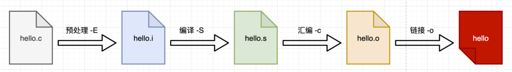
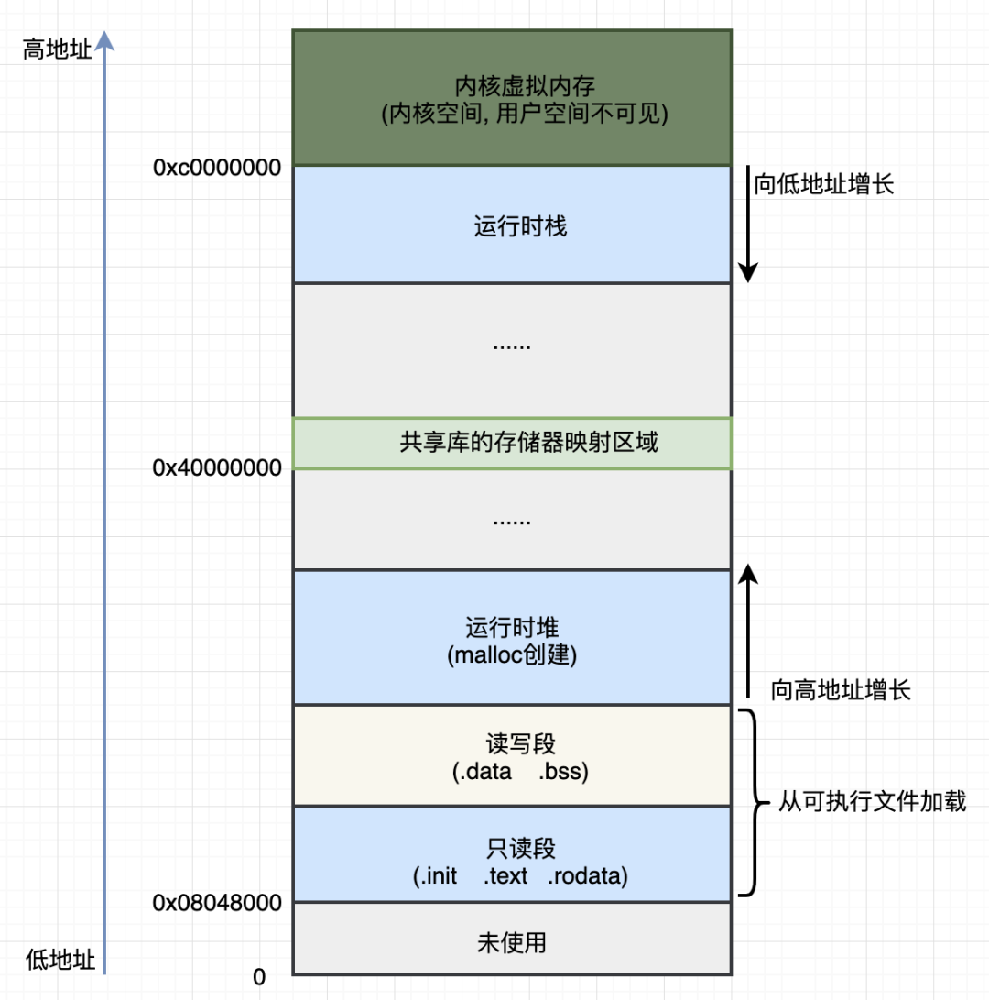
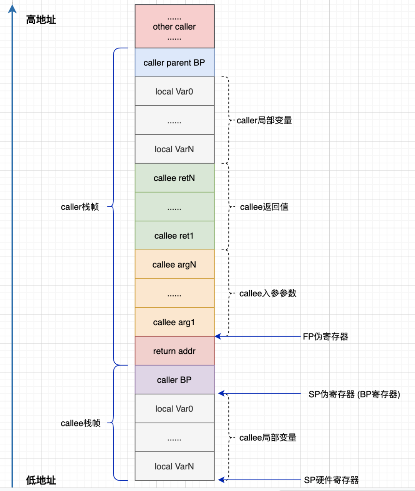
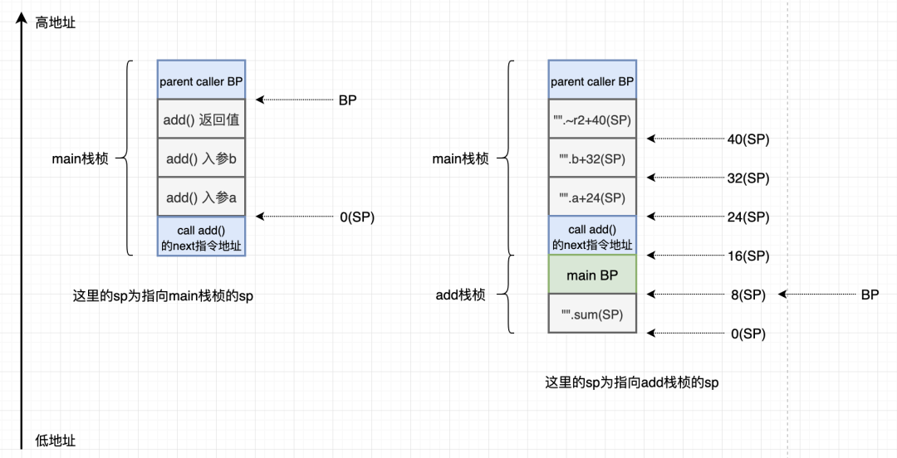

> 原文：[万字详文：Golang 汇编入门知识总结，看这一篇就够了](https://www.toutiao.com/i6871130035290374668/?tt_from=weixin&utm_campaign=client_share&wxshare_count=1&timestamp=1614597588&app=news_article&utm_source=weixin&utm_medium=toutiao_android&use_new_style=1&req_id=202103011919480101351210213C062CFC&share_token=de697031-cf45-4235-ac39-fce8a6c5f0fc&group_id=6871130035290374668)

> 本文使用 Go 版本为 1.16，具体环境是基于 golang:1.16-buster 起的容器。

## 1. 为什么需要汇编
众所周知，在计算机的世界里，只有 2 种类型：0 和 1。

计算机工作由一系列机器指令驱动。这些指令又是一组二进制数字，其对应计算机的高低电平。而这些机器指令的集合就是机器语言，这些机器语言在最底层是与硬件一一对应的。

显而易见，**机器指令有一个致命的缺点：可阅读性太差**（恐怕也只有天才和疯子才有能力把控得了）。

为了解决可读性的问题以及代码编辑的需求，最接近机器的语言应运而生：汇编语言（汇编语言更像一种助记符，这些人们容易记住的每一条助记符都映射着一条不容易记住的由 0、1 组成的机器指令。可类比域名与 IP 地址的关系）。

### 1.1 程序的编译过程
以 C 语言为例来说，从 hello.c 的源码文件到 hello 可执行文件，经过编译器处理，大致分为几个阶段：



编译器在不同的阶段会做不同的事情，但是有一步是可以确定的：源码会被编译成汇编，最后才是二进制。

## 2. 程序与进程
源码经过编译之后，得到一个二进制的可执行文件。文件这两个字也就表明，目前得到的这个文件跟其他文件对比，除了具有一定的格式（如 Linux 的 ELF 格式，即**可运行可链接**（Executable Linkable Format））的二进制组成，并没什么区别。

Linux 的文件类型大致分为 7 种：

| 标识符 | 类型         |
| -----: | :----------- |
|    `b` | 块设备文件   |
|    `c` | 字符设备文件 |
|    `d` | 目录         |
|    `-` | 普通文件     |
|    `l` | 链接         |
|    `s` | socket       |
|    `p` | 管道         |

其中标识符一列的符号为 `ls` 命令列出文件信息权限信息列（如下 go.mod 文件的 `-rw-r--r--`）的第 1 个字符

```bash
root@415bbc518ed6:/home/sammyne# ls -l
total 1992
-rw-r--r-- 1 root root      28 Mar  2 08:08 go.mod
-rwxr-xr-x 1 root root 2027872 Mar  2 08:08 hello-world
-rw-r--r-- 1 root root      72 Mar  2 08:08 main.go
```

通过上面可以看到，可执行文件 hello-world 和源码文件 main.go 都是普通文件。（在 Unix 中有一句很经典的话：一切皆文件）。

那么，问题来了：

1. 什么是程序？
2. 什么是进程？

### 2.1 程序
[维基百科](https://zh.wikipedia.org/wiki/%E8%AE%A1%E7%AE%97%E6%9C%BA%E7%A8%8B%E5%BA%8F) 告诉我们：程序是指一组指示计算机或其他具有消息处理能力设备每一步动作的指令，通常用某种程序设计语言编写，运行于某种目标体系结构上。

从某个层面来看，可以把程序分为静态程序和动态程序。
- 静态程序：单纯的指具有一定格式的可执行二进制文件。
- 动态程序：静态可执行程序文件被加载到内存之后的一种运行时模型（又称为进程）。

### 2.2 进程
首先要知道的是，**进程是分配系统资源的最小单位，线程（带有时间片的函数）是系统调度的最小单位**。进程包含线程，线程所属于进程。

创建进程一般使用 `fork` 方法（通常会有个拉起程序，先 `fork` 自身生成一个子进程。然后在该子进程中通过 `exec` 函数把对应程序加载进来，进而启动目标进程。当然，实际上要复杂得多），而创建线程则是使用 pthread 线程库。

以 32 位 Linux 操作系统为例，进程经典的虚拟内存结构模型如下图所示：



其中，有两处结构是静态程序所不具有的，那就是运行时堆（heap）与运行时栈（stack）。

**运行时堆从低地址向高地址增长**，申请的内存空间需要程序员自己或者由垃圾回收（GC）释放。运行时栈从高地址向低地址增长，内存空间在当前栈桢调用结束之后自动释放(并不是清除其所占用内存中数据，而是通过栈顶指针 `SP` 的移动来标识哪些内存是正在使用的)。

## 3. Go 汇编
对于 Go 编译器而言，其输出的结果是一种抽象可移植的汇编代码，这种汇编（Go 的汇编是基于 Plan9 的汇编）并不对应某种真实的硬件架构。Go 的汇编器会基于这种伪汇编为目标硬件生成具体的机器指令。

伪汇编这一个额外层可以带来很多好处，最主要的一点是方便将 Go 移植到新的架构。

相关的信息可以参考 Rob Pike 的 [The Design of the Go Assembler]（需要翻墙 :(）。

> 以下三段译自 Go 的官方文档 [A Quick Guide to Go's Assembler]

了解 Go 的汇编器最重要的是要知道 Go 的汇编器不是对底层机器的直接表示，即 Go 的汇编器没有直接使用目标机器的汇编指令。Go 汇编器所用的指令，一部分与目标机器的指令一一对应，而另外一部分则不是。这是因为编译器套件不需要汇编器直接参与常规的编译过程。

相反，编译器使用了一种半抽象的指令集，并且部分指令是在代码生成后才被选择的。汇编器基于这种半抽象的形式工作，所以虽然你看到的是一条 `MOV` 指令，但是工具链针对这条指令实际生成的可能完全不是一个移动指令，也许会是清除或者加载，也有可能是精确对应目标平台上同名的指令。**概括来说，特定于机器的指令会以他们的本尊出现，然而对于一些通用的操作，如内存的移动以及子程序的调用以及返回通常都做了抽象**。细节因架构不同而不一样，我们对这样的不精确性表示歉意，情况并不明确。

汇编器程序的工作是对这样半抽象指令集进行解析并将其转变为可以输入到链接器的指令。

Go 汇编使用的是 **caller-save模式**，被调用函数的入参参数、返回值都由调用者维护。因此，当需要调用一个函数时，需要先做好这些准备工作，才调用下一个函数，另外这些都需要进行内存对齐，对齐的大小是 `sizeof(uintptr)`。

### 3.1 几个概念
在深入了解 Go 汇编之前，需要知道的几个概念：

- 栈：进程、线程、goroutine 都有自己的调用栈，先进后出（FILO）
- 栈帧：可以理解是函数调用时，在栈上为函数所分配的内存区域
- 调用者：caller，比如：A 函数调用了 B 函数，那么 A 就是调用者
- 被调者：callee，比如：A 函数调用了 B 函数，那么 B 就是被调者

### 3.2 Go 的核心寄存器
go 汇编中有 4 个核心的伪寄存器，这 4 个寄存器是编译器起到维护上下文、特殊标识等作用：

| 简称 | 全称                | 作用           |
| ---- | ------------------- | -------------- |
| SB   | Static Base Pointer | 全局变量/变量  |
| FP   | Frame Pointer       | 实参和局部变量 |
| PC   | Program counter     | 跳转和分支     |
| SP   | Stack Pointer       | 栈顶           |

- FP：使用如 `symbol+offset(FP)` 的方式，引用 callee 函数的入参参数。例如 `arg0+0(FP)`，`arg1+8(FP)`，使用 FP 必须加 `symbol`，否则无法通过编译（从汇编层面来看，`symbol` 没有什么用，**加 `symbol` 主要是为了提升代码可读性**）。另外需要注意的是：往往在编写 go 汇编代码时，要站在 callee 的角度来看 FP。在 callee 看来，FP 指向的是 caller 调用 callee 时传递的第一个参数的位置。假如当前的 callee 函数是 `add`，在  `add` 的代码引用 FP，该 FP 指向的位置不在 callee 的栈帧（stack frame）之内。而是在 caller 的栈帧，指向调用 `add` 函数时传递的第一个参数的位置，经常在 callee 中用 `symbol+offset(FP)` 来获取入参的参数值。
- SB：全局静态基指针，一般用在声明函数、全局变量中。
- SP：该寄存器也是最具有迷惑性的寄存器，因为会有**伪 SP 寄存器**和**硬件 SP 寄存器**之分。Plan9 的这个伪 SP 寄存器指向当前栈帧第一个局部变量的结束位置（为什么说是结束位置，可以结合下面寄存器内存布局图来看），使用形如 `symbol+offset(SP)` 的方式，引用函数的局部变量。`offset` 的合法取值是 `[-framesize, 0)`，注意是个左闭右开的区间。假如局部变量都是 8 字节，那么第一个局部变量就可以用 `localvar0-8(SP)` 来表示。与硬件寄存器 SP 是两个不同的东西，在栈帧 size 为 0 的情况下，伪寄存器 SP 和硬件寄存器 SP 指向同一位置。手写汇编代码时，如果是 `symbol+offset(SP)` 形式，则表示伪寄存器 SP。如果是 `offset(SP)` 则表示硬件寄存器 SP。
  - 务必注意：对于编译输出（`go tool compile -S`/`go tool objdump`）的代码来讲，所有的 SP 都是硬件 SP 寄存器，无论是否带 `symbol`（这一点非常具有迷惑性，需要慢慢理解。往往在分析编译输出的汇编时，看到的就是硬件 SP 寄存器）。
- PC：实际上就是在体系结构中常见的 pc 寄存器。在 x86 平台下对应 ip 寄存器，amd64 上则是 rip。除了个别跳转之外，手写 Plan9 汇编代码时，很少用到 PC 寄存器。

还有一个后续部分会用到的伪寄存器 BP：指向当前栈帧的**栈底**（SP 指向当前栈帧的**栈顶**），函数栈的起始位置（Go 编译器会将函数栈空间自动加 8，用于存储 BP 寄存器，跳过这 8 字节后才是函数栈上局部变量的内存）。

通过上面的讲解，希望看官能够对 4 个核心寄存器的区别有了一定的认识（或者是更加的迷惑、一头雾水）。需要留意的是：分析编译输出的汇编代码时，要重点看 SP 和 SB 寄存器（FP 寄存器在这里是看不到的）。手写汇编代码时，则要重点看 FP 和 SP 寄存器。

#### 3.2.1 伪寄存器的内存模型
下图描述了栈桢与各个寄存器的内存关系模型，值得注意的是要站在 callee 的角度来看。



有一点需要注意的是：`return addr` 是在 caller 的栈上的，不过往栈上插 `return addr` 的过程是由 `CALL` 指令完成的（在分析汇编时，是看不到关于 addr 相关空间信息的。在分配栈空间时，addr 所占用空间大小不包含在栈帧内）。

在 AMD64 环境，伪 PC 寄存器其实是 IP 指令计数器寄存器的别名。伪 FP 寄存器对应的是 caller 函数的帧指针，一般用来访问 callee 函数的入参参数和返回值。伪 SP 栈指针对应的是当前 callee 函数栈帧的底部（不包括参数和返回值部分），一般用于定位局部变量。伪 SP 是一个比较特殊的寄存器，因为还存在一个同名的 SP 真寄存器，真 SP 寄存器对应栈的顶部。

编写 Go 汇编需要区分伪寄存器和真寄存器的时候只需要记住一点：**伪寄存器一般需要一个标识符和偏移量为前缀，如果没有标识符前缀则是真寄存器**。比如 `(SP)`、`+8(SP)`没有标识符前缀为真 SP 寄存器，而 `a(SP)`、`b+8(SP)`有标识符为前缀表示伪寄存器。

#### 3.2.2 几点说明
我们这里对容易混淆的几点简单进行说明：

- 伪 SP 和硬件 SP 不是一回事，在手写汇编代码时，伪 SP 和硬件 SP 的区分方法是看该 SP 前是否有 symbol。如果有 symbol，那么即为伪寄存器，如果没有，那么说明是硬件 SP 寄存器。
- 伪 SP 和 FP 的相对位置是会变的，所以不应该尝试用伪 SP 寄存器去找那些用 FP+offset 来引用的值，例如函数的入参和返回值。
- `go tool objdump`/`go tool compile -S` 输出的代码没有伪 SP 和 FP 寄存器。我们上面说的区分伪 SP 和硬件 SP 寄存器的方法，对于上述两个命令的输出结果是没法使用的。在编译和反汇编的结果中，只有真实的 SP 寄存器。
- FP 和 Go 的官方源代码里的 frame pointer 不是一回事，源代码里的 frame pointer 指的是 caller BP 寄存器的值，在这里和 caller 的伪 SP 是值是相等的。

#### 3.2.3 IA64 和 Plan9 的对应关系
在 Plan9 汇编里还可以直接使用的 amd64 的通用寄存器，应用代码层面会用到的通用寄存器主要是：`rax`、`rbx`、`rcx`、`rdx`、`rdi`、`rsi`、` r8`~`r15` 这些寄存器，虽然 `rbp` 和 `rsp` 也可以用，不过 `bp` 和 `sp` 会被用来管理栈顶和栈底，最好不要拿来进行运算。

Plan9 中使用寄存器不需要带 `r` 或 `e` 前缀，例如 `rax`，只要写 `AX` 即可：`MOVQ $101, AX = mov rax, 101`

下面是通用通用寄存器的名字在 IA64 和 Plan9 中的对应关系:

| x86_64 | `rax` | `rbx` | `rcx` | `rdx` | `rdi` | `rsi` | `rbp` | `rsp` | `r8` | `r9` | `r10` | `r11` | `r12` | `r13` | `r14` | `rip` |
| ------ | ----- | ----- | ----- | ----- | ----- | ----- | ----- | ----- | ---- | ---- | ----- | ----- | ----- | ----- | ----- | ----- |
| Plan9  | `AX`  | `BX`  | `CX`  | `DX`  | `DI`  | `SI`  | `BP`  | `SP`  | `R8` | `R9` | `R10` | `R11` | `R12` | `R13` | `R14` | `PC`  |

### 3.3 常用操作指令
下面列出了常用的几个汇编指令（指令后缀 `Q` 说明是 64 位的汇编指令）。

| 助记符指令 | 种类 | 用途           | 示例                                      |
| ---------- | ---- | -------------- | ----------------------------------------- |
| `MOVQ`     | 传送 | 数据传送       | `MOVQ 48, AX` 把 48 传送到 `AX`           |
| `LEAQ`     | 传送 | 地址传送       | `LEAQ AX, BX` 把 `AX` 有效地址传送到 `BX` |
| `PUSHQ`    | 传送 | 栈压入         | `PUSHQ AX` 将 `AX` 的内容送入栈顶位置     |
| `POPQ`     | 传送 | 栈弹出         | `POPQ AX` 弹出栈顶数据后修改栈顶指针      |
| `ADDQ`     | 运算 | 相加并赋值     | `ADDQ BX, AX` 等价于 `AX+=BX`             |
| `SUBQ`     | 运算 | 相减并赋值     | `SUBQ BX, AX` 等价于 `AX-=BX`             |
| `CMPQ`     | 运算 | 比较大小       | `CMPQ SI CX` 比较 `SI` 和 `CX` 的大小     |
| `CALL`     | 转移 | 调用函数       | `CALL runtime.printnl(SB)` 发起调用       |
| `JMP`      | 转移 | 无条件转移指令 | `JMP 0x0185` 无条件转至 0x0185 地址处     |
| `JLS`      | 转移 | 条件转移指令   | `JLS 0x0185` 左边小于右边，则跳到 0x0185  |

## 4. 汇编分析
说了那么多，看看代码吧。

### 4.1 如何输出 Go 汇编
对于写好的 go 源码，生成对应的 Go 汇编，大概有下面几种

1. 先使用 `go build -gcflags "-N -l" main.go` 生成对应的可执行二进制文件，再使用 `go tool objdump -s "main." main` 反编译获取对应的汇编。
   - 反编译时，`"main."` 表示只输出 main 包中相关的汇编，`"main.main" `则表示只输出 `main` 包中 `main` 方法相关的汇编
2. 使用 `go tool compile -S -N -l main.go` 这种方式直接输出汇编
3. 使用 `go build -gcflags="-N -l -S" main.go` 直接输出汇编

::: tip 注意事项
在使用这些命令时，加上对应的 `flag`，否则某些逻辑会被编译器优化掉，而看不到对应完整的汇编代码。标识符的作用分别为：`-l` 禁止内联，`-N` 禁止优化，`-S` 输出汇编代码。
:::

### 4.2 Go 汇编示例
go 示例代码

<!-- prettier-ignore -->
<<< @/_post/go-assembly-glimpse/codes/hello-world/main.go

编译 go 源代码，输出汇编

```bash
root@415bbc518ed6:/home/sammyne/hello-world# go tool compile -N -l -S main.go
```

截取主要汇编如下：

```bash
"".add STEXT nosplit size=60 args=0x18 locals=0x10 funcid=0x0
	0x0000 00000 (main.go:3)	TEXT	"".add(SB), NOSPLIT|ABIInternal, $16-24
	0x0000 00000 (main.go:3)	SUBQ	$16, SP
	0x0004 00004 (main.go:3)	MOVQ	BP, 8(SP)
	0x0009 00009 (main.go:3)	LEAQ	8(SP), BP
	0x000e 00014 (main.go:3)	FUNCDATA	$0, gclocals·33cdeccccebe80329f1fdbee7f5874cb(SB)
	0x000e 00014 (main.go:3)	FUNCDATA	$1, gclocals·33cdeccccebe80329f1fdbee7f5874cb(SB)
	0x000e 00014 (main.go:3)	MOVQ	$0, "".~r2+40(SP)
	0x0017 00023 (main.go:4)	MOVQ	$0, "".sum(SP)
	0x001f 00031 (main.go:5)	MOVQ	"".a+24(SP), AX
	0x0024 00036 (main.go:5)	ADDQ	"".b+32(SP), AX
	0x0029 00041 (main.go:5)	MOVQ	AX, "".sum(SP)
	0x002d 00045 (main.go:6)	MOVQ	AX, "".~r2+40(SP)
	0x0032 00050 (main.go:6)	MOVQ	8(SP), BP
	0x0037 00055 (main.go:6)	ADDQ	$16, SP
	0x003b 00059 (main.go:6)	RET
	0x0000 48 83 ec 10 48 89 6c 24 08 48 8d 6c 24 08 48 c7  H...H.l$.H.l$.H.
	0x0010 44 24 28 00 00 00 00 48 c7 04 24 00 00 00 00 48  D$(....H..$....H
	0x0020 8b 44 24 18 48 03 44 24 20 48 89 04 24 48 89 44  .D$.H.D$ H..$H.D
	0x0030 24 28 48 8b 6c 24 08 48 83 c4 10 c3              $(H.l$.H....
"".main STEXT size=110 args=0x0 locals=0x28 funcid=0x0
	0x0000 00000 (main.go:9)	TEXT	"".main(SB), ABIInternal, $40-0
	0x0000 00000 (main.go:9)	MOVQ	(TLS), CX
	0x0009 00009 (main.go:9)	CMPQ	SP, 16(CX)
	0x000d 00013 (main.go:9)	PCDATA	$0, $-2
	0x000d 00013 (main.go:9)	JLS	103
	0x000f 00015 (main.go:9)	PCDATA	$0, $-1
	0x000f 00015 (main.go:9)	SUBQ	$40, SP
	0x0013 00019 (main.go:9)	MOVQ	BP, 32(SP)
	0x0018 00024 (main.go:9)	LEAQ	32(SP), BP
	0x001d 00029 (main.go:9)	FUNCDATA	$0, gclocals·33cdeccccebe80329f1fdbee7f5874cb(SB)
	0x001d 00029 (main.go:9)	FUNCDATA	$1, gclocals·33cdeccccebe80329f1fdbee7f5874cb(SB)
	0x001d 00029 (main.go:10)	MOVQ	$1, (SP)
	0x0025 00037 (main.go:10)	MOVQ	$2, 8(SP)
	0x002e 00046 (main.go:10)	PCDATA	$1, $0
	0x002e 00046 (main.go:10)	CALL	"".add(SB)
	0x0033 00051 (main.go:10)	MOVQ	16(SP), AX
	0x0038 00056 (main.go:10)	MOVQ	AX, ""..autotmp_0+24(SP)
	0x003d 00061 (main.go:10)	NOP
	0x0040 00064 (main.go:10)	CALL	runtime.printlock(SB)
	0x0045 00069 (main.go:10)	MOVQ	""..autotmp_0+24(SP), AX
	0x004a 00074 (main.go:10)	MOVQ	AX, (SP)
	0x004e 00078 (main.go:10)	CALL	runtime.printint(SB)
	0x0053 00083 (main.go:10)	CALL	runtime.printnl(SB)
	0x0058 00088 (main.go:10)	CALL	runtime.printunlock(SB)
	0x005d 00093 (main.go:11)	MOVQ	32(SP), BP
	0x0062 00098 (main.go:11)	ADDQ	$40, SP
	0x0066 00102 (main.go:11)	RET
...
```

这里列举了一个简单的 `int` 类型加法示例，实际开发中会遇到各种参数类型，要复杂的多，这里只是抛砖引玉 :)

### 4.3 Go 汇编解析
接下来分析一下上一节输出的汇编重要核心代码。
#### 4.3.1 `add` 函数汇编解析

- `TEXT "".add(SB), NOSPLIT|ABIInternal, $16-24`
  - `TEXT "".add(SB) TEXT` 指令声明 `"".add` 是 `.text` 代码段的一部分，并表明跟在这个声明后的是函数主体。在链接期，`""`这个空字符会被替换为当前的包名，也就是说：`"".add`在链接到二进制文件后会变成 `main.add`。
  - `SB` 是一个虚拟的伪寄存器，保存静态基地址（static-base）指针，即程序地址空间的开始地址。`"".add(SB)` 表明符号位于某个固定的相对地址空间起始处的偏移位置（最终是由连接器计算得到的）。换句话来讲，它有一个直接的绝对地址，是一个全局的函数符号。
  - `NOSPLIT`向编译器表明不应该插入 stack-split 用来检查栈需要扩张的前导指令。对于 `add` 函数，编译器帮我们插入了这个标记：它足够聪明地意识到，由于 `add` 没有任何局部变量且没有自己的栈帧，所以一定不会超出当前的栈。不然，每次调用函数时，在这里执行栈检查就是完全浪费 CPU 时间。
  - `$16-24`
    - 16 = size(BP) + size(sum)
    - 24 指定调用方传入的参数和返回值的总大小（24 字节=入参 `a`、`b` 大小（8 字节）*2 + 返回值（8字节））
  - [Go 官方文档][A Quick Guide to Go's Assembler] 特地说明：通常来讲，帧大小后一般都跟随着一个参数大小，用减号分隔。(这不是一个减法操作，只是一种特殊的语法) 帧大小 `$24-8` 意味着这个函数有 24 个字节的帧以及 8 个字节的参数，位于调用者的栈帧上。如果 `NOSPLIT` 没有在 `TEXT` 中指定，则必须提供参数大小。对于 Go 原型的汇编函数，`go vet` 会检查参数大小是否正确。
- `SUBQ $16, SP`：`SP` 为栈顶指针，该语句等价于 `SP-=16`（由于栈空间是向下增长的，所以开辟栈空间时为减操作），表示生成 16 字节大小的栈空间。
- `LEAQ 8(SP), BP`：将 `8(SP)` 这个地址而不是存储的内容存储到 `BP`。`LEA` 的全称是 "Load Effective Address"。
- `MOVQ $0, "".~r2+40(SP)`
  - 此时的 `SP` 为 `add` 函数栈的栈顶指针，`40(SP)` 的位置则是 `add` 返回值的位置，该位置位于 `main` 函数栈空间内。
  - 该语句设置返回值类型的 0 值，即初始化返回值，防止得到脏数据（返回值类型为 `int`，`int` 的 0 值为 0）。
- `MOVQ "".a+24(SP)`：`AX` 从 `main` 函数栈空间获取入参 `a` 的值，存到寄存器 `AX`
  - 参数是反序传入的，所以第一个参数 `a` 和低地址的**栈顶**距离最近。
- `ADDQ "".b+32(SP)`：`AX` 从 `main` 函数栈空间获取入参 `b` 的值，与寄存器 `AX` 存储的 a 值相加，结果存到  `AX`，相当于 `AX=a+b`
- `MOVQ AX, "".~r2+40(SP)`：把 `a+b` 的结果放到 `main` 函数栈中 `add(a+b)` 返回值所在的位置
- `ADDQ $16, SP`：归还 `add` 函数占用的栈空间

#### 4.3.2 函数栈桢结构模型
[4.2 节](#_4-2-go-汇编示例) 所示汇编代码的函数栈桢结构模型如下



还记得前面提到的，Go 汇编使用的是 caller-save 模式，被调用函数的参数、返回值和栈位置都需要由调用者维护吗？

在函数栈桢结构中可以看到，`add()` 函数的入参以及返回值都由调用者 `main()` 函数维护。也正是因为如此，Go 有了其他语言不具有的，支持多个返回值的特性。

### 4.4 Go 汇编语法
这里重点讲一下函数声明、变量声明。

#### 4.4.1 函数声明
来看一个典型的 Go 汇编函数定义

```
// func add(a, b int) int
// 该add函数声明定义在同一个 package name 下的任意 .go文件中
// 只有函数头，没有实现

// add函数的Go汇编实现
// pkgname 默认是  ""
TEXT pkgname·add(SB), NOSPLIT, $16-24
    MOVQ a+0(FP), AX
    ADDQ b+8(FP), AX
    MOVQ AX, ret+16(FP)
    RET

```

> 注意：最后有一个必须的空行。

Go 汇编实现为什么是 `TEXT` 开头？仔细观察上面的进程内存布局图就会发现，我们的代码在是存储在 `.text` 段的，这里也就是一种约定俗成的起名方式。实际上在 Plan9 中 `TEXT` 是一个指令，用来定义一个函数。

定义中的 `pkgname` 可以省略（非想写也可以写上，不过写上 `pkgname` 的话，在重命名包名后还需要改代码，默认为 `""`），编译器会在链接期自动加上所属的包名称。

中点 `·` 比较特殊，是一个 unicode 的中点，该点在 mac 下的输入方法是 `option + shift + 9`。在程序被链接之后，所有的中点 `·` 都会被替换为句号 `.`，比如方法是 `runtime·main`，在编译之后的程序里的符号则是 `runtime.main`。

简单总结一下, Go 汇编实现函数声明，格式为:

```
 静态基地址（static-base）指针
                  |
                  |         add 函数入参 + 返回值总大小
                  |               |
TEXT pkgname·add(SB),NOSPLIT,$16-24
      |      |                |
函数所属包名  函数名       add 函数栈帧大小
```

- 函数栈帧大小：局部变量加上可能需要的额外调用函数的参数空间的总大小，不包括调用其它函数时的 `ret address` 的大小。
- `(SB)`：SB 是一个虚拟寄存器，保存了静态基地址（static-base）指针，即我们程序地址空间的开始地址。`"".add(SB)` 表明符号位于某个固定的相对地址空间起始处的偏移位置（最终是由链接器计算得到的）。换句话来讲，它有一个直接的绝对地址，是一个全局的函数符号。
- `NOSPLIT` 向编译器表明，不应该插入 stack-split 用来检查栈需要扩张的前导指令。对于`add` 函数，编译器帮我们插入了这个标记，它足够聪明地意识到 `add` 不会超出当前的栈，因此没必要调用函数时在这里执行栈检查。

#### 4.4.2 变量声明
汇编里的全局变量，一般是存储在 `.rodata` 或者 `.data` 段。对应到 Go 代码，就是已初始化过的全局的常量和变量。使用 `DATA` 结合 `GLOBL` 来定义一个变量。

- `DATA` 的用法为 `DATA symbol+offset(SB)/width, value`。大多数参数都是字面意思，不过这个 `offset` 需要注意：其含义是该值相对于符号 `symbol` 的偏移，而不是相对于全局某个地址的偏移。
- `GLOBL ·symbol(SB), width` 汇编指令用于定义名为 `symbol` 的全局变量，变量对应的内存宽度为 `width`，内存宽度部分必须用常量初始化。

`GLOBL` 必须跟在 `DATA` 指令之后，下面是定义了多个变量的例子：

```
DATA ·age+0(SB)/4, $8  ;; 数值 8 为 4 字节
GLOBL ·age(SB), RODATA, $4

DATA ·pi+0(SB)/8, $3.1415926 ;; 数值3.1415926为float64, 8字节
GLOBL ·pi(SB), RODATA, $8

DATA ·year+0(SB)/4, $2020 ;; 数值2020为 4字节
GLOBL ·year(SB), RODATA, $4


;; 变量 hello 使用 2 个 DATA 来定义
DATA ·hello+0(SB)/8, $"hello my" ;; `hello my` 共8个字节
DATA ·hello+8(SB)/8, $"   world" ;; `   world` 共8个字节(3个空格)
GLOBL ·hello(SB), RODATA, $16 ;; `hello my   world`  共16个字节


DATA ·hello<>+0(SB)/8, $"hello my" ;; `hello my` 共8个字节
DATA ·hello<>+8(SB)/8, $"   world" ;; `   world` 共8个字节(3个空格)
GLOBL ·hello<>(SB), RODATA, $16 ;; `hello my   world`  共16个字节
```

> 常数在 Plan9 汇编用 `$num` 表示，可以为负数，默认情况下为十进制。可以用 `$0x123` 的形式来表示十六进制数。

大部分都比较好理解，不过这里引入了新的标记 `<>`。`<>` 跟在符号名之后，表示该全局变量只在当前文件生效，类似于 C 语言的 `static`。如果在另外文件中引用该变量的话，会报 `relocation target not found` 错误。

## 5. 手写汇编实现功能
在 Go 源码中会看到一些汇编写的代码，这些代码跟其他 go 代码一起组成了整个 go 的底层功能实现。下面通过一个简单的 Go 汇编代码示例来实现两数相加功能。

### 5.1 使用 Go 汇编实现 `add` 函数

<<< @/_post/go-assembly-glimpse/codes/hello-asm/main.go{4}

Go 源码中 `add()` 函数只有函数签名，没有具体的实现。使用 Go 汇编实现的 `add()` 函数如下

<<< @/_post/go-assembly-glimpse/codes/hello-asm/add_amd64.s

::: warning 注意事项
最后有一个必须的空行。
:::

把源码与汇编代码一起编译并运行（当前场景下，这两个文件在同一个目录）

```bash
root@415bbc518ed6:/home/sammyne/hello-asm# go run -gcflags "-N -l" .
5
```

可得结果为 `5`。

### 5.2 反编译可执行程序
编译 [5.1 节](#_5-1-使用-go-汇编实现-add-函数) 的项目得到可执行程序 hello-asm，然后使用 objdump 工具进行反编译，获取汇编代码

```bash
root@415bbc518ed6:/home/sammyne/hello-asm# go build -o hello-asm -gcflags "-N -l" .
root@415bbc518ed6:/home/sammyne/hello-asm# go tool objdump -s "main." hello-asm | grep -A8 "TEXT main.add"
```

得到 `add()` 函数对应的汇编代码如下

```bash
TEXT main.add(SB) /home/sammyne/hello-asm/add_amd64.s
  add_amd64.s:3		0x45ece0		488b442408		MOVQ 0x8(SP), AX	
  add_amd64.s:4		0x45ece5		4803442410		ADDQ 0x10(SP), AX	
  add_amd64.s:6		0x45ecea		4889442418		MOVQ AX, 0x18(SP)	
  add_amd64.s:8		0x45ecef		c3			RET
```

由上可知：
- 伪寄存器 FP 只有在编写 Go 汇编代码时使用。FP 伪寄存器指向 caller 传递给 callee 的第一个参数。
- 使用 `go tool compile`/`go tool objdump` 得到的汇编看不到 FP 寄存器的踪影。

## 6. Go 调试工具
这里推荐 2 个 Go 代码调试工具。

### 6.1 gdb 调试 Go 代码
测试代码

<<< @/_post/go-assembly-glimpse/codes/hello-gdb/main.go

编译

```bash
root@415bbc518ed6:/home/sammyne/hello-gdb# go build -gcflags "-N -l" -o main
```

使用 GDB 调试

```bash
root@415bbc518ed6:/home/sammyne/hello-gdb# gdb main
GNU gdb (Debian 8.2.1-2+b3) 8.2.1
Copyright (C) 2018 Free Software Foundation, Inc.
License GPLv3+: GNU GPL version 3 or later <http://gnu.org/licenses/gpl.html>
This is free software: you are free to change and redistribute it.
There is NO WARRANTY, to the extent permitted by law.
Type "show copying" and "show warranty" for details.
This GDB was configured as "x86_64-linux-gnu".
Type "show configuration" for configuration details.
For bug reporting instructions, please see:
<http://www.gnu.org/software/gdb/bugs/>.
Find the GDB manual and other documentation resources online at:
    <http://www.gnu.org/software/gdb/documentation/>.

For help, type "help".
Type "apropos word" to search for commands related to "word"...
Reading symbols from main...done.
warning: File "/usr/local/go/src/runtime/runtime-gdb.py" auto-loading has been declined by your `auto-load safe-path' set to "$debugdir:$datadir/auto-load".
To enable execution of this file add
	add-auto-load-safe-path /usr/local/go/src/runtime/runtime-gdb.py
line to your configuration file "/root/.gdbinit".
To completely disable this security protection add
	set auto-load safe-path /
line to your configuration file "/root/.gdbinit".
For more information about this security protection see the
"Auto-loading safe path" section in the GDB manual.  E.g., run from the shell:
	info "(gdb)Auto-loading safe path"
(gdb) list
6	}
7	
8	type data struct {
9		a, b int
10	}
11	
12	func (*data) add(a, b int) int {
13		return a + b
14	}
15	
(gdb) list
16	func (*data) sub(a, b int) int {
17		return a - b
18	}
19	
20	func main() {
21		var t Ier = &data{3, 4}
22	
23		println(t.add(1, 2))
24		println(t.sub(3, 2))
25	}
(gdb) b 23 # 在源码 23 行处设置断点
Breakpoint 1 at 0x45eddf: file /home/sammyne/hello-gdb/main.go, line 23.
(gdb) r
Starting program: /home/sammyne/hello-gdb/main 
warning: Error disabling address space randomization: Operation not permitted
[New LWP 1018]
[New LWP 1019]
[New LWP 1020]

Thread 1 "main" hit Breakpoint 1, main.main () at /home/sammyne/hello-gdb/main.go:23
23		println(t.add(1, 2))
(gdb) info locals  # 显示变量
t = {tab = 0x48b108 <data,main.Ier>, data = 0xc00002a738}
(gdb) ptype t # 打印 t 的结构
type = struct runtime.iface {
    runtime.itab *tab;
    void *data;
}
(gdb) p *t.tab.inter  # 打印 t.tab.inter 指针指向的数据
$1 = {typ = {size = 16, ptrdata = 16, hash = 2491815843, tflag = 7 '\a', align = 8 '\b', fieldAlign = 8 '\b', kind = 20 '\024', equal = {void (void *, 
    void *, bool *)} 0x469b80, gcdata = 0x479f10 "\002", str = 5000, ptrToThis = 18240}, pkgpath = {bytes = 0x45f27c ""}, mhdr = {array = 0x469be0, len = 2, 
    cap = 2}}
(gdb) disass  # 显示汇编
Dump of assembler code for function main.main:
   0x000000000045ed80 <+0>:	mov    %fs:0xfffffffffffffff8,%rcx
   0x000000000045ed89 <+9>:	cmp    0x10(%rcx),%rsp
   0x000000000045ed8d <+13>:	jbe    0x45eef2 <main.main+370>
   0x000000000045ed93 <+19>:	sub    $0x70,%rsp
   0x000000000045ed97 <+23>:	mov    %rbp,0x68(%rsp)
   0x000000000045ed9c <+28>:	lea    0x68(%rsp),%rbp
   0x000000000045eda1 <+33>:	xorps  %xmm0,%xmm0
   0x000000000045eda4 <+36>:	movups %xmm0,0x28(%rsp)
...
```

常用的 gdb 调试命令有
- `run`
- `continue`
- `break`
- `backtrace` 和 `frame`
- `info break`、`info locals`
- `list`
- `print` 和 `ptype`
- `disass`

### 6.2 delve 调试代码
CLI 版和 GUI 版的项目地址分别为 [go-delve](https://github.com/go-delve/delve) 和 [gdlv](https://github.com/aarzilli/gdlv)。

dlv 的安装使用，这里不再做过多讲解，感兴趣的可以尝试一下。

- gdb 作为调试工具自是不用多说，比较老牌、强大，可以支持多种语言。
- delve 则是使用 go 语言开发的，用来调试 go 的工具，功能也是十分强大，打印结果可以显示 gdb 支持不了的东西，这里不再做过多讲解，有兴趣的可以查阅相关资料。

## 7. 总结
对于 Go 汇编基础大致需要熟悉下面几个方面：

- 进程内存布局：运行时栈、运行时堆、数据区、代码区
- 核心寄存器：PC、FP、SB、SP、BP ...
- 汇编操作指令：`SUBQ`、`MOVQ`、`ADDQ`、`CALL`...
- 汇编语法：函数、变量 ...

希望以上例子能够帮助你了解 Go 的汇编。当然，对于大部分业务开发人员来说，只要看的懂即可。如果想进一步的了解，可以阅读相关的资料或者书籍。

## 参考文献

1. [Plan9 assembly](https://github.com/cch123/golang-notes/blob/master/assembly.md)
2. [Go 函数调用 -- 栈和寄存器视角](https://segmentfault.com/a/1190000019753885)
3. [Go Assembly by Example](https://www.davidwong.fr/goasm/)
4. [Go程序的调用规约](https://juejin.im/post/6844904005630443533#heading-3)
5. [第一章: Go 汇编入门](https://github.com/go-internals-cn/go-internals/blob/master/chapter1_assembly_primer/README.md)
6. [golang 汇编](https://lrita.github.io/2017/12/12/golang-asm/)
7. [Go 汇编语言--3.1 快速入门](https://chai2010.cn/advanced-go-programming-book/ch3-asm/ch3-01-basic.html)

[The Design of the Go Assembler]: https://www.youtube.com/watch?v=KINIAgRpkDA
[A Quick Guide to Go's Assembler]: https://golang.org/doc/asm
