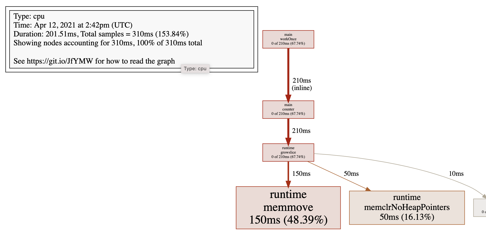
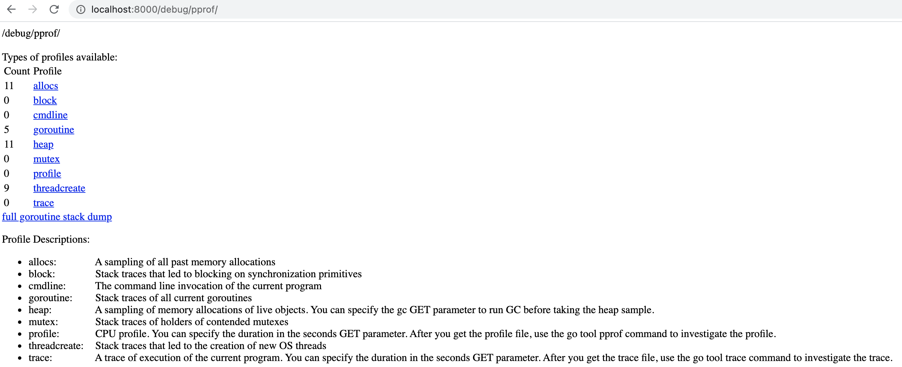
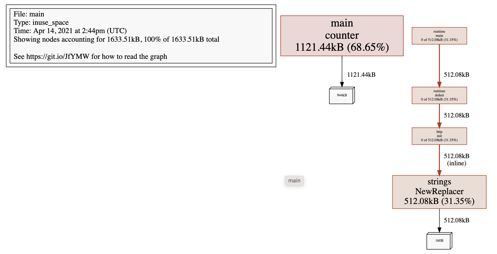
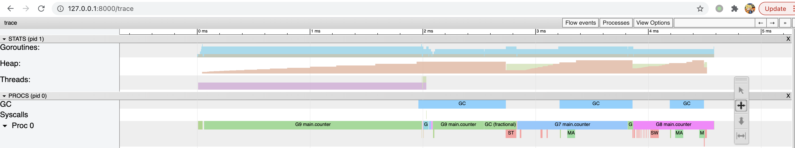
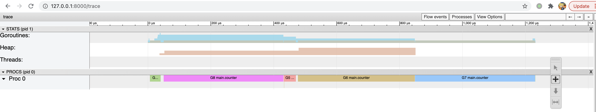
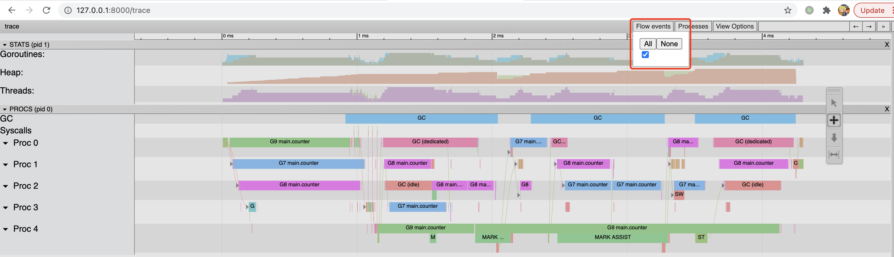
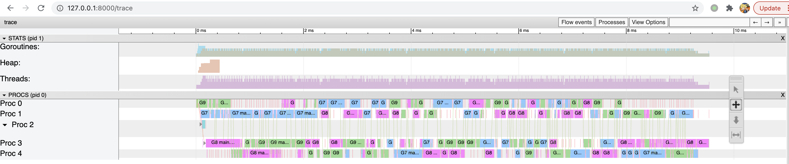
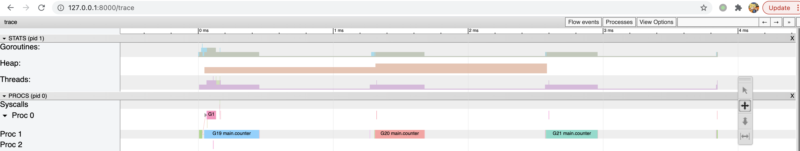

在计算机性能调试领域里，profiling 是指对应用程序的画像--应用程序使用 CPU 和内存的情况。 Go 语言是一个对性能特别看重的语言，因此语言自带了 profiling 的库。这篇文章就要讲解怎么在 golang 中做 profiling。 

本文主要如何通过程序画像对 go 程序进行性能调优，包括 pprof 和 trace 图的使用，进而通过测评结果指导调优方向。

> 演示环境为 Go 1.16.3。

## runtime/pprof

pprof 是 go 官方提供的性能测评工具，包含在 net/http/pprof 和 runtime/pprof 两个包，分别用于不同场景

- runtime/pprof 主要用于可结束的代码块，如一次编解码操作等
- net/http/pprof 是对 runtime/pprof 的二次封装，主要用于不可结束的代码块，如 web 应用等

pprof 开启后，每隔一段时间（10ms）就会收集下当前的堆栈信息，获取各个函数占用的 CPU 以及内存资源，最后通过对这些采样数据进行分析，形成一个性能分析报告。

我们先看看如何利用 runtime/pprof 进行性能测评。

下列代码循环向一个列表尾部添加元素。导入 runtime/pprof 并添加两段测评代码（补充具体行号）就可以实现 CPU 和内存的性能评测。

```go
// counter_v1.go
package main

import (
	"flag"
	"log"
	"os"
	"runtime/pprof"
	"sync"
)

var (
	cpu string
	mem string
)

func init() {
	flag.StringVar(&cpu, "cpu", "", "write cpu profile to file")
	flag.StringVar(&mem, "mem", "", "write mem profile to file")
}

func main() {
	flag.Parse()

	//采样 CPU 运行状态
	if cpu != "" {
		f, err := os.Create(cpu)
		if err != nil {
			log.Fatal(err)
		}
		_ = pprof.StartCPUProfile(f)
		defer pprof.StopCPUProfile()
	}

	var wg sync.WaitGroup
	wg.Add(100)
	for i := 0; i < 100; i++ {
		go workOnce(&wg)
	}
	wg.Wait()

	//采样内存状态
	if mem != "" {
		f, err := os.Create(mem)
		if err != nil {
			log.Fatal(err)
		}
		_ = pprof.WriteHeapProfile(f)
		f.Close()
	}
}

func counter() {
	slice := make([]int, 0)
	var c int
	for i := 0; i < 100000; i++ {
		c = i + 1 + 2 + 3 + 4 + 5
		slice = append(slice, c)
	}
	_ = slice
}

func workOnce(wg *sync.WaitGroup) {
	counter()
	wg.Done()
}
```

编译并执行获得 pprof 的采样数据，然后利用相关工具进行分析。

```bash
go build -o app counter_v1.go
./app --cpu=cpu.pprof
./app --mem=mem.pprof
```

至此就可以获得 cpu.pprof 和 mem.pprof 两个采样文件，然后利用 `go tool pprof` 工具进行分析如下。

```bash
go tool pprof cpu.pprof
Type: cpu
Time: Apr 12, 2021 at 10:42pm (CST)
Duration: 201.51ms, Total samples = 310ms (153.84%)
Entering interactive mode (type "help" for commands, "o" for options)
(pprof) top
Showing nodes accounting for 310ms, 100% of 310ms total
Showing top 10 nodes out of 58
      flat  flat%   sum%        cum   cum%
     150ms 48.39% 48.39%      150ms 48.39%  runtime.memmove
      50ms 16.13% 64.52%       50ms 16.13%  runtime.memclrNoHeapPointers
      50ms 16.13% 80.65%       50ms 16.13%  runtime.usleep
      10ms  3.23% 83.87%       10ms  3.23%  runtime.madvise
      10ms  3.23% 87.10%       10ms  3.23%  runtime.markBits.isMarked
      10ms  3.23% 90.32%       10ms  3.23%  runtime.procyield
      10ms  3.23% 93.55%       10ms  3.23%  runtime.pthread_cond_wait
      10ms  3.23% 96.77%       10ms  3.23%  runtime.pthread_kill
      10ms  3.23%   100%       10ms  3.23%  runtime.scanobject
         0     0%   100%      210ms 67.74%  main.counter
(pprof)
```

相关字段如下（`Type` 和 `Time` 字段就不过多解释了）：

|       字段 | 说明                                                                                                                                                    |
| ---------: | :------------------------------------------------------------------------------------------------------------------------------------------------------ |
|   Duration | 程序执行时间。本例中 go 自动分配任务给多个核执行程序，总计耗时 201.51ms，而采样时间为 310ms；也就是说假设有 10 核执行程序，平均每个核采样 31ms 的数据。 |
|    (pprof) | 命令行提示。表示当前正在执行 go 的 pprof 工具命令行中，其他工具有 cgo、doc、pprof、test2json、trace 等                                                  |
|        top | pprof 的指令之一，显示 pprof 文件的前 10 项数据，可以通过 top 20 等方式显示前 20 行数据。pprof 还有很多指令，例如 list、pdf、eog 等等                   |
| flat/flat% | 分别表示在当前层级的 CPU 占用时间和百分比。例如 `runtime.memmove` 在当前层级占用 CPU 时间 150ms，占比本次采集时间的 48.39%                              |
|   cum/cum% | 分别表示截止到当前层级累积的 CPU 时间和占比。例如 `main.counter` 累积占用时间 210ms，占本次采集时间的 67.74%                                            |
|       sum% | 所有层级的 CPU 时间累积占用，从小到大一直累积到 100%，即 310ms                                                                                          |

由上图的 `cum` 数据可以看到，`counter` 函数的 CPU 占用时间最多。接下来可利用 `list` 命令查看占用的主要因素如下

```bash
(pprof) list main.counter
Total: 310ms
ROUTINE ======================== main.counter in /Users/sammy/Workspaces/github.com/sammyne/go-profiling/code/counter_v1.go
         0      210ms (flat, cum) 67.74% of Total
         .          .     52:func counter() {
         .          .     53:   slice := make([]int, 0)
         .          .     54:   var c int
         .          .     55:   for i := 0; i < 100000; i++ {
         .          .     56:           c = i + 1 + 2 + 3 + 4 + 5
         .      210ms     57:           slice = append(slice, c)
         .          .     58:   }
         .          .     59:   _ = slice
         .          .     60:}
         .          .     61:
         .          .     62:func workOnce(wg *sync.WaitGroup) {
(pprof)
```

可见，程序的 57 行分别占用 210ms，这就是优化的主要方向。通过分析程序发现，由于切片的初始容量为 0，导致循环 `append` 时触发多次扩容。切片的扩容方式是：申请 2 倍或者 1.25 倍的原来长度的新切片，再将原来的切片数据拷贝进去。

仔细一看还会发现：`runtime.usleep` 占用 CPU 时间将近 16.13%，但是程序明明没有任何 sleep 相关的代码，却为什么会出现，并且还占用这么高呢？大家可以先思考一下，后文将揭晓。

当然，也可以使用 `web` 命令获得更加直观的信息。macOS 通过如下命令安装渲染工具 graphviz。

```bash
brew install graphviz
```

安装完成后，在 pprof 的命令行输入 `svg` 即可生成一个 svg 格式的文件，将其用浏览器打开即可看到 [此图](./images/counter1.svg)。

<!--

-->

由于文件过大，此处只截取部分重要内容如下。



可以看出其基本信息和命令行下的信息相同，但是可以明显看出 `runtime.memmove` 耗时 380ms。由图逆向推断 `main.counter` 是主要的优化方向。图中各个方块的大小也代表 CPU 占用的情况，方块越大说明占用 CPU 时间越长。

同理可以分析 mem.pprof 文件，从而得出内存消耗的主要原因进一步进行改进。

上述 `main.counter` 占用 CPU 时间过多的问题，实际上是 `append` 函数重新分配内存造成的。那简单的做法就是事先申请一个大的内存，避免频繁的进行内存分配。所以将 `counter` 函数进行改造：

```go
func counter() {
	var slice [100000]int
	var c int
	for i := 0; i < 100000; i++ {
		c = i + 1 + 2 + 3 + 4 + 5
		slice[i] = c
	}
	_ = slice
}
```

通过编译、运行、采集 pprof 信息后如下图所示。

```bash
➜  code git:(main) ✗ go build -o app counter_v2.go
➜  code git:(main) ✗ ./app --cpu=cpu.pprof
➜  code git:(main) ✗ go tool pprof cpu.pprof
Type: cpu
Time: Apr 14, 2021 at 10:04pm (CST)
Duration: 200.52ms, Total samples = 0
No samples were found with the default sample value type.
Try "sample_index" command to analyze different sample values.
Entering interactive mode (type "help" for commands, "o" for options)
(pprof)
```

可见，已经采集不到占用 CPU 比较多的函数，即已经完成优化。同学们可以试试如果往 `counter` 添加一个 `fmt.Println` 函数后，对 CPU 占用会有什么影响呢？

## net/http/pprof

针对后台服务型应用，服务一般不能停止，这时需要使用 net/http/pprof 包。类似上述代码，编写如下代码：

```go
// +build ignore

package main

import (
	"net/http"
	_ "net/http/pprof"
	"time"
)

var hello []int

func counter() {
	slice := make([]int, 0)
	c := 1
	for i := 0; i < 100000; i++ {
		c = i + 1 + 2 + 3 + 4 + 5
		slice = append(slice, c)
	}
	// 个人实验时，加上这行貌似可以防止 slice 被优化掉，导致无法统计到期望的内存概况
	hello = slice
}

func workForever() {
	for {
		go counter()
		time.Sleep(1 * time.Second)
	}
}

func httpGet(w http.ResponseWriter, r *http.Request) {
	counter()
}

func main() {
	go workForever()
	http.HandleFunc("/get", httpGet)
	http.ListenAndServe("localhost:8000", nil)
}
```

首先导入 net/http/pprof 包。注意该包利用下划线 `_` 导入，意味着只需要该包运行其 `init()` 函数即可。这样之后，该包将自动完成信息采集并保存到内存。所以服务上线时需要将 net/http/pprof 包移除，避免其影响服务的性能，更重要的是防止其造成内存的不断上涨。

编译并运行依赖，便可以访问：http://localhost:8000/debug/pprof/ 查看服务的运行情况。本文实验得出如下示例，大家可以自行探究查看。不断刷新网页可以发现采样结果也在不断更新中。



当然也可以网页形式查看。现在以查看内存为例，在服务程序运行时，执行下列命令采集内存信息。

```bash
# main 表示编译生成的可执行文件
go tool pprof main http://localhost:8000/debug/pprof/heap
```

采集完成后调用 svg 命令得到如下 svg 文件

```bash
go tool pprof main http://localhost:8000/debug/pprof/heap
Fetching profile over HTTP from http://localhost:8000/debug/pprof/heap
Saved profile in /root/pprof/pprof.main.alloc_objects.alloc_space.inuse_objects.inuse_space.005.pb.gz
File: main
Type: inuse_space
Time: Apr 14, 2021 at 2:44pm (UTC)
Entering interactive mode (type "help" for commands, "o" for options)
(pprof) svg
Generating report in profile001.svg
(pprof)
```



该图表明所有的堆空间均由 `counter` 产生，同理可以生成 CPU 的 svg 文件用于同步进行分析优化方向。

上述方法在工具型应用可以使用，然而在服务型应用时，仅仅只是采样了部分代码段；而只有当有大量请求时才能看到应用服务的主要优化信息。

另外，Uber 开源的火焰图工具 [go-torch] 也能辅助我们直观地完成测评。感兴趣的话，请自行学习。

值得注意的是：pprof 也会使用堆空间，所以在服务上线时应该将 pprof 关闭。

## trace

trace 工具也是 go 工具之一，能够辅助我们跟踪程序的执行情况，进一步方便我们排查问题，往往配合 pprof 使用。trace 的使用和 pprof 类似，为了简化分析，我们首先利用下列代码进行讲解，只是用单核核运行程序：

```go
// +build ignore

package main

import (
	"flag"
	"log"
	"os"
	"runtime"
	"runtime/trace"
	"sync"
)

var hello []int

func counter(wg *sync.WaitGroup) {
	defer wg.Done()

	slice := []int{0}
	c := 1
	for i := 0; i < 100000; i++ {
		c = i + 1 + 2 + 3 + 4 + 5
		slice = append(slice, c)
	}
	hello = slice
}

func main() {
	runtime.GOMAXPROCS(1)

	var traceProfile = flag.String("traceprofile", "trace.pprof", "write trace profile to file")
	flag.Parse()

	if *traceProfile != "" {
		f, err := os.Create(*traceProfile)
		if err != nil {
			log.Fatal(err)
		}
		trace.Start(f)
		defer f.Close()
		defer trace.Stop()
	}

	var wg sync.WaitGroup
	wg.Add(3)
	for i := 0; i < 3; i++ {
		go counter(&wg)
	}
	wg.Wait()
}
```

同样，通过编译、执行和如下指令得到 trace 图：

```bash
go tool trace -http=127.0.0.1:8000 trace.pprof
```



图像的查看依赖 Chrome 浏览器。如果依旧无法查看改图像，MacOS 请按照下述方法进行操作

1. 登录 google 账号，访问 https://developers.chrome.com/origintrials/#/register_trial/2431943798780067841，其中 web Origin 字段为此后你需要访问的 web 网址，例如我使用的 127.0.0.1:8000。如此你将获得一个 Active Token 并复制下来。
2. 在 go 的安装目录 `$GOROOT/src/cmd/trace/trace.go` 文件找到元素范围，并添加
3. 在该目录下分别执行 go build 和 go install，此后重启 Chrome 浏览器即可查看上图。

上图有几个关键字段，分别介绍如下：

|       字段 | 说明                                                                                                                                                |
| ---------: | :-------------------------------------------------------------------------------------------------------------------------------------------------- |
| Goroutines | 运行中的协程数量；通过点击图中颜色标识可查看相关信息，可以看到在大部分情况下可执行的协程会很多，但是运行中的只有 0 个或 1 个，因为我们只用了 1 核。 |
|       Heap | 运行中使用的总堆内存；因为此段代码是有内存分配缺陷的，所以 heap 字段的颜色标识显示堆内存在不断增长中。                                              |
|    Threads | 运行中系统进程数量；很显然只有 1 个。                                                                                                               |
|         GC | 系统垃圾回收；在程序的末端开始回收资源。                                                                                                            |
|   Syscalls | 系统调用；由上图看到在 GC 开始只有很微少的一段。                                                                                                    |
|      Proc0 | 系统进程，与使用的处理器的核数有关，1 个。                                                                                                          |

另外由图可知，程序的总运行时间约 4ms。在 Proc0 轨道上，不同颜色代表不同协程，各个协程都是串行的，执行 `counter` 函数的有 G6、G7 和 G8 协程，同时 Goroutines 轨道上的协程数量也相应在减少。伴随着协程的结束，GC 也会将内存回收，另外 GC 过程出现了 STW（stop the world）过程，这对程序的执行效率会有极大的影响。STW 过程会将整个程序通过 sleep 停止下来，所以前文出现的 `runtime.usleep` 就是此时由 GC 调用的。

下面我们使用多个核来运行，只需要改动 GOMAXPROCS 即可，例如修改成 5 并获得 trace 图：

```go
runtime.GOMAXPROCS(5)
```

TODO（结果无法复现）：从上图可以看到，3 个 counter 协程在每个核上都有执行，同时程序的运行时间为 TODO（目前实际时间变化不大，甚至增加），运行时间大大降低，可见提高 cpu 核数是可以提高效率的，但是也不是所有场景都适合提高核数，还是需要具体分析。同时为了减少内存的扩容，同样可以预先分配内存，获得 trace 图如下所示：



由上图看到，由于我们提前分配好足够的内存，系统不需要进行多次扩容，进而进一步减小开销。从 slice 的源码中看到其实现中包含指针，即其内存是堆内存，而不是 C/C++ 中类似数组的栈空间分配方式。另外也能看到程序的运行时间为 0.18ms，进一步提高运行速度。

另外，trace 图还有很多功能，例如查看事件的关联信息等等，通过点击 `Flow events/All` 即可生成箭头表示相互关系，大家可以自己探究一下其他功能。



如果我们对 `counter` 函数的循环中加上锁会发生什么呢？

```go
func counter(wg *sync.WaitGroup, mtx *sync.Mutex) {
	defer wg.Done()

	slice := make([]int, 0, 100000)
	c := 1
	for i := 0; i < 100000; i++ {
		mtx.Lock()
		c = i + 1 + 2 + 3 + 4 + 5
		slice = append(slice, c)
		mtx.Unlock()
	}
	hello = slice
}
```

生成 trace 图如下：



可以看到程序运行的时间又增加了，主要是由于加/放锁使得 `counter` 协程的执行时间变长。~~但是并没有看到不同协程对 CPU 占有权的切换呀？这是为什么呢？主要是这个协程运行时间太短，而相对而言采样的频率低、粒度大，导致采样数据比较少。~~ 如果在程序中人为 sleep 一段时间，提高采样数量可以更加真实反映 CPU 占有权的切换。

如果对 go 协程加锁呢？

```go
for i := 0; i < 3; i++ {
	mtx.Lock()
	go counter(&wg)
	time.Sleep(time.Millisecond)
	mtx.Unlock()
}
```

从得到的 trace 图可以看出，CPU 主要时间都是在睡眠等待中，所以在程序中应该减少此类 sleep 操作。



trace 图可以非常完整地跟踪程序的整个执行周期，所以大家可以从整体到局部分析优化程序。

我们可以先使用 pprof 完成初步的检查和优化，主要是 CPU 和内存，而 trace 主要是用于分析各个协程的执行关系，从而优化结构。

本文主要讲解了一些性能评测和 trace 的方法，仍然比较浅显，更多用法大家可以自己去探索。

## 参考文献

- [Go 性能优化](https://studygolang.com/articles/23047)
- [golang 系列—性能评测之 pprof+火焰图+trace](https://zhuanlan.zhihu.com/p/141640004)
- [Go 语言之 pprof 的性能调优”燥起来“](https://zhuanlan.zhihu.com/p/301065345)

[go-torch]: https://github.com/uber-archive/go-torch
