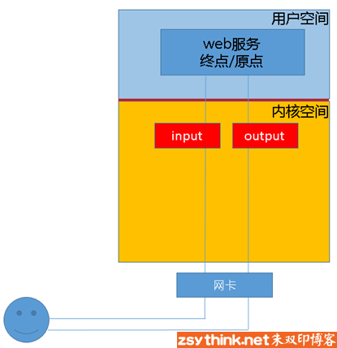
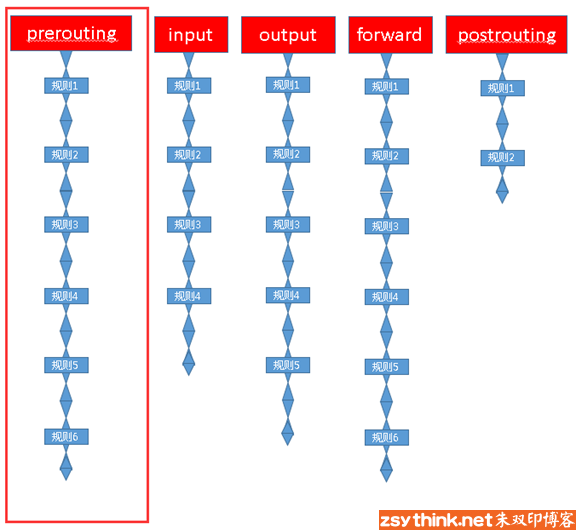
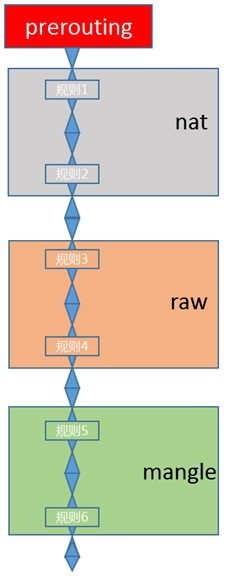
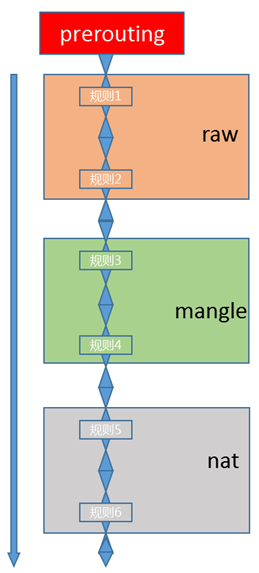

这篇文章会尽量以通俗易懂的方式描述 iptables 的相关概念，请耐心的读完它。
 
## 防火墙相关概念
 
此处先描述一些相关概念。

从逻辑上讲。防火墙可以大体分为以下两种
- **主机防火墙**：针对于单个主机进行防护
- **网络防火墙**：往往处于网络入口或边缘，针对于网络入口进行防护，服务于防火墙背后的本地局域网

网络防火墙和主机防火墙并不冲突。可以理解为，网络防火墙主外（集体），主机防火墙主内（个人）。

从物理上讲，防火墙可以分为
- **硬件防火墙**：在硬件级别实现部分防火墙功能，另一部分功能基于软件实现，性能高，成本高
- **软件防火墙**：应用软件处理逻辑运行于通用硬件平台之上的防火墙，性能低，成本低。

那么至此，我们就来聊聊 Linux 的 iptables。

**iptables** 其实不是真正的防火墙，可以理解成一个客户端代理。用户通过 iptables 这个代理，将用户的安全设定执行到对应的"安全框架"。这个"安全框架"才是真正的防火墙，这个框架的名字叫 **netfilter**。

netfilter 才是防火墙真正的安全框架，位于内核空间。

iptables 其实是一个位于用户空间的命令行工具，用于操作真正的框架。

netfilter/iptables（下文中简称为 iptables）组成 Linux 平台下的包过滤防火墙。与大多数的 Linux 软件一样，这个包过滤防火墙是免费的。它可以代替昂贵的商业防火墙解决方案，完成封包过滤、封包重定向和网络地址转换（NAT）等功能。

Netfilter 是 Linux 操作系统核心层内部的一个数据包处理模块，它具有如下功能：
- 网络地址转换（Network Address Translate）
- 数据包内容修改
- 数据包过滤的防火墙功能

所以说，虽然我们使用 `service iptables start` 启动 iptables "服务"，但是其实准确来说，iptables 并没有一个守护进程，所以并不能算是真正意义上的服务，而应该算是内核提供的功能。

## iptables 基础
我们知道 iptables 是按照规则来办事的，我们就来说说规则（rules）。规则其实就是网络管理员预定义的条件，一般的定义为"如果数据包头符合这样的条件，就这样处理这个数据包"。规则存储在内核空间的 **信息包过滤表**，分别指定源地址、目的地址、传输协议（如 TCP、UDP、ICMP）和服务类型（如 HTTP、FTP 和 SMTP）等。当数据包与规则匹配时，iptables 会根据规则所定义的方法来处理这些数据包，如放行（accept）、拒绝（reject）和丢弃（drop）等。配置防火墙的主要工作就是对这些规则的增删改查。

这样说可能并不容易理解，我们换个角度从头说起.

当客户端访问服务器的 web 服务时，客户端发送报文到网卡。而 TCP/IP 协议栈是属于内核的一部分，所以客户端的信息会通过内核的 TCP 协议传输到用户空间的 web 服务。此时，客户端报文的目标终点为 web 服务所监听的套接字（IP:PORT）。当 web 服务需要响应客户端请求时，其响应报文的目标终点则为客户端。这时，web 服务所监听的 IP 与端口反而变成了原点。我们说过，内核中的 netfilter 才是真正的防火墙。因此，如果想要防火墙能够达到"防火"的目的，则需要在内核设置关卡，使得所有进出的报文都要经过这些关卡检查：符合放行条件的才能放行，符合阻拦条件的则需要被阻止。于是，就出现了 input 关卡和 output 关卡，而这些关卡在 iptables 中不被称为"关卡",而被称为 **"链"**。



其实前面描述的场景并不完善：因为客户端发来的报文访问的目标地址可能并不是本机，而是其他服务器。当本机的内核支持 `IP_FORWARD` 时，我们可以将报文转发给其他服务器，所以，这时就会涉及 iptables 的其他"关卡"，也就是其他"链"，他们分别是 "路由前"（PREROUTING）、"转发"（FORWARD）、"路由后"（POSTROUTING）。

也就是说，防火墙功能启用后，报文需要经过如下图所示的关卡


根据实际情况的不同，报文经过"链"可能不同。需要转发的报文不会经过 input 链发往用户空间，而直接在内核空间中经过 forward 链和 postrouting 链转发出去。

根据上图，我们能够想象出某些常用场景的报文流向：

|                                     场景 | 报文流向                               |
| ---------------------------------------: | :------------------------------------- |
|                       到本机某进程的报文 | PREROUTING --> INPUT                   |
|                         由本机转发的报文 | PREROUTING --> FORWARD --> POSTROUTING |
| 由本机的某进程发出报文（通常为响应报文） | OUTPUT --> POSTROUTING                 |

## 链的概念
现在再来研究一下：这些"关卡"在 iptables 中为什么被称作"链"呢？我们知道，防火墙的作用就在于对经过的报文匹配"规则"，然后执行对应的"动作"。所以报文经过这些关卡的时候，必须匹配这个关卡上的规则。但是这个关卡可能不止有一条规则，而是有很多条规则。把这些规则串到一个链条上就形成了"链"。因此，我们把每一个"关卡"想象成如下图的模样。



这样来说，把他们称为"链"更为合适。每个经过这个"关卡"的报文，都要将这条"链"上的所有规则匹配一遍。如果有符合条件的规则，则执行规则对应的动作。

## 表的概念
我们再想想另外一个问题：每个"链"都放置了一串规则，但是这些规则有些很相似。比如，A 类规则都是对 IP 或者端口的过滤，B 类规则是修改报文。这时，我们能否把实现相同功能的规则放在一起呢？必须能的。

我们把具有相同功能的规则的集合叫做 **"表"**。不同功能的规则可以放置在不同的表进行管理。而 iptables 已经定义了 4 种表，每种表分别对应不同的功能。而我们定义的规则也都逃脱不了这 4 种功能的范围。因此，学习 iptables 之前，我们必须先搞明白每种表的作用。

iptables 提供了如下规则的分类，或者说，iptables 提供了如下"表"

| 表     | 功能                            | 内核模块        |
| ------ | ------------------------------- | --------------- |
| filter | 过滤，防火墙                    | iptables_filter |
| nat    | 网络地址转换                    | iptable_nat     |
| mangle | 拆解报文，做出修改，并重新封装  | iptable_mangle  |
| raw    | 关闭 nat 表上启用的连接追踪机制 | iptable_raw     |

::: tip 温馨提示
nat 的全称为 network address translation。
:::

我们自定义的所有规则都是这四种分类中的规则，或者说，所有规则都存在于这 4 张"表"中。

## 表链关系
但是我们需要注意的是，某些"链"中注定不会包含"某类规则"，就像某些"关卡"天生就不具备某些功能一样。比如，A "关卡"只负责打击陆地敌人，没有防空能力；B "关卡"只负责打击空中敌人，没有防御步兵的能力；C "关卡"可能比较 NB，既能防空，也能防御陆地敌人；D "关卡"最屌，海陆空都能防。

那让我们来看看每个"关卡"都有哪些能力，或者说每个"链"上的规则都存在于哪些"表"。

依然以图为例，先看看 prerouting "链"的规则都存在于哪些表。

::: warning 注意
下图只用于说明 prerouting 链上的规则存在于哪些表，并没有描述表的顺序。
:::



这幅图是什么意思呢？它的意思是说，prerouting "链"只拥有 nat 表、raw 表和 mangle 表所对应的功能。所以 prerouting 的规则只能存放于 nat 表、raw 表和 mangle 表。

依此类推，每个"关卡"的功能总结如下

|          链 | raw 表             | mangle 表          | nat 表             | filter 表          |
| ----------: | ------------------ | ------------------ | ------------------ | ------------------ |
|  PREROUTING | :white_check_mark: | :white_check_mark: | :white_check_mark: |
|       INPUT |                    | :white_check_mark: |                    | :white_check_mark: |
|     FORWARD |                    | :white_check_mark: |                    | :white_check_mark: |
|      OUTPUT | :white_check_mark: | :white_check_mark: | :white_check_mark: | :white_check_mark: |
| POSTROUTING |                    | :white_check_mark: | :white_check_mark: |

::: danger 注意
对于 INPUT 链，CentOS 7 还有 nat 表，CentOS 6 没有。
:::
 
然而，**实践中往往是通过"表"作为操作入口，对规则进行定义**。之所以按照上述过程介绍 iptables，是因为从"关卡"的角度更容易理解。但是为了以便在实际使用时更加顺畅地理解它们，此处我们还要将各"表"与"链"的关系罗列出来，

|     表 | 链（钩子）                                                            |
| -----: | :-------------------------------------------------------------------- |
|    raw | PREROUTING，OUTPUT                                                    |
| mangle | PREROUTING，INPUT，FORWARD，OUTPUT，POSTROUTING                       |
|    nat | PREROUTING，OUTPUT，POSTROUTING（CentOS 7 还有 INPUT，CentOS 6 没有） |
| filter | INPUT，FORWARD，OUTPUT                                                |

还有一点需要注意：因为数据包经过一个"链"的时候，会将当前链的所有规则都匹配一遍。但是匹配时总是先后逐条匹配的，而相同功能类型的规则会汇聚在一张"表"。那么哪些"表"中的规则会放在"链"的最前面执行呢？这时候就涉及优先级的问题，依然以 prerouting "链"为例。



prerouting 链中的规则存放于三张表，而这三张表中的规则执行的优先级如下（高优先级在前）：

```text
raw > mangle > nat
```

iptables 总共定义了 4 张"表"。当他们处于同一条"链"时，执行的优先级由高到低依次为

```text
raw > mangle > nat > filter
```

然而，某些链天生就不能使用某些表的规则。所以，4 张表 的规则处于同一条链的目前只有 output 链。它就是传说中海陆空都能防守的关卡。

为了便于管理，我们还可以在某个表里面创建自定义链，将针对某个应用程序所设置的规则放置在这个自定义链。但是**自定义链接不能直接使用，只能被某个默认的链当做动作去调用才能起作用**。可以这样认为：自定义链就是一段比较"短"的链子。这条"短"链子上的规则都是针对某个应用程序制定的，并不能直接使用，需要"焊接"到 iptables 默认定义链子，才能被 iptables 使用。这就是默认定义的"链"需要把"自定义链"当做"动作"去引用的原因。这是后话，后面再聊，在实际使用时我们能够更好地体会。

## 数据经过防火墙的流程
结合上述所有的描述，我们可以将数据包通过防火墙的流程总结为下图：


写 iptables 规则的时候，要时刻牢记这张路由次序图，灵活配置规则。

## 规则的概念
上述描述多次提及规则，可是没有细说，现在说说它。

先说说规则的概念，然后再通俗的解释它。

::: tip 规则
根据指定的匹配条件来尝试匹配每个流经此处的报文，一旦匹配成功，则由规则后面指定的处理动作进行处理
:::

我们通俗地解释一下什么是 iptables 的规则。之前打过一个比方，每条"链"都是一个"关卡"，每个通过这个"关卡"的报文都要匹配这个关卡上的规则：如果匹配，则对报文进行对应的处理。比如说，你我二人此刻就好像两个"报文"，你我二人此刻都要入关。可是城主有命，只有器宇轩昂的人才能入关，不符合此条件的人不能入关。于是守关将士按照城主制定的"规则"，开始打量你我二人。最终，你顺利入关了，而我已被拒之门外。因为你符合"器宇轩昂"的标准，所以把你"放行"了，而我不符合标准，所以没有被放行。其实，"器宇轩昂"就是一种"匹配条件"，"放行"就是一种"动作"，"匹配条件"与"动作"组成规则。

概念之后是规则的组成部分,此处只是将规则的大概结构列出，后面的文章会单独对规则进行总结。

规则由 **匹配条件** 和 **处理动作** 组成。

### 匹配条件
匹配条件分为
- **基本匹配条件**，例如
  - 源地址 Source IP
  - 目标地址 Destination IP
- **扩展匹配条件**
  - 除了基本匹配条件外的条件泛称为扩展条件
  - 这些扩展条件也是 netfilter 的一部分，只是以模块的形式存在，如果想要使用这些条件，则需要依赖对应的扩展模块
  - 样例
    - 源端口 Source Port
    - 目标端口 Destination Port

### 处理动作
处理动作在 iptables 中被称为 target（这样说并不准确，暂且这样称呼），动作也可以分为 **基本动作** 和 **扩展动作**。

此处列出一些常用的动作，后续文章会对它们进行详细的示例与总结。

|       工作 | 说明                                                                                                                                        |
| ---------: | :------------------------------------------------------------------------------------------------------------------------------------------ |
|     ACCEPT | 允许数据包通过                                                                                                                              |
|       DROP | 直接丢弃数据包，不给任何回应信息。这时候客户端会感觉自己的请求泥牛入海了，超时后才会有反应                                                  |
|     REJECT | 拒绝数据包通过，必要时会给数据发送端一个响应的信息，客户端刚请求就会收到拒绝的信息                                                          |
|       SNAT | 源地址转换，解决内网用户用同一个公网地址上网的问题                                                                                          |
| MASQUERADE | 是 SNAT 的一种特殊形式，适用于动态的、临时会变的 ip 上                                                                                      |
|       DNAT | 目标地址转换                                                                                                                                |
|   REDIRECT | 在本机做端口映射                                                                                                                            |
|        LOG | 在 `/var/log/messages` 文件记录日志信息，然后将数据包传递给下一条规则。也就是说除了记录以外不对数据包做任何其他操作，仍然让下一条规则去匹配 |

## 小结
iptables 的实际操作我们会另外总结为 [系列](/tag/iptables) 的其他文章。

iptables 的概念暂时总结到这里。概念在手，再结合实际命令去练习，搞定 iptables 绝对妥妥的。

## 参考文献
- [iptables 详解（1）：iptables 概念]

[iptables 详解（1）：iptables 概念]: http://www.zsythink.net/archives/1199
