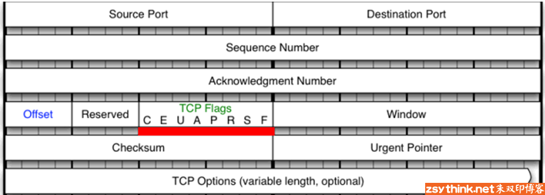

::: tip 温馨提示
本文从理论到实践，系统地介绍 iptables。如果你想要从头开始了解 iptables，可以查看 [iptables 系列文章][iptables series]。
:::

::: danger 高能预警
在进行 iptables 实验时，请务必在测试机上进行。本文的实验操作环境为 VMware Fusion 12.0 下的 Ubuntu 20.04.1。
:::

前文@TODO 总结了 tcp 扩展模块的 `--sport` 与 `--dport` 选项，并没有总结 `--tcp-flags` 选项。本文讲解一下 tcp 扩展模块的 `--tcp-flags`。

::: tip 温馨提示
阅读这篇文章之前，需要对 TCP 协议的基础知识有一定的了解，比如：TCP 头的结构、TCP 三次握手的过程。
:::

## `--tcp-flags`

`--tcp-flags` 指的是 TCP 头的标志位。使用 iptables 时，可通过此扩展匹配条件去匹配 TCP 报文头部的标识位，然后根据标识位的实际情况实现访问控制。

TCP 头的结构如下图



iptables 使用 TCP 扩展模块的 `--tcp-flags` 选项，即可对上图的标志位进行匹配，判断指定标志位的值是否为"1"。TCP 的头部结构不是本文讨论的重点，TCP 的标识位才是。TCP 协议建立连接的过程需要先进行三次握手，而三次握手依靠 TCP 头的标志位进行。

为了更加具象化地描述这个过程，可以抓包查看 ssh 建立连接的过程。其中，
- 服务端 IP 为 `192.168.44.1`
- 客户端 IP 为 `192.168.44.2`
- 两者连接的网卡为 `bridge100`

1. Ubuntu 服务端安装并启动 openssh-server（如已安装，则跳过）
```bash
root@ubuntu:~# apt install openssh-server
root@ubuntu:~# sudo /etc/init.d/ssh restart
```

1. 客户端启动 tcpdump 监听和服务端连接的网卡和端口 22 的 TCP 流量
```bash
sudo tcpdump -i bridge100 port 22
```
3. 客户端 ssh 请求连接到服务端
```bash
ssh sammyne@192.168.44.2
```

tcpdump 的第一条报文如下

```bash
13:11:49.327356 IP 192.168.44.1.57520 > 192.168.44.2.ssh: Flags [SEW], seq 2064361474, win 65535, options [mss 1460,nop,wscale 6,nop,nop,TS val 1368263741 ecr 0,sackOK,eol], length 0
```

以上为 TCP 三次握手中的第一次握手，客户端使用本地的随机端口 57520 向服务端发起连接请求。由 `Flags` 字段可知，TCP 头设置的标志位为 `SEW`（其余标识位没有设置）
- `S` 是 `SYN` 的简写，表示新建连接
- `E` 是 `ECE` 的简写，表示 TCP 客户端三次握手过程能够进行 ECN 
- `W` 是 `CWR`（Congestion Window Reduced） 的简写，表示客户端收到设置了 ECE 标识位的 TCP 端


第二次握手的报文如下：服务端回应刚才的请求，将自己 TCP 头的 `S.E` 标志位（分别对应 `SYN`、`ACK` 和 `ECE`）都设置为 1。

```bash
13:11:49.328094 IP 192.168.44.2.ssh > 192.168.44.1.57520: Flags [S.E], seq 2079983446, ack 2064361475, win 65160, options [mss 1460,sackOK,TS val 4283489136 ecr 1368263741,nop,wscale 7], length 0
```

第三次握手的报文如下

```bash
13:11:49.328176 IP 192.168.44.1.57520 > 192.168.44.2.ssh: Flags [.], ack 1, win 2058, options [nop,nop,TS val 1368263741 ecr 4283489136], length 0
```

说到这里就已经能够引出接下来的话题了 -- `--tcp-flags` 选项。假设现在想要拒绝上文提到的"第一次握手"的报文，在服务端执行以下命令：

```bash
root@ubuntu:~# iptables -F INPUT
root@ubuntu:~# iptables -t filter -I INPUT -p tcp -m tcp --dport 22 --tcp-flags SYN,ACK,FIN,RST,URG,PSH SYN -j REJECT
```

客户端再次发起 ssh 连接请求就会发现连接被拒绝的错误。

```bash
ssh sammyne@192.168.44.2
ssh: connect to host 192.168.44.2 port 22: Connection refused
```

相关选项说明如下
- `-m tcp --dport 22` 的含义在 前文@TODO 已经总结过：表示使用 tcp 扩展模块，指定目标端口为 22 号端口(ssh 默认端口)
- `--tcp-flags` 是重点讨论的扩展匹配条件，用于匹配报文 TCP 头部的标志位
  - `SYN,ACK,FIN,RST,URG,PSH SYN` 这串字符就是用于配置要匹配的标志位，可以拆成为两部分理解
    - `SYN,ACK,FIN,RST,URG,PSH`：需要匹配报文 TCP 头的哪些标志位。上述配置表示匹配报文 TCP 头的 6 个标志位 -- `SYN`、`ACK`、`FIN`、`RST`、`URG` 和 `PSH`，可以把这一部分理解成需要匹配的标志位列表
    - `SYN`：标记第一部分的标志位列表中哪些标志位必须为 1。当前场景的第二部分为 `SYN` 表示第一部分需要匹配的标志位列表中 `SYN` 标志位的值必须为 1，其他标志位必须为 0
  - 因此，`SYN,ACK,FIN,RST,URG,PSH SYN` 表示需要匹配报文 TCP 头的 `SYN`、`ACK`、`FIN`、`RST`、`URG` 和 `PSH` 这些标志位，其中 `SYN` 标志位必须为 1，其他 5 个标志位必须为 0。
  - 这与前面 tcpdump 抓包的情形相同，正是 TCP 三次握手时第一次握手的情况。第一次握手的报文 TCP 头的标志位如下：
    ```bash
    Flags [SEW]
    ```

`--tcp-flags` 的表示方法与 tcpdump 的表示方法有异曲同工之妙。只不过，tcpdump 只把标志位为 1 的标识位的字母简写放到在 `Flags` 列表。`--tcp-flags` 需要先指明匹配哪些标志位，然后再指明其中哪些必须为 1，剩余都必须为 0。

依此类推，匹配 TCP 头第二次握手的标志位可借助以下命令（此处省略对源地址与目标地址的匹配，重点在于对 `tcp-flags` 的示例）

```bash
root@ubuntu:~# iptables -t filter -I INPUT -p tcp -m tcp --sport 22 --tcp-flags SYN,ACK,FIN,RST,URG,PSH, SYN,ACK -j REJECT
```

综上所述，灵活地配置标志位即可匹配到更多应用场景。

上述两条命令还可以简写为如下模样

```bash
root@ubuntu:~# iptables -t filter -I INPUT -p tcp -m tcp --dport 22 --tcp-flags ALL SYN -j REJECT 
root@ubuntu:~# iptables -t filter -I OUTPUT -p tcp -m tcp --sport 22 --tcp-flags ALL SYN,ACK -j REJECT
```

可以用 `ALL` 表示 `SYN,ACK,FIN,RST,URG,PSH`。

tcp 扩展模块还专门提供一个选项--`--syn`，用于匹配前面提到的"第一次握手"。

使用 `--syn` 选项相当于使用 `--tcp-flags SYN,RST,ACK,FIN SYN`。也就是说，使用 `--syn` 选项去匹配 TCP 新建连接的请求报文命令如下
 
```bash
root@ubuntu:~# iptables -F INPUT
root@ubuntu:~# iptables -t filter -I INPUT -p tcp -m tcp --dport 22 --syn -j REJECT
```

## 小结
结合之前的文章，tcp 模块的常用扩展匹配条件再次总结如下，以便于以后速查。

### `--sport`
用于匹配 tcp 协议报文的源端口，可以使用冒号指定一个连续的端口范围

```bash
#示例
iptables -t filter -I OUTPUT -d 192.168.1.146 -p tcp -m tcp --sport 22 -j REJECT
iptables -t filter -I OUTPUT -d 192.168.1.146 -p tcp -m tcp --sport 22:25 -j REJECT
iptables -t filter -I OUTPUT -d 192.168.1.146 -p tcp -m tcp ! --sport 22 -j ACCEPT
```

### `--dport`
用于匹配 tcp 协议报文的目标端口，可以使用冒号指定一个连续的端口范围

```bash
#示例
iptables -t filter -I INPUT -s 192.168.1.146 -p tcp -m tcp --dport 22:25 -j REJECT
iptables -t filter -I INPUT -s 192.168.1.146 -p tcp -m tcp --dport :22 -j REJECT
iptables -t filter -I INPUT -s 192.168.1.146 -p tcp -m tcp --dport 80: -j REJECT
```

### `--tcp-flags`
用于匹配报文的 TCP 头的标志位

```bash
#示例
iptables -t filter -I INPUT -p tcp -m tcp --dport 22 --tcp-flags SYN,ACK,FIN,RST,URG,PSH SYN -j REJECT
iptables -t filter -I OUTPUT -p tcp -m tcp --sport 22 --tcp-flags SYN,ACK,FIN,RST,URG,PSH SYN,ACK -j REJECT
iptables -t filter -I INPUT -p tcp -m tcp --dport 22 --tcp-flags ALL SYN -j REJECT
iptables -t filter -I OUTPUT -p tcp -m tcp --sport 22 --tcp-flags ALL SYN,ACK -j REJECT
```

### `--syn`
用于匹配 tcp 新建连接的请求报文，相当于使用 `--tcp-flags SYN,RST,ACK,FIN SYN`。

## 参考文献
- [iptables详解（6）：iptables扩展匹配条件之’–tcp-flags’]

[iptables series]: /tag/iptables/
[iptables详解（6）：iptables扩展匹配条件之’–tcp-flags’]: http://www.zsythink.net/archives/1578
