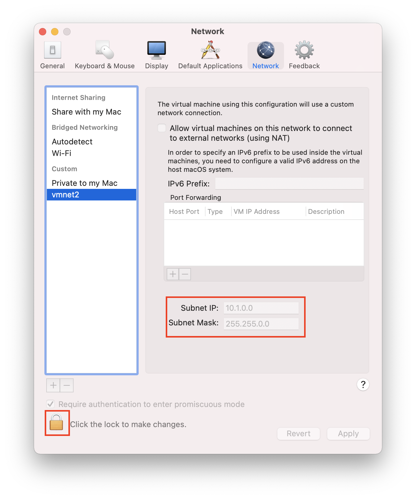

::: tip 温馨提示
本文从理论到实践，系统地介绍 iptables。如果你想要从头开始了解 iptables，可以查看 [iptables 系列文章][iptables series]。
:::

::: danger 高能预警
在参照本文进行 iptables 实验时，请务必在个人的测试机进行。iptables 规则设置不当有可能使你无法连接到远程主机。本文的实验操作环境为 VMware Fusion Pro 12.0 下的 Ubuntu 20.04.1。
:::

## 概述

**阅读这篇文章需以前面的文章为基础**。如果你在阅读时遇到障碍，请参考之前的文章。

[上一篇文章][iptables-12-target-summary-1] 介绍了如下动作：`ACCEPT`、`DROP`、`REJECT` 和 `LOG`。本文介绍几个新动作：`SNAT`、`DNAT`、`MASQUERADE` 和 `REDIRECT`。

在认识它们之前，我们先来聊聊 NAT。对 NAT 的相关概念已经滚瓜烂熟的同学可以跳过如下场景描述。

NAT 是 Network Address Translation 的缩写，译为"网络地址转换"。NAT 说白了就是修改报文的 IP 地址。NAT 功能通常会被集成到路由器、防火墙或独立的 NAT 设备。

以下两个场景可说明这方面需求的合理性。

### 场景 1

假设网络内部有 10 台主机，各有各自的 IP 地址。网络内部的主机与其他网络的主机通讯时，会暴露自己的 IP 地址。如果想要隐藏这些主机的 IP 地址，该怎么办呢？

网络内部的主机向网络外部主机发送报文时，报文会经过防火墙或路由器。报文经过防火墙或路由器时，将报文的源 IP 修改为防火墙或者路由器的 IP 地址。当其他网络的主机收到这些报文时，显示的源 IP 地址则是路由器或者防火墙的，而不是那 10 台主机的 IP 地址。这样就起到隐藏网络内部主机 IP 的作用。当网络内部主机的报文经过路由器时，路由器会维护一张 NAT 表。表记录报文来自于哪个内部主机的哪个进程（内部主机 IP +端口）。当报文经过路由器时，路由器会将报文的内部主机源 IP 替换为路由器的 IP 地址，源端口也映射为某个端口。NAT 表会把这种对应关系记录下来。

```
+-------+--------+---------+----------+      +--------+------------+---------+----------+
| 源 IP | 源 PORT | 目标 IP | 目标 PORT +----->+ 路由 IP | 映射后 PORT | 目标 IP | 目标 PORT |
+-------+--------+---------+----------+      +--------+------------+---------+----------+
```

外部主机收到报文时，源 IP 与源端口显示的都是路由的 IP 与端口。当外部网络的主机回应时，外部主机将响应报文发送给路由器，路由器根据刚才 NAT 表的映射记录，将响应报文中的目标 IP 与目标端口再改为内部主机的 IP 与端口号，然后再将响应报文发送给内部网络中的主机。整个过程中，外部主机都不知道内部主机的 IP 地址，内部主机还能与外部主机通讯，从而起到隐藏网络内主机 IP 的作用。

上述整个过程就用到了 NAT 功能，准确地说是用到了 NAPT 功能。NAPT 是 NAT 的一种，全称为 Network Address Port Translation。说白了就是映射报文 IP 地址的同时还会映射其端口号，就像刚才描述的过程一样。

刚才描述的过程中，"IP 地址的转换"一共发生了两次。

内部网络的报文发送出去时，报文的源 IP 会被修改，也就是源地址转换：Source Network Address Translation，缩写为 SNAT。

外部网络的报文响应时，响应报文的目标 IP 会再次被修改，也就是目标地址转换：Destinationnetwork address translation，缩写为 DNAT。

但是上述"整个过程"被称为 SNAT，因为"整个过程"的前半段使用了 SNAT。如果上述"整个过程"的前半段使用了 DNAT，则整个过程被称为 DNAT。也就是说，过程被称为 SNAT 还是 DNAT，取决于整个过程的前半段使用了 SNAT 还是 DNAT。

其实刚才描述的场景不仅仅能够隐藏网络内部主机的 IP 地址，还能够让局域网内的主机共享公网 IP，让使用私网 IP 的主机能够访问互联网。

比如，整个公司只有一个公网 IP，但是整个公司有 10 台电脑，怎样能让这 10 台电脑都访问互联网呢？可以为这 10 台电脑都配置上各自的私网 IP，比如 `192.168` 这种私网 IP。但是互联网是不会路由私网 IP。如果想要访问互联网，则必须使用公网 IP。那么就需要想办法让这 10 台主机共享公司仅有的一个公网 IP。这与刚才描述的场景其实完全一致。只要在路由器上配置公网 IP，在私网主机访问公网服务时，报文经过路由器，路由器将报文的私网 IP 与端口号进行修改和映射，将其映射为公网 IP 与端口号，这时内网主机即可共享公网 IP 访问互联网服务。NAT 表示意图如下

  <table>
    <tr>
      <th></th>
      <th colspan="4">Internal Four-Tuple</th>
      <th colspan="4">External Four-Tuple</th>
      <th></th>
    </tr>
    <tr>
      <td>工作站</td>
      <td>源 IP 地址</td>
      <td>源端口</td>
      <td>目标 IP 地址</td>
      <td>目标端口</td>
      <td>源 IP 地址</td>
      <td>源端口</td>
      <td>目标 IP 地址</td>
      <td>目标端口</td>
      <td>协议</td>
    </tr>
    <tr>
      <td>#1</td>
      <td>192.168.2.1</td>
      <td>12000</td>
      <td>a.b.c.d</td>
      <td>20</td>
      <td>64.33.104.180</td>
      <td>14000</td>
      <td>a.b.c.d</td>
      <td>20</td>
      <td>TCP</td>
    </tr>
    <tr>
      <td>#1</td>
      <td>192.168.2.1</td>
      <td>12001</td>
      <td>a.b.c.d</td>
      <td>21</td>
      <td>64.33.104.180</td>
      <td>14001</td>
      <td>a.b.c.d</td>
      <td>21</td>
      <td>TCP</td>
    </tr>
    <tr>
      <td>#2</td>
      <td>192.168.2.2</td>
      <td>12000</td>
      <td>a.b.c.d</td>
      <td>20</td>
      <td>64.33.104.180</td>
      <td>14002</td>
      <td>a.b.c.d</td>
      <td>20</td>
      <td>TCP</td>
    </tr>
    <tr>
      <td>#2</td>
      <td>192.168.2.2</td>
      <td>12001</td>
      <td>a.b.c.d</td>
      <td>21</td>
      <td>64.33.104.180</td>
      <td>14003</td>
      <td>a.b.c.d</td>
      <td>21</td>
      <td>TCP</td>
    </tr>
  </table>

综上所述，SNAT 不仅能够隐藏网内的主机 IP，还能够共享公网 IP。这在 IPv4 地址较为紧张的今天是非常有用的。

### 场景 2

场景 1 描述的过程为 SNAT 过程。虽然过程也牵扯到 DNAT，但是由于整个过程的前半段使用了 SNAT，所以称之为 SNAT。那么在什么情况下，整个过程能称之为 DNAT 呢？

前半段使用 DNAT 的过程称为 DNAT，具体场景如下。

公司自己的局域网有两台主机作为服务器，主机 1 提供 web 服务，主机 2 提供数据库服务，但是这两台服务器在局域网内，使用私有 IP 地址，只能被局域网内的主机访问，互联网无法访问到这两台服务器。整个公司只有一个可用的公网 IP，怎样通过这个公网 IP 访问到这些内网服务呢？可以将这个公网 IP 配置到公司的某台主机或路由器，然后对外宣称这个 IP 地址对外提供 web 服务与数据库服务。于是互联网主机将请求报文发送给这公网 IP 地址，也就是说此时报文的目标 IP 为公网 IP。路由器收到报文后，将报文的目标地址改为对应的私网地址。比如，如果报文的目标 IP 与端口号为：公网 IP + 3306，就将报文的目标地址与端口改为：主机 2 的私网 IP + 3306。同理，公网 IP + 80 端口映射为主机 1 的私网 IP + 80 端口。当私网的主机回应对应请求报文时，再将回应报文的源地址从私网 IP + 端口号映射为公网 IP + 端口号，再由路由器或公网主机发送给互联网中的主机。

上述过程也牵扯到 DNAT 与 SNAT，但是由于整个过程的前半段使用 DNAT，所以被称为 DNAT。

不管是 SNAT 还是 DNAT，都起到了隐藏内部主机 IP 的作用。

## 实验环境准备

了解 SNAT 与 DNAT 的相关概念之后，我们可以小试身手了。首先，准备一下实验环境

大致的实验环境是这样的：公司局域网使用的网段为 `10.1.0.0/16`，只有一个公网 IP，局域网内的主机需要共享这个 IP 与互联网的主机进行通讯。

由于没有真正的公网 IP，所以我们使用私网 IP `172.16.39.2` 模拟所谓的公网 IP，示意图如下

```
+----------------+
| A: 172.16.39.8 |
+---+---------+--+
    |         ^             +---------------------------------------------+
    |         |             |   +----------------------> +-------------+  |
    |         |             |   |      |---------------+ | D: 10.1.0.4 |  |
+-----------------------------------------+ |            +-------------+  |
|   |         |             |   |      |    |                             |
| +-v---------+-+           | +-+------v-+ +-----------> +-------------+  |
| | 172.16.39.2 |           | | 10.1.0.2 |  |            | C: 10.1.0.3 |  |
| +-------------+           + +---------++ <+----------+ +------------++  +
|    网卡 1          主机 B  +    网卡 2      |                             |
+------------------------+--+-----------+-+ +            +------------++  +
                            |                            |    ...      |  +
                            | 内部网络                    +-------------+  |
                            +------------------------------------------+--+
```

如上图所示，实验使用 3 台虚拟机：A、B、C 和 D。

- 主机 A：扮演公网主机，尝试访问公司提供的服务，IP 地址为 `172.16.39.8`
- 主机 B：扮演拥有 NAT 功能的防火墙或路由器。充当网关，并且负责 NAT。公网和私网通信的报文通过主机 B 时，报文会被 NAT
- 主机 C：扮演内网 web 服务器，IP 地址为 `10.1.0.3`
- 主机 D：扮演内网 ssh 远程主机，IP 地址为 `10.1.0.4`

右边最大虚线框所示的逻辑区域表示公司内网，网段为 `10.1.0.0/16`。主机 B、C 和 D 都是内网主机。主机 B 比较特殊，同时扮演网关与防火墙，持有公司唯一的公网 IP（一个假的公网 IP）。如果想与公网主机通信，局域网内主机需要共享此公网 IP，由主机 B 进行 NAT。所以，我们为主机 B 准备了两块网卡，公网 IP 与私网 IP 分别配置到这两块网卡。同时，在虚拟机设置了一个"仅主机模式"的虚拟网络，以模拟公司局域网。

其实，上述实验环境与之前描述的 [网络防火墙][iptables-11-firewall] 的实验环境相差无几，只不过之前的环境并没有公网和私网的概念。而此刻，最大虚线框逻辑区域之内为私网，之外为公网。

环境具体准备过程如下。首先，创建一个虚拟网络，模拟公司内网。（本人的操作系统为 macOS）

1. 点击 VMware Fusion "Preferences" 菜单
2. 选择 "Network" 面板
3. 暂时解锁更改设置
4. 添加如图所示仅主机模式的虚拟网络 `vmnet2`，设置子网地址为 `10.1.0.0`，子网掩码为 `255.255.0.0`

下图的 vmnet2 为已经添加过的虚拟网络，此处不再重复添加。



设置主机 C 的网关指向主机 B 的私网 IP 如下

```bash{6,7}
root@ubuntu2:~# route -n
Kernel IP routing table
Destination     Gateway         Genmask         Flags Metric Ref    Use Iface
10.1.0.0        0.0.0.0         255.255.0.0     U     100    0        0 ens33
169.254.0.0     0.0.0.0         255.255.0.0     U     1000   0        0 ens33
root@ubuntu2:~# route add -net 0.0.0.0 gw 10.1.0.2
root@ubuntu2:~# route del -net 10.1.0.0/16
root@ubuntu2:~# route -n
Kernel IP routing table
Destination     Gateway         Genmask         Flags Metric Ref    Use Iface
0.0.0.0         10.1.0.2        0.0.0.0         UG    0      0        0 ens33
169.254.0.0     0.0.0.0         255.255.0.0     U     1000   0        0 ens33
```

同理设置主机 D 的网关指向主机 B 的私网 IP 如下

```bash{1,2}
root@ubuntu4:~# route add -net 0.0.0.0 gw 10.1.0.2
root@ubuntu4:~# route del -net 10.1.0.0/16
root@ubuntu4:~# route -n
Kernel IP routing table
Destination     Gateway         Genmask         Flags Metric Ref    Use Iface
0.0.0.0         10.1.0.2        0.0.0.0         UG    0      0        0 ens33
169.254.0.0     0.0.0.0         255.255.0.0     U     1000   0        0 ens33
```

主机 B 有两块网卡，分别配置了私网 IP 与公网 IP。私网 IP 为 `10.1.0.2`，所在网卡为 vmnet2。模拟公网的 IP 为 `172.16.39.2`，B 主机的公网 IP 所在网卡与主机 A 都使用桥接模式（@TODO：待进一步研究）的虚拟网络，所以主机 B 既能与私网主机通讯，也能与公网主机通讯。

```bash
root@ubuntu:~# ifconfig | grep "inet "
        inet 172.16.39.2  netmask 255.255.255.0  broadcast 172.16.39.255
        inet 10.1.0.2  netmask 255.255.0.0  broadcast 10.1.255.255
        inet 127.0.0.1  netmask 255.0.0.0
```

由于主机 B 此时需要负责对报文的修改与转发，需要开启主机 B 的核心转发功能。Linux 主机默认不会开启核心转发，这在 [网络防火墙][iptables-11-firewall] 一文已经详细描述过，此处不再赘述。使用临时生效的方法开启主机 B 的核心转发功能，如下所示。

```bash{3}
root@ubuntu:~# cat /proc/sys/net/ipv4/ip_forward
0
root@ubuntu:~# echo 1 > /proc/sys/net/ipv4/ip_forward
root@ubuntu:~# cat /proc/sys/net/ipv4/ip_forward
1
```

A 主机的 IP 地址如下，可以与主机 B 进行通讯，但是不能与 C 或 D 进行通讯。因为 A 是公网主机，B 既是公网主机又是私网主机，C 和 D 都是私网的主机，A 不可能访问到 C 或 D。

```bash{1,10,15}
sammy@ubuntu3:~$ ping 172.16.39.2
PING 172.16.39.2 (172.16.39.2) 56(84) bytes of data.
64 bytes from 172.16.39.2: icmp_seq=1 ttl=64 time=1.34 ms
64 bytes from 172.16.39.2: icmp_seq=2 ttl=64 time=0.851 ms
64 bytes from 172.16.39.2: icmp_seq=3 ttl=64 time=0.994 ms
^C
--- 172.16.39.2 ping statistics ---
3 packets transmitted, 3 received, 0% packet loss, time 2004ms
rtt min/avg/max/mdev = 0.851/1.060/1.337/0.203 ms
sammy@ubuntu3:~$ ping 10.1.0.3
PING 10.1.0.3 (10.1.0.3) 56(84) bytes of data.
^C
--- 10.1.0.3 ping statistics ---
3 packets transmitted, 0 received, 100% packet loss, time 2044ms
root@ubuntu3:~# ping 10.1.0.4
PING 10.1.0.4 (10.1.0.4) 56(84) bytes of data.
^C
--- 10.1.0.4 ping statistics ---
3 packets transmitted, 0 received, 100% packet loss, time 2049ms
```

为了能够更好的区分公网服务与私网服务，我们分别在主机 A 与主机 C 启动 httpd 服务，如下图所示。

```bash
root@ubuntu3:~# rm -rf hello/
root@ubuntu3:~# mkdir hello
root@ubuntu3:~# echo "I'm A" > hello/index.html
root@ubuntu3:~# mini_httpd -h 0.0.0.0 -d hello/
mini_httpd: started as root without requesting chroot(), warning only
root@ubuntu3:~# curl localhost
I'm A
```

```bash
root@ubuntu2:~# rm -rf hello/
root@ubuntu2:~# mkdir hello
root@ubuntu2:~# echo "I'm C" > hello/index.html
root@ubuntu2:~# mini_httpd -d hello/ -h 0.0.0.0
root@ubuntu2:~# mini_httpd: started as root without requesting chroot(), warning only

root@ubuntu2:~# curl localhost
I'm C
```

实验环境准备完毕，我们动手实际操作一下。

## 动作：SNAT

文章开头的场景已经描述过，网络内部的主机可以借助 SNAT 隐藏自己的 IP 地址，同时还能够共享合法的公网 IP，让局域网内的多台主机共享公网 IP 访问互联网。

此时的主机 B 就扮演了拥有 NAT 功能的设备。我们使用 iptables 的 SNAT 动作达到刚才所说的目的。

为主机 B 添加以下规则。

```bash
root@ubuntu:~# iptables -F
root@ubuntu:~# iptables -L
Chain INPUT (policy ACCEPT)
target     prot opt source               destination

Chain FORWARD (policy ACCEPT)
target     prot opt source               destination

Chain OUTPUT (policy ACCEPT)
target     prot opt source               destination
root@ubuntu:~# iptables -t nat -A POSTROUTING -s 10.1.0.0/16 -j SNAT --to-source 172.16.39.2
root@ubuntu:~# iptables -t nat -L
Chain PREROUTING (policy ACCEPT)
target     prot opt source               destination

Chain INPUT (policy ACCEPT)
target     prot opt source               destination

Chain OUTPUT (policy ACCEPT)
target     prot opt source               destination

Chain POSTROUTING (policy ACCEPT)
target     prot opt source               destination
SNAT       all  --  10.1.0.0/16          anywhere             to:172.16.39.2
```

以上规则表示将来自于 `10.1.0.0/16` 网段的报文源地址改为公司的公网 IP 地址。相关选项说明如下

- `-t nat` 表示操作 nat 表。之前一直在灌输一个概念，就是不同表功能不同：filter 表的功能是过滤，nat 表的功能是地址转换。所以我们需要在 nat 表定义 nat 规则。
- `-A POSTROUTING` 表示将 SNAT 规则添加到 `POSTROUTING` 链的末尾。在 Ubuntu 中，SNAT 规则只能存在于 `POSTROUTING` 链与 `INPUT` 链。在 CentOS 6 中，SNAT 规则只能存在于 `POSTROUTING` 链。
  - 为什么 SNAT 规则必须定义在 `POSTROUTING` 链？我们可以这样认为，`POSTROUTING` 链是 iptables 中报文发出的最后一个"关卡"。我们应该在报文马上发出之前修改报文的源地址，否则就再也没有机会修改报文的源地址了。在 Ubuntu 中，SNAT 规则也可以定义在 `INPUT` 链。我们可以这样理解：发往本机的报文经过 `INPUT` 链以后报文到达本机。如果再不修改报文的源地址，就没有机会修改了。
- `-s 10.1.0.0/16` 表示报文来自于 `10.1.0.0/16` 网段。前文一直在使用这个匹配条件，此处不再赘述。
- `-j SNAT` 表示使用 SNAT 动作对匹配到的报文进行进行源地址转换。
- `--to-source 172.16.39.2` 表示将匹配到的报文源 IP 修改为 `172.16.39.2`。前面的文章已经总结过：某些动作会有自己的选项。`--to-source` 就是 SNAT 动作的常用选项，用于指定报文的源 IP 转换后的 IP 地址。

站在前面文章的基础上理解上述语句应该不难。接下来测试一下。

目前只配置了一条 SNAT 规则，并没有设置任何 DNAT。现在从内网主机 ping 外网主机，看看能不能 ping 通。在主机 C 向主机 A 的外网 IP 发送 ping 请求(假外网 IP)，示例如下

```bash{1}
root@ubuntu2:~# ping 172.16.39.8
PING 172.16.39.8 (172.16.39.8) 56(84) bytes of data.
64 bytes from 172.16.39.8: icmp_seq=1 ttl=63 time=1.35 ms
64 bytes from 172.16.39.8: icmp_seq=2 ttl=63 time=2.13 ms
64 bytes from 172.16.39.8: icmp_seq=3 ttl=63 time=1.70 ms
^C
--- 172.16.39.8 ping statistics ---
3 packets transmitted, 3 received, 0% packet loss, time 2004ms
rtt min/avg/max/mdev = 1.345/1.724/2.130/0.321 ms
```

如上所示，"内网主机"已经可以依靠 SNAT 访问"互联网"了。

为了更加清晰的理解整个 SNAT 过程，在主机 C 上抓包看看。查看请求报文与响应报文的 IP 地址如下。在主机 C 同时打开两个命令窗口，一个命令窗口向主机 A 发送 `ping` 请求，另一个窗口使用 tcpdump 命令对指定的网卡进行抓包，抓取 ICMP 协议的包。

```bash
root@ubuntu2:~# ping 172.16.39.8
PING 172.16.39.8 (172.16.39.8) 56(84) bytes of data.
64 bytes from 172.16.39.8: icmp_seq=1 ttl=63 time=1.32 ms
64 bytes from 172.16.39.8: icmp_seq=2 ttl=63 time=1.78 ms
64 bytes from 172.16.39.8: icmp_seq=3 ttl=63 time=1.35 ms
^C
--- 172.16.39.8 ping statistics ---
3 packets transmitted, 3 received, 0% packet loss, time 2003ms
rtt min/avg/max/mdev = 1.324/1.484/1.775/0.205 ms
```

tcpdump 的日志如下

```bash
root@ubuntu2:~# tcpdump -i ens33 -nn icmp
tcpdump: verbose output suppressed, use -v or -vv for full protocol decode
listening on ens33, link-type EN10MB (Ethernet), capture size 262144 bytes


16:58:45.271951 IP 10.1.0.3 > 172.16.39.8: ICMP echo request, id 2, seq 1, length 64
16:58:45.273257 IP 172.16.39.8 > 10.1.0.3: ICMP echo reply, id 2, seq 1, length 64
16:58:46.272728 IP 10.1.0.3 > 172.16.39.8: ICMP echo request, id 2, seq 2, length 64
16:58:46.274466 IP 172.16.39.8 > 10.1.0.3: ICMP echo reply, id 2, seq 2, length 64
16:58:47.275122 IP 10.1.0.3 > 172.16.39.8: ICMP echo request, id 2, seq 3, length 64
16:58:47.276454 IP 172.16.39.8 > 10.1.0.3: ICMP echo reply, id 2, seq 3, length 64
```

从上图可以看到，`10.1.0.1` 发出 `ping` 包，`172.16.39.8` 进行回应，正是主机 A 的 IP 地址（用于模拟公网 IP 的地址）。

看来，只是用于配置 SNAT 的话，我们并不用手动进行 DNAT 设置，iptables 会自动维护 NAT 表，并将响应报文的目标地址转换回来。

我们去主机 A 再次重复一遍刚才的操作。如下图所示，C 主机继续向主机 A 的公网 IP 发送 `ping` 请求，在主机 A 的网卡 `ens33` 上抓包看看。

```bash
root@ubuntu3:~# tcpdump -i ens33 -nn icmp
tcpdump: verbose output suppressed, use -v or -vv for full protocol decode
listening on ens33, link-type EN10MB (Ethernet), capture size 262144 bytes

17:01:14.291324 IP 172.16.39.2 > 172.16.39.8: ICMP echo request, id 3, seq 1, length 64
17:01:14.291367 IP 172.16.39.8 > 172.16.39.2: ICMP echo reply, id 3, seq 1, length 64
17:01:15.293080 IP 172.16.39.2 > 172.16.39.8: ICMP echo request, id 3, seq 2, length 64
17:01:15.293134 IP 172.16.39.8 > 172.16.39.2: ICMP echo reply, id 3, seq 2, length 64
17:01:16.295485 IP 172.16.39.2 > 172.16.39.8: ICMP echo request, id 3, seq 3, length 64
17:01:16.295556 IP 172.16.39.8 > 172.16.39.2: ICMP echo reply, id 3, seq 3, length 64
```

可见，C 主机向主机 A 发起 `ping` 请求时得到了回应，但是主机 A 并不知道是主机 C 发来的 `ping` 请求，A 主机以为是主机 B 发来的 `ping` 请求。从抓包的信息来看，A 主机以为主机 B 通过公网 IP：`172.16.39.2` 向自己发起 `ping` 请求，而主机 A 也将响应报文回应给了主机 B 。所以整个过程中，A 主机都不知道主机 C 的存在，都以为是主机 B 在向自己发送请求。即使不是在公网私网的场景，我们也能够使用这种方法隐藏网络内的主机。只不过此处所描述的环境是私网主机共享公网 IP 访问互联网。

同理在主机 D 执行类似操作，可在主机 A 上 tcpdump 监听到类似报文如下

```bash
root@ubuntu3:~# tcpdump -i ens33 -nn icmp
tcpdump: verbose output suppressed, use -v or -vv for full protocol decode
listening on ens33, link-type EN10MB (Ethernet), capture size 262144 bytes
17:27:55.607907 IP 172.16.39.2 > 172.16.39.8: ICMP echo request, id 1, seq 1, length 64
17:27:55.609184 IP 172.16.39.8 > 172.16.39.2: ICMP echo reply, id 1, seq 1, length 64
17:27:56.611166 IP 172.16.39.2 > 172.16.39.8: ICMP echo request, id 1, seq 2, length 64
17:27:56.611193 IP 172.16.39.8 > 172.16.39.2: ICMP echo reply, id 1, seq 2, length 64
```

可见，私网的主机已经共享了 `172.16.39.2` 这个"伪公网 IP"。

C 主机还可以正常访问访问主机 A 的 web 服务，如下所示

```bash
root@ubuntu2:~# curl 172.16.39.8
I'm A
```

可见源地址转换已经完成。我们只依靠一条 iptables 规则就能够使内网主机能够共享公网 IP 访问互联网了。

## 动作 DNAT

公司只有一个公网 IP，但是公司的内网却有很多服务器提供各种服务。如何通过公网访问这些服务呢？

使用 DNAT 即可：对外宣称公司的公网 IP 既提供 web 服务，也提供 ssh 服务。不管是访问 web 服务还是 ssh 远程链接，只要访问这个公网 IP 就行。利用 DNAT 将公网客户端发送过来的报文目标地址与端口号做映射，将访问 web 服务的报文转发到内网主机 C，将 ssh 远程链接的报文转发到内网主机 D。

好了，理论说完了，来动手实践一下。

如果我们想要实现刚才描述的场景，则需要在主机 B 进行如下配置。

```bash{2}
root@ubuntu:~# iptables -t nat -F
root@ubuntu:~# iptables -t nat -I PREROUTING -d 172.16.39.2 -p tcp --dport 8022 -j DNAT --to-destination 10.1.0.4:22
root@ubuntu:~# iptables -t nat -nL PREROUTING
Chain PREROUTING (policy ACCEPT)
target     prot opt source               destination
DNAT       tcp  --  0.0.0.0/0            172.16.39.2          tcp dpt:8022 to:10.1.0.4:22
```

以上命令先将 nat 表的规则清空，然后定义一条 DNAT 规则。相关选项说明如下

- `-t nat -I PREROUTING` 表示在 nat 表的 `PREROUTING` 链配置 DNAT 规则，DNAT 规则只能配置在 `PREROUTING` 链与 `OUTPUT` 链。
- `-d 172.16.39.2 -p tcp --dport 8022` 表示报文的目标地址为公司的公网 IP 地址，目标端口为 TCP 的 8022 号端口。
- `-j DNAT --to-destination 10.1.0.4:22` 表示将符合条件的报文进行 DNAT，将符合条件的报文目标地址与目标端口修改为 `10.1.0.4:22`。`--to-destination` 就是动作 DNAT 的常用选项。

综上所述，规则的含义为：当外网主机访问公司公网 IP 的 8022 时，其报文的目标地址与端口将会被映射到 `10.1.0.6:22`。

至此，DNAT 规则定义完了。现在外网主机可以直接访问私网的服务了。

::: tip 温馨提示
理论上只配置 DNAT 规则即可，但是如果在测试时无法正常 DNAT，可以尝试配置对应的 SNAT，此处按照配置 SNAT 的流程进行。

```bash
iptables -t nat -A POSTROUTING -s 10.1.0.0/16 -j SNAT --to-source 172.16.39.2
```

:::

与刚才定义 SNAT 时使用的规则完全一样。

完成上述配置后，以主机 B 的公网 IP 和 8022 端口即可 ssh 连接到主机 D 如下。

```bash{1,22}
root@ubuntu3:~# ssh -p 8022 sammy@172.16.39.2
The authenticity of host '[172.16.39.2]:8022 ([172.16.39.2]:8022)' can't be established.
ECDSA key fingerprint is SHA256:vYot0T5Xa+31Fa6BRAhbCmAdQr6i7MSuwsDN7xrd7co.
Are you sure you want to continue connecting (yes/no/[fingerprint])? yes
Warning: Permanently added '[172.16.39.2]:8022' (ECDSA) to the list of known hosts.
sammy@172.16.39.2's password:
Welcome to Ubuntu 20.04.1 LTS (GNU/Linux 5.4.0-58-generic x86_64)

 * Documentation:  https://help.ubuntu.com
 * Management:     https://landscape.canonical.com
 * Support:        https://ubuntu.com/advantage


203 updates can be installed immediately.
14 of these updates are security updates.
To see these additional updates run: apt list --upgradable

Your Hardware Enablement Stack (HWE) is supported until April 2025.
Last login: Sat Jan  9 13:41:18 2021 from 10.1.0.3
```

::: warning 注意事项
需要显式指定目标机器的端口，否则会默认以端口 22 连接到主机 B。
:::

连接以后，查看 IP 地址时，发现被远程机器的 IP 地址其实是公司私网中 D 主机的 IP 地址。

```bash
sammy@ubuntu4:~$ ifconfig
ens33: flags=4163<UP,BROADCAST,RUNNING,MULTICAST>  mtu 1500
        inet 10.1.0.4  netmask 255.255.0.0  broadcast 10.1.255.255
        inet6 fe80::1c:7600:ef09:e893  prefixlen 64  scopeid 0x20<link>
        ether 00:0c:29:07:d1:0f  txqueuelen 1000  (Ethernet)
        RX packets 105  bytes 13224 (13.2 KB)
        RX errors 0  dropped 0  overruns 0  frame 0
        TX packets 252  bytes 26405 (26.4 KB)
        TX errors 0  dropped 0 overruns 0  carrier 0  collisions 0

lo: flags=73<UP,LOOPBACK,RUNNING>  mtu 65536
        inet 127.0.0.1  netmask 255.0.0.0
        inet6 ::1  prefixlen 128  scopeid 0x10<host>
        loop  txqueuelen 1000  (Local Loopback)
        RX packets 469  bytes 40773 (40.7 KB)
        RX errors 0  dropped 0  overruns 0  frame 0
        TX packets 469  bytes 40773 (40.7 KB)
        TX errors 0  dropped 0 overruns 0  carrier 0  collisions 0
```

上述终端输出足矣证明我们已经成功通过公网 IP 访问到了内网服务。

同理，使用类似的方法也能够在外网访问到主机 C 提供的 web 服务如下。

```bash{1}
root@ubuntu:~# iptables -t nat -I PREROUTING -d 172.16.39.2 -p tcp --dport 8080 -j DNAT --to-destination 10.1.0.3:80
root@ubuntu:~# iptables -t nat -nL PREROUTING
Chain PREROUTING (policy ACCEPT)
target     prot opt source               destination
DNAT       tcp  --  0.0.0.0/0            172.16.39.2          tcp dpt:8080 to:10.1.0.3:80
DNAT       tcp  --  0.0.0.0/0            172.16.39.2          tcp dpt:8022 to:10.1.0.4:22
```

如上所示，将公司公网 IP 的 8080 号端口映射到公司内网主机 C 的 80 端口。所以当外网主机访问公司公网 IP 的 8080 端口时，报文将会发送到主机 C 的 80 端口。

::: tip 温馨提示
理论上只配置 DNAT 规则即可，但是如果在测试时无法正常 DNAT 且前面没有配置过对应的 SNAT，可以尝试配置对应的 SNAT，此处按照配置 SNAT 的流程进行。

```bash
iptables -t nat -A POSTROUTING -s 10.1.0.0/16 -j SNAT --to-source 172.16.39.2
```

:::

完成上述 DNAT 映射后，在主机 A 访问主机 B 的 8080 端口试试，如下

```bash
root@ubuntu3:~# curl 172.16.39.2:8080
I'm C
```

可以看到，访问主机 B 的公网 IP ，但是返回结果显示的却是主机 C 提供的服务内容，证明 DNAT 已经成功。

而上述过程中，外网主机 A 访问的始终都是公司的公网 IP，提供服务的却是内网主机。因此，可以对外宣称，公网 IP 提供了某些服务，快来访问吧！

## 动作 MASQUERADE

前面描述了 SNAT，也就是源地址转换。接下来介绍一个与 SNAT 类似的动作：MASQUERADE。

拨号上网时，每次分配的 IP 地址往往不同，不会长期分给我们一个固定的 IP 地址。如果这时想要让内网主机共享公网 IP 上网，就会很麻烦，因为每次 IP 地址发生变化导致需要重新配置 SNAT 规则，这样显示不是很人性化。借助 MASQUERADE 即可解决这个问题：MASQUERADE 会动态地将源地址转换为可用的 IP 地址。其实与 SNAT 实现的功能完全一致，都是修改源地址，只不过 SNAT 需要指明将报文的源地址改为哪个 IP，而 MASQUERADE 则不用指定明确的 IP，会动态地将报文的源地址修改为指定网卡上可用的 IP 地址，示例如下：

```bash
root@ubuntu:~# iptables -t nat -L POSTROUTING
Chain POSTROUTING (policy ACCEPT)
target     prot opt source               destination
root@ubuntu:~# iptables -t nat -I POSTROUTING -s 10.1.0.0/16 -o ens33 -j MASQUERADE
root@ubuntu:~# iptables -t nat -L POSTROUTING
Chain POSTROUTING (policy ACCEPT)
target     prot opt source               destination
MASQUERADE  all  --  10.1.0.0/16          anywhere
```

以上命令指定：通过网卡 `ens33` 出去的报文经过 `POSTROUTING` 链时，会自动将报文的源地址修改为外网网卡可用的 IP 地址。因此，即使此网卡的公网 IP 地址发生了改变，也能够正常、动态地将内部主机的报文源 IP 映射为对应的公网 IP。

可以把 MASQUERADE 理解为动态的、自动化的 SNAT。如果没有动态 SNAT 的需求，没必要使用 MASQUERADE，因为 SNAT 更加高效。

## 动作 REDIRECT

使用 REDIRECT 动作可以在本机进行端口映射。比如，将本机的 80 端口映射到本机的 8080 端口。

```bash
iptables -t nat -A PREROUTING -p tcp --dport 80 -j REDIRECT --to-ports 8080
```

经过上述规则映射后，其他机器访问本机的 80 端口时，报文会被重定向到本机的 8080 端口。

REDIRECT 规则只能定义在 `PREROUTING` 链或者 `OUTPUT` 链。

## 小结

为了便于以后速查，上述命令总结如下。

NAT 功能的正常使用需要开启 Linux 主机的核心转发功能。

```bash
echo 1 > /proc/sys/net/ipv4/ip_forward
```

### SNAT 相关操作

配置 SNAT，可以隐藏网内主机的 IP 地址，也可以以共享公网 IP 访问互联网。如果只是共享 IP 的话，配置如下 SNAT 规则即可。

```bash
iptables -t nat -A POSTROUTING -s 10.1.0.0/16 -j SNAT --to-source 公网 IP
```

如果公网 IP 是动态获取的，而不是固定的，则可以使用 MASQUERADE 进行动态的 SNAT 操作。如下命令表示将 `10.1` 网段的报文源 IP 修改为网卡 eth0 的可用地址。

```bash
iptables -t nat -A POSTROUTING -s 10.1.0.0/16 -o eth0 -j MASQUERADE
```

### DNAT 相关操作

配置 DNAT，可以通过公网 IP 访问局域网内的服务。

::: tip 温馨提示
理论上来说，只要配置 DNAT 规则，不需要对应的 SNAT 规则即可达到 DNAT 效果。如果在测试 DNAT 无法正常访问服务时，需要配置对应的 SNAT。因此，日常操作时，可以先尝试只配置 DNAT 规则，如果无法正常 DNAT，再尝试添加对应的 SNAT 规则。SNAT 规则配置一条即可，DNAT 规则需要根据实际情况配置不同的 DNAT 规则。
:::

```bash
iptables -t nat -I PREROUTING -d 公网 IP  -p tcp --dport 公网端口 -j DNAT --to-destination 私网IP:端口号
iptables -t nat -I PREROUTING -d 公网 IP  -p tcp --dport 8080 -j DNAT --to-destination 10.1.0.1:80
iptables -t nat -A POSTROUTING -s 10.1.0.0/16 -j SNAT --to-source 公网IP
```

## REDIRECT 动作

在本机进行目标端口映射时可以使用 REDIRECT 动作。

```bash
iptables -t nat -A PREROUTING -p tcp --dport 80 -j REDIRECT --to-ports 8080
```

配置完成上述规则后，其他机器访问本机的 80 端口时，会被映射到 8080 端口。

## 参考文献

- [iptables 详解（13）：iptables 动作总结之二]

[iptables series]: /tag/iptables/
[iptables-11-firewall]: /2021/01/09/iptables-11-firewall/
[iptables-12-target-summary-1]: /2021/01/09/iptables-12-target-summary-1/
[iptables 详解（13）：iptables 动作总结之二]: http://www.zsythink.net/archives/1764
