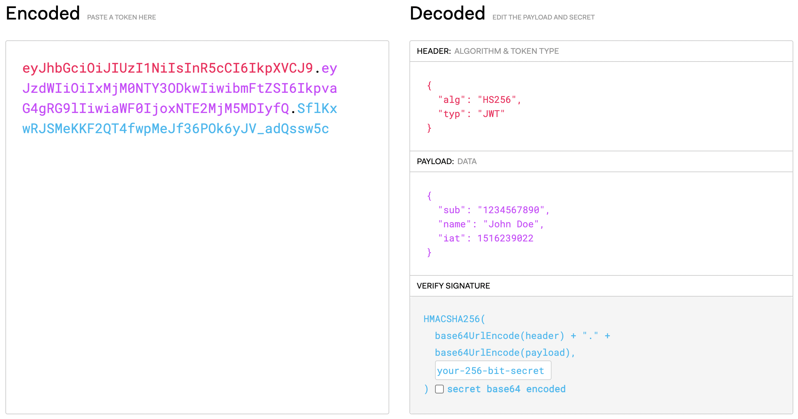

## 什么是 JWT?
JWT 是 JSON Web Token 的缩写，它是一种开源标准（[RFC 7519]），用来定义通信双方如何安全地交换信息的格式。

本身定义比较简单，结合实践经验，我总结了几点能够更好地帮助理解什么是JWT。

::: tip 重点
- JWT 之所以叫 JSON Web Token，是因为其头部和载荷在编码之前都是 JSON 格式的数据
- JWT 是一种标准，它有很多的实现方案，比如 jwt-auth，专门为 PHP 框架 laravel 打造，java 玩家可以看下java-jwt
- JWT 规定以 JSON 的格式传递信息，负载的数据格式是 JSON，通常使用 base64 编码
- JWT 是自包含的，Token 本身携带了验证信息，不需要借助其他工具就可以知道一个 Token 是否有效，以及查看载荷信息
- JWT 的某些实现比如黑名单机制、Token 刷新等增强功能，可能也需要借助其他工具，但是这并不违背自包含特性。
:::

## JWT 的结构



上图直观地展示了 JWT 结构，三种颜色代表三个部分：头部、载荷、签名。

### 头部

头部本身是 JSON 格式的。

> 注意这里说的是编码之前的格式。

头部包括两个字段，token 的类型 `typ` 和加密算法 `alg`。

> 注意：这里的加密算法是签名的加密算法，不是头部的加密算法，也不是载荷的加密算法。实际上头部并没有经过加密，只是通过 base64 编码成字符串。

### 载荷

载荷也是 JSON 格式的，经过 base64 编码成字符串。上图例子可以看到有 `sub`，`name` 和 `iat` 三个字段。实际上载荷的信息可以安全填写，符合 JSON 格式即可。

以下是一些标准字段，用来确保 jwt 有效工作。

| 字段 | 说明                                                                             |
| ---: | :------------------------------------------------------------------------------- |
|  iss | Issuer 的简写，代表 token 的颁发者                                               |
|  sub | Subject 的简写，代表 token 的主题                                                |
|  aud | Audience 的简写，代表 token 的接收目标                                           |
|  exp | Expiration Time 的简写，代表 token 的过期时间，时间戳格式                        |
|  nbf | Not Before 的简写，代表 token 在这个时间之前不能被处理，主要是纠正服务器时间偏差 |
|  iat | Issued At 的简写，代表 token 的颁发时间                                          |
|  jti | JWT ID 的简写，代表 token 的 id。通常不同用户认证时，其 token 的 jti 是不同的    |

以上字段都是 [RFC 7519] 标准确定的字段，通常由具体的实现框架来处理，使用者不需要关心。

> 注意：除了以上标准定义的字段，用户可以自由添加需要的信息。通常我们会把全局、经常使用、安全要求不高的信息写入载荷，比如用户 ID、用户名等信息。

## JWT 认证流程

```
+---------+                              +--------+
|  Client |                              | Server |
+----+----+                              +--------+
     |                                        |
     |   1. (username, password)              |
     +--------------------------------------->+
     |                                        +-----+
     |                                        |     | 2. create a JWT with a secret
     |                                        +<----+
     |                               3. JWT   |
     +<---------------------------------------+
     |                                        |
     |                                        |
     |   4. JWT on Authorization Header       |
     +--------------------------------------->+
     |                                        +-----+
     |                                        |     | 5. check JWT signature and decode
     |                          6. response   +<----+    user information from JWT
     +<---------------------------------------+
     |                                        |
```

1. 用户使用账号和密码登录，调用后端登录接口
2. 服务器登录程序生成 jwt（注意这里小写指的是具体的 token），这一步通常是由 jwt 插件完成的，我们只需要配置 jwt 加密密钥、token 刷新时间和有效时间
3. 服务器返回 jwt 给客户端
4. 客户端之后的请求带上 token 即可，只要在 token 的有效期内
5. 服务器收到客户端的请求，会验证 token 的合法性和有效性，验证通过之后处理请求
6. 服务器发送响应给客户端

## JWT 常见误区
- 因为使用 base64 编码，JWT 是不安全的。这种理解是错误的，头部和载荷确实使用了 base64 编码，作用是编码而非加密，就是这么设计的，便于前端解码获取信息，所以头部和载荷不要存放保密信息。
- JWT 是自包含的，不需要借助数据库和缓存。这种理解是错误的，当需要高级功能，比如 token 刷新、黑名单、多人共享账号等，还是需要借助缓存和数据库。
- 获取头部和载荷信息之后可以修改或者伪造 token。这是不可能的，即使头部和载荷的信息完全一样，但是加密的私钥不对，签名也是不对的，后端验证也没法通过。

## 参考文献
- [Introduction to JSON Web Tokens](https://jwt.io/introduction/)
- [RFC 7519]
- [深入浅出之JWT(JSON Web Token)](https://zhuanlan.zhihu.com/p/355160217)

[RFC 7519]: https://tools.ietf.org/html/rfc7519
