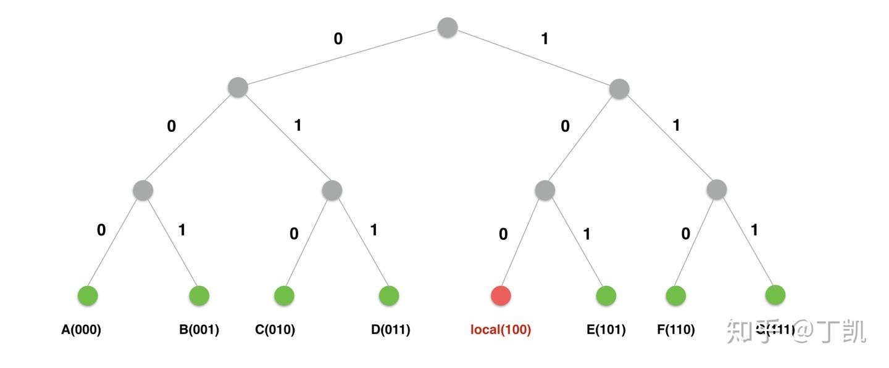

## 背景

[Kademlia] 是美国纽约大学的 P. Maymounkov 和 D. Mazieres 在 2002 年发布的一项研究结果。Kademlia 是一种分布式哈希表（Distribute Hash Table, a.k.a. DHT），是第三代对等网络的**节点动态管理**和**路由**协议。

与前两代协议如 Chord、CAN、Pastry 等相比，Kademlia 以全局唯一 ID 标记对等网络节点，以节点 ID 异或（XOR）值度量节点之间距离，并通过距离分割子树构建路由表，建立了一种全新的网络拓扑结构。相比于其他算法，更简单，更高效。

研究 Kademlia 是因为最近一段时间在关注 IPFS -- 一个对等网络下的全球存储系统，其内部便是使用了该协议管理网络节点，进行对象存取。

## 现有问题

使用一个对等网络(P2P Network)构建分布式存储系统，需要解决以下几个关键问题：

- 如何构建一致的网络拓扑？
- 如何快速查找特定网络节点（节点路由技术）？
- 如何处理网络中节点动态变化？
- 如何构建存储对象与节点之间的映射关系？
- 如何处理节点动态变化时的对象可靠性和可用性？

带着这些问题，我们一步步揭开 Kademlia 协议的神秘面纱。

## 构建网络拓扑

Kademlia 网络的每个节点都会被分配唯一的节点 ID，一般是 160 比特的二进制数。节点之间可以计算距离，距离以节点 ID 的 XOR 值度量: `d(M,N)=XOR(M,N)`。

因此，**节点之间的距离越近，意味着节点 ID 的公共前缀越长**。节点距离远近以其最长公共前缀(Common Prefix Length，a.k.a. CPL)为度量，CPL 越大，表示两个节点越接近，例如

```
A=(000100), B=(000011) => CPL(A,B)=3
```

一个完整的网络空间可以被表示成为一棵如下所示的二叉树，树的叶子节点代表网络节点，其中演示了使用 3 比特作为节点 ID 位数的节点树结构。


从网络中每个节点的视角来看，它可以根据公共前缀长度将这棵二叉树分解为一系列不包含自己的子树。

- 顶层的子树由整棵不包含自己的树的另一半组成，即与节点之间的公共前缀长度为 0
- 下一层子树由剩下部分不包含自己的一半组成，即公共前缀长度为 1
- 依此类推，直到分割完整棵树。

下图展示了以节点 M​ 视角分割以上网络树的结果：


- 节点 A、B、C、 D 与 M 的公共前缀长度为 0，将其归为一个单元
- 节点 F、G 与 M 的公共前缀长度为 1，将其归为单元 2
- 节点 E 与 M 的公共前缀长度为 2，将其归为单元 3

按照前面的定义，公共前缀长度 CLP 衡量节点远近，因此，基于 CLP 可以将网络中的节点分为以下 3 组：

| CLP | 节点       |
| --: | :--------- |
|   0 | A、B、C、D |
|   1 | F、G       |
|   2 | E          |

总结发现：从任一节点来看，CLP 为 0 的节点占据网络节点总数的 1/2，CLP 为 1 的节点占据网络节点总数的 1/4，以此类推。

## 构建路由表

构建路由表的本质是建立到网络全局的地图，目标是：给定任意节点 X ​，可以为节点 ​M 很容易计算出 ​ 距离 X 更近的节点列表。虽然理想目标是本地一步到位的查找，但这不现实，需要维护数量巨大的全局节点信息。退而求其次，我们采用迭代查找的思路：每次查找要距离目标更近一点点。

除此以外，节点路由表还必须是动态更新的，以反映网络拓扑的变化。后续部分进一步阐述背后的设计思想。

### 基本

假如当前节点 ID 为 M，X​ 与 ​M 维护的节点 Y​ 的异或值为 `d(X,Y)=d(X,M) XOR d(M,Y)`，其中：`d(A,B)=A XOR B`。这个证明也很简单：

```
d(X,M) XOR d(M,Y)=(X XOR M) XOR (M XOR Y)=X XOR M XOR M XOR Y=X XOR 0 XOR Y=X XOR Y
```

上面的问题就转化为：当 M​ 收到询问距离 X 更近的节点请求时，M 首先计算自身距离目标节点的距离 `d(M,X)=d1`，然后再从自己维护的节点列表选出距离 ​M 为 `d1`​ 的所有节点（翻译一下：即从 M 的路由表找到与 X​ 有最长公共前缀的所有节点）。

前面的网络拓扑告诉我们：Kademlia 协议按照与节点距离切割节点网络树，被切割的子树称之为**桶**（Bucket）​。整个路由表本质上便是桶的数组，协议以 M​ 聚类网络节点：每个桶的节点必然与本节点具有相同的最长公共前缀。

由于节点 ID 只有 160 比特，最长公共前缀长度最大只有 160。因此，路由表中的桶数量最多也就 160，但是每个桶内节点数量可能会非常多。根据之前的计算，相对于参考节点，CLP=0 的节点数占据网络节点总数的 1/2，CLP=1 的节点数占网络总节点数的 1/4，...

Kademlia 协议对每个桶维护的节点数设置了一个上限，称之为 **`K` 值**，在一般的实现中 `K=20`​。一旦桶内节点数超过 `K`​，便根据一定的淘汰算法进行更新。

根据该基本原理，节点 M(100) 构建的路由表如下图所示：

| CLP | 桶下标 | 节点                           |
| --- | ------ | ------------------------------ |
| 0   | 0      | A(000)、B(001)、C(010)、D(011) |
| 1   | 1      | F(110)、G(111)                 |
| 2   | 2      | E(101)                         |
| 3   | 3      | M(100)                         |

### 分裂

在一些 Kademlia 协议实现中，每个节点初始时只有一个桶，感知到网络上有节点时，直接将远程节点信息添加至该桶，直到该桶节点数量超过 `K`​，此时开始分裂为两个桶。

所谓的分裂是指创建一个新桶，然后将原来桶内的部分节点迁移至新桶。因为原桶内的节点与本节点的距离不尽相同，所以迁移的原则是：将与本地节点更近(即 CLP​ 更大)节点迁移至新桶。迁移完成后再判断新建桶内节点数是否超过 ​`K` 限制。如果是，继续对该新建桶进行分裂。

上面提到迁移的过程会将部分节点迁移至新桶 ​，那么如何选择这些需要被迁移的节点呢？答案是根据桶内节点与本节点之间的 CPL 决定。

初始状态时，本地只有 1 个桶 ​，此时分裂的目标是：

```
newBucket := bucket.Split(len(rt.Buckets)-1, rt.local)
```

以上公式的意思是：基于 CPL，将最后一桶与 `rt.local` 节点的 CPL 超过 ​`len(rt.Buckets)` 的节点都迁移至新桶。CPL=0 即距离当前节点最远的那部分节点（没有任何公共前缀）。翻译成人话就是：在原桶保留相对本节点 `rt.local`​ 的 CPL=0（无任何公共前缀）的节点，将其他节点迁移至新桶。

一次分裂后，第一个桶保留的全部是与当前节点无任何公共前缀的节点，第二个桶保留的全部是与当前节点公共前缀大于等于 1 的节点。

接下来判断第二个桶是否需要再次分裂。如果需要，再次创建新桶 ​，然后将第二个桶与本地节点公共前缀超过 1 的节点迁移至新桶，与本地节点公共前缀长度为 1 的节点依然保留在第二个桶。

下图直观地演示分裂过程，假设演示中桶内的最大节点数为 `K=1`，而不是 20。



假设本地节点为 `Local(100)`，初始时所有其他节点都位于一个桶，共包含 7 个节点。

### 第一次分裂

创建一个新的桶 ​，将旧桶中相对 `local` CPL>0 的节点迁移至新桶 ​。于是，此时两个桶的内容变为：

```
Bucket1=(A,B,C,D)
Bucket'=(E,F,G)
```

接下来再次分裂，将其中相对 `local` CPL>1 的节点迁移至新桶 ​，变为：

```
Bucket2={F,G}
Bucket3={E}
```

形成了如下的分区：


## 路由算法

路由算法要解决的是如何根据目标 ID 找到地址或者找到距离该目标 ID 最近的节点地址。

在一个对等网络中，某个节点要查询其他节点的信息时，它可依赖的信息只有两个：

- 目标节点 ID
- 当前节点维护的路由表

其查询的核心思想是：**逐步迭代，递近查找**。其基本过程如下：

1. 发起者首先计算自身 L 与目标节点 T 的 CPL。查询本地维护的路由表，计算 `Bucket=L.Buckets[CPL]`，这个桶的节点与目标节点有着公共前缀。然后再从该桶中选择与目标节点有最长 CPL ​ 的节点 X（只有一个）​，接下来本地节点向 X 发起查询请求 `QueryPeers`，因为 X 距离 T 更近，相当于第一次缩短了与目标节点 ​T 的距离；
2. X 收到 L 发起的对目标节点 T 的定位消息(`Message_FIND_NODE`)时，会根据自身维护的路由表信息，返回距离 T​ 更近的节点供查询发起者继续查询。当然，如果目标节点就是 X 自身，那直接返回自身信息即可。需要说明的是：X​ 给 L 返回的响应并非是距离目标节点最近的那一个节点，而是一批节点（即协议定义的 `K`​ 值）。这样做有几点好处：
   - 避免单个节点不可用导致的查询失败
   - 查询发起者可以根据响应结果进行并发查询，提升查询速度
3. 查询发起者 L 收到响应后，会将被这些作为接下来的查询对象继续进行查询。查询收到响应时，会对响应的结果进行过滤：**如果该节点在之前已经被询问过，便不再加入待查询列表，保证查询的收敛性**。

查询的最终结果是得到了一批距离目标节点很近的节点列表，然后从节点列表选出最接近目标的 1 个节点。选择这 ​ 个节点的目的是可用来读，也可用来写对象，具体见后面描述。（TODO 没懂= =）

下图摘自原始论文，基本描述了查询流程。


## 路由表更新

Kademlia 网络中节点是动态变化的：节点可新接入网络，也可从网络离线。这也意味着每个节点的路由表也是一直变化着的。

### 新节点上线

新节点 N 上线时，需要为其提供一个种子节点 S​，让 N 借助 S​ 作为中介加入 Kademlia 网络，具体操作如下：

1.​ 将 S 加入本地路由表，成为 N 的种子节点；
2.​ 向 S 发起一次节点查询请求(`FIND_NODE`)，查询的目的节点其实是 N 自身；该请求的目的有二：

- 告诉 S​ 新增了节点 N
- 通过 S 发现集群中更多的节点。

  > N 发起指向自身的查询请求也很有意思：其一是因为 N​ 此时还不知道系统更多的节点信息；其二是通过这种方式 N 可以快速地找到更多距离自己更接近的节点。

3. S 收到 N​ 的查询目标节点请求，首先将节点 N 加入自身的路由表中，然后给 N 最多返回 K 个距离 N​ 更接近的节点信息；
4. N 收到 ​S 的响应，将响应中的节点加入自身路由表，然后对这些节点分别发起查询请求，当然查询的目标还是 N 自身。

通过上面的重复步骤，新增节点 N 逐步建立起对网络节点的理解，而且通过该机制，新增节点 N 会更多地发现距离自己更接近的节点信息。

### 节点离线

节点离线在 Kademlia 协议中无需做特殊处理。如果某个节点离线，那么其离线事件最终会反馈到网络节点的路由表，将其从路由表剔除即可，相比于 Chord 协议有了极大的简化。

## 用 Kademlia 网络存储对象

使用 Kademlia 网络构建大规模分布式存储系统，需要解决以下两个核心问题：

- 建立对象与网络节点之间的映射
- 节点动态变化时保证对象的可访问

### 对象与节点映射

建立对象与节点的映射，一般有两种方法：

- 查表：维护全局 `(对象, 节点)` 映射表
  - 这种方法需要维护庞大的全局映射表，且其很明显会成为系统瓶颈，且违背了对等网络的原则。
- 计算：直接根据对象特征，通过数学运算得到目标节点
  - 这种方法必须将对象映射至节点空间，即将对象根据其唯一特征计算 160 比特的指纹，根据该指纹找到网络中与其指纹最接近的 ​ 个节点，这些节点成为对象的最终存储目的地。一般这个指纹会选取对象内容的哈希，便于对象去重和对象的唯一性保证。而之所以选择多个节点存储对象是为了提高对象数据的可靠性。

### 对象 Re-Publishing

在 P2P 网络中，节点是动态变化的，而结合我们刚刚描述的对象节点映射算法，可能会导致以下几个问题:

- 对象 `(k,v)` 被存储在与 `k` 距离最接近的 `K` 个节点，如果 `K` 个节点全部离线，那么对象便不可达；
- 对象 `(k,v)` 被存储在与 `k` 距离最接近的 `K` 个节点，如果网络新加入节点 N​ 且 N 离 `k` 更接近，对象也需要进行一次迁移。因为下次去查找的时候，会直接定位到 N​，如果数据不迁移至 N，那时对象虽然数据存在，但也不可达。

解决上面的问题有以下两种思路：

1. Pull：如果新增一个节点 ​N，且 N 距离某对象 O 更为接近，此时某节点访问对象内容，根据算法很可能被定位至节点 N​ 上，此时再去 O 当前所在的节点上拉取数据返回给对象访问者；
2. Push：如果新增一个节点 N​，且 N 距离某对象 O 的更为接近，一旦对象 O​ 所在的节点探测到 N 的存在，会主动地将数据推至 N，这也可以保证下次访问 O 时无需中转而直接获取到数据。

对比两种方案:

- 方案 1 中，新增节点 N 需要了解对象此时所在节点位置，这是做不到的，可以根据自身路由表计算出当前距离 O 最接近的节点，但是没法知道前一个时刻距离 O 最接近的节点；而且该方案没法处理节点批量离线导致对象不可访问的问题。
- 方案 2 看起来是可行的，探测到新节点 ​N 加入，然后计算本地存储对象中有哪些距离 N 更为接近，将这些接近的对象推送至 N​。当然，这种做法也无法时刻都在做。因为在大量节点的 P2P 网络中，节点变更是常态，一种比较合理的方式是定期做检查。但是该方案依赖于已有节点能够感知到新增 N 的存在，好在需要迁移对象的一定是距离很接近的节点。在我们前面新增节点流程描述可以知道一个新增节点上线时，算法会偏向于将该新增节点通知到距离其更近的节点。因此，一旦一个新节点上线，那么距离其接近的节点就会更快地了解到该节点信息，从而将其本地存储的数据可以推送至新增节点。

通过对比可确认方案 2 才是切实可行的，而且符合 P2P 网络松耦合的设计。但是该方案也并非完美：一旦有新增节点可能就会带来大量的数据拷贝，消耗大量资源。万事万物总是这样，在收获好处的同时总得付出代价。

在论文中，作者提出了按照小时为单位执行 Re-Publishing：每个小时，每个节点对本地存储的每一个对象进行 Re-Publishing。每一次 Re-Publishing 包括下面两个步骤:

1. 查询当前最近的 `K` 个节点信息；
2. 节点向 1 中获得的节点发送数据存储消息，从而完成数据更新

针对每个节点的每个对象都执行类似操作，会导致 P2P 网络出现突激的网络流量。仔细分析上面的行为，我们可以发现，其实很多的 Re-Publishing 是无用的：

- 如果在一个小时的周期内，网络拓扑没有发生变化，那根本不需要进行 Re-Publishing；
- 对于不同的节点 ​，如果对象在节点 X 和 Y​ 均已存储，那其实在一个 Re-Publishing 周期内，只需要一个节点(或者 ​)来更新即可，没必要大家同时一起上，浪费资源；

关于步骤 1 中的 K-Closest 查询是否有必要：因为根据上面的表述，对于新增节点，其实是可以很快速地反映到最近节点路由表，所以一般情况下，查询本地节点路由表即可。

针对上面的疑问，论文中也提出了几点优化方案：

- 避免不必要的 Re-Publishing：如果对象刚被写入（Re-Publishing 周期内写入的），那么认为该对象其实是被写到最新的网络拓扑节点中，那就不对该对象做 Re-Publishing；
- 关于多节点同时 Re-Publishing 相同对象问题，可以这么解：将不同节点的 Re-Publishing 设置不一样（如在一个范围内随机取值），这样，例如节点 X Re-Publishing 了对象 O​，节点 Y 再次 Re-Publishing 对象时便发现其最后修改时间是刚刚，根据上面的描述，节点 Y 就不再 Re-Publishing 了，存储 O 的其他节点同样如此，有效避免了一个周期内多节点同时 Re-Publishing 问题；

关于避免节点更新的问题，看看论文吧~

## 参考文献

- [Kademlia: A Peer-to-peer Information System Based on the XOR Metric][kademlia]
- [Kademlia 协议](https://zhuanlan.zhihu.com/p/38425656)
- [libp2p/go-libp2p-kad-dht](https://github.com/libp2p/go-libp2p-kad-dht)

[kademlia]: https://pdos.csail.mit.edu/~petar/papers/maymounkov-kademlia-lncs.pdf
