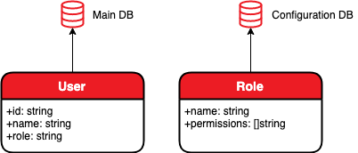

> 原文：https://www.perimeterx.com/blog/ok-lets-go/

Go语言发布于2009年尾，2012年正式发布，但真正引起关注是在最近几年。它是[2018年增长最快的语言](https://github.blog/2018-11-15-state-of-the-octoverse-top-programming-languages/)之一，且是[2019年三大最受喜爱的编程语言](https://insights.stackoverflow.com/survey/2019#most-loved-dreaded-and-wanted)之一。

作为初生牛犊一枚，Go社区尚未严肃对待编码规范。放眼比Go长久的Java等社区的编码传统，会发现它们的大多数项目都有类似的结构。这对付大型代码库非常有效，但很多人认为这对当代用例来说，这是不利于提高生产力的。在微型系统开发过程维护小型代码库时，Go在项目结构方面的灵活性可以实现很多特性。

对比[Golang的hello world http例子](https://yourbasic.org/golang/http-server-example/)和诸如[Java](https://www.javacodex.com/Networking/Simple-HTTP-Server)等其他语言，两者在复杂性和代码量方面没有显著区别。但是，Go则明显地鼓励我们--**尽可能地写简洁的代码**。忽略Java的面向对象，个人觉得这些代码片段表明：Java要求为每项操作创建专用实例（`HttpServer`实例），而Go则会推崇全局单例。

这意味着更少代码需要维护，更少引用到处飞。如果预知只会用到一个服务器（通常如此），何必如此大费周章呢？随着代码量的增长，此项理念的强大之处越会明显。然后，路漫漫其修远兮😩。不同层次的抽象有待商榷，而错误的选择会引入严重的缺点。

莫慌，PerimeterX来相助！

本文重点介绍组织代码结构的3种方式，每种方式对应不同抽象层次。然后比较它们并说明各自的适用场景。

现有需求实现一个HTTP服务器维护用户信息（对应下图的Main DB），其中每个用户具有不同角色（例如，普通、仲裁者、管理员等），外加一个数据库（下图的Configuration DB）存储每种角色的不同权限（例如，读、写，编辑等）。这个HTTP服务器应提供查询给定用户ID所对应权限的接口。



进一步假设configuration DB变化非常不频繁且加载很慢，因此，我们想要将其维护在内存里面，服务器启动完成即加载，然后每小时刷新一次。

全部代码在[本文的Github仓库](https://github.com/PerimeterX/ok-lets-go)。

## 方式1：一个大包  

一个大包的方式表现为扁平结构，整个服务器全部在一个包内实现。[完整代码](https://github.com/PerimeterX/ok-lets-go/tree/master/1-single-package)。

::: tip
注意啦：代码片段的注释对理解每种方式尤其重要。
:::

[main.go](https://github.com/PerimeterX/ok-lets-go/blob/master/1-single-package/main.go)

```go
package main

import (
    "net/http"
)

// As noted above, since we plan to only have one instance
// for those 3 services, we'll declare a singleton instance,
// and make sure we only use them to access those services.
var (
    userDBInstance   userDB
    configDBInstance configDB
    rolePermissions  map[string][]string
)

func main() {
    // Our singleton instances will later be assumed
    // initialized, it is the initiator's responsibility
    // to initialize them. 
    // The main function will do it with concrete
    // implementation, and test cases, if we plan to
    // have those, may use mock implementations instead.
    userDBInstance = &someUserDB{}
    configDBInstance = &someConfigDB{}
    initPermissions()
    http.HandleFunc("/", UserPermissionsByID)
    http.ListenAndServe(":8080", nil)
}

// This will keep our permissions up to date in memory.
func initPermissions() {
    rolePermissions = configDBInstance.allPermissions()
    go func() {
        for {
            time.Sleep(time.Hour)
            rolePermissions = configDBInstance.allPermissions()
        }
    }()
}
```

[database.go](https://github.com/PerimeterX/ok-lets-go/blob/master/1-single-package/database.go)

```go
package main

// We use interfaces as the types of our database instances
// to make it possible to write tests and use mock implementations.
type userDB interface {
    userRoleByID(id string) string
}

// Note the naming `someConfigDB`. In actual cases we use
// some DB implementation and name our structs accordingly.
// For example, if we use MongoDB, we name our concrete
// struct `mongoConfigDB`. If used in test cases,
// a `mockConfigDB` can be declared, too.
type someUserDB struct {}

func (db *someUserDB) userRoleByID(id string) string {
    // Omitting the implementation details for clarity...
}

type configDB interface {
    allPermissions() map[string][]string // maps from role to its permissions
}

type someConfigDB struct {}

func (db *someConfigDB) allPermissions() map[string][]string {
    // implementation
}
```

[handler.go](https://github.com/PerimeterX/ok-lets-go/blob/master/1-single-package/handler.go)

```go
package main

import (
    "fmt"
    "net/http"
    "strings"
)

func UserPermissionsByID(w http.ResponseWriter, r *http.Request) {
    id := r.URL.Query()["id"][0]
    role := userDBInstance.userRoleByID(id)
    permissions := rolePermissions[role]
    fmt.Fprint(w, strings.Join(permissions, ", "))
}
```

> 温馨提示：不同功能可以通过不同文件来区分，使代码更加易读且利于维护。

## 方式2：组合包  

这种方式引入不同包。每个包应唯一负责某种行为的实现。此时，包之间允许有所交互，以维护更少代码。同时，职责划分原则应得到遵循以确保每个流程在唯一的包内实现。这种方式的另一个主要事项是：Go不允许包之间的循环引用，**接口**和**单例**的定义需要放到一个**中性包**，从而避免代码的循环依赖。[完整代码](https://github.com/PerimeterX/ok-lets-go/tree/master/2-coupled-packages)

[main.go](https://github.com/PerimeterX/ok-lets-go/blob/master/2-coupled-packages/main.go)

```go
package main

// Note how the main package is the only one importing
// packages other than the definition package.
import (
    "github.com/myproject/config"
    "github.com/myproject/database"
    "github.com/myproject/definition"
    "github.com/myproject/handler"
    "net/http"
)

func main() {
    // This approach also uses singleton instances, and
    // again it's the initiator's responsibility to make
    // sure they're initialized.
    definition.UserDBInstance = &database.SomeUserDB{}
    definition.ConfigDBInstance = &database.SomeConfigDB{}
    config.InitPermissions()
    http.HandleFunc("/", handler.UserPermissionsByID)
    http.ListenAndServe(":8080", nil)
}
```

[/definition/database.go](https://github.com/PerimeterX/ok-lets-go/blob/master/2-coupled-packages/definition/database.go)

```go
package definition

// Note that in this approach both the singleton instance
// and its interface type are declared in the definition
// package. Make sure this package does not contain any
// logic, otherwise it might need to import other packages
// and its neutral nature is compromised.
var (
    UserDBInstance   UserDB
    ConfigDBInstance ConfigDB
)

type UserDB interface {
    UserRoleByID(id string) string
}

type ConfigDB interface {
    AllPermissions() map[string][]string // maps from role to its permissions
}
```

[/definition/config.go](https://github.com/PerimeterX/ok-lets-go/blob/master/2-coupled-packages/definition/config.go)

```go
package definition

var RolePermissions map[string][]string
```

[/database/user.go](https://github.com/PerimeterX/ok-lets-go/blob/master/2-coupled-packages/database/user.go)

```go
package database

type SomeUserDB struct{}

func (db *SomeUserDB) UserRoleByID(id string) string {
    // implementation
}
```

[/database/config.go](https://github.com/PerimeterX/ok-lets-go/blob/master/2-coupled-packages/database/config.go)

```go
package database

type SomeConfigDB struct{}

func (db *SomeConfigDB) AllPermissions() map[string][]string {
    // implementation
}
```

[/config/permissions.go](https://github.com/PerimeterX/ok-lets-go/blob/master/2-coupled-packages/config/permissions.go)

```go
package config

import (
    "github.com/myproject/definition"
    "time"
)

// Since the definition package must not contain any logic,
// managing configuration is implemented in a config package.
func InitPermissions() {
    definition.RolePermissions = definition.ConfigDBInstance.AllPermissions()
    go func() {
        for {
            time.Sleep(time.Hour)
            definition.RolePermissions = definition.ConfigDBInstance.AllPermissions()
        }
    }()
}
```

[/handler/user_permissions_by_id.go](https://github.com/PerimeterX/ok-lets-go/blob/master/2-coupled-packages/handler/user_permissions_by_id.go)

```go
package handler

import (
    "fmt"
    "github.com/myproject/definition"
    "net/http"
    "strings"
)

func UserPermissionsByID(w http.ResponseWriter, r *http.Request) {
    id := r.URL.Query()["id"][0]
    role := definition.UserDBInstance.UserRoleByID(id)
    permissions := definition.RolePermissions[role]
    fmt.Fprint(w, strings.Join(permissions, ", "))
}
```

## 方式3：独立包  
这种方式也会将项目组织成包。每个包必须**局部地**声明所依赖的**接口**和**变量**，**无须感知其他包的存在**。按照这种方式，前一种方式用于定义的包实际上被分散到所有包；每个包声明自己所需服务的接口。咋一看会觉得这些重复有些烦，事实并非如此。每个用到外部服务的包自己定义接口，**声明所需接口**，而忽略其他无关接口。[完整代码](https://github.com/PerimeterX/ok-lets-go/tree/master/3-independent-packages)

[main.go](https://github.com/PerimeterX/ok-lets-go/blob/master/3-independent-packages/main.go)

```go
package main

// Note how the main package is the only one importing
// other local packages.
import (
    "github.com/myproject/config"
    "github.com/myproject/database"
    "github.com/myproject/handler"
    "net/http"
)

func main() {
    userDB := &database.SomeUserDB{}
    configDB := &database.SomeConfigDB{}
    permissionStorage := config.NewPermissionStorage(configDB)
    h := &handler.UserPermissionsByID{UserDB: userDB, PermissionsStorage: permissionStorage}
    http.Handle("/", h)
    http.ListenAndServe(":8080", nil)
}
```

[/database/user.go](https://github.com/PerimeterX/ok-lets-go/blob/master/3-independent-packages/database/user.go)

```go
package database

type SomeUserDB struct{}

func (db *SomeUserDB) UserRoleByID(id string) string {
    // implementation
}
```

[/database/config.go](https://github.com/PerimeterX/ok-lets-go/blob/master/3-independent-packages/database/config.go)

```go
package database

type SomeConfigDB struct{}

func (db *SomeConfigDB) AllPermissions() map[string][]string {
    // implementation
}
```

[/config/permissions.go](https://github.com/PerimeterX/ok-lets-go/blob/master/3-independent-packages/config/permissions.go)

```go
package config

import (
    "time"
)

// Here we declare an interface representing our local
// needs from the configuration db, namely,
// the `AllPermissions` method.
type PermissionDB interface {
    AllPermissions() map[string][]string // maps from role to its permissions
}

// Then we export a service than will provide the
// permissions from memory, to use it, another package
// will have to declare a local interface.
type PermissionStorage struct {
    permissions map[string][]string
}

func NewPermissionStorage(db PermissionDB) *PermissionStorage {
    s := &PermissionStorage{}
    s.permissions = db.AllPermissions()
    go func() {
        for {
            time.Sleep(time.Hour)
            s.permissions = db.AllPermissions()
        }
    }()
    return s
}

func (s *PermissionStorage) RolePermissions(role string) []string {
    return s.permissions[role]
}
```

[/handler/user_permissions_by_id.go](https://github.com/PerimeterX/ok-lets-go/blob/master/3-independent-packages/handler/user_permissions_by_id.go)

```go
package handler

import (
    "fmt"
    "net/http"
    "strings"
)

// Declaring our local needs from the user db instance,
type UserDB interface {
    UserRoleByID(id string) string
}

// ... and our local needs from the in memory permission storage.
type PermissionStorage interface {
    RolePermissions(role string) []string
}

// Lastly, our handler cannot be purely functional,
// since it requires references to non singleton instances.
type UserPermissionsByID struct {
    UserDB             UserDB
    PermissionsStorage PermissionStorage
}

func (u *UserPermissionsByID) ServeHTTP(w http.ResponseWriter, r *http.Request) {
    id := r.URL.Query()["id"][0]
    role := u.UserDB.UserRoleByID(id)
    permissions := u.PermissionsStorage.RolePermissions(role)
    fmt.Fprint(w, strings.Join(permissions, ", "))
}
```

至此，3种不同抽象程度的方式就介绍完了：第一种最为简练，使用全局状态量和紧密耦合的逻辑，提供最快的实现与最少编写和维护的代码；第二种方式是个混血儿；而第3种则完全解耦和可重用，但是要求最多维护的精力。

## 优缺点对比 

### 方式1：一个大包
- 优点
  - 代码最少，能够更快地实现，维护量也少
  - 没有其他包也就意味着无须担心循环依赖的问题
  - 服务型接口的存在利于测试。测试部分逻辑片段时，我们可以选择任意（具体或仿造的）实现的单例，即可完成测试
- 缺点
  - 一个包意味着没有私有访问限制，所有变量全局可见，正确逻辑的实现对开发者要求更高。譬如，需要构造函数来执行一些初始化逻辑时，谨记不要直接实例化结构体
  - 全局状态（单例）可能无法满足一些假设。例如，未初始化单例会在运行时触发空指针异常
  - 紧耦合的逻辑使得无法从这个项目提炼或重用任何东西
  - 没有分包独立管理不同逻辑片段意味着开发者必须非常负责地正确部署每段代码，否则无法保证预期行为

### 方式2：组合包
- 优点
  - 项目分包有助于我们细化每个包所需负责的逻辑，且有编译器强制执行。而且，我们可以采用私有变量和有控制地选择暴露的接口
  - 定义包的使用在避免循环依赖的同时使得单例成为可能。这也就意味着我们可以编写更少代码，避免处理实例的引用传递，无须浪费时间解决可能的编译问题
  - 服务型接口的存在也使得这种方式利于测试。每个包都能够独立地进行测试
- 缺点
  - 组织包比较麻烦，初始实现可能会比“一个大包”的方式来得慢
  - 全局变量（单例）的使用也有问题
  - 项目分散成包，更加利于提炼和重用逻辑。但是，需要与定义包有交集使得这些包并不是完全独立的。这种方式下，提炼代码和实现重用不是完全自动化的

### 方式3：独立包
- 优点
  - 分包有助于我们将实现不同逻辑的负担分散到不同包，并实现访问控制
  - 包之间相互独立也就意味着没有潜在的循环引用问题
  - 所有包都是完全可以提炼和重用的。只要其他项目需要，任何一个包都可以简单地迁移到共享的位置后，无须任何更改即可使用
  - 没有全局状态也就意味着不会有非预期行为
  - 这种方式最便于测试。局部接口的存在使得每个包无法依赖其他包就可以完成测试
- 缺点
  - 实现速度要比前两种方式慢
  - 维护工作量有所加大。需要作出重大更变时，引用传递意味着很多地方需要更新。而且具有多个接口表示同一服务意味着对服务的一项变更会触发全部接口

## 总结和用例分析
缺乏社区指导，Go代码库的结构多样，各有优点。但是，**混用不同设计模式会引入不少问题**。为了组织Go代码，本文介绍了编写和组织Go代码的3种不同方式。

至于何时何地使用何种方式，建议如下：

**方式1**：对于经验丰富的小团队应对小型项目，想要短期出成果，“一个大包”的方式应该是优选。虽然强制规则的缺乏使得维护时需要谨小慎微和大量协调，但是这种方式启动难度更低和速度更快

**方式2**：组合包作为其他两种方式的混血儿，维护起来相对较快和容易，兼备强制规则约束。它适用于更大团队用于处理更大项目的场景，但是仍缺乏重用性和免不了维护精力

**方式3**：“独立包”适用于逻辑负责的、更大型的、更长期的、更大规模团队的或部分逻辑需要后续重用的项目。这种方式需要更长的实现周期和花费更多时间用于维护

在PerimeterX，我们采用了后续两种方式的组合体。常用库采用独立包而服务则采用组合包的方式。强烈希望能够邀请到你来分享组织Go代码的心得。你还知道其他方式吗？你是否有对本文所述方法有改进意见？期待你的声音~