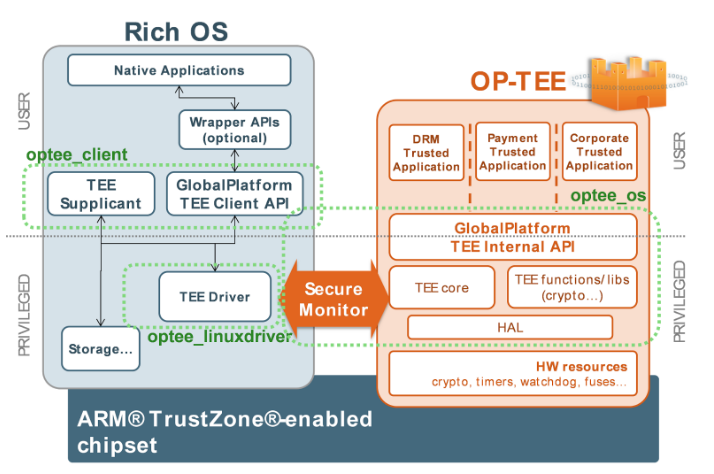

> 本教程是用的是 3.12.0 版本的 [optee][optee-gh]，运行环境为 QEMU 虚拟的 ARMv8 架构。

二级厂商实现自有功能时，需要添加自己的 TA 和 CA 接口。当 CA 接口需要提供给应用调用的时候，一般做法是在 framework 中建立特定的 service，由 service 调用 CA 接口。同时建立对应的 client 部分，与 service 部分通过 Binder 的方式进行通信触发 CA 接口调用的操作。而对于应用，开发者会将 client 部分提供的接口以 JNI 的方式进行封装暴露给上层应用调用。

本文负责理清以下问题
- 当上层应用调用封装好的 JNI 接口之后，CA 接口是如何通知特定的 TA 执行特定操作的呢？
- CA 与 TA 之间的数据是如何传递的呢？
- cortex 的状态是如何切换的呢？

本文将详细讲解一次 CA 接口调用的完整流程（不讨论 FIQ 和 IRQ 的情况，只讨论借助 SMC 指令跳转到 TEE 的情形）。

## 1. 系统层面关系图
下图为层面结构图：



CA 接口处于用户空间，整个调用过程需要经过内核空间、linux 驱动、Monitor 态中断处理、TEE OS 内核、TEE 用户空间。

## 2. 用户空间到内核空间
用户空间调用 CA 接口触发系统调用，陷入内核态，进入内核空间，然后根据传入的参数，找到对应的 TEE 驱动，整个过程的过程大致如下：

```
+--------------------------------+
| +-------------------+          |
| |        API        |  用户态   | 
| +---------+---------+          |
|           |                    |
|           |                    |
|           v                    |
| +---------+---------+          |
| |       glibc       |          |
| +---------+---------+          |
|           |                    |
|           |                    |
|           v                    |
| +---------+-----------------+  |
| |     __syscall             |  |
| | (触发 linux 内核注册的软中断)|  |
| +---------------------------+  |
+------------|-------------------+
             |
             |
+------------|-------------------+
| +----------v------------+      |
| | 系统调用软中断的响应函数  |      |
| +---------+-----+------++      |
|           |                    |
|           |     内核态          | 
|           v                    |
| +---------+-----+----+         |
| |  查看系统调用表，     |         |
| | 找到对应的系统调用    |         |
| +---------+----+-----+         |
|           |                    |
|           |                    |
|           v                    |
| +---------+----------------+   |
| | 查找 TEE 驱动并调用对应操作  |   |
| +--------------------------+   | 
+--------------------------------+
```

关于该部分更加详细的内容，例如：软中断如何注册到内核，系统调用的定义等请自行查阅系统调用和驱动的相关资料。

## 3. TEE 驱动到 monitor 态
TEE 的驱动最终会调用 `SMC` 这条汇编指令来实现与 OP-TEE 的通信。`SMC` 汇编指令触发 SMC 软中断。该软中断的处理在Cortex 的 Monitor 态进行。随着 ARM 提供 ATF（ARM trust firmware），SMC 的软中断具体处理函数在 ATF 被实现。该软中断会根据发送指令是属于安全侧请求还是非安全侧的请求来控制是将 Cortex 切换到安全世界态还是常规世界态。该切换动作在 ATF 的 SMC 中断处理函数实现。

## 4. TEE 内核空间到 TEE 用户空间
当 SMC 中断处理函数完成将 Cortex 的状态切换到安全世界态以及相关参数的拷贝动作之后，TEE OS 将接管剩下的操作。TEE OS 首先获取 CA 端传递过来的数据，然后从数据中解析出 TA 的 UUID，然后查找对应的 TA image 是否被挂载到 TEE OS。

如果 TA image 尚未挂载，TEE OS 将会与常驻 linux 的 tee_supplicant 进程通信，从文件系统获取到 TA image 文件，并传递給 TEE OS，然后加载该 TA image。处理完整之后，TEE OS 会切换到 TEE 用户空间，并将 CA 传递过来的其他参数传给具体的 TA 进程。TA 进程获取到参数后，首先需要解除出参数的 `commondID`，根据 `commandID` 执行具体操作。

TEE OS 在加载 TA image 的时候会验证 TA image 的签名合法性。上述步骤的大致流程图如下：

```
+---------------------+          +----------------+
|         SMC         |          |   file system  |
+----------+----------+          +----+-----+-----+
           |                          |     ^
           |                          |     |
           v                          v     |
+----------+----------+          +----+-----+-----+
|        TEE OS       +<---------+ TEE supplicant |
+----------+----------+          +---------+------+
           |                               ^
           |                               |
           v                               |
+----------+-----------+                   |
| If TA image is ready +------N------------+
+----------+-----------+
           |
           Y
           |
           v
+----------+-----------+
| TA image handle      |
+----------------------+
```

一次完整的 CA 调用过程会依次调用 `InitializeContext`、`OpenSession`、`InvokeCommand`、`Close Session` 和 `FinalizeContext` 等操作，所以上图只是大致流程，详细部分将会在后续文章逐步讲解。

## 5. GP 规定的 CA 端接口
GP 规定的 CA 端接口较少，主要的是以下 5 个接口如下：

|                   接口 | 说明                                                              |
| ---------------------: | :---------------------------------------------------------------- |
| TEEC_InitializeContext | 初始化 TEE 上下文，完成启动 TEE 驱动，建立与 TEE 之间的会话上下文 |
|       TEEC_OpenSession | 建立 CA 与 TA 之间的会话窗口                                      |
|     TEEC_InvokeCommand | 请求 TA 执行具体操作                                              |
|      TEEC_CloseSession | 关闭 CA 与 TA 之间的会话窗口                                      |
|   TEEC_FinalizeContext | 清空会话上下文                                                    |

## 参考文献
- [OP-TEE中CA接口调用的完整流程----系统各层面关系](https://icyshuai.blog.csdn.net/article/details/71697371)

[optee-gh]: https://github.com/OP-TEE/optee_os/tree/3.12.0
