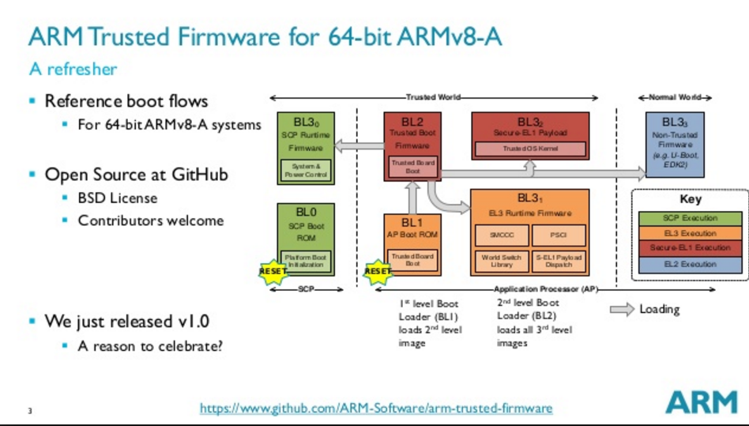

ATF 全称为 ARM Trusted Firmware。

ATF 将系统启动从最底层进行完整的统一划分，把 secure monitor 的功能放到了 bl31。系统完全启动之后，CA 或者 TEE OS 触发 SMC（Secure Monitor Call）或者其他中断时，首先遍历注册到 bl31 的对应 service 来选择具体的 handle，这样可以统一管理和分配系统所有的关键 SMC 或者中断操作。ATF 的 code boot 整个启动过程框图如下：


上述启动过程中，每个 image 跳转到下一个 image 的方式各不相同。下面介绍启动过程中每个 image 跳转到下一个 image 的过程。

1. bl1 跳转到 bl2
    - bl1 加载 bl2 image 到 RAM、设定中断向量表以及完成其他 CPU 相关设定之后，`bl1_main` 函数解析出 bl2 image 的描述信息，获取入口地址，并设定下一个阶段的 CPU 上下文。完成之后，调用 `el3_exit` 函数实现 bl1 到 bl2 的跳转，进入到 bl2 阶段。
2. bl2 跳转到 bl31
    - bl2 将会加载 bl31、bl32、bl33 的 image 到对应权限的 RAM，并将这 3 个 image 的描述信息组成一个链表保存起来，以用于 bl31 启动 bl32 和 bl33。在 AACH64 中，bl31 为 EL3 runtime firmware。这个运行时的主要功能是处理 SMC 指令和中断，以 secure monitor 状态运行。
    - bl32 一般为 TEE OS image，例如 OP-TEE
    - bl33 为非安全 image，例如 uboot，linux 内核等。当前该部分先加载 bootloader 的 image，再由 bootloader 来启动 linux 内核。
    - bl2 跳转到 bl31 是通过传入 bl31 的 entry point info 调用 SMC 指令，触发在 bl1 设定的 SMC 异常，从而使得 CPU 将控制权交给 bl31，并跳转到 bl31 执行。
3. bl31 跳转到 bl32
    - bl31 会执行 `runtime_service_init()` 函数，该函数会调用注册到 EL3 所有 service 的 `init` 函数，其中有一个 service 就是为 TEE 服务的。该 service 的 `init` 函数会将 TEE OS 的初始化函数赋值给 `bl32_init` 变量。当所有的 service 执行完 `init` 后，bl31 会调用 `bl32_init` 跳转到 TEE OS 的执行。
4. bl31 跳转到 bl33
    - TEE_OS image 启动完成之后，会触发一个 ID 为 `TEESMC_OPTEED_RETURN_ENTRY_DONE` 的 SMC 调用来告知 EL3 TEE OS image 已经完成了初始化，然后将 CPU 状态恢复到 `bl31_init` 的位置继续执行。
    - bl31 通过遍历在 bl2 记录的 image 链表来找到需要执行的 bl33 image。然后通过获取到 bl33 image 的镜像信息，设定下一个阶段的 CPU 上下文，退出 EL3 然后进入到 bl33 image 的执行。

ATF 是一针对 ARM 芯片给出的底层开源固件代码。固件将整个系统分成四种运行等级，分别为：EL0、EL1、EL2 和 EL3，并规定了每个安全等级运行的 image 名字。后续部分以 AARCH64 为示例，介绍冷启动模式下 ATF 的运行过程。ATF 的源代码可以从 [github][arm-trusted-firmware] 上获取。



系统上电之后首先会运行 SCP boot ROM，之后会跳转到 ATF 的 bl1 继续执行。bl1 主要初始化 CPU，设定异常向量，将 bl2 的 image 加载到安全 RAM，然后跳转到 bl2 继续执行。

> Q：如果需要通过 ATF 来实现安全启动的话，如何实现 ATF 的 TBB（`TURSTED_BOARD_BOOT`），如何来保证 BL1 固件的安全性呢？  
> A：bl1 是由 chiprom 验证，从而保障 bl1 的固件安全。这一块需要特定的芯片厂商来实现。如果芯片厂商不按照 TBB 的方式对 bl1 的 image 进行验证，那么芯片厂商则会实现自有的一套 image 验证策略。

bl2 将会去加载 bl31、bl32 和 bl33，其中涉及的 CPU 状态切换以及跳转具体介绍如下。

## bl1

bl1 的主要代码存放在 [bl1] 目录，bl1 的连接脚本是 bl1/bl1.ld.S 文件，其中可以看到 bl1 的入口函数是 [bl1_entrypoint] 基本结构如下

```
|-bl1_entrypoint // 初始化 EL3 环境，设定向量表，加载 bl2 image 并跳转到 bl2 等操作
  |-el3_entrypoint_common // 完成el3基本设置和向量表注册
  |                       // 部分参数说明如下
  |                       //  - _set_endian：设定大小端
  |                       //  - _warm_boot_mailbox：检查当前是属于冷启动还是热启动(power on or reset)
  |                       //  - _secondary_cold_boot: 确定当前的CPU是主CPU还是从属CPU
  |                       //  - _init_memory：是否需要初始化memory
  |                       //  - _init_c_runtime: 是否需要初始化C语言的执行环境
  |                       //  - _exception_vectors: 异常向量表地址
  |-bl1_setup
    |-bl1_early_platform_setup // 完成早期的初始化操作，主要包括内存、页表、所需外围设备的初始化以及相关状态设定等；
  |-bl1_main // 加载 bl2 image 并设置运行环境，如果开启了 trusted boot，则需要验证 image
    |-bl1_prepare_next_image // 获取 bl2 image 的描述信息，读取 bl2 的入口地址，准备下阶段的 CPU 上下文，
                             // 以备执行从 bl1 跳转到 bl2 的操作使用
  |-el3_exit
```

## bl2

bl2 image 将会为后续 image 的加载执行相关的初始化操作，主要涉及内存、MMU、串口以及 EL3 软件运行环境的设置，并且加载 bl3x 的 image 到 RAM。相关文件主要集中在 [bl2] 目录，查看 bl2.ld.S 文件可知 bl2 image 的入口函数是[bl2_entrypoint]。

关键函数结构如下

```
|-bl2_entrypoint  // bl2/aarch64/bl2_entrypoint.S
| |               // 该函数最终会出发 SMC 操作，将 CPU 的控制权从 bl1 转交给 bl31
| |-bl2_main      // bl2/bl2_main.c
|   |             // 将 bl3x 的 image 加载 RAM，并通过 SMC 调用执行 bl1 指定的 SMC handle 将 CPU 的控制权交给 bl31。
|   |-bl2_load_images // bl2/bl2_image_load_v2.c
|   |                 // 加载 bl3x 的 image 到 RAM，返回一个具有 image 入口信息的变量。SMC handle根据该变量跳转到 bl31 执行
|   |-smc             // bl2/bl2_main.c#123
|     |               // 该函数触发 SMC 操作，而 SMC 的 handle 在 bl1 阶段已被指定，调用该函数的时候传入 
|     |               // command ID=BL1_SMC_RUN_IMAGE，故执行该函数之后，系统将跳转到中断处理函数：smc_handler64 继续执行
|     |-smc_handler64 // bl1/aarch64/bl1_exceptions.S
|-REGISTER_BL_IMAGE_DESCS(bl2_mem_params_descs) // plat/arm/common/aarch64/arm_bl2_mem_params_desc.c
                                                // 初始化组成 bl2 加载 bl3x image 的列表使用到的重要全局变量 bl2_mem_params_descs
                                                // 该变量规定了 SCP_BL2、EL3_payload、bl32、bl33 image 的相关信息，例如： 
                                                //  - ep_info：image 的入口地址信息
                                                //  - image_base：image 在 RAM 的基地址
                                                //  - image_info：image 的基本信息
                                                //  - image_id：image 的 ID 值
```

## bl3

### bl31
bl2 通过调用 SMC 指令跳转到 bl31 执行。bl31 最终主要的作用是建立 EL3 runtime software，在该阶段会注册各种类型的 SMC 指令的处理函数，并完成对应的 cortex 状态切换。该阶段主要执行在 monitor。

相关文件主要集中在 [bl31] 目录，查看 bl31.ld.S 文件可知 bl31 image 的入口函数是 [bl31_entrypoint]。

```
|-bl31_entrypoint // bl31/aarch64/bl31_entrypoint.S#25
| |-bl31_main     // bl31/bl31_main.c#96
|   |             // 完成必要初始化操作，配置 EL3 的各种 SMC 操作，以便在后续顺利响应在 CA 和 TA 触发的 SMC 操作
|   |-runtime_svc_init  // common/runtime_svc.c#90
|                       // 建立 SMC 索引表并执行 EL3 提供的 service 初始化操作
|-DECLARE_RT_SVC  // include/common/runtime_svc.h#73
                  // 在编译的时候将 EL3 的 service 编译进 rt_svc_descs 段，相关参数说明如下
                  //  - start_oen：该 service 的起始内部 number
                  //  - end.oen: 该 service 的末尾 number
                  //  - call_type: 调用的 SMC 类型
                  //  - name: service 名字
                  //  - init: service 在执行之前需要被执行的初始化操作
                  //  - handle: call type 调用的回调函数
```

#### 以 OP-TEE 为例演示从 bl31 跳转到 OP-TEE

bl31 到 OP-TEE 的跳转是通过 `opteed_setup` 函数来实现的，具体是执行 `runtime_svc_init` 时调用 `service->init()`，而 OP-TEE 这个 service 就是通过 `DECALARE_RT_SVC` 被注册到 `tr_svc_descs` 段的，内容如下：

```c
// service/spd/opteed/opteed_main.c#400
/* Define an OPTEED runtime service descriptor for fast SMC calls */
DECLARE_RT_SVC(
	opteed_fast,

	OEN_TOS_START,
	OEN_TOS_END,
	SMC_TYPE_FAST,
	opteed_setup,
	opteed_smc_handler
);
```

### bl32（OP-TEE）

bl31 的 `runtime_svc_init` 函数会初始化 OP-TEE 对应的 service，通过调用该 service 的 `init` 函数启动 OP-TEE。

```
|-runtime_svc_init  // common/runtime_svc.c#90
|                   // 建立 SMC 索引表并执行 EL3 提供的 service 初始化操作
  |-service->init   // common/runtime_svc.c#131
    |-opteed_setup  // service/spd/opteed/opteed_main.c#94
      |-bl31_register_bl32_init // service/spd/opteed/opteed_main.c#142
        |-opteed_init           // service/spd/opteed/opteed_main.c#156
          |                     // 该函数将会在 bl31 的所有 service 执行完 init 操作之后，执行存放在 bl32_init 变量的函数指针来调用。
          |                     // 该函数调用之后会进入到 OP-TEE OS 的初始化阶段。
          |-opteed_synchronous_sp_entry // service/spd/opteed/opteed_common.c#70
            |-opteed_enter_sp   // opteed_helpers.S#21
                                // 完成跳转到 OP-TEE image 执行的操作，该函数将会保存一些列的寄存器值，设定好堆栈信息，然后通过调用
                                // el3_eixt 函数实现跳转操作
```

## 参考文献
- [1. ATF（ARM Trusted firmware）完成启动流程](https://icyshuai.blog.csdn.net/article/details/72468109)
- [2. ATF（ARM Trusted firmware）启动---bl1](https://icyshuai.blog.csdn.net/article/details/72468962)
- [3. ATF（ARM Trusted firmware）启动---bl2](https://icyshuai.blog.csdn.net/article/details/72470044)
- [4. ATF（ARM Trusted firmware）启动---bl2到bl31的跳转](https://icyshuai.blog.csdn.net/article/details/72470715)
- [5. ATF（ARM Trusted firmware）启动---bl31](https://icyshuai.blog.csdn.net/article/details/72471290)
- [6. ATF（ARM Trusted firmware）启动---bl32（OP-TEE）](https://icyshuai.blog.csdn.net/article/details/72472028)

[bl1]: https://github.com/ARM-software/arm-trusted-firmware/tree/v2.3/bl1
[bl1_entrypoint]: https://github.com/ARM-software/arm-trusted-firmware/blob/v2.3/bl1/bl1.ld.S#L12
[bl2]: https://github.com/ARM-software/arm-trusted-firmware/tree/v2.3/bl2
[bl2_entrypoint]: https://github.com/ARM-software/arm-trusted-firmware/blob/v2.3/bl2/bl2.ld.S#L12
[bl31]: https://github.com/ARM-software/arm-trusted-firmware/tree/v2.3/bl31
[bl31_entrypoint]: https://github.com/ARM-software/arm-trusted-firmware/blob/v2.3/bl31/bl31.ld.S#L12
[arm-trusted-firmware]: https://github.com/ARM-software/arm-trusted-firmware/tree/v2.3