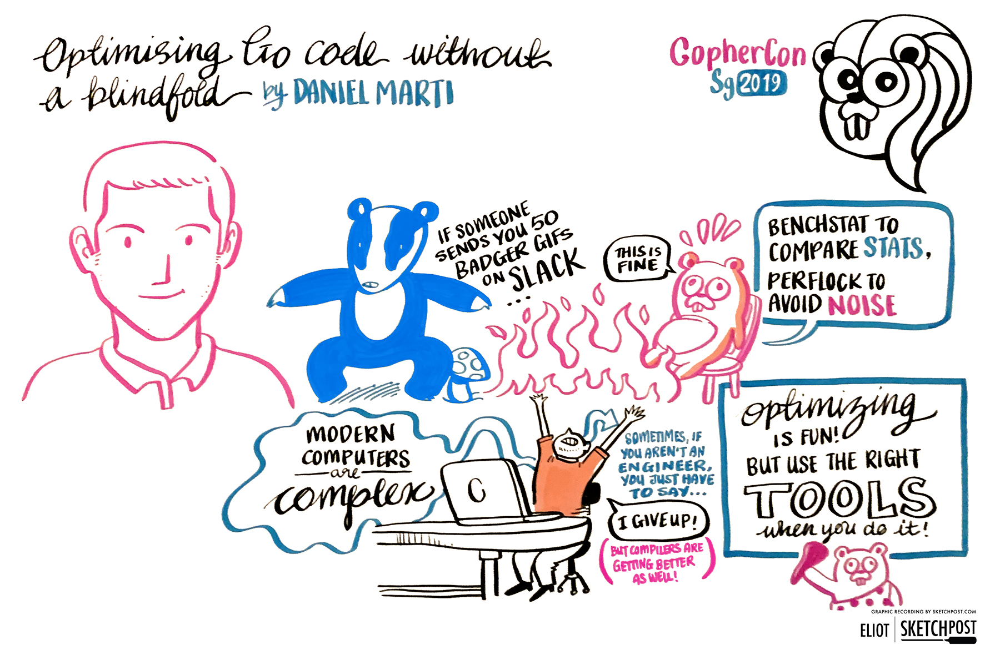
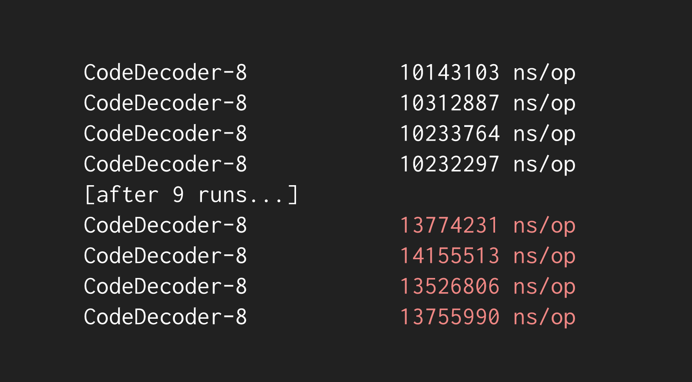
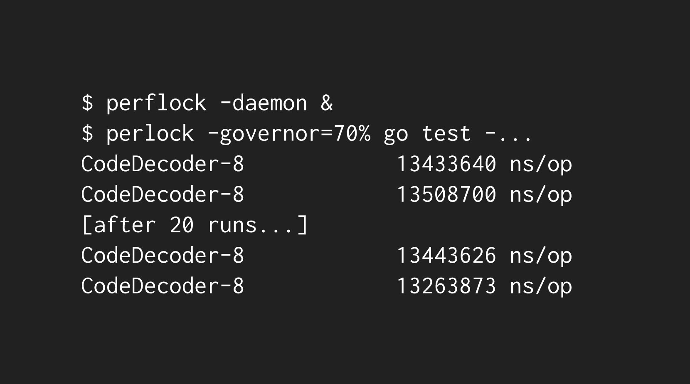

# 非盲目式的Go代码优化

> 原文：[GopherCon 2019 - Optimizing Go Code without a blindfold](https://about.sourcegraph.com/go/gophercon-2019-optimizing-go-code-without-a-blindfold?utm_source=hs_email&utm_medium=email&utm_content=75138236&_hsenc=p2ANqtz--NgfSL80JgQDQ5zlr3v6AQmsSI149ot4H7UuBdOvbfawqznjkfU7-fXFNbZ3-aZabzoJ7VKB6tCG9BjG21uiDA5_1Kz1nhO5aUV5PiHggYz3MBTEg&_hsmi=75138236)



> 译者采用的go版本为1.12.5

## 概览

人人都想程序跑得更快，而这个目标借助Go的性能测试是很容易实现的。优化程序可能会相当复杂，需要耗费精力仔细斟酌正确的姿势。本文将会展示业余的性能优化者所必须的技巧和工具。

## Go性能测试  

你是否想知道怎么确定你的代码是否慢？它能否跑得更快？如果是的话，你上手的第一件工具应该是性能测试。

Go的标准库`testing`有用于测量代码的CPU和内存消耗的工具。看个简单例子

```go
func copyList(in []string) []string {
	var out []string
	for _, s := range in {
		out = append(out, s)
	}

	return out
}
```

性能测试代码如下

```go
func BenchmarkCopyList(b *testing.B) {
	b.ReportAllocs()
	for i := 0; i < b.N; i++ {
		copyList(input)
	}
}
```

启动测试得到如下输出，由输出可知：这个简单函数每次调用大约耗费244ns，附带不少内存分配。

```bash
go test -bench=.
BenchmarkCopyList-4   	 5000000	       244 ns/op	     240 B/op	       4 allocs/op
```

能优化吗？可以借助[pprof](https://golang.org/pkg/runtime/pprof/)工具查看哪行代码比较耗时：

```bash
go test -cpuprofile=cpu.out -bench=.

go tool pprof cpu.out

# 输出
Type: cpu
Time: Aug 3, 2019 at 3:50pm (CST)
Duration: 1.63s, Total samples = 1.52s (93.09%)
Entering interactive mode (type "help" for commands, "o" for options)
(pprof) list copyList
Total: 1.52s
ROUTINE ======================== code.copyList in /xxxx/code/demo.go
      60ms      560ms (flat, cum) 36.84% of Total
         .          .      1:package code
         .          .      2:
         .          .      3:func copyList(in []string) []string {
         .          .      4:	var out []string
      10ms       10ms      5:	for _, s := range in {
      50ms      550ms      6:		out = append(out, s)
         .          .      7:	}
         .          .      8:
         .          .      9:	return out
         .          .     10:}
```

由上可知，大部分时间都用在`append`操作上面了！好在通过预分配切片然后给每个元素赋值的方式来简单修正。

```go
func copyList(in []string) []string {
	out := make([]string, len(in))
	for i, s := range in {
		out[i] = s
	}

	return out
}
```

看一下性能提升程度，这时需要[benchcmp](https://github.com/golang/tools/tree/master/cmd/benchcmp)工具--展示同一个性能测试两次执行结果的性能变化：

```bash
go get -u -v golang.org/x/tools/cmd/benchcmp

# with the copyList from code/demo.go
go test -bench=. > old.txt
# with the copyList from code/demo_optimized.go
go test -bench=. > new.txt

benchcmp old.txt new.txt

# 对比结果如下
benchmark               old ns/op     new ns/op     delta
BenchmarkCopyList-4     237           67.8          -71.39%

benchmark               old allocs     new allocs     delta
BenchmarkCopyList-4     4              1              -75.00%

benchmark               old bytes     new bytes     delta
BenchmarkCopyList-4     240           96            -60.00%
```

🎉 哇!!🎉 性能飙升不少呐。

## 但是，性能测试信得过吗？

上一节的例子简单了点，现实需要性能测试的生产级代码往往要复杂得多。让我们转到标准库的[encoding/json](https://golang.org/pkg/encoding/json/) 包看个资源密集型的例子。范围确定一下，就是 [BenchmarkCodeDecoder](https://github.com/golang/go/blob/919594830f17f25c9e971934d825615463ad8a10/src/encoding/json/bench_test.go#L148-L171) 测试.

稍微跑多几次的话，你会发现性能测度每次都有所不同：

```bash
cd $GOROOT/src/encoding/json

go test -bench=CodeDecoder
go test -bench=CodeDecoder
go test -bench=CodeDecoder
go test -bench=CodeDecoder
go test -bench=CodeDecoder

# 结果对比如下
BenchmarkCodeDecoder-4   	     100	  19056070 ns/op	 101.83 MB/s
BenchmarkCodeDecoder-4   	     100	  19120626 ns/op	 101.49 MB/s
BenchmarkCodeDecoder-4   	     100	  18875387 ns/op	 102.80 MB/s
BenchmarkCodeDecoder-4   	     100	  20058788 ns/op	  96.74 MB/s
BenchmarkCodeDecoder-4   	     100	  20389545 ns/op	  95.17 MB/s
```

+/-3%的变动看起来不值得让我们失眠，像`encoding/json`这样的包通常会稍有加速--事实上，`encoding/json`的最新4次性能提升都小于4%。干扰因素纷繁复杂，我们该如何确定一次变动是否真正地影响了一个包的性能呢？

这时就得数据说话了。

## 性能测试 <3 的数据

为了理解某个包的真正性能特征，我们通常会看性能测试多次运行的结果，然后计算中位数和方差。这时可以用到[benchstat](https://godoc.org/golang.org/x/perf/cmd/benchstat)命令：

```bash
go get -u -v golang.org/x/perf/cmd/benchstat

go test -bench=CodeDecoder -count=8 > ~/old.txt

#结果如下
name           time/op
CodeDecoder-4    21.7ms ±18%

name           speed
CodeDecoder-4  90.5MB/s ±16%
```

16%的方差仍然是相当高的。要降低它的话，我们得看看CPU还干了啥。理想情况下，性能测试会愉快地拼命占用CPU，因此CPU会尽可能地被它压榨到0%。但事实是，你可能手头打开了Slack、编辑器还有20多个Chrome标签页。（有趣事实：[Slack中的动态表情通常消耗大量CPU](https://news.ycombinator.com/item?id=14087899)）

关掉这些资源贪心型应用足够把我们的方差降到+/-5%。

```bash
go test -bench=CodeDecoder -count=8 > ~/new.txt

# 新结果如下
name           time/op
CodeDecoder-4   18.7ms ± 5%

name           speed
CodeDecoder-4  104MB/s ± 5%
```

然后，CPU的问题还不至于此。一次性运行多次性能测试，会发现性能因不明原因明显下降。



> 译者注：上述现象在本人电脑上并不明显

这种情况是因为上述性能测试100%占用CPU太久触发CPU降频了。好在有另一个工具--[perflock](https://github.com/aclements/perflock) -- 用于防止性能测试一下子占用太多CPU：



上述例子中，我们限定性能测试的CPU利用率为不超过70%，足以防止电脑降低CPU的频率了。

`benchstat`可分析多次性能测试然后计算中位数和方差，还可以用于帮助理解某次代码变更对性能的影响。看个例子：

```bash
go test -bench=CodeDecoder -count=8 > ~/old.txt  
go test -bench=CodeDecoder -count=8 > ~/new.txt  

benchstat ~/old.txt ~/new.txt

# 输出
name           old time/op    new time/op    delta
CodeDecoder-4    21.0ms ±16%    21.0ms ± 9%   ~     (p=0.798 n=8+8)

name           old speed      new speed      delta
CodeDecoder-4  92.9MB/s ±14%  92.7MB/s ± 9%   ~     (p=0.776 n=8+8)
```

可见，新代码平均情况下运行需要21.0ms vs 21.0ms... 嗯？
好在`benchstat`在底部提供上下文数据帮助我们理解优化是否有明显的数据提升。对比两次性能测试，我们通常看到的是`+/-X.XX%`而不是`~`形式的变化。然后，当前情形的高`p`值（0.776）让`benchstat`裁定本次优化效果不明显。而什么是`p`值呢？假设变更对代码性能没影响，把`p`值看做`benchstat`报告至少如刚才所见般性能提升的概率。越低的`p`值意味着`benchstat`发现的性能提升在没有显著优化时的发生概率是越低的，因此`p`值越低越好。

> 译者注：这个测试在本人电脑上也不准

再来个惊喜--其实上面是同一份代码的两次执行！`p=0.776`是相当糟糕的。通常`p<=0.05`才意味着一次优化是显著的。

## 性能测试小结  

理解上述内容后，我们现在就可以编写性能测试，用`benchstat`来检测代码的性能，然后用`pprof`发掘潜在优化点，且基于`perlock`+`benchstat`测试它们。

## 再看看：编译器优化  

我们可能都听说过[摩尔定律](https://en.wikipedia.org/wiki/Moore%27s_law)--计算能力（即集体管数目）每18个月会翻一番。但[Proebsting定律](http://proebsting.cs.arizona.edu/law.html)呢？它推测编译器的进步每18年会使得计算能力翻一番。听起来稀松平常，但是这暗示着编译器也是可以带来显著性能提升的哟！了解性能测试不少后，现在让我们也聊一聊Go编译器优化性能的一些方式。

学习编译器的骚操作前，建议读一下[cmd/compile](https://github.com/golang/go/blob/master/src/cmd/compile/README.md)的文档以对Golang的编译器有个宏观的了解。

## 函数内联  

`go build`时，可通过`-gcflags`标识给编译器传参。例如，如果你传了两个`-m`标识，编译器会汇报它能够却没有内联的函数：

```bash
go build -gcflags="-m -m" io 2> io.txt

cat io.txt | grep 'function too complex'

# 部分输出
io.go:289:6: cannot inline WriteString: function too complex: cost 136 exceeds budget 80
```

这项技巧有助于发现能够优化的函数，促使编译器内联它们。

## 堆的内存分配  

`-m -m`标识也能用于发现表达式逃逸到堆而触发内存分配的情形。看到热函数请求大量内存分配时，这个技巧可以帮我们查原因：

```bash
go build -gcflags="-m -m" io 2> io.txt

cat io.txt | grep 'escapes to heaear'

# 部分输出
io.go:293:23: ([]byte)(s) escapes to heap
```

## 边界检查
每次索引切片时，golang编译器会对切片生成边界检查。golang编译会执行一轮优化（成为balance check elimination，简称`bce`），将认定为静态安全的索引操作的检查移除掉。通过设置不同级别的调试查看这些检查是否能够从你的代码移除：

```bash
go build -gcflags=-d=ssa/prove/debug=1 io 2> io.txt
cat io.txt

io.go:446:8: Proved IsSliceInBounds
```

另一个调试级别的结果如下
```bash
go build -gcflags=-d=ssa/prove/debug=2 io 2> io.txt
~ cat io.txt

# 部分输出
multi.go:59:14: x+d >= w; x:v24 b6 delta:1 w:0 d:signed
```

## 清空Maps
Go 1.11之前，清空map最高效的方式是用新分配的map覆写它。但是，这其实不是非常高效的。从Go 1.11起，我们可以遍历map的键，逐个删除它们，聪明的编译器会优化这项操作，免得你新分配一下map！

```go
// replace a map
m = make(map[string]string)

// clear a map; faster since Go 1.11!
for k := range m {
	delete(m, k)
}
```

## 检查字符串长度  

类似地，之前计算字符串长度的有效方式是遍历计算其中rune的个数。现在可以简化为检查rune切片的长度了：

```go
// count manually
n := 0
for range str {
	n++
}

// simple, and fast since Go 1.11!
n := len([]rune(str))
```

总而言之，可以考虑编写一些能够让编译器优化的代码。

## 多说一句：SSA分析  

如果读过@TODO 上面的Go编译器文档，你应该了解到Go编译器基于源代码的SSA（Static Single Assignment）形式进行优化。用他们的话讲：“这个阶段，AST会被转换为Static Single Assignment (SSA)形式，一种具有特定属性的、更低层次的中间表示法，这种表示法使得优化更加容易实现，并用于最终机器码的生成。”

`go build`时设定一个特殊的环境变量--`GOSSAFUNC`，我们就可以查看相应包函数的SSA输出了：

给定代码如下
```bash
package code

func HelloWorld() {
        println("hello, world!")
}
```

生成`HelloWorld`程序的SSA报表。
```bash
GOSSAFUNC=HelloWorld go build

# 用浏览器打开生成的ssa.html即可看到SSA的形式
# code
dumped SSA to ./ssa.html
```

如有兴趣，可以通过[Go的介绍文档](https://github.com/golang/go/blob/master/src/cmd/compile/internal/ssa/README.md)了解其编译器的更多内部机理。

演讲的幻灯片参见[这里](https://docs.google.com/presentation/d/e/2PACX-1vQ9aFgICdqCz5pjrVJ4zFZrWtTKbfGYFPCOKsScomkLoE1Kzk3DVd9-u4k_XgZekqJ7nl-YTy4lD8Uq/pub)。