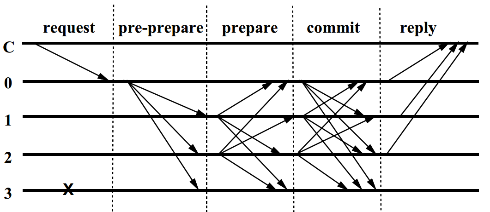

## 1. 前提假定
### 1.1 同步模型
在分布式系统中谈论共识，首先需要明确系统同步模型是**完全同步**、**异步**还是**部分同步**?

- 完全同步：节点所发出的消息，在一个确定的时间内，肯定会到达目标节点；
- 异步：节点所发出的消息，不能确定一定会到达目标节点；
- 部分同步：节点发出的消息，虽然会有延迟，但是最终会到达目标节点。

完全是十分理想的情况。如果假设分布式系统是一个同步系统，共识算法的设计可以简化很多。在同步系统中，只要超时没收到消息就可以认为节点除了问题。异步是更为贴近实际的模型，但是根据 FLP 不可能性原理，在异步假定下，共识算法不可能同时满足安全性（safety）和活跃性（liveness）。为了设计能够符合实际场景的共识算法，目前的 BFT 类共识算法多是基于部分同步假定，这在 PBFT 论文中被称为"weak synchrony"。

PBFT 假设系统是异步的，节点通过网络连接，消息会被延迟，但是不会被无限延迟。

### 1.2 容错类型
PBFT 假定错误可以是拜占庭类型的，也就是说可以是任意类型的错误，比如节点作恶、说谎等。这有别于节点崩溃类型的错误，RAFT、Paxos 这类共识算法只能允许节点崩溃类型错误，节点只能崩溃而不能产生假消息。

对于拜占庭类错误，给定总节点数为 `n`，系统可能存在 `f` 个拜占庭节点，假如需要根据节点发送过来的消息做判断。为了共识正常进行，在收到 `n-f` 个消息时，就应该进行处理，因为可能有 `f` 个节点根本不发送消息。现在我们根据收到的 `n-f` 个消息做判断，原则是至少有 `f+1` 个相同结果。但在收到的 `n-f` 个消息中，不能确定其中没有错误节点过来的消息，其中也可能存在 `f` 个假消息，应该保证 `n-f-f>f`，即 `n>3f`。

另一种证明方式如下，假设 `n=3f`，当前共识由其中一个拜占庭节点主导，`f` 个拜占庭节点合谋将其他 `n-f=2f` 个节点均分为两组 A 和 B，分别给 A 和 B 发送不同的消息 M1 和 M2，最后汇总消息可得 `2f` 个 M1 和 `2f` 个 M2，无法达成共识= =。一旦 `n>3f`，则最后 M1 和 M2 的票数必定不等，以多数方的为准即可。

#### 系统模型
一组节点构成状态机复制系统，一个节点作为主节点，其他节点作为副本节点。某个节点作为主节点时，这称为系统的一个视图（view）。当节点出了问题，就进行视图更新，切换到下一个节点担任主节点。主节点更替不需要选举过程，而是采用依序轮替的方式：以视图编号指定的节点为主节点。

系统的主节点接收客户端的请求，并产生预准备（pre-prepare）消息，进入共识流程。

系统需要满足如下两个条件
- 确定性：在一个给定状态上的操作，产生一样的执行结果
- 每个节点都有一样的起始状态

要保证非故障节点（包括拜占庭节点和被拜占庭节点误导的节点）对于执行请求的全局顺序达成一致。

### 1.3 安全性和活跃性
- 安全性：坏的事情不会发生，即共识系统不能产生错误的结果，比如一部分节点说 yes，另一部分说 no。在区块链的语义下，指的是不会分叉。
- 活跃性：好的事情一定会发生，即系统一直有回应，在区块链的语义下，指的是共识会持续进行，不会卡住。假如一个区块链系统的共识卡在了某个高度，那么新的交易是没有回应的，也就是不满足活跃性。

## 2. 常规流程
正常状态下的共识流程可以用论文的配图清晰表示如下

共识过程由三个阶段构成，**预准备**（pre-prepare）阶段和**准备**（prepare）阶段确保了在同一个视图下，正常节点对于消息 `m` 达成了全局一致的顺序，用`Order<v,m,n>` 表示，在视图为 `v` 下，正常节点都会将消息 `m` 定序为 `n`。接下来的**提交**（commit）阶段投票，再配合上**视图切换**实现即使视图切换也可以保证对于 `m` 的全局一致顺序，即 `Order<v+1,m,n>`，视图切换到 `v+1`, 依然会认定消息 `m` 的序号为 `n`。

### 预准备阶段
主节点收到请求 `m` 后，给请求 `m` 分配一个序号 `n`，并广播给其他节点。副本节点收到后会将消息保存到本地日志。

预准备阶段的消息格式 `<<PRE-PREPARE,v,n,d>_p, m>`，其中
- `v` 表示当前编号
- `n` 是给 `m` 分配的序号
- `d` 为 `m` 的哈希
- `m` 为消息原文
- `_p` 表示被主节点签名

其他副本节点收到预准备消息时，会依次做如下几步操作：

1. 签名验证
2. 消息是本节点当前视图的消息
3. 本节点在 `v` 视图下，还没有收到序号 `n 的其他消息
4. 收到的消息序号 `n` 在当前接收窗口内 `(h, H)`

以上都通过则接受该消息，并广播准备消息进入准备阶段。
一旦副本节点接受 `<<PRE-PREPARE,v,n,d>_p, m>`，则该节点进入到准备阶段，然后节点广播准备消息 `<<PREPARE,v,n,d,i>_i>` 之后，节点将消息加入到本地的日志。

### 准备阶段
节点收到准备消息时，会验签并检查是否是当前视图的消息，同时检查消息序号 `n` 是否在当前的接收窗口内，验证通过则接受该消息，保存到本地日志。

当节点达成以下 3 点时，则表明节点达成了准备完毕状态，记为 `prepared(m,v,n,i)`。

- 日志中存在消息 `m`
- 日志中存在 `m` 的预准备消息 `pre-prepare(m,v,n)`
- 日志中存在 `2f` 个来自其他节点的准备消息 `prepare(m,v,n,i)`

至此，可以确保在视图不发生切换的情况下，为消息 `m` 分配全局一致的序号。

也就是说，在视图不变的情况下:

1. 一个正常节点 i，不能对两个及以上的不同消息，达成相同序号 `n` 的准备完毕状态，即不能同时存在 `prepared(m,v,n,i)` 和 `prepared(m',v,n,i)`
     - 简要证明：假如正常节点 i 对于消息 `m` 达成了 `prepared(m,v,n,i)`，同时存在一个 `m'`，也达成了 `prepared(m',v,n,i)`。首先对于`prepared(m,v,n,i)`，肯定有 `2m+1` 个节点发出了 `<prepare,m,v,n>` 消息。对于 `prepared(m',v,n,i)`，肯定也有 `2f+1` 个节点发出了`<prepare,m',v,n>`。`2*(2f+1) - (3f+1) = f+1`，所以至少有 `f+1` 个节点，既发出了 `<prepare,m,v,n>`，又发出了 `<prepare,m',v,n>`，这明显是拜占庭行为。也就是说，至少有 `f+1` 个拜占庭节点，而这与容错条件相矛盾。
2. 两个正常节点 i 和 j 必须对相同的消息 `m` 达成相同序号 `n` 的准备完毕状态，即 `prepared(m,v,n,i) && prepared(m,v,n,j)`
     - 简要证明：假如两个正常节点 i 和 j 分别对不同的消息 `m` 和 `m'`，达成序号 `n` 的准备完毕状态。首先对于 `prepared(m,v,n,i)`，肯定有 `2f+1` 个节点发出了 `<prepare,m,v,n>` 消息。对于 `prepared(m',v,n,j)`，肯定也有 `2f+1` 个节点发出了 `<prepare,m',v,n>`。`2*(2f+1) - (3f+1) = f+1`，所以至少有 `f+1` 个节点，既发出了 `<prepare,m,v,n>`，又发出了 `<prepare,m',v,n>`，这明显是拜占庭行为。也就是说，至少有 `f+1` 个拜占庭节点，而这与容错条件相矛盾。

准备完毕状态是十分重要的，涉及到视图转换时，为了保证切换前后的安全特性，需要将上一轮视图的信息传递到新的视图，而 PBFT 就是通过将准备完毕状态的信息传递到新的视图来保证安全性的。可以这么理解：新视图需要在上一轮视图的准备完毕信息基础上，继续进行共识。

达成准备完毕状态以后，节点会广播提交消息 `<COMMIT,v,n,d,i>_i`。

### 提交阶段
节点接收提交消息后，会像收到准备消息一样进行几步验证已确定是否接受该消息。

当节点 i 达成了准备完毕状态，并且收到了 `2f+1` 个 `commit(v,n,d,i)` 消息，则该节点达成了 `commit-local(m,v,n,i)` 状态。

达成 `commit-local` 之后，节点对于消息 `m` 就有了全局一致的序号，可以执行该消息并回复结果给客户端了。

`commit-local` 状态说明有 `2f+1` 个节点达成了准备完毕状态，即为固定了对 `m` 的序号。

## 3. 垃圾回收
实际的消息日志不可能无限大，因此需要设定检查点（checkpoint），用于定期清理过时消息。

直观的做法就是，每隔一段时间（在序号 `n%100 == 0` 时），确认每个节点都已经执行完第 `n` 个消息了。这样就可以清除掉比 `n` 还要早的消息了。

PBFT 论文也是通过投票实现的：当一个节点执行完第 `n` 个消息后，就广播 `<CHECKPOINT,n,d,i>` 消息。节点收集到 `2f+1` 条 `CHECKPOINT` 消息后，就产生一个本地的检查点，然后清除掉比 `n` 小的消息，然后将接收消息的窗口调整为 `(n, n+100)`。

## 4. 视图切换
视图切换是 PBFT 最为关键的设计，保证了共识系统的安全性和活跃性。

当节点检测到超时时，会发送视图切换消息，进入视图切换流程，相关消息 `<VIEWCHANGE, n, C, P, i>` 格式如下

- `n`: 消息序号，本节点最近的一个检查点所确定的序号
- `C`: 对应于 `n` 的 `2f+1` 个 `CHECKPOINT` 消息集合
- `P`: 准备消息 `Pm` 组成的集合，`Pm` 表示序号为 `m` 的、达成准备完毕状态的消息集合。`Pm` 的内容包含关于 `m` 的 1 条预准备消息和 `2f` 条准备消息组成的集合。
- `i`: 节点 ID

由消息结构可以看出，节点发出视图切换消息时，将本地的准备完毕状态的信息打包到了消息中，传递给后续的视图。

当 `view+1` 所对应的主节点收到 `2f` 个有效的视图切换消息，它就会广播 `<NEW-VIEW,v+1,V,O>` 消息；
- `V` 是视图切换消息集合
- `O` 是预准备消息的集合，按照如下的过程计算：
  - 主节点根据收到的视图切换消息判断，最新（其他文章都说是最低的，个人觉得不对）的检查点 `s` 和 `Pm` 里面最高的序列号 `t`
  - 对介于 `s` 和 `t` 之间的每个序号 `n` 创建预准备消息。这分两种情况：
    1. P 集合存在至少一个序号为 `n` 的 `Pm`：创建一个预准备消息 `<PRE-PREPARE, v+1, n, d>`
    2. 集合为空：创建新的 `<PRE-PREPARE, v+1, n, d_null>`

可以这样理解，在新视图中，节点是在上一轮视图中各个节点的准备完毕状态基础上进行共识流程的。

发生视图转换时，需要的保证的是：如果视图转换之前的消息 `m` 被分配了序号 `n`, 并且达到了已准备状态，那么在视图转换之后，该消息也必须被分配序号 `n`(安全性)。因为达到准备完毕状态以后，就有可能存在某个节点 `commit-local`。要保证对于 `m` 的 `commit-local`，在视图转换之后，其他节点的 `commit-local` 依然是一样的序号。

## 5. FAQ

### 3 阶段消息解决什么问题
前面提到，PBFT 解决的是拜占庭问题的一致性，即让非拜占庭节点达成一致。更具体的说：在视图 `v` 为消息 `m` 定序为 `n`，并且执行 `m`，向客户端发送响应。

### 为什么不能只有前 2 个阶段消息
这个问题的等价问题是：为什么预准备加上准备消息不能让非拜占庭节点达成一致？

预准备消息的目的是：主节点为请求 `m`，分配视图 `v` 和序号 `n`，让至少 `f+1` 个非拜占庭节点对这个分配组合 `<m, v, n>` 达成一致，并且不存在`<m', v, n>`，即不存在有 2 个消息使用同一个 `v` 和 `n` 的情况。

准备完毕状态可以证明非拜占庭节点在请求 `m` 使用 `<v, n>` 上达成一致。主节点本身是认可 `<m, v, n>` 的，所以副本只需要收集 `2f` 个准备消息，而不是 `2f+1` 个准备消息，就可以计算出至少 `f` 个副本节点是非拜占庭节点，它们认可 `m` 使用 `<v, n>`，并且没有另外消息可以使用 `<v, n>`。

既然 `<v, n>` 只能对应 1 个请求 `m`，达到准备完毕状态后，副本 i 执行请求 `m`，不就达成一致了么？

并不能。**准备完毕是一个局部视角**，不是全局一致，即副本 i 看到了至少 `f+1` 非拜占庭节点认可了 `<m, v, n>`，但整个系统包含 `3f+1` 个节点。异步的系统中，存在丢包、延时、拜占庭节点故意向部分节点发送准备消息等拜占庭行为，**副本 i 无法确定其他副本也达到准备状态**。如果少于 `f` 个副本成为准备完毕状态，而当前副本 i 却执行了请求 `m`，系统就出现了不一致。

所以，前 2 个阶段的消息，并不能让非拜占庭节点达成一致。

如果了解 2PC 或者 Paxos，我相信可以更容易理解上面的描述。2PC 或 Paxos 的第一步只是用来锁定资源，第而步才是真正去执行操作。把预准备和准备理解为第一步，资源是 `<v, n>`，只有第一步是达不成一致性的。

### 2 个不变性
PBFT 的论文提到了 2 个不变性。这 2 个不变性，用来证明 PBFT 如何让非拜占庭节点达成一致性。

第 1 个不变性是由预准备和准备消息所共同确保的不变性：非拜占庭节点在同一个视图内对请求的序号达成共识。关于这个不变性，已经在 "为什么不能只有前 2 个阶段消息" 小节论述过。

介绍第 2 个不变性之前，需要介绍 2 个定义。

- 本地已提交（committed-local）：副本 i 已经是准备完毕状态，并且收到了 `2f+1` 个提交消息。
- 提交完毕（committed）：至少 f+1 个非拜占庭节点是准备完毕状态。

第 2 个不变性表明如果副本 i 是本地已提交，那么一定满足已提交状态。

`2f+1` 个提交消息，去掉最多 `f` 个拜占庭节点伪造的消息，得出至少 `f+1` 个非拜占庭节点发送了提交消息，即至少 `f+1` 个非拜占庭节点是准备状态。所以第 2 个不变性成立。

### 为什么 3 个阶段消息可以达成一致性
提交完毕意味着有 `f+1` 个非拜占庭节点可以执行请求，而本地已提交意味着副本 i 看到了有 `f+1` 个非拜占庭节点可以执行请求。一旦 `f+1` 个非拜占庭节点执行请求，即可达成非拜占庭节点之间的一致。

虽然我前面使用了 2PC 和 Paxos 做类比，但不意味着 PBFT 的提交阶段就相当于 2PC 和 Paxos 的第 2 步。因为 2PC 和 Paxos 处理的 CFT 场景，不存在拜占庭节点，它们的主节点充当统计功能，统计有多少节点完成第一步。PBFT 是存在拜占庭节点的，主节点并不是可靠(信)的，不能依赖主节点统计是否有 `f+1` 个。

## 6. 小结
- PBFT 是在previous轮次中的第一轮投票结果基础上继续共识流程。
- BFT 类共识需要保证安全性和活跃性，安全性可以在异步假设下达成，活跃性需要弱同步假设
- PBFT 的核心设计是视图切换，巧妙的在视图切换消息里面添加准备完毕信息，实现将之前视图状态传递到下一轮，但是这样导致消息太大了，有些冗余。

## 参考文献
- [Castro, Miguel, and Barbara Liskov. "Practical Byzantine fault tolerance." OSDI. Vol. 99. 1999.][PBFT]
- [对PBFT算法的理解](https://www.cnblogs.com/gexin/p/10242161.html)
- [为什么PBFT需要3个阶段消息？](https://blog.csdn.net/m0_43499523/article/details/104881825)

[PBFT]: http://www.pmg.lcs.mit.edu/~castro/osdi99_html/osdi99.html
