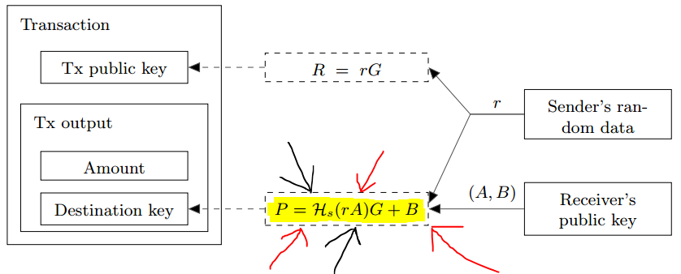

---
---

# 隐形地址(Stealth Address)

## 符号说明

为了描述方便，我们约定

- 大写字母表示椭圆曲线点
- 小写字母表示椭圆曲线方程所在群的某个标量

|   符号 | 含义                                       |
| -----: | :----------------------------------------- |
| `h(Y)` | 将椭圆曲线点转为曲线方程所在群的一个标量值 |
|    `n` | 椭圆曲线所在群的阶                         |
|    `G` | 椭圆曲线的基点                             |

## 原理

[Cryptonote 白皮书](https://cryptonote.org/whitepaper.pdf)描述的**双密钥隐形地址**如下

其中，黄色高亮部分即为我们关注的隐形地址`P=h(r*A)*G+B`

双密钥指的是输出地址由**花费密钥**和**查看密钥**两个密钥组成

- 公开的**查看密钥**会消除输出的不可关联性
- 只要**花费密钥**是保密的，相应的输出就无法被盗用

给定交易双方 Alice 和 Bob，

- Alice 的花费密钥对为`(w,W)`，对应的查看密钥对为`(x, X)`
- Bob 的花费密钥对为`(y,Y)`，对应的查看密钥对为`(z, Z)`

Alice 要想 Bob 转账的流程如下

### Alice 计算 Bob 的隐形地址

- 输入: Bob 的查看公钥`Z`
- 输出: 随机数`r`和椭圆曲线点`R=r*G`，Bob 的隐形地址`P`
- 流程
  1. 生成范围`[1, n)`内的随机整数`r`，计算`R=r*G`
  2. 以`P=h(r*Z)*G+Y`作为 Bob 的收款地址即可

> 每笔交易应重新随机选取`r`，重用`r`给同一个收款地址转账会导致隐形地址碰撞而暴露隐形地址间的关联性。除非用于向第三方证明自己确实已经向 Bob 转账，`r`在计算得到`P`后可废弃。  
> `R`需要以明文形式放到交易里。

### Bob 筛选属于自己的交易输出

- 输入: 一笔交易输出`txOut`的地址`P`和曲线点`R`，花费密钥对`(y,Y)`，查看密钥对`(z, Z)`
- 输出: 用于签发这笔输出的私钥`b`或`false`
- 流程
  1. 计算`P'=h(z*R)*G+Y`
  2. 如果`P!=P'`，则可断定`txOut`的收款方不是本人，输出`false`
  3. 计算并输出将来用于签发交易的私钥`b=h(z*R)+y`

## 分析

### 优点

- 用户需要维护的公私钥只有一对，无须采用[层次钱包](https://github.com/bitcoin/bips/blob/master/bip-0032.mediawiki)生成一堆公私钥

### 缺点

相比于比特币

- 收款方压力增大，需要扫描整个链上的交易，这也是目前门罗币性能的一大瓶颈

## TODO

- 攻击??
- 安全性问题

## References

- [Cryptonote 白皮书](https://cryptonote.org/whitepaper.pdf)
